# 网关重启系统

<cite>
**本文档引用的文件**
- [restart.ts](file://src/infra/restart.ts)
- [lifecycle.ts](file://src/cli/daemon-cli/lifecycle.ts)
- [lifecycle-core.ts](file://src/cli/daemon-cli/lifecycle-core.ts)
- [restart-health.ts](file://src/cli/daemon-cli/restart-health.ts)
- [service.ts](file://src/daemon/service.ts)
- [launchd.ts](file://src/daemon/launchd.ts)
- [systemd.ts](file://src/daemon/systemd.ts)
- [schtasks.ts](file://src/daemon/schtasks.ts)
- [windows-task-restart.ts](file://src/infra/windows-task-restart.ts)
- [config-reload.ts](file://src/gateway/config-reload.ts)
- [server-reload-handlers.ts](file://src/gateway/server-reload-handlers.ts)
- [probe.ts](file://src/gateway/probe.ts)
- [constants.ts](file://src/daemon/constants.ts)
</cite>

## 目录
1. [简介](#简介)
2. [项目结构](#项目结构)
3. [核心组件](#核心组件)
4. [架构概览](#架构概览)
5. [详细组件分析](#详细组件分析)
6. [依赖关系分析](#依赖关系分析)
7. [性能考虑](#性能考虑)
8. [故障排除指南](#故障排除指南)
9. [结论](#结论)

## 简介

网关重启系统是 OpenClaw 生态系统中的关键基础设施组件，负责在不同平台（macOS、Linux、Windows）上可靠地管理和重启网关服务。该系统提供了多种重启策略，包括服务管理器重启、信号重启、热重载和配置驱动的重启机制。

系统的核心特性包括：
- 跨平台兼容性（macOS LaunchAgent、Linux systemd、Windows Scheduled Task）
- 智能健康检查和诊断
- 配置变更检测和自动重启
- 幂等操作和重复重启防护
- 详细的审计日志和故障诊断信息

## 项目结构

网关重启系统由多个相互协作的模块组成，按照功能层次组织：

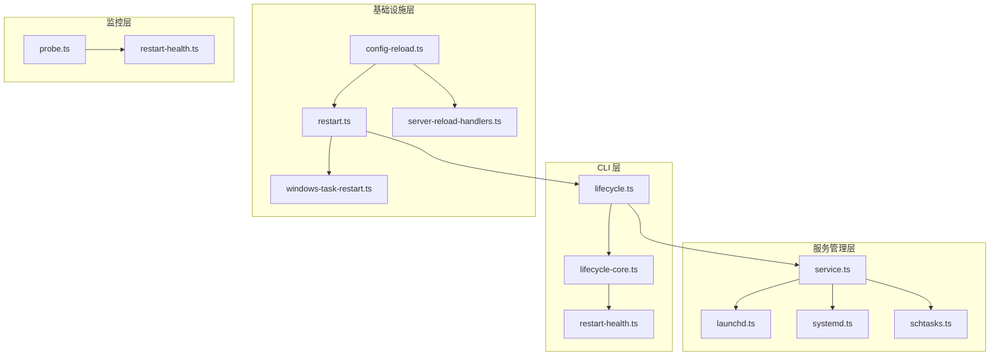

**图表来源**
- [lifecycle.ts:1-332](file://src/cli/daemon-cli/lifecycle.ts#L1-L332)
- [service.ts:1-120](file://src/daemon/service.ts#L1-L120)
- [restart.ts:1-507](file://src/infra/restart.ts#L1-L507)

**章节来源**
- [lifecycle.ts:1-332](file://src/cli/daemon-cli/lifecycle.ts#L1-L332)
- [service.ts:1-120](file://src/daemon/service.ts#L1-L120)
- [restart.ts:1-507](file://src/infra/restart.ts#L1-L507)

## 核心组件

### 1. 重启调度器 (Restart Scheduler)

重启调度器是系统的核心协调器，负责管理所有重启请求和信号处理：

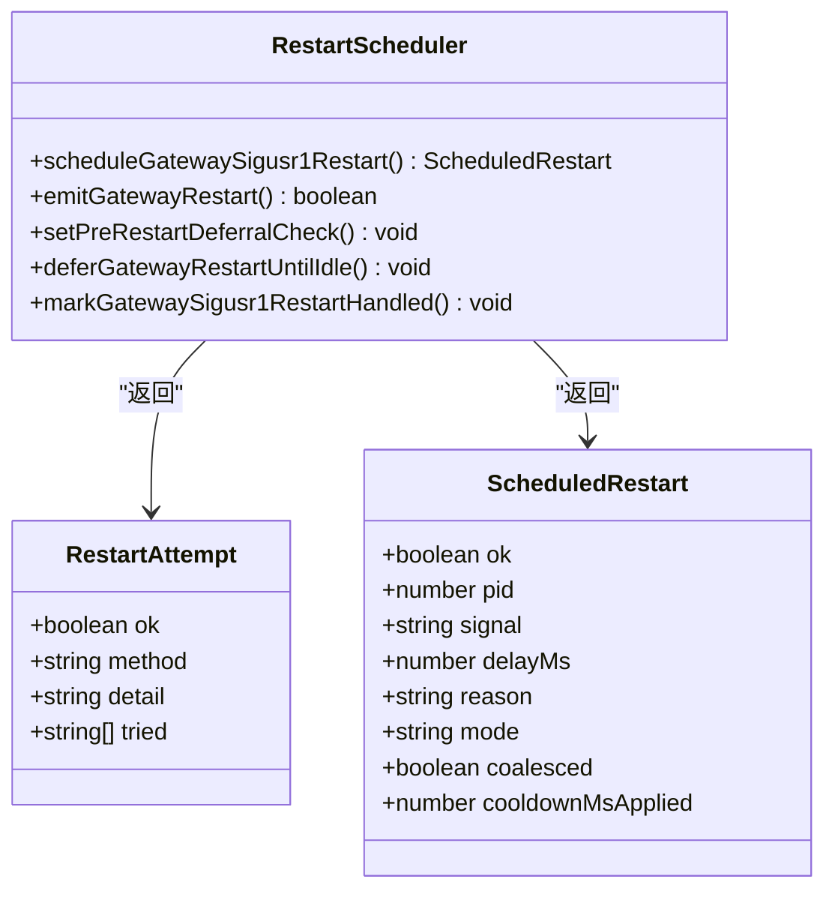

**图表来源**
- [restart.ts:406-492](file://src/infra/restart.ts#L406-L492)
- [restart.ts:293-393](file://src/infra/restart.ts#L293-L393)

### 2. 生命周期管理器 (Lifecycle Manager)

生命周期管理器提供统一的服务控制接口：

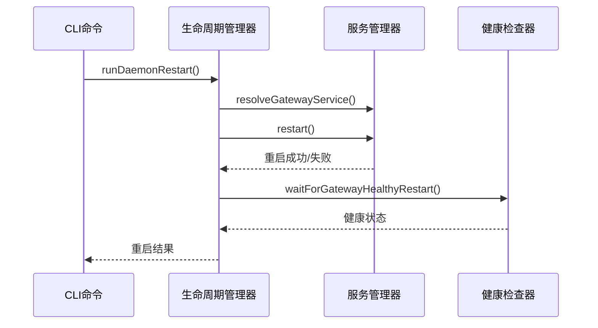

**图表来源**
- [lifecycle.ts:220-331](file://src/cli/daemon-cli/lifecycle.ts#L220-L331)
- [lifecycle-core.ts:314-435](file://src/cli/daemon-cli/lifecycle-core.ts#L314-L435)

### 3. 平台特定服务管理器

每个支持的平台都有专门的服务管理器实现：

| 平台 | 服务管理器 | 主要功能 |
|------|------------|----------|
| macOS | LaunchAgent | 使用 launchctl 管理服务 |
| Linux | systemd | 使用 systemctl 管理用户服务 |
| Windows | Scheduled Task | 使用 schtasks 管理计划任务 |

**章节来源**
- [service.ts:69-120](file://src/daemon/service.ts#L69-L120)
- [launchd.ts:471-526](file://src/daemon/launchd.ts#L471-L526)
- [systemd.ts:570-580](file://src/daemon/systemd.ts#L570-L580)
- [schtasks.ts:316-328](file://src/daemon/schtasks.ts#L316-L328)

## 架构概览

网关重启系统采用分层架构设计，确保了高度的模块化和可维护性：

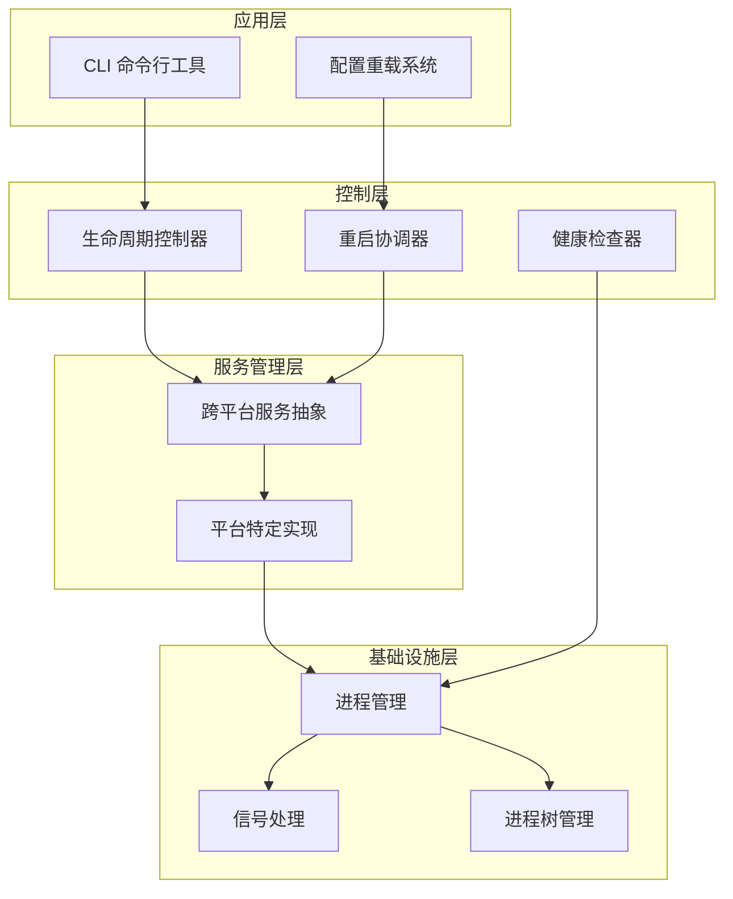

**图表来源**
- [lifecycle.ts:1-332](file://src/cli/daemon-cli/lifecycle.ts#L1-L332)
- [restart.ts:1-507](file://src/infra/restart.ts#L1-L507)
- [service.ts:1-120](file://src/daemon/service.ts#L1-L120)

## 详细组件分析

### 1. 信号重启机制

系统实现了基于 SIGUSR1 信号的优雅重启机制：

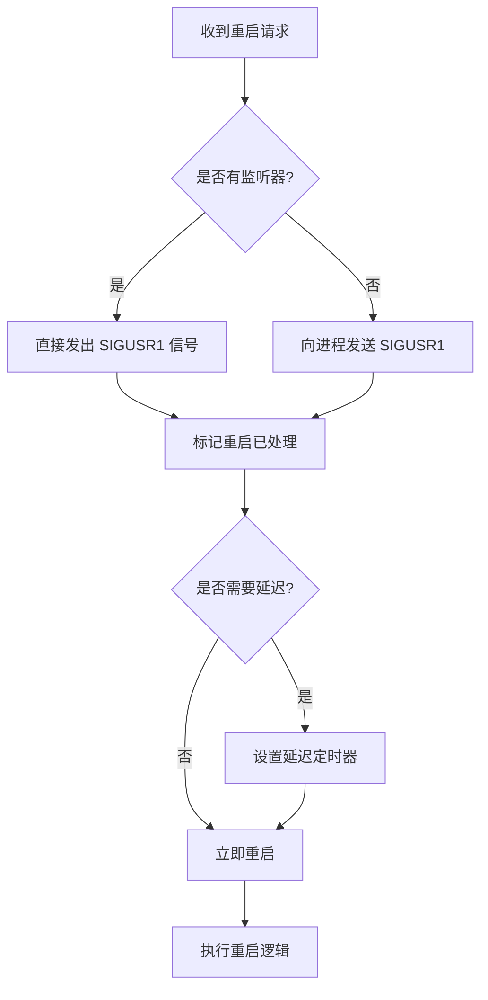

**图表来源**
- [restart.ts:110-132](file://src/infra/restart.ts#L110-L132)
- [restart.ts:468-491](file://src/infra/restart.ts#L468-L491)

### 2. 健康检查系统

健康检查系统提供了多层验证机制：

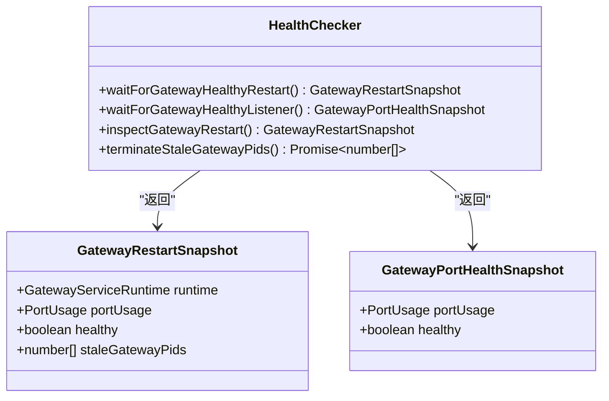

**图表来源**
- [restart-health.ts:19-297](file://src/cli/daemon-cli/restart-health.ts#L19-L297)

### 3. 配置驱动重启

配置重载系统支持智能重启决策：

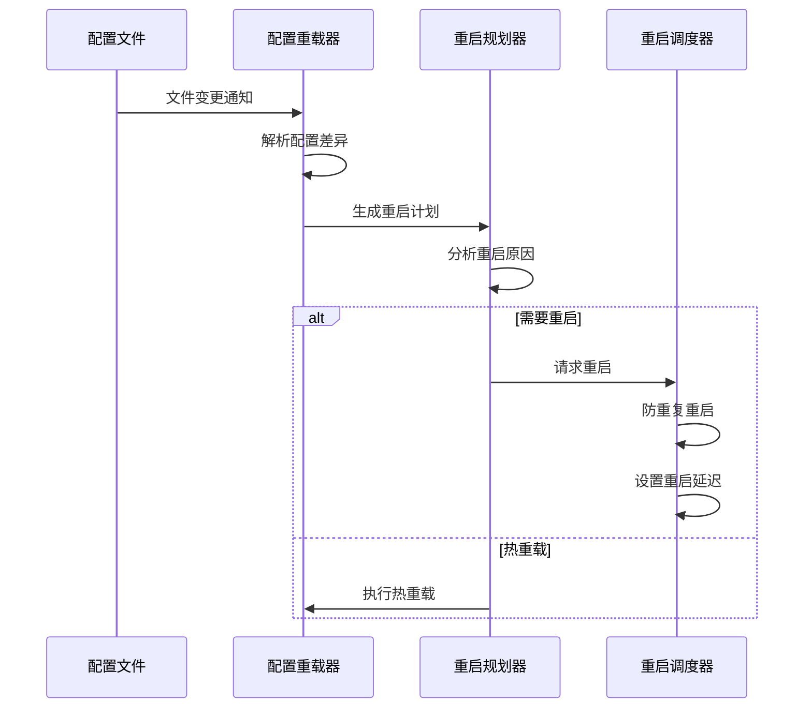

**图表来源**
- [config-reload.ts:72-182](file://src/gateway/config-reload.ts#L72-L182)
- [server-reload-handlers.ts:147-161](file://src/gateway/server-reload-handlers.ts#L147-L161)

**章节来源**
- [restart.ts:100-183](file://src/infra/restart.ts#L100-L183)
- [restart-health.ts:187-243](file://src/cli/daemon-cli/restart-health.ts#L187-L243)
- [config-reload.ts:150-182](file://src/gateway/config-reload.ts#L150-L182)

### 4. 跨平台兼容性

系统通过统一的抽象层实现跨平台兼容：

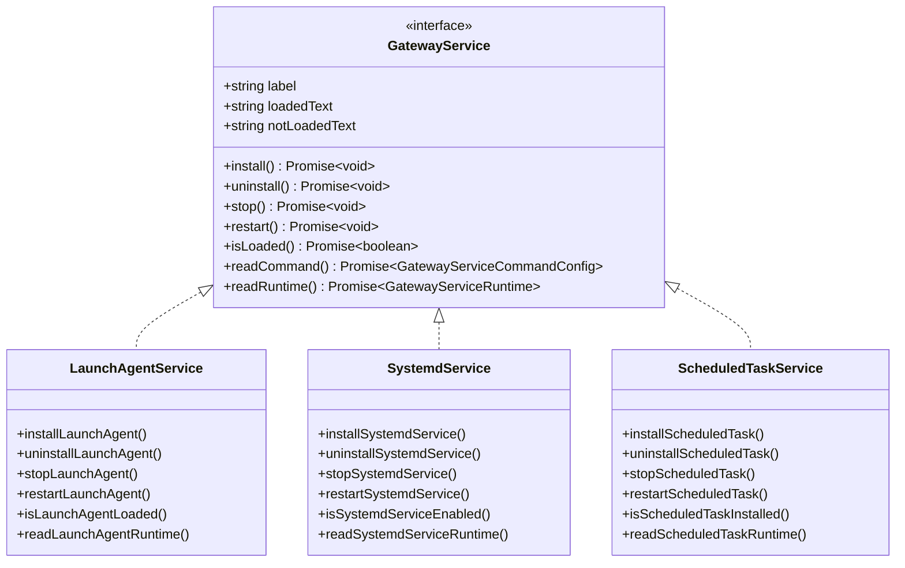

**图表来源**
- [service.ts:54-120](file://src/daemon/service.ts#L54-L120)
- [launchd.ts:393-526](file://src/daemon/launchd.ts#L393-L526)
- [systemd.ts:451-713](file://src/daemon/systemd.ts#L451-L713)
- [schtasks.ts:222-369](file://src/daemon/schtasks.ts#L222-L369)

**章节来源**
- [service.ts:1-120](file://src/daemon/service.ts#L1-L120)
- [constants.ts:1-114](file://src/daemon/constants.ts#L1-L114)

## 依赖关系分析

网关重启系统的关键依赖关系如下：

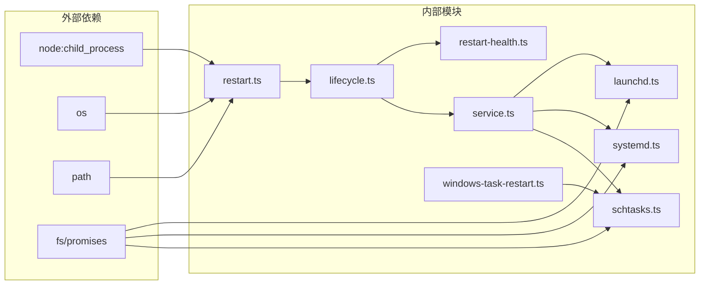

**图表来源**
- [restart.ts:1-11](file://src/infra/restart.ts#L1-L11)
- [lifecycle.ts:1-18](file://src/cli/daemon-cli/lifecycle.ts#L1-L18)

系统的主要依赖注入点包括：
- 进程间通信：通过 `node:child_process` 和信号机制
- 文件系统访问：用于服务配置文件的读写
- 平台特定 API：各平台的服务管理工具调用

**章节来源**
- [restart.ts:1-507](file://src/infra/restart.ts#L1-L507)
- [lifecycle.ts:1-332](file://src/cli/daemon-cli/lifecycle.ts#L1-L332)

## 性能考虑

### 1. 重启延迟优化

系统实现了智能的重启延迟机制：
- 默认延迟：2秒（可配置）
- 冷却期：30秒（防止频繁重启）
- 最大等待时间：90秒（嵌入式压缩工作完成）

### 2. 并发控制

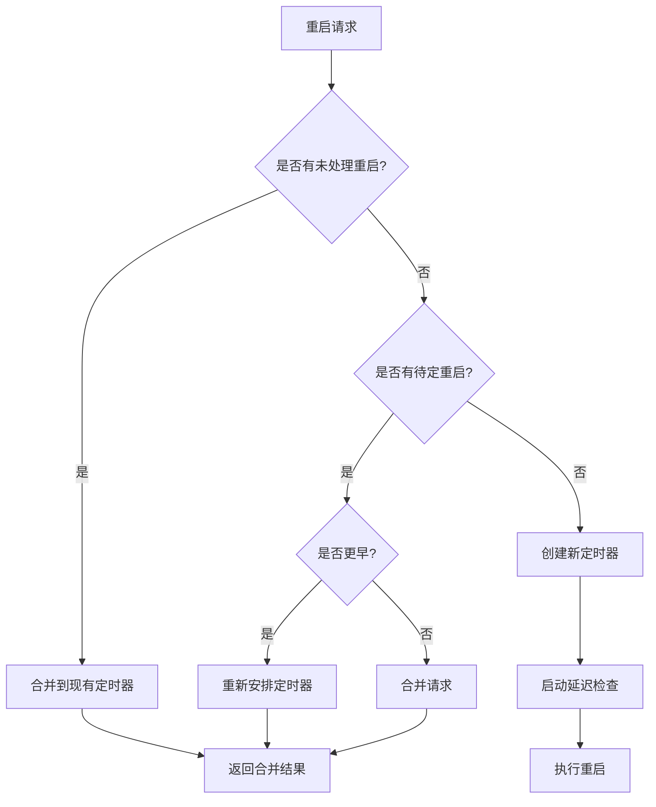

**图表来源**
- [restart.ts:425-491](file://src/infra/restart.ts#L425-L491)

### 3. 资源管理

- 进程树清理：使用 `killProcessTree` 确保完全终止
- 资源清理：重启后自动清理临时文件
- 内存管理：避免内存泄漏，定期清理定时器

## 故障排除指南

### 1. 常见问题诊断

#### 问题：重启超时
**症状**：系统显示 "重启超时" 错误
**诊断步骤**：
1. 检查服务运行状态
2. 验证端口占用情况
3. 查看服务日志文件

#### 问题：权限不足
**症状**：服务管理器调用失败
**解决方案**：
- macOS：确保有 GUI 会话权限
- Linux：检查 systemd 用户作用域
- Windows：以管理员身份运行

#### 问题：配置无效
**症状**：重启被中止，显示配置错误
**解决方法**：
- 运行 `openclaw doctor` 自动修复
- 检查配置文件语法
- 验证环境变量设置

### 2. 诊断工具

系统提供了丰富的诊断功能：

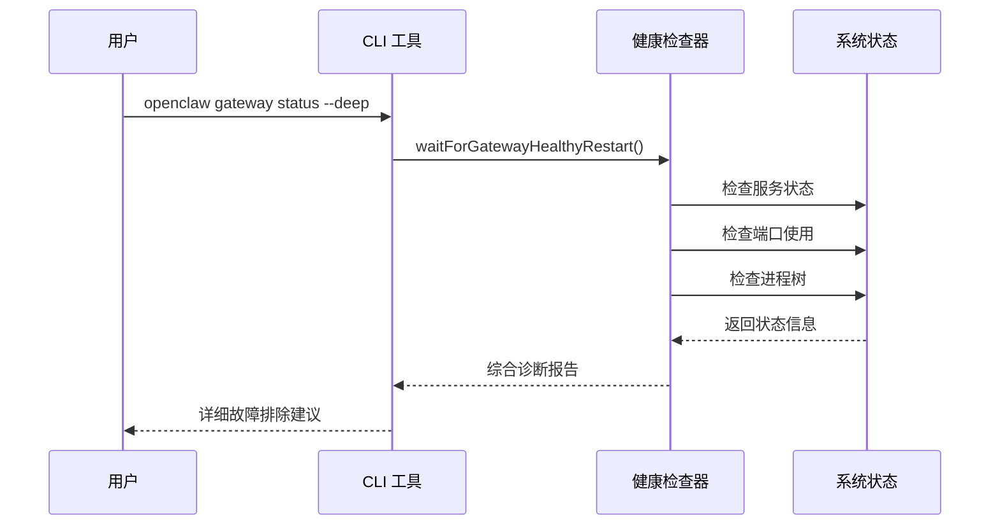

**图表来源**
- [restart-health.ts:187-222](file://src/cli/daemon-cli/restart-health.ts#L187-L222)

**章节来源**
- [restart-health.ts:261-297](file://src/cli/daemon-cli/restart-health.ts#L261-L297)
- [lifecycle.ts:243-330](file://src/cli/daemon-cli/lifecycle.ts#L243-L330)

## 结论

网关重启系统是一个设计精良、功能完整的基础设施组件，具有以下特点：

### 优势
- **跨平台兼容**：统一的 API 支持三大主流操作系统
- **智能决策**：基于配置变更的智能重启策略
- **健壮性**：完善的错误处理和恢复机制
- **可观测性**：详细的日志记录和诊断信息
- **安全性**：严格的权限控制和审计功能

### 最佳实践
1. 在生产环境中使用配置驱动的重启模式
2. 定期监控服务健康状态
3. 建立适当的日志轮转策略
4. 配置合适的重启延迟参数
5. 建立故障恢复预案

该系统为 OpenClaw 生态系统提供了可靠的网关管理基础，确保了服务的高可用性和可维护性。