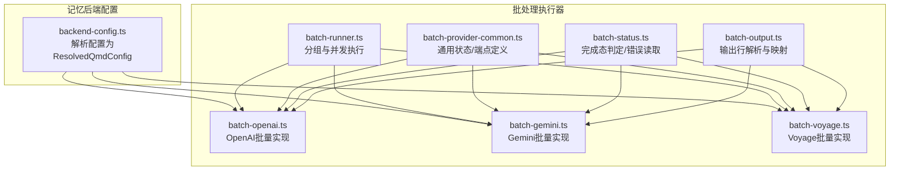
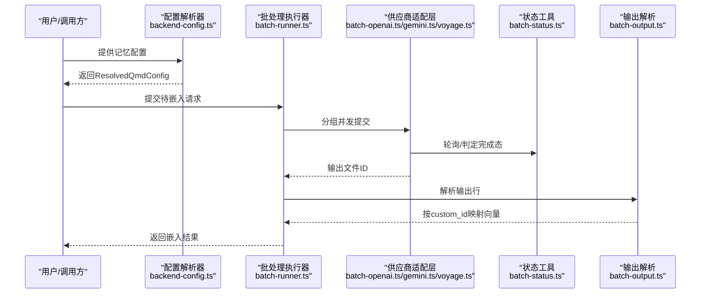
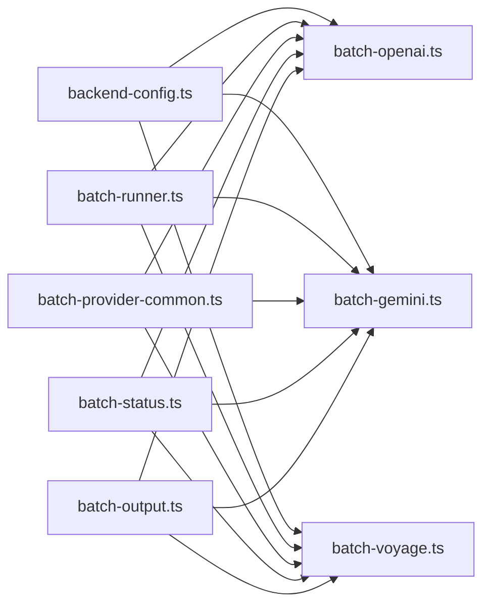
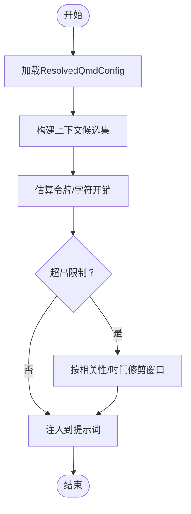

# 记忆系统

<cite>
**本文引用的文件**
- [backend-config.ts](file://src/memory/backend-config.ts)
- [batch-embedding-common.ts](file://src/memory/batch-embedding-common.ts)
- [batch-runner.ts](file://src/memory/batch-runner.ts)
- [batch-openai.ts](file://src/memory/batch-openai.ts)
- [batch-gemini.ts](file://src/memory/batch-gemini.ts)
- [batch-voyage.ts](file://src/memory/batch-voyage.ts)
- [batch-provider-common.ts](file://src/memory/batch-provider-common.ts)
- [batch-status.ts](file://src/memory/batch-status.ts)
- [batch-output.ts](file://src/memory/batch-output.ts)
</cite>

## 目录

1. [简介](#简介)
2. [项目结构](#项目结构)
3. [核心组件](#核心组件)
4. [架构总览](#架构总览)
5. [详细组件分析](#详细组件分析)
6. [依赖关系分析](#依赖关系分析)
7. [性能考量](#性能考量)
8. [故障排查指南](#故障排查指南)
9. [结论](#结论)
10. [附录](#附录)

## 简介

本文件面向OpenClaw记忆系统，聚焦于记忆存储架构、上下文窗口管理与压缩机制、会话保持与历史检索、持久化与缓存策略、以及性能优化。文档同时解释上下文构建、令牌计算与窗口修剪的算法，并提供配置项、查询方法与清理策略，辅以代码级流程图与路径引用，帮助读者快速理解并正确使用记忆子系统。

## 项目结构

记忆系统主要由“后端配置解析”和“嵌入批处理执行器”两大模块构成：

- 后端配置解析：负责将用户配置解析为可执行的内存后端参数（如QMD命令、集合、会话导出、更新与嵌入间隔、限制等）。
- 嵌入批处理执行器：统一抽象不同供应商（OpenAI、Gemini、Voyage）的批量嵌入提交、轮询、结果解析与映射逻辑，支持并发分组与超时控制。

图表来源

- [backend-config.ts:297-354](file://src/memory/backend-config.ts#L297-L354)
- [batch-runner.ts:12-64](file://src/memory/batch-runner.ts#L12-L64)
- [batch-provider-common.ts:3-12](file://src/memory/batch-provider-common.ts#L3-L12)
- [batch-status.ts:15-69](file://src/memory/batch-status.ts#L15-L69)
- [batch-output.ts:17-55](file://src/memory/batch-output.ts#L17-L55)
- [batch-openai.ts:190-259](file://src/memory/batch-openai.ts#L190-L259)
- [batch-gemini.ts:268-369](file://src/memory/batch-gemini.ts#L268-L369)
- [batch-voyage.ts:192-285](file://src/memory/batch-voyage.ts#L192-L285)

章节来源

- [backend-config.ts:297-354](file://src/memory/backend-config.ts#L297-L354)
- [batch-runner.ts:12-64](file://src/memory/batch-runner.ts#L12-L64)

## 核心组件

- 后端配置解析器：将用户配置转换为运行时可用的ResolvedQmdConfig，包括命令、集合、会话导出、更新与嵌入周期、限制、作用域等。
- 批处理执行器：对请求进行分组、并发执行、轮询等待、完成态判定、错误读取与输出行解析，最终生成按custom_id映射的向量结果。
- 供应商适配层：分别实现OpenAI、Gemini、Voyage的批量提交、状态轮询、输出下载与解析。

章节来源

- [backend-config.ts:17-70](file://src/memory/backend-config.ts#L17-L70)
- [batch-embedding-common.ts:1-23](file://src/memory/batch-embedding-common.ts#L1-L23)
- [batch-runner.ts:4-64](file://src/memory/batch-runner.ts#L4-L64)
- [batch-provider-common.ts:3-12](file://src/memory/batch-provider-common.ts#L3-L12)
- [batch-status.ts:15-69](file://src/memory/batch-status.ts#L15-L69)
- [batch-output.ts:17-55](file://src/memory/batch-output.ts#L17-L55)

## 架构总览

记忆系统的整体工作流如下：

- 配置解析：根据用户配置与代理ID生成ResolvedQmdConfig。
- 文档集合：默认集合与自定义集合被解析并去重命名，形成可扫描的集合列表。
- 批量嵌入：将待嵌入文本切分为批次，按供应商接口提交，等待完成或超时。
- 结果映射：解析输出行，按custom_id建立向量映射，校验缺失与错误。
- 上下文构建：基于查询与限制，选择最相关片段并注入到提示词中，控制注入字符数与超时。

图表来源

- [backend-config.ts:297-354](file://src/memory/backend-config.ts#L297-L354)
- [batch-runner.ts:12-48](file://src/memory/batch-runner.ts#L12-L48)
- [batch-openai.ts:190-259](file://src/memory/batch-openai.ts#L190-L259)
- [batch-gemini.ts:268-369](file://src/memory/batch-gemini.ts#L268-L369)
- [batch-voyage.ts:192-285](file://src/memory/batch-voyage.ts#L192-L285)
- [batch-status.ts:45-69](file://src/memory/batch-status.ts#L45-L69)
- [batch-output.ts:17-55](file://src/memory/batch-output.ts#L17-L55)

## 详细组件分析

### 后端配置解析器

职责

- 将用户配置解析为ResolvedQmdConfig，包括：
  - 命令、会话导出目录与保留天数、搜索模式、集合（默认与自定义）、mcporter配置、更新与嵌入周期、超时、限制、作用域等。
  - 对路径进行解析与规范化，确保安全与可执行性。
  - 对集合名称进行去重与代理ID作用域化，避免冲突。

关键点

- 默认值策略：未显式配置时采用合理默认（如搜索模式、更新/嵌入间隔、超时、最大结果数、注入字符数等）。
- 安全与健壮性：路径为空或不可解析时抛错；集合名清洗与唯一化；会话导出目录与保留天数的数值校验。

章节来源

- [backend-config.ts:17-70](file://src/memory/backend-config.ts#L17-L70)
- [backend-config.ts:106-140](file://src/memory/backend-config.ts#L106-L140)
- [backend-config.ts:142-178](file://src/memory/backend-config.ts#L142-L178)
- [backend-config.ts:180-195](file://src/memory/backend-config.ts#L180-L195)
- [backend-config.ts:197-202](file://src/memory/backend-config.ts#L197-L202)
- [backend-config.ts:204-218](file://src/memory/backend-config.ts#L204-L218)
- [backend-config.ts:220-252](file://src/memory/backend-config.ts#L220-L252)
- [backend-config.ts:254-273](file://src/memory/backend-config.ts#L254-L273)
- [backend-config.ts:275-295](file://src/memory/backend-config.ts#L275-L295)
- [backend-config.ts:297-354](file://src/memory/backend-config.ts#L297-L354)

### 批处理执行器（分组与并发）

职责

- 将请求按最大请求数拆分为多个组，使用并发控制执行各组任务。
- 支持调试日志输出，记录请求总数、分组数、等待策略、轮询间隔与超时等信息。
- 返回按custom_id映射的索引，便于后续结果关联。

算法要点

- 请求分组：依据最大请求数进行拆分，保证单次提交规模可控。
- 并发控制：通过并发度参数控制同时执行的任务数量。
- 调试输出：在执行前输出关键参数，便于排障。

章节来源

- [batch-runner.ts:12-48](file://src/memory/batch-runner.ts#L12-L48)
- [batch-runner.ts:50-64](file://src/memory/batch-runner.ts#L50-L64)

### 供应商适配层（OpenAI/Gemini/Voyage）

职责

- 统一抽象批量嵌入的提交、轮询、完成态判定、错误读取与输出解析。
- 不同供应商的差异点：
  - OpenAI：使用/batches接口提交，轮询状态，下载输出文件内容逐行解析。
  - Gemini：使用multipart上传JSONL文件，调用asyncBatchEmbedContent，轮询状态并下载输出文件。
  - Voyage：使用/batches接口提交，轮询状态，通过流式读取输出文件内容逐行解析。

关键流程

- 文件上传：将请求序列化为JSONL并上传，获取输入文件ID。
- 提交批任务：携带元数据与完成窗口，提交批任务。
- 等待完成：轮询状态，遇到失败/过期/取消等终止态时读取错误文件并抛错。
- 下载与解析：下载输出文件，逐行解析为ProviderBatchOutputLine，应用到byCustomId映射。

章节来源

- [batch-openai.ts:40-67](file://src/memory/batch-openai.ts#L40-L67)
- [batch-openai.ts:143-188](file://src/memory/batch-openai.ts#L143-L188)
- [batch-openai.ts:190-259](file://src/memory/batch-openai.ts#L190-L259)
- [batch-gemini.ts:75-160](file://src/memory/batch-gemini.ts#L75-L160)
- [batch-gemini.ts:223-266](file://src/memory/batch-gemini.ts#L223-L266)
- [batch-gemini.ts:268-369](file://src/memory/batch-gemini.ts#L268-L369)
- [batch-voyage.ts:66-98](file://src/memory/batch-voyage.ts#L66-L98)
- [batch-voyage.ts:145-190](file://src/memory/batch-voyage.ts#L145-L190)
- [batch-voyage.ts:192-285](file://src/memory/batch-voyage.ts#L192-L285)

### 状态与输出解析

职责

- 状态工具：判定完成态、读取错误文件、在非等待模式下抛出明确错误。
- 输出解析：从输出行中提取custom_id与embedding，校验空向量与HTTP错误码，维护剩余未匹配项与错误列表。

章节来源

- [batch-provider-common.ts:3-12](file://src/memory/batch-provider-common.ts#L3-L12)
- [batch-status.ts:15-69](file://src/memory/batch-status.ts#L15-L69)
- [batch-output.ts:17-55](file://src/memory/batch-output.ts#L17-L55)

## 依赖关系分析

- 配置解析器依赖路径解析、时间解析、集合去重与代理ID作用域化等工具函数。
- 批处理执行器依赖分组与并发控制工具，向上游供应商适配层提供统一的执行参数。
- 供应商适配层共享公共的状态与输出解析逻辑，减少重复实现。
- 公共常量（如批量端点）集中定义，便于跨供应商一致性。

图表来源

- [backend-config.ts:297-354](file://src/memory/backend-config.ts#L297-L354)
- [batch-runner.ts:12-48](file://src/memory/batch-runner.ts#L12-L48)
- [batch-provider-common.ts:3-12](file://src/memory/batch-provider-common.ts#L3-L12)
- [batch-status.ts:15-69](file://src/memory/batch-status.ts#L15-L69)
- [batch-output.ts:17-55](file://src/memory/batch-output.ts#L17-L55)
- [batch-openai.ts:190-259](file://src/memory/batch-openai.ts#L190-L259)
- [batch-gemini.ts:268-369](file://src/memory/batch-gemini.ts#L268-L369)
- [batch-voyage.ts:192-285](file://src/memory/batch-voyage.ts#L192-L285)

章节来源

- [batch-embedding-common.ts:1-23](file://src/memory/batch-embedding-common.ts#L1-L23)

## 性能考量

- 批量大小与并发度：通过runEmbeddingBatchGroups控制每组最大请求数与并发度，平衡吞吐与资源占用。
- 轮询与超时：供应商适配层提供轮询间隔与超时控制，避免长时间阻塞；在非等待模式下快速失败。
- 限流与节流：配置解析器提供更新与嵌入周期、命令/更新/嵌入超时等参数，降低突发负载。
- 输出解析与映射：逐行解析输出并建立映射，避免一次性加载大文件导致内存峰值。

章节来源

- [batch-runner.ts:12-48](file://src/memory/batch-runner.ts#L12-L48)
- [batch-openai.ts:143-188](file://src/memory/batch-openai.ts#L143-L188)
- [batch-gemini.ts:223-266](file://src/memory/batch-gemini.ts#L223-L266)
- [batch-voyage.ts:145-190](file://src/memory/batch-voyage.ts#L145-L190)
- [backend-config.ts:326-347](file://src/memory/backend-config.ts#L326-L347)

## 故障排查指南

常见问题与定位

- 批任务未完成：检查供应商适配层的轮询逻辑与等待策略，确认是否启用remote.batch.wait。
- 输出文件缺失：完成态应包含output_file_id，若缺失则抛错；检查供应商返回状态与错误文件。
- 错误文件内容：当批任务进入失败/过期/取消等终止态时，读取错误文件并拼接详细信息。
- 输出行解析异常：逐行解析输出，遇到空embedding或HTTP错误码时记录错误；核对custom_id是否匹配。

建议操作

- 开启调试日志：批处理执行器会在开始时输出关键参数，便于核对配置。
- 校验路径与权限：配置解析器对路径进行解析与规范化，确保可访问。
- 控制批大小与并发：根据供应商配额与网络状况调整maxRequests与concurrency。

章节来源

- [batch-status.ts:29-43](file://src/memory/batch-status.ts#L29-L43)
- [batch-status.ts:45-69](file://src/memory/batch-status.ts#L45-L69)
- [batch-output.ts:17-55](file://src/memory/batch-output.ts#L17-L55)
- [batch-openai.ts:162-187](file://src/memory/batch-openai.ts#L162-L187)
- [batch-gemini.ts:242-265](file://src/memory/batch-gemini.ts#L242-L265)
- [batch-voyage.ts:164-189](file://src/memory/batch-voyage.ts#L164-L189)

## 结论

OpenClaw记忆系统通过“配置解析 + 批处理执行器 + 供应商适配层”的分层设计，实现了对多供应商批量嵌入的统一抽象与高效执行。其默认值策略、路径与集合管理、并发与超时控制、以及输出解析与映射机制，共同保障了在不同硬件与网络环境下的稳定性与性能。结合会话导出与保留策略，系统能够在长期内维持高质量的历史检索能力。

## 附录

### 配置选项速览（摘自配置解析器）

- 后端类型与引用模式：backend、citations
- QMD命令与mcporter：command、mcporter.enabled、mcporter.serverName、mcporter.startDaemon
- 搜索模式：searchMode（search/vsearch/query）
- 集合：collections（默认与自定义），包含name、path、pattern、kind
- 会话导出：sessions.enabled、sessions.exportDir、sessions.retentionDays
- 更新与嵌入周期：update.intervalMs、update.debounceMs、update.onBoot、update.waitForBootSync、update.embedIntervalMs
- 超时与限制：update.commandTimeoutMs、update.updateTimeoutMs、update.embedTimeoutMs、limits.maxResults、limits.maxSnippetChars、limits.maxInjectedChars、limits.timeoutMs
- 作用域：scope.default、scope.rules

章节来源

- [backend-config.ts:17-70](file://src/memory/backend-config.ts#L17-L70)
- [backend-config.ts:297-354](file://src/memory/backend-config.ts#L297-L354)

### 查询与上下文构建流程（概念示意）

[此图为概念流程图，不直接对应具体源码文件]

### 代码示例路径（用于参考实现）

- 配置解析入口：[backend-config.ts:297-354](file://src/memory/backend-config.ts#L297-L354)
- 批处理执行器：[batch-runner.ts:12-48](file://src/memory/batch-runner.ts#L12-L48)
- OpenAI批量实现：[batch-openai.ts:190-259](file://src/memory/batch-openai.ts#L190-L259)
- Gemini批量实现：[batch-gemini.ts:268-369](file://src/memory/batch-gemini.ts#L268-L369)
- Voyage批量实现：[batch-voyage.ts:192-285](file://src/memory/batch-voyage.ts#L192-L285)
- 状态与输出解析：[batch-status.ts:15-69](file://src/memory/batch-status.ts#L15-L69)、[batch-output.ts:17-55](file://src/memory/batch-output.ts#L17-L55)
