# 通道系统

<cite>
**本文引用的文件**
- [src/channels/registry.ts](file://src/channels/registry.ts)
- [src/channels/plugins/index.ts](file://src/channels/plugins/index.ts)
- [src/channels/plugins/types.ts](file://src/channels/plugins/types.ts)
- [src/channels/plugins/types.adapters.ts](file://src/channels/plugins/types.adapters.ts)
- [src/channels/plugins/types.core.ts](file://src/channels/plugins/types.core.ts)
- [src/channels/plugins/catalog.ts](file://src/channels/plugins/catalog.ts)
- [src/channels/plugins/setup-helpers.ts](file://src/channels/plugins/setup-helpers.ts)
- [src/channels/plugins/helpers.ts](file://src/channels/plugins/helpers.ts)
- [src/channels/plugins/status-issues/shared.ts](file://src/channels/plugins/status-issues/shared.ts)
- [src/infra/outbound/bound-delivery-router.ts](file://src/infra/outbound/bound-delivery-router.ts)
- [src/commands/agents.bindings.ts](file://src/commands/agents.bindings.ts)
- [src/config/group-policy.ts](file://src/config/group-policy.ts)
- [src/infra/channels-status-issues.ts](file://src/infra/channels-status-issues.ts)
- [src/auto-reply/reply/block-reply-pipeline.ts](file://src/auto-reply/reply/block-reply-pipeline.ts)
- [src/web/auto-reply/monitor/message-line.ts](file://src/web/auto-reply/monitor/message-line.ts)
- [src/discord/send.outbound.ts](file://src/discord/send.outbound.ts)
- [src/markdown/whatsapp.test.ts](file://src/markdown/whatsapp.test.ts)
- [src/channels/plugins/actions/telegram.ts](file://src/channels/plugins/actions/telegram.ts)
- [src/channels/plugins/actions/discord.ts](file://src/channels/plugins/actions/discord.ts)
- [src/channels/plugins/actions/signal.ts](file://src/channels/plugins/actions/signal.ts)
- [src/channels/plugins/actions/shared.ts](file://src/channels/plugins/actions/shared.ts)
- [src/channels/plugins/normalize/telegram.ts](file://src/channels/plugins/normalize/telegram.ts)
- [src/channels/plugins/normalize/discord.ts](file://src/channels/plugins/normalize/discord.ts)
- [src/channels/plugins/normalize/shared.ts](file://src/channels/plugins/normalize/shared.ts)
- [src/channels/plugins/normalize/signal.ts](file://src/channels/plugins/normalize/signal.ts)
- [src/channels/plugins/normalize/whatsapp.ts](file://src/channels/plugins/normalize/whatsapp.ts)
- [src/channels/plugins/onboarding/telegram.ts](file://src/channels/plugins/onboarding/telegram.ts)
- [src/channels/plugins/onboarding/discord.ts](file://src/channels/plugins/onboarding/discord.ts)
- [src/channels/plugins/onboarding/signal.ts](file://src/channels/plugins/onboarding/signal.ts)
- [src/channels/plugins/onboarding/whatsapp.ts](file://src/channels/plugins/onboarding/whatsapp.ts)
- [src/channels/plugins/whatsapp-heartbeat.ts](file://src/channels/plugins/whatsapp-heartbeat.ts)
- [src/channels/plugins/whatsapp-shared.ts](file://src/channels/plugins/whatsapp-shared.ts)
- [src/channels/plugins/agent-tools/whatsapp-login.ts](file://src/channels/plugins/agent-tools/whatsapp-login.ts)
- [src/channels/plugins/group-mentions.ts](file://src/channels/plugins/group-mentions.ts)
- [src/channels/plugins/media-limits.ts](file://src/channels/plugins/media-limits.ts)
- [src/channels/plugins/media-payload.ts](file://src/channels/plugins/media-payload.ts)
- [src/channels/plugins/message-actions.ts](file://src/channels/plugins/message-actions.ts)
- [src/channels/plugins/pairing.ts](file://src/channels/plugins/pairing.ts)
- [src/channels/plugins/status.ts](file://src/channels/plugins/status.ts)
- [src/channels/plugins/whatsapp-heartbeat.test.ts](file://src/channels/plugins/whatsapp-heartbeat.test.ts)
- [src/channels/plugins/whatsapp-shared.test.ts](file://src/channels/plugins/whatsapp-shared.test.ts)
- [src/channels/plugins/whatsapp-shared.ts](file://src/channels/plugins/whatsapp-shared.ts)
- [src/channels/plugins/whatsapp-heartbeat.ts](file://src/channels/plugins/whatsapp-heartbeat.ts)
- [src/channels/plugins/whatsapp-shared.ts](file://src/channels/plugins/whatsapp-shared.ts)
- [src/channels/plugins/whatsapp-heartbeat.ts](file://src/channels/plugins/whatsapp-heartbeat.ts)
- [src/channels/plugins/whatsapp-shared.ts](file://src/channels/plugins/whatsapp-shared.ts)
- [src/channels/plugins/whatsapp-heartbeat.ts](file://src/channels/plugins/whatsapp-heartbeat.ts)
- [src/channels/plugins/whatsapp-shared.ts](file://src/channels/plugins/whatsapp-shared.ts)
- [src/channels/plugins/whatsapp-heartbeat.ts](file://src/channels/plugins/whatsapp-heartbeat.ts)
- [src/channels/plugins/whatsapp-shared.ts](file://src/channels/plugins/whatsapp-shared.ts)
- [src/channels/plugins/whatsapp-heartbeat.ts](file://src/channels/plugins/whatsapp-heartbeat.ts)
- [src/channels/plugins/whatsapp-shared.ts](file://src/channels/plugins/whatsapp-shared.ts)
- [src/channels/plugins/whatsapp-heartbeat.ts](file://src/channels/plugins/whatsapp-heartbeat.ts)
- [src/channels/plugins/whatsapp-shared.ts](file://src/channels/plugins/whatsapp-shared.ts)
- [src/channels/plugins/whatsapp-heartbeat.ts](file://src/channels/plugins/whatsapp-heartbeat.ts)
- [src/channels/plugins/whatsapp-shared.ts](file://src/channels/plugins/whatsapp-shared.ts)
- [src/channels/plugins/whatsapp-heartbeat.ts](file://src/channels/plugins/whatsapp-heartbeat.ts)
- [src/channels/plugins/whatsapp-shared.ts](file://src/channels/plugins/whatsapp-shared.ts)
- [src/channels/plugins/whatsapp-heartbeat.ts](file://src/channels/plugins/whatsapp-heartbeat.ts)
- [src/channels/plugins/whatsapp-shared.ts](file://src/channels/plugins/whatsapp-shared.ts)
- [src/channels/plugins/whatsapp-heartbeat.ts](file://src/channels/plugins/whatsapp-heartbeat.ts)
-......
</cite>

## 目录

1. [简介](#简介)
2. [项目结构](#项目结构)
3. [核心组件](#核心组件)
4. [架构总览](#架构总览)
5. [详细组件分析](#详细组件分析)
6. [依赖关系分析](#依赖关系分析)
7. [性能考量](#性能考量)
8. [故障排查指南](#故障排查指南)
9. [结论](#结论)
10. [附录](#附录)

## 简介

本文件面向OpenClaw的通道系统，系统化阐述通道适配器的架构设计、消息路由机制与访问控制策略；详解多平台（Discord、Telegram、WhatsApp等）的消息格式转换、用户身份映射与权限验证；说明通道注册表的工作原理、消息分发算法与错误处理；覆盖通道配置的动态更新、连接状态监控与重连策略；并提供实现新通道适配器的步骤指引、通道间消息同步与一致性保障方案，以及扩展性与性能优化策略。

## 项目结构

OpenClaw的通道系统围绕“插件化适配器 + 注册表 + 配置与安全策略 + 出站路由与状态监控”展开。核心目录与职责如下：

- 通道注册与元数据：src/channels/registry.ts 定义聊天类通道顺序、别名与元信息；src/channels/plugins/index.ts 提供运行时插件注册表与缓存。
- 插件类型与接口：src/channels/plugins/types.ts、types.adapters.ts、types.core.ts 定义适配器接口、账户快照、能力与上下文。
- 插件目录与安装：src/channels/plugins/catalog.ts 提供外部插件目录构建与优先级合并。
- 配置与安全：src/channels/plugins/setup-helpers.ts、helpers.ts 提供账户配置补丁、默认账户解析与DM安全策略构建。
- 出站绑定与路由：src/infra/outbound/bound-delivery-router.ts 负责会话绑定到具体通道账户；src/commands/agents.bindings.ts 将代理选择映射为路由绑定。
- 访问控制与组策略：src/config/group-policy.ts 实现组白名单/禁用策略与大小写不敏感匹配。
- 状态与问题收集：src/channels/plugins/status-issues/shared.ts、src/infra/channels-status-issues.ts 收集各通道账户状态问题。
- 平台示例：src/discord/send.outbound.ts、src/markdown/whatsapp.test.ts 展示出站发送与格式转换；src/channels/plugins/normalize/_、actions/_、onboarding/\* 提供目标标准化、动作与引导流程。

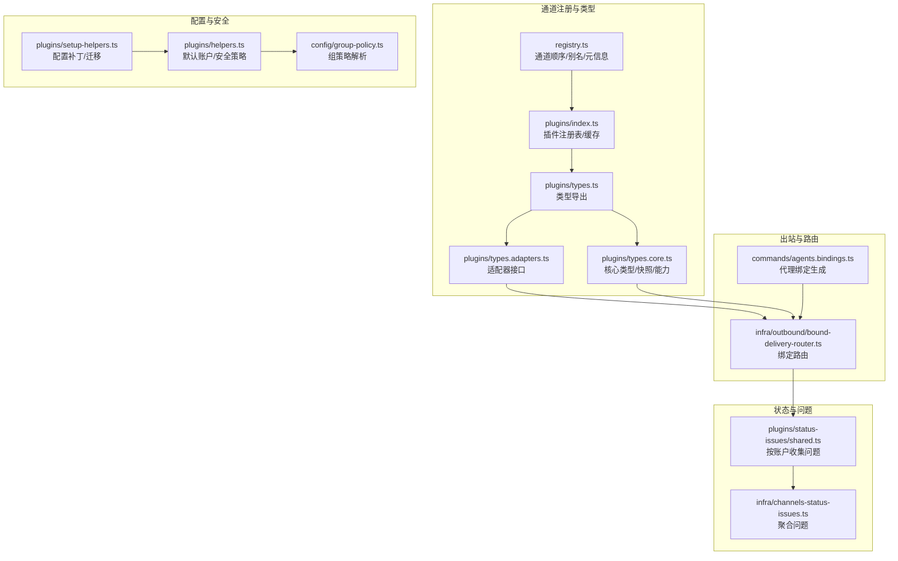

**图表来源**

- [src/channels/registry.ts:1-201](file://src/channels/registry.ts#L1-L201)
- [src/channels/plugins/index.ts:1-118](file://src/channels/plugins/index.ts#L1-L118)
- [src/channels/plugins/types.ts:1-66](file://src/channels/plugins/types.ts#L1-L66)
- [src/channels/plugins/types.adapters.ts:1-384](file://src/channels/plugins/types.adapters.ts#L1-L384)
- [src/channels/plugins/types.core.ts:1-403](file://src/channels/plugins/types.core.ts#L1-L403)
- [src/channels/plugins/setup-helpers.ts:1-311](file://src/channels/plugins/setup-helpers.ts#L1-L311)
- [src/channels/plugins/helpers.ts:1-59](file://src/channels/plugins/helpers.ts#L1-L59)
- [src/config/group-policy.ts:282-359](file://src/config/group-policy.ts#L282-L359)
- [src/infra/outbound/bound-delivery-router.ts:49-91](file://src/infra/outbound/bound-delivery-router.ts#L49-L91)
- [src/commands/agents.bindings.ts:229-286](file://src/commands/agents.bindings.ts#L229-L286)
- [src/channels/plugins/status-issues/shared.ts:46-63](file://src/channels/plugins/status-issues/shared.ts#L46-L63)
- [src/infra/channels-status-issues.ts:1-20](file://src/infra/channels-status-issues.ts#L1-L20)

**章节来源**

- [src/channels/registry.ts:1-201](file://src/channels/registry.ts#L1-L201)
- [src/channels/plugins/index.ts:1-118](file://src/channels/plugins/index.ts#L1-L118)
- [src/channels/plugins/types.ts:1-66](file://src/channels/plugins/types.ts#L1-L66)
- [src/channels/plugins/types.adapters.ts:1-384](file://src/channels/plugins/types.adapters.ts#L1-L384)
- [src/channels/plugins/types.core.ts:1-403](file://src/channels/plugins/types.core.ts#L1-L403)

## 核心组件

- 通道注册表与元信息：定义聊天通道顺序、别名与文档链接，统一规范化通道ID，避免在共享路径中加载重型插件。
- 插件类型体系：通过适配器接口抽象通道能力（配置、出站、状态、网关、目录、解析、安全、心跳、消息动作等），并以核心类型描述账户快照、能力矩阵与上下文。
- 插件目录与安装：支持从工作区、全局、内置与外部目录合并插件清单，按优先级去重排序，生成UI目录。
- 配置与安全辅助：提供账户配置补丁、单账户向多账户迁移、默认账户解析与DM安全策略构建。
- 出站绑定与路由：基于会话键解析活动绑定，支持显式请求者与模糊场景下的回退模式。
- 组策略与访问控制：解析组白名单/禁用策略，支持通配符与大小写不敏感匹配，并结合发送方过滤。
- 状态与问题收集：遍历已启用账户，按通道插件收集状态问题，统一上报。

**章节来源**

- [src/channels/registry.ts:1-201](file://src/channels/registry.ts#L1-L201)
- [src/channels/plugins/types.adapters.ts:1-384](file://src/channels/plugins/types.adapters.ts#L1-L384)
- [src/channels/plugins/types.core.ts:1-403](file://src/channels/plugins/types.core.ts#L1-L403)
- [src/channels/plugins/catalog.ts:1-308](file://src/channels/plugins/catalog.ts#L1-L308)
- [src/channels/plugins/setup-helpers.ts:1-311](file://src/channels/plugins/setup-helpers.ts#L1-L311)
- [src/channels/plugins/helpers.ts:1-59](file://src/channels/plugins/helpers.ts#L1-L59)
- [src/infra/outbound/bound-delivery-router.ts:49-91](file://src/infra/outbound/bound-delivery-router.ts#L49-L91)
- [src/config/group-policy.ts:282-359](file://src/config/group-policy.ts#L282-L359)
- [src/channels/plugins/status-issues/shared.ts:46-63](file://src/channels/plugins/status-issues/shared.ts#L46-L63)

## 架构总览

通道系统采用“插件化适配器 + 中央注册表 + 配置与安全策略 + 出站路由”的分层设计。上层业务（代理、自动回复、命令）通过统一的适配器接口与通道交互；通道插件负责具体平台协议与能力；注册表与目录确保可发现性与可安装性；路由与状态模块保障消息正确投递与可观测性。

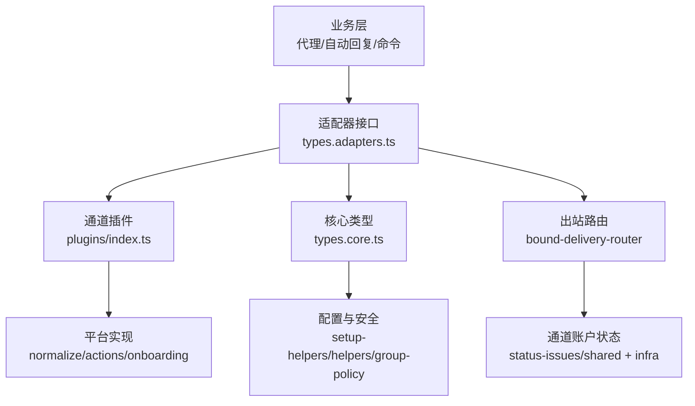

**图表来源**

- [src/channels/plugins/types.adapters.ts:1-384](file://src/channels/plugins/types.adapters.ts#L1-L384)
- [src/channels/plugins/types.core.ts:1-403](file://src/channels/plugins/types.core.ts#L1-L403)
- [src/channels/plugins/index.ts:1-118](file://src/channels/plugins/index.ts#L1-L118)
- [src/channels/plugins/setup-helpers.ts:1-311](file://src/channels/plugins/setup-helpers.ts#L1-L311)
- [src/channels/plugins/helpers.ts:1-59](file://src/channels/plugins/helpers.ts#L1-L59)
- [src/infra/outbound/bound-delivery-router.ts:49-91](file://src/infra/outbound/bound-delivery-router.ts#L49-L91)
- [src/channels/plugins/status-issues/shared.ts:46-63](file://src/channels/plugins/status-issues/shared.ts#L46-L63)

## 详细组件分析

### 通道注册表与插件注册表

- 通道注册表：维护聊天通道顺序、别名映射与元信息，提供规范化通道ID与UI目录构建。
- 插件注册表：缓存当前活跃插件集合，去重并按顺序排序，提供按ID查询与通道规范化入口，避免在共享路径中加载重型插件。

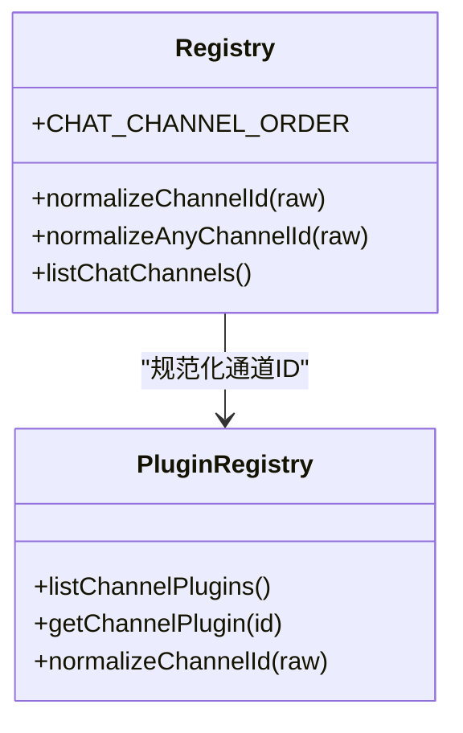

**图表来源**

- [src/channels/registry.ts:1-201](file://src/channels/registry.ts#L1-L201)
- [src/channels/plugins/index.ts:1-118](file://src/channels/plugins/index.ts#L1-L118)

**章节来源**

- [src/channels/registry.ts:1-201](file://src/channels/registry.ts#L1-L201)
- [src/channels/plugins/index.ts:1-118](file://src/channels/plugins/index.ts#L1-L118)

### 类型与适配器接口

- 适配器接口：涵盖配置、出站、状态、网关、目录、解析、安全、心跳、消息动作等，统一跨平台能力边界。
- 核心类型：账户快照、能力矩阵、上下文对象、目录条目、消息动作名称与上下文、轮询输入与结果等。

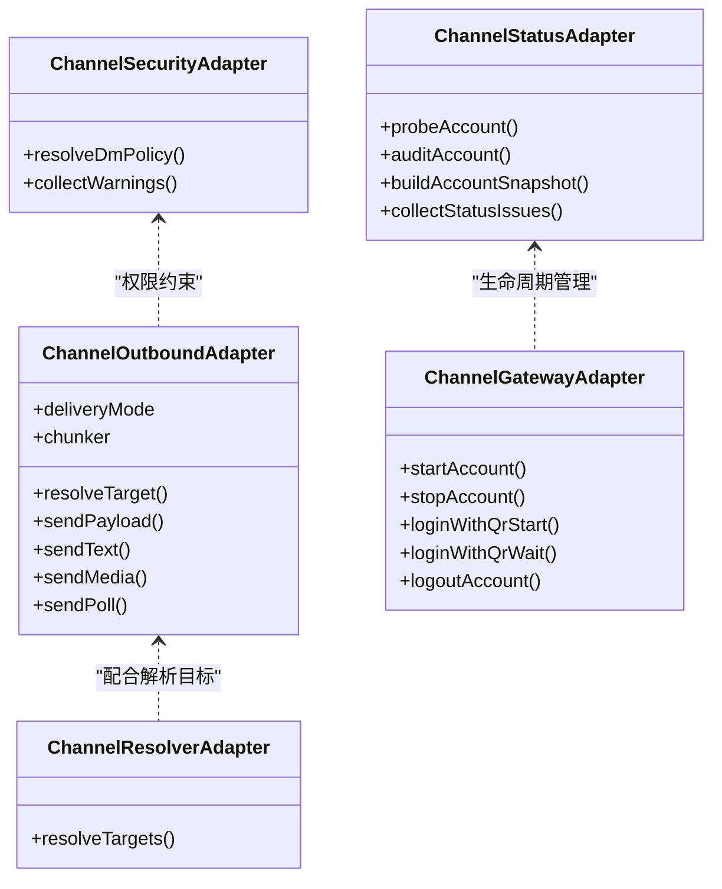

**图表来源**

- [src/channels/plugins/types.adapters.ts:108-384](file://src/channels/plugins/types.adapters.ts#L108-L384)
- [src/channels/plugins/types.core.ts:181-403](file://src/channels/plugins/types.core.ts#L181-L403)

**章节来源**

- [src/channels/plugins/types.adapters.ts:1-384](file://src/channels/plugins/types.adapters.ts#L1-L384)
- [src/channels/plugins/types.core.ts:1-403](file://src/channels/plugins/types.core.ts#L1-L403)

### 插件目录与安装

- 外部目录合并：从多个路径加载插件目录JSON，解析为通道元信息与安装信息。
- 优先级与去重：按来源优先级（配置/工作区/全局/内置）与元信息order排序，去重后输出UI目录。

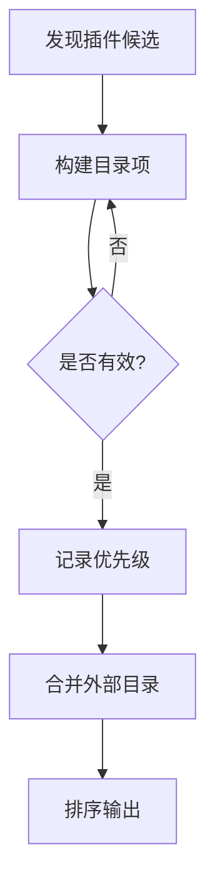

**图表来源**

- [src/channels/plugins/catalog.ts:259-308](file://src/channels/plugins/catalog.ts#L259-L308)

**章节来源**

- [src/channels/plugins/catalog.ts:1-308](file://src/channels/plugins/catalog.ts#L1-L308)

### 配置与安全辅助

- 配置补丁与迁移：支持对通道与账户配置进行补丁写入，单账户向多账户迁移时将顶层键移动至accounts.default。
- 默认账户解析：根据插件与账户列表解析默认账户ID。
- DM安全策略：构建账户作用域的DM策略，包含允许来源路径、策略路径与批准提示。

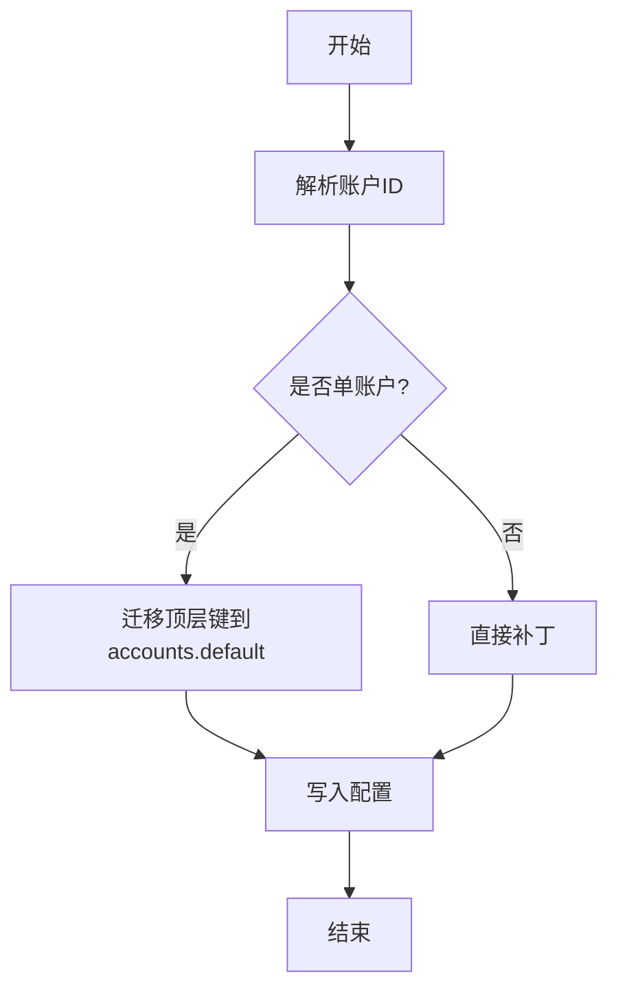

**图表来源**

- [src/channels/plugins/setup-helpers.ts:123-198](file://src/channels/plugins/setup-helpers.ts#L123-L198)
- [src/channels/plugins/setup-helpers.ts:261-310](file://src/channels/plugins/setup-helpers.ts#L261-L310)
- [src/channels/plugins/helpers.ts:23-58](file://src/channels/plugins/helpers.ts#L23-L58)

**章节来源**

- [src/channels/plugins/setup-helpers.ts:1-311](file://src/channels/plugins/setup-helpers.ts#L1-L311)
- [src/channels/plugins/helpers.ts:1-59](file://src/channels/plugins/helpers.ts#L1-L59)

### 出站绑定与路由

- 绑定解析：根据目标会话键列出活动绑定，若存在唯一绑定或显式请求者则直接绑定；否则回退到“无明确绑定”模式。
- 代理绑定生成：将代理选择与账户ID映射为路由绑定，必要时解析默认账户ID。

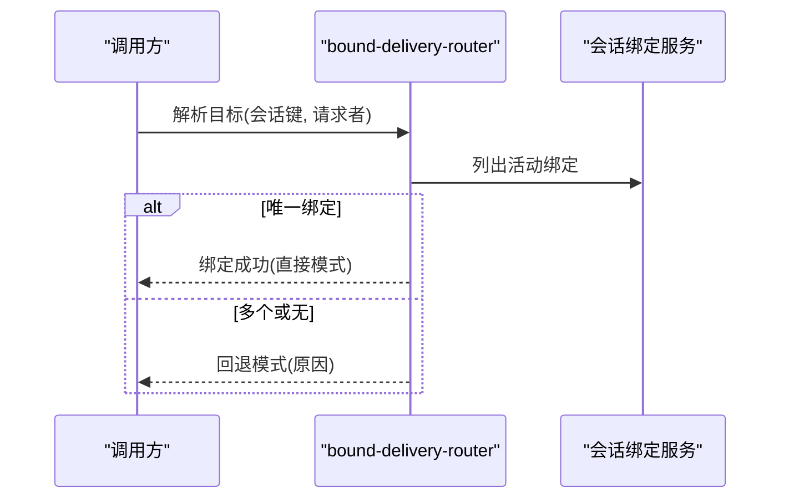

**图表来源**

- [src/infra/outbound/bound-delivery-router.ts:49-91](file://src/infra/outbound/bound-delivery-router.ts#L49-L91)
- [src/commands/agents.bindings.ts:229-286](file://src/commands/agents.bindings.ts#L229-L286)

**章节来源**

- [src/infra/outbound/bound-delivery-router.ts:49-91](file://src/infra/outbound/bound-delivery-router.ts#L49-L91)
- [src/commands/agents.bindings.ts:229-286](file://src/commands/agents.bindings.ts#L229-L286)

### 访问控制与组策略

- 组策略解析：支持禁用、开放、白名单三种模式；通配符“\*”表示全部允许；当仅配置发送方过滤而未配置组时，允许发送方过滤绕过。
- 大小写不敏感匹配：可按配置进行大小写不敏感的组ID匹配。

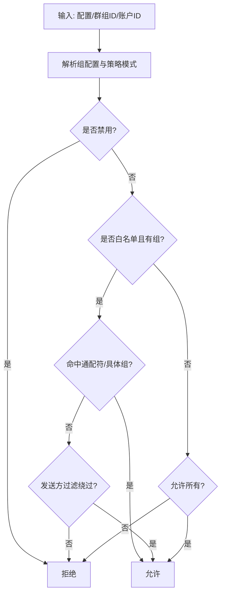

**图表来源**

- [src/config/group-policy.ts:325-359](file://src/config/group-policy.ts#L325-L359)

**章节来源**

- [src/config/group-policy.ts:282-359](file://src/config/group-policy.ts#L282-L359)

### 状态与问题收集

- 按账户收集：遍历启用账户，调用通道插件的收集函数，汇总为状态问题列表。
- 聚合上报：将各通道的问题合并，用于诊断与告警。

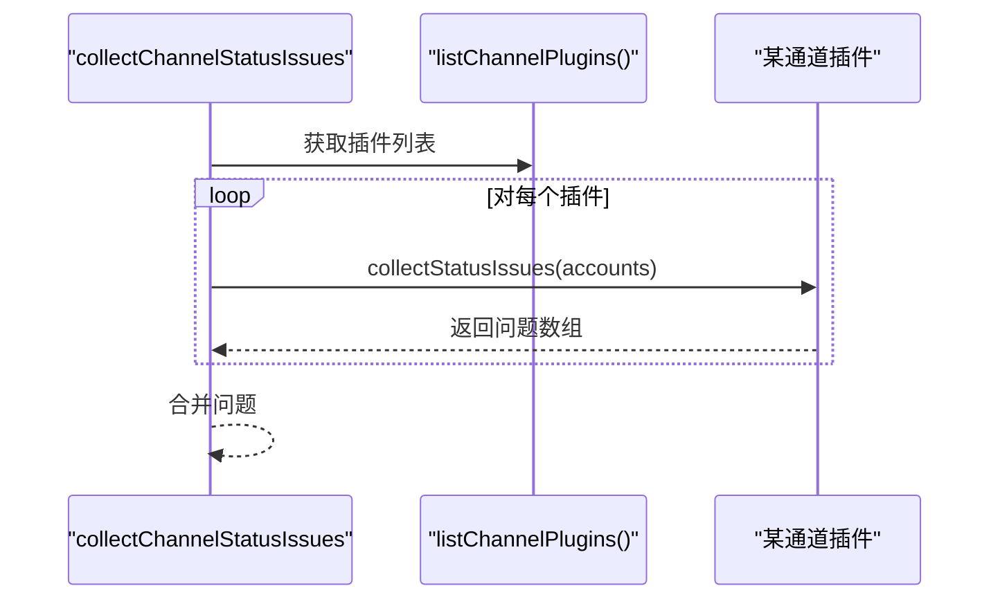

**图表来源**

- [src/infra/channels-status-issues.ts:1-20](file://src/infra/channels-status-issues.ts#L1-L20)
- [src/channels/plugins/status-issues/shared.ts:46-63](file://src/channels/plugins/status-issues/shared.ts#L46-L63)

**章节来源**

- [src/infra/channels-status-issues.ts:1-20](file://src/infra/channels-status-issues.ts#L1-L20)
- [src/channels/plugins/status-issues/shared.ts:46-63](file://src/channels/plugins/status-issues/shared.ts#L46-L63)

### 平台示例：Discord 出站发送

- 账户解析与客户端创建：解析Discord账户配置，创建REST客户端与请求对象。
- 渲染与分块：根据配置转换Markdown表格、重写提及；按文本/Markdown模式分块。
- 目标解析与通道类型：解析收件人，解析频道ID与类型；论坛/媒体频道自动使用主题发布。
- 发送执行：调用REST API发送消息。

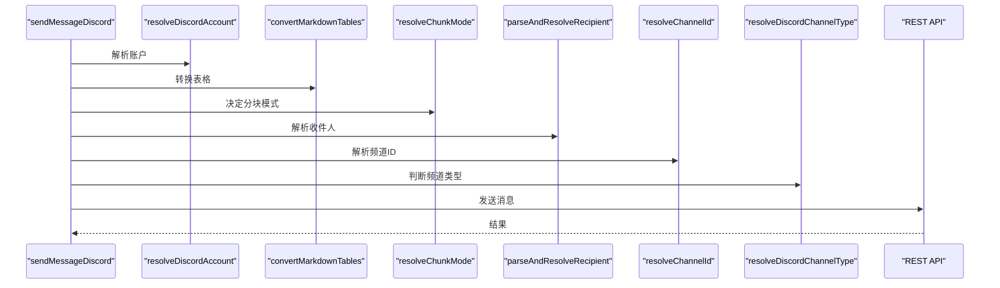

**图表来源**

- [src/discord/send.outbound.ts:132-161](file://src/discord/send.outbound.ts#L132-L161)

**章节来源**

- [src/discord/send.outbound.ts:132-161](file://src/discord/send.outbound.ts#L132-L161)

### 平台示例：WhatsApp 格式转换

- Markdown到WhatsApp格式转换：将粗体、删除线等转换为WhatsApp兼容格式，保留内联代码与代码块。
- 测试覆盖：提供多项断言，验证转换行为。

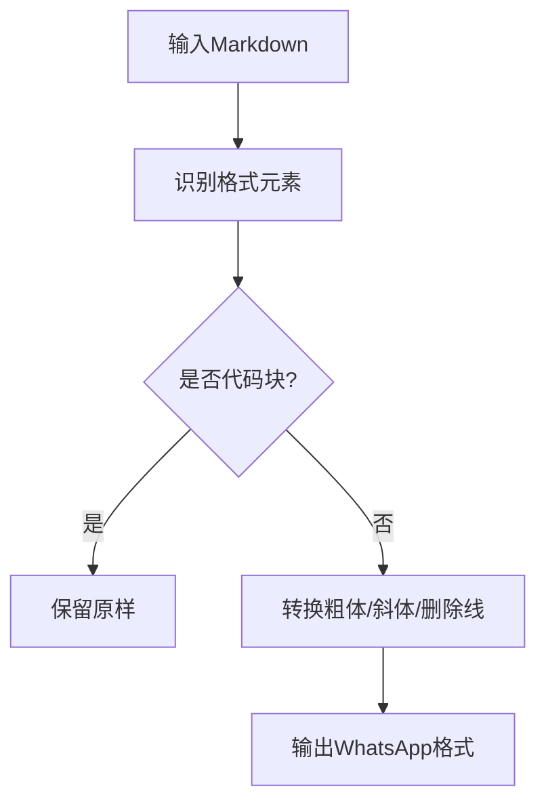

**图表来源**

- [src/markdown/whatsapp.test.ts:1-39](file://src/markdown/whatsapp.test.ts#L1-L39)

**章节来源**

- [src/markdown/whatsapp.test.ts:1-39](file://src/markdown/whatsapp.test.ts#L1-L39)

### 平台示例：Telegram/Signal/Discord 动作与标准化

- 动作：提供平台特定的消息动作（如投票、反应消息ID等）。
- 标准化：提供目标标准化与显示格式化，便于跨平台一致显示。

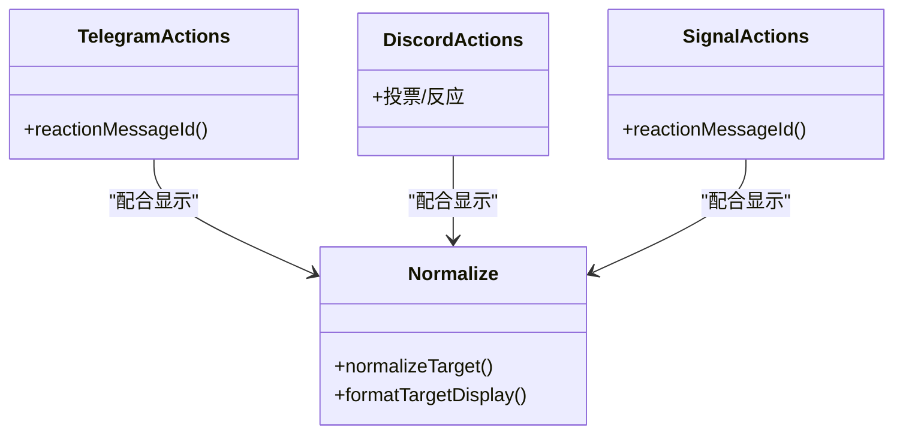

**图表来源**

- [src/channels/plugins/actions/telegram.ts](file://src/channels/plugins/actions/telegram.ts)
- [src/channels/plugins/actions/discord.ts](file://src/channels/plugins/actions/discord.ts)
- [src/channels/plugins/actions/signal.ts](file://src/channels/plugins/actions/signal.ts)
- [src/channels/plugins/actions/shared.ts](file://src/channels/plugins/actions/shared.ts)
- [src/channels/plugins/normalize/telegram.ts](file://src/channels/plugins/normalize/telegram.ts)
- [src/channels/plugins/normalize/discord.ts](file://src/channels/plugins/normalize/discord.ts)
- [src/channels/plugins/normalize/shared.ts](file://src/channels/plugins/normalize/shared.ts)
- [src/channels/plugins/normalize/signal.ts](file://src/channels/plugins/normalize/signal.ts)
- [src/channels/plugins/normalize/whatsapp.ts](file://src/channels/plugins/normalize/whatsapp.ts)

**章节来源**

- [src/channels/plugins/actions/telegram.ts](file://src/channels/plugins/actions/telegram.ts)
- [src/channels/plugins/actions/discord.ts](file://src/channels/plugins/actions/discord.ts)
- [src/channels/plugins/actions/signal.ts](file://src/channels/plugins/actions/signal.ts)
- [src/channels/plugins/actions/shared.ts](file://src/channels/plugins/actions/shared.ts)
- [src/channels/plugins/normalize/telegram.ts](file://src/channels/plugins/normalize/telegram.ts)
- [src/channels/plugins/normalize/discord.ts](file://src/channels/plugins/normalize/discord.ts)
- [src/channels/plugins/normalize/shared.ts](file://src/channels/plugins/normalize/shared.ts)
- [src/channels/plugins/normalize/signal.ts](file://src/channels/plugins/normalize/signal.ts)
- [src/channels/plugins/normalize/whatsapp.ts](file://src/channels/plugins/normalize/whatsapp.ts)

### 平台示例：WhatsApp 心跳与共享逻辑

- 心跳：维护心跳检测与重连策略，保障长连接稳定性。
- 共享工具：提供共享常量与工具函数，便于跨模块复用。

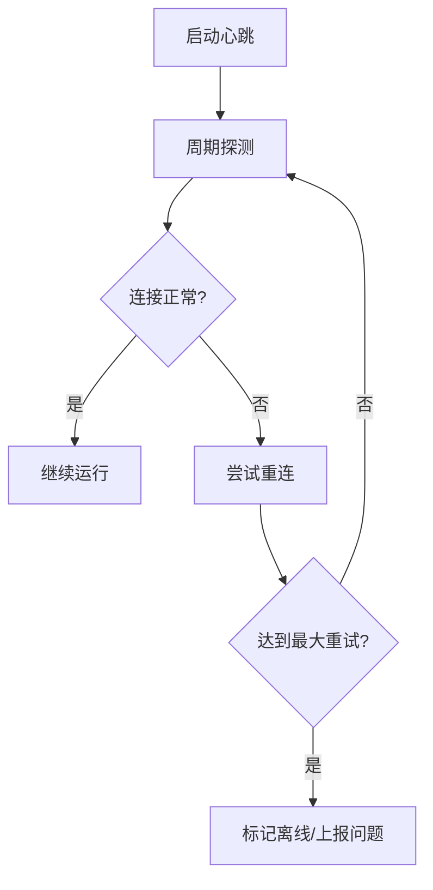

**图表来源**

- [src/channels/plugins/whatsapp-heartbeat.ts](file://src/channels/plugins/whatsapp-heartbeat.ts)
- [src/channels/plugins/whatsapp-shared.ts](file://src/channels/plugins/whatsapp-shared.ts)

**章节来源**

- [src/channels/plugins/whatsapp-heartbeat.ts](file://src/channels/plugins/whatsapp-heartbeat.ts)
- [src/channels/plugins/whatsapp-shared.ts](file://src/channels/plugins/whatsapp-shared.ts)

### 自动回复与消息同步

- 分块回复管道：带超时与中断控制，确保有序交付，避免乱序与重复。
- Web入站消息行：构建入站消息行，支持前缀、回复上下文与信封封装。

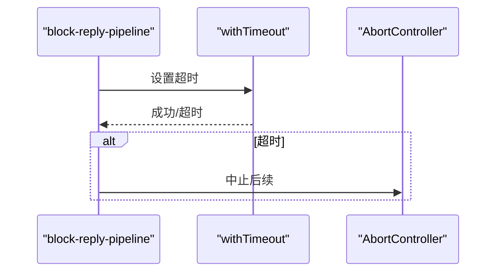

**图表来源**

- [src/auto-reply/reply/block-reply-pipeline.ts:109-152](file://src/auto-reply/reply/block-reply-pipeline.ts#L109-L152)

**章节来源**

- [src/auto-reply/reply/block-reply-pipeline.ts:109-152](file://src/auto-reply/reply/block-reply-pipeline.ts#L109-L152)
- [src/web/auto-reply/monitor/message-line.ts:1-48](file://src/web/auto-reply/monitor/message-line.ts#L1-L48)

## 依赖关系分析

- 低耦合高内聚：通道适配器通过统一接口与核心类型解耦，插件注册表集中管理，避免共享路径加载重型实现。
- 关键依赖链：
  - 适配器接口 → 核心类型 → 配置与安全 → 出站路由 → 平台实现
  - 注册表 → 插件注册表 → 适配器接口
  - 状态收集 → 插件状态适配器 → 聚合

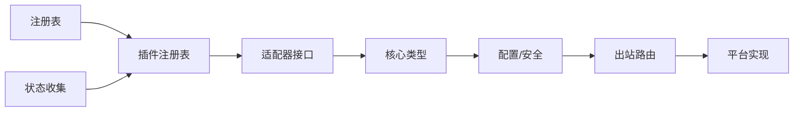

**图表来源**

- [src/channels/plugins/types.adapters.ts:1-384](file://src/channels/plugins/types.adapters.ts#L1-L384)
- [src/channels/plugins/types.core.ts:1-403](file://src/channels/plugins/types.core.ts#L1-L403)
- [src/channels/plugins/index.ts:1-118](file://src/channels/plugins/index.ts#L1-L118)
- [src/infra/outbound/bound-delivery-router.ts:49-91](file://src/infra/outbound/bound-delivery-router.ts#L49-L91)

**章节来源**

- [src/channels/plugins/types.adapters.ts:1-384](file://src/channels/plugins/types.adapters.ts#L1-L384)
- [src/channels/plugins/types.core.ts:1-403](file://src/channels/plugins/types.core.ts#L1-L403)
- [src/channels/plugins/index.ts:1-118](file://src/channels/plugins/index.ts#L1-L118)
- [src/infra/outbound/bound-delivery-router.ts:49-91](file://src/infra/outbound/bound-delivery-router.ts#L49-L91)

## 性能考量

- 插件注册表缓存：避免重复扫描与排序，提升启动与查询性能。
- 出站分块与限流：按平台限制与能力设置分块模式与文本上限，减少失败重试。
- 心跳与重连：合理的心跳间隔与指数退避重连，降低资源占用与抖动。
- 状态收集批量化：按账户批量收集问题，减少重复调用。

[本节为通用指导，无需具体文件分析]

## 故障排查指南

- 连接状态问题：检查通道账户快照中的lastError、lastDisconnect与reconnectAttempts。
- 权限与白名单：核对组策略与allowFrom配置，确认大小写不敏感匹配是否符合预期。
- 出站路由：确认会话绑定是否存在唯一活动绑定，或是否需要显式请求者。
- 平台特定问题：查看平台插件的状态适配器与问题收集函数返回的具体错误与修复建议。

**章节来源**

- [src/channels/plugins/status-issues/shared.ts:46-63](file://src/channels/plugins/status-issues/shared.ts#L46-L63)
- [src/infra/channels-status-issues.ts:1-20](file://src/infra/channels-status-issues.ts#L1-L20)
- [src/config/group-policy.ts:282-359](file://src/config/group-policy.ts#L282-L359)
- [src/infra/outbound/bound-delivery-router.ts:49-91](file://src/infra/outbound/bound-delivery-router.ts#L49-L91)

## 结论

OpenClaw通道系统通过插件化适配器与统一类型体系，实现了跨平台的一致能力边界；借助注册表与目录，确保可发现性与可安装性；通过配置与安全辅助、出站绑定路由与状态监控，保障了消息的正确投递与可观测性；平台示例展示了消息格式转换、动作与标准化、心跳与重连等关键能力。整体设计具备良好的扩展性与性能基础，适合持续演进与大规模部署。

[本节为总结，无需具体文件分析]

## 附录

### 实现新通道适配器步骤

- 定义适配器接口：参考适配器接口类型，至少实现配置、出站、状态与可选的心跳/目录/解析/安全等适配器。
- 实现平台能力：完成目标标准化、消息动作、轮询、媒体限制、格式转换等平台特性。
- 集成到注册表：在插件入口导出插件对象，包含meta与适配器实现。
- 配置与安全：提供账户配置补丁与默认账户解析，构建DM安全策略。
- 路由与测试：编写出站路由与状态收集测试，确保绑定解析与问题上报正确。

**章节来源**

- [src/channels/plugins/types.adapters.ts:1-384](file://src/channels/plugins/types.adapters.ts#L1-L384)
- [src/channels/plugins/types.core.ts:1-403](file://src/channels/plugins/types.core.ts#L1-L403)
- [src/channels/plugins/catalog.ts:1-308](file://src/channels/plugins/catalog.ts#L1-L308)
- [src/channels/plugins/setup-helpers.ts:1-311](file://src/channels/plugins/setup-helpers.ts#L1-L311)
- [src/channels/plugins/helpers.ts:1-59](file://src/channels/plugins/helpers.ts#L1-L59)
