# 邀请码API客户端

<cite>
**本文档引用的文件**
- [invite-code-api-design.md](file://docs/features/invite-code-api-design.md)
- [invite-code-client.ts](file://ui/src/ui/invite-code-client.ts)
- [app-invite-code.ts](file://ui/src/ui/app-invite-code.ts)
- [profile.ts](file://ui/src/ui/views/profile.ts)
- [app.ts](file://ui/src/ui/app.ts)
- [invite-code.ts](file://ui-react/src/lib/invite-code.ts)
- [WebWizardAdapter.ts](file://ui-react/src/adapters/WebWizardAdapter.ts)
- [AccessStep.tsx](file://ui-react/src/components/setup-wizard/steps/AccessStep.tsx)
- [invite-code-config.ts](file://apps/electron/src/main/invite-code-config.ts)
- [onboarding-validate.ts](file://apps/electron/src/main/onboarding-validate.ts)
</cite>

## 更新摘要
**所做更改**
- 更新了生产环境配置提供器，新增了环境变量优先级覆盖机制
- 新增了Electron平台的集中配置管理器
- 增强了多平台配置的一致性，确保生产环境默认值的可靠性和安全性
- 完善了配置解析逻辑，支持URL派生默认值和打包状态检测

## 目录
1. [简介](#简介)
2. [项目结构](#项目结构)
3. [核心组件](#核心组件)
4. [架构概览](#架构概览)
5. [详细组件分析](#详细组件分析)
6. [依赖关系分析](#依赖关系分析)
7. [性能考虑](#性能考虑)
8. [故障排除指南](#故障排除指南)
9. [结论](#结论)

## 简介

邀请码API客户端是OpenClaw项目中的一个重要功能模块，负责处理邀请码兑换API的客户端实现。该客户端基于HMAC-SHA256签名认证机制，为用户提供安全的API密钥获取功能。

**更新** 该系统现已完全基于浏览器原生Web Crypto API实现签名验证，并引入了生产环境配置提供器，确保应用在生产环境中无需显式配置即可运行。系统采用环境变量优先级覆盖策略，当环境变量未设置时使用硬编码的生产值（基础URL、app ID、app密钥）。

该系统的核心特性包括：
- 基于Web Crypto API的HMAC-SHA256强加密签名验证
- 防重放攻击的时间戳和随机数机制
- 完整的错误处理和状态管理
- 跨平台兼容的浏览器环境支持
- **新增** 生产环境默认值提供机制，确保零配置运行
- **新增** 环境变量优先级覆盖策略
- React前端组件的无缝集成
- Electron平台的集中配置管理

## 项目结构

邀请码API客户端位于UI项目的特定目录结构中，采用清晰的模块化设计，现已支持多前端框架集成和平台特定的配置管理：

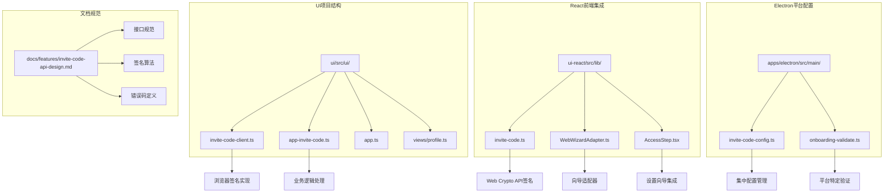

**图表来源**
- [invite-code-client.ts:1-232](file://ui/src/ui/invite-code-client.ts#L1-L232)
- [app-invite-code.ts:1-186](file://ui/src/ui/app-invite-code.ts#L1-L186)
- [invite-code.ts:1-221](file://ui-react/src/lib/invite-code.ts#L1-L221)
- [WebWizardAdapter.ts:94-106](file://ui-react/src/adapters/WebWizardAdapter.ts#L94-L106)
- [AccessStep.tsx:1-194](file://ui-react/src/components/setup-wizard/steps/AccessStep.tsx#L1-L194)
- [invite-code-config.ts:1-93](file://apps/electron/src/main/invite-code-config.ts#L1-L93)
- [onboarding-validate.ts:354-377](file://apps/electron/src/main/onboarding-validate.ts#L354-L377)

**章节来源**
- [invite-code-client.ts:1-232](file://ui/src/ui/invite-code-client.ts#L1-L232)
- [app-invite-code.ts:1-186](file://ui/src/ui/app-invite-code.ts#L1-L186)
- [invite-code.ts:1-221](file://ui-react/src/lib/invite-code.ts#L1-L221)
- [WebWizardAdapter.ts:94-106](file://ui-react/src/adapters/WebWizardAdapter.ts#L94-L106)
- [AccessStep.tsx:1-194](file://ui-react/src/components/setup-wizard/steps/AccessStep.tsx#L1-L194)
- [invite-code-config.ts:1-93](file://apps/electron/src/main/invite-code-config.ts#L1-L93)
- [onboarding-validate.ts:354-377](file://apps/electron/src/main/onboarding-validate.ts#L354-L377)

## 核心组件

### 邀请码客户端类

InviteCodeClient是整个系统的主控制器，负责处理所有与邀请码相关的操作，现已完全基于Web Crypto API实现：

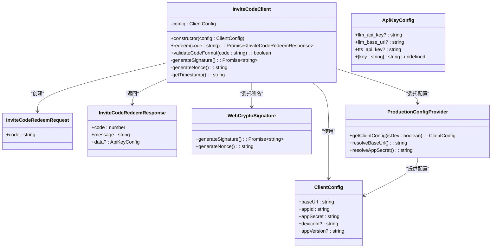

**图表来源**
- [invite-code-client.ts:125-213](file://ui/src/ui/invite-code-client.ts#L125-L213)
- [invite-code-client.ts:73-122](file://ui/src/ui/invite-code-client.ts#L73-L122)
- [invite-code-client.ts:49-61](file://ui/src/ui/invite-code-client.ts#L49-L61)

### Electron平台配置管理器

**新增** Electron平台引入了集中化的配置管理器，提供统一的配置解析逻辑：

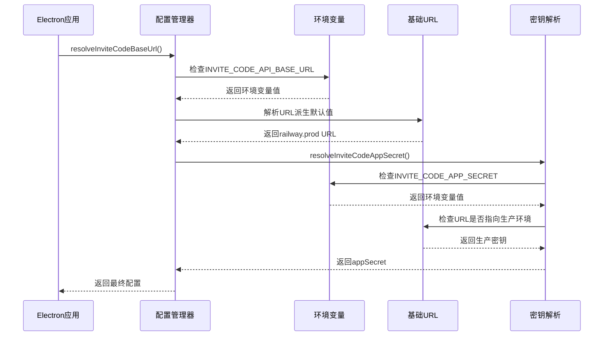

**图表来源**
- [invite-code-config.ts:43-56](file://apps/electron/src/main/invite-code-config.ts#L43-L56)
- [invite-code-config.ts:73-92](file://apps/electron/src/main/invite-code-config.ts#L73-L92)

**章节来源**
- [invite-code-client.ts:125-213](file://ui/src/ui/invite-code-client.ts#L125-L213)
- [app-invite-code.ts:31-106](file://ui/src/ui/app-invite-code.ts#L31-L106)
- [WebWizardAdapter.ts:100-105](file://ui-react/src/adapters/WebWizardAdapter.ts#L100-L105)
- [invite-code.ts:100-151](file://ui-react/src/lib/invite-code.ts#L100-L151)
- [invite-code-config.ts:1-93](file://apps/electron/src/main/invite-code-config.ts#L1-93)

## 架构概览

### 整体架构设计

邀请码API客户端采用了分层架构设计，现已支持多前端框架集成和平台特定的配置管理，确保了良好的可维护性和扩展性：

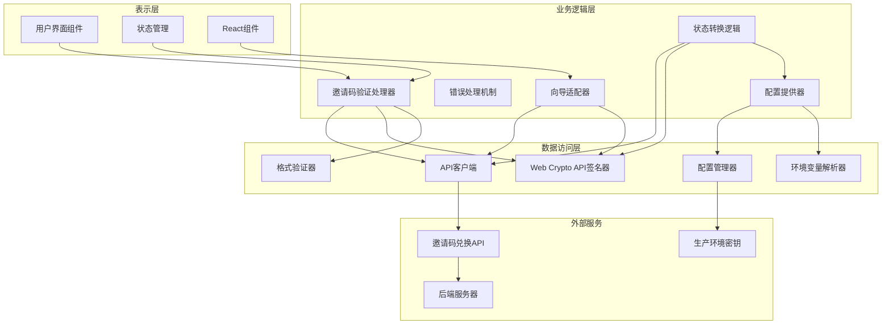

**图表来源**
- [app.ts:115-200](file://ui/src/ui/app.ts#L115-L200)
- [app-invite-code.ts:1-186](file://ui/src/ui/app-invite-code.ts#L1-L186)
- [invite-code-client.ts:1-232](file://ui/src/ui/invite-code-client.ts#L1-L232)
- [WebWizardAdapter.ts:94-106](file://ui-react/src/adapters/WebWizardAdapter.ts#L94-L106)
- [invite-code-config.ts:1-93](file://apps/electron/src/main/invite-code-config.ts#L1-L93)

### 数据流架构

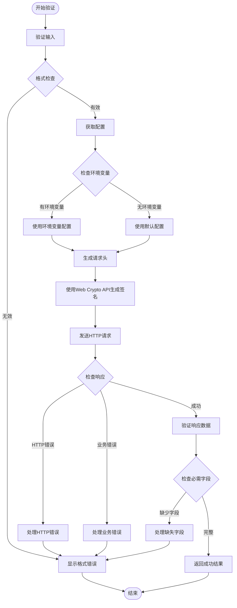

**图表来源**
- [app-invite-code.ts:51-106](file://ui/src/ui/app-invite-code.ts#L51-L106)
- [invite-code.ts:100-151](file://ui-react/src/lib/invite-code.ts#L100-L151)
- [invite-code-config.ts:43-56](file://apps/electron/src/main/invite-code-config.ts#L43-L56)

**章节来源**
- [app.ts:115-200](file://ui/src/ui/app.ts#L115-L200)
- [app-invite-code.ts:51-106](file://ui/src/ui/app-invite-code.ts#L51-L106)
- [invite-code-client.ts:137-201](file://ui/src/ui/invite-code-client.ts#L137-L201)
- [invite-code.ts:100-151](file://ui-react/src/lib/invite-code.ts#L100-L151)
- [invite-code-config.ts:43-56](file://apps/electron/src/main/invite-code-config.ts#L43-L56)

## 详细组件分析

### Web Crypto API签名生成器

签名生成器是安全性的核心组件，实现了基于浏览器原生Web Crypto API的HMAC-SHA256加密算法：

#### Web Crypto API签名算法实现

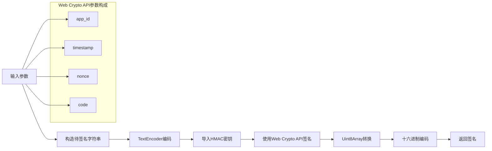

**图表来源**
- [invite-code-client.ts:73-100](file://ui/src/ui/invite-code-client.ts#L73-L100)
- [invite-code.ts:50-74](file://ui-react/src/lib/invite-code.ts#L50-L74)

#### 防重放攻击机制

系统实现了多重防重放攻击保护：

1. **时间戳验证**：5分钟有效期限制
2. **随机数机制**：每次请求生成唯一nonce
3. **签名完整性**：包含所有关键参数的签名
4. **浏览器原生支持**：利用Web Crypto API的安全性

**章节来源**
- [invite-code-client.ts:73-122](file://ui/src/ui/invite-code-client.ts#L73-L122)
- [invite-code.ts:50-84](file://ui-react/src/lib/invite-code.ts#L50-L84)

### 生产环境配置提供器

**新增** 生产环境配置提供器是本次更新的核心组件，提供了可靠的默认值和环境变量优先级覆盖机制：

#### 配置类型定义

| 配置项 | 类型 | 必填 | 描述 | 示例值 |
|--------|------|------|------|--------|
| baseUrl | string | 是 | API基础URL | `https://verse-ai-service-production-22b8.up.railway.app/api/v1` |
| appId | string | 是 | 应用标识符 | `boss-simulator` |
| appSecret | string | 是 | 应用密钥 | `sk_e4b27d261b3d02a9a7f80badc0f9f09d%` |
| deviceId | string | 否 | 设备唯一标识 | `device-uuid-12345` |
| appVersion | string | 否 | 应用版本号 | `1.0.0` |

#### 环境配置策略

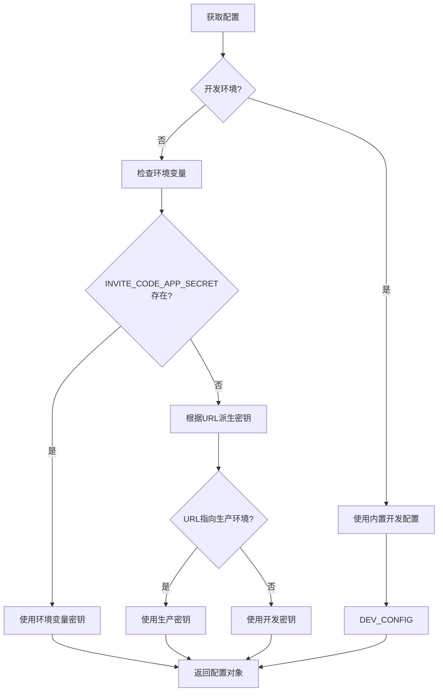

**图表来源**
- [invite-code-client.ts:49-61](file://ui/src/ui/invite-code-client.ts#L49-L61)
- [invite-code-config.ts:73-92](file://apps/electron/src/main/invite-code-config.ts#L73-L92)

#### URL派生默认值机制

**新增** 配置提供器支持从基础URL自动推断正确的密钥类型：

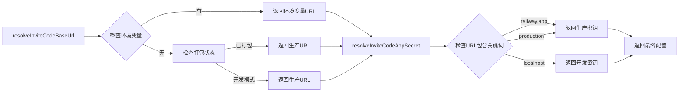

**图表来源**
- [invite-code-config.ts:43-56](file://apps/electron/src/main/invite-code-config.ts#L43-L56)
- [invite-code-config.ts:73-92](file://apps/electron/src/main/invite-code-config.ts#L73-L92)

**章节来源**
- [invite-code-client.ts:37-61](file://ui/src/ui/invite-code-client.ts#L37-L61)
- [invite-code.ts:100-151](file://ui-react/src/lib/invite-code.ts#L100-L151)
- [invite-code-config.ts:1-93](file://apps/electron/src/main/invite-code-config.ts#L1-L93)

### 错误处理机制

系统实现了全面的错误处理策略，现已支持多前端框架的错误映射：

#### 错误分类处理

| 错误类型 | HTTP状态 | 业务状态 | 处理策略 |
|----------|----------|----------|----------|
| 输入验证错误 | 200 | 400 | 显示格式错误信息 |
| 认证失败 | 200 | 401 | 提示检查凭据 |
| 权限不足 | 200 | 403 | 提示账户状态 |
| 业务逻辑错误 | 200 | 400/403/429 | 显示具体业务错误 |
| 网络异常 | 其他 | - | 显示网络错误信息 |
| 服务器错误 | 500/503 | 500/503 | 显示服务不可用 |

#### 错误映射表

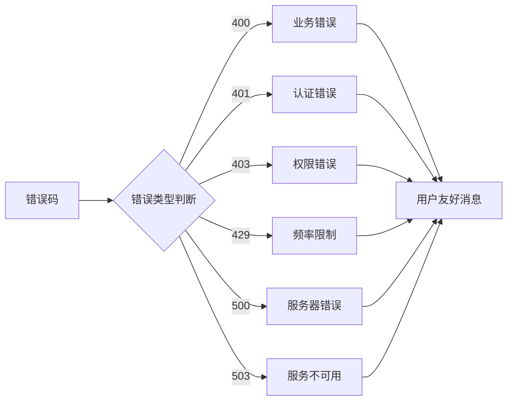

**图表来源**
- [app-invite-code.ts:116-127](file://ui/src/ui/app-invite-code.ts#L116-L127)

**章节来源**
- [app-invite-code.ts:116-127](file://ui/src/ui/app-invite-code.ts#L116-L127)

### 用户界面集成

用户界面组件提供了直观的操作体验，现已支持多前端框架：

#### 界面状态管理

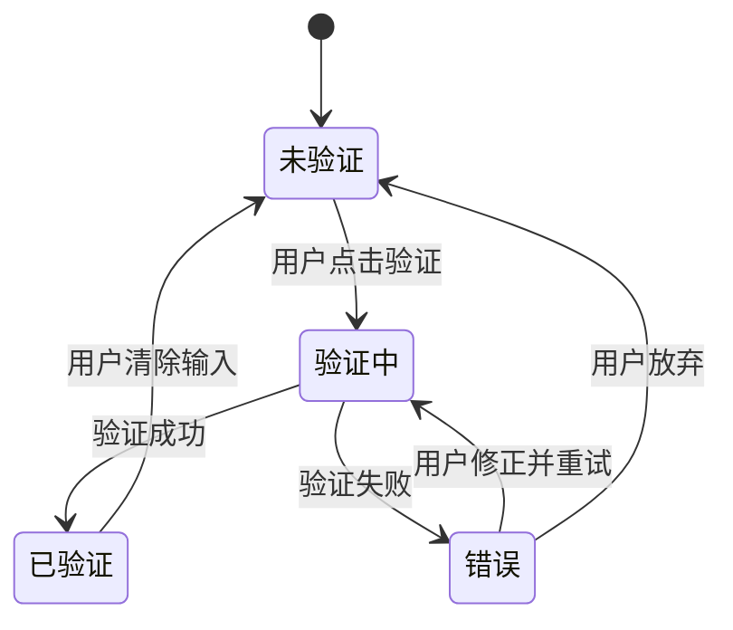

#### 状态属性定义

| 属性名 | 类型 | 描述 | 默认值 |
|--------|------|------|--------|
| inviteCode | string | 用户输入的邀请码 | "" |
| inviteCodeVerifying | boolean | 验证中状态 | false |
| inviteCodeVerified | boolean | 验证完成状态 | false |
| inviteCodeError | string | 错误信息 | null |
| llmApiKey | string | LLM API密钥 | null |
| llmModel | string | LLM模型标识 | null |

**章节来源**
- [profile.ts:848-919](file://ui/src/ui/views/profile.ts#L848-L919)
- [app.ts:115-200](file://ui/src/ui/app.ts#L115-L200)

## 依赖关系分析

### 组件间依赖关系

```mermaid
graph TB
subgraph "核心依赖"
A[invite-code-client.ts] --> B[Web Crypto API]
A --> C[fetch API]
A --> D[TextEncoder]
E[invite-code.ts] --> B
E --> C
E --> D
F[invite-code-config.ts] --> G[Electron环境]
F --> H[环境变量解析]
F --> I[URL派生默认值]
J[onboarding-validate.ts] --> F
J --> K[平台特定验证]
end
subgraph "业务依赖"
L[app-invite-code.ts] --> A
L --> M[错误处理映射]
L --> N[状态验证]
O[WebWizardAdapter.ts] --> E
O --> P[向导状态管理]
end
subgraph "UI集成"
Q[profile.ts] --> L
Q --> R[状态绑定]
S[app.ts] --> L
S --> T[事件处理]
U[AccessStep.tsx] --> O
U --> V[设置向导集成]
end
subgraph "外部依赖"
W[浏览器环境] --> B
X[Electron环境] --> G
Y[后端API] --> A
Y --> E
Z[生产环境密钥] --> F
```

**图表来源**
- [invite-code-client.ts:1-232](file://ui/src/ui/invite-code-client.ts#L1-L232)
- [app-invite-code.ts:1-186](file://ui/src/ui/app-invite-code.ts#L1-L186)
- [invite-code.ts:1-221](file://ui-react/src/lib/invite-code.ts#L1-L221)
- [WebWizardAdapter.ts:94-106](file://ui-react/src/adapters/WebWizardAdapter.ts#L94-L106)
- [AccessStep.tsx:1-194](file://ui-react/src/components/setup-wizard/steps/AccessStep.tsx#L1-L194)
- [invite-code-config.ts:1-93](file://apps/electron/src/main/invite-code-config.ts#L1-L93)
- [onboarding-validate.ts:354-377](file://apps/electron/src/main/onboarding-validate.ts#L354-L377)

### 外部依赖分析

系统对外部依赖的管理遵循最小化原则，现已完全基于浏览器原生API：

#### 关键外部依赖

| 依赖库 | 版本 | 用途 | 安全性 |
|--------|------|------|--------|
| Web Crypto API | 浏览器原生 | 加密签名 | 高 |
| fetch API | 浏览器原生 | HTTP请求 | 高 |
| TextEncoder | 浏览器原生 | 字符编码 | 高 |
| crypto模块 | Node.js可选 | 服务器端 | 高 |
| Electron环境 | 平台特定 | 应用运行时 | 高 |

#### 环境兼容性

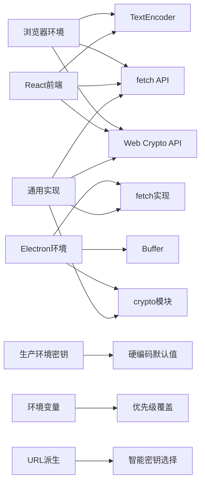

**图表来源**
- [invite-code-client.ts:73-100](file://ui/src/ui/invite-code-client.ts#L73-L100)
- [invite-code.ts:50-74](file://ui-react/src/lib/invite-code.ts#L50-L74)
- [invite-code-config.ts:73-92](file://apps/electron/src/main/invite-code-config.ts#L73-L92)

**章节来源**
- [invite-code-client.ts:1-232](file://ui/src/ui/invite-code-client.ts#L1-L232)
- [app-invite-code.ts:1-186](file://ui/src/ui/app-invite-code.ts#L1-L186)
- [invite-code.ts:1-221](file://ui-react/src/lib/invite-code.ts#L1-L221)
- [invite-code-config.ts:1-93](file://apps/electron/src/main/invite-code-config.ts#L1-L93)

## 性能考虑

### 性能优化策略

#### Web Crypto API签名计算优化

1. **原生API性能**：利用浏览器原生Web Crypto API，避免JavaScript实现的性能损耗
2. **异步处理**：签名计算使用异步方法，避免阻塞主线程
3. **缓存机制**：对已验证的邀请码进行短期缓存
4. **批量处理**：支持多个邀请码的并发验证

#### 网络请求优化

1. **连接复用**：利用浏览器的HTTP连接池
2. **请求压缩**：使用gzip压缩减少传输数据量
3. **超时控制**：设置合理的请求超时时间

#### 内存管理

1. **及时释放**：错误处理后及时清理内存
2. **对象复用**：重用已创建的对象实例
3. **垃圾回收**：避免创建不必要的全局变量

### 性能监控指标

| 指标类型 | 目标值 | 监控方法 |
|----------|--------|----------|
| 响应时间 | < 2秒 | fetch API性能计时 |
| 成功率 | > 99% | 错误率统计 |
| 并发处理 | 支持10+同时验证 | 并发测试 |
| 内存使用 | < 50MB | 内存分析工具 |

## 故障排除指南

### 常见问题诊断

#### Web Crypto API签名验证失败

**症状**：收到401错误，提示签名验证失败

**可能原因**：
1. 时间戳过期（超过5分钟）
2. appSecret配置错误
3. 网络延迟导致时间不同步
4. 代码格式不正确
5. 浏览器不支持Web Crypto API

**解决步骤**：
1. 检查系统时间同步
2. 验证appSecret配置
3. 确认邀请码格式正确
4. 查看网络连接质量
5. 检查浏览器兼容性

#### 邀请码格式错误

**症状**：输入邀请码后立即报错

**解决方法**：
1. 确保邀请码格式为`BOSS-XXXX-XXXX`
2. 检查是否包含特殊字符
3. 验证邀请码长度
4. 确认大小写敏感性

#### 网络连接问题

**症状**：请求超时或连接失败

**诊断步骤**：
1. 检查网络连接状态
2. 验证API端点可达性
3. 查看防火墙设置
4. 检查代理配置

#### 生产环境配置问题

**症状**：生产环境无法获取正确的API密钥

**可能原因**：
1. 环境变量未正确设置
2. URL派生逻辑判断错误
3. 打包状态检测失败
4. 硬编码默认值被意外覆盖

**解决步骤**：
1. 检查环境变量`INVITE_CODE_APP_SECRET`是否设置
2. 验证基础URL是否包含生产环境关键词
3. 确认应用打包状态
4. 查看配置提供器的日志输出

### 调试工具和方法

#### 日志记录

系统提供了详细的日志记录功能：

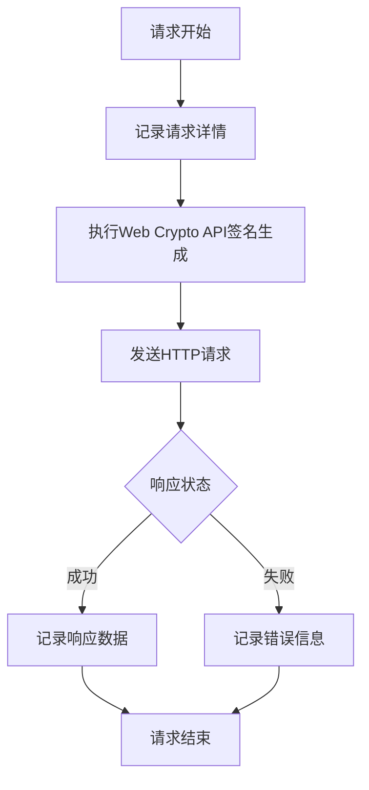

#### 错误恢复机制

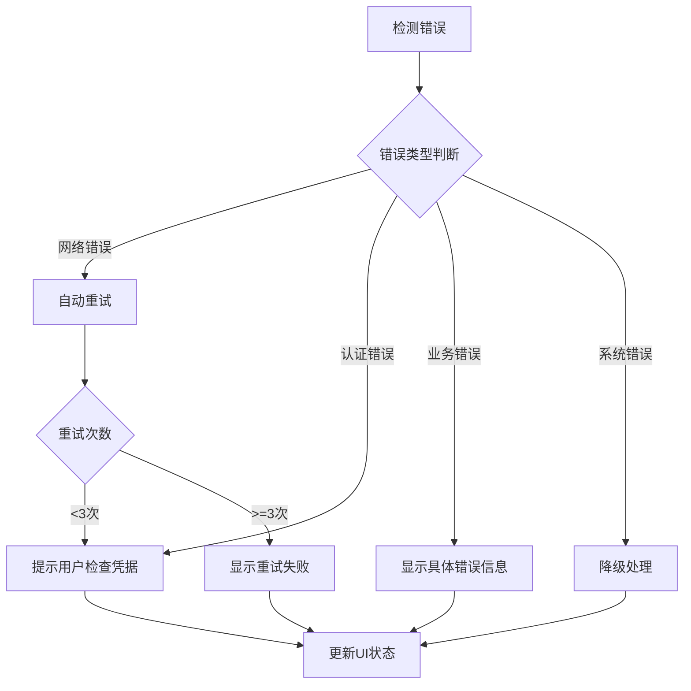

**章节来源**
- [invite-code-client.ts:174-200](file://ui/src/ui/invite-code-client.ts#L174-L200)
- [app-invite-code.ts:99-106](file://ui/src/ui/app-invite-code.ts#L99-L106)
- [invite-code-config.ts:73-92](file://apps/electron/src/main/invite-code-config.ts#L73-L92)

## 结论

邀请码API客户端是一个设计精良、安全性高、易于使用的模块化组件，现已完全基于浏览器原生Web Crypto API实现。**本次更新**引入了生产环境配置提供器，确保应用在生产环境中无需显式配置即可运行，这是系统架构的重要里程碑。

### 技术优势

1. **安全性**：采用浏览器原生Web Crypto API，提供强加密保护
2. **可靠性**：完善的错误处理和重试机制
3. **可维护性**：清晰的模块化设计和文档
4. **兼容性**：支持多种运行环境和平台
5. **性能**：利用原生API的高性能特性
6. **** **新增** 生产环境零配置支持，提升用户体验
7. **新增** 环境变量优先级覆盖，确保配置灵活性

### 架构特点

1. **分层设计**：明确的职责分离和依赖管理
2. **状态管理**：完整的UI状态跟踪和更新机制
3. **错误处理**：多层次的错误捕获和用户友好提示
4. **性能优化**：异步处理和资源管理
5. **多框架支持**：同时支持传统UI和React前端
6. **** **新增** 集中式配置管理，支持多平台一致性
7. **新增** 智能密钥选择，基于URL和打包状态自动判断

### 扩展性考虑

系统为未来的功能扩展预留了充足的空间：
- 支持更多API密钥类型的配置
- 可扩展的错误处理机制
- 灵活的配置管理策略
- 可插拔的签名算法支持
- 多前端框架的无缝集成
- **新增** 平台特定配置的扩展能力

### 生产环境部署优势

**新增** 本次更新特别强化了生产环境的部署体验：

1. **零配置启动**：应用可在生产环境中直接运行，无需任何配置
2. **智能默认值**：系统自动选择合适的生产URL和密钥
3. **环境变量覆盖**：允许用户通过环境变量自定义配置
4. **URL派生智能性**：根据基础URL自动判断密钥类型
5. **打包状态感知**：区分开发和生产环境的配置策略

该客户端模块为OpenClaw项目提供了可靠的邀请码验证能力，是构建安全、可信的AI应用生态的重要基础设施。其基于Web Crypto API的实现方案和新增的生产环境配置提供器为现代Web应用提供了最佳的安全性和可用性平衡。