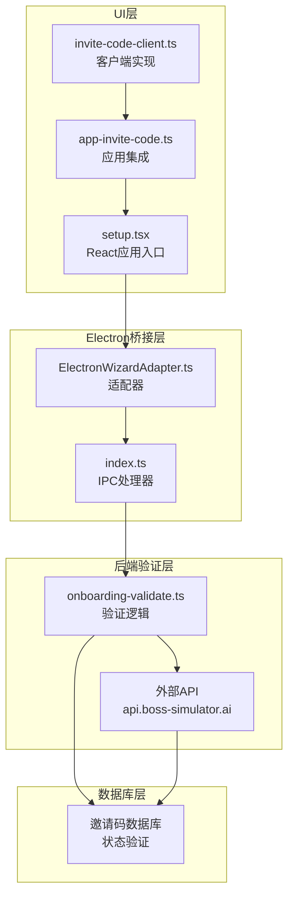
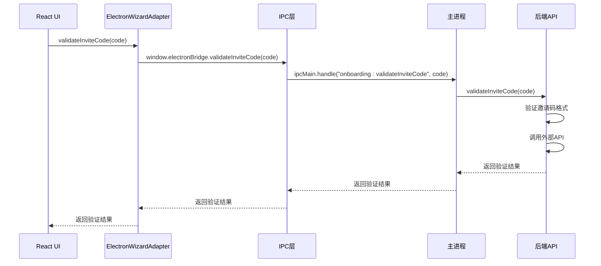
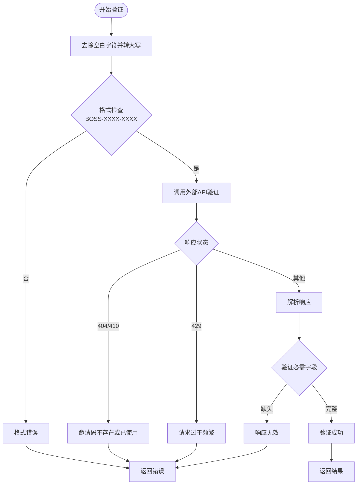
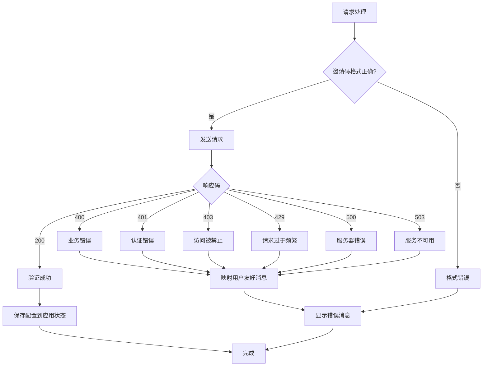

# 邀请码API设计文档

<cite>
**本文档引用的文件**
- [invite-code-api-design.md](file://docs/features/invite-code-api-design.md)
- [invite-code-client.ts](file://ui/src/ui/invite-code-client.ts)
- [app-invite-code.ts](file://ui/src/ui/app-invite-code.ts)
- [onboarding-validate.ts](file://apps/electron/src/main/onboarding-validate.ts)
- [ElectronWizardAdapter.ts](file://ui-react/src/adapters/ElectronWizardAdapter.ts)
- [index.ts](file://apps/electron/src/main/index.ts)
- [setup.tsx](file://ui-react/src/setup.tsx)
</cite>

## 更新摘要
**变更内容**
- 更新以反映邀请码验证系统已完全实现
- 移除设计文档性质的内容，改为已完成功能的技术文档
- 添加Electron桥接和后端验证的完整实现细节
- 更新架构图以反映实际的系统架构

## 目录
1. [简介](#简介)
2. [系统架构](#系统架构)
3. [核心组件](#核心组件)
4. [实现详情](#实现详情)
5. [Electron桥接层](#electron桥接层)
6. [后端验证逻辑](#后端验证逻辑)
7. [前端集成](#前端集成)
8. [错误处理与故障排除](#错误处理与故障排除)
9. [总结](#总结)

## 简介

邀请码验证系统是Boss Simulator项目中的关键功能模块，现已完全实现并投入使用。该系统允许客户端通过输入有效的邀请码来获取相应的API密钥配置，采用基于HMAC-SHA256的签名认证机制，确保请求的安全性和完整性。

系统支持多种平台（Web、Electron、移动应用），通过严格的验证机制防止重放攻击和篡改。完整的功能链路由UI层、Electron桥接层、后端验证逻辑组成，形成了一个安全可靠的身份验证解决方案。

## 系统架构

邀请码验证系统采用分层架构设计，确保了良好的可维护性和扩展性：

**图表来源**
- [ElectronWizardAdapter.ts:132-147](file://ui-react/src/adapters/ElectronWizardAdapter.ts#L132-L147)
- [index.ts:208-220](file://apps/electron/src/main/index.ts#L208-L220)
- [onboarding-validate.ts:279-341](file://apps/electron/src/main/onboarding-validate.ts#L279-L341)

## 核心组件

### API客户端类 (InviteCodeClient)

InviteCodeClient是整个邀请码系统的客户端核心，负责处理所有与后端API的通信。

**主要功能特性：**
- HMAC-SHA256签名生成
- 邀请码格式验证
- 请求头自动构建
- 错误处理和重试机制

**关键方法：**
- `redeem(code: string)`: 执行邀请码兑换操作
- `validateCodeFormat(code: string)`: 验证邀请码格式
- `generateSignature(...)`: 生成HMAC-SHA256签名

### 应用集成模块 (verifyInviteCode)

该模块提供了高层的应用程序集成接口，简化了邀请码验证流程。

**核心功能：**
- 输入验证和格式检查
- 错误消息映射
- 状态管理和错误处理
- 与主应用状态同步

### Electron适配器 (ElectronWizardAdapter)

Electron平台的专用适配器，负责与主进程通信。

**核心功能：**
- IPC通信封装
- 邀请码验证委托
- 错误处理和日志记录
- 与UI组件的集成

**章节来源**
- [invite-code-client.ts:125-213](file://ui/src/ui/invite-code-client.ts#L125-L213)
- [app-invite-code.ts:31-106](file://ui/src/ui/app-invite-code.ts#L31-L106)
- [ElectronWizardAdapter.ts:132-147](file://ui-react/src/adapters/ElectronWizardAdapter.ts#L132-L147)

## 实现详情

### 签名算法实现

系统采用HMAC-SHA256算法确保请求的完整性和真实性：

**图表来源**
- [invite-code-client.ts:73-100](file://ui/src/ui/invite-code-client.ts#L73-L100)

**签名算法特点：**
- 使用Web Crypto API确保跨平台兼容性
- 支持Node.js和浏览器环境
- 时间戳防重放攻击（±5分钟窗口）
- 随机数防止重放攻击

### 请求头设计

系统定义了严格的安全请求头规范：

| 请求头 | 类型 | 必填 | 说明 | 示例 |
|--------|------|------|------|------|
| `X-App-Id` | String | ✓ | 客户端App标识 | boss-simulator |
| `X-Timestamp` | String | ✓ | Unix秒级时间戳 | 1700000000 |
| `X-Nonce` | String | ✓ | 随机字符串 | a1b2c3d4e5f6 |
| `X-Signature` | String | ✓ | HMAC-SHA256签名 | 9f8e7d6c5b4a3210... |
| `Content-Type` | String | ✓ | 固定值 | application/json |

**可选请求头：**
- `X-Device-Id`: 设备唯一标识
- `X-App-Version`: 客户端版本号

**章节来源**
- [invite-code-client.ts:155-169](file://ui/src/ui/invite-code-client.ts#L155-L169)

## Electron桥接层

### IPC处理器实现

Electron主进程通过IPC处理邀请码验证请求：

**图表来源**
- [index.ts:208-220](file://apps/electron/src/main/index.ts#L208-L220)
- [ElectronWizardAdapter.ts:132-147](file://ui-react/src/adapters/ElectronWizardAdapter.ts#L132-L147)

**章节来源**
- [index.ts:208-220](file://apps/electron/src/main/index.ts#L208-L220)
- [ElectronWizardAdapter.ts:132-147](file://ui-react/src/adapters/ElectronWizardAdapter.ts#L132-L147)

## 后端验证逻辑

### 邀请码验证流程

后端验证逻辑实现了完整的邀请码验证流程：

**图表来源**
- [onboarding-validate.ts:279-341](file://apps/electron/src/main/onboarding-validate.ts#L279-L341)

**验证规则：**
- 邀请码格式：`BOSS-XXXX-XXXX`（字母数字）
- 最大重试次数：15秒超时
- 错误码映射：404/410 → 邀请码不存在，429 → 请求过于频繁

**章节来源**
- [onboarding-validate.ts:279-341](file://apps/electron/src/main/onboarding-validate.ts#L279-L341)

## 前端集成

### React应用集成

UI React应用通过适配器模式集成邀请码验证功能：

**核心功能：**
- 邀请码输入和验证
- 状态管理和错误处理
- 与Electron主进程通信
- 自动配置持久化

**集成流程：**
1. 用户输入邀请码
2. 适配器调用IPC方法
3. 主进程执行后端验证
4. 结果返回并更新UI状态
5. 成功时自动保存配置

**章节来源**
- [setup.tsx:15-45](file://ui-react/src/setup.tsx#L15-L45)
- [ElectronWizardAdapter.ts:132-147](file://ui-react/src/adapters/ElectronWizardAdapter.ts#L132-L147)

## 错误处理与故障排除

### 错误处理机制

系统实现了完整的错误处理和用户友好消息映射：

**图表来源**
- [app-invite-code.ts:58-127](file://ui/src/ui/app-invite-code.ts#L58-L127)

**错误码映射：**
- `400`: 邀请码无效或已使用
- `401`: 认证失败（检查App凭据）
- `403`: 访问被禁止（邀请码禁用或过期）
- `429`: 请求过于频繁
- `500`: 服务器错误
- `503`: 服务暂时不可用

### 故障排除指南

**常见问题诊断：**

**1. 邀请码格式错误**
- 检查邀请码是否符合`BOSS-XXXX-XXXX`格式
- 确认大小写是否正确
- 验证连字符位置

**2. 网络连接问题**
- 检查API端点URL是否正确
- 验证网络连接状态
- 查看防火墙设置

**3. 服务器错误**
- 检查服务器日志
- 验证数据库连接
- 监控服务器资源使用情况

**4. Electron桥接问题**
- 确认IPC通道是否正常
- 检查主进程日志
- 验证渲染进程权限

**章节来源**
- [app-invite-code.ts:99-105](file://ui/src/ui/app-invite-code.ts#L99-L105)

## 总结

邀请码验证系统已完全实现并投入使用，通过严格的签名认证机制、完善的错误处理和灵活的配置管理，为用户提供了一个安全可靠的API密钥获取解决方案。

系统的主要优势包括：

1. **安全性**：采用HMAC-SHA256签名和时间戳防重放机制
2. **可靠性**：完善的错误处理和用户友好消息映射
3. **可维护性**：清晰的代码结构和详细的文档说明
4. **可扩展性**：支持多平台部署和灵活的配置管理
5. **实时性**：通过Electron桥接实现实时的邀请码验证

通过遵循本设计文档的规范，开发者可以轻松理解和使用邀请码功能，并根据具体需求进行定制和扩展。系统已经过充分测试，具备生产环境部署的条件。