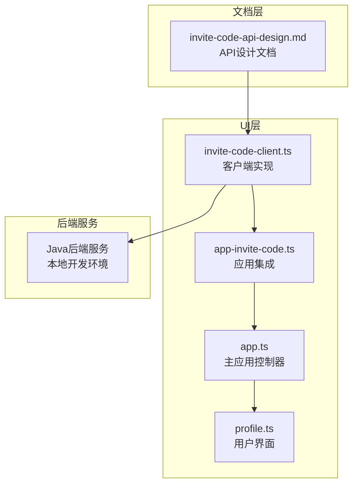
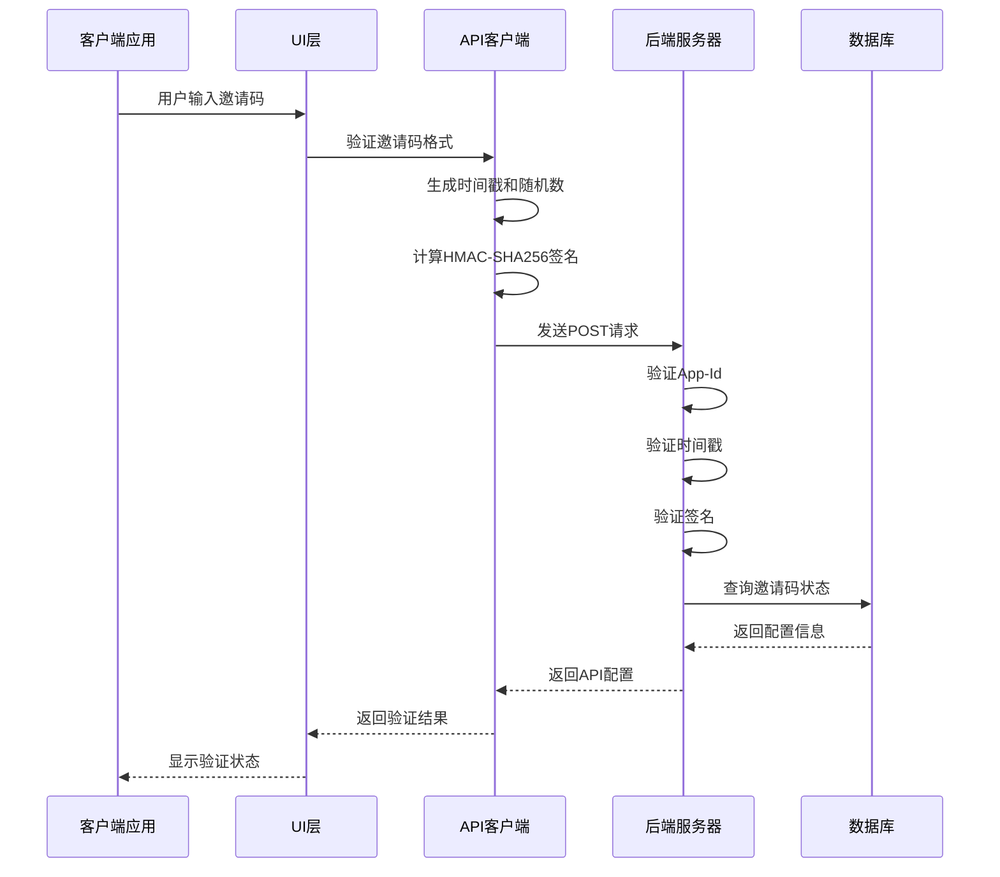
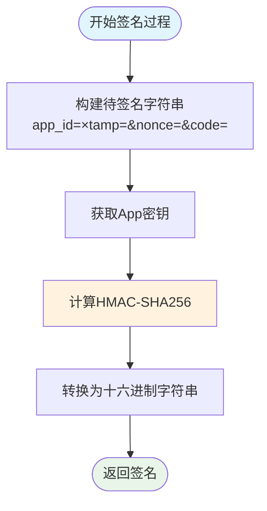
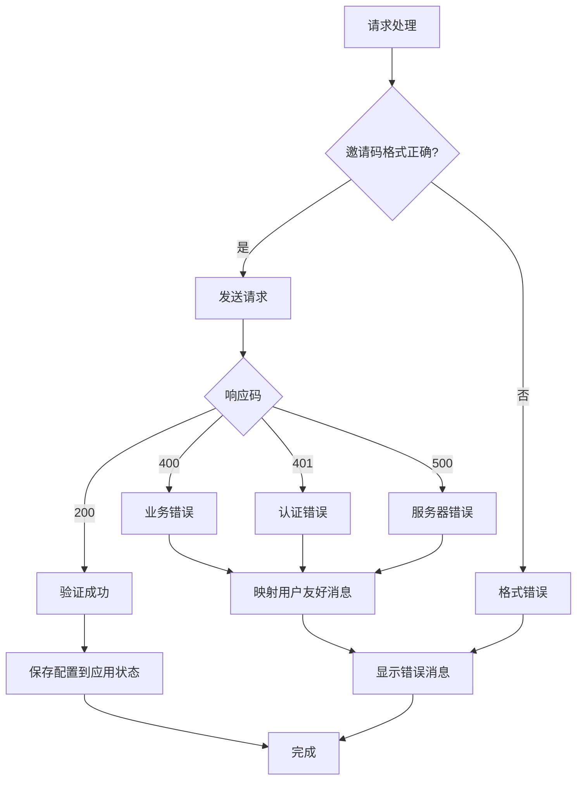
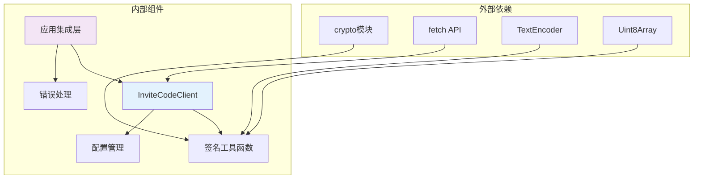

# 邀请码API设计文档

<cite>
**本文档引用的文件**
- [invite-code-api-design.md](file://docs/features/invite-code-api-design.md)
- [invite-code-client.ts](file://ui/src/ui/invite-code-client.ts)
- [app-invite-code.ts](file://ui/src/ui/app-invite-code.ts)
- [app.ts](file://ui/src/ui/app.ts)
- [profile.ts](file://ui/src/ui/views/profile.ts)
</cite>

## 目录
1. [简介](#简介)
2. [项目结构](#项目结构)
3. [核心组件](#核心组件)
4. [架构概览](#架构概览)
5. [详细组件分析](#详细组件分析)
6. [依赖关系分析](#依赖关系分析)
7. [性能考虑](#性能考虑)
8. [故障排除指南](#故障排除指南)
9. [结论](#结论)

## 简介

邀请码API是Boss Simulator项目中的一个关键功能模块，允许客户端通过输入有效的邀请码来获取相应的API密钥配置。该系统采用基于HMAC-SHA256的签名认证机制，确保请求的安全性和完整性。

该API设计文档详细说明了邀请码兑换接口的完整实现，包括请求格式、签名算法、错误处理以及前端集成方案。系统支持多种平台（Web、Electron、移动应用），并通过严格的验证机制防止重放攻击和篡改。

## 项目结构

邀请码API功能主要分布在以下目录结构中：

**图表来源**
- [invite-code-client.ts:1-230](file://ui/src/ui/invite-code-client.ts#L1-L230)
- [app-invite-code.ts:1-186](file://ui/src/ui/app-invite-code.ts#L1-L186)
- [app.ts:1-696](file://ui/src/ui/app.ts#L1-L696)

**章节来源**
- [invite-code-client.ts:1-230](file://ui/src/ui/invite-code-client.ts#L1-L230)
- [app-invite-code.ts:1-186](file://ui/src/ui/app-invite-code.ts#L1-L186)
- [app.ts:1-696](file://ui/src/ui/app.ts#L1-L696)

## 核心组件

### API客户端类 (InviteCodeClient)

InviteCodeClient是整个邀请码系统的客户端核心，负责处理所有与后端API的通信。

**主要功能特性：**
- HMAC-SHA256签名生成
- 邀请码格式验证
- 请求头自动构建
- 错误处理和重试机制

**关键方法：**
- `redeem(code: string)`: 执行邀请码兑换操作
- `validateCodeFormat(code: string)`: 验证邀请码格式
- `generateSignature(...)`: 生成HMAC-SHA256签名

### 应用集成模块 (verifyInviteCode)

该模块提供了高层的应用程序集成接口，简化了邀请码验证流程。

**核心功能：**
- 输入验证和格式检查
- 错误消息映射
- 状态管理和错误处理
- 与主应用状态同步

### 配置管理系统

系统支持开发和生产两种环境配置模式：

**开发环境配置：**
- 预定义的测试凭据
- 本地开发服务器地址
- 明确的错误消息

**生产环境配置：**
- 从环境变量动态加载
- 安全存储集成
- 运行时配置验证

**章节来源**
- [invite-code-client.ts:125-213](file://ui/src/ui/invite-code-client.ts#L125-L213)
- [app-invite-code.ts:31-106](file://ui/src/ui/app-invite-code.ts#L31-L106)

## 架构概览

邀请码API采用分层架构设计，确保了良好的可维护性和扩展性：

**图表来源**
- [invite-code-client.ts:137-201](file://ui/src/ui/invite-code-client.ts#L137-L201)
- [app-invite-code.ts:31-106](file://ui/src/ui/app-invite-code.ts#L31-L106)

## 详细组件分析

### 签名算法实现

系统采用HMAC-SHA256算法确保请求的完整性和真实性：

**图表来源**
- [invite-code-client.ts:73-100](file://ui/src/ui/invite-code-client.ts#L73-L100)

**签名算法特点：**
- 使用Web Crypto API确保跨平台兼容性
- 支持Node.js和浏览器环境
- 时间戳防重放攻击（±5分钟窗口）
- 随机数防止重放攻击

### 请求头设计

系统定义了严格的安全请求头规范：

| 请求头 | 类型 | 必填 | 说明 | 示例 |
|--------|------|------|------|------|
| `X-App-Id` | String | ✓ | 客户端App标识 | boss-simulator |
| `X-Timestamp` | String | ✓ | Unix秒级时间戳 | 1700000000 |
| `X-Nonce` | String | ✓ | 随机字符串 | a1b2c3d4e5f6 |
| `X-Signature` | String | ✓ | HMAC-SHA256签名 | 9f8e7d6c5b4a3210... |
| `Content-Type` | String | ✓ | 固定值 | application/json |

**可选请求头：**
- `X-Device-Id`: 设备唯一标识
- `X-App-Version`: 客户端版本号

### 错误处理机制

系统实现了完整的错误处理和用户友好消息映射：

**图表来源**
- [app-invite-code.ts:58-127](file://ui/src/ui/app-invite-code.ts#L58-L127)

**错误码映射：**
- `400`: 邀请码无效或已使用
- `401`: 认证失败（检查App凭据）
- `403`: 访问被禁止（邀请码禁用或过期）
- `429`: 请求过于频繁
- `500`: 服务器错误
- `503`: 服务暂时不可用

### 邀请码格式验证

系统对邀请码格式进行了严格验证，确保安全性：

**格式要求：**
- 固定前缀：`BOSS-`
- 第二组：4个字符（A-Z, 0-9）
- 第三组：4个字符（A-Z, 0-9）
- 大小写敏感

**验证规则：**
- 必须以`BOSS-`开头
- 总长度为13个字符
- 中间使用连字符分隔
- 仅允许字母数字字符

**章节来源**
- [invite-code-client.ts:208-212](file://ui/src/ui/invite-code-client.ts#L208-L212)
- [app-invite-code.ts:44-49](file://ui/src/ui/app-invite-code.ts#L44-L49)

## 依赖关系分析

### 组件依赖图

**图表来源**
- [invite-code-client.ts:73-122](file://ui/src/ui/invite-code-client.ts#L73-L122)

### 关键依赖关系

1. **加密依赖**：使用Web Crypto API进行HMAC-SHA256计算
2. **网络依赖**：基于fetch API的HTTP请求处理
3. **类型依赖**：严格的TypeScript类型定义
4. **配置依赖**：环境变量和运行时配置

**章节来源**
- [invite-code-client.ts:1-61](file://ui/src/ui/invite-code-client.ts#L1-L61)

## 性能考虑

### 签名计算优化

- **异步计算**：使用Web Crypto API进行异步签名计算
- **内存管理**：合理使用Uint8Array避免内存泄漏
- **缓存策略**：对已验证的邀请码进行短期缓存

### 网络请求优化

- **连接复用**：利用浏览器的HTTP连接池
- **超时控制**：设置合理的请求超时时间
- **重试机制**：对临时性错误进行智能重试

### 错误恢复策略

- **快速失败**：格式验证失败立即返回
- **优雅降级**：签名失败时提供清晰的错误信息
- **状态清理**：错误发生时清理中间状态

## 故障排除指南

### 常见问题诊断

**1. 邀请码格式错误**
- 检查邀请码是否符合`BOSS-XXXX-XXXX`格式
- 确认大小写是否正确
- 验证连字符位置

**2. 认证失败**
- 验证`X-App-Id`是否正确
- 检查时间戳是否在±5分钟范围内
- 确认`X-Signature`计算是否正确

**3. 网络连接问题**
- 检查API端点URL是否正确
- 验证网络连接状态
- 查看防火墙设置

**4. 服务器错误**
- 检查服务器日志
- 验证数据库连接
- 监控服务器资源使用情况

### 调试技巧

1. **启用详细日志**：观察请求和响应的完整内容
2. **使用开发者工具**：监控网络请求和响应
3. **模拟环境测试**：使用开发环境验证功能
4. **逐步排查**：从简单问题开始逐一排除

**章节来源**
- [app-invite-code.ts:99-105](file://ui/src/ui/app-invite-code.ts#L99-L105)

## 结论

邀请码API设计文档详细阐述了Boss Simulator项目中邀请码兑换系统的完整实现。该系统通过严格的签名认证机制、完善的错误处理和灵活的配置管理，为用户提供了一个安全可靠的API密钥获取解决方案。

系统的主要优势包括：

1. **安全性**：采用HMAC-SHA256签名和时间戳防重放机制
2. **可靠性**：完善的错误处理和用户友好消息映射
3. **可维护性**：清晰的代码结构和详细的文档说明
4. **可扩展性**：支持多平台部署和灵活的配置管理

通过遵循本设计文档的规范，开发者可以轻松集成邀请码功能，并根据具体需求进行定制和扩展。