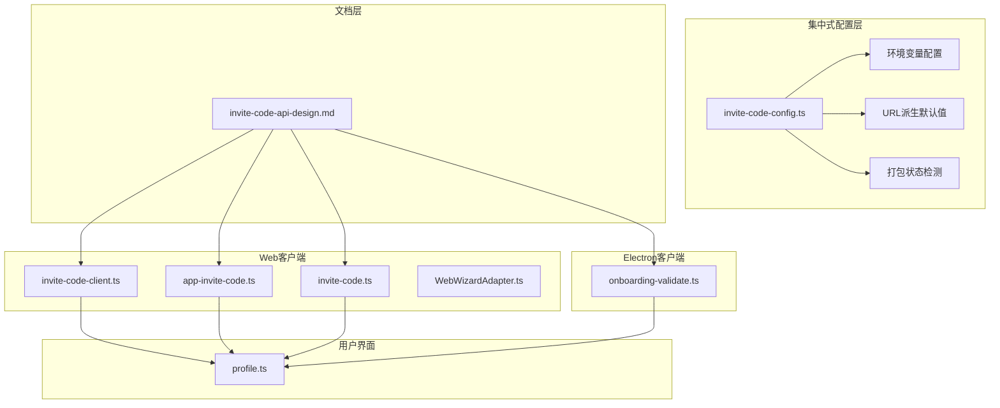
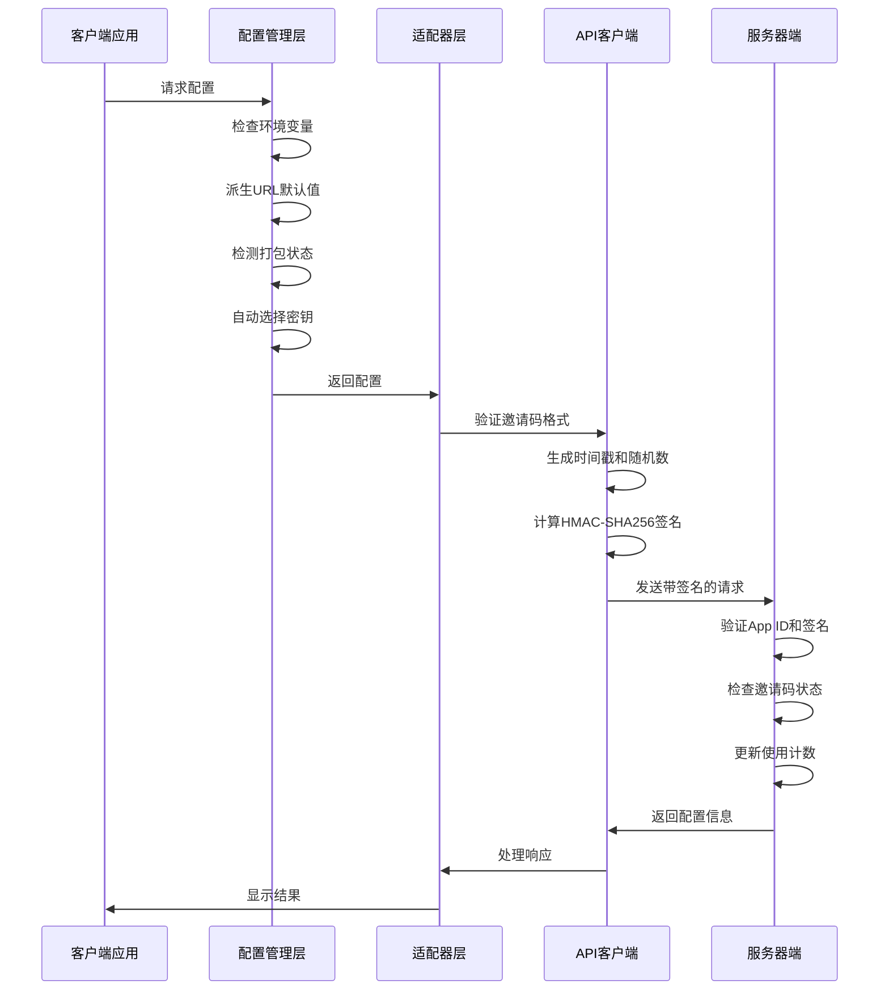
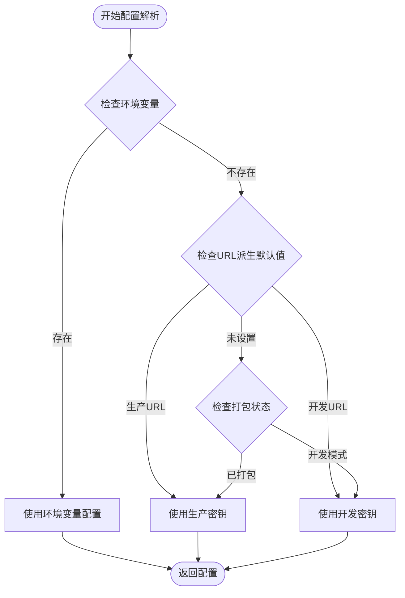
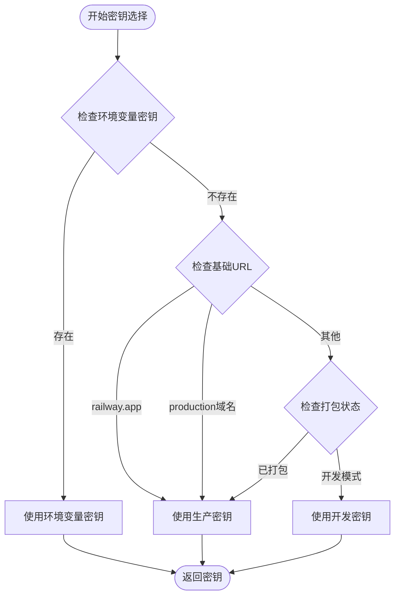
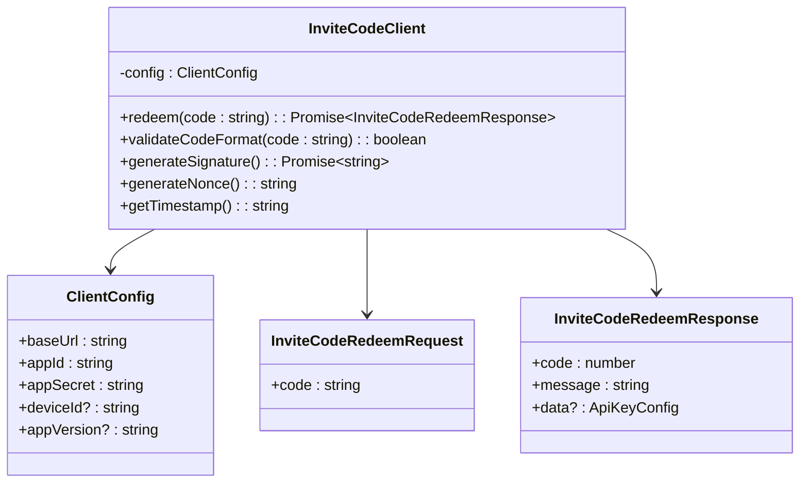
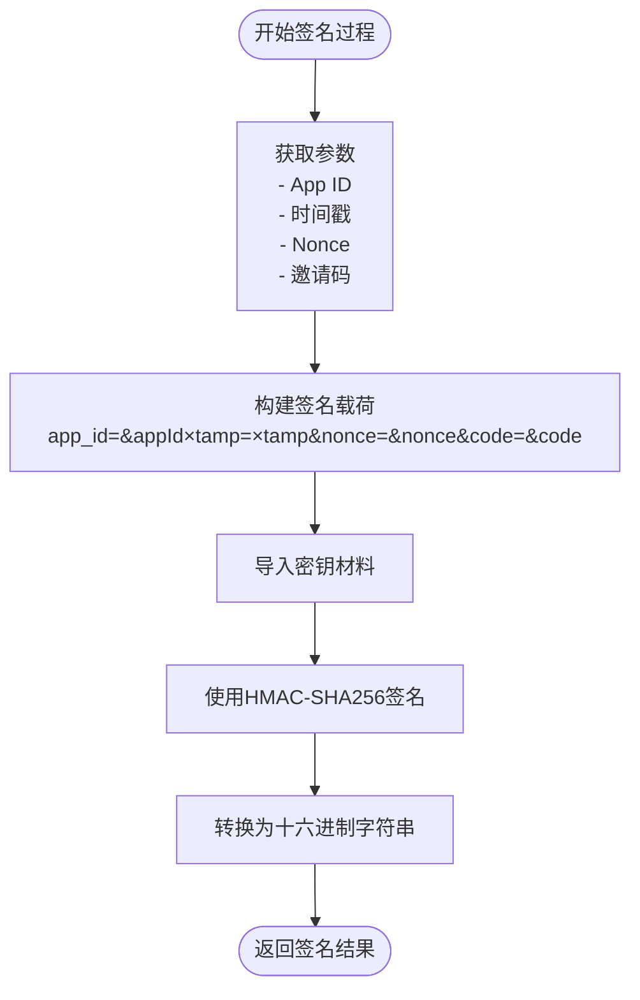
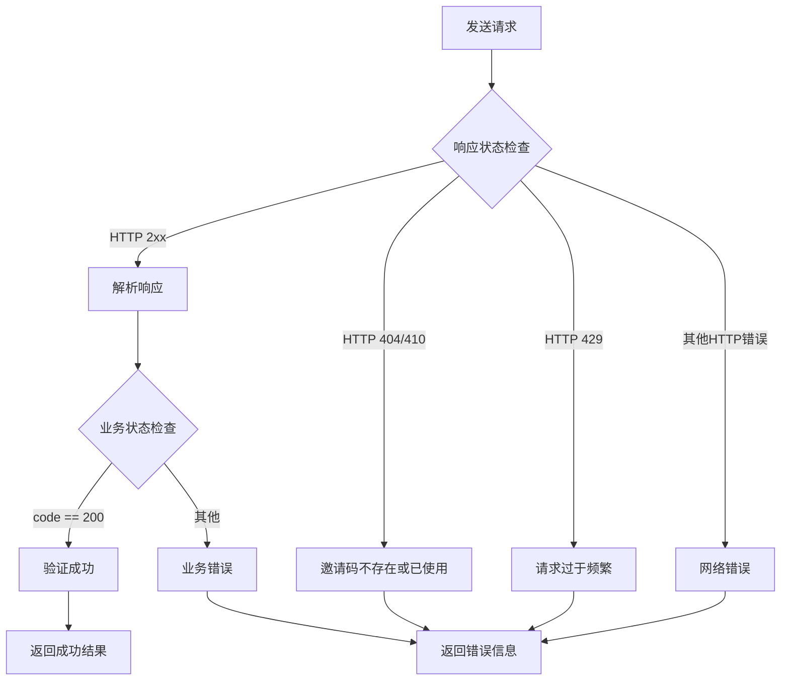
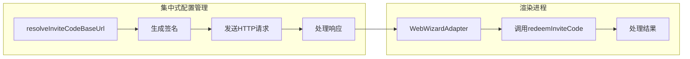
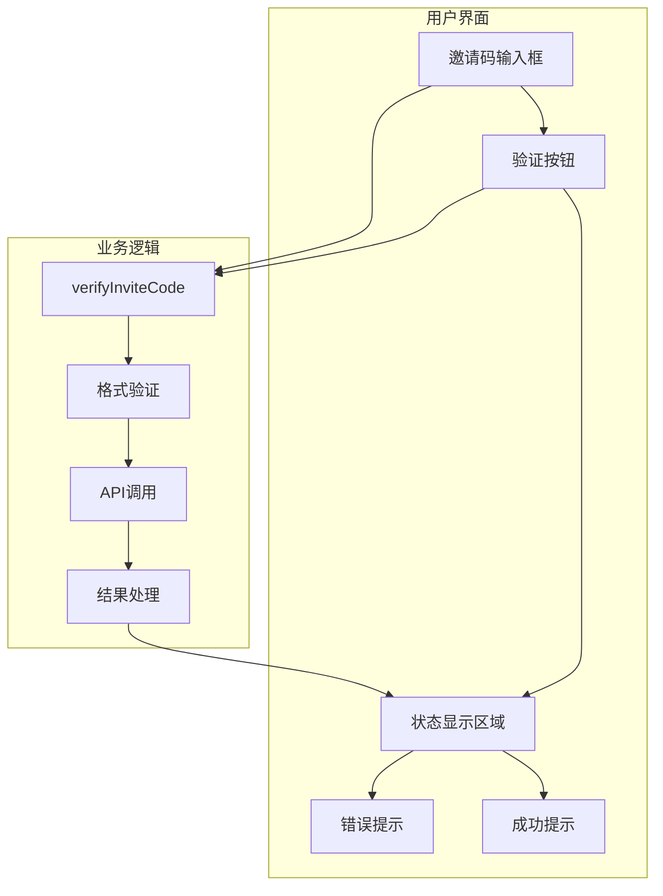
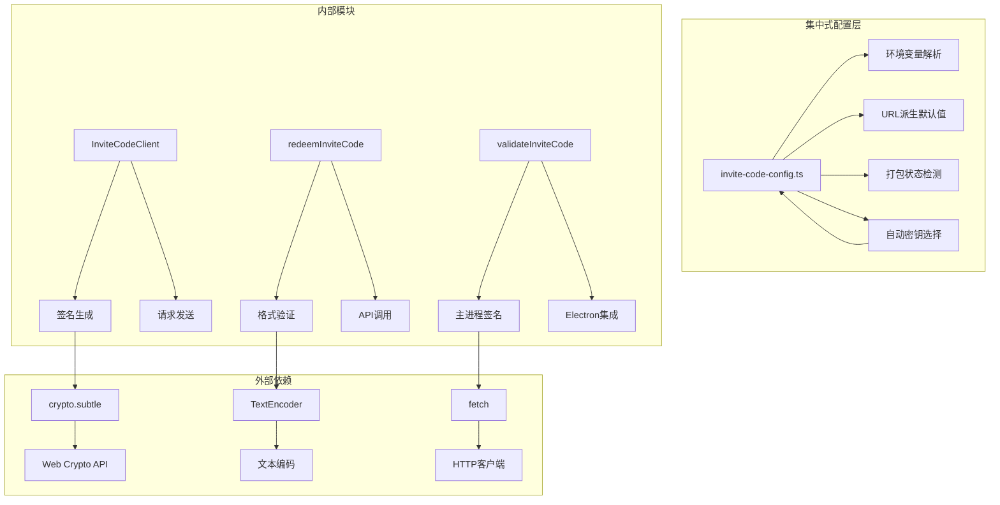

# 邀请码系统

<cite>
**本文档引用的文件**
- [invite-code-api-design.md](file://docs/features/invite-code-api-design.md)
- [invite-code-client.ts](file://ui/src/ui/invite-code-client.ts)
- [app-invite-code.ts](file://ui/src/ui/app-invite-code.ts)
- [invite-code.ts](file://ui-react/src/lib/invite-code.ts)
- [WebWizardAdapter.ts](file://ui-react/src/adapters/WebWizardAdapter.ts)
- [onboarding-validate.ts](file://apps/electron/src/main/onboarding-validate.ts)
- [profile.ts](file://ui/src/ui/views/profile.ts)
- [invite-code-config.ts](file://apps/electron/src/main/invite-code-config.ts)
</cite>

## 更新摘要
**变更内容**
- 新增集中式邀请码配置系统，实现环境变量优先级配置管理
- 引入独立的app ID和HMAC-SHA256签名密钥配置
- 支持开发和生产环境自动密钥选择机制
- 更新Electron客户端配置管理架构

## 目录
1. [简介](#简介)
2. [项目结构](#项目结构)
3. [核心组件](#核心组件)
4. [架构概览](#架构概览)
5. [详细组件分析](#详细组件分析)
6. [依赖关系分析](#依赖关系分析)
7. [性能考虑](#性能考虑)
8. [故障排除指南](#故障排除指南)
9. [结论](#结论)

## 简介

邀请码系统是OpenClaw项目中的一个关键功能模块，用于验证用户提供的邀请码并获取相应的API密钥配置。该系统采用HMAC-SHA256签名认证机制，确保请求的安全性和完整性。

**更新** 系统现已升级为集中式配置管理模式，支持环境变量优先级配置（环境变量 > 打包/URL派生默认值），包括独立的app ID和HMAC-SHA256签名密钥，支持开发和生产环境自动密钥选择。

系统支持多种客户端平台，包括Web浏览器、Electron桌面应用和移动应用，所有客户端都遵循统一的API规范和安全标准。

## 项目结构

邀请码系统的实现分布在多个目录中，现已引入集中式配置管理：

**图表来源**
- [invite-code-config.ts:1-93](file://apps/electron/src/main/invite-code-config.ts#L1-L93)
- [invite-code-api-design.md:1-448](file://docs/features/invite-code-api-design.md#L1-L448)
- [invite-code-client.ts:1-232](file://ui/src/ui/invite-code-client.ts#L1-L232)
- [app-invite-code.ts:1-186](file://ui/src/ui/app-invite-code.ts#L1-L186)
- [invite-code.ts:1-221](file://ui-react/src/lib/invite-code.ts#L1-L221)
- [onboarding-validate.ts:1-515](file://apps/electron/src/main/onboarding-validate.ts#L1-L515)
- [profile.ts:850-920](file://ui/src/ui/views/profile.ts#L850-L920)

**章节来源**
- [invite-code-config.ts:1-93](file://apps/electron/src/main/invite-code-config.ts#L1-L93)
- [invite-code-api-design.md:1-448](file://docs/features/invite-code-api-design.md#L1-L448)
- [invite-code-client.ts:1-232](file://ui/src/ui/invite-code-client.ts#L1-L232)
- [app-invite-code.ts:1-186](file://ui/src/ui/app-invite-code.ts#L1-L186)
- [invite-code.ts:1-221](file://ui-react/src/lib/invite-code.ts#L1-L221)
- [onboarding-validate.ts:1-515](file://apps/electron/src/main/onboarding-validate.ts#L1-L515)
- [profile.ts:850-920](file://ui/src/ui/views/profile.ts#L850-L920)

## 核心组件

### API设计规范

系统基于统一的API设计规范，定义了完整的请求和响应格式：

| 组件 | 描述 | 实现位置 |
|------|------|----------|
| 接口名称 | 邀请码兑换 | docs/features/invite-code-api-design.md |
| 请求方法 | POST | docs/features/invite-code-api-design.md |
| 内容类型 | application/json | docs/features/invite-code-api-design.md |
| 邀请码格式 | BOSS-XXXX-XXXX | docs/features/invite-code-api-design.md |
| 签名算法 | HMAC-SHA256 | docs/features/invite-code-api-design.md |

### 安全机制

系统实现了多层次的安全保护机制：

1. **时间戳验证**：防止重放攻击，有效期为5分钟
2. **随机数验证**：每次请求生成唯一nonce值
3. **HMAC签名**：使用App Secret对请求进行数字签名
4. **请求头验证**：严格验证必需的请求头字段

**更新** 新增集中式配置管理，支持环境变量优先级配置：

- **环境变量优先级**：环境变量 > 打包/URL派生默认值
- **独立配置项**：APP ID和HMAC-SHA256签名密钥独立配置
- **自动密钥选择**：开发和生产环境自动密钥选择机制

**章节来源**
- [invite-code-api-design.md:62-140](file://docs/features/invite-code-api-design.md#L62-L140)
- [invite-code-config.ts:6-21](file://apps/electron/src/main/invite-code-config.ts#L6-L21)

## 架构概览

邀请码系统的整体架构采用客户端-服务器模式，支持多平台部署和集中式配置管理：

**图表来源**
- [invite-code-config.ts:43-92](file://apps/electron/src/main/invite-code-config.ts#L43-L92)
- [invite-code-client.ts:137-201](file://ui/src/ui/invite-code-client.ts#L137-L201)
- [invite-code.ts:100-151](file://ui-react/src/lib/invite-code.ts#L100-L151)
- [onboarding-validate.ts:375-411](file://apps/electron/src/main/onboarding-validate.ts#L375-L411)

## 详细组件分析

### 集中式配置管理系统

**更新** 新增集中式配置管理，提供统一的配置解析和密钥选择机制：

**图表来源**
- [invite-code-config.ts:43-92](file://apps/electron/src/main/invite-code-config.ts#L43-L92)

#### 环境变量配置

| 环境变量 | 作用 | 优先级 | 默认值 |
|----------|------|--------|--------|
| INVITE_CODE_APP_ID | 覆盖X-App-Id请求头中的App ID | 最高 | boss-simulator |
| INVITE_CODE_APP_SECRET | 覆盖HMAC-SHA256签名密钥 | 最高 | 自动生成 |
| INVITE_CODE_API_BASE_URL | 覆盖后端基础URL | 最高 | 自动生成 |

#### URL派生默认值

| URL类型 | 默认值 | 用途 |
|---------|--------|------|
| 生产URL | https://verse-ai-service-production-22b8.up.railway.app/api/v1 | 生产环境后端 |
| 开发URL | http://localhost:8080/api/v1 | 开发环境后端 |

#### 自动密钥选择机制

**图表来源**
- [invite-code-config.ts:73-92](file://apps/electron/src/main/invite-code-config.ts#L73-L92)

**章节来源**
- [invite-code-config.ts:1-93](file://apps/electron/src/main/invite-code-config.ts#L1-L93)

### Web客户端实现

Web客户端提供了完整的邀请码验证功能，包含以下核心组件：

#### 邀请码客户端类

**图表来源**
- [invite-code-client.ts:24-30](file://ui/src/ui/invite-code-client.ts#L24-L30)
- [invite-code-client.ts:125-130](file://ui/src/ui/invite-code-client.ts#L125-L130)

#### 签名生成机制

Web客户端使用浏览器内置的Web Crypto API进行HMAC-SHA256签名计算：

**图表来源**
- [invite-code-client.ts:73-100](file://ui/src/ui/invite-code-client.ts#L73-L100)

**章节来源**
- [invite-code-client.ts:1-232](file://ui/src/ui/invite-code-client.ts#L1-L232)

### React客户端实现

React客户端提供了现代化的邀请码验证功能，专为Web应用设计：

#### 配置管理系统

React客户端实现了灵活的配置管理机制：

| 配置项 | 开发环境默认值 | 生产环境来源 | 用途 |
|--------|----------------|--------------|------|
| baseUrl | http://localhost:8080 | VITE_INVITE_CODE_API_BASE_URL | API基础URL |
| appId | boss-simulator | 固定值 | 应用标识符 |
| appSecret | boss-simulator-dev-secret-change-in-prod | 固定值 | 签名密钥 |
| appVersion | 1.0.0 | 固定值 | 版本信息 |

#### 错误处理机制

React客户端实现了完善的错误处理策略：

**图表来源**
- [invite-code.ts:153-171](file://ui-react/src/lib/invite-code.ts#L153-L171)

**章节来源**
- [invite-code.ts:1-221](file://ui-react/src/lib/invite-code.ts#L1-L221)

### Electron客户端实现

**更新** Electron客户端现已集成集中式配置管理系统：

#### 主进程集成

Electron客户端在主进程中集成了完整的邀请码验证逻辑，使用新的配置管理：

**图表来源**
- [onboarding-validate.ts:326-338](file://apps/electron/src/main/onboarding-validate.ts#L326-L338)
- [WebWizardAdapter.ts:100-105](file://ui-react/src/adapters/WebWizardAdapter.ts#L100-L105)

#### 环境配置

Electron客户端支持动态环境配置，采用新的优先级顺序：

| 配置来源 | 优先级 | 用途 |
|----------|--------|------|
| 环境变量 | 最高 | INVITE_CODE_API_BASE_URL, INVITE_CODE_APP_ID, INVITE_CODE_APP_SECRET |
| 应用打包状态 | 中等 | app.isPackaged检测 |
| URL派生默认值 | 中等 | 基于基础URL推断 |
| 本地回环地址 | 最低 | http://localhost:8080 |

**章节来源**
- [onboarding-validate.ts:321-397](file://apps/electron/src/main/onboarding-validate.ts#L321-L397)
- [invite-code-config.ts:43-92](file://apps/electron/src/main/invite-code-config.ts#L43-L92)

### 用户界面集成

邀请码系统与用户界面深度集成，提供直观的用户体验：

#### 界面组件

**图表来源**
- [profile.ts:865-890](file://ui/src/ui/views/profile.ts#L865-L890)
- [app-invite-code.ts:31-106](file://ui/src/ui/app-invite-code.ts#L31-L106)

#### 状态管理

界面组件实现了完整的状态管理机制：

| 状态 | 描述 | 触发条件 |
|------|------|----------|
| inviteCodeVerifying | 验证中 | 开始验证请求 |
| inviteCodeVerified | 验证成功 | 收到有效响应 |
| inviteCodeError | 验证失败 | 请求异常或业务错误 |
| llmApiKey | API密钥 | 成功获取配置 |
| llmModel | 模型标识 | 成功获取配置 |

**章节来源**
- [profile.ts:850-920](file://ui/src/ui/views/profile.ts#L850-L920)
- [app-invite-code.ts:133-176](file://ui/src/ui/app-invite-code.ts#L133-L176)

## 依赖关系分析

**更新** 邀请码系统的依赖关系已扩展为集中式配置管理：

**图表来源**
- [invite-code-config.ts:1-93](file://apps/electron/src/main/invite-code-config.ts#L1-L93)
- [invite-code-client.ts:82-94](file://ui/src/ui/invite-code-client.ts#L82-L94)
- [invite-code.ts:58-70](file://ui-react/src/lib/invite-code.ts#L58-L70)
- [onboarding-validate.ts:354-356](file://apps/electron/src/main/onboarding-validate.ts#L354-L356)

**章节来源**
- [invite-code-client.ts:63-122](file://ui/src/ui/invite-code-client.ts#L63-L122)
- [invite-code.ts:46-84](file://ui-react/src/lib/invite-code.ts#L46-L84)
- [onboarding-validate.ts:345-367](file://apps/electron/src/main/onboarding-validate.ts#L345-L367)

## 性能考虑

邀请码系统在设计时充分考虑了性能优化：

### 并发控制
- 使用AbortController限制请求超时时间（15秒）
- 避免同时发起多个验证请求
- 实现请求去重机制

### 缓存策略
- 邀请码验证结果不进行缓存
- 避免重复验证相同邀请码
- 短期内避免频繁请求

### 资源管理
- 合理使用Web Crypto API
- 避免内存泄漏
- 及时清理事件监听器

**更新** 集中式配置管理的性能优化：
- 配置解析结果可缓存，避免重复计算
- 环境变量检查使用一次性解析
- 自动密钥选择逻辑优化

## 故障排除指南

### 常见问题及解决方案

| 问题类型 | 症状 | 可能原因 | 解决方案 |
|----------|------|----------|----------|
| 网络连接失败 | 请求超时 | 网络不稳定 | 检查网络连接，重试请求 |
| 邀请码无效 | 返回400错误 | 邀请码格式错误 | 验证邀请码格式BOSS-XXXX-XXXX |
| 签名验证失败 | 返回401错误 | App ID或签名错误 | 检查App ID和签名算法 |
| 请求过于频繁 | 返回429错误 | 超过频率限制 | 等待后重试 |
| 服务器错误 | 返回500错误 | 服务器内部问题 | 稍后重试或联系支持 |
| 配置解析失败 | 密钥选择错误 | 环境变量配置不当 | 检查环境变量设置 |

### 调试技巧

1. **启用详细日志**：检查控制台输出的详细信息
2. **验证请求头**：确认所有必需的请求头都正确设置
3. **检查时间同步**：确保设备时间准确
4. **验证签名计算**：使用相同的算法和密钥重新计算签名
5. **检查配置优先级**：确认环境变量是否正确覆盖默认值

**更新** 新增配置调试技巧：
- 查看配置解析日志：确认环境变量、URL派生和打包状态
- 验证密钥选择逻辑：确认自动密钥选择是否符合预期
- 测试环境变量覆盖：验证环境变量是否正确生效

**章节来源**
- [app-invite-code.ts:116-127](file://ui/src/ui/app-invite-code.ts#L116-L127)
- [invite-code.ts:153-171](file://ui-react/src/lib/invite-code.ts#L153-L171)
- [onboarding-validate.ts:379-394](file://apps/electron/src/main/onboarding-validate.ts#L379-L394)

## 结论

邀请码系统是OpenClaw项目中一个设计精良的功能模块，经过集中式配置管理升级后，具有以下显著改进：

### 技术优势
- **安全性**：采用HMAC-SHA256签名和多重验证机制
- **跨平台**：支持Web、Electron和移动应用
- **标准化**：遵循统一的API设计规范
- **可维护性**：清晰的代码结构和文档
- **灵活性**：支持环境变量优先级配置管理
- **自动化**：开发和生产环境自动密钥选择

### 功能特性
- **格式验证**：严格的邀请码格式检查
- **错误处理**：完善的错误分类和处理机制
- **用户友好**：直观的界面和及时的反馈
- **性能优化**：合理的资源管理和并发控制
- **配置管理**：集中式的配置解析和密钥选择

### 扩展性
系统设计具有良好的扩展性，可以轻松添加新的验证规则、支持更多的API提供商，以及集成更多的安全机制。

**更新** 集中式配置管理带来的新能力：
- 环境变量优先级配置，支持灵活的部署场景
- 独立的app ID和签名密钥配置，增强安全性
- 自动密钥选择机制，简化开发和生产环境配置
- 统一的配置解析逻辑，提高代码复用性

通过统一的API规范、多平台实现和集中式配置管理，邀请码系统为OpenClaw项目提供了可靠的身份验证和访问控制机制，为后续的功能扩展奠定了坚实的基础。