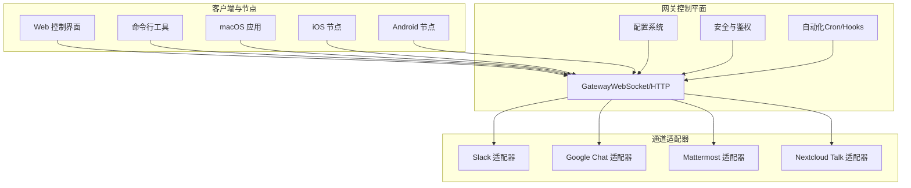
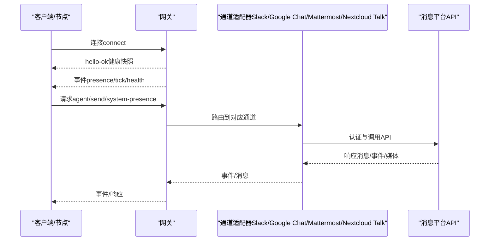
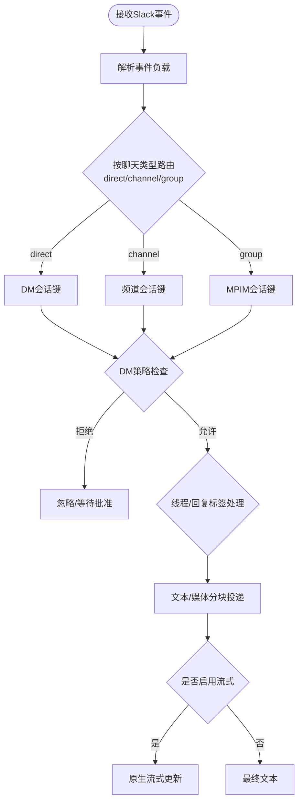
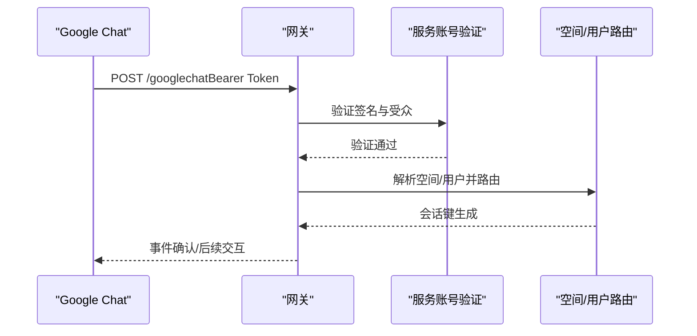
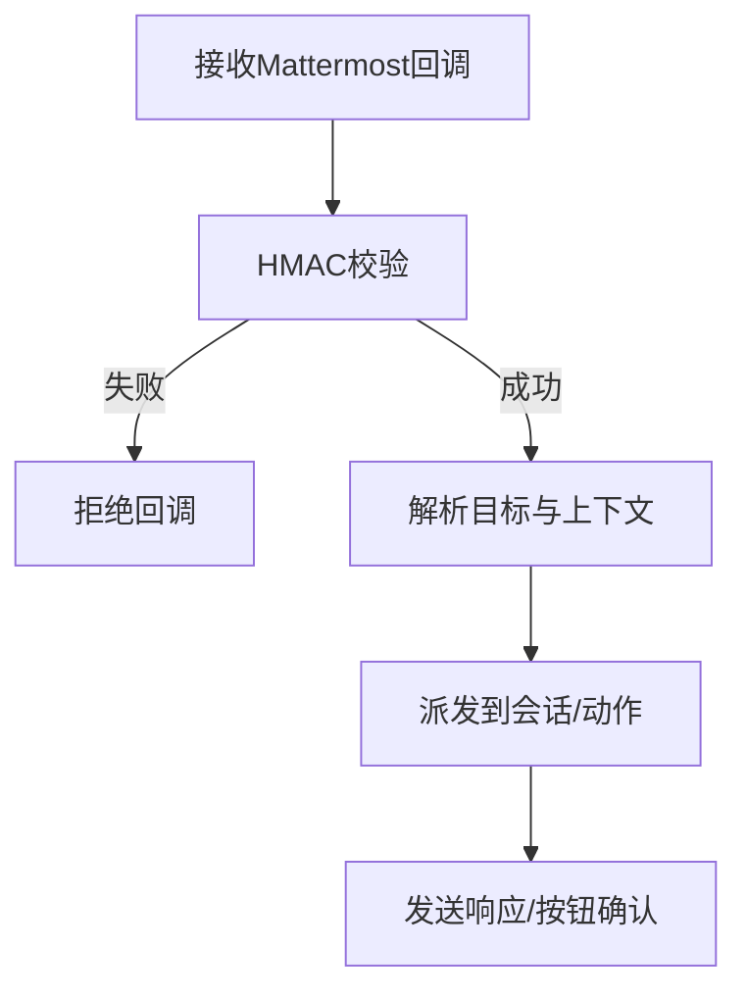
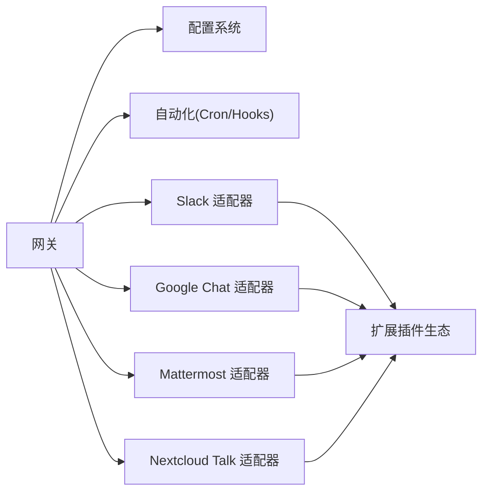

# 企业协作平台

<cite>
**本文档引用的文件**
- [README.md](file://README.md)
- [docs/index.md](file://docs/index.md)
- [docs/channels/index.md](file://docs/channels/index.md)
- [docs/gateway/index.md](file://docs/gateway/index.md)
- [docs/concepts/architecture.md](file://docs/concepts/architecture.md)
- [docs/channels/slack.md](file://docs/channels/slack.md)
- [docs/channels/googlechat.md](file://docs/channels/googlechat.md)
- [docs/channels/mattermost.md](file://docs/channels/mattermost.md)
- [docs/channels/nextcloud-talk.md](file://docs/channels/nextcloud-talk.md)
- [docs/gateway/configuration.md](file://docs/gateway/configuration.md)
</cite>

## 目录

1. [简介](#简介)
2. [项目结构](#项目结构)
3. [核心组件](#核心组件)
4. [架构总览](#架构总览)
5. [详细组件分析](#详细组件分析)
6. [依赖关系分析](#依赖关系分析)
7. [性能考量](#性能考量)
8. [故障排查指南](#故障排查指南)
9. [结论](#结论)
10. [附录](#附录)

## 简介

本项目为企业级个人AI助手与多通道协作网关，支持在本地或服务器运行，统一连接WhatsApp、Telegram、Discord、Slack、Google Chat、Signal、iMessage、WebChat、Mattermost、Microsoft Teams、Nextcloud Talk等消息平台，提供多代理路由、会话管理、媒体处理、浏览器控制、Canvas可视化、节点设备能力（macOS/iOS/Android）以及自动化（定时任务、Webhook、Gmail订阅）等能力。其核心是“网关”（Gateway），作为控制平面负责会话、路由、事件与通道连接。

该文档聚焦于Slack、Google Chat、Mattermost、Nextcloud Talk等企业协作工具的集成实现，涵盖团队管理、权限控制、审计日志与合规要求、工作流自动化、文件共享、会议集成与通知管理，并提供企业部署考虑、安全策略与性能优化建议。

## 项目结构

- 核心运行时：Gateway（WebSocket控制平面 + HTTP API + 控制UI）
- 多通道适配器：通过扩展插件接入各消息平台（如Slack、Google Chat、Mattermost、Nextcloud Talk）
- 客户端与节点：macOS应用、CLI、WebChat、iOS/Android节点
- 自动化与工具：浏览器控制、Canvas、节点命令、Cron、Hooks、技能系统
- 配置与运维：JSON5配置、热重载、Doctor诊断、远程访问（Tailscale/SSH隧道）

图表来源

- [docs/concepts/architecture.md:12-58](file://docs/concepts/architecture.md#L12-L58)
- [docs/gateway/index.md:68-93](file://docs/gateway/index.md#L68-L93)

章节来源

- [README.md:21-26](file://README.md#L21-L26)
- [docs/index.md:44-71](file://docs/index.md#L44-L71)
- [docs/gateway/index.md:68-93](file://docs/gateway/index.md#L68-L93)

## 核心组件

- 网关（Gateway）：单一长连接的控制平面，承载会话、路由、事件与通道连接；支持WebSocket请求/响应与事件推送，具备握手、鉴权、幂等去重、节点配对与信任机制。
- 通道适配器：针对不同消息平台的适配层，负责认证、事件订阅、消息收发、媒体处理、线程与回复标签、动作与交互等。
- 配置系统：JSON5配置文件，支持热重载、环境变量注入、SecretRef密钥引用、分片include组织大型配置。
- 自动化：Cron定时任务、Webhook钩子、Gmail Pub/Sub触发，支持会话保留与运行日志裁剪。
- 工具与节点：浏览器控制、Canvas可视化、节点命令（系统调用、通知、相机、屏幕录制、位置获取）、语音唤醒与通话。

章节来源

- [docs/concepts/architecture.md:27-58](file://docs/concepts/architecture.md#L27-L58)
- [docs/gateway/index.md:68-93](file://docs/gateway/index.md#L68-L93)
- [docs/gateway/configuration.md:349-387](file://docs/gateway/configuration.md#L349-L387)

## 架构总览

下图展示从客户端到网关再到各消息平台的典型交互流程，强调单网关控制平面与多通道并行运行的模式。

图表来源

- [docs/concepts/architecture.md:59-78](file://docs/concepts/architecture.md#L59-L78)
- [docs/gateway/index.md:202-214](file://docs/gateway/index.md#L202-L214)

章节来源

- [docs/concepts/architecture.md:59-78](file://docs/concepts/architecture.md#L59-L78)
- [docs/gateway/index.md:202-214](file://docs/gateway/index.md#L202-L214)

## 详细组件分析

### Slack 集成

- 模式与认证
  - 支持Socket Mode与HTTP Events API两种模式；Socket Mode默认，需App Token与Bot Token；HTTP模式需Signing Secret与Webhook路径。
  - 用户令牌可选（userToken），用于读取目录与动作，写操作优先使用Bot Token。
- 访问控制与路由
  - DM策略：pairing（默认）、allowlist、open、disabled；DM允许列表支持用户ID与名称匹配（谨慎启用名称匹配）。
  - 频道策略：open、allowlist、disabled；频道允许列表按ID/名称解析，支持每频道用户白名单、是否必须@提及、技能与工具覆盖。
- 线程、会话与回复标签
  - DM按direct路由，频道按channel路由，MPIM按group路由；线程会话后缀支持；replyToMode支持off/first/all，且按聊天类型（direct/group/channel）分别配置。
- 媒体、分块与投递
  - 入站附件下载至媒体存储；出站文本按textChunkLimit分块，支持newline模式；文件上传支持线程回复。
- 动作与门禁
  - 可启用messages、reactions、pins、memberInfo、emojiList等动作组。
- 事件与运营行为
  - 映射消息编辑/删除、反应增删、成员加入/离开、频道重命名、Pin增删等为系统事件；支持assistant.threads.setStatus以显示“正在输入”状态。
- 文本流式输出
  - 支持Slack原生流式API（chat.startStream/appendStream/stopStream），支持partial/block/progress等预览行为。
- 配置要点
  - 关键字段：mode/auth、DM访问、频道访问、线程/历史、投递参数、ops/features、actions、userToken、streaming/nativeStreaming等。

图表来源

- [docs/channels/slack.md:234-282](file://docs/channels/slack.md#L234-L282)
- [docs/channels/slack.md:492-532](file://docs/channels/slack.md#L492-L532)

章节来源

- [docs/channels/slack.md:24-121](file://docs/channels/slack.md#L24-L121)
- [docs/channels/slack.md:136-205](file://docs/channels/slack.md#L136-L205)
- [docs/channels/slack.md:234-282](file://docs/channels/slack.md#L234-L282)
- [docs/channels/slack.md:284-339](file://docs/channels/slack.md#L284-L339)
- [docs/channels/slack.md:492-532](file://docs/channels/slack.md#L492-L532)

### Google Chat（Chat API）集成

- 快速设置
  - 创建Google Cloud项目与服务账号，启用Chat API，配置应用（交互功能、加入空间/群聊、HTTP端点URL），设置可见性与受众。
  - 在网关上配置serviceAccountFile/audienceType/audience/webhookPath等，启动后Google Chat向/webhook路径POST事件。
- 公网暴露
  - 推荐Tailscale Serve（私有仪表盘）+ Funnel（仅/webhook路径），或反向代理/Cloudflare Tunnel仅转发/webhook路径。
- 会话与路由
  - DM使用agent:<agentId>:googlechat:dm:<spaceId>；空间使用agent:<agentId>:googlechat:group:<spaceId>。
  - DM默认配对；群组默认需要@提及；可通过botUser辅助提及检测。
- 配置要点
  - 服务账号文件/引用、受众类型与值、webhook路径、DM策略、群组策略、动作开关、打字指示器、媒体上限等。

图表来源

- [docs/channels/googlechat.md:139-153](file://docs/channels/googlechat.md#L139-L153)
- [docs/channels/googlechat.md:163-206](file://docs/channels/googlechat.md#L163-L206)

章节来源

- [docs/channels/googlechat.md:12-118](file://docs/channels/googlechat.md#L12-L118)
- [docs/channels/googlechat.md:139-206](file://docs/channels/googlechat.md#L139-L206)
- [docs/channels/googlechat.md:209-256](file://docs/channels/googlechat.md#L209-L256)

### Mattermost 集成

- 插件安装
  - 作为插件安装（npm registry或本地checkout），支持通道、群组与DM。
- 快速设置
  - 安装插件后创建Bot账户获取Bot Token与Base URL，配置dmPolicy等。
- 原生斜杠命令
  - 可选启用，注册oc\_\*命令并通过回调路径接收回调；回调URL可达性需满足Mattermost出站白名单。
- 聊天模式
  - oncall（默认，@提及才回复）、onmessage（每条消息回复）、onchar（前缀触发）。
- 访问控制
  - DM默认pairing；群组默认allowlist且@提及；支持名称匹配（谨慎开启）。
- 目标与解析
  - 使用channel:<id>、user:<id>或@username；ID歧义时优先用户解析。
- 交互按钮
  - 启用inlineButtons后发送带按钮的消息，点击经HMAC校验回调至网关；注意按钮ID仅允许字母数字。
- 多账户
  - 支持channels.mattermost.accounts下多账户配置，命令回调可按账户覆盖。

图表来源

- [docs/channels/mattermost.md:185-242](file://docs/channels/mattermost.md#L185-L242)
- [docs/channels/mattermost.md:243-332](file://docs/channels/mattermost.md#L243-L332)

章节来源

- [docs/channels/mattermost.md:15-34](file://docs/channels/mattermost.md#L15-L34)
- [docs/channels/mattermost.md:36-96](file://docs/channels/mattermost.md#L36-L96)
- [docs/channels/mattermost.md:106-131](file://docs/channels/mattermost.md#L106-L131)
- [docs/channels/mattermost.md:132-164](file://docs/channels/mattermost.md#L132-L164)
- [docs/channels/mattermost.md:185-242](file://docs/channels/mattermost.md#L185-L242)
- [docs/channels/mattermost.md:243-332](file://docs/channels/mattermost.md#L243-L332)
- [docs/channels/mattermost.md:341-370](file://docs/channels/mattermost.md#L341-L370)

### Nextcloud Talk 集成

- 插件安装
  - 作为插件安装，支持DM、房间、反应与Markdown消息。
- 快速设置
  - 在Nextcloud服务器创建Bot（含共享密钥与Webhook URL），在目标房间启用Bot；配置baseUrl与botSecret。
- 注意事项
  - Bot无法发起DM，需用户先发消息；Webhook需对网关可达；媒体上传不支持，以URL形式发送；无法区分DM与房间时需配置API凭据以识别房间类型。
- 访问控制
  - DM默认pairing；群组默认allowlist且@提及；允许列表匹配Nextcloud用户ID。
- 能力矩阵
  - 支持DM/房间、反应；不支持线程；媒体URL化；不支持原生命令。

章节来源

- [docs/channels/nextcloud-talk.md:12-31](file://docs/channels/nextcloud-talk.md#L12-L31)
- [docs/channels/nextcloud-talk.md:33-68](file://docs/channels/nextcloud-talk.md#L33-L68)
- [docs/channels/nextcloud-talk.md:70-97](file://docs/channels/nextcloud-talk.md#L70-L97)
- [docs/channels/nextcloud-talk.md:98-139](file://docs/channels/nextcloud-talk.md#L98-L139)

### 企业协作平台通用能力与合规

- 团队管理与权限控制
  - 通道级DM策略：pairing/allowlist/open/disabled；群组策略：open/allowlist/disabled；每频道用户白名单、@提及要求、工具/技能覆盖。
  - 环境变量与SecretRef：支持env/file/exec密钥源，避免明文存储；$include组织大型配置。
- 审计日志与合规
  - 所有通道事件映射为系统事件（消息编辑/删除、反应、成员变更、Pin等），便于审计与合规追踪。
  - Hooks与Cron运行日志可裁剪，避免敏感数据长期留存。
- 工作流自动化
  - Cron：周期性任务、并发限制、会话保留与运行日志裁剪。
  - Hooks：HTTP入口，支持Gmail Pub/Sub等外部触发，需严格校验与最小权限。
- 文件共享与媒体
  - 各通道入站/出站媒体上限与分块策略可配置；Google Chat与Slack支持附件下载与上传。
- 会议集成与通知管理
  - Slack支持assistant.threads.setStatus显示“正在输入”；Google Chat支持打字指示器（消息/反应）；Mattermost支持按钮交互与确认消息。
- 安全模型
  - 默认主会话全权限，群组/频道会话可隔离在Docker沙箱；非主会话可启用沙箱模式；节点基于设备配对与签名挑战建立信任。

章节来源

- [docs/gateway/configuration.md:74-347](file://docs/gateway/configuration.md#L74-L347)
- [docs/gateway/configuration.md:349-447](file://docs/gateway/configuration.md#L349-L447)
- [docs/channels/slack.md:284-339](file://docs/channels/slack.md#L284-L339)
- [docs/channels/googlechat.md:163-206](file://docs/channels/googlechat.md#L163-L206)
- [docs/channels/mattermost.md:185-242](file://docs/channels/mattermost.md#L185-L242)

## 依赖关系分析

- 组件耦合
  - 网关与通道适配器松耦合：通过统一协议与事件模型对接，便于扩展新通道。
  - 配置系统集中管理通道与全局策略，热重载保障运行时变更。
  - 自动化（Cron/Hooks）与通道解耦，通过会话键与事件路由触发。
- 外部依赖
  - 各消息平台API（Slack Bot/App Token、Google Chat Service Account、Mattermost Bot Token、Nextcloud Talk Bot）。
  - 远程访问：Tailscale Serve/Funnel或SSH隧道，配合网关鉴权。
- 循环依赖
  - 无直接循环依赖；通道适配器仅依赖网关协议与配置，不反向依赖通道实现细节。

图表来源

- [docs/channels/index.md:14-37](file://docs/channels/index.md#L14-L37)
- [docs/gateway/index.md:68-93](file://docs/gateway/index.md#L68-L93)

章节来源

- [docs/channels/index.md:14-37](file://docs/channels/index.md#L14-L37)
- [docs/gateway/index.md:68-93](file://docs/gateway/index.md#L68-L93)

## 性能考量

- 通道并发与事件处理
  - 单一网关进程承载多通道连接，建议按需启用通道，避免不必要的事件订阅与回调。
- 媒体与分块
  - 合理设置mediaMaxMb与textChunkLimit，减少大文件传输与超长文本重传。
- 沙箱与资源隔离
  - 对群组/频道会话启用沙箱，降低工具执行风险与资源滥用。
- 远程访问与网络
  - 使用Tailscale Serve/Funnel分离私有仪表盘与公网Webhook，减少外网暴露面。
- 日志与审计
  - Cron/Hooks运行日志裁剪，避免磁盘膨胀；事件日志用于审计但不持久化敏感内容。

## 故障排查指南

- 网关基础
  - 启动与健康：openclaw gateway status、openclaw logs --follow、openclaw doctor。
  - 端口冲突与鉴权：确保非loopback绑定需配置token/password；避免端口占用。
- 通道问题
  - Slack：检查Socket/HTTP模式配置、Signing Secret、Webhook路径、事件订阅；DM被忽略检查dmPolicy与配对。
  - Google Chat：确认服务账号、受众、Webhook路径与Tailscale/反向代理配置；405常见于未注册处理器。
  - Mattermost：检查Bot Token/Base URL、回调URL可达性、AllowedUntrustedInternalConnections、按钮ID仅限字母数字。
  - Nextcloud Talk：确认Bot共享密钥、Webhook可达性、API凭据以区分DM与房间。
- 运维与诊断
  - 通道探测：openclaw channels status --probe。
  - 配置修复：openclaw doctor --fix。
  - 远程访问：SSH隧道或Tailscale，确保鉴权头一致。

章节来源

- [docs/gateway/index.md:27-66](file://docs/gateway/index.md#L27-L66)
- [docs/gateway/index.md:235-244](file://docs/gateway/index.md#L235-L244)
- [docs/channels/slack.md:433-490](file://docs/channels/slack.md#L433-L490)
- [docs/channels/googlechat.md:209-256](file://docs/channels/googlechat.md#L209-L256)
- [docs/channels/mattermost.md:358-370](file://docs/channels/mattermost.md#L358-L370)
- [docs/channels/nextcloud-talk.md:63-97](file://docs/channels/nextcloud-talk.md#L63-L97)

## 结论

本企业协作平台以“网关”为核心，通过标准化协议与插件化通道适配，实现对Slack、Google Chat、Mattermost、Nextcloud Talk等企业级消息平台的一致接入。结合严格的权限控制、会话隔离、沙箱安全模型、自动化与可观测性，既能满足多团队协作场景下的合规与审计需求，又能在性能与可维护性之间取得平衡。建议在生产环境中采用Tailscale Serve/Funnel分离内网仪表盘与公网Webhook、启用沙箱与最小权限原则，并通过Doctor与日志体系持续监控与优化。

## 附录

- 快速开始与文档导航
  - Getting Started、Wizard、Control UI、远程访问与Troubleshooting等参考路径详见项目首页与文档索引。
- 配置参考
  - 完整字段参考与示例见“配置参考”，支持热重载、环境变量注入、SecretRef与$include组织。

章节来源

- [README.md:415-431](file://README.md#L415-L431)
- [docs/index.md:151-192](file://docs/index.md#L151-L192)
- [docs/gateway/configuration.md:540-547](file://docs/gateway/configuration.md#L540-L547)
