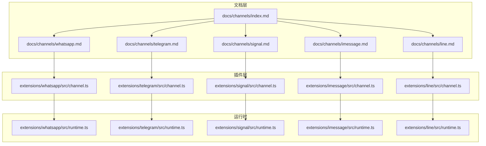
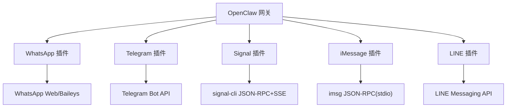
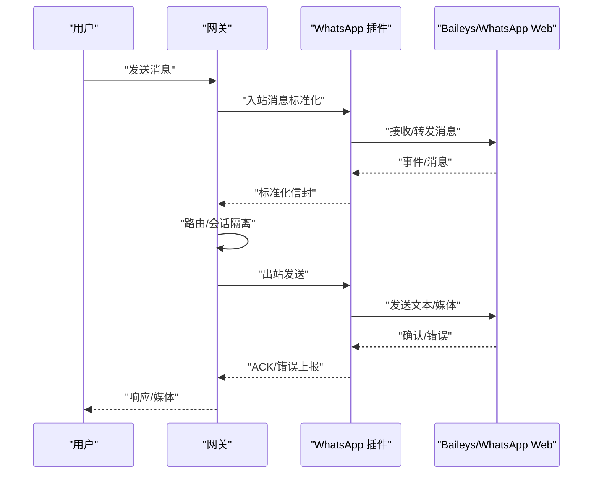
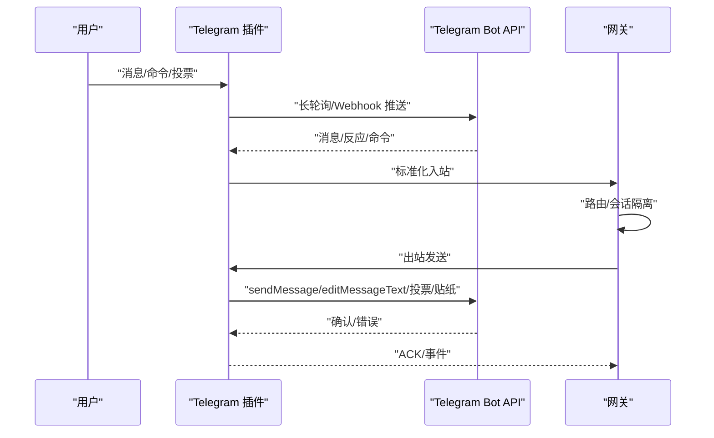
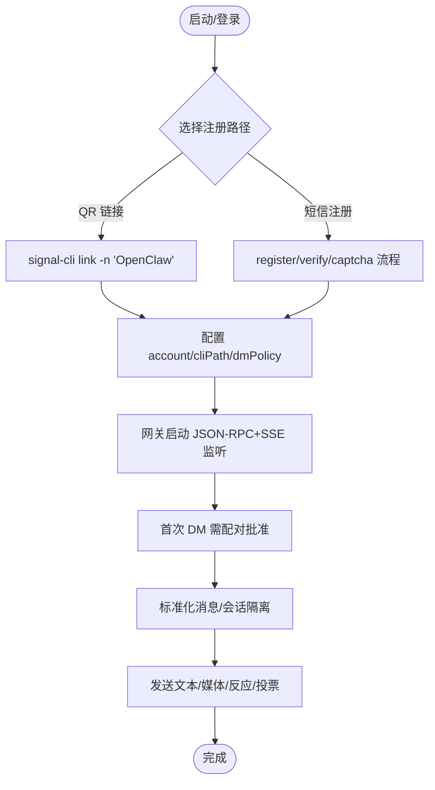
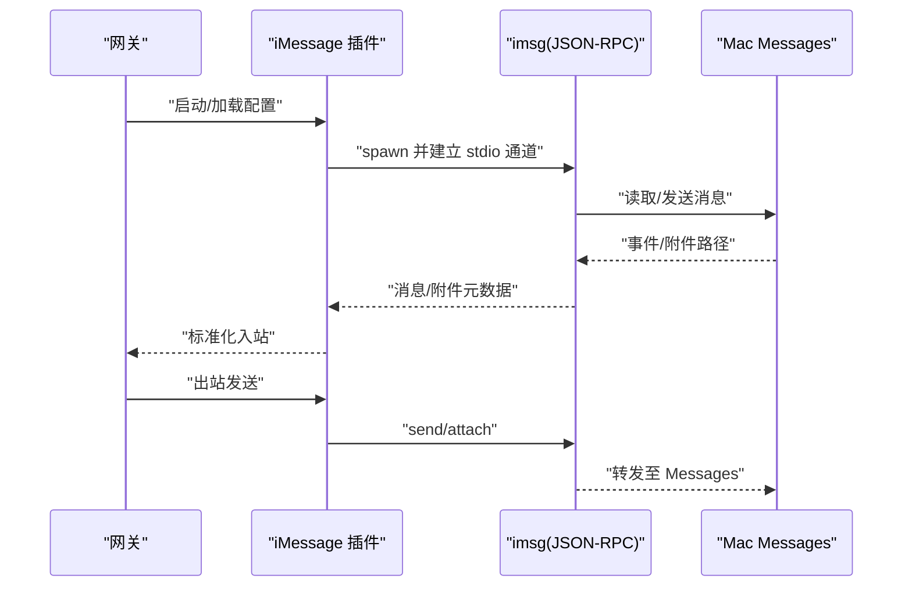
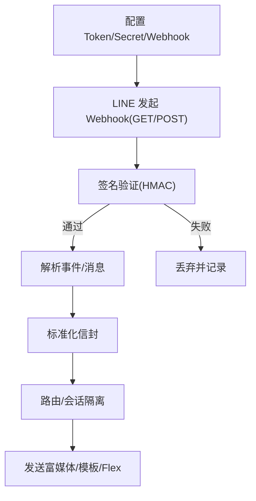
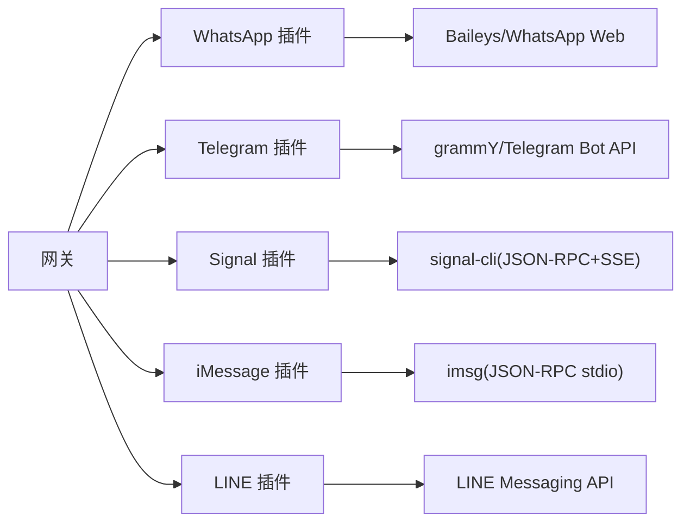

# 即时通讯平台

<cite>
**本文引用的文件**
- [docs/channels/index.md](file://docs/channels/index.md)
- [docs/channels/whatsapp.md](file://docs/channels/whatsapp.md)
- [docs/channels/telegram.md](file://docs/channels/telegram.md)
- [docs/channels/signal.md](file://docs/channels/signal.md)
- [docs/channels/imessage.md](file://docs/channels/imessage.md)
- [docs/channels/line.md](file://docs/channels/line.md)
- [extensions/whatsapp/src/channel.ts](file://extensions/whatsapp/src/channel.ts)
- [extensions/telegram/src/channel.ts](file://extensions/telegram/src/channel.ts)
- [extensions/signal/src/channel.ts](file://extensions/signal/src/channel.ts)
- [extensions/imessage/src/channel.ts](file://extensions/imessage/src/channel.ts)
- [extensions/line/src/channel.ts](file://extensions/line/src/channel.ts)
- [extensions/whatsapp/src/runtime.ts](file://extensions/whatsapp/src/runtime.ts)
- [extensions/telegram/src/runtime.ts](file://extensions/telegram/src/runtime.ts)
- [extensions/signal/src/runtime.ts](file://extensions/signal/src/runtime.ts)
- [extensions/imessage/src/runtime.ts](file://extensions/imessage/src/runtime.ts)
- [extensions/line/src/runtime.ts](file://extensions/line/src/runtime.ts)
</cite>

## 目录

1. [简介](#简介)
2. [项目结构](#项目结构)
3. [核心组件](#核心组件)
4. [架构总览](#架构总览)
5. [详细组件分析](#详细组件分析)
6. [依赖关系分析](#依赖关系分析)
7. [性能考量](#性能考量)
8. [故障排查指南](#故障排查指南)
9. [结论](#结论)
10. [附录](#附录)

## 简介

本文件面向即时通讯平台集成与运维，系统梳理 WhatsApp、Telegram、Signal、iMessage、LINE 等平台在 OpenClaw 中的接入方式、认证机制、消息格式、媒体处理、API 限制、配置要点、连接建立流程、错误处理策略、消息路由规则、会话管理与用户体验优化方案。文档以仓库内官方文档与插件源码为依据，辅以可视化图示帮助读者快速理解与落地。

## 项目结构

OpenClaw 将“通道（Channel）”抽象为独立插件，每种即时通讯平台由一个独立扩展实现，统一通过网关（Gateway）进行生命周期管理、会话隔离与消息路由。官方文档位于 docs/channels/\*，平台插件位于 extensions/<platform>/src。

图表来源

- [docs/channels/index.md:1-48](file://docs/channels/index.md#L1-L48)
- [docs/channels/whatsapp.md:1-446](file://docs/channels/whatsapp.md#L1-L446)
- [docs/channels/telegram.md:1-975](file://docs/channels/telegram.md#L1-L975)
- [docs/channels/signal.md:1-326](file://docs/channels/signal.md#L1-L326)
- [docs/channels/imessage.md:1-368](file://docs/channels/imessage.md#L1-L368)
- [docs/channels/line.md:1-194](file://docs/channels/line.md#L1-L194)

章节来源

- [docs/channels/index.md:1-48](file://docs/channels/index.md#L1-L48)

## 核心组件

- 通道插件：负责与平台 API 交互、认证、消息收发、媒体处理、事件回调与错误处理。
- 运行时：负责启动/停止、心跳、重连、状态上报、配置热更新与资源管理。
- 文档：提供配置参考、部署模式、访问控制、限流与错误排查指南。

章节来源

- [docs/channels/whatsapp.md:126-133](file://docs/channels/whatsapp.md#L126-L133)
- [docs/channels/telegram.md:248-257](file://docs/channels/telegram.md#L248-L257)
- [docs/channels/signal.md:11-11](file://docs/channels/signal.md#L11-L11)
- [docs/channels/imessage.md:17-17](file://docs/channels/imessage.md#L17-L17)
- [docs/channels/line.md:12-18](file://docs/channels/line.md#L12-L18)

## 架构总览

下图展示 OpenClaw 与各平台的集成关系：网关统一调度，各平台插件通过各自认证与协议栈与平台交互；消息经标准化信封进入共享路由层，按会话键隔离并回注到对应通道。

图表来源

- [docs/channels/whatsapp.md:10-10](file://docs/channels/whatsapp.md#L10-L10)
- [docs/channels/telegram.md:10-10](file://docs/channels/telegram.md#L10-L10)
- [docs/channels/signal.md:11-11](file://docs/channels/signal.md#L11-L11)
- [docs/channels/imessage.md:17-17](file://docs/channels/imessage.md#L17-L17)
- [docs/channels/line.md:12-14](file://docs/channels/line.md#L12-L14)

## 详细组件分析

### WhatsApp 集成

- 认证与连接
  - 基于 Baileys 的 WhatsApp Web 通道，网关持有会话与重连循环。
  - 支持二维码配对登录，支持多账户与凭据目录迁移。
- 访问控制
  - DM 策略：默认配对，允许白名单、开放或禁用；支持 per-account 覆盖。
  - 群组策略：群允许列表 + 发送者允许列表；提及/回复激活可配置。
- 消息与媒体
  - 入站消息标准化为通用信封，支持回复上下文、媒体占位符、位置/联系人抽取。
  - 出站文本分片（长度/段落边界），媒体支持图片/视频/音频/文档，自动压缩与首项回退。
  - 可选已读回执、ACK 反应（👀 等）。
- 会话与路由
  - DM 使用会话作用域；群会话按 JID 隔离；支持历史注入与自聊天保护。
- 配置与运维
  - 支持配置写入、心跳/重连参数、历史条数、媒体大小限制、工具动作开关。

图表来源

- [docs/channels/whatsapp.md:128-132](file://docs/channels/whatsapp.md#L128-L132)
- [docs/channels/whatsapp.md:292-316](file://docs/channels/whatsapp.md#L292-L316)
- [docs/channels/whatsapp.md:343-364](file://docs/channels/whatsapp.md#L343-L364)

章节来源

- [docs/channels/whatsapp.md:24-80](file://docs/channels/whatsapp.md#L24-L80)
- [docs/channels/whatsapp.md:134-200](file://docs/channels/whatsapp.md#L134-L200)
- [docs/channels/whatsapp.md:202-290](file://docs/channels/whatsapp.md#L202-L290)
- [docs/channels/whatsapp.md:292-364](file://docs/channels/whatsapp.md#L292-L364)
- [docs/channels/whatsapp.md:374-424](file://docs/channels/whatsapp.md#L374-L424)

### Telegram 集成

- 认证与连接
  - Bot API，grammY 长轮询默认，可选 Webhook；无需配对登录，直接配置 Token。
- 访问控制
  - DM 策略：默认配对；支持白名单/开放/禁用；Telegram 用户 ID 规范化。
  - 群组策略：群允许列表 + 发送者允许列表；提及/回复激活可配置。
- 消息与媒体
  - HTML 解析回退、链接预览、直播预览流式输出、内联按钮、论坛主题线程、贴纸搜索与发送。
  - 文本分片、媒体上限、历史注入、投票 CLI 目标支持话题。
- 会话与路由
  - 群会话按群 ID 隔离，论坛主题附加 topic 键；DM 支持 message_thread_id。
- 配置与运维
  - 命令菜单注册、配置写入、长轮询/Webhook 参数、重试与超时。

图表来源

- [docs/channels/telegram.md:10-10](file://docs/channels/telegram.md#L10-L10)
- [docs/channels/telegram.md:248-257](file://docs/channels/telegram.md#L248-L257)
- [docs/channels/telegram.md:258-790](file://docs/channels/telegram.md#L258-L790)

章节来源

- [docs/channels/telegram.md:24-73](file://docs/channels/telegram.md#L24-L73)
- [docs/channels/telegram.md:105-246](file://docs/channels/telegram.md#L105-L246)
- [docs/channels/telegram.md:248-790](file://docs/channels/telegram.md#L248-L790)

### Signal 集成

- 认证与连接
  - 外部 CLI（signal-cli）集成，HTTP JSON-RPC + SSE；支持 QR 链接或短信注册两种路径。
- 访问控制
  - DM 默认配对；支持 UUID/号码白名单；群组策略与发送者允许列表。
- 消息与媒体
  - 文本分片、附件下载控制、历史注入、打字指示、已读回执转发。
- 会话与路由
  - DM 共享主会话；群会话按 groupId 隔离；回复始终回到同一号码/群。
- 配置与运维
  - 多账户、外部守护进程模式、启动超时、忽略故事/附件、配置写入开关。

图表来源

- [docs/channels/signal.md:20-157](file://docs/channels/signal.md#L20-L157)
- [docs/channels/signal.md:182-243](file://docs/channels/signal.md#L182-L243)
- [docs/channels/signal.md:200-227](file://docs/channels/signal.md#L200-L227)

章节来源

- [docs/channels/signal.md:13-157](file://docs/channels/signal.md#L13-L157)
- [docs/channels/signal.md:158-326](file://docs/channels/signal.md#L158-L326)

### iMessage 集成（遗留）

- 认证与连接
  - 外部 CLI（imsg）通过 stdio JSON-RPC 通信，无独立守护端口。
- 访问控制
  - DM 默认配对；支持句柄/聊天目标白名单；群组策略与提及检测（正则）。
- 会话与路由
  - DM 直接路由；群按 chat_id 隔离；可将非群标识但显式配置的 chat_id 视为群流量。
- 媒体与目标
  - 附件可选抓取（本地/远程 SCP），路径受白名单限制；支持多种显式目标格式。
- 配置与运维
  - 多账户、远程 SSH 包装器、权限提示、配置写入开关。

图表来源

- [docs/channels/imessage.md:17-17](file://docs/channels/imessage.md#L17-L17)
- [docs/channels/imessage.md:134-185](file://docs/channels/imessage.md#L134-L185)
- [docs/channels/imessage.md:247-286](file://docs/channels/imessage.md#L247-L286)

章节来源

- [docs/channels/imessage.md:31-115](file://docs/channels/imessage.md#L31-L115)
- [docs/channels/imessage.md:134-185](file://docs/channels/imessage.md#L134-L185)
- [docs/channels/imessage.md:187-245](file://docs/channels/imessage.md#L187-L245)
- [docs/channels/imessage.md:247-360](file://docs/channels/imessage.md#L247-L360)

### LINE 集成（插件）

- 认证与连接
  - 插件作为 Webhook 接收器，使用 Channel Access Token 与 Channel Secret；支持多账户与自定义路径。
- 访问控制
  - DM 默认配对；支持用户 ID 白名单；群组策略与发送者允许列表。
- 消息与富媒体
  - 文本分片、Markdown 清洗、Flex 卡片/模板消息/Quick Reply；媒体下载上限。
- 配置与运维
  - 环境变量/文件路径、Webhook 安全校验、错误排查清单。

图表来源

- [docs/channels/line.md:12-18](file://docs/channels/line.md#L12-L18)
- [docs/channels/line.md:34-91](file://docs/channels/line.md#L34-L91)
- [docs/channels/line.md:135-178](file://docs/channels/line.md#L135-L178)

章节来源

- [docs/channels/line.md:20-91](file://docs/channels/line.md#L20-L91)
- [docs/channels/line.md:110-143](file://docs/channels/line.md#L110-L143)
- [docs/channels/line.md:144-194](file://docs/channels/line.md#L144-L194)

## 依赖关系分析

- 组件耦合
  - 各平台插件与网关通过统一接口交互，耦合度低；平台差异体现在认证方式与协议栈。
  - 运行时模块负责生命周期与资源管理，插件侧专注平台适配。
- 外部依赖
  - WhatsApp：Baileys（Web 会话）
  - Telegram：grammY（Bot API）
  - Signal：signal-cli（JSON-RPC + SSE）
  - iMessage：imsg（stdio JSON-RPC）
  - LINE：Webhook + Messaging API
- 潜在循环依赖
  - 插件间无直接依赖，通过网关中转，避免循环。

图表来源

- [docs/channels/whatsapp.md:10-10](file://docs/channels/whatsapp.md#L10-L10)
- [docs/channels/telegram.md:10-10](file://docs/channels/telegram.md#L10-L10)
- [docs/channels/signal.md:11-11](file://docs/channels/signal.md#L11-L11)
- [docs/channels/imessage.md:17-17](file://docs/channels/imessage.md#L17-L17)
- [docs/channels/line.md:12-14](file://docs/channels/line.md#L12-L14)

## 性能考量

- 连接与重连
  - WhatsApp/Telegram/Signal/iMessage/LINE 均有心跳与重连策略；建议根据网络稳定性调整重连参数与超时。
- 媒体与带宽
  - 合理设置媒体上限与自动优化，避免大文件阻塞；必要时启用附件下载跳过策略。
- 并发与限流
  - Telegram 长轮询并发受全局并发限制影响；按需调优以平衡吞吐与延迟。
- 分片与序列化
  - 文本分片优先段落边界，减少截断；富文本/HTML 回退降低解析失败成本。

## 故障排查指南

- 通用步骤
  - 状态检查：通道状态、网关状态、日志跟踪、诊断命令。
  - 配置修复：字段冲突、类型不匹配、环境变量覆盖顺序。
- 平台特例
  - WhatsApp：未链接（需扫码）、反复断开（doctor 日志）、无活动监听（确保网关运行且账户已链接）。
  - Telegram：隐私模式导致群消息不可见、命令注册失败（DNS/HTTPS 被阻）、Webhook 签名失败。
  - Signal：daemon 不可达、DM 被忽略（待配对）、注册号被注销风险。
  - iMessage：RPC 不支持、权限缺失（自动化/磁盘访问）、远程附件失败（SSH/SCP 密钥与主机密钥）。
  - LINE：Webhook HTTPS 未就绪、签名失败、媒体超限。

章节来源

- [docs/channels/whatsapp.md:374-424](file://docs/channels/whatsapp.md#L374-L424)
- [docs/channels/telegram.md:731-790](file://docs/channels/telegram.md#L731-L790)
- [docs/channels/signal.md:251-286](file://docs/channels/signal.md#L251-L286)
- [docs/channels/imessage.md:304-360](file://docs/channels/imessage.md#L304-L360)
- [docs/channels/line.md:186-194](file://docs/channels/line.md#L186-L194)

## 结论

OpenClaw 通过模块化的通道插件体系，将不同即时通讯平台的差异封装在统一的网关之下，提供一致的会话隔离、消息路由与可观测性。针对各平台的认证方式、消息格式、媒体处理与 API 限制，文档与插件均提供了清晰的配置路径与排障建议。建议在生产环境中优先采用官方推荐路径（如 BlueBubbles 替代 iMessage legacy、Telegram Bot Token、Signal QR 链接或专用号码），并结合业务场景合理设置访问控制、历史注入与媒体策略。

## 附录

- 快速参考
  - WhatsApp：二维码登录、配对策略、群组提及/回复激活、ACK 反应、历史注入、媒体上限。
  - Telegram：Bot Token、隐私模式、命令菜单、直播预览、内联按钮、论坛主题、投票 CLI。
  - Signal：QR 链接/短信注册、多账户、外部守护、忽略附件/故事、已读回执转发。
  - iMessage：imsg CLI、SSH 远程、附件 SCP、句柄/聊天目标、权限提示。
  - LINE：Webhook、Token/Secret、富媒体模板/Flex、Quick Reply、签名验证。
