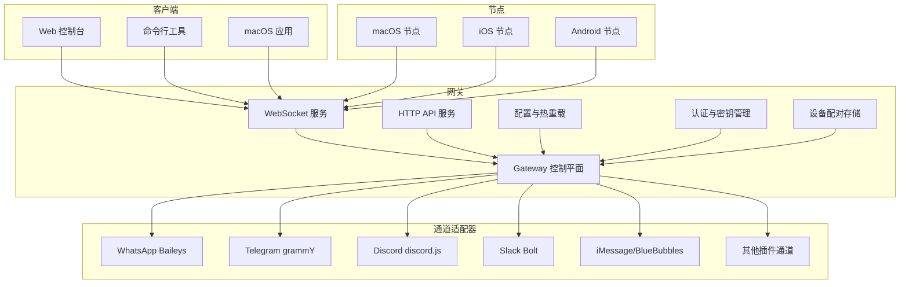
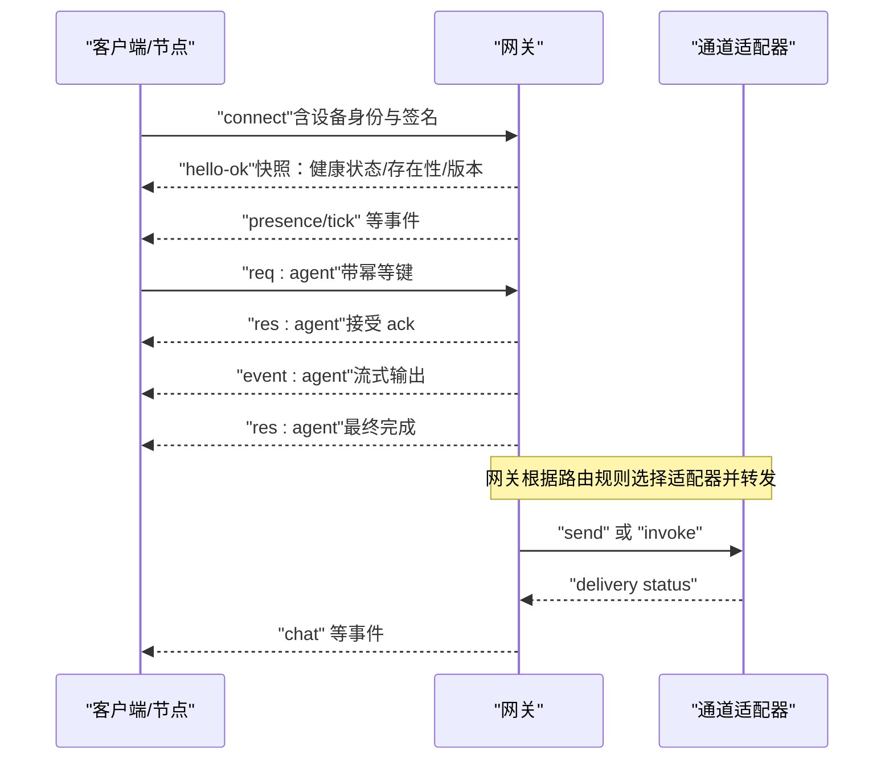
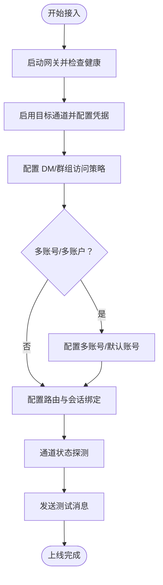
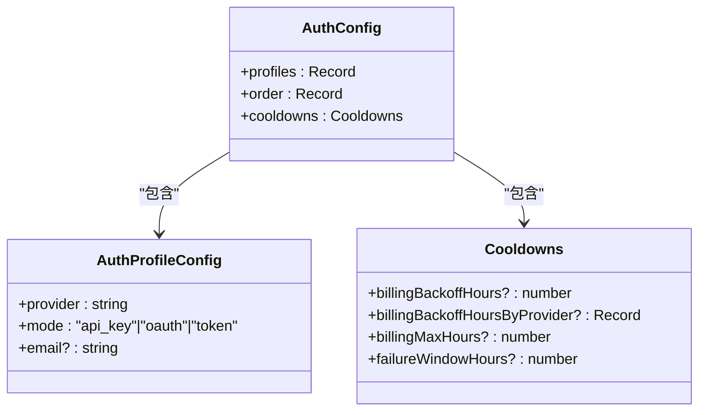
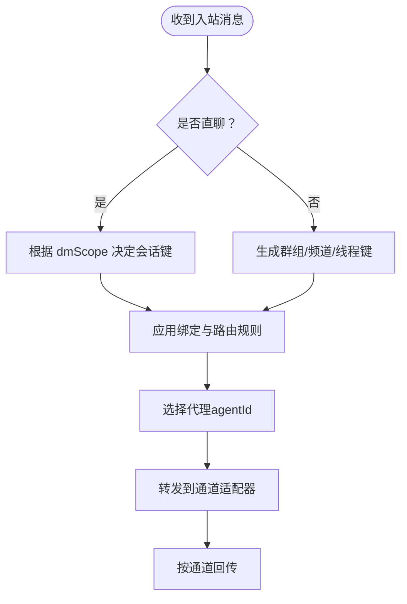
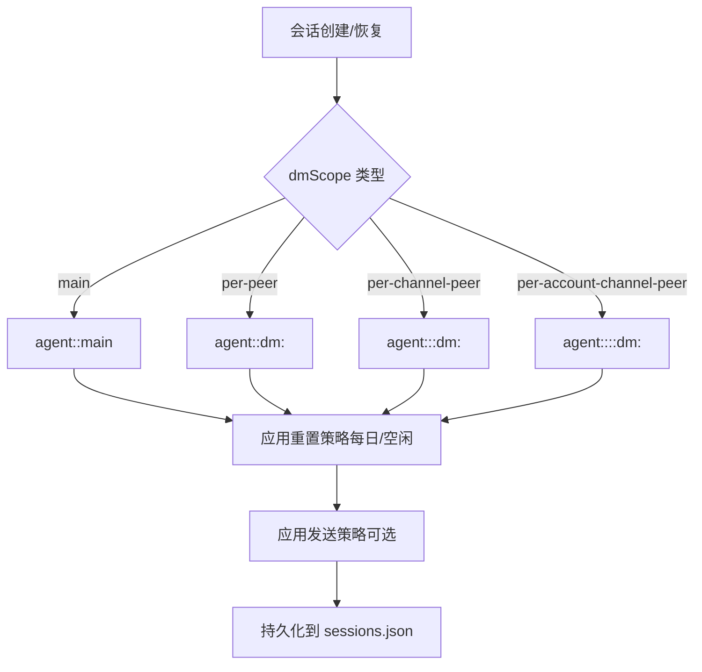
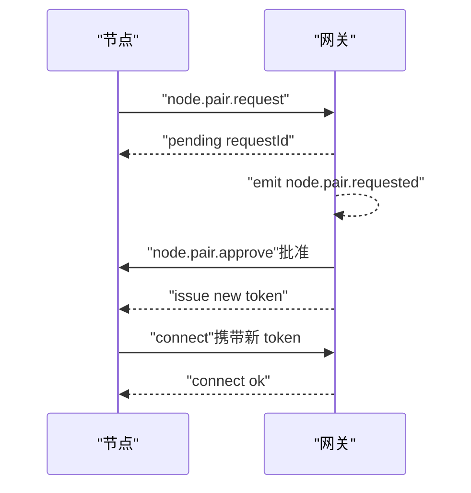
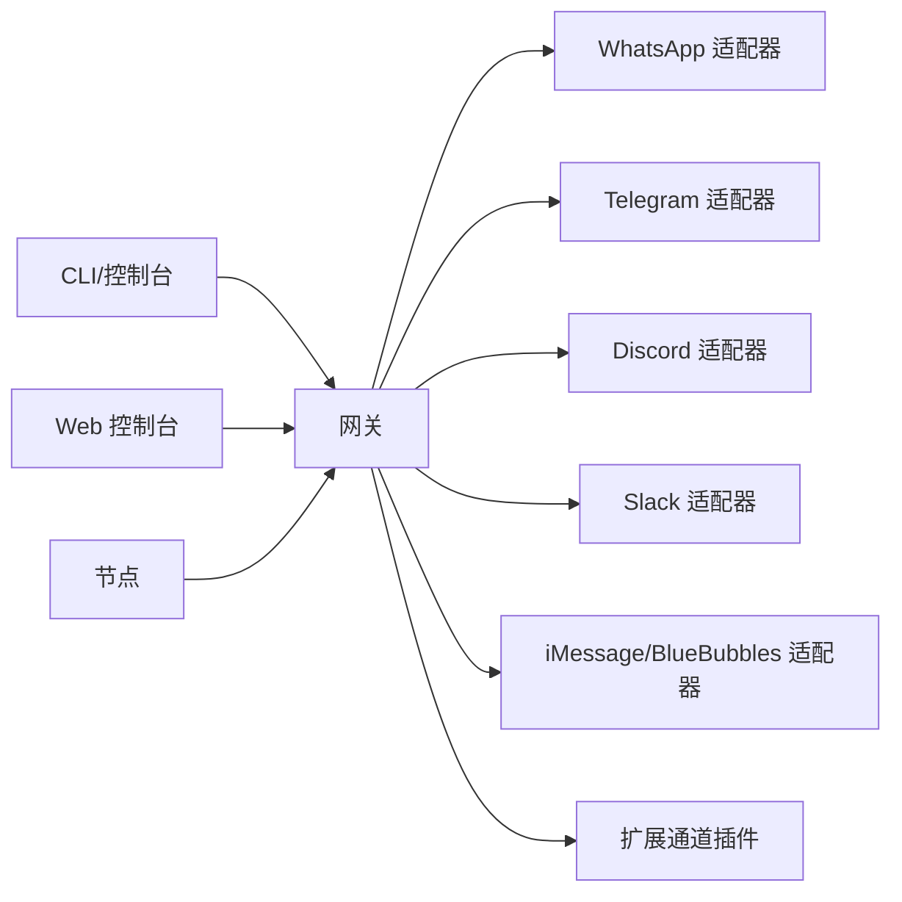
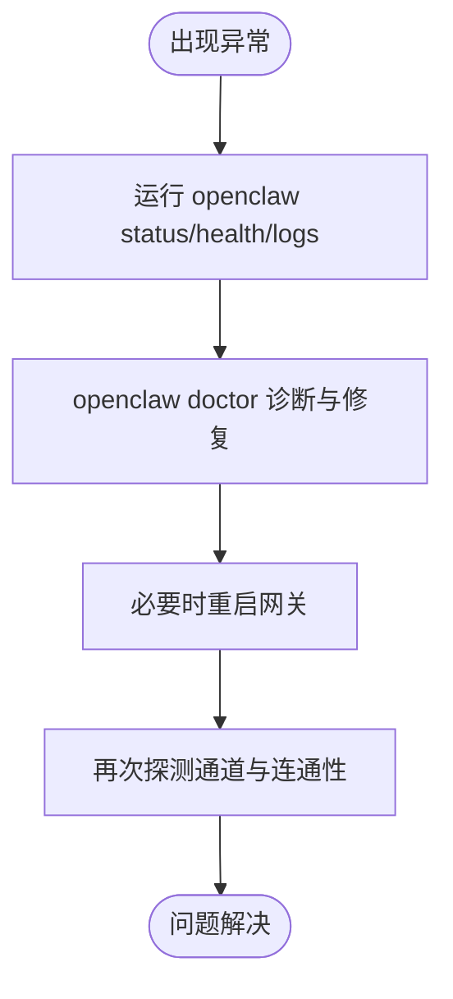

# 平台集成指南

<cite>
**本文档引用的文件**
- [README.md](file://README.md)
- [docs/index.md](file://docs/index.md)
- [docs/gateway/index.md](file://docs/gateway/index.md)
- [docs/gateway/configuration.md](file://docs/gateway/configuration.md)
- [docs/gateway/configuration-reference.md](file://docs/gateway/configuration-reference.md)
- [docs/gateway/authentication.md](file://docs/gateway/authentication.md)
- [docs/gateway/pairing.md](file://docs/gateway/pairing.md)
- [docs/channels/index.md](file://docs/channels/index.md)
- [docs/channels/channel-routing.md](file://docs/channels/channel-routing.md)
- [docs/concepts/architecture.md](file://docs/concepts/architecture.md)
- [docs/concepts/session.md](file://docs/concepts/session.md)
- [src/config/types.auth.ts](file://src/config/types.auth.ts)
- [src/commands/onboard-auth.config-core.ts](file://src/commands/onboard-auth.config-core.ts)
</cite>

## 目录

1. [简介](#简介)
2. [项目结构](#项目结构)
3. [核心组件](#核心组件)
4. [架构总览](#架构总览)
5. [详细组件分析](#详细组件分析)
6. [依赖关系分析](#依赖关系分析)
7. [性能考虑](#性能考虑)
8. [故障排除指南](#故障排除指南)
9. [结论](#结论)
10. [附录](#附录)

## 简介

本指南面向需要在多平台上集成 OpenClaw 的工程师与运维人员，系统性阐述平台接入流程、API 配置与认证设置、消息路由规则、会话绑定策略以及多平台同步机制。文档同时覆盖平台特定限制、性能考量与故障排除方法，并提供集成测试流程、监控指标与维护最佳实践，帮助您安全、稳定地部署与运营。

## 项目结构

OpenClaw 采用“网关控制平面 + 多通道适配器 + 客户端与节点”的分层架构。核心运行时为单进程网关（Gateway），负责会话管理、路由决策、通道连接与事件推送；客户端（macOS 应用、CLI、Web 控制台）通过 WebSocket 连接网关；移动与桌面节点通过设备配对后以角色化方式接入。

**图表来源**

- [docs/concepts/architecture.md:12-26](file://docs/concepts/architecture.md#L12-L26)
- [docs/gateway/index.md:68-93](file://docs/gateway/index.md#L68-L93)

**章节来源**

- [README.md:185-212](file://README.md#L185-L212)
- [docs/index.md:59-71](file://docs/index.md#L59-L71)

## 核心组件

- 网关（Gateway）：单一长连接控制平面，承载会话、路由、通道连接与事件推送；支持热重载与远程访问。
- 通道适配器：针对不同聊天平台（如 WhatsApp、Telegram、Discord、Slack、iMessage 等）的适配实现。
- 客户端与节点：通过 WebSocket 连接网关，执行请求、订阅事件、触发工具与设备能力。
- 认证与密钥管理：支持 API Key、OAuth 与订阅型 setup-token，提供密钥轮换与凭据优先级策略。
- 配置系统：JSON5 结构，严格校验，支持热重载与 RPC 动态更新。

**章节来源**

- [docs/gateway/index.md:68-93](file://docs/gateway/index.md#L68-L93)
- [docs/gateway/configuration.md:10-25](file://docs/gateway/configuration.md#L10-L25)
- [docs/gateway/authentication.md:9-27](file://docs/gateway/authentication.md#L9-L27)

## 架构总览

下图展示从客户端到网关再到各通道适配器的消息流转与握手过程，强调设备配对、认证令牌与事件推送等关键环节。

**图表来源**

- [docs/concepts/architecture.md:59-78](file://docs/concepts/architecture.md#L59-L78)
- [docs/gateway/configuration.md:389-447](file://docs/gateway/configuration.md#L389-L447)

**章节来源**

- [docs/concepts/architecture.md:80-92](file://docs/concepts/architecture.md#L80-L92)

## 详细组件分析

### 平台接入流程（以常见平台为例）

- 准备阶段
  - 启动网关并确保健康状态可用。
  - 在配置中启用目标通道并设置凭据（API Key/OAuth/订阅 token）。
  - 配置 DM 与群组访问策略（dmPolicy、allowFrom、groupPolicy）。
- 典型平台接入要点
  - WhatsApp：使用 Baileys Web，需 QR 登录并存储凭证；可配置多账号与分组策略。
  - Telegram：配置 Bot Token，支持群组话题、自定义命令与回复模式。
  - Discord/Slack：配置 Bot/App Token，支持服务器/工作区维度的路由与权限。
  - iMessage：推荐 BlueBubbles 服务器，支持编辑、撤回、特效、反应与群组管理。
- 验证与上线
  - 使用通道状态探测确认连接就绪。
  - 发送测试消息验证路由与会话绑定。

**图表来源**

- [docs/gateway/configuration.md:74-105](file://docs/gateway/configuration.md#L74-L105)
- [docs/gateway/configuration-reference.md:92-125](file://docs/gateway/configuration-reference.md#L92-L125)
- [docs/channels/index.md:14-38](file://docs/channels/index.md#L14-L38)

**章节来源**

- [docs/gateway/configuration-reference.md:92-125](file://docs/gateway/configuration-reference.md#L92-L125)
- [docs/channels/index.md:14-38](file://docs/channels/index.md#L14-L38)

### API 配置与认证设置

- 认证模型
  - 支持 API Key、OAuth 与订阅型 setup-token；可通过环境变量或 SecretRef 注入。
  - 提供凭据优先级顺序与轮换行为，仅在速率限制错误时自动切换备用密钥。
- 配置入口
  - JSON5 配置文件与热重载；支持 CLI、控制 UI 与 RPC 动态更新。
  - 环境变量导入与替换、Shell 自动注入、SecretRef 统一凭据面。
- 模型与提供商
  - 支持主备模型配置与别名映射；可按通道/群组/话题进行模型覆盖。

**图表来源**

- [src/config/types.auth.ts:1-29](file://src/config/types.auth.ts#L1-L29)

**章节来源**

- [docs/gateway/authentication.md:11-27](file://docs/gateway/authentication.md#L11-L27)
- [docs/gateway/configuration.md:449-539](file://docs/gateway/configuration.md#L449-L539)
- [src/commands/onboard-auth.config-core.ts:473-495](file://src/commands/onboard-auth.config-core.ts#L473-L495)

### 消息路由规则

- 基本原则
  - 回复始终返回至消息来源通道；路由由主机配置决定，模型不参与通道选择。
- 关键术语
  - 通道（Channel）、账号（AccountId）、代理（AgentId）、会话键（SessionKey）。
- 会话键规则（示例）
  - 直聊：agent:<agentId>:<mainKey>（默认 main）。
  - 群组/频道：agent:<agentId>:<channel>:group:<id> 或 agent:<agentId>:<channel>:channel:<id>。
  - 线程/话题：在基础键上附加 :thread:<threadId> 或 :topic:<topicId>。
- 路由匹配顺序
  - 精确对等匹配 > 父对等继承 > 服务器/团队匹配 > 账号匹配 > 通道匹配 > 默认代理。
- 广播群组
  - 对同一对等方可并行运行多个代理，满足复杂业务场景。

**图表来源**

- [docs/channels/channel-routing.md:14-74](file://docs/channels/channel-routing.md#L14-L74)
- [docs/concepts/session.md:189-206](file://docs/concepts/session.md#L189-L206)

**章节来源**

- [docs/channels/channel-routing.md:58-74](file://docs/channels/channel-routing.md#L58-L74)
- [docs/concepts/session.md:189-206](file://docs/concepts/session.md#L189-L206)

### 会话绑定策略

- DM 作用域（dmScope）
  - main：所有直聊共享主会话（适合单用户）。
  - per-peer / per-channel-peer / per-account-channel-peer：按发送者/通道/账号隔离（适合多用户/多账号）。
- 身份链接（identityLinks）
  - 将不同通道的同一联系人映射到统一标识，避免跨通道重复上下文泄露。
- 重置策略
  - 支持按日/空闲窗口重置；可按类型（直聊/群组/线程）与通道分别配置。
- 发送策略（sendPolicy）
  - 基于规则拒绝特定类型会话的投递，避免误发。

**图表来源**

- [docs/concepts/session.md:10-18](file://docs/concepts/session.md#L10-L18)
- [docs/concepts/session.md:207-217](file://docs/concepts/session.md#L207-L217)

**章节来源**

- [docs/concepts/session.md:10-18](file://docs/concepts/session.md#L10-L18)
- [docs/concepts/session.md:207-217](file://docs/concepts/session.md#L207-L217)

### 多平台同步机制

- 设备配对（Gateway 托管）
  - 节点首次连接发起配对请求，网关存储待处理并在到期后清理；批准后颁发新令牌并旋转。
  - 支持静默批准（基于本地 SSH 可达性）与 CLI/UI 审批流程。
- 存储位置
  - 配对状态位于网关状态目录下的 nodes/，支持自定义状态目录。
- 传输行为
  - 传输层无状态，成员资格由网关存储决定；远程模式下仍作用于远程网关存储。

**图表来源**

- [docs/gateway/pairing.md:27-36](file://docs/gateway/pairing.md#L27-L36)
- [docs/gateway/pairing.md:49-71](file://docs/gateway/pairing.md#L49-L71)

**章节来源**

- [docs/gateway/pairing.md:10-19](file://docs/gateway/pairing.md#L10-L19)
- [docs/gateway/pairing.md:81-100](file://docs/gateway/pairing.md#L81-L100)

### 平台特定限制与注意事项

- 通道差异
  - 不同通道对媒体、反应、话题/线程的支持程度不同，需在配置中按需启用。
  - 群组策略与提及门控在各通道可独立配置。
- 安全与合规
  - DM 策略默认为配对模式，建议在多用户场景启用 per-channel-peer 或更高隔离级别。
  - Treat all hook/webhook payload content as untrusted input；谨慎开启 unsafe bypass 标志。
- 性能与容量
  - 大规模会话存储可能增加写延迟；建议在生产中启用强制维护策略并设置磁盘预算。

**章节来源**

- [docs/gateway/configuration-reference.md:22-43](file://docs/gateway/configuration-reference.md#L22-L43)
- [docs/gateway/configuration.md:294-298](file://docs/gateway/configuration.md#L294-L298)
- [docs/concepts/session.md:101-120](file://docs/concepts/session.md#L101-L120)

## 依赖关系分析

- 组件耦合
  - 网关与通道适配器通过统一协议交互，耦合度低、扩展性强。
  - 客户端与节点共享相同的 WebSocket 协议，便于统一开发与测试。
- 外部依赖
  - 模型提供商（OpenAI、Anthropic 等）与通道平台（Telegram、Discord 等）API。
  - 系统服务（systemd/launchd）用于守护网关进程。
- 循环依赖
  - 未发现直接循环依赖；路由与会话管理通过配置驱动，避免运行时循环。

**图表来源**

- [docs/channels/index.md:14-38](file://docs/channels/index.md#L14-L38)
- [docs/concepts/architecture.md:12-26](file://docs/concepts/architecture.md#L12-L26)

**章节来源**

- [docs/channels/index.md:14-38](file://docs/channels/index.md#L14-L38)

## 性能考虑

- 会话存储与维护
  - 启用强制维护策略，合理设置 pruneAfter、maxEntries、rotateBytes 与磁盘预算。
  - 避免仅依赖时间或数量单一指标，应双轨约束以降低抖动。
- 热重载与重启
  - hybrid 模式优先热应用安全变更；关键配置变更自动重启，注意重启冷却与排队。
- 网络与代理
  - 通道网络层支持 DNS 优选与代理配置，必要时启用以提升稳定性。
- 并发与限速
  - 配置钩子与计划任务的最大并发与日志裁剪，避免资源争用。

**章节来源**

- [docs/concepts/session.md:88-120](file://docs/concepts/session.md#L88-L120)
- [docs/gateway/configuration.md:349-388](file://docs/gateway/configuration.md#L349-L388)
- [docs/gateway/configuration-reference.md:193-200](file://docs/gateway/configuration-reference.md#L193-L200)

## 故障排除指南

- 常见症状与定位
  - 端口冲突/绑定失败：检查端口占用与绑定模式，确保非 loopback 绑定时已配置认证。
  - 认证不匹配：核对客户端与网关的 token/password 是否一致。
  - 另一网关实例监听：确保唯一实例或使用唯一端口/状态目录。
- 诊断命令
  - 网关状态、通道探测、健康检查、日志跟踪与医生检查。
- 配置校验
  - 严格模式下未知键或非法值会导致启动失败；使用 doctor 修复并查看具体问题。
- 远程访问
  - 推荐 Tailscale/VPN；SSH 隧道需保持认证一致。

**图表来源**

- [docs/gateway/index.md:235-244](file://docs/gateway/index.md#L235-L244)

**章节来源**

- [docs/gateway/index.md:235-244](file://docs/gateway/index.md#L235-L244)

## 结论

通过本指南，您可以系统化地完成多平台接入、配置与认证、路由与会话策略设计、设备配对与同步、性能优化与故障排除。建议在生产环境中启用严格的 DM 策略、强制会话维护与合理的磁盘预算，并结合远程访问与健康监控保障长期稳定运行。

## 附录

### 集成测试流程

- 端到端验证
  - 启动网关 → 配置通道与凭据 → 通道探测 → 发送测试消息 → 验证回传与会话键。
- 自动化脚本
  - 使用 doctor、status、logs 与 channels status --probe 编排自动化巡检。
- 场景覆盖
  - 单用户直聊、多用户隔离、群组提及门控、线程/话题、多账号/多通道身份链接。

**章节来源**

- [docs/gateway/index.md:27-61](file://docs/gateway/index.md#L27-L61)
- [docs/gateway/configuration.md:389-447](file://docs/gateway/configuration.md#L389-L447)

### 监控指标与告警

- 关键指标
  - 网关运行状态、通道健康状态、会话数量与大小、磁盘使用率、钩子/计划任务执行次数与耗时。
- 告警建议
  - 通道连续不可用、会话存储增长过快、磁盘接近上限、认证轮换失败、配对请求堆积。

**章节来源**

- [docs/gateway/configuration.md:228-247](file://docs/gateway/configuration.md#L228-L247)
- [docs/concepts/session.md:88-120](file://docs/concepts/session.md#L88-L120)

### 维护最佳实践

- 配置管理
  - 使用 $include 分层组织配置；严格校验与热重载；定期 doctor 修复。
- 安全加固
  - 默认配对 DM；最小权限原则；禁用 unsafe bypass；定期轮换密钥。
- 运维规范
  - 使用 systemd/launchd 守护；Tailscale/VPN 远程访问；SSH 隧道仅作临时应急。

**章节来源**

- [docs/gateway/configuration.md:325-347](file://docs/gateway/configuration.md#L325-L347)
- [docs/gateway/authentication.md:160-180](file://docs/gateway/authentication.md#L160-L180)
- [docs/gateway/index.md:108-124](file://docs/gateway/index.md#L108-L124)
