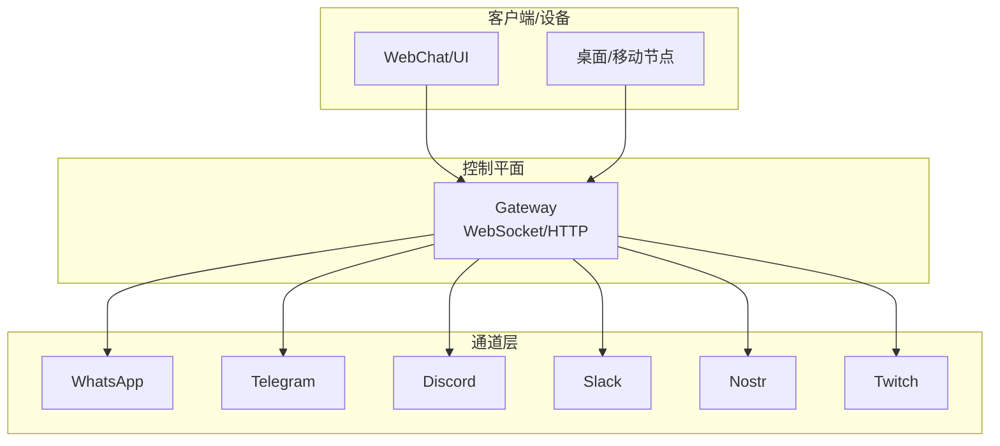
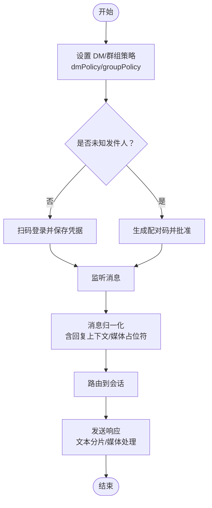
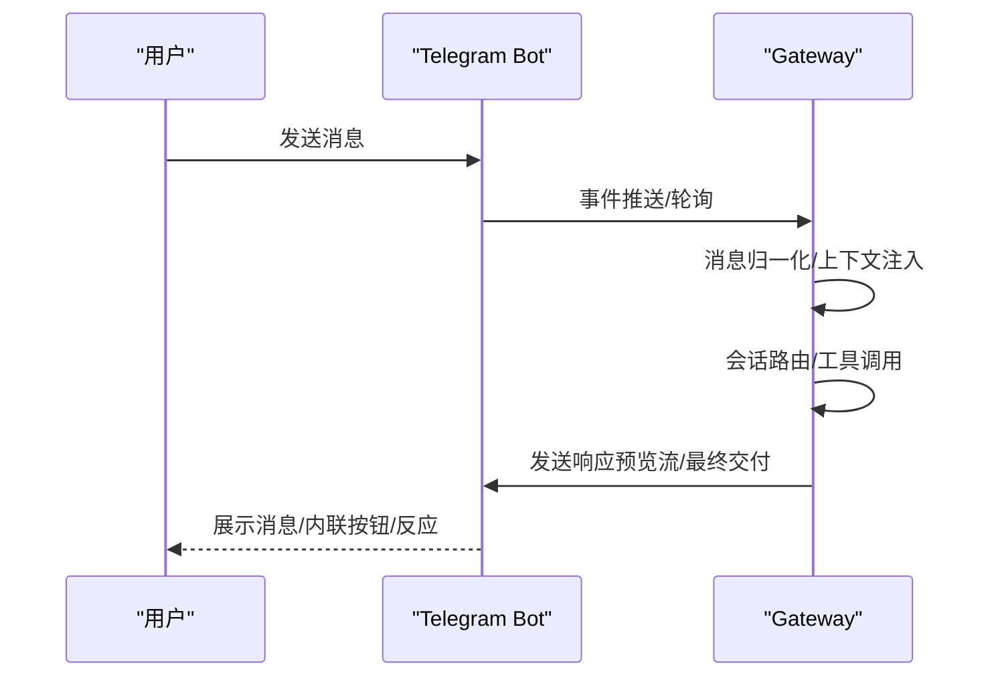
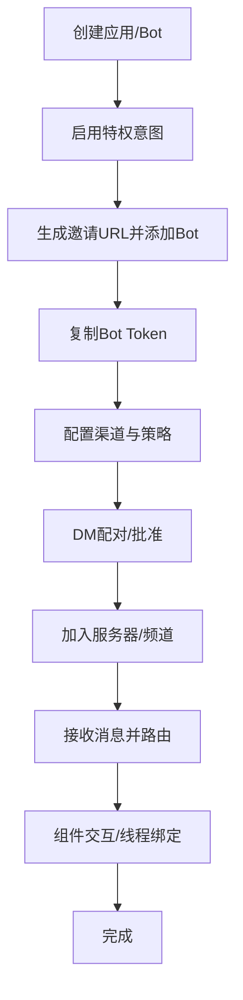
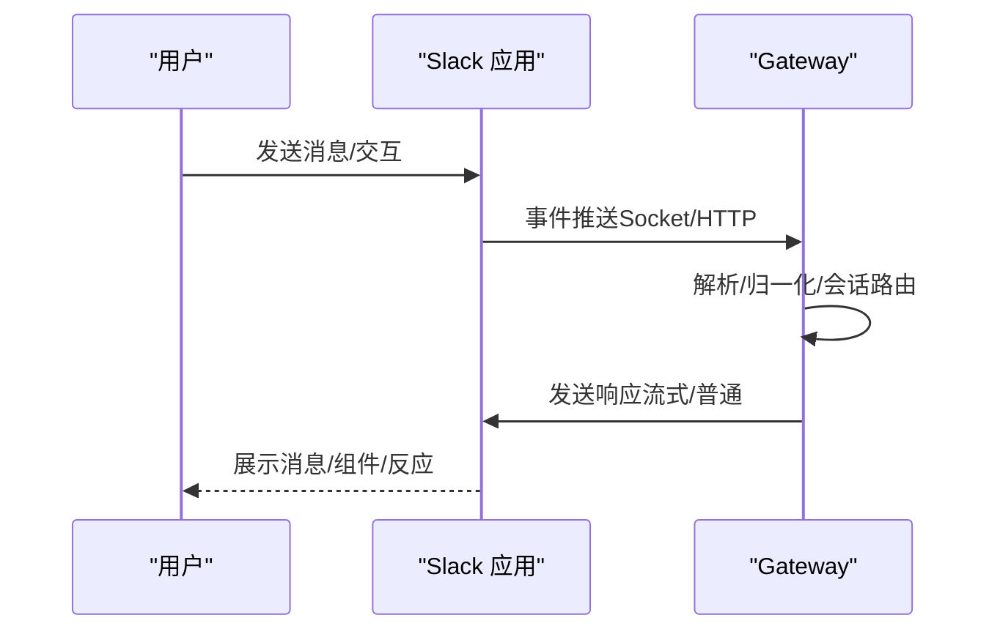
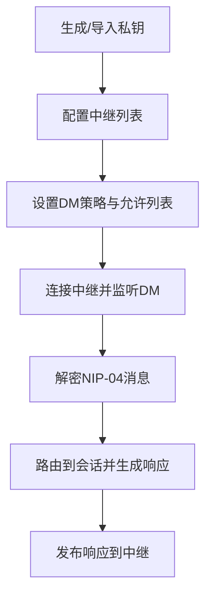
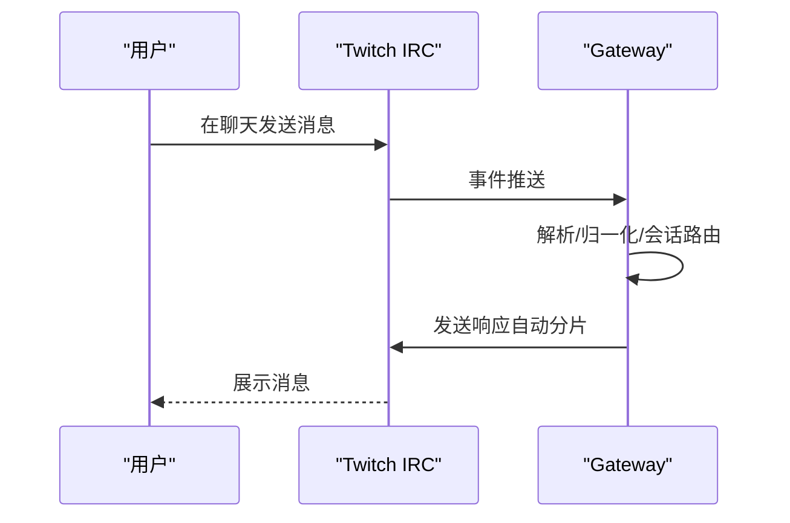
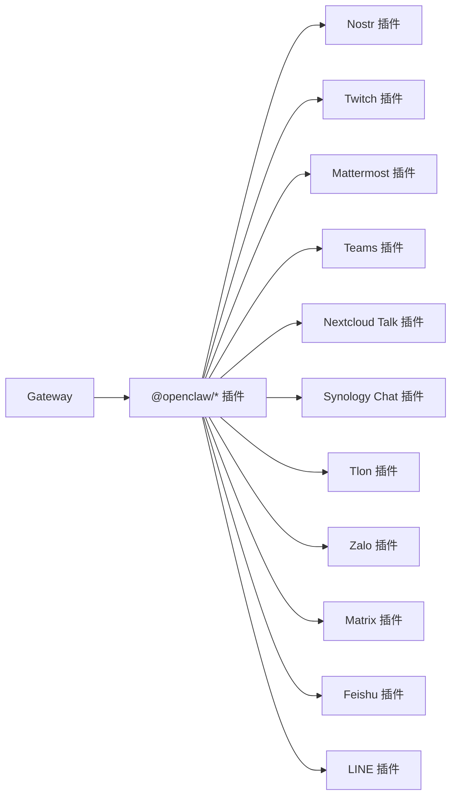

# 支持的平台

<cite>
**本文引用的文件**
- [README.md](file://README.md)
- [docs/channels/index.md](file://docs/channels/index.md)
- [docs/channels/whatsapp.md](file://docs/channels/whatsapp.md)
- [docs/channels/telegram.md](file://docs/channels/telegram.md)
- [docs/channels/discord.md](file://docs/channels/discord.md)
- [docs/channels/slack.md](file://docs/channels/slack.md)
- [docs/channels/nostr.md](file://docs/channels/nostr.md)
- [docs/channels/twitch.md](file://docs/channels/twitch.md)
</cite>

## 目录

1. [简介](#简介)
2. [项目结构](#项目结构)
3. [核心组件](#核心组件)
4. [架构总览](#架构总览)
5. [详细组件分析](#详细组件分析)
6. [依赖关系分析](#依赖关系分析)
7. [性能考量](#性能考量)
8. [故障排查指南](#故障排查指南)
9. [结论](#结论)
10. [附录](#附录)

## 简介

本文件系统化梳理 OpenClaw 支持的 40+ 消息平台，覆盖主流与新兴平台（如 WhatsApp、Telegram、Discord、Slack、Nostr、Twitch 等）。内容包括：各平台的接入方式、认证流程、配置要点、使用限制、平台特性差异、消息格式转换与兼容性说明，并提供平台选择与迁移建议，帮助用户基于自身需求做出最佳决策。

## 项目结构

OpenClaw 将“通道（Channel）”抽象为统一的网关接入面，不同平台通过各自的适配器连接到 Gateway。平台能力与配置在官方文档中按平台维度拆分，便于按需查阅与落地实施。

```mermaid
graph TB
GW["Gateway 控制平面<br/>WebSocket/HTTP 接口"] --> WA["WhatsApp 通道"]
GW --> TG["Telegram 通道"]
GW --> DC["Discord 通道"]
GW --> SL["Slack 通道"]
GW --> NS["Nostr 通道"]
GW --> TW["Twitch 通道"]
subgraph "其他通道示例"
BB["BlueBubbles/iMessage"]
GC["Google Chat"]
IM["iMessage(旧)"]
IR["IRC"]
MS["Microsoft Teams"]
MT["Mattermost"]
NX["Nextcloud Talk"]
SZ["Synology Chat"]
TLN["Tlon"]
ZL["Zalo/Zalo Personal"]
MC["Matrix"]
FE["Feishu"]
LI["LINE"]
NT["Nostr(插件)"]
WT["WebChat"]
end
GW --> BB
GW --> GC
GW --> IM
GW --> IR
GW --> MS
GW --> MT
GW --> NX
GW --> SZ
GW --> TLN
GW --> ZL
GW --> MC
GW --> FE
GW --> LI
GW --> NT
GW --> WT
```

图示来源

- [README.md:188-202](file://README.md#L188-L202)
- [docs/channels/index.md:14-37](file://docs/channels/index.md#L14-L37)

章节来源

- [README.md:21-22](file://README.md#L21-L22)
- [docs/channels/index.md:9-13](file://docs/channels/index.md#L9-L13)

## 核心组件

- 通道适配层：各平台以独立文档与插件形式存在，统一由 Gateway 路由与调度。
- 访问控制：默认 DM 配对策略（pairing）、允许列表（allowFrom）、群组策略（groupPolicy）等。
- 消息归一化：入站消息统一封装为通道信封；回复上下文、媒体占位符、历史注入等。
- 发送与限流：文本分片、媒体大小限制、发送回执、预览流式输出等。
- 安全与合规：令牌管理、环境变量注入、最小权限原则、日志审计与诊断工具。

章节来源

- [README.md:118-124](file://README.md#L118-L124)
- [docs/channels/whatsapp.md:134-200](file://docs/channels/whatsapp.md#L134-L200)
- [docs/channels/telegram.md:105-246](file://docs/channels/telegram.md#L105-L246)
- [docs/channels/discord.md:369-461](file://docs/channels/discord.md#L369-L461)
- [docs/channels/slack.md:136-205](file://docs/channels/slack.md#L136-L205)

## 架构总览

下图展示 Gateway 作为统一控制面，承载多通道接入与会话路由的整体视图。

图示来源

- [README.md:188-202](file://README.md#L188-L202)

章节来源

- [README.md:185-202](file://README.md#L185-L202)

## 详细组件分析

### WhatsApp（Web 通道）

- 状态：生产就绪，基于 Baileys 的 WhatsApp Web。
- 认证与登录：通过二维码配对，凭证存储于本地凭据目录；支持多账号。
- 访问控制：
  - DM 策略：pairing/allowlist/open/disabled，默认 pairing。
  - 群组策略：groupPolicy（open/allowlist/disabled），配合 groupAllowFrom 与 groups 允许列表。
  - 自聊天保护：当自号出现在 allowFrom 时启用自聊天防护。
- 消息处理：
  - 归一化：带回复上下文与媒体占位符；群组可缓冲未处理消息并注入上下文。
  - 媒体：图片/视频/音频/文档；自动优化尺寸；首项失败回退为文本警告。
  - 回执：默认开启，可全局/账户级关闭。
- 工具与动作：反应、投票等；默认允许配置写入。
- 限制与注意：Bun 不兼容；断线重连；群消息被忽略的常见原因排查。

图示来源

- [docs/channels/whatsapp.md:24-76](file://docs/channels/whatsapp.md#L24-L76)
- [docs/channels/whatsapp.md:134-200](file://docs/channels/whatsapp.md#L134-L200)
- [docs/channels/whatsapp.md:292-316](file://docs/channels/whatsapp.md#L292-L316)

章节来源

- [docs/channels/whatsapp.md:10-12](file://docs/channels/whatsapp.md#L10-L12)
- [docs/channels/whatsapp.md:24-76](file://docs/channels/whatsapp.md#L24-L76)
- [docs/channels/whatsapp.md:134-200](file://docs/channels/whatsapp.md#L134-L200)
- [docs/channels/whatsapp.md:292-316](file://docs/channels/whatsapp.md#L292-L316)
- [docs/channels/whatsapp.md:343-364](file://docs/channels/whatsapp.md#L343-L364)

### Telegram（Bot API）

- 状态：生产就绪，grammY；长轮询默认，可选 Webhook。
- 认证与登录：BotFather 创建机器人，获取 botToken；无需通道登录。
- 访问控制：
  - DM 策略：pairing/allowlist/open/disabled；默认 pairing。
  - 群组策略：groupPolicy（open/allowlist/disabled），配合 groups 与 groupAllowFrom。
  - 提醒：隐私模式或管理员身份影响消息可见性。
- 特性：
  - 实时预览流：partial/block/progress；支持 HTML 解析与回退纯文本。
  - 内联按钮：允许列表/作用域控制；回调数据透传为文本。
  - 论坛主题：话题隔离与继承；支持持久化 ACP 绑定。
  - 反应通知：own/all/allowlist 模式；线程边界注意。
  - 配置写入：默认开启，支持 /config set/unset。
- 限制与注意：长轮询并发；媒体上限；Webhook 需要签名密钥与唯一路径。

图示来源

- [docs/channels/telegram.md:10-11](file://docs/channels/telegram.md#L10-L11)
- [docs/channels/telegram.md:24-69](file://docs/channels/telegram.md#L24-L69)
- [docs/channels/telegram.md:258-289](file://docs/channels/telegram.md#L258-L289)
- [docs/channels/telegram.md:420-443](file://docs/channels/telegram.md#L420-L443)
- [docs/channels/telegram.md:731-747](file://docs/channels/telegram.md#L731-L747)

章节来源

- [docs/channels/telegram.md:10-11](file://docs/channels/telegram.md#L10-L11)
- [docs/channels/telegram.md:24-69](file://docs/channels/telegram.md#L24-L69)
- [docs/channels/telegram.md:105-246](file://docs/channels/telegram.md#L105-L246)
- [docs/channels/telegram.md:258-289](file://docs/channels/telegram.md#L258-L289)
- [docs/channels/telegram.md:420-443](file://docs/channels/telegram.md#L420-L443)
- [docs/channels/telegram.md:731-747](file://docs/channels/telegram.md#L731-L747)

### Discord（Bot API）

- 状态：生产就绪，支持 DM 与服务器频道。
- 认证与登录：开发者门户创建应用与 Bot，启用特权意图，复制 Bot Token 并邀请至服务器。
- 访问控制：
  - DM 策略：pairing/allowlist/open/disabled；默认 pairing。
  - 服务器策略：groupPolicy（open/allowlist/disabled），支持按服务器/频道/角色/用户名匹配。
  - 名称匹配：默认禁用，仅在紧急情况下启用。
- 特性：
  - 组件容器：支持多种块类型与交互；可限制点击用户；模态表单。
  - 线程绑定：支持线程与子代理会话绑定；持久化 ACP 绑定。
  - 反应通知：per-guild 模式；事件注入会话。
  - 配置写入：默认开启。
- 限制与注意：需要 Message Content Intent；服务器成员/存在意图可选但推荐；组 DM 默认忽略。

图示来源

- [docs/channels/discord.md:24-167](file://docs/channels/discord.md#L24-L167)
- [docs/channels/discord.md:369-461](file://docs/channels/discord.md#L369-L461)
- [docs/channels/discord.md:554-752](file://docs/channels/discord.md#L554-L752)

章节来源

- [docs/channels/discord.md:8-10](file://docs/channels/discord.md#L8-L10)
- [docs/channels/discord.md:24-167](file://docs/channels/discord.md#L24-L167)
- [docs/channels/discord.md:369-461](file://docs/channels/discord.md#L369-L461)
- [docs/channels/discord.md:554-752](file://docs/channels/discord.md#L554-L752)

### Slack（Socket Mode/HTTP Events API）

- 状态：生产就绪，支持 DM 与频道；默认 Socket Mode，也支持 HTTP Events API。
- 认证与登录：Socket Mode 需要 App Token（connections:write）与 Bot Token；HTTP 模式需要 Bot Token 与 Signing Secret。
- 访问控制：
  - DM 策略：pairing/allowlist/open/disabled；默认 pairing。
  - 频道策略：groupPolicy（open/allowlist/disabled），支持 per-channel 用户/技能/系统提示等。
  - 名称匹配：默认禁用，仅在紧急情况下启用。
- 特性：
  - 文本流式：原生 Slack 流式 API（Agents and AI Apps）；支持 partial/block/progress。
  - 交互与事件：反应、加删 Pin、成员进出、频道重命名、Pin 事件映射为系统事件。
  - 反应占位：ackReaction/typingReaction；短代码格式。
- 限制与注意：Socket Mode 需验证令牌与启用；HTTP 模式需校验签名与唯一 webhook 路径。

图示来源

- [docs/channels/slack.md:24-121](file://docs/channels/slack.md#L24-L121)
- [docs/channels/slack.md:136-205](file://docs/channels/slack.md#L136-L205)
- [docs/channels/slack.md:492-518](file://docs/channels/slack.md#L492-L518)

章节来源

- [docs/channels/slack.md:8-10](file://docs/channels/slack.md#L8-L10)
- [docs/channels/slack.md:24-121](file://docs/channels/slack.md#L24-L121)
- [docs/channels/slack.md:136-205](file://docs/channels/slack.md#L136-L205)
- [docs/channels/slack.md:492-518](file://docs/channels/slack.md#L492-L518)

### Nostr（插件）

- 状态：可选插件，默认禁用。
- 认证与登录：私钥（nsec 或 64 字节十六进制）；可选公钥配置与个人资料发布。
- 认证与访问控制：
  - DM 策略：pairing/allowlist/open/disabled；默认 pairing。
  - 允许列表：pubkey（npub 或十六进制）。
- 特性：
  - 协议支持：NIP-01（资料）、NIP-04（加密 DM）；计划支持 NIP-17/NIP-44。
  - 多中继：默认两个中继，建议 2-3 个以提高冗余。
- 限制与注意：仅 DM；无媒体；私钥安全存储。

图示来源

- [docs/channels/nostr.md:15-42](file://docs/channels/nostr.md#L15-L42)
- [docs/channels/nostr.md:115-137](file://docs/channels/nostr.md#L115-L137)
- [docs/channels/nostr.md:167-175](file://docs/channels/nostr.md#L167-L175)

章节来源

- [docs/channels/nostr.md:9-13](file://docs/channels/nostr.md#L9-L13)
- [docs/channels/nostr.md:15-42](file://docs/channels/nostr.md#L15-L42)
- [docs/channels/nostr.md:115-137](file://docs/channels/nostr.md#L115-L137)
- [docs/channels/nostr.md:167-175](file://docs/channels/nostr.md#L167-L175)

### Twitch（插件）

- 状态：插件形式，非内置。
- 认证与登录：使用 Twitch Token Generator 获取 Bot Token（chat:read/chat:write），或注册应用后使用刷新令牌。
- 访问控制：
  - 角色限制：moderator/owner/vip/subscriber/all。
  - 用户 ID 允许列表：最安全方式；用户名易变。
  - @mention 默认开启，可关闭。
- 特性：
  - 多账号：每频道一个令牌；支持多账户并行。
  - 工具动作：向频道发送消息。
- 限制与注意：消息长度限制 500 字符；自动按词边界分片；无速率限制（遵循 Twitch 速率限制）。

图示来源

- [docs/channels/twitch.md:12-29](file://docs/channels/twitch.md#L12-L29)
- [docs/channels/twitch.md:30-61](file://docs/channels/twitch.md#L30-L61)
- [docs/channels/twitch.md:178-247](file://docs/channels/twitch.md#L178-L247)

章节来源

- [docs/channels/twitch.md:8-10](file://docs/channels/twitch.md#L8-L10)
- [docs/channels/twitch.md:12-29](file://docs/channels/twitch.md#L12-L29)
- [docs/channels/twitch.md:30-61](file://docs/channels/twitch.md#L30-L61)
- [docs/channels/twitch.md:178-247](file://docs/channels/twitch.md#L178-L247)

### 其他平台概览

- BlueBubbles（iMessage，推荐）：macOS 服务端 REST API，功能完整（编辑、撤回、特效、反应、群管理）。
- Google Chat：Bot API + HTTP Webhook。
- iMessage（旧）：macOS 专用，imsg CLI。
- IRC：经典 IRC 服务器，支持频道与 DM。
- Microsoft Teams：Bot Framework，企业支持。
- Mattermost：Bot API + WebSocket。
- Nextcloud Talk：自托管聊天。
- Synology Chat：NAS 聊天。
- Tlon：基于 Urbit 的消息应用。
- Zalo/Zalo Personal：越南主流消息，分别提供 Bot API 与二维码登录。
- Matrix/Feishu/LINE：均以插件形式提供，安装后启用。

章节来源

- [docs/channels/index.md:16-37](file://docs/channels/index.md#L16-L37)
- [README.md:21-22](file://README.md#L21-L22)

## 依赖关系分析

- 通道与 Gateway：所有通道均通过 Gateway 进行统一路由与会话管理。
- 插件体系：部分平台（Nostr、Twitch、Matrix、Feishu、LINE、Mattermost、Microsoft Teams、Nextcloud Talk、Synology Chat、Tlon、Zalo 等）以插件形式提供，需按需安装与启用。
- 认证与令牌：各平台采用不同的认证模型（Bot Token、App Token、私钥、OAuth Access/Refresh Token 等），需严格遵循最小权限原则与安全存储。

图示来源

- [docs/channels/index.md:16-37](file://docs/channels/index.md#L16-L37)

章节来源

- [docs/channels/index.md:16-37](file://docs/channels/index.md#L16-L37)

## 性能考量

- 文本分片与媒体处理：各平台默认分片阈值与分隔策略不同，需结合平台限制与体验权衡。
- 流式输出：Telegram/Slack/Discord 支持实时预览流，提升交互体验，但需注意平台 API 限制与回退策略。
- 并发与限速：Telegram 长轮询并发受全局并发限制；Slack/IRC/Twitch 等遵循各自速率限制。
- 历史注入：群组上下文注入可增强理解，但需控制历史窗口与注入标记，避免过度上下文。

## 故障排查指南

- 通用诊断：运行 `openclaw doctor` 与 `openclaw logs --follow`，检查通道状态与错误日志。
- 渠道特定：
  - WhatsApp：未链接/断线重连/无活动监听；Bun 不兼容。
  - Telegram：隐私模式/管理员身份；Webhook 签名与路径；长轮询并发。
  - Discord：特权意图缺失；服务器成员/存在意图；组 DM 默认忽略。
  - Slack：Socket 模式令牌与启用；HTTP 模式签名与唯一路径；原生流式 API 权限。
  - Nostr：私钥有效性、中继可达性、重复消息去重。
  - Twitch：令牌过期与刷新、角色/用户 ID 允许列表、消息长度限制。

章节来源

- [docs/channels/whatsapp.md:374-424](file://docs/channels/whatsapp.md#L374-L424)
- [docs/channels/telegram.md:731-747](file://docs/channels/telegram.md#L731-L747)
- [docs/channels/discord.md:490-538](file://docs/channels/discord.md#L490-L538)
- [docs/channels/slack.md:433-490](file://docs/channels/slack.md#L433-L490)
- [docs/channels/nostr.md:203-222](file://docs/channels/nostr.md#L203-L222)
- [docs/channels/twitch.md:249-286](file://docs/channels/twitch.md#L249-L286)

## 结论

OpenClaw 通过统一的 Gateway 抽象，将多样化的消息平台整合为一致的接入面。不同平台在认证、访问控制、消息格式与特性上各有差异，但都遵循最小权限、可审计与可扩展的原则。建议根据团队协作场景、合规要求与技术栈选择合适平台，并结合内置安全策略与诊断工具保障稳定运行。

## 附录

### 平台选择与迁移建议

- 快速起步：Telegram（简单 Bot Token，配置即用）；Discord（Socket Mode，组件与线程能力丰富）。
- 企业/团队：Slack（Socket Mode/HTTP，流式与事件生态完善）；Microsoft Teams（Bot Framework，企业集成）。
- 分布式/去中心化：Nostr（加密 DM，隐私优先）。
- 娱乐/直播：Twitch（IRC，角色与订阅权限）。
- 多账号/多频道：WhatsApp（多账号）、Telegram（论坛主题）、Discord（线程绑定与 ACP 绑定）。
- 迁移建议：
  - 从 Telegram/Discord 开始，逐步引入 Slack/Teams 以满足企业需求。
  - 使用 Gateway 的配置写入与命令，平滑迁移群组策略与访问控制。
  - 对于插件平台（Nostr/Twitch 等），先在测试环境验证令牌与中继/IRC 连接，再迁移生产。

章节来源

- [docs/channels/index.md:40-47](file://docs/channels/index.md#L40-L47)
- [docs/channels/telegram.md:709-729](file://docs/channels/telegram.md#L709-L729)
- [docs/channels/discord.md:689-752](file://docs/channels/discord.md#L689-L752)
- [docs/channels/slack.md:533-547](file://docs/channels/slack.md#L533-L547)
