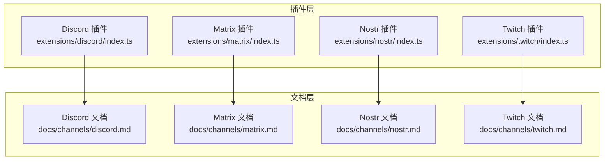
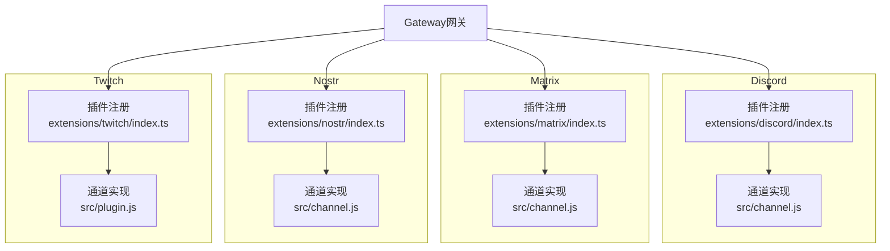
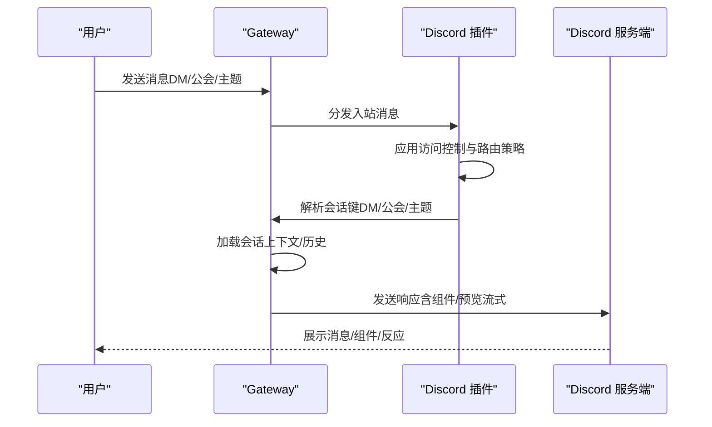
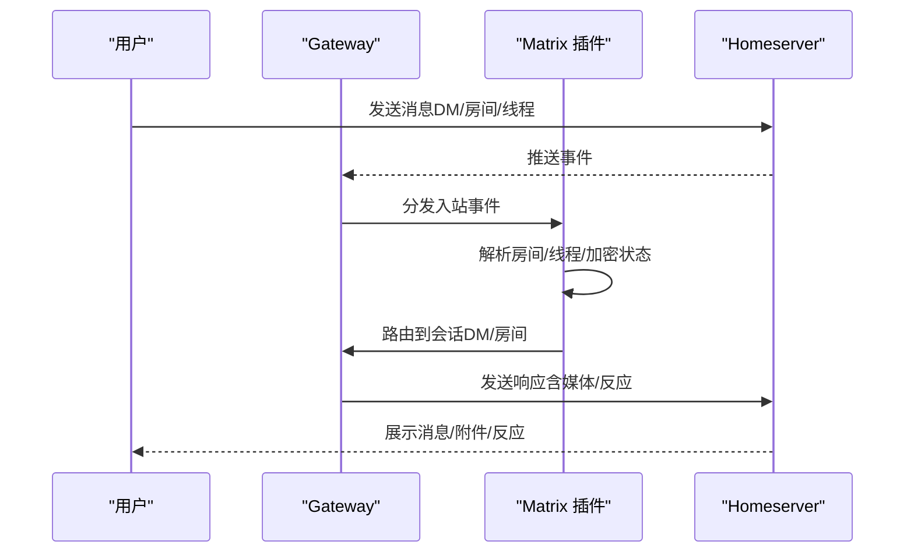
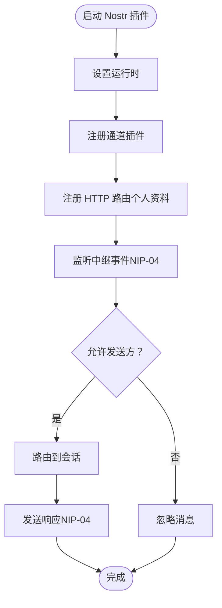
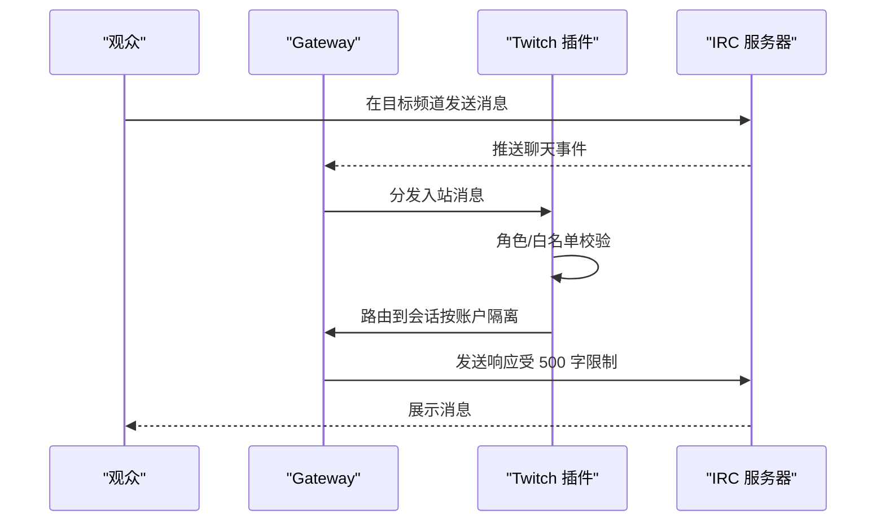
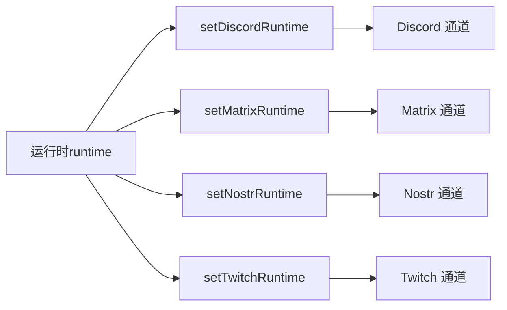

# 社交媒体平台

<cite>
**本文引用的文件**
- [extensions/discord/index.ts](file://extensions/discord/index.ts)
- [extensions/matrix/index.ts](file://extensions/matrix/index.ts)
- [extensions/nostr/index.ts](file://extensions/nostr/index.ts)
- [extensions/twitch/index.ts](file://extensions/twitch/index.ts)
- [docs/channels/discord.md](file://docs/channels/discord.md)
- [docs/channels/matrix.md](file://docs/channels/matrix.md)
- [docs/channels/nostr.md](file://docs/channels/nostr.md)
- [docs/channels/twitch.md](file://docs/channels/twitch.md)
</cite>

## 目录

1. [简介](#简介)
2. [项目结构](#项目结构)
3. [核心组件](#核心组件)
4. [架构总览](#架构总览)
5. [详细组件分析](#详细组件分析)
6. [依赖关系分析](#依赖关系分析)
7. [性能与扩展性考虑](#性能与扩展性考虑)
8. [故障排查指南](#故障排查指南)
9. [结论](#结论)
10. [附录：平台特定API与配置要点](#附录平台特定api与配置要点)

## 简介

本文件面向在 OpenClaw 平台上集成 Discord、Matrix、Nostr、Twitch 等社交媒体渠道的工程与运营人员，系统梳理各平台的插件注册流程、频道管理、访问控制与路由模型、内容审核与社区治理机制，并给出实时聊天、互动组件、限流与安全策略的实践建议。文档同时提供面向不同技术背景读者的渐进式讲解与可视化图示。

## 项目结构

OpenClaw 将各渠道以“插件”形式组织在 extensions 下，每个插件通过统一的插件 SDK 注册自身通道能力；配套的官方文档位于 docs/channels 下，覆盖安装、配置、故障排查与特性说明。

图表来源

- [extensions/discord/index.ts:1-20](file://extensions/discord/index.ts#L1-L20)
- [extensions/matrix/index.ts:1-23](file://extensions/matrix/index.ts#L1-L23)
- [extensions/nostr/index.ts:1-74](file://extensions/nostr/index.ts#L1-L74)
- [extensions/twitch/index.ts:1-21](file://extensions/twitch/index.ts#L1-L21)
- [docs/channels/discord.md:1-1224](file://docs/channels/discord.md#L1-L1224)
- [docs/channels/matrix.md:1-304](file://docs/channels/matrix.md#L1-L304)
- [docs/channels/nostr.md:1-234](file://docs/channels/nostr.md#L1-L234)
- [docs/channels/twitch.md:1-380](file://docs/channels/twitch.md#L1-L380)

章节来源

- [extensions/discord/index.ts:1-20](file://extensions/discord/index.ts#L1-L20)
- [extensions/matrix/index.ts:1-23](file://extensions/matrix/index.ts#L1-L23)
- [extensions/nostr/index.ts:1-74](file://extensions/nostr/index.ts#L1-L74)
- [extensions/twitch/index.ts:1-21](file://extensions/twitch/index.ts#L1-L21)
- [docs/channels/discord.md:1-1224](file://docs/channels/discord.md#L1-L1224)
- [docs/channels/matrix.md:1-304](file://docs/channels/matrix.md#L1-L304)
- [docs/channels/nostr.md:1-234](file://docs/channels/nostr.md#L1-L234)
- [docs/channels/twitch.md:1-380](file://docs/channels/twitch.md#L1-L380)

## 核心组件

- 插件注册入口：各平台插件均导出一个默认对象，包含 id、name、description、configSchema 以及 register 回调。register 中会设置运行时、注册通道插件，并在需要时注册子代理钩子或 HTTP 路由。
- 运行时注入：插件通过 setXxxRuntime(api.runtime) 将运行时上下文注入到通道实现中，确保配置、日志、密钥管理等能力可用。
- 通道插件：由各平台的 src/channel.js 或类似模块导出，负责实际的消息收发、事件处理、会话路由等。

章节来源

- [extensions/discord/index.ts:7-17](file://extensions/discord/index.ts#L7-L17)
- [extensions/matrix/index.ts:7-19](file://extensions/matrix/index.ts#L7-L19)
- [extensions/nostr/index.ts:9-71](file://extensions/nostr/index.ts#L9-L71)
- [extensions/twitch/index.ts:8-18](file://extensions/twitch/index.ts#L8-L18)

## 架构总览

下图展示 OpenClaw 与各社交媒体平台的交互关系：Gateway 持有连接，插件注册通道能力，消息在入站时按策略路由到会话，出站时按平台规则回写。

图表来源

- [extensions/discord/index.ts:12-16](file://extensions/discord/index.ts#L12-L16)
- [extensions/matrix/index.ts:12-18](file://extensions/matrix/index.ts#L12-L18)
- [extensions/nostr/index.ts:14-16](file://extensions/nostr/index.ts#L14-L16)
- [extensions/twitch/index.ts:13-16](file://extensions/twitch/index.ts#L13-L16)

## 详细组件分析

### Discord 组件分析

- 插件注册：设置运行时、注册 Discord 通道插件、注册子代理钩子。
- 频道管理与会话模型：DM 默认配对模式；公会（服务器）通道采用隔离会话键；论坛/主题通道支持自动建帖与组件容器。
- 访问控制与路由：DM 政策（配对/白名单/开放/禁用）、公会白名单、提及要求、群组 DM 控制；支持基于角色的绑定路由。
- 内容与交互：原生斜杠命令、回复标签、预览流式输出、历史/上下文、反应通知、ACK 反应、持久化 ACP 绑定、线程绑定。
- 安全与治理：允许通过配置写入（/config set/unset）进行频道级配置变更；提及模式可自定义；支持忽略其他提及（除 @everyone/@here）。

图表来源

- [extensions/discord/index.ts:12-16](file://extensions/discord/index.ts#L12-L16)
- [docs/channels/discord.md:255-263](file://docs/channels/discord.md#L255-L263)
- [docs/channels/discord.md:369-461](file://docs/channels/discord.md#L369-L461)
- [docs/channels/discord.md:540-549](file://docs/channels/discord.md#L540-L549)
- [docs/channels/discord.md:554-800](file://docs/channels/discord.md#L554-L800)

章节来源

- [extensions/discord/index.ts:7-17](file://extensions/discord/index.ts#L7-L17)
- [docs/channels/discord.md:255-800](file://docs/channels/discord.md#L255-L800)

### Matrix 组件分析

- 插件注册：设置运行时、确保加密运行时（如可用）、注册 Matrix 通道插件。
- 频道管理：支持直聊、房间、线程、媒体、反应、投票（发送/开始文本）、位置；E2EE 可选启用。
- 多账户：每账户独立作为 Matrix 用户登录，继承顶层配置并可覆写。
- 访问控制：DM 政策（配对/白名单/开放/禁用）、房间白名单、邀请加入策略、线程回复策略、回复元数据模式。
- 安全与治理：E2EE 启用后需设备验证；加密状态按账户+令牌存储；支持 per-action 工具门控。

图表来源

- [extensions/matrix/index.ts:12-18](file://extensions/matrix/index.ts#L12-L18)
- [docs/channels/matrix.md:111-138](file://docs/channels/matrix.md#L111-L138)
- [docs/channels/matrix.md:180-225](file://docs/channels/matrix.md#L180-L225)
- [docs/channels/matrix.md:234-247](file://docs/channels/matrix.md#L234-L247)

章节来源

- [extensions/matrix/index.ts:7-19](file://extensions/matrix/index.ts#L7-L19)
- [docs/channels/matrix.md:1-304](file://docs/channels/matrix.md#L1-L304)

### Nostr 组件分析

- 插件注册：设置运行时、注册 Nostr 通道插件；注册 HTTP 路由用于个人资料管理（NIP-01）。
- 频道管理：通过 NIP-04 实现加密直聊；支持个人资料发布与更新；默认使用 damus.io 与 nos.lol 中继。
- 访问控制：DM 政策（配对/白名单/开放/禁用）、允许的公钥列表；支持显示名与个人资料字段。
- 安全与治理：私钥格式支持 nsec 与 64 字节十六进制；建议使用环境变量；多中继冗余但需注意重复与延迟；支持本地中继测试。

图表来源

- [extensions/nostr/index.ts:14-16](file://extensions/nostr/index.ts#L14-L16)
- [extensions/nostr/index.ts:64-69](file://extensions/nostr/index.ts#L64-L69)
- [docs/channels/nostr.md:115-137](file://docs/channels/nostr.md#L115-L137)
- [docs/channels/nostr.md:167-175](file://docs/channels/nostr.md#L167-L175)

章节来源

- [extensions/nostr/index.ts:1-74](file://extensions/nostr/index.ts#L1-L74)
- [docs/channels/nostr.md:1-234](file://docs/channels/nostr.md#L1-L234)

### Twitch 组件分析

- 插件注册：设置运行时、注册 Twitch 通道插件；导出监控提供者（用于上游状态监测）。
- 频道管理：通过 IRC 连接进入指定 Twitch 频道；每个账户映射到独立会话键；默认仅 @ 提及触发。
- 访问控制：支持用户 ID 白名单与角色（mod/vip/owner/subscriber/all）控制；可关闭 @ 提及要求。
- 安全与治理：令牌生成与刷新（Token Generator 或自建应用）；最小化作用域；建议使用用户 ID 白名单；支持多账户分别接入不同频道。
- 限流与输出：单条消息最大 500 字符，自动按单词边界分块；无额外速率限制（遵循 Twitch 自身限制）。

图表来源

- [extensions/twitch/index.ts:13-16](file://extensions/twitch/index.ts#L13-L16)
- [docs/channels/twitch.md:178-248](file://docs/channels/twitch.md#L178-L248)
- [docs/channels/twitch.md:375-380](file://docs/channels/twitch.md#L375-L380)

章节来源

- [extensions/twitch/index.ts:1-21](file://extensions/twitch/index.ts#L1-L21)
- [docs/channels/twitch.md:1-380](file://docs/channels/twitch.md#L1-L380)

## 依赖关系分析

- 插件与运行时：各插件通过 setXxxRuntime 注入运行时，使通道实现可访问配置、日志、密钥等基础设施。
- 插件与通道：registerChannel 注册具体通道实现，通道负责与平台 API 的对接与消息编排。
- Matrix 特殊路径：插件在注册前尝试初始化加密运行时，失败时记录警告并继续运行，保证非加密场景可用。

图表来源

- [extensions/discord/index.ts:13](file://extensions/discord/index.ts#L13)
- [extensions/matrix/index.ts:14-16](file://extensions/matrix/index.ts#L14-L16)
- [extensions/nostr/index.ts:15-16](file://extensions/nostr/index.ts#L15-L16)
- [extensions/twitch/index.ts:14](file://extensions/twitch/index.ts#L14)

章节来源

- [extensions/discord/index.ts:12-16](file://extensions/discord/index.ts#L12-L16)
- [extensions/matrix/index.ts:12-18](file://extensions/matrix/index.ts#L12-L18)
- [extensions/nostr/index.ts:14-16](file://extensions/nostr/index.ts#L14-L16)
- [extensions/twitch/index.ts:13-16](file://extensions/twitch/index.ts#L13-L16)

## 性能与扩展性考虑

- 连接与同步
  - Matrix：E2EE 初始化可能带来首次启动开销；加密状态按账户+令牌存储，避免跨设备共享密钥导致的重建成本。
  - Nostr：多中继会增加网络往返与去重复杂度；建议 2–3 个可靠中继，避免过多中继造成延迟与重复。
  - Twitch：依赖 IRC 连接，消息吞吐主要受限于平台自身速率限制；建议在网关侧做最小化分块与去 Markdown 处理。
- 会话与上下文
  - Discord 公会通道采用隔离会话键，避免跨频道上下文污染；线程绑定与 ACP 绑定可提升长期工作流稳定性。
  - Matrix 房间与线程支持回复链路，合理设置 threadReplies 与 replyToMode 可减少无关消息噪声。
- 资源占用
  - 多账户并发启动时，序列化启动可降低模块导入竞争风险；在高并发场景下建议评估内存与 CPU 占用峰值。

[本节为通用指导，不直接分析具体文件]

## 故障排查指南

- 常见问题定位
  - Discord：DM 被阻止（未配对/白名单未包含）、公会消息被提及过滤、线程绑定未生效。
  - Matrix：未加入房间（groupPolicy/allowlist）、E2EE 未验证、加密模块缺失或版本不匹配。
  - Nostr：私钥无效/格式错误、中继不可达、多中继导致重复响应。
  - Twitch：令牌过期/作用域不足、未加入指定频道、角色/白名单误配置。
- 建议排查步骤
  - 使用诊断命令：status、gateway status、logs --follow、doctor、channels status --probe。
  - 针对性检查：确认令牌/凭据、允许列表、提及要求、线程绑定配置、E2EE 设备验证。
  - 参考各平台文档中的“故障排查”小节与配置参考。

章节来源

- [docs/channels/discord.md:462-800](file://docs/channels/discord.md#L462-L800)
- [docs/channels/matrix.md:248-304](file://docs/channels/matrix.md#L248-L304)
- [docs/channels/nostr.md:203-234](file://docs/channels/nostr.md#L203-L234)
- [docs/channels/twitch.md:249-380](file://docs/channels/twitch.md#L249-L380)

## 结论

通过插件化的通道实现，OpenClaw 在 Discord、Matrix、Nostr、Twitch 上实现了统一的接入与治理框架：以运行时为中心的配置与安全能力、以策略为核心的访问控制与路由、以会话键为单位的上下文隔离。结合官方文档提供的详尽配置项与故障排查流程，可在生产环境中稳定地提供实时聊天、互动组件与基础直播互动支持。

[本节为总结性内容，不直接分析具体文件]

## 附录：平台特定API与配置要点

- Discord
  - 关键配置：token、dmPolicy/groupPolicy、allowFrom/users/roles、requireMention、historyLimit、streaming/block draftChunk、threadBindings、reaction notifications、ackReaction、configWrites。
  - 功能：DM/公会/论坛主题、组件容器、原生斜杠命令、预览流式输出、线程绑定、ACP 绑定。
- Matrix
  - 关键配置：homeserver、userId/accessToken/password、encryption、dm.policy、groupPolicy/groupAllowFrom、groups.autoJoin/autoJoinAllowlist、threadReplies/replyToMode、mediaMaxMb、actions。
  - 功能：直聊/房间/线程/媒体/E2EE/反应/投票/位置/原生命令。
- Nostr
  - 关键配置：privateKey、relays、dmPolicy、allowFrom、profile/name。
  - 功能：NIP-04 加密直聊、NIP-01 个人资料发布、HTTP 路由管理个人资料。
- Twitch
  - 关键配置：username/accessToken/clientId/channel、allowFrom/allowedRoles、requireMention、accounts（多账户）、clientSecret/refreshToken（可选刷新）。
  - 功能：IRC 聊天、工具动作（发送消息）、字符限制与自动分块。

章节来源

- [docs/channels/discord.md:540-800](file://docs/channels/discord.md#L540-L800)
- [docs/channels/matrix.md:274-304](file://docs/channels/matrix.md#L274-L304)
- [docs/channels/nostr.md:72-175](file://docs/channels/nostr.md#L72-L175)
- [docs/channels/twitch.md:287-380](file://docs/channels/twitch.md#L287-L380)
