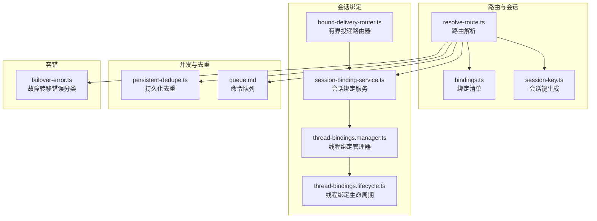
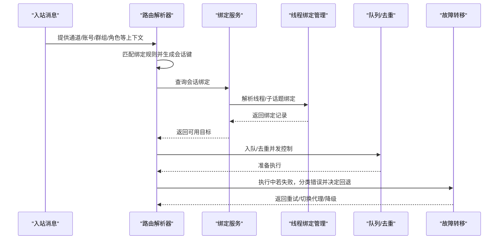
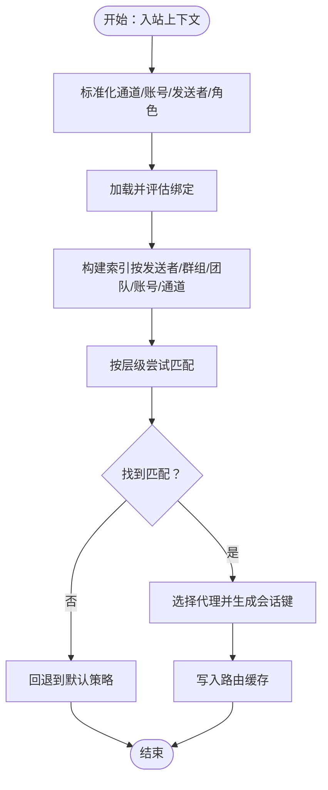
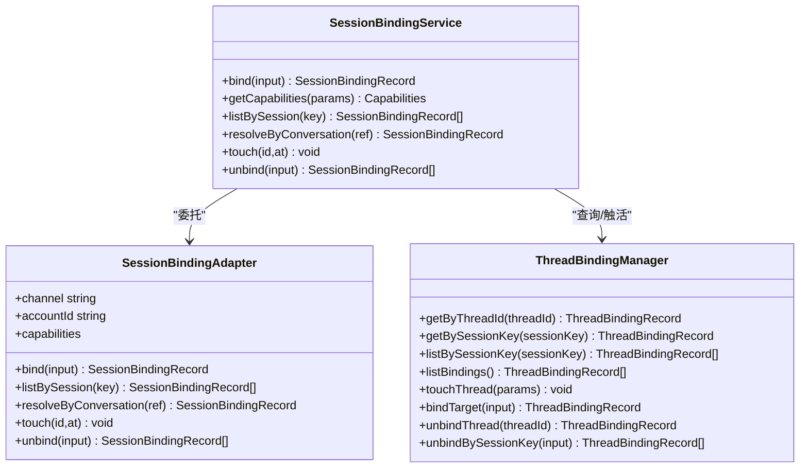
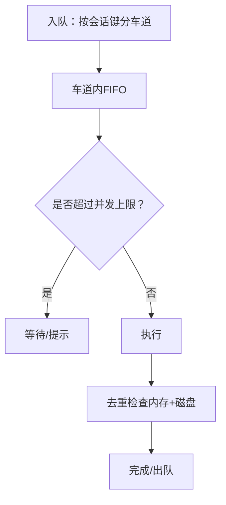
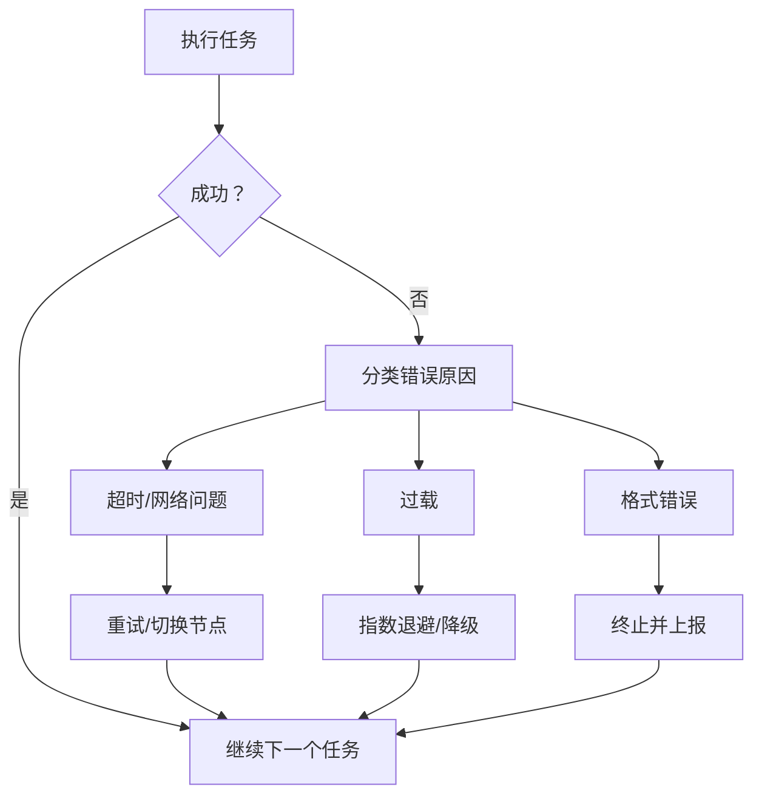
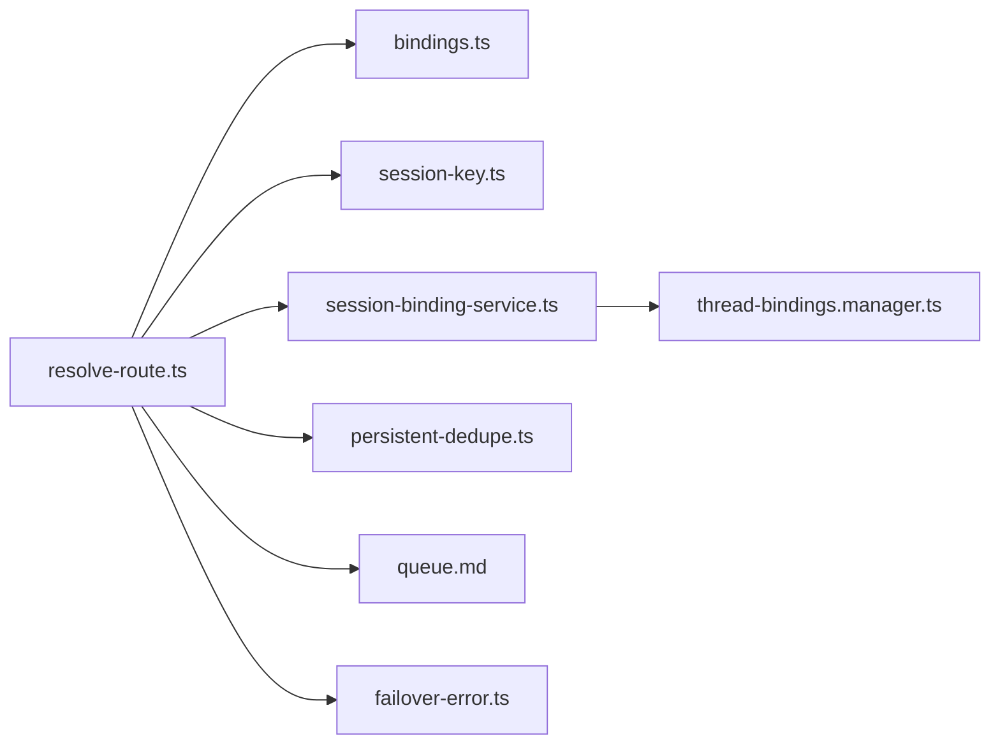

# 消息路由

<cite>
**本文引用的文件**
- [bound-delivery-router.ts](file://src/infra/outbound/bound-delivery-router.ts)
- [session-binding-service.ts](file://src/infra/outbound/session-binding-service.ts)
- [thread-bindings.manager.ts](file://src/discord/monitor/thread-bindings.manager.ts)
- [thread-bindings.lifecycle.ts](file://src/discord/monitor/thread-bindings.lifecycle.ts)
- [resolve-route.ts](file://src/routing/resolve-route.ts)
- [bindings.ts](file://src/routing/bindings.ts)
- [session-key.ts](file://src/routing/session-key.ts)
- [persistent-dedupe.ts](file://src/plugin-sdk/persistent-dedupe.ts)
- [failover-error.ts](file://src/agents/failover-error.ts)
- [queue.md](file://docs/concepts/queue.md)
- [session.md](file://docs/concepts/session.md)
</cite>

## 目录

1. [简介](#简介)
2. [项目结构](#项目结构)
3. [核心组件](#核心组件)
4. [架构总览](#架构总览)
5. [详细组件分析](#详细组件分析)
6. [依赖关系分析](#依赖关系分析)
7. [性能考量](#性能考量)
8. [故障排查指南](#故障排查指南)
9. [结论](#结论)
10. [附录](#附录)

## 简介

本文件系统性阐述 OpenClaw 的消息路由机制，覆盖以下关键主题：

- 消息在通道系统中的流转与路由决策
- 会话封装、线程绑定、去重策略与优先级处理
- 路由算法、负载均衡与故障转移机制
- 路由配置示例与性能优化建议

目标是帮助读者从概念到实现逐层理解，既适合初学者快速上手，也便于资深工程师进行深度调优。

## 项目结构

围绕“消息路由”的核心代码主要分布在以下模块：

- 路由解析：resolve-route.ts、bindings.ts、session-key.ts
- 会话绑定与目的地选择：bound-delivery-router.ts、session-binding-service.ts、thread-bindings.manager.ts、thread-bindings.lifecycle.ts
- 去重与队列：persistent-dedupe.ts、queue.md
- 故障转移：failover-error.ts
- 会话管理与生命周期：session.md

**图表来源**

- [resolve-route.ts:614-800](file://src/routing/resolve-route.ts#L614-L800)
- [bindings.ts:17-19](file://src/routing/bindings.ts#L17-L19)
- [session-key.ts:118-174](file://src/routing/session-key.ts#L118-L174)
- [bound-delivery-router.ts:55-91](file://src/infra/outbound/bound-delivery-router.ts#L55-L91)
- [session-binding-service.ts:198-310](file://src/infra/outbound/session-binding-service.ts#L198-L310)
- [thread-bindings.manager.ts:198-658](file://src/discord/monitor/thread-bindings.manager.ts#L198-L658)
- [thread-bindings.lifecycle.ts:240-275](file://src/discord/monitor/thread-bindings.lifecycle.ts#L240-L275)
- [persistent-dedupe.ts:94-111](file://src/plugin-sdk/persistent-dedupe.ts#L94-L111)
- [queue.md:1-90](file://docs/concepts/queue.md#L1-L90)
- [failover-error.ts:151-240](file://src/agents/failover-error.ts#L151-L240)

**章节来源**

- [resolve-route.ts:614-800](file://src/routing/resolve-route.ts#L614-L800)
- [bindings.ts:17-19](file://src/routing/bindings.ts#L17-L19)
- [session-key.ts:118-174](file://src/routing/session-key.ts#L118-L174)
- [bound-delivery-router.ts:55-91](file://src/infra/outbound/bound-delivery-router.ts#L55-L91)
- [session-binding-service.ts:198-310](file://src/infra/outbound/session-binding-service.ts#L198-L310)
- [thread-bindings.manager.ts:198-658](file://src/discord/monitor/thread-bindings.manager.ts#L198-L658)
- [thread-bindings.lifecycle.ts:240-275](file://src/discord/monitor/thread-bindings.lifecycle.ts#L240-L275)
- [persistent-dedupe.ts:94-111](file://src/plugin-sdk/persistent-dedupe.ts#L94-L111)
- [queue.md:1-90](file://docs/concepts/queue.md#L1-L90)
- [failover-error.ts:151-240](file://src/agents/failover-error.ts#L151-L240)

## 核心组件

- 路由解析器（resolve-route.ts）：根据通道、账号、群组/频道、角色等维度匹配绑定规则，生成会话键与目标代理。
- 绑定清单（bindings.ts）：提供绑定列表与账户映射，辅助路由解析。
- 会话键生成（session-key.ts）：规范化的会话键构建，支持主会话、按发送者隔离、按账号+通道+发送者隔离等模式。
- 会话绑定服务（session-binding-service.ts）：统一适配不同通道的会话绑定能力，提供绑定、查询、触活、解绑等操作。
- 有界投递路由器（bound-delivery-router.ts）：基于会话绑定记录，为事件（如任务完成）选择具体对话目标，支持“有界”和“回退”两种模式。
- 线程绑定管理（thread-bindings.\*）：Discord 等平台的线程/子话题绑定管理，含生命周期与持久化。
- 去重与队列（persistent-dedupe.ts、queue.md）：防止重复处理与控制并发，保障用户体验与资源安全。
- 故障转移（failover-error.ts）：将错误归类为超时、过载、格式错误等，驱动路由或执行层面的故障转移。

**章节来源**

- [resolve-route.ts:614-800](file://src/routing/resolve-route.ts#L614-L800)
- [bindings.ts:17-19](file://src/routing/bindings.ts#L17-L19)
- [session-key.ts:118-174](file://src/routing/session-key.ts#L118-L174)
- [session-binding-service.ts:198-310](file://src/infra/outbound/session-binding-service.ts#L198-L310)
- [bound-delivery-router.ts:55-91](file://src/infra/outbound/bound-delivery-router.ts#L55-L91)
- [thread-bindings.manager.ts:198-658](file://src/discord/monitor/thread-bindings.manager.ts#L198-L658)
- [thread-bindings.lifecycle.ts:240-275](file://src/discord/monitor/thread-bindings.lifecycle.ts#L240-L275)
- [persistent-dedupe.ts:94-111](file://src/plugin-sdk/persistent-dedupe.ts#L94-L111)
- [queue.md:1-90](file://docs/concepts/queue.md#L1-L90)
- [failover-error.ts:151-240](file://src/agents/failover-error.ts#L151-L240)

## 架构总览

消息从通道进入后，经过以下路径：

1. 入站上下文标准化（通道、账号、群组/频道、发送者、角色等）
2. 路由解析：匹配绑定规则，生成会话键与目标代理
3. 会话绑定：若存在绑定，选择具体对话目标；否则回退到默认策略
4. 并发与去重：通过队列与去重避免冲突与抖动
5. 执行与容错：根据错误类型触发故障转移或重试

**图表来源**

- [resolve-route.ts:614-800](file://src/routing/resolve-route.ts#L614-L800)
- [session-binding-service.ts:262-308](file://src/infra/outbound/session-binding-service.ts#L262-L308)
- [thread-bindings.manager.ts:216-228](file://src/discord/monitor/thread-bindings.manager.ts#L216-L228)
- [persistent-dedupe.ts:94-111](file://src/plugin-sdk/persistent-dedupe.ts#L94-L111)
- [failover-error.ts:151-240](file://src/agents/failover-error.ts#L151-L240)

## 详细组件分析

### 路由解析与会话封装

- 路由解析流程
  - 输入包含通道、账号、发送者、父级发送者（用于线程继承）、群组/团队、角色等
  - 通过多层级匹配（直接发送者、父级发送者、群组+角色、群组、团队、账号、通道）确定绑定
  - 选择第一个满足条件的绑定，生成会话键与主会话键，并决定“最后路由更新”策略
- 会话键生成
  - 支持多种 DM 隔离策略：主会话、按发送者、按通道+发送者、按账号+通道+发送者
  - 支持身份链接合并同一人的跨渠道会话
  - 群组/频道会话独立键空间
- 缓存与性能
  - 对绑定评估结果与路由结果做缓存，限制最大键数，避免内存膨胀

**图表来源**

- [resolve-route.ts:614-800](file://src/routing/resolve-route.ts#L614-L800)
- [bindings.ts:17-19](file://src/routing/bindings.ts#L17-L19)
- [session-key.ts:118-174](file://src/routing/session-key.ts#L118-L174)

**章节来源**

- [resolve-route.ts:614-800](file://src/routing/resolve-route.ts#L614-L800)
- [bindings.ts:17-19](file://src/routing/bindings.ts#L17-L19)
- [session-key.ts:118-174](file://src/routing/session-key.ts#L118-L174)

### 会话绑定与线程绑定

- 会话绑定服务
  - 统一注册适配器（通道+账号），提供 bind/listBySession/resolveByConversation/touch/unbind
  - 支持能力探测与放置策略（当前/子会话）
  - 去重返回绑定记录，避免重复
- 有界投递路由器
  - 基于目标会话键列出活动绑定
  - 若存在请求者，按通道+账号+会话精确匹配；否则在多绑定场景下回退
  - 支持 failClosed 行为，避免歧义时拒绝投递
- 线程绑定管理
  - 提供按线程 ID、会话键查询绑定
  - 触活线程、解绑、按会话键批量解绑
  - 生命周期包含空闲超时、最大存活时间、持久化

**图表来源**

- [session-binding-service.ts:70-94](file://src/infra/outbound/session-binding-service.ts#L70-L94)
- [session-binding-service.ts:198-310](file://src/infra/outbound/session-binding-service.ts#L198-L310)
- [thread-bindings.manager.ts:198-658](file://src/discord/monitor/thread-bindings.manager.ts#L198-L658)

**章节来源**

- [session-binding-service.ts:198-310](file://src/infra/outbound/session-binding-service.ts#L198-L310)
- [bound-delivery-router.ts:55-91](file://src/infra/outbound/bound-delivery-router.ts#L55-L91)
- [thread-bindings.manager.ts:198-658](file://src/discord/monitor/thread-bindings.manager.ts#L198-L658)
- [thread-bindings.lifecycle.ts:240-275](file://src/discord/monitor/thread-bindings.lifecycle.ts#L240-L275)

### 去重策略与优先级处理

- 持久化去重
  - 内存缓存 + 文件持久化，支持 TTL 与最大条目限制
  - 防止重复处理，同时跨进程/重启恢复状态
- 队列与优先级
  - 按会话键分车道（lane）排队，保证单会话串行
  - 全局主车道并发受控，默认 4；子代理车道更高
  - 支持 steer/followup/collect/steer-backlog/interrupt 等模式与溢出丢弃策略（旧消息、新消息、摘要）

**图表来源**

- [persistent-dedupe.ts:94-111](file://src/plugin-sdk/persistent-dedupe.ts#L94-L111)
- [queue.md:17-40](file://docs/concepts/queue.md#L17-L40)

**章节来源**

- [persistent-dedupe.ts:94-111](file://src/plugin-sdk/persistent-dedupe.ts#L94-L111)
- [queue.md:17-40](file://docs/concepts/queue.md#L17-L40)

### 负载均衡与故障转移

- 负载均衡
  - 多车道并发：主车道与子代理车道并行，避免阻塞
  - 会话键粒度的串行化，确保一致性
- 故障转移
  - 将 HTTP 状态码与错误代码映射为超时、过载、格式错误等原因
  - 根据原因决定重试、切换代理或降级

**图表来源**

- [failover-error.ts:151-240](file://src/agents/failover-error.ts#L151-L240)
- [queue.md:17-40](file://docs/concepts/queue.md#L17-L40)

**章节来源**

- [failover-error.ts:151-240](file://src/agents/failover-error.ts#L151-L240)
- [queue.md:17-40](file://docs/concepts/queue.md#L17-L40)

## 依赖关系分析

- 路由解析依赖绑定清单与会话键生成
- 会话绑定服务依赖适配器与线程绑定管理
- 去重与队列贯穿执行链路，保障一致性与性能
- 故障转移贯穿执行链路，作为兜底策略

**图表来源**

- [resolve-route.ts:614-800](file://src/routing/resolve-route.ts#L614-L800)
- [bindings.ts:17-19](file://src/routing/bindings.ts#L17-L19)
- [session-key.ts:118-174](file://src/routing/session-key.ts#L118-L174)
- [session-binding-service.ts:198-310](file://src/infra/outbound/session-binding-service.ts#L198-L310)
- [thread-bindings.manager.ts:198-658](file://src/discord/monitor/thread-bindings.manager.ts#L198-L658)
- [persistent-dedupe.ts:94-111](file://src/plugin-sdk/persistent-dedupe.ts#L94-L111)
- [queue.md:1-90](file://docs/concepts/queue.md#L1-L90)
- [failover-error.ts:151-240](file://src/agents/failover-error.ts#L151-L240)

**章节来源**

- [resolve-route.ts:614-800](file://src/routing/resolve-route.ts#L614-L800)
- [bindings.ts:17-19](file://src/routing/bindings.ts#L17-L19)
- [session-key.ts:118-174](file://src/routing/session-key.ts#L118-L174)
- [session-binding-service.ts:198-310](file://src/infra/outbound/session-binding-service.ts#L198-L310)
- [thread-bindings.manager.ts:198-658](file://src/discord/monitor/thread-bindings.manager.ts#L198-L658)
- [persistent-dedupe.ts:94-111](file://src/plugin-sdk/persistent-dedupe.ts#L94-L111)
- [queue.md:1-90](file://docs/concepts/queue.md#L1-L90)
- [failover-error.ts:151-240](file://src/agents/failover-error.ts#L151-L240)

## 性能考量

- 路由缓存
  - 绑定评估与路由结果缓存，限制最大键数，避免内存膨胀
- 会话存储维护
  - 合理设置清理窗口与条目上限，避免大存储带来的写放大
- 并发与队列
  - 主车道并发与子代理车道并发需结合业务量调优
  - 队列模式选择影响响应体验与吞吐，建议按场景配置
- 去重与持久化
  - TTL 与文件最大条目合理配置，兼顾命中率与磁盘占用

**章节来源**

- [resolve-route.ts:202-212](file://src/routing/resolve-route.ts#L202-L212)
- [session.md:78-120](file://docs/concepts/session.md#L78-L120)
- [queue.md:41-76](file://docs/concepts/queue.md#L41-L76)
- [persistent-dedupe.ts:94-111](file://src/plugin-sdk/persistent-dedupe.ts#L94-L111)

## 故障排查指南

- 路由不生效
  - 检查绑定是否正确、账号/通道/群组/角色是否匹配
  - 查看路由日志与缓存键
- 投递失败或歧义
  - 有界投递在多绑定且无请求者时会回退，可启用 failClosed 严格模式
- 会话错乱
  - 检查 DM 隔离策略与身份链接配置
- 并发冲突
  - 关注队列等待时间与模式配置，必要时调整车道并发
- 错误分类不清
  - 使用错误分类工具定位超时/过载/格式错误等

**章节来源**

- [bound-delivery-router.ts:55-91](file://src/infra/outbound/bound-delivery-router.ts#L55-L91)
- [resolve-route.ts:614-800](file://src/routing/resolve-route.ts#L614-L800)
- [session.md:12-55](file://docs/concepts/session.md#L12-L55)
- [queue.md:17-40](file://docs/concepts/queue.md#L17-L40)
- [failover-error.ts:151-240](file://src/agents/failover-error.ts#L151-L240)

## 结论

OpenClaw 的消息路由以“绑定规则 + 会话键 + 并发控制 + 去重 + 容错”为核心，形成高可靠、可扩展、可运维的通道系统。通过合理的配置与调优，可在复杂多通道环境中保持一致的用户体验与稳定的吞吐表现。

## 附录

### 路由配置示例（要点）

- 绑定规则：按通道/账号/群组/角色/团队匹配，支持通配与优先级
- 会话键：按 DM 隔离策略生成，支持身份链接合并
- 队列：按会话键分车道，全局主车道并发可控
- 去重：内存+磁盘双层去重，支持 TTL 与最大条目

**章节来源**

- [bindings.ts:17-19](file://src/routing/bindings.ts#L17-L19)
- [session-key.ts:118-174](file://src/routing/session-key.ts#L118-L174)
- [queue.md:41-76](file://docs/concepts/queue.md#L41-L76)
- [persistent-dedupe.ts:94-111](file://src/plugin-sdk/persistent-dedupe.ts#L94-L111)
