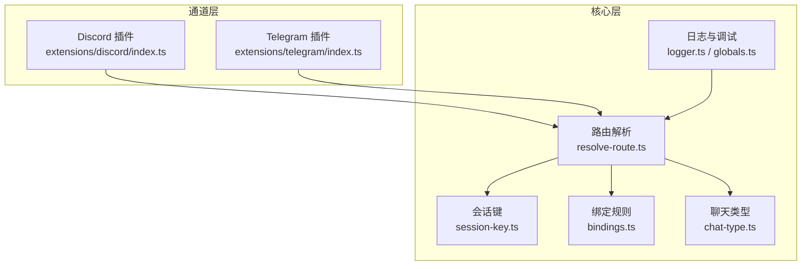
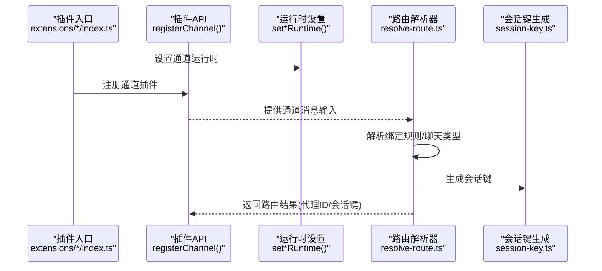
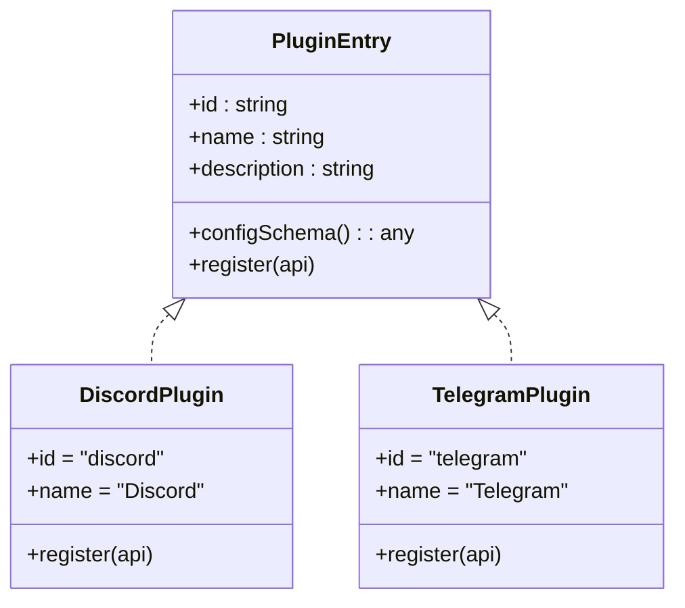
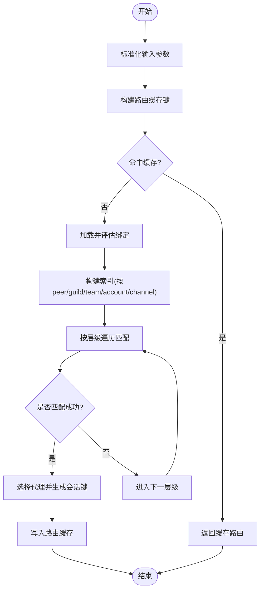
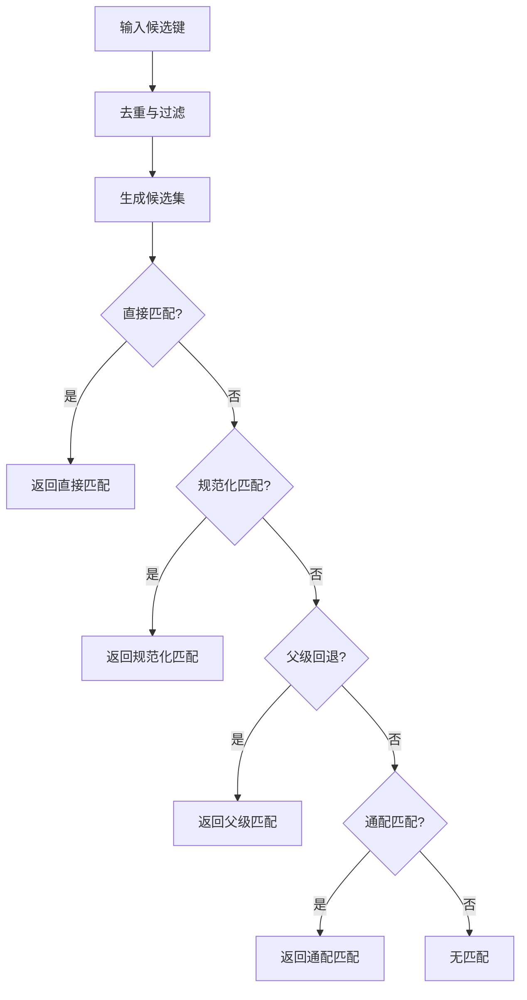
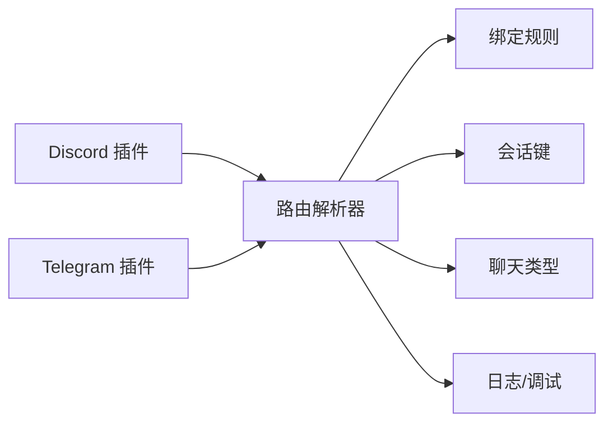

# 消息通道系统

<cite>
**本文引用的文件**
- [extensions/discord/index.ts](file://extensions/discord/index.ts)
- [extensions/telegram/index.ts](file://extensions/telegram/index.ts)
- [src/channels/channel-config.ts](file://src/channels/channel-config.ts)
- [src/routing/resolve-route.ts](file://src/routing/resolve-route.ts)
- [src/channels/chat-type.ts](file://src/channels/chat-type.ts)
- [src/routing/session-key.ts](file://src/routing/session-key.ts)
- [src/routing/bindings.ts](file://src/routing/bindings.ts)
- [src/agents/agent-scope.ts](file://src/agents/agent-scope.ts)
- [src/globals.ts](file://src/globals.ts)
- [src/logger.ts](file://src/logger.ts)
- [docs/channels/index.md](file://docs/channels/index.md)
- [docs/channels/channel-routing.md](file://docs/channels/channel-routing.md)
- [docs/gateway/configuration.md](file://docs/gateway/configuration.md)
- [docs/gateway/configuration-reference.md](file://docs/gateway/configuration-reference.md)
- [docs/cli/channels.md](file://docs/cli/channels.md)
- [docs/concepts/messages.md](file://docs/concepts/messages.md)
- [docs/concepts/retry.md](file://docs/concepts/retry.md)
- [docs/concepts/queue.md](file://docs/concepts/queue.md)
- [docs/design/kilo-gateway-integration.md](file://docs/design/kilo-gateway-integration.md)
- [docs/refactor/strict-config.md](file://docs/refactor/strict-config.md)
- [docs/install/docker.md](file://docs/install/docker.md)
- [docs/platforms/index.md](file://docs/platforms/index.md)
- [docs/providers/index.md](file://docs/providers/index.md)
- [docs/tools/index.md](file://docs/tools/index.md)
- [docs/plugins/manifest.md](file://docs/plugins/manifest.md)
- [docs/plugins/community.md](file://docs/plugins/community.md)
- [docs/help/troubleshooting.md](file://docs/help/troubleshooting.md)
- [docs/gateway/troubleshooting.md](file://docs/gateway/troubleshooting.md)
- [docs/channels/troubleshooting.md](file://docs/channels/troubleshooting.md)
</cite>

## 目录

1. [简介](#简介)
2. [项目结构](#项目结构)
3. [核心组件](#核心组件)
4. [架构总览](#架构总览)
5. [详细组件分析](#详细组件分析)
6. [依赖关系分析](#依赖关系分析)
7. [性能考量](#性能考量)
8. [故障排查指南](#故障排查指南)
9. [结论](#结论)
10. [附录](#附录)

## 简介

本文件为“消息通道系统”的综合技术文档，面向开发者与运维人员，系统阐述通道适配器架构、消息路由机制、跨平台集成方式与配置要点，并提供自定义通道开发指南、性能优化建议与扩展性设计思路。文档基于仓库中已实现的插件化通道（如 Discord、Telegram）与核心路由、会话键、绑定规则等模块进行深入解析，帮助读者快速理解如何在该系统上接入新的消息平台。

## 项目结构

消息通道系统采用“核心引擎 + 插件通道”的分层架构：

- 核心层：路由解析、会话键生成、绑定匹配、聊天类型规范、全局日志与调试开关等。
- 通道层：以插件形式接入不同消息平台（Discord、Telegram、Slack、Matrix、Mattermost、Teams、Feishu、Signal、IRC、Line、Nostr、Twitch、WhatsApp、Zalo、BlueBubbles、Google Chat 等），每个通道通过统一的插件注册接口向系统注入运行时与通道能力。
- 文档与工具：提供通道配置参考、CLI 使用说明、网关配置与安全策略、安装与部署指南、故障排查手册等。

图表来源

- [src/routing/resolve-route.ts:1-805](file://src/routing/resolve-route.ts#L1-L805)
- [src/routing/session-key.ts](file://src/routing/session-key.ts)
- [src/routing/bindings.ts](file://src/routing/bindings.ts)
- [src/channels/chat-type.ts](file://src/channels/chat-type.ts)
- [src/logger.ts](file://src/logger.ts)
- [src/globals.ts](file://src/globals.ts)
- [extensions/discord/index.ts:1-20](file://extensions/discord/index.ts#L1-L20)
- [extensions/telegram/index.ts:1-18](file://extensions/telegram/index.ts#L1-L18)

章节来源

- [extensions/discord/index.ts:1-20](file://extensions/discord/index.ts#L1-L20)
- [extensions/telegram/index.ts:1-18](file://extensions/telegram/index.ts#L1-L18)
- [src/routing/resolve-route.ts:1-805](file://src/routing/resolve-route.ts#L1-L805)
- [src/routing/session-key.ts](file://src/routing/session-key.ts)
- [src/routing/bindings.ts](file://src/routing/bindings.ts)
- [src/channels/chat-type.ts](file://src/channels/chat-type.ts)
- [src/logger.ts](file://src/logger.ts)
- [src/globals.ts](file://src/globals.ts)

## 核心组件

- 路由解析器：根据通道、账户、聊天对象、服务器/团队、角色等维度匹配绑定规则，选择代理并生成会话键，支持缓存与调试日志。
- 会话键生成器：按代理、通道、账户、聊天对象、DM 范围等维度构建稳定且可持久化的会话键，用于并发控制与状态管理。
- 绑定规则：定义“通道 + 账户”维度的匹配与优先级，支持通配与继承（线程父级回退）。
- 聊天类型：统一规范 direct/group/channel 等聊天类型，便于跨平台一致性处理。
- 通道配置工具：提供键规范化、通配匹配、父级回退、允许列表决策等通用逻辑，支撑多平台通道的匹配与决策。

章节来源

- [src/routing/resolve-route.ts:1-805](file://src/routing/resolve-route.ts#L1-L805)
- [src/routing/session-key.ts](file://src/routing/session-key.ts)
- [src/routing/bindings.ts](file://src/routing/bindings.ts)
- [src/channels/chat-type.ts](file://src/channels/chat-type.ts)
- [src/channels/channel-config.ts:1-183](file://src/channels/channel-config.ts#L1-L183)

## 架构总览

下图展示从“通道插件注册”到“消息路由与会话”的端到端流程，体现插件式通道与核心路由的协作关系。

图表来源

- [extensions/discord/index.ts:1-20](file://extensions/discord/index.ts#L1-L20)
- [extensions/telegram/index.ts:1-18](file://extensions/telegram/index.ts#L1-L18)
- [src/routing/resolve-route.ts:1-805](file://src/routing/resolve-route.ts#L1-L805)
- [src/routing/session-key.ts](file://src/routing/session-key.ts)

## 详细组件分析

### 组件A：通道适配器架构（以 Discord 与 Telegram 为例）

- 插件注册：每个通道通过统一入口导出插件对象，声明 id、名称、描述、配置模式，并在注册回调中设置运行时与注册通道。
- 运行时注入：通道运行时负责消息拉取、事件处理、发送等底层细节，对核心路由透明。
- 通道注册：通过插件 API 将通道能力注入系统，供路由与会话模块使用。

图表来源

- [extensions/discord/index.ts:1-20](file://extensions/discord/index.ts#L1-L20)
- [extensions/telegram/index.ts:1-18](file://extensions/telegram/index.ts#L1-L18)

章节来源

- [extensions/discord/index.ts:1-20](file://extensions/discord/index.ts#L1-L20)
- [extensions/telegram/index.ts:1-18](file://extensions/telegram/index.ts#L1-L18)

### 组件B：消息路由机制

- 输入参数：通道名、账户 ID、聊天对象（含类型与 ID）、服务器/团队信息、成员角色 ID 列表、线程父级聊天对象等。
- 匹配层级：按“直接匹配 -> 线程父级回退 -> 服务器+角色 -> 服务器 -> 团队 -> 账户 -> 通道”顺序尝试，命中即返回。
- 会话键：结合代理 ID、通道、账户、聊天对象与 DM 范围生成稳定键；同时计算主会话键用于直聊合并策略。
- 缓存策略：对绑定评估、索引与路由结果进行弱引用缓存，限制最大键数，避免内存膨胀。
- 调试日志：在启用详细日志时输出绑定候选与匹配过程，便于定位问题。

图表来源

- [src/routing/resolve-route.ts:614-805](file://src/routing/resolve-route.ts#L614-L805)

章节来源

- [src/routing/resolve-route.ts:1-805](file://src/routing/resolve-route.ts#L1-L805)
- [src/routing/session-key.ts](file://src/routing/session-key.ts)
- [src/routing/bindings.ts](file://src/routing/bindings.ts)
- [src/channels/chat-type.ts](file://src/channels/chat-type.ts)
- [src/globals.ts](file://src/globals.ts)
- [src/logger.ts](file://src/logger.ts)

### 组件C：通道配置与匹配工具

- 键规范化：去除前后空格、转小写、移除前缀 #、替换非字母数字字符为连字符等，确保键的一致性。
- 候选键生成：支持多候选键集合去重与顺序保留。
- 匹配策略：优先直接匹配，其次规范化后匹配，再其次父级回退匹配，最后通配匹配。
- 允许列表嵌套决策：外层未配置则默认允许；外层匹配但内层未配置则默认允许；内外均配置则以内层为准。

图表来源

- [src/channels/channel-config.ts:60-164](file://src/channels/channel-config.ts#L60-L164)

章节来源

- [src/channels/channel-config.ts:1-183](file://src/channels/channel-config.ts#L1-L183)

### 组件D：聊天类型与会话键

- 聊天类型：统一规范 direct/group/channel，支持同组/频道互换匹配，保证跨平台一致性。
- 会话键：组合代理、通道、账户、聊天对象、DM 范围与身份链接，生成稳定键；主会话键用于直聊合并策略。

章节来源

- [src/channels/chat-type.ts](file://src/channels/chat-type.ts)
- [src/routing/session-key.ts](file://src/routing/session-key.ts)

## 依赖关系分析

- 通道插件依赖核心路由模块提供的聊天类型、绑定规则与会话键生成能力。
- 路由解析器依赖全局日志与调试开关，按需输出详细匹配过程。
- 绑定规则与会话键生成相互配合，形成稳定的路由与状态管理闭环。

图表来源

- [extensions/discord/index.ts:1-20](file://extensions/discord/index.ts#L1-L20)
- [extensions/telegram/index.ts:1-18](file://extensions/telegram/index.ts#L1-L18)
- [src/routing/resolve-route.ts:1-805](file://src/routing/resolve-route.ts#L1-L805)
- [src/routing/session-key.ts](file://src/routing/session-key.ts)
- [src/routing/bindings.ts](file://src/routing/bindings.ts)
- [src/channels/chat-type.ts](file://src/channels/chat-type.ts)
- [src/logger.ts](file://src/logger.ts)
- [src/globals.ts](file://src/globals.ts)

章节来源

- [extensions/discord/index.ts:1-20](file://extensions/discord/index.ts#L1-L20)
- [extensions/telegram/index.ts:1-18](file://extensions/telegram/index.ts#L1-L18)
- [src/routing/resolve-route.ts:1-805](file://src/routing/resolve-route.ts#L1-L805)
- [src/routing/session-key.ts](file://src/routing/session-key.ts)
- [src/routing/bindings.ts](file://src/routing/bindings.ts)
- [src/channels/chat-type.ts](file://src/channels/chat-type.ts)
- [src/logger.ts](file://src/logger.ts)
- [src/globals.ts](file://src/globals.ts)

## 性能考量

- 路由缓存：对绑定评估、索引与路由结果进行弱引用缓存，限制最大键数，避免内存膨胀；仅在非详细日志与无身份链接场景启用缓存。
- 绑定索引：按 peer/guild/team/account/channel 构建索引，减少每次匹配的扫描范围。
- 会话键稳定性：通过标准化键值与稳定组合策略，降低重复计算与冲突概率。
- 并发控制：会话键用于并发控制与状态持久化，避免竞态与重复处理。

章节来源

- [src/routing/resolve-route.ts:200-212](file://src/routing/resolve-route.ts#L200-L212)
- [src/routing/resolve-route.ts:413-471](file://src/routing/resolve-route.ts#L413-L471)
- [src/routing/resolve-route.ts:508-526](file://src/routing/resolve-route.ts#L508-L526)

## 故障排查指南

- 路由不生效或匹配异常
  - 检查绑定规则是否正确配置，确认通道与账户维度是否匹配。
  - 启用详细日志观察绑定候选与匹配过程。
  - 参考通道路由文档与 CLI 通道命令，核对输入参数与期望行为。
- 会话键异常或并发冲突
  - 核对会话键生成参数（代理、通道、账户、聊天对象、DM 范围）是否符合预期。
  - 检查直聊合并策略与主会话键计算。
- 通道插件无法注册或运行时缺失
  - 确认插件入口导出的插件对象与注册回调是否正确。
  - 检查运行时设置是否在注册阶段完成。
- 常见问题与参考
  - 通道故障排查手册、网关故障排查手册与通用故障排查文档提供了针对性指导。

章节来源

- [src/routing/resolve-route.ts:706-715](file://src/routing/resolve-route.ts#L706-L715)
- [src/globals.ts](file://src/globals.ts)
- [src/logger.ts](file://src/logger.ts)
- [docs/channels/troubleshooting.md](file://docs/channels/troubleshooting.md)
- [docs/gateway/troubleshooting.md](file://docs/gateway/troubleshooting.md)
- [docs/help/troubleshooting.md](file://docs/help/troubleshooting.md)

## 结论

该消息通道系统通过“插件化通道 + 核心路由”的架构实现了高扩展性与跨平台一致性。通道插件以最小接口接入系统，核心路由提供强大的绑定匹配、会话键与缓存机制，保障了在多平台、多账户、多聊天对象场景下的稳定运行。结合本文的配置与开发指南，用户可以快速完成新平台接入与定制化扩展。

## 附录

### 支持的消息平台概览

- 已实现/可参考的通道插件：Discord、Telegram、Slack、Matrix、Mattermost、Teams、Feishu、Signal、IRC、Line、Nostr、Twitch、WhatsApp、Zalo、BlueBubbles、Google Chat 等。
- 通道文档目录提供了各平台的配置示例、认证流程与常见问题说明。

章节来源

- [docs/channels/index.md](file://docs/channels/index.md)
- [docs/channels/channel-routing.md](file://docs/channels/channel-routing.md)

### 通道配置示例与消息格式

- 通道配置参考与示例：提供典型通道的配置片段与字段说明，便于快速上手。
- 消息格式与处理：概念文档说明消息结构、格式转换与处理流程，确保跨平台一致性。

章节来源

- [docs/gateway/configuration.md](file://docs/gateway/configuration.md)
- [docs/gateway/configuration-reference.md](file://docs/gateway/configuration-reference.md)
- [docs/concepts/messages.md](file://docs/concepts/messages.md)

### 自定义通道开发指南

- 插件接口与注册：遵循插件入口导出规范，提供 id、名称、描述、配置模式与注册回调。
- 运行时设置：在注册回调中设置通道运行时，确保消息拉取与发送能力可用。
- 集成测试：利用测试工具与插件运行时模拟环境，验证通道功能。
- 部署与发布：参考插件清单与社区发布流程，完成打包与分发。

章节来源

- [extensions/discord/index.ts:1-20](file://extensions/discord/index.ts#L1-L20)
- [extensions/telegram/index.ts:1-18](file://extensions/telegram/index.ts#L1-L18)
- [docs/plugins/manifest.md](file://docs/plugins/manifest.md)
- [docs/plugins/community.md](file://docs/plugins/community.md)
- [docs/refactor/strict-config.md](file://docs/refactor/strict-config.md)

### 安装、部署与运行

- 安装与升级：提供 Docker、平台安装与迁移指南，确保环境一致性。
- 网关与安全：包含网关配置、健康检查、心跳与安全策略说明。
- 平台与提供商：覆盖多平台部署与模型提供商对接要点。

章节来源

- [docs/install/docker.md](file://docs/install/docker.md)
- [docs/platforms/index.md](file://docs/platforms/index.md)
- [docs/providers/index.md](file://docs/providers/index.md)
- [docs/gateway/configuration.md](file://docs/gateway/configuration.md)
- [docs/gateway/security/authentication.md](file://docs/gateway/security/authentication.md)

### 错误处理与重试策略

- 重试与队列：概念文档说明重试机制与消息队列策略，提升系统鲁棒性。
- CLI 与工具：提供 CLI 通道命令与工具使用说明，辅助日常运维与排障。

章节来源

- [docs/concepts/retry.md](file://docs/concepts/retry.md)
- [docs/concepts/queue.md](file://docs/concepts/queue.md)
- [docs/cli/channels.md](file://docs/cli/channels.md)
- [docs/tools/index.md](file://docs/tools/index.md)
