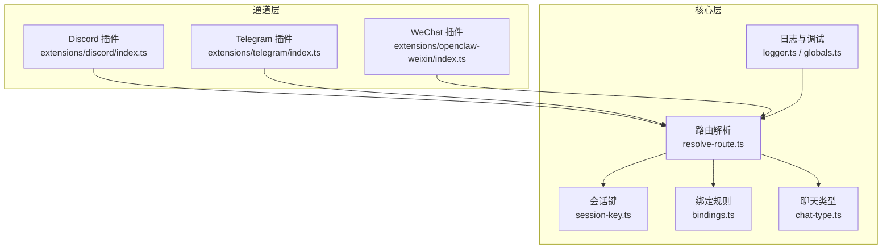
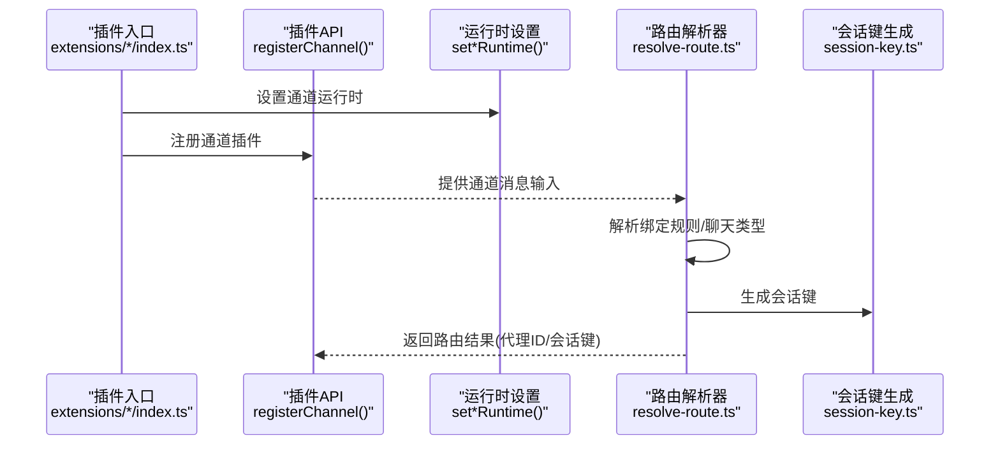
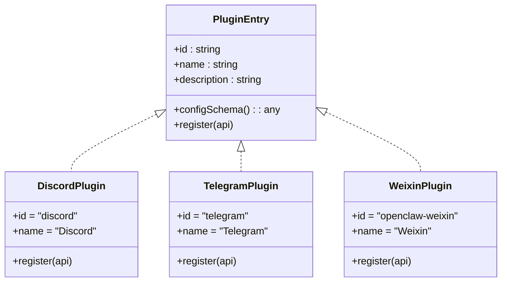
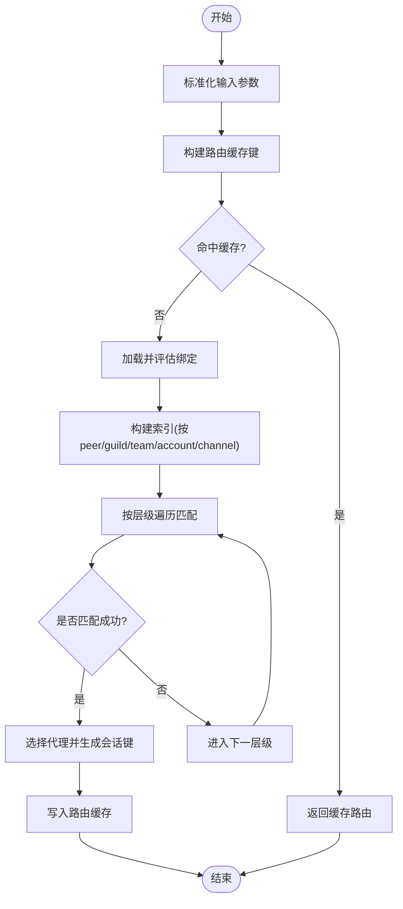
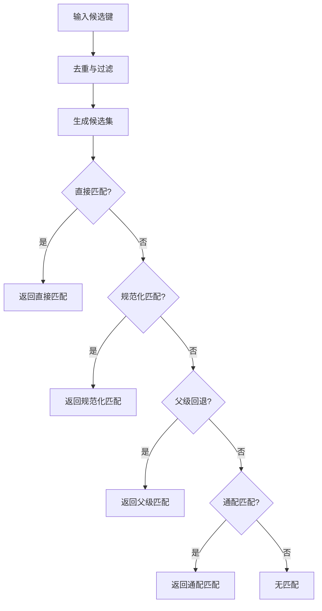
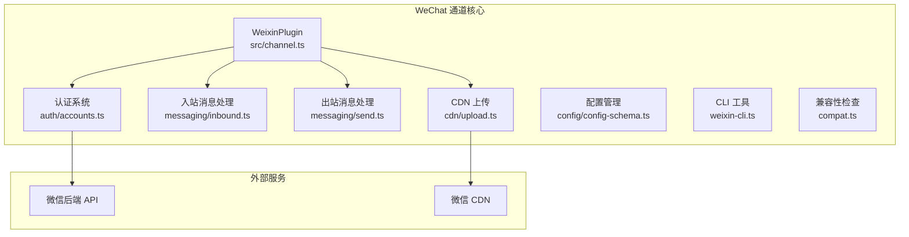
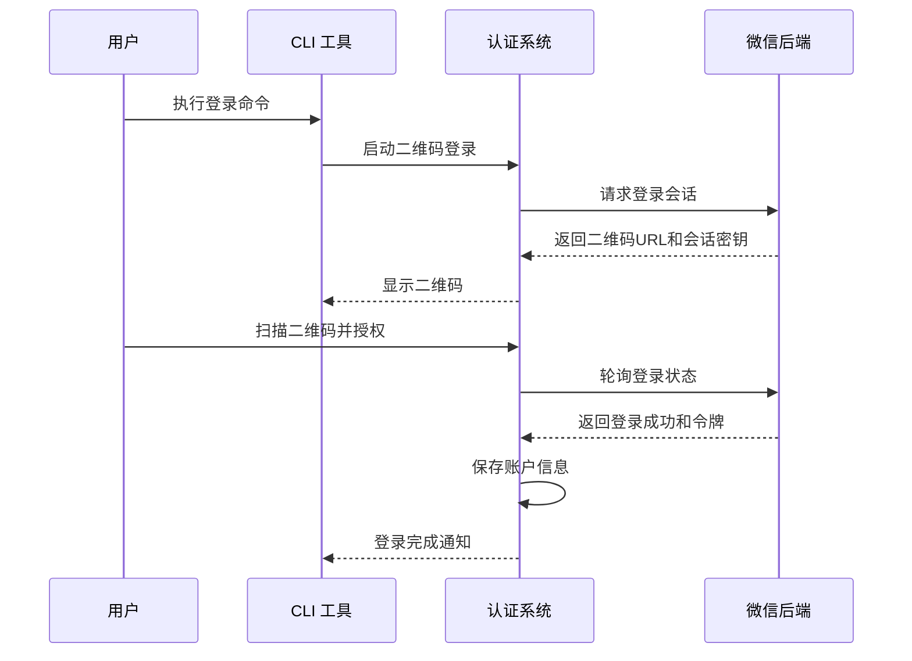
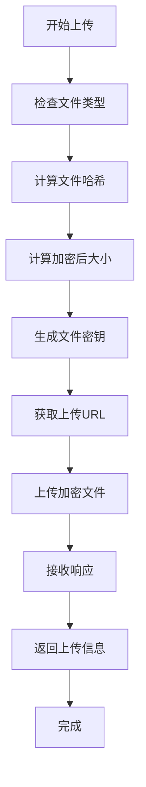
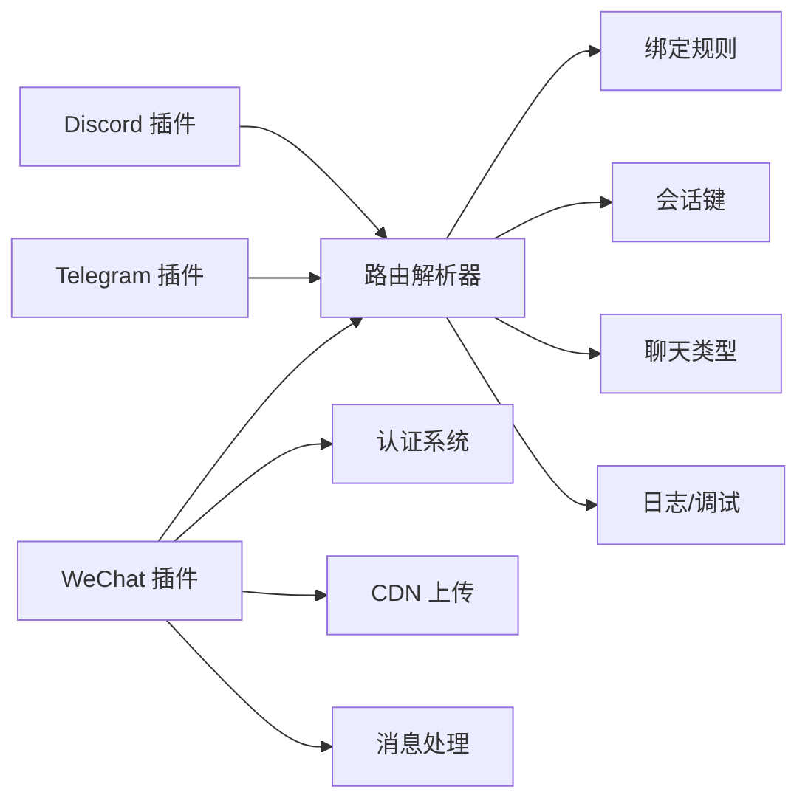

# 消息通道系统

<cite>
**本文引用的文件**
- [extensions/discord/index.ts](file://extensions/discord/index.ts)
- [extensions/telegram/index.ts](file://extensions/telegram/index.ts)
- [extensions/openclaw-weixin/index.ts](file://extensions/openclaw-weixin/index.ts)
- [extensions/openclaw-weixin/src/channel.ts](file://extensions/openclaw-weixin/src/channel.ts)
- [extensions/openclaw-weixin/src/config/config-schema.ts](file://extensions/openclaw-weixin/src/config/config-schema.ts)
- [extensions/openclaw-weixin/src/compat.ts](file://extensions/openclaw-weixin/src/compat.ts)
- [extensions/openclaw-weixin/src/auth/accounts.ts](file://extensions/openclaw-weixin/src/auth/accounts.ts)
- [extensions/openclaw-weixin/src/messaging/inbound.ts](file://extensions/openclaw-weixin/src/messaging/inbound.ts)
- [extensions/openclaw-weixin/src/cdn/upload.ts](file://extensions/openclaw-weixin/src/cdn/upload.ts)
- [extensions/openclaw-weixin/src/weixin-cli.ts](file://extensions/openclaw-weixin/src/weixin-cli.ts)
- [src/channels/channel-config.ts](file://src/channels/channel-config.ts)
- [src/routing/resolve-route.ts](file://src/routing/resolve-route.ts)
- [src/channels/chat-type.ts](file://src/channels/chat-type.ts)
- [src/routing/session-key.ts](file://src/routing/session-key.ts)
- [src/routing/bindings.ts](file://src/routing/bindings.ts)
- [src/agents/agent-scope.ts](file://src/agents/agent-scope.ts)
- [src/globals.ts](file://src/globals.ts)
- [src/logger.ts](file://src/logger.ts)
- [docs/channels/index.md](file://docs/channels/index.md)
- [docs/channels/channel-routing.md](file://docs/channels/channel-routing.md)
- [docs/gateway/configuration.md](file://docs/gateway/configuration.md)
- [docs/gateway/configuration-reference.md](file://docs/gateway/configuration-reference.md)
- [docs/cli/channels.md](file://docs/cli/channels.md)
- [docs/concepts/messages.md](file://docs/concepts/messages.md)
- [docs/concepts/retry.md](file://docs/concepts/retry.md)
- [docs/concepts/queue.md](file://docs/concepts/queue.md)
- [docs/design/kilo-gateway-integration.md](file://docs/design/kilo-gateway-integration.md)
- [docs/refactor/strict-config.md](file://docs/refactor/strict-config.md)
- [docs/install/docker.md](file://docs/install/docker.md)
- [docs/platforms/index.md](file://docs/platforms/index.md)
- [docs/providers/index.md](file://docs/providers/index.md)
- [docs/tools/index.md](file://docs/tools/index.md)
- [docs/plugins/manifest.md](file://docs/plugins/manifest.md)
- [docs/plugins/community.md](file://docs/plugins/community.md)
- [docs/help/troubleshooting.md](file://docs/help/troubleshooting.md)
- [docs/gateway/troubleshooting.md](file://docs/gateway/troubleshooting.md)
- [docs/channels/troubleshooting.md](file://docs/channels/troubleshooting.md)
</cite>

## 更新摘要
**所做更改**
- 新增 WeChat（openclaw-weixin）完整消息通道支持章节
- 更新支持的消息平台概览，包含 WeChat 平台
- 添加 WeChat 认证、消息处理、媒体处理、CDN 上传等全套功能说明
- 更新架构图和组件分析，反映 WeChat 通道的完整实现

## 目录
1. [简介](#简介)
2. [项目结构](#项目结构)
3. [核心组件](#核心组件)
4. [架构总览](#架构总览)
5. [详细组件分析](#详细组件分析)
6. [WeChat 通道完整实现](#wechat-通道完整实现)
7. [依赖关系分析](#依赖关系分析)
8. [性能考量](#性能考量)
9. [故障排查指南](#故障排查指南)
10. [结论](#结论)
11. [附录](#附录)

## 简介
本文件为"消息通道系统"的综合技术文档，面向开发者与运维人员，系统阐述通道适配器架构、消息路由机制、跨平台集成方式与配置要点，并提供自定义通道开发指南、性能优化建议与扩展性设计思路。文档基于仓库中已实现的插件化通道（如 Discord、Telegram、WeChat）与核心路由、会话键、绑定规则等模块进行深入解析，帮助读者快速理解如何在该系统上接入新的消息平台。

## 项目结构
消息通道系统采用"核心引擎 + 插件通道"的分层架构：
- 核心层：路由解析、会话键生成、绑定匹配、聊天类型规范、全局日志与调试开关等。
- 通道层：以插件形式接入不同消息平台（Discord、Telegram、WeChat、Slack、Matrix、Mattermost、Teams、Feishu、Signal、IRC、Line、Nostr、Twitch、WhatsApp、Zalo、BlueBubbles、Google Chat 等），每个通道通过统一的插件注册接口向系统注入运行时与通道能力。
- 文档与工具：提供通道配置参考、CLI 使用说明、网关配置与安全策略、安装与部署指南、故障排查手册等。


```mermaid
graph TB
subgraph "核心层"
ROUTE["路由解析<br/>resolve-route.ts"]
SESSION["会话键<br/>session-key.ts"]
BIND["绑定规则<br/>bindings.ts"]
CHAT["聊天类型<br/>chat-type.ts"]
LOG["日志与调试<br/>logger.ts / globals.ts"]
end
subgraph "通道层"
DISC["Discord 插件<br/>extensions/discord/index.ts"]
TG["Telegram 插件<br/>extensions/telegram/index.ts"]
WX["WeChat 插件<br/>extensions/openclaw-weixin/index.ts"]
end
ROUTE --> BIND
ROUTE --> SESSION
ROUTE --> CHAT
DISC --> ROUTE
TG --> ROUTE
WX --> ROUTE
LOG --> ROUTE
```

**图表来源**
- [src/routing/resolve-route.ts:1-805](file://src/routing/resolve-route.ts#L1-L805)
- [src/routing/session-key.ts](file://src/routing/session-key.ts)
- [src/routing/bindings.ts](file://src/routing/bindings.ts)
- [src/channels/chat-type.ts](file://src/channels/chat-type.ts)
- [src/logger.ts](file://src/logger.ts)
- [src/globals.ts](file://src/globals.ts)
- [extensions/discord/index.ts:1-20](file://extensions/discord/index.ts#L1-L20)
- [extensions/telegram/index.ts:1-18](file://extensions/telegram/index.ts#L1-L18)
- [extensions/openclaw-weixin/index.ts:1-34](file://extensions/openclaw-weixin/index.ts#L1-L34)

**章节来源**
- [extensions/discord/index.ts:1-20](file://extensions/discord/index.ts#L1-L20)
- [extensions/telegram/index.ts:1-18](file://extensions/telegram/index.ts#L1-L18)
- [extensions/openclaw-weixin/index.ts:1-34](file://extensions/openclaw-weixin/index.ts#L1-L34)
- [src/routing/resolve-route.ts:1-805](file://src/routing/resolve-route.ts#L1-L805)
- [src/routing/session-key.ts](file://src/routing/session-key.ts)
- [src/routing/bindings.ts](file://src/routing/bindings.ts)
- [src/channels/chat-type.ts](file://src/channels/chat-type.ts)
- [src/logger.ts](file://src/logger.ts)
- [src/globals.ts](file://src/globals.ts)

## 核心组件
- 路由解析器：根据通道、账户、聊天对象、服务器/团队、角色等维度匹配绑定规则，选择代理并生成会话键，支持缓存与调试日志。
- 会话键生成器：按代理、通道、账户、聊天对象、DM 范围等维度构建稳定且可持久化的会话键，用于并发控制与状态管理。
- 绑定规则：定义"通道 + 账户"维度的匹配与优先级，支持通配与继承（线程父级回退）。
- 聊天类型：统一规范 direct/group/channel 等聊天类型，便于跨平台一致性处理。
- 通道配置工具：提供键规范化、通配匹配、父级回退、允许列表决策等通用逻辑，支撑多平台通道的匹配与决策。

**章节来源**
- [src/routing/resolve-route.ts:1-805](file://src/routing/resolve-route.ts#L1-L805)
- [src/routing/session-key.ts](file://src/routing/session-key.ts)
- [src/routing/bindings.ts](file://src/routing/bindings.ts)
- [src/channels/chat-type.ts](file://src/channels/chat-type.ts)
- [src/channels/channel-config.ts:1-183](file://src/channels/channel-config.ts#L1-L183)

## 架构总览
下图展示从"通道插件注册"到"消息路由与会话"的端到端流程，体现插件式通道与核心路由的协作关系。


```mermaid
sequenceDiagram
participant P as "插件入口<br/>extensions/*/index.ts"
participant API as "插件API<br/>registerChannel()"
participant RT as "运行时设置<br/>set*Runtime()"
participant R as "路由解析器<br/>resolve-route.ts"
participant S as "会话键生成<br/>session-key.ts"
P->>RT : 设置通道运行时
P->>API : 注册通道插件
API-->>R : 提供通道消息输入
R->>R : 解析绑定规则/聊天类型
R->>S : 生成会话键
R-->>API : 返回路由结果(代理ID/会话键)
```

**图表来源**
- [extensions/discord/index.ts:1-20](file://extensions/discord/index.ts#L1-L20)
- [extensions/telegram/index.ts:1-18](file://extensions/telegram/index.ts#L1-L18)
- [extensions/openclaw-weixin/index.ts:15-32](file://extensions/openclaw-weixin/index.ts#L15-L32)
- [src/routing/resolve-route.ts:1-805](file://src/routing/resolve-route.ts#L1-L805)
- [src/routing/session-key.ts](file://src/routing/session-key.ts)

## 详细组件分析

### 组件A：通道适配器架构（以 Discord、Telegram 和 WeChat 为例）
- 插件注册：每个通道通过统一入口导出插件对象，声明 id、名称、描述、配置模式，并在注册回调中设置运行时与注册通道。
- 运行时注入：通道运行时负责消息拉取、事件处理、发送等底层细节，对核心路由透明。
- 通道注册：通过插件 API 将通道能力注入系统，供路由与会话模块使用。


```mermaid
classDiagram
class PluginEntry {
+id : string
+name : string
+description : string
+configSchema() : any
+register(api)
}
class DiscordPlugin {
+id = "discord"
+name = "Discord"
+register(api)
}
class TelegramPlugin {
+id = "telegram"
+name = "Telegram"
+register(api)
}
class WeixinPlugin {
+id = "openclaw-weixin"
+name = "Weixin"
+register(api)
}
PluginEntry <|.. DiscordPlugin
PluginEntry <|.. TelegramPlugin
PluginEntry <|.. WeixinPlugin
```

**图表来源**
- [extensions/discord/index.ts:1-20](file://extensions/discord/index.ts#L1-L20)
- [extensions/telegram/index.ts:1-18](file://extensions/telegram/index.ts#L1-L18)
- [extensions/openclaw-weixin/index.ts:10-33](file://extensions/openclaw-weixin/index.ts#L10-L33)

**章节来源**
- [extensions/discord/index.ts:1-20](file://extensions/discord/index.ts#L1-L20)
- [extensions/telegram/index.ts:1-18](file://extensions/telegram/index.ts#L1-L18)
- [extensions/openclaw-weixin/index.ts:10-33](file://extensions/openclaw-weixin/index.ts#L10-L33)

### 组件B：消息路由机制
- 输入参数：通道名、账户 ID、聊天对象（含类型与 ID）、服务器/团队信息、成员角色 ID 列表、线程父级聊天对象等。
- 匹配层级：按"直接匹配 -> 线程父级回退 -> 服务器+角色 -> 服务器 -> 团队 -> 账户 -> 通道"顺序尝试，命中即返回。
- 会话键：结合代理 ID、通道、账户、聊天对象与 DM 范围生成稳定键；同时计算主会话键用于直聊合并策略。
- 缓存策略：对绑定评估、索引与路由结果进行弱引用缓存，限制最大键数，避免内存膨胀。
- 调试日志：在启用详细日志时输出绑定候选与匹配过程，便于定位问题。


```mermaid
flowchart TD
Start(["开始"]) --> Normalize["标准化输入参数"]
Normalize --> BuildCacheKey["构建路由缓存键"]
BuildCacheKey --> CheckCache{"命中缓存?"}
CheckCache --> |是| ReturnCache["返回缓存路由"]
CheckCache --> |否| LoadBindings["加载并评估绑定"]
LoadBindings --> Index["构建索引(按peer/guild/team/account/channel)"]
Index --> TierLoop["按层级遍历匹配"]
TierLoop --> Match{"是否匹配成功?"}
Match --> |是| Choose["选择代理并生成会话键"]
Match --> |否| NextTier["进入下一层级"]
NextTier --> TierLoop
Choose --> Cache["写入路由缓存"]
Cache --> End(["结束"])
ReturnCache --> End
```

**图表来源**
- [src/routing/resolve-route.ts:614-805](file://src/routing/resolve-route.ts#L614-L805)

**章节来源**
- [src/routing/resolve-route.ts:1-805](file://src/routing/resolve-route.ts#L1-L805)
- [src/routing/session-key.ts](file://src/routing/session-key.ts)
- [src/routing/bindings.ts](file://src/routing/bindings.ts)
- [src/channels/chat-type.ts](file://src/channels/chat-type.ts)
- [src/globals.ts](file://src/globals.ts)
- [src/logger.ts](file://src/logger.ts)

### 组件C：通道配置与匹配工具
- 键规范化：去除前后空格、转小写、移除前缀 #、替换非字母数字字符为连字符等，确保键的一致性。
- 候选键生成：支持多候选键集合去重与顺序保留。
- 匹配策略：优先直接匹配，其次规范化后匹配，再其次父级回退匹配，最后通配匹配。
- 允许列表嵌套决策：外层未配置则默认允许；外层匹配但内层未配置则默认允许；内外均配置则以内层为准。


```mermaid
flowchart TD
A["输入候选键"] --> B["去重与过滤"]
B --> C["生成候选集"]
C --> D{"直接匹配?"}
D --> |是| E["返回直接匹配"]
D --> |否| F{"规范化匹配?"}
F --> |是| G["返回规范化匹配"]
F --> |否| H{"父级回退?"}
H --> |是| I["返回父级匹配"]
H --> |否| J{"通配匹配?"}
J --> |是| K["返回通配匹配"]
J --> |否| L["无匹配"]
```

**图表来源**
- [src/channels/channel-config.ts:60-164](file://src/channels/channel-config.ts#L60-L164)

**章节来源**
- [src/channels/channel-config.ts:1-183](file://src/channels/channel-config.ts#L1-L183)

### 组件D：聊天类型与会话键
- 聊天类型：统一规范 direct/group/channel，支持同组/频道互换匹配，保证跨平台一致性。
- 会话键：组合代理、通道、账户、聊天对象、DM 范围与身份链接，生成稳定键；主会话键用于直聊合并策略。

**章节来源**
- [src/channels/chat-type.ts](file://src/channels/chat-type.ts)
- [src/routing/session-key.ts](file://src/routing/session-key.ts)

## WeChat 通道完整实现

### WeChat 通道架构概述
WeChat 通道作为最新的完整消息平台集成，提供了从认证到消息处理的全套功能：


```mermaid
graph TB
subgraph "WeChat 通道核心"
WX_PLUGIN["WeixinPlugin<br/>src/channel.ts"]
AUTH["认证系统<br/>auth/accounts.ts"]
INBOUND["入站消息处理<br/>messaging/inbound.ts"]
OUTBOUND["出站消息处理<br/>messaging/send.ts"]
CDN["CDN 上传<br/>cdn/upload.ts"]
CONFIG["配置管理<br/>config/config-schema.ts"]
CLI["CLI 工具<br/>weixin-cli.ts"]
COMPAT["兼容性检查<br/>compat.ts"]
end
subgraph "外部服务"
BACKEND["微信后端 API"]
CDN_SERVICE["微信 CDN"]
end
WX_PLUGIN --> AUTH
WX_PLUGIN --> INBOUND
WX_PLUGIN --> OUTBOUND
WX_PLUGIN --> CDN
AUTH --> BACKEND
CDN --> CDN_SERVICE
```

**图表来源**
- [extensions/openclaw-weixin/src/channel.ts:130-472](file://extensions/openclaw-weixin/src/channel.ts#L130-L472)
- [extensions/openclaw-weixin/src/auth/accounts.ts:1-382](file://extensions/openclaw-weixin/src/auth/accounts.ts#L1-382)
- [extensions/openclaw-weixin/src/messaging/inbound.ts:1-263](file://extensions/openclaw-weixin/src/messaging/inbound.ts#L1-263)
- [extensions/openclaw-weixin/src/cdn/upload.ts:1-158](file://extensions/openclaw-weixin/src/cdn/upload.ts#L1-158)

### WeChat 认证与登录流程
WeChat 通道采用二维码扫描登录方式，提供完整的认证生命周期管理：


```mermaid
sequenceDiagram
participant User as 用户
participant CLI as CLI 工具
participant Auth as 认证系统
participant Backend as 微信后端
User->>CLI : 执行登录命令
CLI->>Auth : 启动二维码登录
Auth->>Backend : 请求登录会话
Backend-->>Auth : 返回二维码URL和会话密钥
Auth-->>CLI : 显示二维码
User->>Auth : 扫描二维码并授权
Auth->>Backend : 轮询登录状态
Backend-->>Auth : 返回登录成功和令牌
Auth->>Auth : 保存账户信息
Auth-->>CLI : 登录完成通知
```

**图表来源**
- [extensions/openclaw-weixin/src/channel.ts:267-351](file://extensions/openclaw-weixin/src/channel.ts#L267-L351)
- [extensions/openclaw-weixin/src/auth/accounts.ts:183-240](file://extensions/openclaw-weixin/src/auth/accounts.ts#L183-L240)

### WeChat 消息处理机制
WeChat 通道支持多种消息类型和媒体处理：

- **文本消息**：标准文本内容处理，支持上下文令牌传递
- **图片消息**：CDN 加密上传，支持本地文件和远程 URL
- **语音消息**：SILK 编码音频处理，自动转文字
- **视频消息**：视频文件加密上传，支持缩略图生成
- **文件消息**：任意文件类型加密传输

**章节来源**
- [extensions/openclaw-weixin/src/channel.ts:148-244](file://extensions/openclaw-weixin/src/channel.ts#L148-L244)
- [extensions/openclaw-weixin/src/messaging/inbound.ts:199-257](file://extensions/openclaw-weixin/src/messaging/inbound.ts#L199-L257)
- [extensions/openclaw-weixin/src/cdn/upload.ts:113-158](file://extensions/openclaw-weixin/src/cdn/upload.ts#L113-L158)

### WeChat CDN 上传流程
WeChat 通道实现了完整的 CDN 上传机制，确保媒体文件的安全传输：


```mermaid
flowchart TD
START["开始上传"] --> CHECK["检查文件类型"]
CHECK --> HASH["计算文件哈希"]
HASH --> SIZE["计算加密后大小"]
SIZE --> KEY["生成文件密钥"]
KEY --> GET_URL["获取上传URL"]
GET_URL --> UPLOAD["上传加密文件"]
UPLOAD --> RESP["接收响应"]
RESP --> INFO["返回上传信息"]
INFO --> END["完成"]
```

**图表来源**
- [extensions/openclaw-weixin/src/cdn/upload.ts:52-111](file://extensions/openclaw-weixin/src/cdn/upload.ts#L52-L111)

### WeChat 配置管理
WeChat 通道支持灵活的配置选项：

- **基础配置**：API 基础 URL、CDN 基础 URL
- **账户配置**：多账户支持、账户名称、启用状态
- **路由标签**：支持按路由标签进行消息分发
- **CDN 配置**：自定义 CDN 基础 URL

**章节来源**
- [extensions/openclaw-weixin/src/config/config-schema.ts:9-21](file://extensions/openclaw-weixin/src/config/config-schema.ts#L9-L21)
- [extensions/openclaw-weixin/src/auth/accounts.ts:327-382](file://extensions/openclaw-weixin/src/auth/accounts.ts#L327-L382)

### WeChat CLI 工具
WeChat 通道提供了完整的 CLI 支持：

- **安装卸载**：一键安装和卸载插件
- **登录管理**：支持多账户登录和管理
- **配置维护**：自动清理过期配置

**章节来源**
- [extensions/openclaw-weixin/src/weixin-cli.ts:15-40](file://extensions/openclaw-weixin/src/weixin-cli.ts#L15-L40)

## 依赖关系分析
- 通道插件依赖核心路由模块提供的聊天类型、绑定规则与会话键生成能力。
- WeChat 通道特别依赖认证系统、CDN 上传、消息处理等子模块。
- 路由解析器依赖全局日志与调试开关，按需输出详细匹配过程。
- 绑定规则与会话键生成相互配合，形成稳定的路由与状态管理闭环。


```mermaid
graph LR
DISC["Discord 插件"] --> ROUTE["路由解析器"]
TG["Telegram 插件"] --> ROUTE
WX["WeChat 插件"] --> ROUTE
WX --> AUTH["认证系统"]
WX --> CDN["CDN 上传"]
WX --> MSG["消息处理"]
ROUTE --> BIND["绑定规则"]
ROUTE --> SESSION["会话键"]
ROUTE --> CHAT["聊天类型"]
ROUTE --> LOG["日志/调试"]
```

**图表来源**
- [extensions/discord/index.ts:1-20](file://extensions/discord/index.ts#L1-L20)
- [extensions/telegram/index.ts:1-18](file://extensions/telegram/index.ts#L1-L18)
- [extensions/openclaw-weixin/index.ts:1-34](file://extensions/openclaw-weixin/index.ts#L1-L34)
- [extensions/openclaw-weixin/src/channel.ts:1-31](file://extensions/openclaw-weixin/src/channel.ts#L1-L31)
- [src/routing/resolve-route.ts:1-805](file://src/routing/resolve-route.ts#L1-L805)
- [src/routing/session-key.ts](file://src/routing/session-key.ts)
- [src/routing/bindings.ts](file://src/routing/bindings.ts)
- [src/channels/chat-type.ts](file://src/channels/chat-type.ts)
- [src/logger.ts](file://src/logger.ts)
- [src/globals.ts](file://src/globals.ts)

**章节来源**
- [extensions/discord/index.ts:1-20](file://extensions/discord/index.ts#L1-L20)
- [extensions/telegram/index.ts:1-18](file://extensions/telegram/index.ts#L1-L18)
- [extensions/openclaw-weixin/index.ts:1-34](file://extensions/openclaw-weixin/index.ts#L1-L34)
- [extensions/openclaw-weixin/src/channel.ts:1-31](file://extensions/openclaw-weixin/src/channel.ts#L1-L31)
- [src/routing/resolve-route.ts:1-805](file://src/routing/resolve-route.ts#L1-L805)
- [src/routing/session-key.ts](file://src/routing/session-key.ts)
- [src/routing/bindings.ts](file://src/routing/bindings.ts)
- [src/channels/chat-type.ts](file://src/channels/chat-type.ts)
- [src/logger.ts](file://src/logger.ts)
- [src/globals.ts](file://src/globals.ts)

## 性能考量
- 路由缓存：对绑定评估、索引与路由结果进行弱引用缓存，限制最大键数，避免内存膨胀；仅在非详细日志与无身份链接场景启用缓存。
- 绑定索引：按 peer/guild/team/account/channel 构建索引，减少每次匹配的扫描范围。
- 会话键稳定性：通过标准化键值与稳定组合策略，降低重复计算与冲突概率。
- 并发控制：会话键用于并发控制与状态持久化，避免竞态与重复处理。
- WeChat 特殊优化：
  - 上下文令牌缓存：内存 + 磁盘双重存储，支持网关重启恢复
  - CDN 上传优化：批量文件处理，减少网络请求次数
  - 多账户支持：智能账户选择，避免上下文混淆

**章节来源**
- [src/routing/resolve-route.ts:200-212](file://src/routing/resolve-route.ts#L200-L212)
- [src/routing/resolve-route.ts:413-471](file://src/routing/resolve-route.ts#L413-L471)
- [src/routing/resolve-route.ts:508-526](file://src/routing/resolve-route.ts#L508-L526)
- [extensions/openclaw-weixin/src/messaging/inbound.ts:19-103](file://extensions/openclaw-weixin/src/messaging/inbound.ts#L19-L103)

## 故障排查指南
- 路由不生效或匹配异常
  - 检查绑定规则是否正确配置，确认通道与账户维度是否匹配。
  - 启用详细日志观察绑定候选与匹配过程。
  - 参考通道路由文档与 CLI 通道命令，核对输入参数与期望行为。
- 会话键异常或并发冲突
  - 核对会话键生成参数（代理、通道、账户、聊天对象、DM 范围）是否符合预期。
  - 检查直聊合并策略与主会话键计算。
- 通道插件无法注册或运行时缺失
  - 确认插件入口导出的插件对象与注册回调是否正确。
  - 检查运行时设置是否在注册阶段完成。
- WeChat 特有问题
  - **认证失败**：检查二维码是否过期，确认微信客户端授权状态
  - **消息丢失**：验证上下文令牌是否正确传递
  - **媒体上传失败**：检查 CDN URL 获取和加密参数
  - **多账户冲突**：使用明确的 accountId 参数指定发送账户

**章节来源**
- [src/routing/resolve-route.ts:706-715](file://src/routing/resolve-route.ts#L706-L715)
- [src/globals.ts](file://src/globals.ts)
- [src/logger.ts](file://src/logger.ts)
- [extensions/openclaw-weixin/src/channel.ts:267-351](file://extensions/openclaw-weixin/src/channel.ts#L267-L351)
- [extensions/openclaw-weixin/src/messaging/inbound.ts:97-128](file://extensions/openclaw-weixin/src/messaging/inbound.ts#L97-L128)
- [docs/channels/troubleshooting.md](file://docs/channels/troubleshooting.md)
- [docs/gateway/troubleshooting.md](file://docs/gateway/troubleshooting.md)
- [docs/help/troubleshooting.md](file://docs/help/troubleshooting.md)

## 结论
该消息通道系统通过"插件化通道 + 核心路由"的架构实现了高扩展性与跨平台一致性。WeChat 通道作为最新加入的完整消息平台，展示了系统在认证、消息处理、媒体传输、CDN 上传等方面的强大能力。通道插件以最小接口接入系统，核心路由提供强大的绑定匹配、会话键与缓存机制，保障了在多平台、多账户、多聊天对象场景下的稳定运行。结合本文的配置与开发指南，用户可以快速完成新平台接入与定制化扩展。

## 附录

### 支持的消息平台概览
- 已实现/可参考的通道插件：Discord、Telegram、WeChat、Slack、Matrix、Mattermost、Teams、Feishu、Signal、IRC、Line、Nostr、Twitch、WhatsApp、Zalo、BlueBubbles、Google Chat 等。
- WeChat 通道提供了完整的认证、消息处理、媒体传输、CDN 上传功能。
- 通道文档目录提供了各平台的配置示例、认证流程与常见问题说明。

**章节来源**
- [docs/channels/index.md](file://docs/channels/index.md)
- [docs/channels/channel-routing.md](file://docs/channels/channel-routing.md)
- [extensions/openclaw-weixin/README.md:1-315](file://extensions/openclaw-weixin/README.md#L1-L315)

### 通道配置示例与消息格式
- 通道配置参考与示例：提供典型通道的配置片段与字段说明，便于快速上手。
- WeChat 配置示例：
  ```json
  {
    "channels": {
      "openclaw-weixin": {
        "accounts": {
          "weixin_account_1": {
            "name": "微信机器人1",
            "enabled": true,
            "baseUrl": "https://ilinkai.weixin.qq.com",
            "cdnBaseUrl": "https://novac2c.cdn.weixin.qq.com/c2c"
          }
        }
      }
    }
  }
  ```
- 消息格式与处理：概念文档说明消息结构、格式转换与处理流程，确保跨平台一致性。

**章节来源**
- [docs/gateway/configuration.md](file://docs/gateway/configuration.md)
- [docs/gateway/configuration-reference.md](file://docs/gateway/configuration-reference.md)
- [docs/concepts/messages.md](file://docs/concepts/messages.md)
- [extensions/openclaw-weixin/src/config/config-schema.ts:9-21](file://extensions/openclaw-weixin/src/config/config-schema.ts#L9-L21)

### 自定义通道开发指南
- 插件接口与注册：遵循插件入口导出规范，提供 id、名称、描述、配置模式与注册回调。
- 运行时设置：在注册回调中设置通道运行时，确保消息拉取与发送能力可用。
- WeChat 开发参考：
  - 参考 WeChat 通道的完整实现，学习认证、消息处理、CDN 上传的最佳实践
  - 使用统一的插件 SDK 接口，确保与核心系统的兼容性
- 集成测试：利用测试工具与插件运行时模拟环境，验证通道功能。
- 部署与发布：参考插件清单与社区发布流程，完成打包与分发。

**章节来源**
- [extensions/discord/index.ts:1-20](file://extensions/discord/index.ts#L1-L20)
- [extensions/telegram/index.ts:1-18](file://extensions/telegram/index.ts#L1-L18)
- [extensions/openclaw-weixin/index.ts:10-33](file://extensions/openclaw-weixin/index.ts#L10-L33)
- [docs/plugins/manifest.md](file://docs/plugins/manifest.md)
- [docs/plugins/community.md](file://docs/plugins/community.md)
- [docs/refactor/strict-config.md](file://docs/refactor/strict-config.md)

### 安装、部署与运行
- 安装与升级：提供 Docker、平台安装与迁移指南，确保环境一致性。
- WeChat 安装步骤：
  ```bash
  # 快速安装
  npx -y @tencent-weixin/openclaw-weixin-cli install
  
  # 或手动安装
  openclaw plugins install "@tencent-weixin/openclaw-weixin"
  openclaw config set plugins.entries.openclaw-weixin.enabled true
  
  # 启动登录
  openclaw channels login --channel openclaw-weixin
  ```
- 网关与安全：包含网关配置、健康检查、心跳与安全策略说明。
- 平台与提供商：覆盖多平台部署与模型提供商对接要点。

**章节来源**
- [docs/install/docker.md](file://docs/install/docker.md)
- [docs/platforms/index.md](file://docs/platforms/index.md)
- [docs/providers/index.md](file://docs/providers/index.md)
- [docs/gateway/configuration.md](file://docs/gateway/configuration.md)
- [docs/gateway/security/authentication.md](file://docs/gateway/security/authentication.md)
- [extensions/openclaw-weixin/README.md:23-57](file://extensions/openclaw-weixin/README.md#L23-L57)

### 错误处理与重试策略
- 重试与队列：概念文档说明重试机制与消息队列策略，提升系统鲁棒性。
- WeChat 错误处理：
  - 认证超时：支持重新发起登录流程
  - 会话失效：自动检测并提示重新登录
  - 网络异常：重试机制与错误恢复
- CLI 与工具：提供 CLI 通道命令与工具使用说明，辅助日常运维与排障。

**章节来源**
- [docs/concepts/retry.md](file://docs/concepts/retry.md)
- [docs/concepts/queue.md](file://docs/concepts/queue.md)
- [docs/cli/channels.md](file://docs/cli/channels.md)
- [docs/tools/index.md](file://docs/tools/index.md)
- [extensions/openclaw-weixin/src/channel.ts:313-351](file://extensions/openclaw-weixin/src/channel.ts#L313-L351)