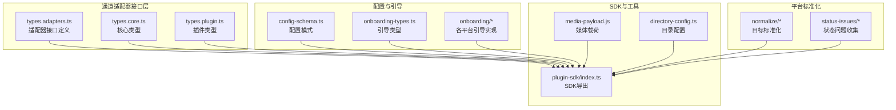
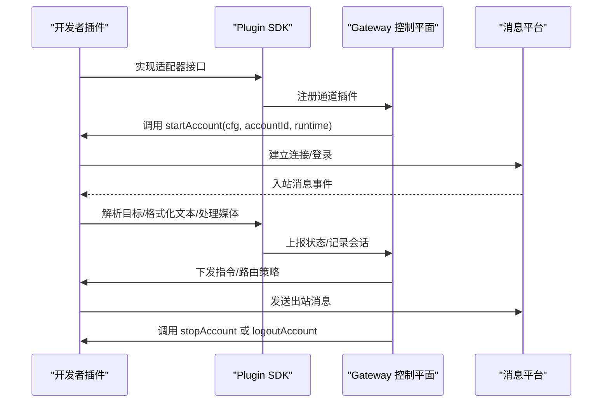
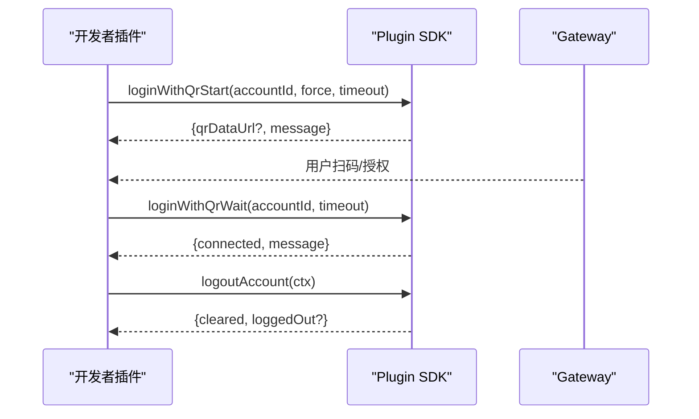
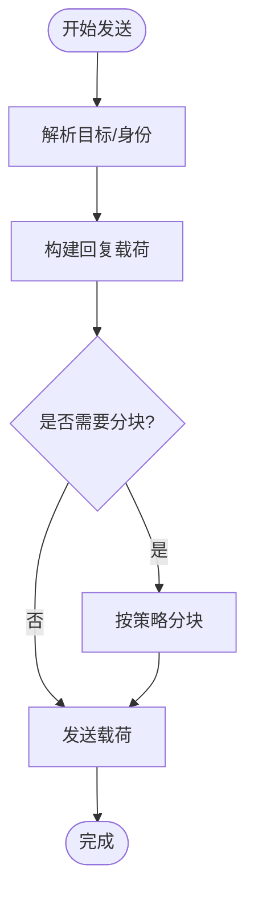
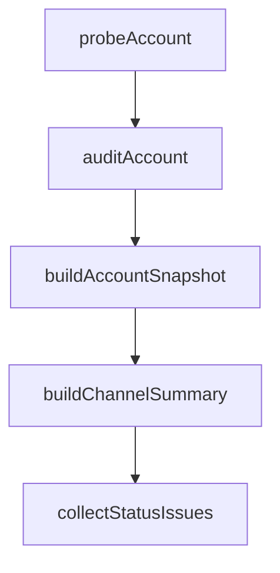
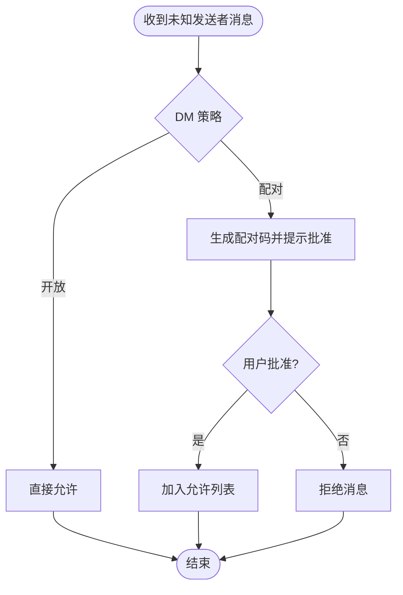
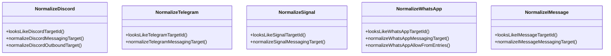
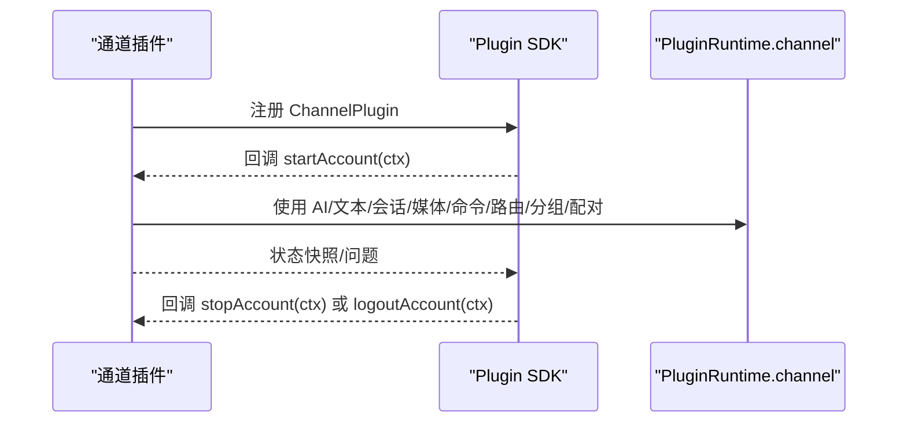
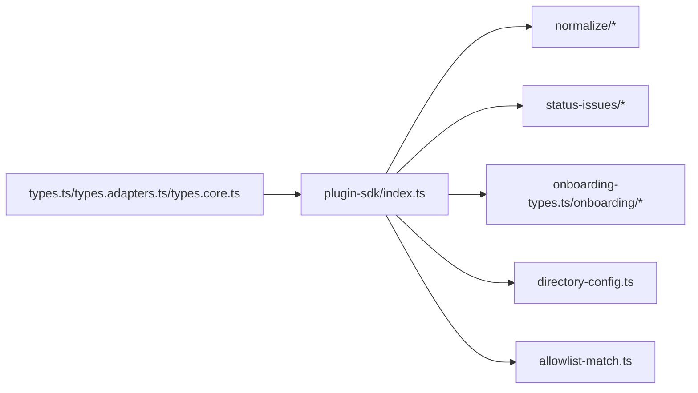

# 自定义通道开发

<cite>
**本文档引用的文件**
- [README.md](file://README.md)
- [plugin-sdk/index.ts](file://src/plugin-sdk/index.ts)
- [channels/plugins/types.ts](file://src/channels/plugins/types.ts)
- [channels/plugins/types.adapters.ts](file://src/channels/plugins/types.adapters.ts)
- [channels/plugins/types.core.ts](file://src/channels/plugins/types.core.ts)
- [channels/plugins/types.plugin.ts](file://src/channels/plugins/types.plugin.ts)
- [channels/plugins/config-schema.ts](file://src/channels/plugins/config-schema.ts)
- [channels/plugins/onboarding-types.ts](file://src/channels/plugins/onboarding-types.ts)
- [channels/plugins/onboarding/helpers.ts](file://src/channels/plugins/onboarding/helpers.ts)
- [channels/plugins/onboarding/discord.ts](file://src/channels/plugins/onboarding/discord.ts)
- [channels/plugins/onboarding/telegram.ts](file://src/channels/plugins/onboarding/telegram.ts)
- [channels/plugins/onboarding/signal.ts](file://src/channels/plugins/onboarding/signal.ts)
- [channels/plugins/onboarding/whatsapp.ts](file://src/channels/plugins/onboarding/whatsapp.ts)
- [channels/plugins/onboarding/imessage.ts](file://src/channels/plugins/onboarding/imessage.ts)
- [channels/plugins/normalize/discord.ts](file://src/channels/plugins/normalize/discord.ts)
- [channels/plugins/normalize/telegram.ts](file://src/channels/plugins/normalize/telegram.ts)
- [channels/plugins/normalize/signal.ts](file://src/channels/plugins/normalize/signal.ts)
- [channels/plugins/normalize/whatsapp.ts](file://src/channels/plugins/normalize/whatsapp.ts)
- [channels/plugins/normalize/imessage.ts](file://src/channels/plugins/normalize/imessage.ts)
- [channels/plugins/status-issues/discord.ts](file://src/channels/plugins/status-issues/discord.ts)
- [channels/plugins/status-issues/telegram.ts](file://src/channels/plugins/status-issues/telegram.ts)
- [channels/plugins/status-issues/whatsapp.ts](file://src/channels/plugins/status-issues/whatsapp.ts)
- [channels/plugins/group-mentions.ts](file://src/channels/plugins/group-mentions.ts)
- [channels/plugins/group-policy-warnings.ts](file://src/channels/plugins/group-policy-warnings.ts)
- [channels/plugins/helpers.ts](file://src/channels/plugins/helpers.ts)
- [channels/plugins/pairing-message.ts](file://src/channels/plugins/pairing-message.ts)
- [channels/plugins/account-helpers.js](file://src/channels/plugins/account-helpers.js)
- [channels/plugins/message-action-names.js](file://src/channels/plugins/message-action-names.js)
- [channels/plugins/bluebubbles-actions.js](file://src/channels/plugins/bluebubbles-actions.js)
- [channels/plugins/media-payload.js](file://src/channels/plugins/media-payload.js)
- [channels/plugins/media-limits.js](file://src/channels/plugins/media-limits.js)
- [channels/plugins/directory-config.ts](file://src/channels/plugins/directory-config.ts)
- [channels/plugins/directory-config-helpers.ts](file://src/channels/plugins/directory-config-helpers.ts)
- [channels/plugins/config-helpers.ts](file://src/channels/plugins/config-helpers.ts)
- [channels/plugins/setup-helpers.ts](file://src/channels/plugins/setup-helpers.ts)
- [channels/plugins/allowlist-match.ts](file://src/channels/plugins/allowlist-match.ts)
- [channels/plugins/channel-config.ts](file://src/channels/plugins/channel-config.ts)
- [channels/plugins/group-policy.ts](file://src/channels/plugins/group-policy.ts)
- [channels/plugins/helpers.ts](file://src/channels/plugins/helpers.ts)
- [channels/plugins/pairing-message.ts](file://src/channels/plugins/pairing-message.ts)
- [channels/plugins/account-helpers.js](file://src/channels/plugins/account-helpers.js)
- [channels/plugins/message-action-names.js](file://src/channels/plugins/message-action-names.js)
- [channels/plugins/bluebubbles-actions.js](file://src/channels/plugins/bluebubbles-actions.js)
- [channels/plugins/media-payload.js](file://src/channels/plugins/media-payload.js)
- [channels/plugins/media-limits.js](file://src/channels/plugins/media-limits.js)
- [channels/plugins/directory-config.ts](file://src/channels/plugins/directory-config.ts)
- [channels/plugins/directory-config-helpers.ts](file://src/channels/plugins/directory-config-helpers.ts)
- [channels/plugins/config-helpers.ts](file://src/channels/plugins/config-helpers.ts)
- [channels/plugins/setup-helpers.ts](file://src/channels/plugins/setup-helpers.ts)
- [channels/plugins/allowlist-match.ts](file://src/channels/plugins/allowlist-match.ts)
- [channels/plugins/channel-config.ts](file://src/channels/plugins/channel-config.ts)
- [channels/plugins/group-policy.ts](file://src/channels/plugins/group-policy.ts)
- [channels/plugins/helpers.ts](file://src/channels/plugins/helpers.ts)
- [channels/plugins/pairing-message.ts](file://src/channels/plugins/pairing-message.ts)
- [channels/plugins/account-helpers.js](file://src/channels/plugins/account-helpers.js)
- [channels/plugins/message-action-names.js](file://src/channels/plugins/message-action-names.js)
- [channels/plugins/bluebubbles-actions.js](file://src/channels/plugins/bluebubbles-actions.js)
- [channels/plugins/media-payload.js](file://src/channels/plugins/media-payload.js)
- [channels/plugins/media-limits.js](file://src/channels/plugins/media-limits.js)
- [channels/plugins/directory-config.ts](file://src/channels/plugins/directory-config.ts)
- [channels/plugins/directory-config-helpers.ts](file://src/channels/plugins/directory-config-helpers.ts)
- [channels/plugins/config-helpers.ts](file://src/channels/plugins/config-helpers.ts)
- [channels/plugins/setup-helpers.ts](file://src/channels/plugins/setup-helpers.ts)
- [channels/plugins/allowlist-match.ts](file://src/channels/plugins/allowlist-match.ts)
- [channels/plugins/channel-config.ts](file://src/channels/plugins/channel-config.ts)
- [channels/plugins/group-policy.ts](file://src/channels/plugins/group-policy.ts)
- [channels/plugins/helpers.ts](file://src/channels/plugins/helpers.ts)
- [channels/plugins/pairing-message.ts](file://src/channels/plugins/pairing-message.ts)
- [channels/plugins/account-helpers.js](file://src/channels/plugins/account-helpers.js)
- [channels/plugins/message-action-names.js](file://src/channels/plugins/message-action-names.js)
- [channels/plugins/bluebubbles-actions.js](file://src/channels/plugins/bluebubbles-actions.js)
- [channels/plugins/media-payload.js](file://src/channels/plugins/media-payload.js)
- [channels/plugins/media-limits.js](file://src/channels/plugins/media-limits.js)
- [channels/plugins/directory-config.ts](file://src/channels/plugins/directory-config.ts)
- [channels/plugins/directory-config-helpers.ts](file://src/channels/plugins/directory-config-helpers.ts)
- [channels/plugins/config-helpers.ts](file://src/channels/plugins/config-helpers.ts)
- [channels/plugins/setup-helpers.ts](file://src/channels/plugins/setup-helpers.ts)
- [channels/plugins/allowlist-match.ts](file://src/channels/plugins/allowlist-match.ts)
- [channels/plugins/channel-config.ts](file://src/channels/plugins/channel-config.ts)
- [channels/plugins/group-policy.ts](file://src/channels/plugins/group-policy.ts)
- [channels/plugins/helpers.ts](file://src/channels/plugins/helpers.ts)
- [channels/plugins/pairing-message.ts](file://src/channels/plugins/pairing-message.ts)
- [channels/plugins/account-helpers.js](file://src/channels/plugins/account-helpers.js)
- [channels/plugins/message-action-names.js](file://src/channels/plugins/message-action-names.js)
- [channels/plugins/bluebubbles-actions.js](file://src/channels/plugins/bluebubbles-actions.js)
- [channels/plugins/media-payload.js](file://src/channels/plugins/media-payload.js)
- [channels/plugins/media-limits.js](file://src/channels/plugins/media-limits.js)
- [channels/plugins/directory-config.ts](file://src/channels/plugins/directory-config.ts)
- [channels/plugins/directory-config-helpers.ts](file://src/channels/plugins/directory-config-helpers.ts)
- [channels/plugins/config-helpers.ts](file://src/channels/plugins/config-helpers.ts)
- [channels/plugins/setup-helpers.ts](file://src/channels/plugins/setup-helpers.ts)
- [channels/plugins/allowlist-match.ts](file://src/channels/plugins/allowlist-match.ts)
- [channels/plugins/channel-config.ts](file://src/channels/plugins/channel-config.ts)
- [channels/plugins/group-policy.ts](file://src/channels/plugins/group-policy.ts)
- [channels/plugins/helpers.ts](file://src/channels/plugins/helpers.ts)
- [channels/plugins/pairing-message.ts](file://src/channels/plugins/pairing-message.ts)
- [channels/plugins/account-helpers.js](file://src/channels/plugins/account-helpers.js)
- [channels/plugins/message-action-names.js](file://src/channels/plugins/message-action-names.js)
- [channels/plugins/bluebubbles-actions.js](file://src/channels/plugins/bluebubbles-actions.js)
- [channels/plugins/media-payload.js](file://src/channels/plugins/media-payload.js)
- [channels/plugins/media-limits.js](file://src/channels/plugins/media-limits.js)
- [channels/plugins/directory-config.ts](file://src/channels/plugins/directory-config.ts)
- [channels/plugins/directory-config-helpers.ts](file://src/channels/plugins/directory-config-helpers.ts)
- [channels/plugins/config-helpers.ts](file://src/channels/plugins/config-helpers.ts)
- [channels/plugins/setup-helpers.ts](file://src/channels/plugins/setup-helpers.ts)
- [channels/plugins/allowlist-match.ts](file://src/channels/plugins/allowlist-match.ts)
- [channels/plugins/channel-config.ts](file://src/channels/plugins/channel-config.ts)
- [channels/plugins/group-policy.ts](file://src/channels/plugins/group-policy.ts)
- [channels/plugins/helpers.ts](file://src/channels/plugins/helpers.ts)
- [channels/plugins/pairing-message.ts](file://src/channels/plugins/pairing-message.ts)
- [channels/plugins/account-helpers.js](file://src/channels/plugins/account-helpers.js)
- [channels/plugins/message-action-names.js](file://src/channels/plugins/message-action-names.js)
- [channels/plugins/bluebubbles-actions.js](file://src/channels/plugins/bluebubbles-actions.js)
- [channels/plugins/media-payload.js](file://src/channels/plugins/media......payload.js)
- [channels/plugins/media-limits.js](file://src/channels/plugins/media-limits.js)
- [channels/plugins/directory-config.ts](file://src/channels/plugins/directory-config.ts)
- [channels/plugins/directory-config-helpers.ts](file://src/channels/plugins/directory-config-helpers.ts)
- [channels/plugins/config-helpers.ts](file://src/channels/plugins/config-helpers.ts)
- [channels/plugins/setup-helpers.ts](file://src/channels/plugins/setup-helpers.ts)
- [channels/plugins/allowlist-match.ts](file://src/channels/plugins/allowlist-match.ts)
- [channels/plugins/channel-config.ts](file://src/channels/plugins/channel-config.ts)
- [channels/plugins/group-policy.ts](file://src/channels/plugins/group-policy.ts)
- [channels/plugins/helpers.ts](file://src/channels/plugins/helpers.ts)
- [channels/plugins/pairing-message.ts](file://src/channels/plugins/pairing-message.ts)
- [channels/plugins/account-helpers.js](file://src/channels/plugins/account-helpers.js)
- [channels/plugins/message-action-names.js](file://src/channels/plugins/message-action-names.js)
- [channels/plugins/bluebubbles-actions.js](file://src/channels/plugins/bluebubbles-actions.js)
- [channels/plugins/media-payload.js](file://src/channels/plugins/media-payload.js)
- [channels/plugins/media-limits.js](file://src/channels/plugins/media-limits.js)
- [channels/plugins/directory-config.ts](file://src/channels/plugins/directory-config.ts)
- [channels/plugins/directory-config-helpers.ts](file://src/channels/plugins/directory-config-helpers.ts)
- [channels/plugins/config-helpers.ts](file://src/channels/plugins/config-helpers.ts)
- [channels/plugins/setup-helpers.ts](file://src/channels/plugins/setup-helpers.ts)
- [channels/plugins/allowlist-match.ts](file://src/channels/plugins/allowlist-match.ts)
- [channels/plugins/channel-config.ts](file://src/channels/plugins/channel-config.ts)
- [channels/plugins/group-policy.ts](file://src/channels/plugins/group-policy.ts)
- [channels/plugins/helpers.ts](file://src/channels/plugins/helpers.ts)
- [channels/plugins/pairing-message.ts](file://src/channels/plugins/pairing-message.ts)
- [channels/plugins/account-helpers.js](file://src/channels/plugins/account-helpers.js)
- [channels/plugins/message-action-names.js](file://src/channels/plugins/message-action-names.js)
- [channels/plugins/bluebubbles-actions.js](file://src/channels/plugins/bluebubbles-actions.js)
- [channels/plugins/media-payload.js](file://src/channels/plugins/media-payload.js)
- [channels/plugins/media-limits.js](file://src/channels/plugins/media-limits.js)
- [channels/plugins/directory-config.ts](file://src/channels/plugins/directory-config.ts)
- [channels/plugins/directory-config-helpers.ts](file://src/channels/plugins/directory-config-helpers.ts)
- [channels/plugins/config-helpers.ts](file://src/channels/plugins/config-helpers.ts)
- [channels/plugins/setup-helpers.ts](file://src/channels/plugins/setup-helpers.ts)
- [channels/plugins/allowlist-match.ts](file://src/channels/plugins/allowlist-match.ts)
- [channels/plugins/channel-config.ts](file://src/channels/plugins/channel-config.ts)
- [channels/plugins/group-policy.ts](file://src/channels/plugins/group-policy.ts)
- [channels/plugins/helpers.ts](file://src/channels/plugins/helpers.ts)
- [channels/plugins/pairing-message.ts](file://src/channels/plugins/pairing-message.ts)
- [channels/plugins/account-helpers.js](file://src/channels/plugins/account-helpers.js)
- [channels/plugins/message-action-names.js](file://src/channels/plugins/message-action-names.js)
- [channels/plugins/bluebubbles-actions.js](file://src/channels/plugins/bluebubbles-actions.js)
- [channels/plugins/media-payload.js](file://src/channels/plugins/media-payload.js)
- [channels/plugins/media-limits.js](file://src/channels/plugins/media-limits.js)
- [channels/plugins/directory-config.ts](file://src/channels/plugins/directory-config.ts)
- [channels/plugins/directory-config-helpers.ts](file://src/channels/plugins/directory-config-helpers.ts)
- [channels/plugins/config-helpers.ts](file://src/channels/plugins/config-helpers.ts)
- [channels/plugins/setup-helpers.ts](file://src/channels/plugins/setup-helpers.ts)
- [channels/plugins/allowlist-match.ts](file://src/channels/plugins/allowlist-match.ts)
- [channels/plugins/channel-config.ts](file://src/channels/plugins/channel-config.ts)
- [channels/plugins/group-policy.ts](file://src/channels/plugins/group-policy.ts)
- [channels/plugins/helpers.ts](file://src/channels/plugins/helpers.ts)
- [channels/plugins/pairing-message.ts](file://src/channels/plugins/pairing-message.ts)
- [channels/plugins/account-helpers.js](file://src/channels/plugins/account-helpers.js)
- [channels/plugins/message-action-names.js](file://src/channels/plugins/message-action-names.js)
- [channels/plugins/bluebubbles-actions.js](file://src/channels/plugins/bluebubbles-actions.js)
- [channels/plugins/media-payload.js](file://src/channels/plugins/media-payload.js)
- [channels/plugins/media-limits.js](file://src/channels/plugins/media-limits.js)
- [channels/plugins/directory-config.ts](file://src/channels/plugins/directory-config.ts)
- [channels/plugins/directory-config-helpers.ts](file://src/channels/plugins/directory-config-helpers.ts)
- [channels/plugins/config-helpers.ts](file://src/channels/plugins/config-helpers.ts)
- [channels/plugins/setup-helpers.ts](file://src/channels/plugins/setup-helpers.ts)
- [channels/plugins/allowlist-match.ts](file://src/channels/plugins/allowlist-match.ts)
- [channels/plugins/channel-config.ts](file://src/channels/plugins/channel-config.ts)
- [channels/plugins/group-policy.ts](file://src/channels/plugins/group-policy.ts)
- [channels/plugins/helpers.ts](file://src/channels/plugins/helpers.ts)
- [channels/plugins/pairing-message.ts](file://src/channels/plugins/pairing-message.ts)
- [channels/plugins/account-helpers.js](file://src/channels/plugins/account-helpers.js)
- [channels/plugins/message-action-names.js](file://src/channels/plugins/message-action-names.js)
- [channels/plugins/bluebubbles-actions.js](file://src/channels/plugins/bluebubbles-actions.js)
- [channels/plugins/media-payload.js](file://src/channels/plugins/media-payload.js)
- [channels/plugins/media-limits.js](file://src/channels/plugins/media-limits.js)
- [channels/plugins/directory-config.ts](file://src/channels/plugins/directory-config.ts)
- [channels/plugins/directory-config-helpers.ts](file://src/channels/plugins/directory-config-helpers.ts)
- [channels/plugins/config-helpers.ts](file://src/channels/plugins/config-helpers.ts)
- [channels/plugins/setup-helpers.ts](file://src/channels/plugins/setup-helpers.ts)
- [channels/plugins/allowlist-match.ts](file://src/channels/plugins/allowlist-match.ts)
- [channels/plugins/channel-config.ts](file://src/channels/plugins/channel-config.ts)
- [channels/plugins/group-policy.ts](file://src/channels/plugins/group-policy.ts)
- [channels/plugins/helpers.ts](file://src/channels/plugins/helpers.ts)
- [channels/plugins/pairing-message.ts](file://src/channels/plugins/pairing-message.ts)
- [channels/plugins/account-helpers.js](file://src/channels/plugins/account-helpers.js)
- [channels/plugins/message-action-names.js](file://src/channels/plugins/message-action-names.js)
- [channels/plugins/bluebubbles-actions.js](file://src/channels/plugins/bluebubbles-actions.js)
- [channels/plugins/media-payload.js](file://src/channels/plugins/media-payload.js)
- [channels/plugins/media-limits.js](file://src/channels/plugins/media-limits.js)
- [channels/plugins/directory-config.ts](file://src/channels/plugins/directory-config.ts)
- [channels/plugins/directory-config-helpers.ts](file://src/channels/plugins/directory-config-helpers.ts)
- [channels/plugins/config-helpers.ts](file://src/channels/plugins/config-helpers.ts)
- [channels/plugins/setup-helpers.ts](file://src/channels/plugins/setup-helpers.ts)
- [channels/plugins/allowlist-match.ts](file://src......)
</cite>

## 目录

1. [简介](#简介)
2. [项目结构](#项目结构)
3. [核心组件](#核心组件)
4. [架构总览](#架构总览)
5. [详细组件分析](#详细组件分析)
6. [依赖关系分析](#依赖关系分析)
7. [性能考虑](#性能考虑)
8. [故障排查指南](#故障排查指南)
9. [结论](#结论)
10. [附录](#附录)

## 简介

本指南面向第三方开发者，系统性讲解如何在 OpenClaw 平台上开发“自定义通道”（Channel），即为新的消息平台或协议接入 OpenClaw 的通道适配层。内容涵盖：

- 通道适配器开发流程：接口实现、认证集成、消息收发与处理
- 插件架构与生命周期管理：启动/停止、登录/登出、心跳检查、状态上报
- 错误处理与安全策略：配对、允许列表、DM 策略、异常处理
- 开发环境搭建、调试技巧与测试方法
- 多平台开发示例与最佳实践，帮助快速集成新通道

## 项目结构

OpenClaw 将“通道适配器”抽象为可插拔的插件模块，通过统一的适配器接口对接不同消息平台。核心目录与文件如下：

- 通道适配器接口定义：src/channels/plugins/types.adapters.ts
- 核心类型与插件类型：src/channels/plugins/types.ts、src/channels/plugins/types.core.ts、src/channels/plugins/types.plugin.ts
- 配置与引导：src/channels/plugins/config-schema.ts、src/channels/plugins/onboarding-types.ts、src/channels/plugins/onboarding/\*
- 平台标准化与规范化：src/channels/plugins/normalize/\*
- 状态与问题收集：src/channels/plugins/status-issues/\*
- 安全与配对：src/channels/plugins/helpers.ts、src/channels/plugins/pairing-message.ts
- 媒体与目录：src/channels/plugins/media-payload.js、src/channels/plugins/directory-config.ts
- 工具与辅助：src/plugin-sdk/index.ts 提供大量工具函数与导出

图示来源

- [channels/plugins/types.adapters.ts:1-384](file://src/channels/plugins/types.adapters.ts#L1-L384)
- [channels/plugins/types.ts:1-66](file://src/channels/plugins/types.ts#L1-L66)
- [channels/plugins/types.core.ts](file://src/channels/plugins/types.core.ts)
- [channels/plugins/types.plugin.ts](file://src/channels/plugins/types.plugin.ts)
- [channels/plugins/config-schema.ts](file://src/channels/plugins/config-schema.ts)
- [channels/plugins/onboarding-types.ts](file://src/channels/plugins/onboarding-types.ts)
- [channels/plugins/onboarding/discord.ts](file://src/channels/plugins/onboarding/discord.ts)
- [channels/plugins/onboarding/telegram.ts](file://src/channels/plugins/onboarding/telegram.ts)
- [channels/plugins/onboarding/signal.ts](file://src/channels/plugins/onboarding/signal.ts)
- [channels/plugins/onboarding/whatsapp.ts](file://src/channels/plugins/onboarding/whatsapp.ts)
- [channels/plugins/onboarding/imessage.ts](file://src/channels/plugins/onboarding/imessage.ts)
- [channels/plugins/normalize/discord.ts](file://src/channels/plugins/normalize/discord.ts)
- [channels/plugins/normalize/telegram.ts](file://src/channels/plugins/normalize/telegram.ts)
- [channels/plugins/normalize/signal.ts](file://src/channels/plugins/normalize/signal.ts)
- [channels/plugins/normalize/whatsapp.ts](file://src/channels/plugins/normalize/whatsapp.ts)
- [channels/plugins/normalize/imessage.ts](file://src/channels/plugins/normalize/imessage.ts)
- [channels/plugins/status-issues/discord.ts](file://src/channels/plugins/status-issues/discord.ts)
- [channels/plugins/status-issues/telegram.ts](file://src/channels/plugins/status-issues/telegram.ts)
- [channels/plugins/status-issues/whatsapp.ts](file://src/channels/plugins/status-issues/whatsapp.ts)
- [plugin-sdk/index.ts:1-826](file://src/plugin-sdk/index.ts#L1-L826)

章节来源

- [README.md:1-560](file://README.md#L1-L560)
- [plugin-sdk/index.ts:1-826](file://src/plugin-sdk/index.ts#L1-L826)

## 核心组件

通道适配器围绕以下核心接口与类型展开：

- 配置与设置：ChannelConfigAdapter、ChannelSetupAdapter
- 出站消息：ChannelOutboundAdapter、ChannelOutboundContext
- 状态与审计：ChannelStatusAdapter、ChannelAccountSnapshot
- 网关生命周期：ChannelGatewayAdapter、ChannelGatewayContext
- 认证与登录：ChannelAuthAdapter、QR 登录流程
- 目录与解析：ChannelDirectoryAdapter、ChannelResolverAdapter
- 安全与配对：ChannelSecurityAdapter、ChannelPairingAdapter
- 分组与提及：ChannelGroupAdapter、Group 策略与警告
- 插件类型：ChannelPlugin、OpenClawPluginConfigSchema

这些接口在 types.adapters.ts 中集中定义，并由 plugin-sdk/index.ts 统一导出，便于外部插件使用。

章节来源

- [channels/plugins/types.adapters.ts:24-384](file://src/channels/plugins/types.adapters.ts#L24-L384)
- [channels/plugins/types.ts:7-66](file://src/channels/plugins/types.ts#L7-L66)
- [plugin-sdk/index.ts:1-200](file://src/plugin-sdk/index.ts#L1-L200)

## 架构总览

通道适配器通过统一的生命周期与适配器接口，将不同消息平台接入 OpenClaw 的控制平面（Gateway）。典型流程：

- 初始化：应用账户配置、解析允许列表、默认目标解析
- 启动：启动账户、建立连接、注册回调
- 运行：接收入站消息、路由到会话、生成回复、发送出站消息
- 停止：清理资源、断开连接、持久化状态
- 状态：探针、审计、快照、问题收集

图示来源

- [channels/plugins/types.adapters.ts:275-289](file://src/channels/plugins/types.adapters.ts#L275-L289)
- [channels/plugins/types.adapters.ts:168-239](file://src/channels/plugins/types.adapters.ts#L168-L239)
- [channels/plugins/types.adapters.ts:108-125](file://src/channels/plugins/types.adapters.ts#L108-L125)
- [channels/plugins/types.adapters.ts:127-166](file://src/channels/plugins/types.adapters.ts#L127-L166)

## 详细组件分析

### 适配器接口族

- ChannelConfigAdapter：负责账户枚举、解析、启用/禁用、描述快照、允许列表与默认目标解析
- ChannelSetupAdapter：负责账户名映射、绑定账户、应用配置、输入校验
- ChannelOutboundAdapter：负责目标解析、文本/媒体/投票发送、分块策略
- ChannelStatusAdapter：负责探针、审计、快照构建、状态汇总、问题收集
- ChannelGatewayAdapter：负责账户生命周期（启动/停止）、QR 登录、登出
- ChannelAuthAdapter：负责认证登录
- ChannelDirectoryAdapter：负责目录查询（用户/群组/成员）
- ChannelResolverAdapter：负责名称/ID 解析
- ChannelSecurityAdapter：负责 DM 策略与安全警告
- ChannelPairingAdapter：负责配对标识与允许列表条目标准化
- ChannelGroupAdapter：负责分组要求提及与工具策略

```mermaid
classDiagram
class ChannelConfigAdapter {
+listAccountIds(cfg)
+resolveAccount(cfg, accountId)
+applyAccountConfig(params)
+resolveAllowFrom(params)
+resolveDefaultTo(params)
}
class ChannelSetupAdapter {
+resolveAccountId(params)
+applyAccountConfig(params)
+validateInput(params)
}
class ChannelOutboundAdapter {
+deliveryMode
+resolveTarget(params)
+sendPayload(ctx)
+sendText(ctx)
+sendMedia(ctx)
+sendPoll(ctx)
}
class ChannelStatusAdapter {
+probeAccount(params)
+auditAccount(params)
+buildAccountSnapshot(params)
+collectStatusIssues(accounts)
}
class ChannelGatewayAdapter {
+startAccount(ctx)
+stopAccount(ctx)
+loginWithQrStart(params)
+loginWithQrWait(params)
+logoutAccount(ctx)
}
class ChannelAuthAdapter {
+login(params)
}
class ChannelDirectoryAdapter {
+self(params)
+listPeers(params)
+listGroups(params)
+listGroupMembers(params)
}
class ChannelResolverAdapter {
+resolveTargets(params)
}
class ChannelSecurityAdapter {
+resolveDmPolicy(ctx)
+collectWarnings(ctx)
}
class ChannelPairingAdapter {
+idLabel
+normalizeAllowEntry(entry)
+notifyApproval(params)
}
class ChannelGroupAdapter {
+resolveRequireMention(ctx)
+resolveGroupIntroHint(ctx)
+resolveToolPolicy(ctx)
}
```

图示来源

- [channels/plugins/types.adapters.ts:24-384](file://src/channels/plugins/types.adapters.ts#L24-L384)

章节来源

- [channels/plugins/types.adapters.ts:24-384](file://src/channels/plugins/types.adapters.ts#L24-L384)

### 认证与登录流程（QR 登录）

- start：生成二维码数据/提示信息
- wait：轮询等待连接成功
- logout：清理凭据并断开

图示来源

- [channels/plugins/types.adapters.ts:278-289](file://src/channels/plugins/types.adapters.ts#L278-L289)
- [channels/plugins/types.adapters.ts:247-255](file://src/channels/plugins/types.adapters.ts#L247-L255)
- [channels/plugins/types.adapters.ts:257-263](file://src/channels/plugins/types.adapters.ts#L257-L263)

章节来源

- [channels/plugins/types.adapters.ts:247-289](file://src/channels/plugins/types.adapters.ts#L247-L289)

### 出站消息发送与分块

- 支持直接/网关/混合投递模式
- 可选文本分块器（按文本/Markdown）
- 支持媒体与投票发送
- 统一的 OutboundIdentity 与依赖注入

图示来源

- [channels/plugins/types.adapters.ts:108-125](file://src/channels/plugins/types.adapters.ts#L108-L125)
- [channels/plugins/types.adapters.ts:89-106](file://src/channels/plugins/types.adapters.ts#L89-L106)

章节来源

- [channels/plugins/types.adapters.ts:89-125](file://src/channels/plugins/types.adapters.ts#L89-L125)

### 状态与问题收集

- 探针：验证账户可用性
- 审计：检查权限/限额/配置
- 快照：聚合运行时状态
- 问题收集：汇总风险项

图示来源

- [channels/plugins/types.adapters.ts:127-166](file://src/channels/plugins/types.adapters.ts#L127-L166)

章节来源

- [channels/plugins/types.adapters.ts:127-166](file://src/channels/plugins/types.adapters.ts#L127-L166)

### 安全与配对

- DM 策略：支持“配对”“开放”等策略
- 允许列表：支持通配符与标准化
- 配对批准通知：向用户提示批准方式

图示来源

- [channels/plugins/types.adapters.ts:378-383](file://src/channels/plugins/types.adapters.ts#L378-L383)
- [channels/plugins/helpers.ts](file://src/channels/plugins/helpers.ts)
- [channels/plugins/pairing-message.ts](file://src/channels/plugins/pairing-message.ts)

章节来源

- [channels/plugins/types.adapters.ts:378-383](file://src/channels/plugins/types.adapters.ts#L378-L383)
- [channels/plugins/helpers.ts](file://src/channels/plugins/helpers.ts)
- [channels/plugins/pairing-message.ts](file://src/channels/plugins/pairing-message.ts)

### 平台标准化与规范化

- 目标标准化：将不同平台的用户/群组 ID 规范化为统一格式
- 示例：Discord、Telegram、Signal、WhatsApp、iMessage 的标准化与解析

图示来源

- [channels/plugins/normalize/discord.ts](file://src/channels/plugins/normalize/discord.ts)
- [channels/plugins/normalize/telegram.ts](file://src/channels/plugins/normalize/telegram.ts)
- [channels/plugins/normalize/signal.ts](file://src/channels/plugins/normalize/signal.ts)
- [channels/plugins/normalize/whatsapp.ts](file://src/channels/plugins/normalize/whatsapp.ts)
- [channels/plugins/normalize/imessage.ts](file://src/channels/plugins/normalize/imessage.ts)

章节来源

- [channels/plugins/normalize/discord.ts](file://src/channels/plugins/normalize/discord.ts)
- [channels/plugins/normalize/telegram.ts](file://src/channels/plugins/normalize/telegram.ts)
- [channels/plugins/normalize/signal.ts](file://src/channels/plugins/normalize/signal.ts)
- [channels/plugins/normalize/whatsapp.ts](file://src/channels/plugins/normalize/whatsapp.ts)
- [channels/plugins/normalize/imessage.ts](file://src/channels/plugins/normalize/imessage.ts)

### 插件架构与生命周期

- 插件类型：ChannelPlugin、OpenClawPluginConfigSchema
- 生命周期：startAccount/stopAccount、loginWithQrStart/loginWithQrWait/logoutAccount
- 渠道运行时：channelRuntime（外部插件可用的高级能力）

图示来源

- [channels/plugins/types.plugin.ts](file://src/channels/plugins/types.plugin.ts)
- [channels/plugins/types.adapters.ts:275-289](file://src/channels/plugins/types.adapters.ts#L275-L289)
- [channels/plugins/types.adapters.ts:168-239](file://src/channels/plugins/types.adapters.ts#L168-L239)

章节来源

- [channels/plugins/types.plugin.ts](file://src/channels/plugins/types.plugin.ts)
- [channels/plugins/types.adapters.ts:168-289](file://src/channels/plugins/types.adapters.ts#L168-L289)

## 依赖关系分析

- 适配器接口依赖 SDK 导出的工具与类型
- 平台标准化依赖各自 normalize 文件
- 状态与问题收集依赖 status-issues 文件
- 配置与引导依赖 onboarding 类型与实现
- 目录与解析依赖 directory-config 与 allowlist-match

图示来源

- [channels/plugins/types.ts:1-66](file://src/channels/plugins/types.ts#L1-L66)
- [channels/plugins/types.adapters.ts:1-384](file://src/channels/plugins/types.adapters.ts#L1-L384)
- [plugin-sdk/index.ts:1-826](file://src/plugin-sdk/index.ts#L1-L826)

章节来源

- [channels/plugins/types.ts:1-66](file://src/channels/plugins/types.ts#L1-L66)
- [channels/plugins/types.adapters.ts:1-384](file://src/channels/plugins/types.adapters.ts#L1-L384)
- [plugin-sdk/index.ts:1-826](file://src/plugin-sdk/index.ts#L1-L826)

## 性能考虑

- 文本分块与 Markdown 处理：合理设置分块阈值，避免超长消息导致平台限制
- 媒体上传：优先使用远程 URL，必要时本地下载后上传；注意大小限制与缓存
- 并发与限流：对外部平台请求进行限流与去重，避免触发速率限制
- 状态探针：定期执行轻量级探针，避免阻塞主循环
- 会话与路由：复用会话上下文，减少重复计算

## 故障排查指南

- 配对与允许列表
  - 检查 DM 策略与允许列表配置
  - 使用配对批准提示与日志
- 状态问题
  - 使用 status-issues 收集器定位问题
  - 查看探针与审计结果
- 登录与认证
  - QR 登录失败：检查超时与网络连通性
  - 凭据失效：触发 logoutAccount 并重新登录
- 目标解析
  - 使用 normalize 文件确保目标 ID 标准化
  - 对于不支持的 ID 类型，补充解析逻辑

章节来源

- [channels/plugins/pairing-message.ts](file://src/channels/plugins/pairing-message.ts)
- [channels/plugins/helpers.ts](file://src/channels/plugins/helpers.ts)
- [channels/plugins/status-issues/discord.ts](file://src/channels/plugins/status-issues/discord.ts)
- [channels/plugins/status-issues/telegram.ts](file://src/channels/plugins/status-issues/telegram.ts)
- [channels/plugins/status-issues/whatsapp.ts](file://src/channels/plugins/status-issues/whatsapp.ts)
- [channels/plugins/normalize/discord.ts](file://src/channels/plugins/normalize/discord.ts)
- [channels/plugins/normalize/telegram.ts](file://src/channels/plugins/normalize/telegram.ts)
- [channels/plugins/normalize/signal.ts](file://src/channels/plugins/normalize/signal.ts)
- [channels/plugins/normalize/whatsapp.ts](file://src/channels/plugins/normalize/whatsapp.ts)
- [channels/plugins/normalize/imessage.ts](file://src/channels/plugins/normalize/imessage.ts)

## 结论

通过统一的适配器接口与丰富的 SDK 工具，OpenClaw 为第三方通道开发提供了清晰的路径。遵循本文档的接口实现、生命周期管理与安全策略，即可快速将新的消息平台接入 OpenClaw 的控制平面，实现认证、消息收发、状态监控与安全治理的完整闭环。

## 附录

### 开发环境搭建

- 运行时：Node ≥22
- 推荐包管理：pnpm（构建）；npm/pnpm/bun（运行）
- 开发步骤
  - 克隆仓库并安装依赖
  - 构建项目产物
  - 运行网关与 CLI 进行联调
  - 使用插件路由与 Webhook 进行扩展

章节来源

- [README.md:50-111](file://README.md#L50-L111)

### 调试技巧

- 使用 SDK 提供的日志与诊断事件
- 利用状态快照与问题收集器定位异常
- 在本地模拟平台行为，逐步替换为真实平台客户端

章节来源

- [plugin-sdk/index.ts:622-642](file://src/plugin-sdk/index.ts#L622-L642)

### 测试方法

- 单元测试：针对适配器接口与工具函数编写测试
- 集成测试：通过模拟平台与 Gateway 进行端到端验证
- 回归测试：覆盖常见场景（允许列表、DM 策略、分块、媒体、配对）

章节来源

- [plugin-sdk/index.ts:1-826](file://src/plugin-sdk/index.ts#L1-L826)

### 多平台开发示例与最佳实践

- Discord
  - 引导适配器：onboarding/discord.ts
  - 目标标准化：normalize/discord.ts
  - 状态问题：status-issues/discord.ts
  - 最佳实践：使用目录 API 获取群组与成员，严格遵守速率限制
- Telegram
  - 引导适配器：onboarding/telegram.ts
  - 目标标准化：normalize/telegram.ts
  - 状态问题：status-issues/telegram.ts
  - 最佳实践：利用 Webhook 与 botToken，谨慎处理媒体大小
- Signal
  - 引导适配器：onboarding/signal.ts
  - 目标标准化：normalize/signal.ts
  - 最佳实践：严格遵循隐私与加密要求
- WhatsApp
  - 引导适配器：onboarding/whatsapp.ts
  - 目标标准化：normalize/whatsapp.ts
  - 状态问题：status-issues/whatsapp.ts
  - 最佳实践：处理 JID 格式与提及剥离
- iMessage
  - 引导适配器：onboarding/imessage.ts
  - 目标标准化：normalize/imessage.ts
  - 最佳实践：处理服务前缀与允许目标解析

章节来源

- [channels/plugins/onboarding/discord.ts](file://src/channels/plugins/onboarding/discord.ts)
- [channels/plugins/onboarding/telegram.ts](file://src/channels/plugins/onboarding/telegram.ts)
- [channels/plugins/onboarding/signal.ts](file://src/channels/plugins/onboarding/signal.ts)
- [channels/plugins/onboarding/whatsapp.ts](file://src/channels/plugins/onboarding/whatsapp.ts)
- [channels/plugins/onboarding/imessage.ts](file://src/channels/plugins/onboarding/imessage.ts)
- [channels/plugins/normalize/discord.ts](file://src/channels/plugins/normalize/discord.ts)
- [channels/plugins/normalize/telegram.ts](file://src/channels/plugins/normalize/telegram.ts)
- [channels/plugins/normalize/signal.ts](file://src/channels/plugins/normalize/signal.ts)
- [channels/plugins/normalize/whatsapp.ts](file://src/channels/plugins/normalize/whatsapp.ts)
- [channels/plugins/normalize/imessage.ts](file://src/channels/plugins/normalize/imessage.ts)
- [channels/plugins/status-issues/discord.ts](file://src/channels/plugins/status-issues/discord.ts)
- [channels/plugins/status-issues/telegram.ts](file://src/channels/plugins/status-issues/telegram.ts)
- [channels/plugins/status-issues/whatsapp.ts](file://src/channels/plugins/status-issues/whatsapp.ts)
