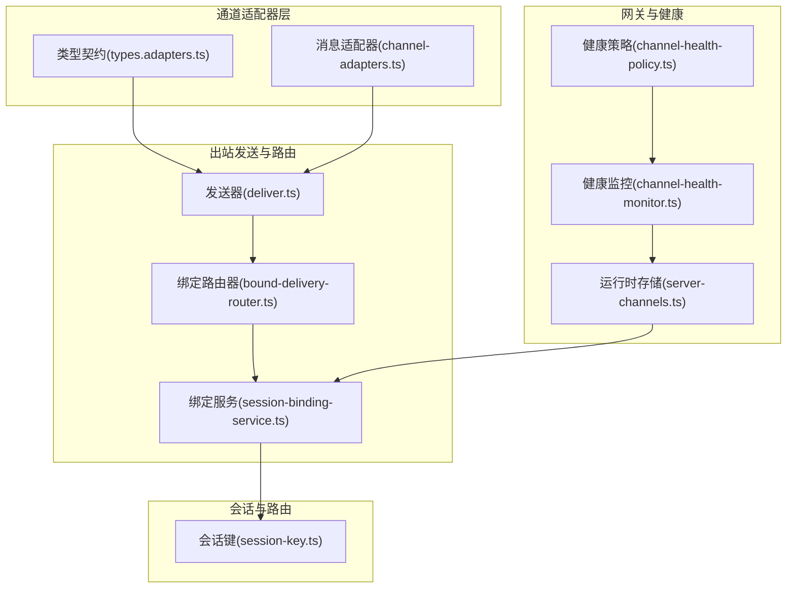
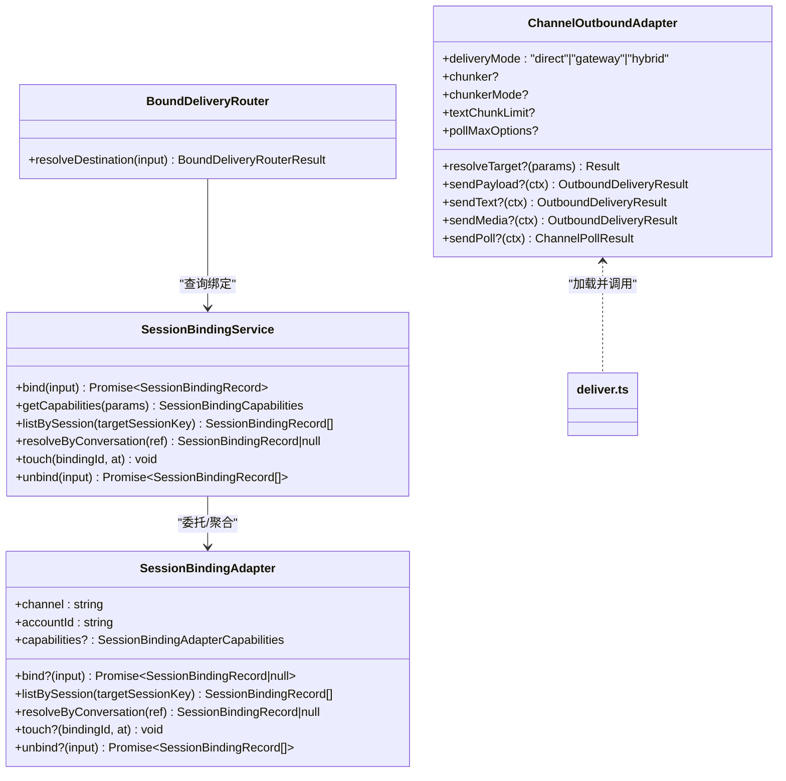
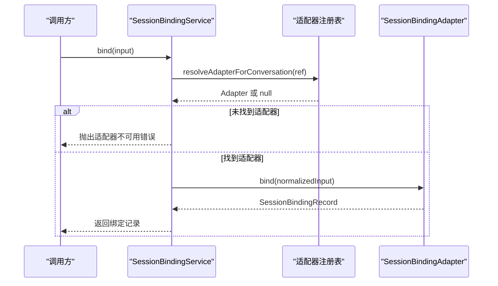
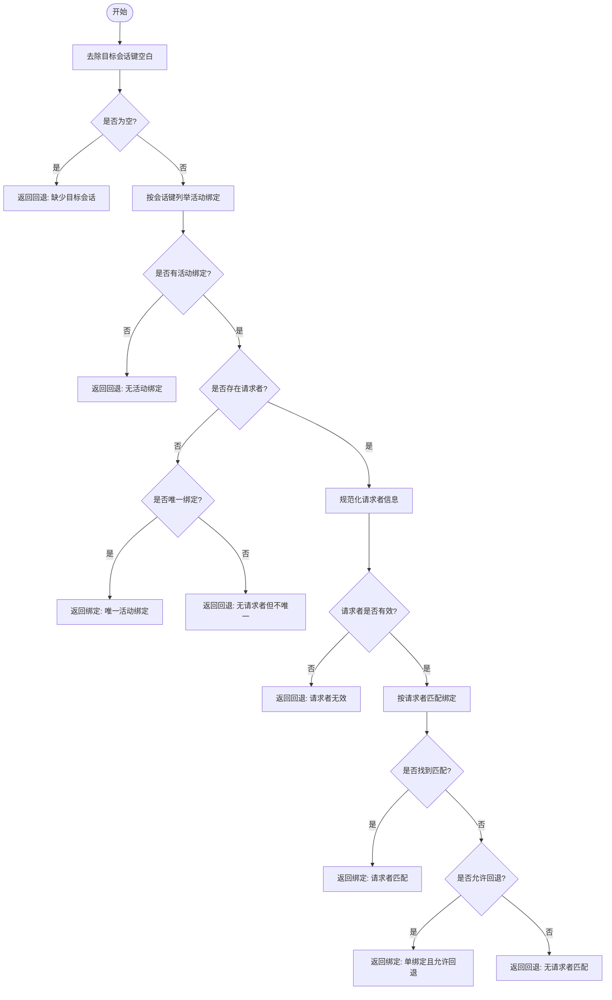
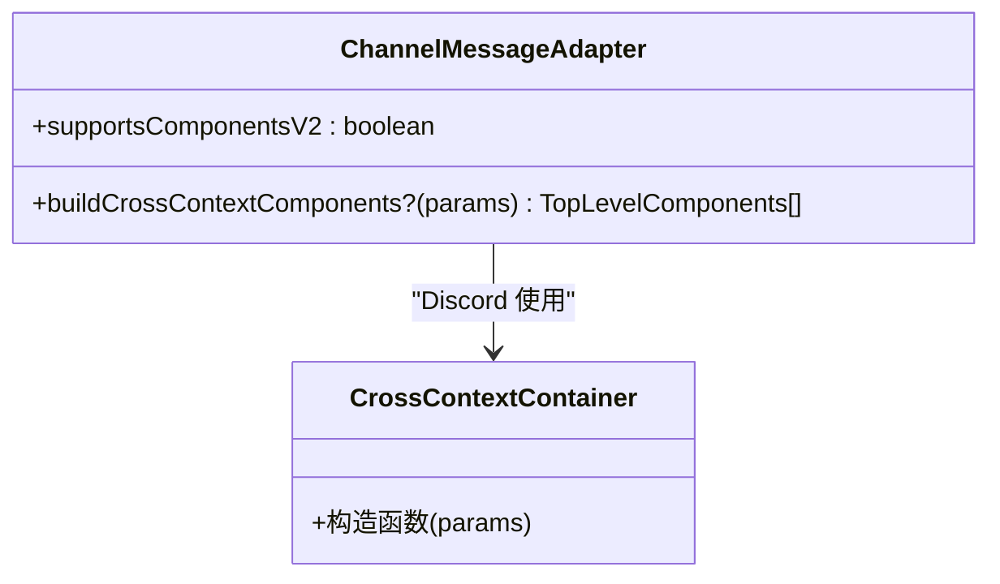
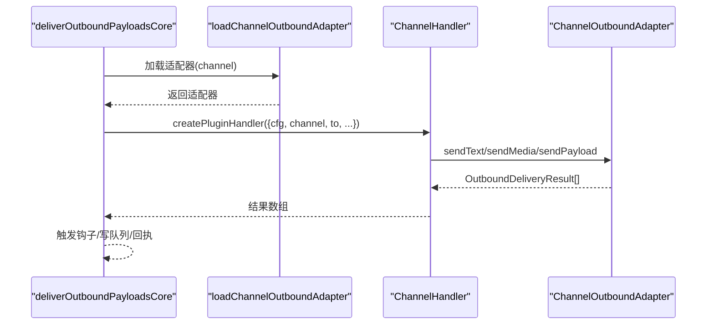
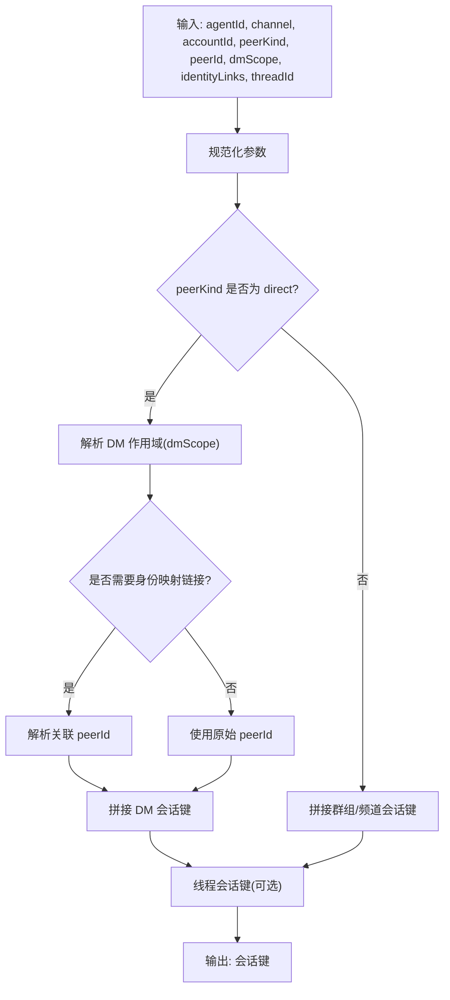
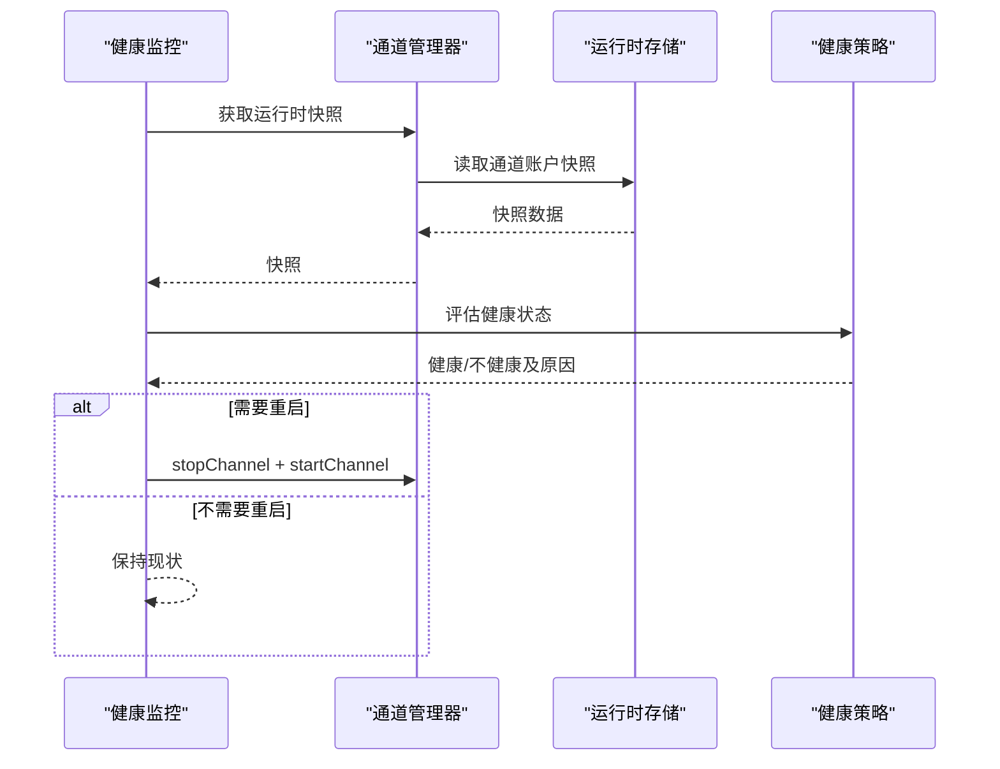
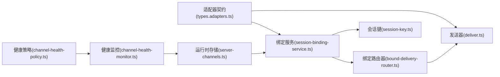

# 通道架构设计

<cite>
**本文引用的文件**
- [session-binding-service.ts](file://src/infra/outbound/session-binding-service.ts)
- [bound-delivery-router.ts](file://src/infra/outbound/bound-delivery-router.ts)
- [channel-adapters.ts](file://src/infra/outbound/channel-adapters.ts)
- [types.adapters.ts](file://src/channels/plugins/types.adapters.ts)
- [types.core.ts](file://src/channels/plugins/types.core.ts)
- [deliver.ts](file://src/infra/outbound/deliver.ts)
- [session-key.ts](file://src/routing/session-key.ts)
- [server-channels.ts](file://src/gateway/server-channels.ts)
- [channel-health-monitor.ts](file://src/gateway/channel-health-monitor.ts)
- [channel-health-policy.ts](file://src/gateway/channel-health-policy.ts)
</cite>

## 目录

1. [引言](#引言)
2. [项目结构](#项目结构)
3. [核心组件](#核心组件)
4. [架构总览](#架构总览)
5. [详细组件分析](#详细组件分析)
6. [依赖关系分析](#依赖关系分析)
7. [性能考量](#性能考量)
8. [故障排查指南](#故障排查指南)
9. [结论](#结论)
10. [附录](#附录)

## 引言

本文件系统性阐述 OpenClaw 的通道架构设计，重点覆盖通道适配器的架构模式、注册与发现机制、会话绑定与路由决策、消息发送与目标解析、以及通道生命周期管理与健康监控。文档通过类图、序列图与流程图，帮助开发者快速理解通道系统的整体设计思路与扩展点。

## 项目结构

通道相关代码主要分布在以下模块：

- 适配器与插件接口：channels/plugins/types.\* 定义了通道适配器的统一契约（配置、出站、状态、目录、解析等）。
- 出站发送与路由：infra/outbound 下的 deliver.ts、bound-delivery-router.ts、session-binding-service.ts 等负责消息投递、会话绑定与目标解析。
- 会话键与路由：routing/session-key.ts 提供会话键构建与分类规则，支撑路由与镜像。
- 网关运行时与健康：gateway/server-channels.ts、channel-health-monitor.ts、channel-health-policy.ts 负责通道运行时状态管理与健康检查。

**图表来源**

- [types.adapters.ts:108-125](file://src/channels/plugins/types.adapters.ts#L108-L125)
- [channel-adapters.ts:15-57](file://src/infra/outbound/channel-adapters.ts#L15-L57)
- [deliver.ts:140-202](file://src/infra/outbound/deliver.ts#L140-L202)
- [bound-delivery-router.ts:55-131](file://src/infra/outbound/bound-delivery-router.ts#L55-L131)
- [session-binding-service.ts:198-310](file://src/infra/outbound/session-binding-service.ts#L198-L310)
- [session-key.ts:118-174](file://src/routing/session-key.ts#L118-L174)
- [server-channels.ts:120-147](file://src/gateway/server-channels.ts#L120-L147)
- [channel-health-monitor.ts:76-111](file://src/gateway/channel-health-monitor.ts#L76-L111)
- [channel-health-policy.ts:112-148](file://src/gateway/channel-health-policy.ts#L112-L148)

**章节来源**

- [types.adapters.ts:108-125](file://src/channels/plugins/types.adapters.ts#L108-L125)
- [deliver.ts:140-202](file://src/infra/outbound/deliver.ts#L140-L202)
- [session-binding-service.ts:198-310](file://src/infra/outbound/session-binding-service.ts#L198-L310)
- [bound-delivery-router.ts:55-131](file://src/infra/outbound/bound-delivery-router.ts#L55-L131)
- [session-key.ts:118-174](file://src/routing/session-key.ts#L118-L174)
- [server-channels.ts:120-147](file://src/gateway/server-channels.ts#L120-L147)
- [channel-health-monitor.ts:76-111](file://src/gateway/channel-health-monitor.ts#L76-L111)
- [channel-health-policy.ts:112-148](file://src/gateway/channel-health-policy.ts#L112-L148)

## 核心组件

- 通道适配器接口族：定义配置、出站、状态、目录、解析、安全等适配器契约，统一不同通道的差异化能力。
- 会话绑定服务：抽象通道账户到会话的绑定关系，支持能力查询、绑定、解绑、按会话列举与触达。
- 绑定路由器：基于目标会话键与请求者上下文，从多个绑定中选择最佳目标，支持回退策略。
- 发送器：加载通道出站适配器，执行文本/媒体/投票等消息分发，并处理钩子、分块与回执。
- 会话键构建：标准化 agent 会话键、主会话键、群组历史键与线程会话键，支撑路由与镜像。
- 网关运行时与健康：维护通道运行时快照、重启策略与健康评估。

**章节来源**

- [types.adapters.ts:24-384](file://src/channels/plugins/types.adapters.ts#L24-L384)
- [session-binding-service.ts:70-94](file://src/infra/outbound/session-binding-service.ts#L70-L94)
- [bound-delivery-router.ts:21-23](file://src/infra/outbound/bound-delivery-router.ts#L21-L23)
- [deliver.ts:140-202](file://src/infra/outbound/deliver.ts#L140-L202)
- [session-key.ts:118-174](file://src/routing/session-key.ts#L118-L174)
- [server-channels.ts:120-147](file://src/gateway/server-channels.ts#L120-L147)

## 架构总览

通道架构采用“适配器 + 服务 + 路由 + 发送”的分层设计：

- 适配器层：通过统一接口屏蔽各通道差异，提供配置、出站、状态、目录、解析等能力。
- 服务层：会话绑定服务集中管理绑定生命周期与能力，为路由与发送提供上下文。
- 路由层：绑定路由器在多绑定场景下进行决策，确保消息送达正确通道账户。
- 发送层：发送器根据通道适配器能力进行内容分块、样式处理与媒体发送，并触发钩子事件。

**图表来源**

- [session-binding-service.ts:70-94](file://src/infra/outbound/session-binding-service.ts#L70-L94)
- [bound-delivery-router.ts:21-23](file://src/infra/outbound/bound-delivery-router.ts#L21-L23)
- [types.adapters.ts:108-125](file://src/channels/plugins/types.adapters.ts#L108-L125)
- [deliver.ts:140-202](file://src/infra/outbound/deliver.ts#L140-L202)

**章节来源**

- [session-binding-service.ts:70-94](file://src/infra/outbound/session-binding-service.ts#L70-L94)
- [bound-delivery-router.ts:21-23](file://src/infra/outbound/bound-delivery-router.ts#L21-L23)
- [types.adapters.ts:108-125](file://src/channels/plugins/types.adapters.ts#L108-L125)
- [deliver.ts:140-202](file://src/infra/outbound/deliver.ts#L140-L202)

## 详细组件分析

### 会话绑定服务与适配器注册

会话绑定服务以“通道账户”为维度管理绑定，提供统一的绑定/解绑/列举/触达能力；适配器通过注册表按键（channel:accountId）接入。该设计将“能力声明”与“能力实现”解耦，便于扩展新通道。

**图表来源**

- [session-binding-service.ts:198-254](file://src/infra/outbound/session-binding-service.ts#L198-L254)
- [session-binding-service.ts:169-185](file://src/infra/outbound/session-binding-service.ts#L169-L185)

**章节来源**

- [session-binding-service.ts:148-167](file://src/infra/outbound/session-binding-service.ts#L148-L167)
- [session-binding-service.ts:198-310](file://src/infra/outbound/session-binding-service.ts#L198-L310)

### 绑定路由器与目标解析

绑定路由器根据目标会话键与可选请求者信息，在多个活动绑定中选择最合适的绑定。当存在请求者且能精确匹配到同一通道账户的绑定时优先使用；否则在单绑定或允许回退的条件下选择一个绑定，否则回退。

**图表来源**

- [bound-delivery-router.ts:59-129](file://src/infra/outbound/bound-delivery-router.ts#L59-L129)

**章节来源**

- [bound-delivery-router.ts:29-53](file://src/infra/outbound/bound-delivery-router.ts#L29-L53)
- [bound-delivery-router.ts:59-129](file://src/infra/outbound/bound-delivery-router.ts#L59-L129)

### 通道消息适配器与跨上下文组件

消息适配器用于在不同通道间传递消息时，对 UI 组件进行跨上下文封装。默认适配器不启用组件 V2，特定通道（如 Discord）提供增强组件容器。

**图表来源**

- [channel-adapters.ts:15-57](file://src/infra/outbound/channel-adapters.ts#L15-L57)

**章节来源**

- [channel-adapters.ts:15-57](file://src/infra/outbound/channel-adapters.ts#L15-L57)

### 出站发送与适配器加载

发送器通过通道 ID 加载对应的出站适配器，构建通道上下文后调用 sendText/sendMedia/sendPayload 等方法；同时处理内容分块、样式转换、媒体发送、钩子事件与写前队列。

**图表来源**

- [deliver.ts:140-202](file://src/infra/outbound/deliver.ts#L140-L202)
- [deliver.ts:531-528](file://src/infra/outbound/deliver.ts#L531-L528)

**章节来源**

- [deliver.ts:140-202](file://src/infra/outbound/deliver.ts#L140-L202)
- [deliver.ts:470-528](file://src/infra/outbound/deliver.ts#L470-L528)

### 会话键构建与路由

会话键用于标识一次会话的上下文，支持 agent 主会话、直接对话（DM）、群组/频道、线程等场景。键构建考虑代理 ID、通道、账户、身份映射与线程 ID 等因素。

**图表来源**

- [session-key.ts:118-174](file://src/routing/session-key.ts#L118-L174)
- [session-key.ts:234-253](file://src/routing/session-key.ts#L234-L253)

**章节来源**

- [session-key.ts:118-174](file://src/routing/session-key.ts#L118-L174)
- [session-key.ts:234-253](file://src/routing/session-key.ts#L234-L253)

### 网关运行时与通道生命周期

网关为每个通道维护独立的运行时存储，保存通道账户的快照（连接状态、事件时间、错误等），并提供启动/停止/重启等生命周期操作。健康监控周期性检查通道状态，依据策略决定是否重启。

**图表来源**

- [server-channels.ts:120-147](file://src/gateway/server-channels.ts#L120-L147)
- [channel-health-monitor.ts:76-111](file://src/gateway/channel-health-monitor.ts#L76-L111)
- [channel-health-policy.ts:112-148](file://src/gateway/channel-health-policy.ts#L112-L148)

**章节来源**

- [server-channels.ts:120-147](file://src/gateway/server-channels.ts#L120-L147)
- [channel-health-monitor.ts:76-111](file://src/gateway/channel-health-monitor.ts#L76-L111)
- [channel-health-policy.ts:112-148](file://src/gateway/channel-health-policy.ts#L112-L148)

## 依赖关系分析

- 适配器契约与实现解耦：通道适配器通过统一接口暴露能力，发送器仅依赖适配器契约，降低耦合度。
- 绑定服务聚合适配器：绑定服务集中管理适配器注册与能力查询，避免上层重复逻辑。
- 路由与绑定服务协作：绑定路由器依赖绑定服务提供的活动绑定列表与能力，保证路由决策的准确性。
- 运行时与健康策略：运行时存储承载通道状态，健康策略基于状态与阈值做出重启决策，形成闭环。

**图表来源**

- [types.adapters.ts:108-125](file://src/channels/plugins/types.adapters.ts#L108-L125)
- [deliver.ts:140-202](file://src/infra/outbound/deliver.ts#L140-L202)
- [session-binding-service.ts:198-310](file://src/infra/outbound/session-binding-service.ts#L198-L310)
- [bound-delivery-router.ts:55-131](file://src/infra/outbound/bound-delivery-router.ts#L55-L131)
- [session-key.ts:118-174](file://src/routing/session-key.ts#L118-L174)
- [server-channels.ts:120-147](file://src/gateway/server-channels.ts#L120-L147)
- [channel-health-monitor.ts:76-111](file://src/gateway/channel-health-monitor.ts#L76-L111)
- [channel-health-policy.ts:112-148](file://src/gateway/channel-health-policy.ts#L112-L148)

**章节来源**

- [types.adapters.ts:108-125](file://src/channels/plugins/types.adapters.ts#L108-L125)
- [deliver.ts:140-202](file://src/infra/outbound/deliver.ts#L140-L202)
- [session-binding-service.ts:198-310](file://src/infra/outbound/session-binding-service.ts#L198-L310)
- [bound-delivery-router.ts:55-131](file://src/infra/outbound/bound-delivery-router.ts#L55-L131)
- [session-key.ts:118-174](file://src/routing/session-key.ts#L118-L174)
- [server-channels.ts:120-147](file://src/gateway/server-channels.ts#L120-L147)
- [channel-health-monitor.ts:76-111](file://src/gateway/channel-health-monitor.ts#L76-L111)
- [channel-health-policy.ts:112-148](file://src/gateway/channel-health-policy.ts#L112-L148)

## 性能考量

- 分块与限流：发送器按通道能力与配置限制进行文本分块，避免超长消息导致失败；部分通道（如 Telegram）有额外长度限制。
- 写前队列：发送前持久化待发消息，成功后确认清理，失败则标记重试，提升可靠性与崩溃恢复能力。
- 并发与中断：发送过程支持 AbortSignal 中断，避免长时间阻塞；媒体与文本发送路径分别处理，减少冗余逻辑。
- 健康监控节流：健康监控具备冷却周期与重启频率限制，防止频繁重启造成抖动。

[本节为通用性能建议，无需具体文件引用]

## 故障排查指南

- 适配器不可用：若绑定服务抛出“适配器不可用”，检查通道账户键是否正确注册，或适配器是否实现 bind/unbind。
- 绑定能力不支持：若提示“绑定能力不支持”，检查适配器 capabilities 与 bind/unbind 方法是否满足要求。
- 目标解析失败：绑定路由器返回回退时，确认目标会话键是否有效、请求者信息是否完整，以及是否存在唯一绑定。
- 发送失败：检查通道适配器是否实现 sendText/sendMedia/sendPayload；关注钩子取消与内容清洗逻辑。
- 健康问题：健康监控判定“过期事件/断开/未运行”时，查看通道快照中的 lastEventAt/connected 等字段，结合策略决定重启或告警。

**章节来源**

- [session-binding-service.ts:204-252](file://src/infra/outbound/session-binding-service.ts#L204-L252)
- [bound-delivery-router.ts:61-128](file://src/infra/outbound/bound-delivery-router.ts#L61-L128)
- [deliver.ts:470-528](file://src/infra/outbound/deliver.ts#L470-L528)
- [channel-health-policy.ts:112-148](file://src/gateway/channel-health-policy.ts#L112-L148)

## 结论

OpenClaw 的通道架构通过“适配器契约 + 绑定服务 + 路由 + 发送”的分层设计，实现了对多通道的一致抽象与灵活扩展。会话绑定与目标解析确保消息在正确的通道账户中被可靠投递；运行时与健康监控保障通道生命周期的稳定与可观测。该设计既便于内置通道的深度集成，也为外部插件提供了清晰的扩展边界。

[本节为总结性内容，无需具体文件引用]

## 附录

- 关键类型与职责速览
  - 通道适配器：统一暴露配置、出站、状态、目录、解析、安全等能力。
  - 会话绑定服务：管理绑定生命周期与能力，提供按会话查询与触达。
  - 绑定路由器：在多绑定场景下进行路由决策，支持回退策略。
  - 发送器：加载适配器并执行消息分发，处理分块、样式与钩子。
  - 会话键：标准化会话标识，支撑路由与镜像。
  - 网关运行时与健康：维护通道快照与重启策略，保障稳定性。

**章节来源**

- [types.adapters.ts:24-384](file://src/channels/plugins/types.adapters.ts#L24-L384)
- [session-binding-service.ts:70-94](file://src/infra/outbound/session-binding-service.ts#L70-L94)
- [bound-delivery-router.ts:21-23](file://src/infra/outbound/bound-delivery-router.ts#L21-L23)
- [deliver.ts:140-202](file://src/infra/outbound/deliver.ts#L140-L202)
- [session-key.ts:118-174](file://src/routing/session-key.ts#L118-L174)
- [server-channels.ts:120-147](file://src/gateway/server-channels.ts#L120-L147)
- [channel-health-monitor.ts:76-111](file://src/gateway/channel-health-monitor.ts#L76-L111)
- [channel-health-policy.ts:112-148](file://src/gateway/channel-health-policy.ts#L112-L148)
