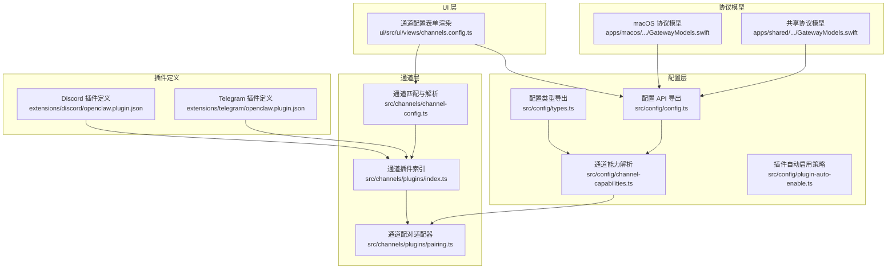
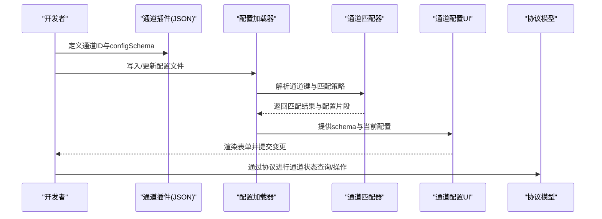
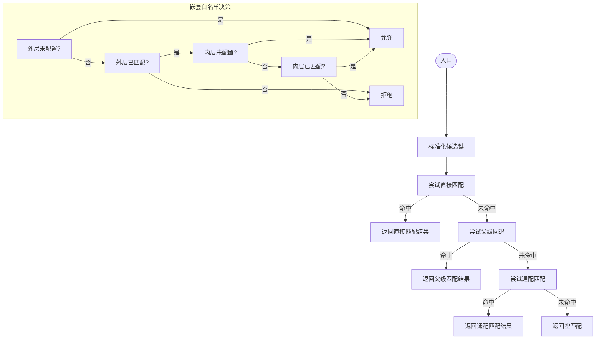
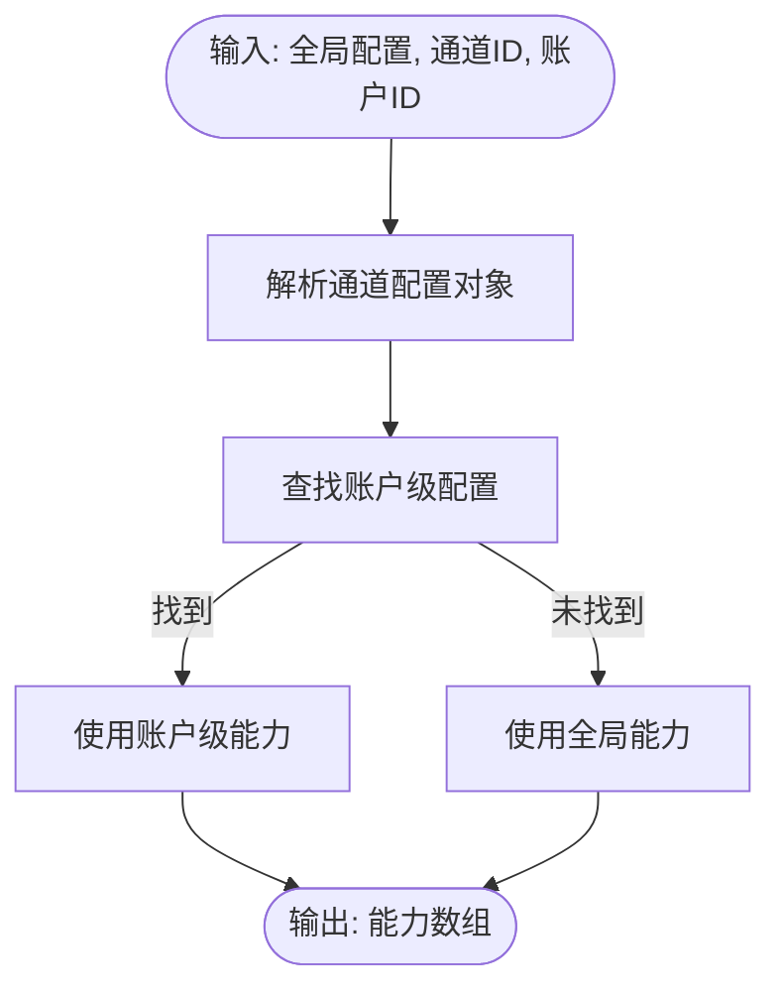
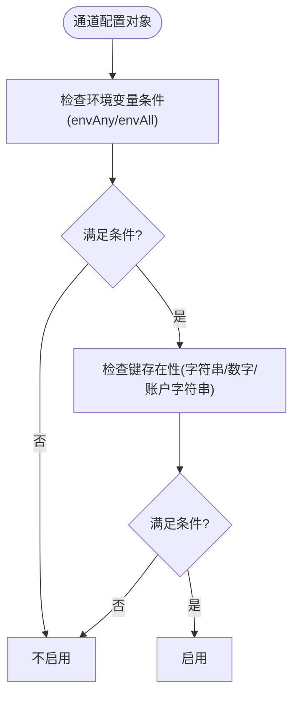
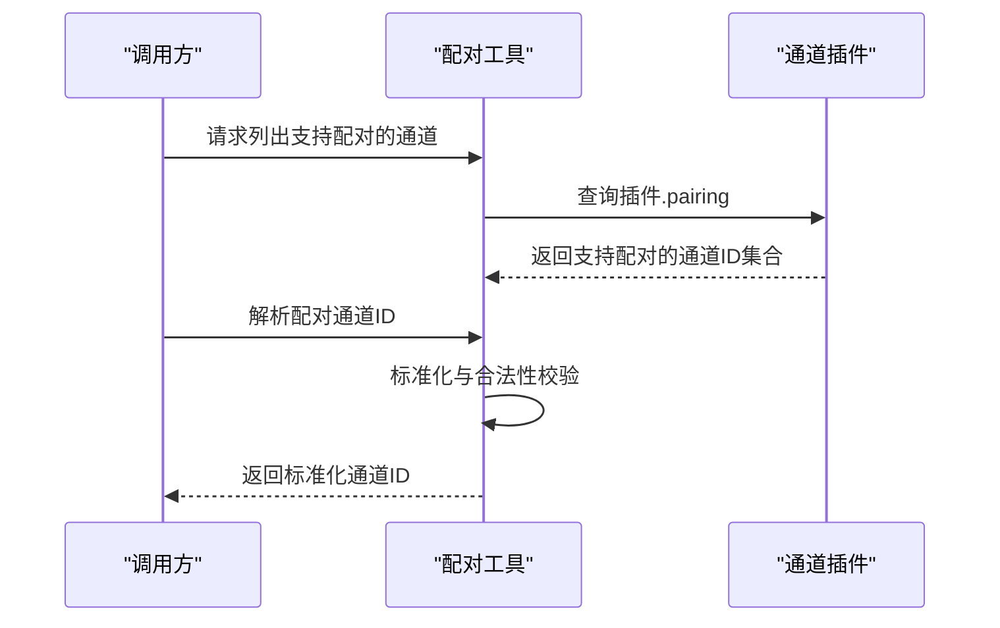
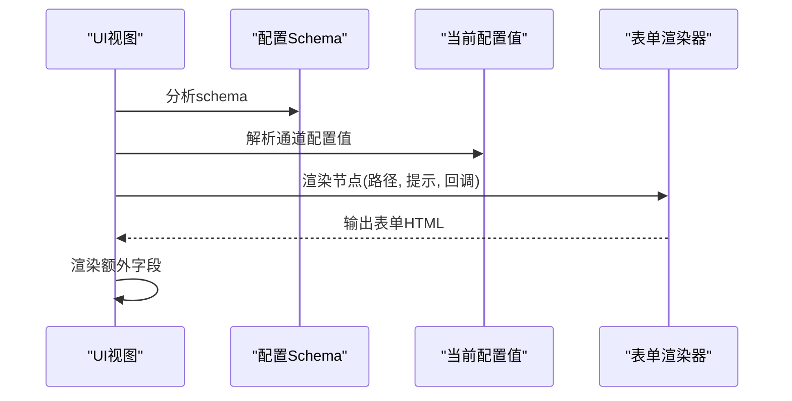
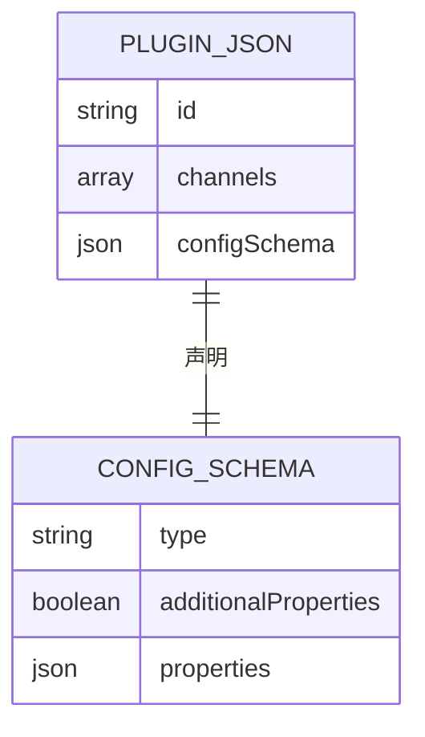
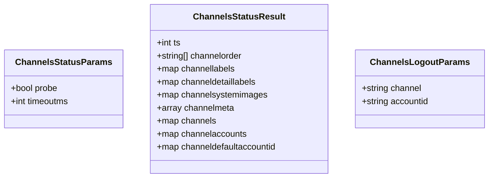
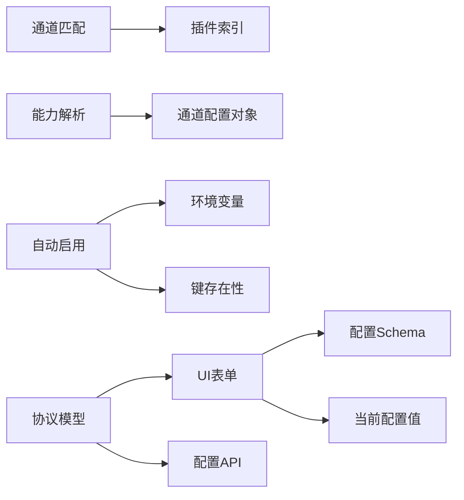

# 通道配置

<cite>
**本文引用的文件**
- [src/config/types.ts](file://src/config/types.ts)
- [src/config/config.ts](file://src/config/config.ts)
- [src/channels/channel-config.ts](file://src/channels/channel-config.ts)
- [src/channels/plugins/index.ts](file://src/channels/plugins/index.ts)
- [src/channels/plugins/pairing.ts](file://src/channels/plugins/pairing.ts)
- [src/config/channel-capabilities.ts](file://src/config/channel-capabilities.ts)
- [src/config/plugin-auto-enable.ts](file://src/config/plugin-auto-enable.ts)
- [scripts/check-channel-agnostic-boundaries.mjs](file://scripts/check-channel-agnostic-boundaries.mjs)
- [ui/src/ui/views/channels.config.ts](file://ui/src/ui/views/channels.config.ts)
- [extensions/discord/openclaw.plugin.json](file://extensions/discord/openclaw.plugin.json)
- [extensions/telegram/openclaw.plugin.json](file://extensions/telegram/openclaw.plugin.json)
- [apps/macos/Sources/OpenClawProtocol/GatewayModels.swift](file://apps/macos/Sources/OpenClawProtocol/GatewayModels.swift)
- [apps/shared/OpenClawKit/Sources/OpenClawProtocol/GatewayModels.swift](file://apps/shared/OpenClawKit/Sources/OpenClawProtocol/GatewayModels.swift)
- [src/config/config.plugin-validation.test.ts](file://src/config/config.plugin-validation.test.ts)
- [src/config/config.legacy-config-detection.rejects-routing-allowfrom.test.ts](file://src/config/config.legacy-config-detection.rejects-routing-allowfrom.test.ts)
</cite>

## 目录

1. [简介](#简介)
2. [项目结构](#项目结构)
3. [核心组件](#核心组件)
4. [架构总览](#架构总览)
5. [详细组件分析](#详细组件分析)
6. [依赖关系分析](#依赖关系分析)
7. [性能考量](#性能考量)
8. [故障排除指南](#故障排除指南)
9. [结论](#结论)
10. [附录](#附录)

## 简介

本文件系统性阐述 OpenClaw 的“通道配置”体系，覆盖以下方面：

- 通道配置的参数设置、能力声明与约束规则
- 配置文件格式、环境变量注入与动态配置更新机制
- 常见配置场景、最佳实践与故障排除
- 配置模板与验证规则，帮助正确配置各类通道

通道在系统中以“插件 + 配置”的方式组织：每个通道由一个插件声明其支持的通道 ID，并通过插件的配置模式（configSchema）描述可配置项；运行时通过统一的配置系统加载、校验并应用这些配置。

## 项目结构

围绕通道配置的关键目录与文件：

- 配置类型与导出：src/config/types.ts 汇总导出各模块类型，包括通道相关类型
- 通道匹配与解析：src/channels/channel-config.ts 提供通道键候选构建、通配匹配、父子回退等能力
- 插件与通道：src/channels/plugins/index.ts 列举通道插件；src/channels/plugins/pairing.ts 提供配对能力解析
- 能力与自动启用：src/config/channel-capabilities.ts 解析通道能力；src/config/plugin-auto-enable.ts 定义基于环境变量与键值的自动启用策略
- UI 表单渲染：ui/src/ui/views/channels.config.ts 将通道配置映射为表单并渲染额外字段
- 插件定义与模式：extensions/\*/openclaw.plugin.json 声明通道 ID 与 configSchema
- 协议模型：apps/\*/Sources/OpenClawProtocol/GatewayModels.swift 中包含通道状态与操作相关的数据模型
- 校验测试：src/config/config.plugin-validation.test.ts 与 config.legacy-config-detection.\*.test.ts 展示配置验证与兼容性规则

**图表来源**

- [src/config/types.ts:1-36](file://src/config/types.ts#L1-L36)
- [src/config/config.ts:1-29](file://src/config/config.ts#L1-L29)
- [src/config/channel-capabilities.ts:34-67](file://src/config/channel-capabilities.ts#L34-L67)
- [src/config/plugin-auto-enable.ts:44-84](file://src/config/plugin-auto-enable.ts#L44-L84)
- [src/channels/channel-config.ts:1-183](file://src/channels/channel-config.ts#L1-L183)
- [src/channels/plugins/index.ts](file://src/channels/plugins/index.ts)
- [src/channels/plugins/pairing.ts:1-49](file://src/channels/plugins/pairing.ts#L1-L49)
- [ui/src/ui/views/channels.config.ts:1-116](file://ui/src/ui/views/channels.config.ts#L1-L116)
- [extensions/discord/openclaw.plugin.json:1-10](file://extensions/discord/openclaw.plugin.json#L1-L10)
- [extensions/telegram/openclaw.plugin.json:1-10](file://extensions/telegram/openclaw.plugin.json#L1-L10)
- [apps/macos/Sources/OpenClawProtocol/GatewayModels.swift:1880-1951](file://apps/macos/Sources/OpenClawProtocol/GatewayModels.swift#L1880-L1951)
- [apps/shared/OpenClawKit/Sources/OpenClawProtocol/GatewayModels.swift:1880-1951](file://apps/shared/OpenClawKit/Sources/OpenClawProtocol/GatewayModels.swift#L1880-L1951)

**章节来源**

- [src/config/types.ts:1-36](file://src/config/types.ts#L1-L36)
- [src/config/config.ts:1-29](file://src/config/config.ts#L1-L29)
- [src/channels/channel-config.ts:1-183](file://src/channels/channel-config.ts#L1-L183)
- [src/channels/plugins/index.ts](file://src/channels/plugins/index.ts)
- [src/channels/plugins/pairing.ts:1-49](file://src/channels/plugins/pairing.ts#L1-L49)
- [src/config/channel-capabilities.ts:34-67](file://src/config/channel-capabilities.ts#L34-L67)
- [src/config/plugin-auto-enable.ts:44-84](file://src/config/plugin-auto-enable.ts#L44-L84)
- [ui/src/ui/views/channels.config.ts:1-116](file://ui/src/ui/views/channels.config.ts#L1-L116)
- [extensions/discord/openclaw.plugin.json:1-10](file://extensions/discord/openclaw.plugin.json#L1-L10)
- [extensions/telegram/openclaw.plugin.json:1-10](file://extensions/telegram/openclaw.plugin.json#L1-L10)
- [apps/macos/Sources/OpenClawProtocol/GatewayModels.swift:1880-1951](file://apps/macos/Sources/OpenClawProtocol/GatewayModels.swift#L1880-L1951)
- [apps/shared/OpenClawKit/Sources/OpenClawProtocol/GatewayModels.swift:1880-1951](file://apps/shared/OpenClawKit/Sources/OpenClawProtocol/GatewayModels.swift#L1880-L1951)

## 核心组件

- 通道匹配与解析：提供通道键标准化、通配匹配、父子回退、嵌套白名单决策等能力，确保配置解析的灵活性与一致性
- 通道能力解析：从全局或账户级配置中提取通道能力集合，用于控制功能开关与行为
- 插件自动启用策略：根据环境变量与键值存在性决定是否自动启用某通道
- 通道配对适配器：声明通道是否支持配对流程，并提供解析与校验
- UI 表单渲染：将通道配置映射为可编辑表单，同时渲染额外字段（如群组策略、流式模式、私聊策略）
- 插件定义与模式：每个通道插件在 JSON 中声明其通道 ID 与 configSchema，作为配置校验的基础

**章节来源**

- [src/channels/channel-config.ts:1-183](file://src/channels/channel-config.ts#L1-L183)
- [src/config/channel-capabilities.ts:34-67](file://src/config/channel-capabilities.ts#L34-L67)
- [src/config/plugin-auto-enable.ts:44-84](file://src/config/plugin-auto-enable.ts#L44-L84)
- [src/channels/plugins/pairing.ts:1-49](file://src/channels/plugins/pairing.ts#L1-L49)
- [ui/src/ui/views/channels.config.ts:1-116](file://ui/src/ui/views/channels.config.ts#L1-L116)
- [extensions/discord/openclaw.plugin.json:1-10](file://extensions/discord/openclaw.plugin.json#L1-L10)
- [extensions/telegram/openclaw.plugin.json:1-10](file://extensions/telegram/openclaw.plugin.json#L1-L10)

## 架构总览

通道配置的端到端流程：

- 插件声明通道 ID 与 configSchema
- 运行时加载配置，按通道 ID 匹配并解析配置
- 应用通道能力与自动启用策略
- UI 基于 schema 渲染表单，支持动态更新
- 协议模型支撑跨平台通道状态与操作

**图表来源**

- [extensions/discord/openclaw.plugin.json:1-10](file://extensions/discord/openclaw.plugin.json#L1-L10)
- [extensions/telegram/openclaw.plugin.json:1-10](file://extensions/telegram/openclaw.plugin.json#L1-L10)
- [src/channels/channel-config.ts:1-183](file://src/channels/channel-config.ts#L1-L183)
- [ui/src/ui/views/channels.config.ts:1-116](file://ui/src/ui/views/channels.config.ts#L1-L116)
- [apps/macos/Sources/OpenClawProtocol/GatewayModels.swift:1880-1951](file://apps/macos/Sources/OpenClawProtocol/GatewayModels.swift#L1880-L1951)

## 详细组件分析

### 组件A：通道匹配与解析

职责与特性：

- 标准化通道键（去空格、小写、归一化）
- 构建候选键列表，支持直接匹配、父级回退与通配匹配
- 嵌套白名单决策：外层未配置则默认允许；外层匹配但内层未配置也默认允许；内外均配置则以内层为准
- 支持自定义键归一化函数，提升匹配灵活性

**图表来源**

- [src/channels/channel-config.ts:34-58](file://src/channels/channel-config.ts#L34-L58)
- [src/channels/channel-config.ts:60-80](file://src/channels/channel-config.ts#L60-L80)
- [src/channels/channel-config.ts:82-164](file://src/channels/channel-config.ts#L82-L164)
- [src/channels/channel-config.ts:166-182](file://src/channels/channel-config.ts#L166-L182)

**章节来源**

- [src/channels/channel-config.ts:1-183](file://src/channels/channel-config.ts#L1-L183)

### 组件B：通道能力解析

职责与特性：

- 从全局或账户级配置中解析通道能力集合
- 支持账户级覆盖优先于全局能力
- 返回标准化的能力数组，便于下游使用

**图表来源**

- [src/config/channel-capabilities.ts:34-67](file://src/config/channel-capabilities.ts#L34-L67)

**章节来源**

- [src/config/channel-capabilities.ts:34-67](file://src/config/channel-capabilities.ts#L34-L67)

### 组件C：插件自动启用策略

职责与特性：

- 定义结构化规范：envAny/envAll（任一/全部存在）、字符串键、数字键、账户字符串键
- 通过键存在性与环境变量存在性判断是否启用某通道
- 仅对通道配置根对象生效，避免误判

**图表来源**

- [src/config/plugin-auto-enable.ts:44-84](file://src/config/plugin-auto-enable.ts#L44-L84)

**章节来源**

- [src/config/plugin-auto-enable.ts:44-84](file://src/config/plugin-auto-enable.ts#L44-L84)

### 组件D：通道配对适配器

职责与特性：

- 列出支持配对的通道 ID
- 获取指定通道的配对适配器
- 校验并解析配对通道 ID，确保合法且支持配对

**图表来源**

- [src/channels/plugins/pairing.ts:11-49](file://src/channels/plugins/pairing.ts#L11-L49)

**章节来源**

- [src/channels/plugins/pairing.ts:1-49](file://src/channels/plugins/pairing.ts#L1-L49)

### 组件E：UI 表单渲染（通道配置）

职责与特性：

- 基于 schema 分析与节点解析，渲染通道配置表单
- 支持禁用态、提示信息与路径回调
- 渲染额外字段（如群组策略、流式模式、私聊策略）

**图表来源**

- [ui/src/ui/views/channels.config.ts:85-116](file://ui/src/ui/views/channels.config.ts#L85-L116)

**章节来源**

- [ui/src/ui/views/channels.config.ts:1-116](file://ui/src/ui/views/channels.config.ts#L1-L116)

### 组件F：插件定义与配置模式

职责与特性：

- 每个通道插件在 JSON 中声明其通道 ID 与 configSchema
- configSchema 作为配置校验与 UI 渲染的基础

**图表来源**

- [extensions/discord/openclaw.plugin.json:1-10](file://extensions/discord/openclaw.plugin.json#L1-L10)
- [extensions/telegram/openclaw.plugin.json:1-10](file://extensions/telegram/openclaw.plugin.json#L1-L10)

**章节来源**

- [extensions/discord/openclaw.plugin.json:1-10](file://extensions/discord/openclaw.plugin.json#L1-L10)
- [extensions/telegram/openclaw.plugin.json:1-10](file://extensions/telegram/openclaw.plugin.json#L1-L10)

### 组件G：协议模型（通道状态与操作）

职责与特性：

- 提供通道状态查询、通道列表、账户绑定等数据结构
- 为 UI 与后端交互提供跨平台一致的数据契约

**图表来源**

- [apps/macos/Sources/OpenClawProtocol/GatewayModels.swift:1880-1951](file://apps/macos/Sources/OpenClawProtocol/GatewayModels.swift#L1880-L1951)
- [apps/shared/OpenClawKit/Sources/OpenClawProtocol/GatewayModels.swift:1880-1951](file://apps/shared/OpenClawKit/Sources/OpenClawProtocol/GatewayModels.swift#L1880-L1951)

**章节来源**

- [apps/macos/Sources/OpenClawProtocol/GatewayModels.swift:1880-1951](file://apps/macos/Sources/OpenClawProtocol/GatewayModels.swift#L1880-L1951)
- [apps/shared/OpenClawKit/Sources/OpenClawProtocol/GatewayModels.swift:1880-1951](file://apps/shared/OpenClawKit/Sources/OpenClawProtocol/GatewayModels.swift#L1880-L1951)

## 依赖关系分析

- 通道匹配依赖通道插件索引与通道 ID 规范化
- 能力解析依赖通道配置对象与账户覆盖逻辑
- 自动启用策略依赖环境变量与键存在性检测
- UI 表单依赖配置 schema 与当前配置值
- 协议模型独立于前端，为通道状态与操作提供数据契约

**图表来源**

- [src/channels/channel-config.ts:1-183](file://src/channels/channel-config.ts#L1-L183)
- [src/config/channel-capabilities.ts:34-67](file://src/config/channel-capabilities.ts#L34-L67)
- [src/config/plugin-auto-enable.ts:44-84](file://src/config/plugin-auto-enable.ts#L44-L84)
- [ui/src/ui/views/channels.config.ts:1-116](file://ui/src/ui/views/channels.config.ts#L1-L116)
- [apps/macos/Sources/OpenClawProtocol/GatewayModels.swift:1880-1951](file://apps/macos/Sources/OpenClawProtocol/GatewayModels.swift#L1880-L1951)

**章节来源**

- [src/channels/channel-config.ts:1-183](file://src/channels/channel-config.ts#L1-L183)
- [src/config/channel-capabilities.ts:34-67](file://src/config/channel-capabilities.ts#L34-L67)
- [src/config/plugin-auto-enable.ts:44-84](file://src/config/plugin-auto-enable.ts#L44-L84)
- [ui/src/ui/views/channels.config.ts:1-116](file://ui/src/ui/views/channels.config.ts#L1-L116)
- [apps/macos/Sources/OpenClawProtocol/GatewayModels.swift:1880-1951](file://apps/macos/Sources/OpenClawProtocol/GatewayModels.swift#L1880-L1951)

## 性能考量

- 通道匹配与解析采用一次性扫描与缓存策略，避免重复计算
- 自动启用策略仅在配置加载阶段执行，减少运行时开销
- UI 表单渲染按需解析 schema 节点，降低内存占用
- 协议模型保持轻量结构，避免序列化/反序列化瓶颈

## 故障排除指南

- 通道 ID 不合法
  - 现象：解析配对通道时报错
  - 排查：确认通道 ID 已在插件声明中注册，且支持配对
  - 参考
    - [src/channels/plugins/pairing.ts:31-49](file://src/channels/plugins/pairing.ts#L31-L49)
- 配置 schema 缺失
  - 现象：UI 显示“Schema 不可用，请使用原始视图”
  - 排查：检查插件 JSON 是否包含 configSchema
  - 参考
    - [extensions/discord/openclaw.plugin.json:4-8](file://extensions/discord/openclaw.plugin.json#L4-L8)
    - [extensions/telegram/openclaw.plugin.json:4-8](file://extensions/telegram/openclaw.plugin.json#L4-L8)
- 能力解析为空
  - 现象：通道功能未生效
  - 排查：确认全局或账户级能力配置存在
  - 参考
    - [src/config/channel-capabilities.ts:45-67](file://src/config/channel-capabilities.ts#L45-L67)
- 自动启用失败
  - 现象：期望启用的通道未被加载
  - 排查：检查环境变量与键是否存在
  - 参考
    - [src/config/plugin-auto-enable.ts:78-84](file://src/config/plugin-auto-enable.ts#L78-L84)
- 通道配置兼容性问题
  - 现象：旧版配置字段被拒绝或转换
  - 排查：参考测试用例中的兼容性处理
  - 参考
    - [src/config/config.legacy-config-detection.rejects-routing-allowfrom.test.ts:509-533](file://src/config/config.legacy-config-detection.rejects-routing-allowfrom.test.ts#L509-L533)
- 插件配置校验失败
  - 现象：启用插件时报错
  - 排查：核对插件 entries 结构与字段类型
  - 参考
    - [src/config/config.plugin-validation.test.ts:251-298](file://src/config/config.plugin-validation.test.ts#L251-L298)

**章节来源**

- [src/channels/plugins/pairing.ts:31-49](file://src/channels/plugins/pairing.ts#L31-L49)
- [extensions/discord/openclaw.plugin.json:4-8](file://extensions/discord/openclaw.plugin.json#L4-L8)
- [extensions/telegram/openclaw.plugin.json:4-8](file://extensions/telegram/openclaw.plugin.json#L4-L8)
- [src/config/channel-capabilities.ts:45-67](file://src/config/channel-capabilities.ts#L45-L67)
- [src/config/plugin-auto-enable.ts:78-84](file://src/config/plugin-auto-enable.ts#L78-L84)
- [src/config/config.legacy-config-detection.rejects-routing-allowfrom.test.ts:509-533](file://src/config/config.legacy-config-detection.rejects-routing-allowfrom.test.ts#L509-L533)
- [src/config/config.plugin-validation.test.ts:251-298](file://src/config/config.plugin-validation.test.ts#L251-L298)

## 结论

通道配置体系通过“插件声明 + 统一解析 + 能力覆盖 + 自动启用 + UI 渲染”的闭环，实现了高扩展性与易维护性。遵循本文档的参数设置、能力声明与约束规则，结合模板与验证规则，可有效降低配置错误率并提升运维效率。

## 附录

### 配置文件格式与位置

- 通道配置位于配置对象的 channels 字段下，键为通道 ID，值为该通道的配置对象
- 插件通过 openclaw.plugin.json 声明通道 ID 与 configSchema
- 参考
  - [extensions/discord/openclaw.plugin.json:1-10](file://extensions/discord/openclaw.plugin.json#L1-L10)
  - [extensions/telegram/openclaw.plugin.json:1-10](file://extensions/telegram/openclaw.plugin.json#L1-L10)

**章节来源**

- [extensions/discord/openclaw.plugin.json:1-10](file://extensions/discord/openclaw.plugin.json#L1-L10)
- [extensions/telegram/openclaw.plugin.json:1-10](file://extensions/telegram/openclaw.plugin.json#L1-L10)

### 环境变量注入与动态配置更新

- 环境变量注入：通过插件自动启用策略，依据 envAny/envAll 条件决定是否启用通道
- 动态配置更新：配置 API 支持读取、写入与快照管理，UI 可通过路径回调实时更新
- 参考
  - [src/config/plugin-auto-enable.ts:78-84](file://src/config/plugin-auto-enable.ts#L78-L84)
  - [src/config/config.ts:1-29](file://src/config/config.ts#L1-L29)
  - [ui/src/ui/views/channels.config.ts:103-112](file://ui/src/ui/views/channels.config.ts#L103-L112)

**章节来源**

- [src/config/plugin-auto-enable.ts:78-84](file://src/config/plugin-auto-enable.ts#L78-L84)
- [src/config/config.ts:1-29](file://src/config/config.ts#L1-L29)
- [ui/src/ui/views/channels.config.ts:103-112](file://ui/src/ui/views/channels.config.ts#L103-L112)

### 常见配置场景与最佳实践

- 场景一：启用特定通道并声明能力
  - 步骤：在插件 JSON 中声明通道 ID 与 configSchema；在配置中为该通道设置能力
  - 参考
    - [extensions/discord/openclaw.plugin.json:1-10](file://extensions/discord/openclaw.plugin.json#L1-L10)
    - [src/config/channel-capabilities.ts:45-67](file://src/config/channel-capabilities.ts#L45-L67)
- 场景二：基于环境变量自动启用
  - 步骤：设置 envAny/envAll；确保键存在性满足要求
  - 参考
    - [src/config/plugin-auto-enable.ts:78-84](file://src/config/plugin-auto-enable.ts#L78-L84)
- 场景三：配对通道
  - 步骤：调用配对适配器解析通道 ID；确保通道支持配对
  - 参考
    - [src/channels/plugins/pairing.ts:18-29](file://src/channels/plugins/pairing.ts#L18-L29)

**章节来源**

- [extensions/discord/openclaw.plugin.json:1-10](file://extensions/discord/openclaw.plugin.json#L1-L10)
- [src/config/channel-capabilities.ts:45-67](file://src/config/channel-capabilities.ts#L45-L67)
- [src/config/plugin-auto-enable.ts:78-84](file://src/config/plugin-auto-enable.ts#L78-L84)
- [src/channels/plugins/pairing.ts:18-29](file://src/channels/plugins/pairing.ts#L18-L29)

### 验证规则与模板

- 验证规则
  - 插件配置校验：支持 webhookSecurity、streaming 等字段
  - 兼容性处理：拒绝旧版路由/allowFrom 配置
  - 参考
    - [src/config/config.plugin-validation.test.ts:251-298](file://src/config/config.plugin-validation.test.ts#L251-L298)
    - [src/config/config.legacy-config-detection.rejects-routing-allowfrom.test.ts:509-533](file://src/config/config.legacy-config-detection.rejects-routing-allowfrom.test.ts#L509-L533)
- 配置模板（结构示意）
  - 通道 ID -> 配置对象（含能力、策略、附加字段）
  - 插件 JSON -> 声明通道 ID 与 configSchema
  - 参考
    - [extensions/discord/openclaw.plugin.json:1-10](file://extensions/discord/openclaw.plugin.json#L1-L10)
    - [extensions/telegram/openclaw.plugin.json:1-10](file://extensions/telegram/openclaw.plugin.json#L1-L10)

**章节来源**

- [src/config/config.plugin-validation.test.ts:251-298](file://src/config/config.plugin-validation.test.ts#L251-L298)
- [src/config/config.legacy-config-detection.rejects-routing-allowfrom.test.ts:509-533](file://src/config/config.legacy-config-detection.rejects-routing-allowfrom.test.ts#L509-L533)
- [extensions/discord/openclaw.plugin.json:1-10](file://extensions/discord/openclaw.plugin.json#L1-L10)
- [extensions/telegram/openclaw.plugin.json:1-10](file://extensions/telegram/openclaw.plugin.json#L1-L10)
