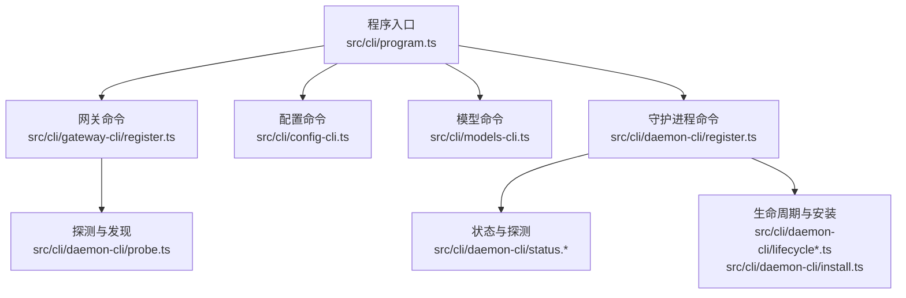
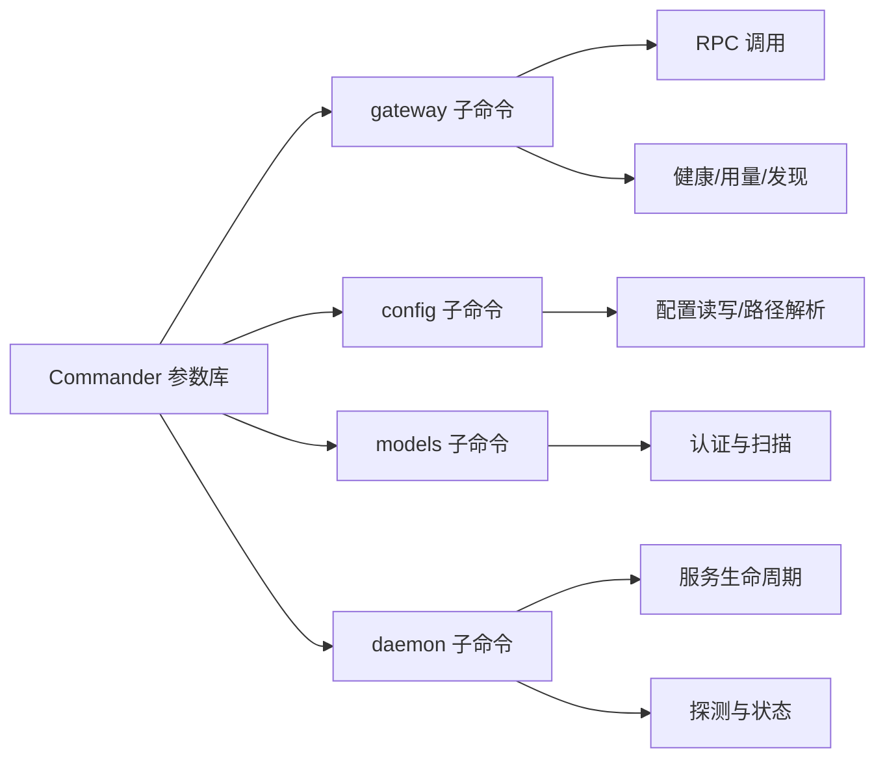

# CLI命令参考

<cite>
**本文引用的文件**
- [src/cli/program.ts](file://src/cli/program.ts)
- [src/cli/gateway-cli.ts](file://src/cli/gateway-cli.ts)
- [src/cli/gateway-cli/register.ts](file://src/cli/gateway-cli/register.ts)
- [src/cli/config-cli.ts](file://src/cli/config-cli.ts)
- [src/cli/models-cli.ts](file://src/cli/models-cli.ts)
- [src/cli/daemon-cli.ts](file://src/cli/daemon-cli.ts)
- [src/cli/daemon-cli/register.ts](file://src/cli/daemon-cli/register.ts)
- [src/cli/daemon-cli/runners.ts](file://src/cli/daemon-cli/runners.ts)
- [src/cli/daemon-cli/status.ts](file://src/cli/daemon-cli/status.ts)
- [src/cli/daemon-cli/status.print.ts](file://src/cli/daemon-cli/status.print.ts)
- [src/cli/daemon-cli/status.gather.ts](file://src/cli/daemon-cli/status.gather.ts)
- [src/cli/daemon-cli/lifecycle.ts](file://src/cli/daemon-cli/lifecycle.ts)
- [src/cli/daemon-cli/install.ts](file://src/cli/daemon-cli/install.ts)
- [src/cli/daemon-cli/probe.ts](file://src/cli/daemon-cli/probe.ts)
- [src/cli/daemon-cli/types.ts](file://src/cli/daemon-cli/types.ts)
- [src/cli/daemon-cli/response.ts](file://src/cli/daemon-cli/response.ts)
- [src/cli/daemon-cli/shared.ts](file://src/cli/daemon-cli/shared.ts)
- [src/cli/daemon-cli/shared.test.ts](file://src/cli/daemon-cli/shared.test.ts)
- [src/cli/daemon-cli/lifecycle-core.ts](file://src/cli/daemon-cli/lifecycle-core.ts)
- [src/cli/daemon-cli/lifecycle-core.config-guard.test.ts](file://src/cli/daemon-cli/lifecycle-core.config-guard.test.ts)
- [src/cli/daemon-cli/lifecycle-core.test.ts](file://src/cli/daemon-cli/lifecycle-core.test.ts)
- [src/cli/daemon-cli/lifecycle.test.ts](file://src/cli/daemon-cli/lifecycle.test.ts)
- [src/cli/daemon-cli/lifecycle.ts](file://src/cli/daemon-cli/lifecycle.ts)
- [src/cli/daemon-cli/lifecycle-core.config-guard.test.ts](file://src/cli/daemon-cli/lifecycle-core.config-guard.test.ts)
- [src/cli/daemon-cli/lifecycle-core.test.ts](file://src/cli/daemon-cli/lifecycle-core.test.ts)
- [src/cli/daemon-cli/lifecycle.test.ts](file://src/cli/daemon-cli/lifecycle.test.ts)
- [src/cli/daemon-cli/lifecycle-core.ts](file://src/cli/daemon-cli/lifecycle-core.ts)
- [src/cli/daemon-cli/lifecycle.ts](file://src/cli/daemon-cli/lifecycle.ts)
- [src/cli/daemon-cli/lifecycle-core.config-guard.test.ts](file://src/cli/daemon-cli/lifecycle-core.config-guard.test.ts)
- [src/cli/daemon-cli/lifecycle-core.test.ts](file://src/cli/daemon-cli/lifecycle-core.test.ts)
- [src/cli/daemon-cli/lifecycle.test.ts](file://src/cli/daemon-cli/lifecycle.test.ts)
- [src/cli/daemon-cli/lifecycle-core.ts](file://src/cli/daemon-cli/lifecycle-core.ts)
- [src/cli/daemon-cli/lifecycle.ts](file://src/cli/daemon-cli/lifecycle.ts)
- [src/cli/daemon-cli/lifecycle-core.config-guard.test.ts](file://src/cli/daemon-cli/lifecycle-core.config-guard.test.ts)
- [src/cli/daemon-cli/lifecycle-core.test.ts](file://src/cli/daemon-cli/lifecycle-core.test.ts)
- [src/cli/daemon-cli/lifecycle.test.ts](file://src/cli/daemon-cli/lifecycle.test.ts)
- [src/cli/daemon-cli/lifecycle-core.ts](file://src/cli/daemon-cli/lifecycle-core.ts)
- [src/cli/daemon-cli/lifecycle.ts](file://src/cli/daemon-cli/lifecycle.ts)
- [src/cli/daemon-cli/lifecycle-core.config-guard.test.ts](file://src/cli/daemon-cli/lifecycle-core.config-guard.test.ts)
- [src/cli/daemon-cli/lifecycle-core.test.ts](file://src/cli/daemon-cli/lifecycle-core.test.ts)
- [src/cli/daemon-cli/lifecycle.test.ts](file://src/cli/daemon-cli/lifecycle.test.ts)
- [src/cli/daemon-cli/lifecycle-core.ts](file://src/cli/daemon-cli/lifecycle-core.ts)
- [src/cli/daemon-cli/lifecycle.ts](file://src/cli/daemon-cli/lifecycle.ts)
- [src/cli/daemon-cli/lifecycle-core.config-guard.test.ts](file://src/cli/daemon-cli/lifecycle-core.config-guard.test.ts)
- [src/cli/daemon-cli/lifecycle-core.test.ts](file://src/cli/daemon-cli/lifecycle-core.test.ts)
- [src/cli/daemon-cli/lifecycle.test.ts](file://src/cli/daemon-cli/lifecycle.test.ts)
- [src/cli/daemon-cli/lifecycle-core.ts](file://src/cli/daemon-cli/lifecycle-core.ts)
- [src/cli/daemon-cli/lifecycle.ts](file://src/cli/daemon-cli/lifecycle.ts)
- [src/cli/daemon-cli/lifecycle-core.config-guard.test.ts](file://src/cli/daemon-cli/lifecycle-core.config-guard.test.ts)
- [src/cli/daemon-cli/lifecycle-core.test.ts](file://src/cli/daemon-cli/lifecycle-core.test.ts)
- [src/cli/daemon-cli/lifecycle.test.ts](file://src/cli/daemon-cli/lifecycle.test.ts)
- [src/cli/daemon-cli/lifecycle-core.ts](file://src/cli/daemon-cli/lifecycle-core.ts)
- [src/cli/daemon-cli/lifecycle.ts](file://src/cli/daemon-cli/lifecycle.ts......)
</cite>

## 目录

1. [简介](#简介)
2. [项目结构](#项目结构)
3. [核心组件](#核心组件)
4. [架构总览](#架构总览)
5. [详细组件分析](#详细组件分析)
6. [依赖关系分析](#依赖关系分析)
7. [性能考量](#性能考量)
8. [故障排查指南](#故障排查指南)
9. [结论](#结论)
10. [附录](#附录)

## 简介

本参考文档面向使用 OpenClaw CLI 的用户，系统梳理并解释命令行工具的完整功能与用法，覆盖以下类别：

- 基础命令：gateway、message（消息发送）、onboard（引导）
- 配置管理：config、models、channels（通道）
- 网关控制：daemon、doctor（诊断）、status（状态）

文档提供每个命令的用途、语法、参数、输出格式、典型使用场景、组合建议与常见错误处理方法，兼顾初学者易读性与高级用户的深度细节。

## 项目结构

OpenClaw CLI 采用模块化组织方式，按功能域划分命令注册与执行逻辑：

- 命令入口与程序构建：program.ts
- 网关子命令：gateway-cli.ts、gateway-cli/register.ts
- 配置子命令：config-cli.ts
- 模型子命令：models-cli.ts
- 守护进程/服务子命令：daemon-cli.ts、daemon-cli/register.ts、daemon-cli/runners.ts
- 状态与探测：daemon-cli/status.\*、daemon-cli/probe.ts
- 生命周期与安装：daemon-cli/lifecycle\*.ts、daemon-cli/install.ts
- 类型与响应：daemon-cli/types.ts、daemon-cli/response.ts、daemon-cli/shared.ts

图表来源

- [src/cli/program.ts:1-3](file://src/cli/program.ts#L1-L3)
- [src/cli/gateway-cli/register.ts:1-281](file://src/cli/gateway-cli/register.ts#L1-L281)
- [src/cli/config-cli.ts:1-477](file://src/cli/config-cli.ts#L1-L477)
- [src/cli/models-cli.ts:1-444](file://src/cli/models-cli.ts#L1-L444)
- [src/cli/daemon-cli/register.ts:1-20](file://src/cli/daemon-cli/register.ts#L1-L20)
- [src/cli/daemon-cli/status.ts](file://src/cli/daemon-cli/status.ts)
- [src/cli/daemon-cli/lifecycle.ts](file://src/cli/daemon-cli/lifecycle.ts)
- [src/cli/daemon-cli/install.ts](file://src/cli/daemon-cli/install.ts)
- [src/cli/daemon-cli/probe.ts](file://src/cli/daemon-cli/probe.ts)

章节来源

- [src/cli/program.ts:1-3](file://src/cli/program.ts#L1-L3)

## 核心组件

- 程序入口与构建：通过 program.ts 导出 buildProgram，统一注册各子命令。
- 网关命令组：gateway 子命令提供运行、调用、健康检查、用量统计、探测与发现等功能。
- 配置命令组：config 子命令提供获取/设置/删除配置项、打印配置路径、验证配置等能力。
- 模型命令组：models 子命令提供模型列表、状态、设置默认/图像模型、别名与回退策略管理、扫描与认证配置等。
- 守护进程命令组：daemon 子命令提供服务安装/启动/停止/重启/卸载与状态查询，并内嵌 gateway 子命令以统一服务与网关操作。

章节来源

- [src/cli/gateway-cli.ts:1-2](file://src/cli/gateway-cli.ts#L1-L2)
- [src/cli/gateway-cli/register.ts:1-281](file://src/cli/gateway-cli/register.ts#L1-L281)
- [src/cli/config-cli.ts:1-477](file://src/cli/config-cli.ts#L1-L477)
- [src/cli/models-cli.ts:1-444](file://src/cli/models-cli.ts#L1-L444)
- [src/cli/daemon-cli.ts:1-16](file://src/cli/daemon-cli.ts#L1-L16)
- [src/cli/daemon-cli/register.ts:1-20](file://src/cli/daemon-cli/register.ts#L1-L20)

## 架构总览

下图展示 CLI 主要命令之间的关系与数据流：

```mermaid
graph TB
subgraph "CLI主程序"
P["buildProgram"]
end
subgraph "网关命令组"
G["gateway"]
GR["gateway run"]
GC["gateway call"]
GH["gateway health"]
GU["gateway usage-cost"]
GD["gateway discover"]
GP["gateway probe"]
end
subgraph "配置命令组"
C["config"]
CG["config get"]
CS["config set"]
CU["config unset"]
CF["config file"]
CV["config validate"]
end
subgraph "模型命令组"
M["models"]
ML["models list"]
MS["models status"]
MSE["models set"]
MSI["models set-image"]
MA["models aliases"]
MF["models fallbacks"]
MIF["models image-fallbacks"]
MSC["models scan"]
MO["models auth/order"]
end
subgraph "守护进程命令组"
D["daemon"]
DS["daemon status"]
DI["daemon install/start/stop/restart/uninstall"]
end
P --> G
P --> C
P --> M
P --> D
G --> GR
G --> GC
G --> GH
G --> GU
G --> GD
G --> GP
C --> CG
C --> CS
C --> CU
C --> CF
C --> CV
M --> ML
M --> MS
M --> MSE
M --> MSI
M --> MA
M --> MF
M --> MIF
M --> MSC
M --> MO
D --> DS
D --> DI
```

图表来源

- [src/cli/gateway-cli/register.ts:89-281](file://src/cli/gateway-cli/register.ts#L89-L281)
- [src/cli/config-cli.ts:395-477](file://src/cli/config-cli.ts#L395-L477)
- [src/cli/models-cli.ts:37-444](file://src/cli/models-cli.ts#L37-L444)
- [src/cli/daemon-cli/register.ts:6-19](file://src/cli/daemon-cli/register.ts#L6-L19)

## 详细组件分析

### 命令：gateway

用途：运行、检查与查询 WebSocket 网关；支持直接调用网关 RPC 方法、查看健康状态、用量统计、探测与发现网关。

- 子命令与行为
  - run：前台运行网关
  - status：显示服务状态并探测网关可达性
  - call <method> [--params <json>]：直接调用网关 RPC 方法
  - health：获取网关健康信息
  - usage-cost [--days <天数>]：从会话日志汇总用量成本
  - discover [--timeout <毫秒>] [--json]：通过 Bonjour 发现本地与广域网关
  - probe [--url <URL>|--ssh <目标>|--ssh-identity <路径>|--ssh-auto|--token <令牌>|--password <密码>|--timeout <预算>|--json]：综合探测本地与远程可达性

- 参数与选项
  - 公共选项（可通过父级继承）：--token、--password
  - call：--params JSON 字符串，默认 "{}"
  - usage-cost：--days 默认 30
  - discover：--timeout 默认 2000ms，--json 输出 JSON
  - probe：--url 显式 WebSocket URL；--ssh/--ssh-identity 自动推断或指定 SSH 隧道；--token/--password 应用于全部探测；--timeout 总预算；--json 输出 JSON

- 输出
  - 多数命令支持 --json 输出原始 JSON
  - 健康与用量命令提供富文本美化输出

- 使用示例
  - 运行网关：openclaw gateway run
  - 调用健康：openclaw gateway health
  - 探测网关：openclaw gateway probe --ssh user@host --timeout 3000
  - 发现网关：openclaw gateway discover --timeout 2000

- 错误处理
  - RPC 调用失败时输出错误并退出非零码
  - 探测超时或无结果时提示重试或检查网络

章节来源

- [src/cli/gateway-cli/register.ts:89-281](file://src/cli/gateway-cli/register.ts#L89-L281)

### 命令：config

用途：非交互式配置助手，支持获取/设置/删除配置项、打印配置文件路径、验证配置有效性；不带子命令时进入设置向导。

- 子命令与行为
  - get <path> [--json]：按点号或方括号路径获取值
  - set <path> <value> [--strict-json|--json]：设置值（支持 JSON5 或原始字符串）
  - unset <path>：删除路径对应的键/索引
  - file：打印当前生效配置文件路径
  - validate [--json]：验证配置是否符合模式

- 路径语法
  - 支持点号与方括号混合：如 models.providers["ollama"].apiKey
  - 自动转义与校验，非法段落会报错

- 严格解析
  - --strict-json 或 --json 将启用严格 JSON5 解析，失败则报错

- Ollama 特例
  - 设置 apiKey 时若未存在 ollama 提供商配置，则自动补全默认 baseUrl 与结构

- 使用示例
  - 获取值：openclaw config get models.providers.ollama.apiKey
  - 设置值：openclaw config set models.providers.ollama.apiKey "<密钥>"
  - 删除值：openclaw config unset models.providers.ollama.apiKey
  - 打印路径：openclaw config file
  - 验证配置：openclaw config validate

- 错误处理
  - 路径无效、值解析失败、配置无效时输出错误并退出非零码
  - doctor 提示修复后重试

章节来源

- [src/cli/config-cli.ts:1-477](file://src/cli/config-cli.ts#L1-L477)

### 命令：models

用途：模型发现、扫描与配置，支持查看状态、设置默认模型/图像模型、管理别名与回退策略、认证配置与轮换顺序。

- 子命令与行为
  - list [--all|--local|--provider <名称>|--json|--plain]：列出模型
  - status [--json|--plain|--check|--probe|--probe-provider|--probe-profile|--probe-timeout|--probe-concurrency|--probe-max-tokens|--agent <id>]：查看状态与认证探活
  - set <model>：设置默认模型
  - set-image <model>：设置图像模型
  - aliases：管理模型别名
    - list [--json|--plain]
    - add <alias> <model>
    - remove <alias>
  - fallbacks：管理回退模型
    - list [--json|--plain]
    - add <model>
    - remove <model>
    - clear
  - image-fallbacks：管理图像回退模型（同上）
  - scan [--min-params|--max-age-days|--provider|--max-candidates|--timeout|--concurrency|--no-probe|--yes|--no-input|--set-default|--set-image|--json]：扫描免费模型候选
  - auth/order：管理每 Agent 的认证轮换顺序
    - get --provider <名称> [--agent <id>] [--json]
    - set --provider <名称> [--agent <id>] <profileIds...>
    - clear --provider <名称> [--agent <id>]

- 通用选项
  - --agent <id> 可覆盖默认 Agent 目录环境变量

- 使用示例
  - 查看状态：openclaw models status
  - 设置默认模型：openclaw models set claude-3.5-sonnet
  - 添加别名：openclaw models aliases add s "claude-3.5-sonnet"
  - 扫描候选：openclaw models scan --provider anthropic --set-default

- 错误处理
  - 认证探活失败或过期时可结合 --check 与 --probe 选项定位问题
  - 交互式输入需 TTY 支持（如 login、setup-token、login-github-copilot）

章节来源

- [src/cli/models-cli.ts:1-444](file://src/cli/models-cli.ts#L1-L444)

### 命令：daemon

用途：管理网关服务（launchd/systemd/schtasks），并内嵌 gateway 子命令以便统一服务与网关操作。

- 子命令与行为
  - status：显示服务安装状态并探测网关
  - install/start/stop/restart/uninstall：服务生命周期管理
  - 内嵌 gateway 子命令：run、status、call、health、usage-cost、discover、probe

- 选项
  - --token、--password 可在父级传递给内嵌 gateway 子命令

- 使用示例
  - 启动服务：openclaw daemon start
  - 查看状态：openclaw daemon status
  - 通过服务调用健康：openclaw daemon health

- 错误处理
  - 服务状态异常或网关不可达时，建议结合 gateway probe 与 doctor 诊断

章节来源

- [src/cli/daemon-cli.ts:1-16](file://src/cli/daemon-cli.ts#L1-L16)
- [src/cli/daemon-cli/register.ts:1-20](file://src/cli/daemon-cli/register.ts#L1-L20)

### 命令：doctor（诊断）

用途：诊断配置与运行问题，提供修复建议与健康检查。

- 位置与文档
  - 文档位于 docs/cli/doctor.md 与 docs/gateway/doctor.md
  - 实现位于 src/commands/doctor-\*.ts

- 常见诊断场景
  - 配置文件缺失或格式错误
  - 认证凭据过期或轮换异常
  - 网络连通性与隧道问题
  - 服务安装与权限问题

- 使用建议
  - 在 config validate 失败后运行 doctor 获取修复指引
  - 结合 gateway probe 与 daemon status 组合排查

章节来源

- [docs/cli/doctor.md](file://docs/cli/doctor.md)
- [docs/gateway/doctor.md](file://docs/gateway/doctor.md)
- [src/commands/doctor-config-analysis.test.ts](file://src/commands/doctor-config-analysis.test.ts)
- [src/commands/doctor-bootstrap-size.ts](file://src/commands/doctor-bootstrap-size.ts)
- [src/commands/doctor-completion.ts](file://src/commands/doctor-completion.ts)
- [src/commands/doctor-auth.ts](file://src/commands/doctor-auth.ts)

### 命令：status（状态）

用途：查看网关与服务状态摘要。

- 位置与实现
  - 状态收集与打印位于 src/cli/daemon-cli/status.\* 与 src/cli/daemon-cli/probe.ts
  - 包含本地与远程探测、健康通道、用量成本等汇总

- 使用建议
  - 与 daemon status、gateway probe 协同使用，快速定位问题

章节来源

- [src/cli/daemon-cli/status.ts](file://src/cli/daemon-cli/status.ts)
- [src/cli/daemon-cli/status.print.ts](file://src/cli/daemon-cli/status.print.ts)
- [src/cli/daemon-cli/status.gather.ts](file://src/cli/daemon-cli/status.gather.ts)
- [src/cli/daemon-cli/probe.ts](file://src/cli/daemon-cli/probe.ts)

### 命令：message（消息发送）

用途：向已配置通道发送消息。

- 位置与实现
  - 命令文件未在当前上下文中找到，建议参考通道配置与发送流程
  - 参考通道相关文档与实现以了解消息发送机制

章节来源

- [docs/cli/message.md](file://docs/cli/message.md)

### 命令：onboard（引导）

用途：完成初始设置与设备配对。

- 位置与实现
  - 命令文件未在当前上下文中找到，建议参考引导流程与配对文档

章节来源

- [docs/cli/onboard.md](file://docs/cli/onboard.md)

## 依赖关系分析

- 命令注册依赖 Commander（Command）进行参数解析与帮助生成
- 网关命令依赖 RPC 调用与健康/用量/发现等辅助模块
- 守护进程命令依赖服务生命周期与探测模块
- 配置命令依赖配置读取/写入与路径解析
- 模型命令依赖认证与扫描实现

图表来源

- [src/cli/gateway-cli/register.ts:1-281](file://src/cli/gateway-cli/register.ts#L1-L281)
- [src/cli/config-cli.ts:1-477](file://src/cli/config-cli.ts#L1-L477)
- [src/cli/models-cli.ts:1-444](file://src/cli/models-cli.ts#L1-L444)
- [src/cli/daemon-cli/register.ts:1-20](file://src/cli/daemon-cli/register.ts#L1-L20)

## 性能考量

- 探测与发现
  - discover 与 probe 支持 --timeout 控制整体预算，避免长时间阻塞
  - 并发探测可通过 --probe-concurrency 调整，注意资源占用
- 模型扫描
  - scan 支持 --timeout 与 --concurrency 控制探测耗时
  - --no-probe 可跳过实时探测，仅列出候选，提升速度
- 输出格式
  - --json 适合自动化集成，但可能增加 CPU/内存开销
  - --plain 与 --json 的选择应根据下游处理需求权衡

## 故障排查指南

- 配置问题
  - 使用 config validate 检查配置有效性
  - 若无效，按 doctor 提示修复后重试
- 网络与隧道
  - 使用 gateway probe 结合 --ssh/--ssh-auto 排查远程可达性
  - 指定 --timeout 控制等待时间
- 服务状态
  - 使用 daemon status 查看服务安装与运行状态
  - 结合 gateway status 与 health 进一步定位
- 认证与模型
  - models status --probe 与 --check 快速识别过期或缺失的凭据
  - models auth/order 管理每 Agent 的认证轮换顺序

章节来源

- [src/cli/config-cli.ts:344-393](file://src/cli/config-cli.ts#L344-L393)
- [src/cli/gateway-cli/register.ts:192-209](file://src/cli/gateway-cli/register.ts#L192-L209)
- [src/cli/daemon-cli/status.ts](file://src/cli/daemon-cli/status.ts)
- [src/cli/models-cli.ts:68-115](file://src/cli/models-cli.ts#L68-L115)

## 结论

OpenClaw CLI 提供了从配置管理到网关控制、从模型治理到服务生命周期的完整命令体系。通过组合使用 daemon、gateway、config、models 等命令，用户可以高效完成部署、运维与日常管理工作。建议优先掌握 config validate 与 doctor、gateway probe 与 daemon status 的组合用法，以快速定位与解决问题。

## 附录

- 命令组合最佳实践
  - 初始化：config validate → doctor → daemon install → daemon start
  - 日常运维：daemon status → gateway health → models status --probe
  - 远程排障：gateway probe --ssh/--ssh-auto → gateway discover → gateway usage-cost
  - 配置变更：config set → config validate → daemon restart
- 常见错误
  - 配置无效：使用 config validate 与 doctor 获取修复建议
  - 网关不可达：检查 daemon 状态、网络连通性与隧道参数
  - 认证过期：使用 models auth/order 与 models status --check 定位并更新凭据
