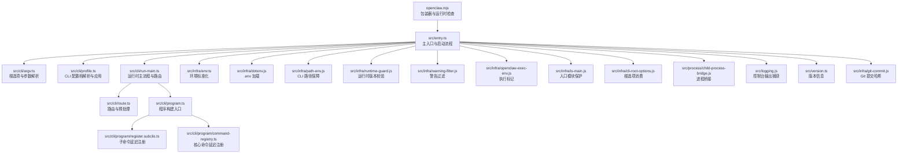
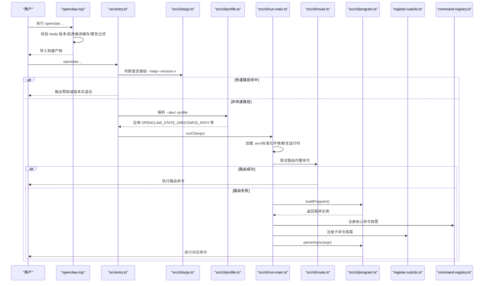
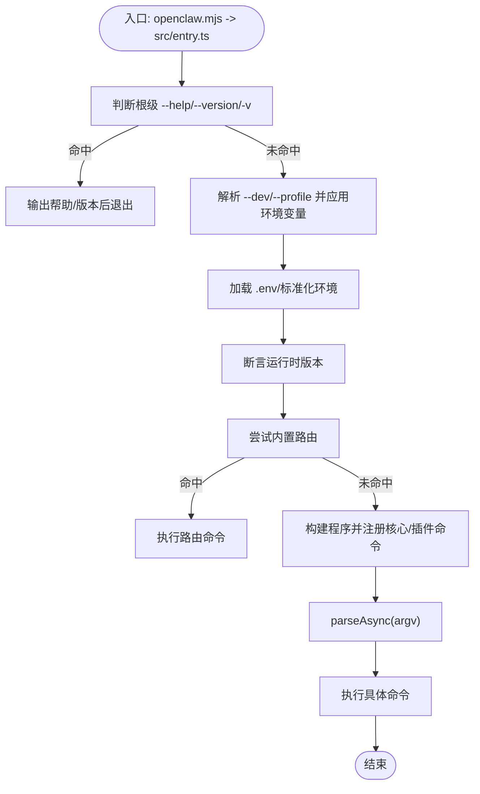
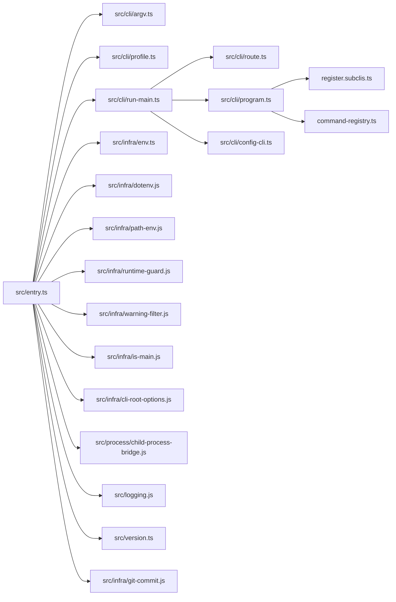

# 基础命令

<cite>
**本文引用的文件**
- [src/entry.ts](file://src/entry.ts)
- [openclaw.mjs](file://openclaw.mjs)
- [src/cli/argv.ts](file://src/cli/argv.ts)
- [src/cli/profile.ts](file://src/cli/profile.ts)
- [src/cli/run-main.ts](file://src/cli/run-main.ts)
- [src/cli/route.ts](file://src/cli/route.ts)
- [src/cli/config-cli.ts](file://src/cli/config-cli.ts)
- [src/cli/program.ts](file://src/cli/program.ts)
- [src/cli/program/register.subclis.ts](file://src/cli/program/register.subclis.ts)
- [src/cli/program/command-registry.ts](file://src/cli/program/command-registry.ts)
- [src/infra/env.ts](file://src/infra/env.ts)
- [src/infra/dotenv.js](file://src/infra/dotenv.js)
- [src/infra/path-env.js](file://src/infra/path-env.js)
- [src/infra/runtime-guard.js](file://src/infra/runtime-guard.js)
- [src/infra/warning-filter.js](file://src/infra/warning-filter.js)
- [src/infra/openclaw-exec-env.js](file://src/infra/openclaw-exec-env.js)
- [src/infra/is-main.js](file://src/infra/is-main.js)
- [src/infra/cli-root-options.js](file://src/infra/cli-root-options.js)
- [src/process/child-process-bridge.js](file://src/process/child-process-bridge.js)
- [src/logging.js](file://src/logging.js)
- [src/version.ts](file://src/version.ts)
- [src/infra/git-commit.js](file://src/infra/git-commit.js)
- [src/commands/configure.js](file://src/commands/configure.js)
</cite>

## 目录

1. [简介](#简介)
2. [项目结构](#项目结构)
3. [核心组件](#核心组件)
4. [架构总览](#架构总览)
5. [详细组件分析](#详细组件分析)
6. [依赖关系分析](#依赖关系分析)
7. [性能考量](#性能考量)
8. [故障排查指南](#故障排查指南)
9. [结论](#结论)
10. [附录](#附录)

## 简介

本章节面向初学者与开发者，系统性地讲解 OpenClaw 的基础 CLI 命令与底层机制，包括：

- 核心命令：openclaw --help、--version、--config（含子命令）等
- 命令行参数解析策略与“根选项”处理
- 配置文件加载与环境变量处理
- 启动流程、错误处理与调试模式
- 实际使用示例与常见问题解决方案

目标是让使用者快速上手，同时为开发者提供深入的技术细节。

## 项目结构

OpenClaw 的 CLI 入口位于 Node 主入口与可选的 JS 包装器之间，通过入口脚本完成环境准备、参数预处理、快速路径（帮助/版本）、以及主 CLI 运行时的调度。

图示来源

- [openclaw.mjs:1-90](file://openclaw.mjs#L1-L90)
- [src/entry.ts:1-195](file://src/entry.ts#L1-L195)
- [src/cli/argv.ts:1-329](file://src/cli/argv.ts#L1-L329)
- [src/cli/profile.ts:1-128](file://src/cli/profile.ts#L1-L128)
- [src/cli/run-main.ts:1-156](file://src/cli/run-main.ts#L1-L156)
- [src/cli/route.ts:1-48](file://src/cli/route.ts#L1-L48)
- [src/cli/program.ts:1-3](file://src/cli/program.ts#L1-L3)
- [src/cli/program/register.subclis.ts:312-359](file://src/cli/program/register.subclis.ts#L312-L359)
- [src/cli/program/command-registry.ts:220-301](file://src/cli/program/command-registry.ts#L220-L301)
- [src/infra/env.ts](file://src/infra/env.ts)
- [src/infra/dotenv.js](file://src/infra/dotenv.js)
- [src/infra/path-env.js](file://src/infra/path-env.js)
- [src/infra/runtime-guard.js](file://src/infra/runtime-guard.js)
- [src/infra/warning-filter.js](file://src/infra/warning-filter.js)
- [src/infra/openclaw-exec-env.js](file://src/infra/openclaw-exec-env.js)
- [src/infra/is-main.js](file://src/infra/is-main.js)
- [src/infra/cli-root-options.js](file://src/infra/cli-root-options.js)
- [src/process/child-process-bridge.js](file://src/process/child-process-bridge.js)
- [src/logging.js](file://src/logging.js)
- [src/version.ts](file://src/version.ts)
- [src/infra/git-commit.js](file://src/infra/git-commit.js)

章节来源

- [src/entry.ts:1-195](file://src/entry.ts#L1-L195)
- [openclaw.mjs:1-90](file://openclaw.mjs#L1-L90)

## 核心组件

- 入口与启动流程
  - 包装器 openclaw.mjs：进行 Node 版本校验、编译缓存启用、警告过滤加载，并尝试导入构建产物。
  - 主入口 src/entry.ts：设置进程标题、安装警告过滤、标准化环境、处理颜色开关、实验性警告抑制、快速路径（帮助/版本）、解析 CLI Profile 参数并应用、最终进入 runCli。
- 参数解析与根选项
  - src/cli/argv.ts：定义帮助/版本标志集合，支持别名 -v；提供根选项消费、位置参数提取、命令路径解析、正整数与布尔标志检测等。
- CLI Profile 与环境变量
  - src/cli/profile.ts：解析 --dev 与 --profile，校验名称合法性，按 profile 推导 OPENCLAW_STATE_DIR 与 OPENCLAW_CONFIG_PATH，并在 dev 档下设置默认网关端口。
- 运行时主流程
  - src/cli/run-main.ts：加载 .env、标准化环境、必要时确保 CLI 在 PATH 中、断言运行时版本、路由优先、构建程序、注册核心/插件命令、解析 argv 并执行。
- 路由与预处理
  - src/cli/route.ts：在非帮助/版本场景下尝试路由到内置命令，准备横切逻辑（横幅、配置就绪、插件加载）。
- 程序构建与命令注册
  - src/cli/program.ts：暴露 buildProgram。
  - 子命令延迟注册：register.subclis.ts 与 command-registry.ts 支持按需注册，避免启动时全量加载。
- 配置命令族
  - src/cli/config-cli.ts：提供 config get/set/unset/file/validate 子命令，支持路径解析、值解析、写入与校验。

章节来源

- [src/entry.ts:1-195](file://src/entry.ts#L1-L195)
- [src/cli/argv.ts:1-329](file://src/cli/argv.ts#L1-L329)
- [src/cli/profile.ts:1-128](file://src/cli/profile.ts#L1-L128)
- [src/cli/run-main.ts:1-156](file://src/cli/run-main.ts#L1-L156)
- [src/cli/route.ts:1-48](file://src/cli/route.ts#L1-L48)
- [src/cli/program.ts:1-3](file://src/cli/program.ts#L1-L3)
- [src/cli/program/register.subclis.ts:312-359](file://src/cli/program/register.subclis.ts#L312-L359)
- [src/cli/program/command-registry.ts:220-301](file://src/cli/program/command-registry.ts#L220-L301)
- [src/cli/config-cli.ts:1-477](file://src/cli/config-cli.ts#L1-L477)

## 架构总览

下面的序列图展示了 openclaw 基础命令从启动到执行的关键流程，覆盖帮助、版本、配置与通用命令的路径。

图示来源

- [openclaw.mjs:1-90](file://openclaw.mjs#L1-L90)
- [src/entry.ts:128-164](file://src/entry.ts#L128-L164)
- [src/cli/argv.ts:67-106](file://src/cli/argv.ts#L67-L106)
- [src/cli/profile.ts:26-89](file://src/cli/profile.ts#L26-L89)
- [src/cli/run-main.ts:74-151](file://src/cli/run-main.ts#L74-L151)
- [src/cli/route.ts:29-47](file://src/cli/route.ts#L29-L47)
- [src/cli/program.ts:1-3](file://src/cli/program.ts#L1-L3)
- [src/cli/program/register.subclis.ts:341-359](file://src/cli/program/register.subclis.ts#L341-L359)
- [src/cli/program/command-registry.ts:288-301](file://src/cli/program/command-registry.ts#L288-L301)

## 详细组件分析

### 命令行参数解析与根选项

- 根级帮助/版本识别
  - 支持 -h/--help、-V/--version 与 -v 别名；仅当 argv 中未出现子命令作用域的帮助/版本时才视为“根级”。
  - 使用根选项消费器跳过以连字符开头的参数，直到遇到 "--" 或首个非选项位置实参。
- 位置参数与命令路径
  - 提供 getCommandPath/getCommandPathWithRootOptions，用于提取命令路径与位置参数，支持跳过根选项。
- 正整数与布尔标志
  - 提供 getFlagValue/getPositiveIntFlagValue/hasFlag 等工具，统一解析行为。
- 与 Windows argv 规范化
  - 在入口阶段对 argv 进行规范化，保证跨平台一致性。

章节来源

- [src/cli/argv.ts:8-106](file://src/cli/argv.ts#L8-L106)
- [src/cli/argv.ts:145-184](file://src/cli/argv.ts#L145-L184)
- [src/cli/argv.ts:186-189](file://src/cli/argv.ts#L186-L189)
- [src/cli/argv.ts:108-143](file://src/cli/argv.ts#L108-L143)
- [src/cli/argv.ts:276-301](file://src/cli/argv.ts#L276-L301)
- [src/cli/argv.ts:303-329](file://src/cli/argv.ts#L303-L329)
- [src/cli/windows-argv.ts](file://src/cli/windows-argv.ts)

### CLI Profile 与环境变量处理

- Profile 解析
  - 支持 --dev 与 --profile=<name>，禁止二者混用；校验名称合法性；将解析后的 argv 写回进程参数。
- 环境变量应用
  - 自动设置 OPENCLAW_PROFILE，并推导 OPENCLAW_STATE_DIR（默认 ~/.openclaw，dev 档为 ~/.openclaw-dev），若未显式设置则自动填充 OPENCLAW_CONFIG_PATH。
  - dev 档下默认网关端口 OPENCLAW_GATEWAY_PORT=19001。
- 环境标准化与 .env 加载
  - 标准化环境变量键名与值，静默加载 .env 文件，确保后续组件读取一致。

章节来源

- [src/cli/profile.ts:26-89](file://src/cli/profile.ts#L26-L89)
- [src/cli/profile.ts:100-127](file://src/cli/profile.ts#L100-L127)
- [src/infra/env.ts](file://src/infra/env.ts)
- [src/infra/dotenv.js](file://src/infra/dotenv.js)

### 启动流程与快速路径

- 入口模块保护
  - 通过 is-main 机制避免被其他打包方式重复执行。
- 实验性警告抑制
  - 若未显式禁用且未处于特定条件，会以子进程形式重启 CLI 并传递 --disable-warning=ExperimentalWarning，减少启动噪音。
- 颜色与 NO_COLOR
  - 处理 --no-color，设置 NO_COLOR/FORCE_COLOR，影响终端输出。
- 版本与帮助快速路径
  - 根级 --version/-v：直接读取版本与 Git 提交哈希并输出后退出。
  - 根级 --help：构建程序并输出帮助文本。
- 运行时断言与路径保障
  - 断言 Node 版本满足最低要求；必要时确保 CLI 可执行路径可用。

章节来源

- [src/entry.ts:31-44](file://src/entry.ts#L31-L44)
- [src/entry.ts:65-126](file://src/entry.ts#L65-L126)
- [src/entry.ts:128-164](file://src/entry.ts#L128-L164)
- [src/entry.ts:166-193](file://src/entry.ts#L166-L193)
- [src/infra/is-main.js](file://src/infra/is-main.js)
- [src/process/child-process-bridge.js](file://src/process/child-process-bridge.js)
- [src/infra/openclaw-exec-env.js](file://src/infra/openclaw-exec-env.js)
- [src/infra/warning-filter.js](file://src/infra/warning-filter.js)
- [src/infra/runtime-guard.js](file://src/infra/runtime-guard.js)
- [src/version.ts](file://src/version.ts)
- [src/infra/git-commit.js](file://src/infra/git-commit.js)

### 命令执行流程与路由

- 路由优先
  - 在非帮助/版本场景下，先尝试内置路由；若命中则直接执行，不再构建完整程序树。
- 程序构建与命令注册
  - 未命中路由时，构建程序并注册核心命令与插件命令；支持按需延迟注册，提升启动性能。
- 控制台输出捕获
  - 在解析前启用控制台输出捕获，保持 stdout/stderr 行为的同时统一日志格式。

章节来源

- [src/cli/route.ts:29-47](file://src/cli/route.ts#L29-L47)
- [src/cli/run-main.ts:94-151](file://src/cli/run-main.ts#L94-L151)
- [src/cli/program/register.subclis.ts:341-359](file://src/cli/program/register.subclis.ts#L341-L359)
- [src/cli/program/command-registry.ts:288-301](file://src/cli/program/command-registry.ts#L288-L301)
- [src/logging.js](file://src/logging.js)

### 错误处理与调试模式

- 未捕获异常与未处理拒绝
  - 安装未处理拒绝处理器与未捕获异常事件监听，统一格式化输出并优雅退出。
- 调试与横幅
  - 路由层在执行前打印 CLI 横幅与版本信息；支持 --json 抑制 doctor 标准输出。
- 插件与配置准备
  - 在路由前确保配置已就绪，必要时加载插件注册表，保证命令可用性。

章节来源

- [src/cli/run-main.ts:109-112](file://src/cli/run-main.ts#L109-L112)
- [src/cli/route.ts:10-27](file://src/cli/route.ts#L10-L27)

### 基础命令详解

#### openclaw --help

- 行为
  - 识别根级帮助标志后，不进入完整程序构建，直接输出帮助文本并退出。
- 关键点
  - 与子命令作用域的帮助区分，仅当 argv 中未出现子命令时才视为根级帮助。
- 使用建议
  - 用于快速查看所有可用命令与选项概览。

章节来源

- [src/cli/argv.ts:104-106](file://src/cli/argv.ts#L104-L106)
- [src/entry.ts:148-164](file://src/entry.ts#L148-L164)

#### openclaw --version / openclaw -v

- 行为
  - 识别根级版本标志或 -v 别名后，读取版本与 Git 提交哈希并输出，随后退出。
- 关键点
  - 快速路径，不加载完整程序树。
- 使用建议
  - 用于确认当前安装版本与提交信息。

章节来源

- [src/cli/argv.ts:67-106](file://src/cli/argv.ts#L67-L106)
- [src/entry.ts:128-146](file://src/entry.ts#L128-L146)
- [src/version.ts](file://src/version.ts)
- [src/infra/git-commit.js](file://src/infra/git-commit.js)

#### openclaw --config 与 config 子命令族

- 命令族
  - config：无子命令时触发配置向导（sections 参数控制部分章节）。
  - config get <path> [--json]：按点号或方括号路径获取配置值，支持 JSON 输出。
  - config set <path> <value> [--strict-json]：设置配置值，支持严格 JSON5 解析。
  - config unset <path>：移除指定路径的配置项。
  - config file：打印当前生效配置文件路径。
  - config validate [--json]：验证配置有效性。
- 路径与值解析
  - 支持点号与方括号路径（如 models.providers["ollama"]），自动转义与校验。
  - 值解析优先尝试 JSON5，失败则回退为原始字符串；--strict-json 时抛出错误。
- 写入策略
  - 对于某些敏感路径（如 Ollama API Key），在写入前自动补全 Provider 默认项，避免遗漏。
  - 写入采用“保留 $include 与 ENV 解析结果但不合并运行时默认”的策略，防止默认值污染持久化配置。
- 使用建议
  - 使用 validate 检查配置正确性；使用 file 查看配置文件位置；使用 get/set/unset 精确修改配置。

章节来源

- [src/cli/config-cli.ts:395-477](file://src/cli/config-cli.ts#L395-L477)
- [src/cli/config-cli.ts:279-308](file://src/cli/config-cli.ts#L279-L308)
- [src/cli/config-cli.ts:412-415](file://src/cli/config-cli.ts#L412-L415)
- [src/cli/config-cli.ts:433-452](file://src/cli/config-cli.ts#L433-L452)
- [src/cli/config-cli.ts:310-331](file://src/cli/config-cli.ts#L310-L331)
- [src/cli/config-cli.ts:333-342](file://src/cli/config-cli.ts#L333-L342)
- [src/cli/config-cli.ts:344-393](file://src/cli/config-cli.ts#L344-L393)
- [src/commands/configure.js](file://src/commands/configure.js)

### 命令执行流程（代码级）

图示来源

- [openclaw.mjs:1-90](file://openclaw.mjs#L1-L90)
- [src/entry.ts:128-193](file://src/entry.ts#L128-L193)
- [src/cli/run-main.ts:74-151](file://src/cli/run-main.ts#L74-L151)
- [src/cli/route.ts:29-47](file://src/cli/route.ts#L29-L47)

## 依赖关系分析

- 入口层
  - openclaw.mjs 依赖运行时守卫与警告过滤；src/entry.ts 依赖 argv、profile、run-main 与各类基础设施模块。
- 参数与环境
  - argv 依赖根选项消费器；profile 依赖 home 目录解析与环境变量；run-main 依赖 dotenv、env、path-env、runtime-guard。
- 程序构建与注册
  - program 作为入口；register.subclis 与 command-registry 提供延迟注册能力。
- 配置命令
  - config-cli 依赖配置读写、问题格式化、路径解析与值解析。

图示来源

- [src/entry.ts:1-195](file://src/entry.ts#L1-L195)
- [src/cli/argv.ts:1-329](file://src/cli/argv.ts#L1-L329)
- [src/cli/profile.ts:1-128](file://src/cli/profile.ts#L1-L128)
- [src/cli/run-main.ts:1-156](file://src/cli/run-main.ts#L1-L156)
- [src/cli/route.ts:1-48](file://src/cli/route.ts#L1-L48)
- [src/cli/program.ts:1-3](file://src/cli/program.ts#L1-L3)
- [src/cli/program/register.subclis.ts:312-359](file://src/cli/program/register.subclis.ts#L312-L359)
- [src/cli/program/command-registry.ts:220-301](file://src/cli/program/command-registry.ts#L220-L301)
- [src/cli/config-cli.ts:1-477](file://src/cli/config-cli.ts#L1-L477)
- [src/infra/env.ts](file://src/infra/env.ts)
- [src/infra/dotenv.js](file://src/infra/dotenv.js)
- [src/infra/path-env.js](file://src/infra/path-env.js)
- [src/infra/runtime-guard.js](file://src/infra/runtime-guard.js)
- [src/infra/warning-filter.js](file://src/infra/warning-filter.js)
- [src/infra/is-main.js](file://src/infra/is-main.js)
- [src/infra/cli-root-options.js](file://src/infra/cli-root-options.js)
- [src/process/child-process-bridge.js](file://src/process/child-process-bridge.js)
- [src/logging.js](file://src/logging.js)
- [src/version.ts](file://src/version.ts)
- [src/infra/git-commit.js](file://src/infra/git-commit.js)

## 性能考量

- 延迟注册
  - 核心命令与子命令均支持按需注册，避免启动时全量加载，显著降低冷启动时间。
- 快速路径
  - 帮助与版本命令走快速路径，不构建程序树，减少 IO 与解析成本。
- 编译缓存与警告过滤
  - 包装器与入口均尝试启用编译缓存与警告过滤，改善启动体验。
- 路由优先
  - 内置路由命中时直接执行，无需构建程序树。

章节来源

- [src/cli/program/register.subclis.ts:341-359](file://src/cli/program/register.subclis.ts#L341-L359)
- [src/cli/program/command-registry.ts:288-301](file://src/cli/program/command-registry.ts#L288-L301)
- [src/cli/argv.ts:67-106](file://src/cli/argv.ts#L67-L106)
- [src/entry.ts:128-164](file://src/entry.ts#L128-L164)
- [openclaw.mjs:39-45](file://openclaw.mjs#L39-L45)
- [src/cli/route.ts:29-47](file://src/cli/route.ts#L29-L47)

## 故障排查指南

- 启动失败或提示 Node 版本不满足
  - 确认 Node 版本满足最低要求；包装器会给出安装与切换建议。
- 实验性警告干扰
  - 入口会尝试以子进程形式抑制 ExperimentalWarning；若仍出现，检查 NODE_OPTIONS 与执行参数。
- 颜色输出异常
  - 使用 --no-color 设置 NO_COLOR/FORCE_COLOR，避免终端颜色问题。
- 配置无效或路径错误
  - 使用 config validate 检查配置有效性；使用 config file 查看当前配置文件路径；必要时运行 doctor 获取修复建议。
- 子命令未显示或无法解析
  - 确认未误触根级帮助/版本；若为延迟注册，首次执行可能需要稍长启动时间；检查插件是否正确加载。
- 未捕获异常导致崩溃
  - 系统已安装未处理拒绝与未捕获异常处理器，会统一格式化输出并退出；请根据输出定位问题。

章节来源

- [openclaw.mjs:21-36](file://openclaw.mjs#L21-L36)
- [src/entry.ts:65-126](file://src/entry.ts#L65-L126)
- [src/entry.ts:60-63](file://src/entry.ts#L60-L63)
- [src/cli/config-cli.ts:344-393](file://src/cli/config-cli.ts#L344-L393)
- [src/cli/run-main.ts:109-112](file://src/cli/run-main.ts#L109-L112)

## 结论

OpenClaw 的基础 CLI 通过“包装器 + 主入口 + 参数解析 + Profile 应用 + 路由优先 + 延迟注册”的设计，在保证易用性的同时兼顾性能与可扩展性。帮助、版本与配置命令覆盖了日常使用的核心需求；底层机制清晰、可维护性强，适合不同层次的用户与开发者参考与扩展。

## 附录

### 常见使用示例

- 查看帮助
  - openclaw --help
- 查看版本
  - openclaw --version 或 openclaw -v
- 使用特定配置档
  - openclaw --profile=staging <command>
- 配置管理
  - openclaw config validate [--json]
  - openclaw config file
  - openclaw config get <path> [--json]
  - openclaw config set <path> <value> [--strict-json]
  - openclaw config unset <path>
  - openclaw config （无子命令触发配置向导）

章节来源

- [src/cli/argv.ts:104-106](file://src/cli/argv.ts#L104-L106)
- [src/cli/argv.ts:67-106](file://src/cli/argv.ts#L67-L106)
- [src/cli/profile.ts:26-89](file://src/cli/profile.ts#L26-L89)
- [src/cli/config-cli.ts:395-477](file://src/cli/config-cli.ts#L395-L477)
