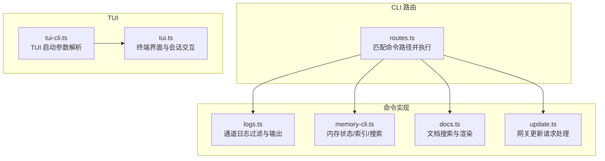
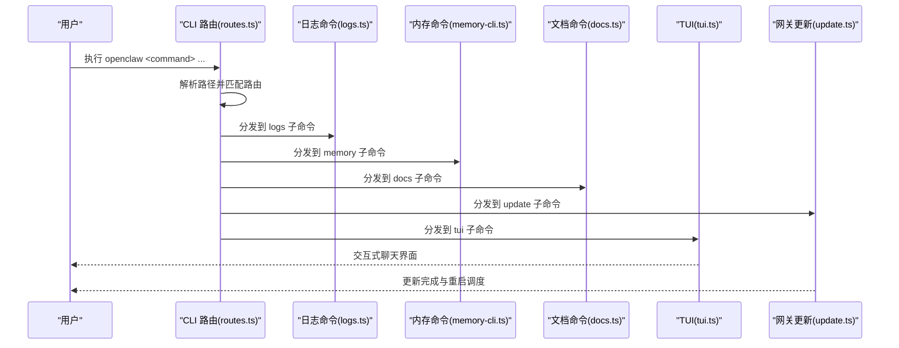
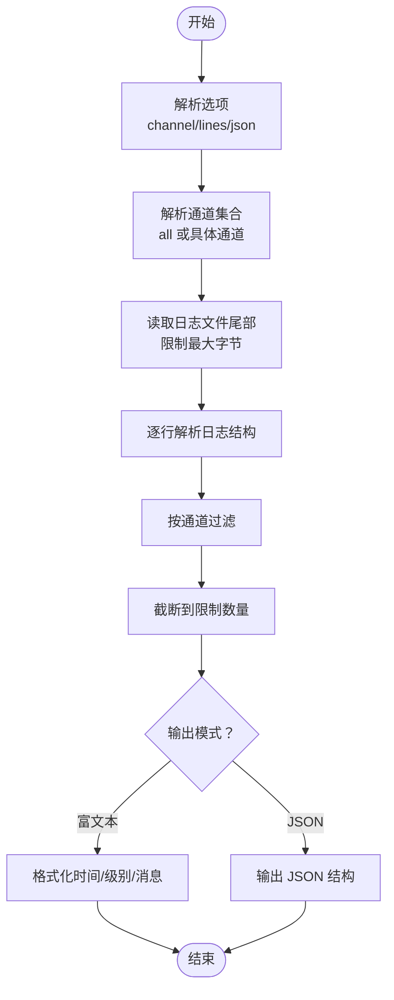
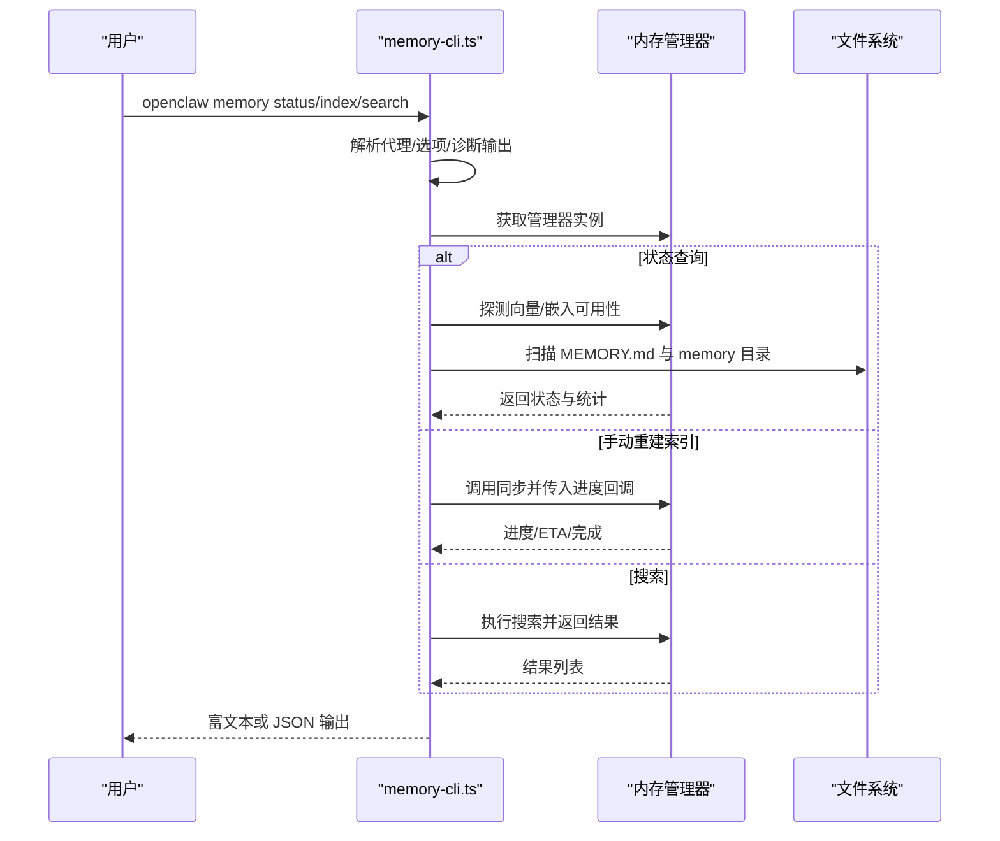
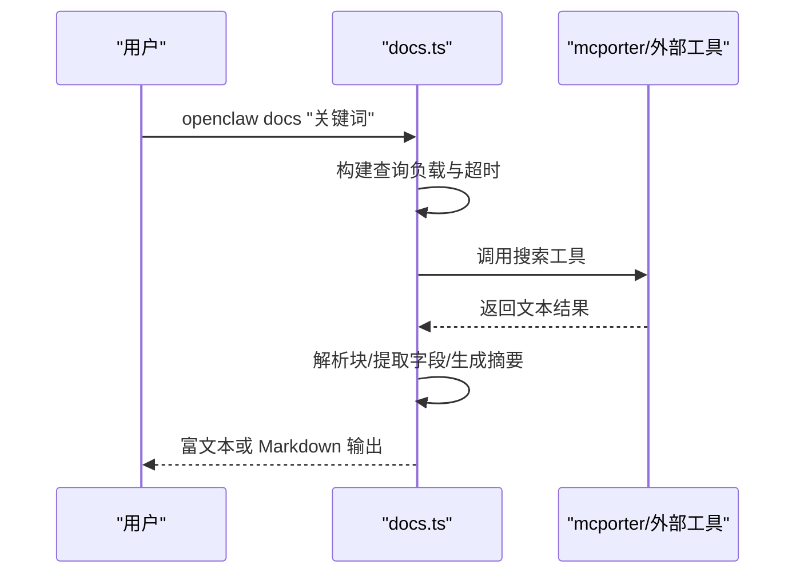
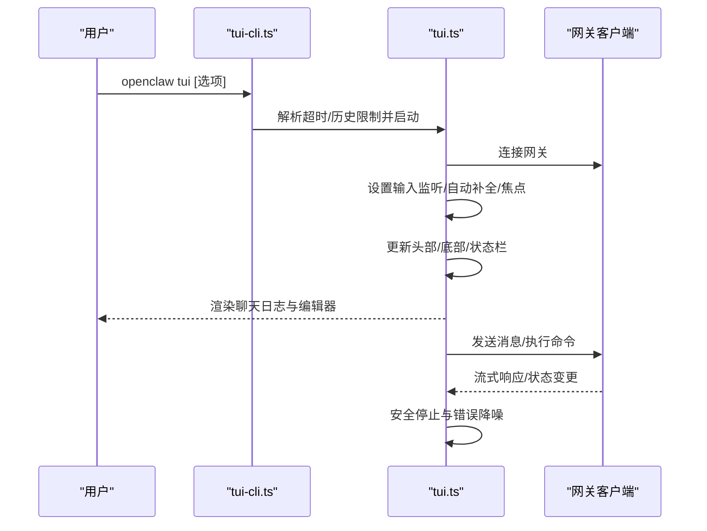
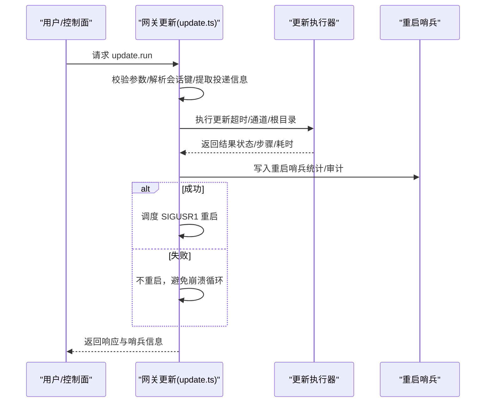
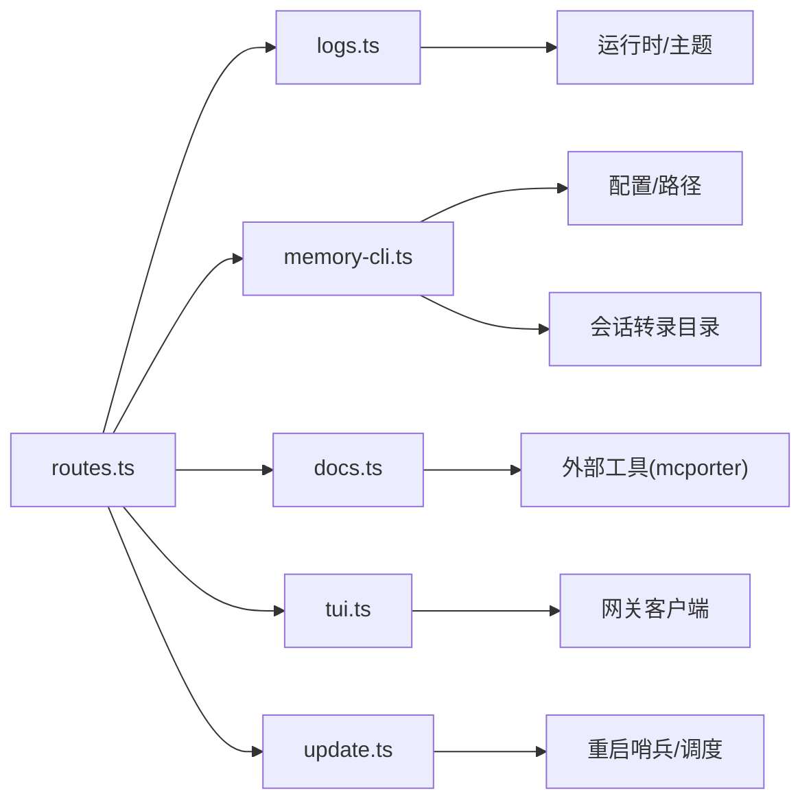

# 实用工具命令

<cite>
**本文引用的文件**
- [src/commands/channels/logs.ts](file://src/commands/channels/logs.ts)
- [src/commands/docs.ts](file://src/commands/docs.ts)
- [src/cli/memory-cli.ts](file://src/cli/memory-cli.ts)
- [src/cli/tui-cli.ts](file://src/cli/tui-cli.ts)
- [src/tui/tui.ts](file://src/tui/tui.ts)
- [src/gateway/server-methods/update.ts](file://src/gateway/server-methods/update.ts)
- [src/cli/program/routes.ts](file://src/cli/program/routes.ts)
- [src/cli/logs-cli.ts](file://src/cli/logs-cli.ts)
- [src/cli/docs-cli.ts](file://src/cli/docs-cli.ts)
- [src/cli/update-cli.ts](file://src/cli/update-cli.ts)
</cite>

## 目录

1. [简介](#简介)
2. [项目结构](#项目结构)
3. [核心组件](#核心组件)
4. [架构总览](#架构总览)
5. [详细组件分析](#详细组件分析)
6. [依赖关系分析](#依赖关系分析)
7. [性能考量](#性能考量)
8. [故障排查指南](#故障排查指南)
9. [结论](#结论)
10. [附录](#附录)

## 简介

本文件面向运维与开发用户，系统化梳理 OpenClaw 的实用工具命令，包括日志查看（logs）、内存索引与检索（memory）、文档搜索（docs）、终端交互界面（tui）以及软件更新（update）。文档不仅覆盖命令功能与使用方式，还深入到实现细节、数据流、错误处理与性能特征，并提供配置、自动化脚本与批处理建议，帮助在生产环境中进行监控、排障与优化。

## 项目结构

实用工具命令主要分布在 CLI 路由、具体命令实现与 TUI 组件中：

- CLI 路由：解析命令路径并分发到对应处理器
- 命令实现：日志、内存、文档、更新等子命令的具体逻辑
- TUI：终端交互界面，提供可视化聊天与状态展示
- 网关更新：通过网关 RPC 触发更新流程并记录重启哨兵

图表来源

- [src/cli/program/routes.ts:92-135](file://src/cli/program/routes.ts#L92-L135)
- [src/commands/channels/logs.ts:76-114](file://src/commands/channels/logs.ts#L76-L114)
- [src/cli/memory-cli.ts:576-800](file://src/cli/memory-cli.ts#L576-L800)
- [src/commands/docs.ts:160-196](file://src/commands/docs.ts#L160-L196)
- [src/gateway/server-methods/update.ts:18-135](file://src/gateway/server-methods/update.ts#L18-L135)
- [src/cli/tui-cli.ts:8-34](file://src/cli/tui-cli.ts#L8-L34)
- [src/tui/tui.ts:322-991](file://src/tui/tui.ts#L322-L991)

章节来源

- [src/cli/program/routes.ts:92-135](file://src/cli/program/routes.ts#L92-L135)
- [src/commands/channels/logs.ts:76-114](file://src/commands/channels/logs.ts#L76-L114)
- [src/cli/memory-cli.ts:576-800](file://src/cli/memory-cli.ts#L576-L800)
- [src/commands/docs.ts:160-196](file://src/commands/docs.ts#L160-L196)
- [src/gateway/server-methods/update.ts:18-135](file://src/gateway/server-methods/update.ts#L18-L135)
- [src/cli/tui-cli.ts:8-34](file://src/cli/tui-cli.ts#L8-L34)
- [src/tui/tui.ts:322-991](file://src/tui/tui.ts#L322-L991)

## 核心组件

- 日志命令（logs）
  - 支持按通道过滤、限制行数、JSON 输出；从日志文件尾部读取并解析，筛选匹配通道的日志条目，最终以主题化格式输出或以 JSON 结构返回。
- 内存命令（memory）
  - 提供状态查询（含深度探测）、手动重建索引、搜索接口；支持多代理、额外路径扫描、进度反馈与问题诊断；可输出人类可读或 JSON。
- 文档命令（docs）
  - 通过外部工具调用文档搜索服务，解析结果并以富文本或 Markdown 渲染；支持超时控制与错误处理。
- 终端界面（tui）
  - 提供聊天界面、会话管理、自动补全、状态显示与本地运行 ID 跟踪；具备安全停止与错误降噪能力。
- 更新命令（update）
  - 网关侧处理更新请求，执行更新流程，写入重启哨兵并在成功后调度重启；记录统计信息与审计信息。

章节来源

- [src/commands/channels/logs.ts:8-114](file://src/commands/channels/logs.ts#L8-L114)
- [src/cli/memory-cli.ts:23-800](file://src/cli/memory-cli.ts#L23-L800)
- [src/commands/docs.ts:12-196](file://src/commands/docs.ts#L12-L196)
- [src/tui/tui.ts:322-991](file://src/tui/tui.ts#L322-L991)
- [src/gateway/server-methods/update.ts:18-135](file://src/gateway/server-methods/update.ts#L18-L135)

## 架构总览

下图展示 CLI 路由如何将命令分派至各子命令实现，并说明与 TUI、网关更新的交互关系。

图表来源

- [src/cli/program/routes.ts:92-135](file://src/cli/program/routes.ts#L92-L135)
- [src/commands/channels/logs.ts:76-114](file://src/commands/channels/logs.ts#L76-L114)
- [src/cli/memory-cli.ts:576-800](file://src/cli/memory-cli.ts#L576-L800)
- [src/commands/docs.ts:160-196](file://src/commands/docs.ts#L160-L196)
- [src/gateway/server-methods/update.ts:18-135](file://src/gateway/server-methods/update.ts#L18-L135)
- [src/tui/tui.ts:322-991](file://src/tui/tui.ts#L322-L991)

## 详细组件分析

### 日志命令（logs）

- 功能要点
  - 通道过滤：支持指定通道或“全部”；根据 subsystem/module 匹配通道标识。
  - 行数与范围：默认显示一定数量日志，最大读取字节数限制，避免一次性加载过大文件。
  - 输出模式：支持富文本与 JSON；当无匹配项时提示“无匹配日志行”。
- 关键流程
  - 解析选项与通道集合
  - 读取日志文件尾部并按行分割
  - 解析每行日志结构，过滤匹配通道
  - 截断到限制数量并按时间/级别格式化输出

图表来源

- [src/commands/channels/logs.ts:76-114](file://src/commands/channels/logs.ts#L76-L114)

章节来源

- [src/commands/channels/logs.ts:8-114](file://src/commands/channels/logs.ts#L8-L114)

### 内存命令（memory）

- 功能要点
  - 状态查询：显示提供者、模型、索引文件/片段数量、脏标记、存储位置、工作区、向量/全文检索可用性、缓存与批处理状态等。
  - 深度探测：可探测嵌入可用性与向量扩展可用性。
  - 手动重建索引：支持强制全量重建，带进度与 ETA 显示；对不支持的后端给出提示。
  - 搜索：支持查询参数、最大结果数与最小分数；可输出 JSON。
- 关键流程
  - 加载配置与密钥解析诊断
  - 针对每个代理获取内存管理器并执行相应操作
  - 扫描源文件与会话目录，汇总问题
  - 进度回调与状态渲染

图表来源

- [src/cli/memory-cli.ts:576-800](file://src/cli/memory-cli.ts#L576-L800)

章节来源

- [src/cli/memory-cli.ts:23-800](file://src/cli/memory-cli.ts#L23-L800)

### 文档命令（docs）

- 功能要点
  - 工具选择：优先使用 pnpm（dlx），其次 npx（-y），否则抛出错误。
  - 外部工具调用：通过 mcporter 调用远程搜索工具，设置超时与输入。
  - 结果解析：按块解析标题/链接/内容，生成摘要并构建 Markdown 或富文本。
- 关键流程
  - 构建查询负载并调用工具
  - 校验退出码与错误输出
  - 解析并渲染结果

图表来源

- [src/commands/docs.ts:160-196](file://src/commands/docs.ts#L160-L196)

章节来源

- [src/commands/docs.ts:12-196](file://src/commands/docs.ts#L12-L196)

### 终端界面（tui）

- 功能要点
  - 编辑器提交处理：支持“!”前缀的本地命令、斜杠命令与普通消息；内置历史导航。
  - 会话与代理：支持全局/主会话键、代理切换与显示名称映射。
  - 状态与计时：忙碌状态（发送/等待/流式/运行）显示加载器与耗时；连接状态与活动状态组合显示。
  - 安全停止：忽略特定底层错误（如 setRawMode EBADF），避免异常中断。
- 关键流程
  - 初始化配置与会话键解析
  - 连接网关并建立 TUI 根容器
  - 注册输入监听与自动补全
  - 更新头部/底部/状态栏并渲染聊天日志

图表来源

- [src/cli/tui-cli.ts:8-34](file://src/cli/tui-cli.ts#L8-L34)
- [src/tui/tui.ts:322-991](file://src/tui/tui.ts#L322-L991)

章节来源

- [src/cli/tui-cli.ts:8-34](file://src/cli/tui-cli.ts#L8-L34)
- [src/tui/tui.ts:322-991](file://src/tui/tui.ts#L322-L991)

### 更新命令（update）

- 功能要点
  - 参数校验与控制面审计：解析重启参数、提取投递上下文、标准化更新通道。
  - 执行更新：解析包根目录、设置超时，调用更新执行器。
  - 哨兵与重启：写入重启哨兵，仅在成功时调度 SIGUSR1 重启；记录统计与审计信息。
- 关键流程
  - 校验参数并加载配置
  - 执行更新并捕获错误
  - 组装统计与审计信息
  - 写入哨兵并调度重启

图表来源

- [src/gateway/server-methods/update.ts:18-135](file://src/gateway/server-methods/update.ts#L18-L135)

章节来源

- [src/gateway/server-methods/update.ts:18-135](file://src/gateway/server-methods/update.ts#L18-L135)

## 依赖关系分析

- CLI 路由与命令实现
  - 路由负责将命令路径映射到具体实现；例如 memory 子命令注册了 status/index/search 三个子命令。
- 命令实现内部依赖
  - 日志命令依赖通道插件枚举、日志解析器与运行时输出。
  - 内存命令依赖配置加载、状态目录解析、会话转录目录、内存扫描与进度工具。
  - 文档命令依赖外部工具调用与超时控制。
  - TUI 依赖网关客户端、主题与事件处理器。
  - 更新命令依赖配置、包根解析、重启哨兵与网关 RPC。
- 可视化依赖图

图表来源

- [src/cli/program/routes.ts:92-135](file://src/cli/program/routes.ts#L92-L135)
- [src/commands/channels/logs.ts:1-114](file://src/commands/channels/logs.ts#L1-L114)
- [src/cli/memory-cli.ts:1-800](file://src/cli/memory-cli.ts#L1-L800)
- [src/commands/docs.ts:1-196](file://src/commands/docs.ts#L1-L196)
- [src/tui/tui.ts:1-991](file://src/tui/tui.ts#L1-L991)
- [src/gateway/server-methods/update.ts:1-135](file://src/gateway/server-methods/update.ts#L1-L135)

章节来源

- [src/cli/program/routes.ts:92-135](file://src/cli/program/routes.ts#L92-L135)
- [src/commands/channels/logs.ts:1-114](file://src/commands/channels/logs.ts#L1-L114)
- [src/cli/memory-cli.ts:1-800](file://src/cli/memory-cli.ts#L1-L800)
- [src/commands/docs.ts:1-196](file://src/commands/docs.ts#L1-L196)
- [src/tui/tui.ts:1-991](file://src/tui/tui.ts#L1-L991)
- [src/gateway/server-methods/update.ts:1-135](file://src/gateway/server-methods/update.ts#L1-L135)

## 性能考量

- 日志命令
  - 尾部读取与最大字节限制避免大文件全量读取；按行解析与过滤减少后续处理开销。
- 内存命令
  - 深度探测与索引重建可能较耗时，建议在非高峰时段执行；进度回调与 ETA 显示提升可观测性。
  - 对于大型工作区，建议先使用状态查询定位问题再执行重建。
- 文档命令
  - 外部工具调用受网络与服务端响应影响，合理设置超时；富文本渲染比纯文本更重，建议在需要时启用。
- TUI
  - 状态计时器与加载器按需启动/停止，避免不必要的渲染；注意在不同平台上的粘贴行为差异。
- 更新命令
  - 成功才重启，失败时不重启避免崩溃循环；统计信息可用于评估更新耗时与步骤。

[本节为通用指导，无需列出具体文件来源]

## 故障排查指南

- 日志命令
  - 若无匹配日志，检查通道名是否正确；确认日志文件存在且可读。
  - 使用 JSON 模式便于脚本解析与二次处理。
- 内存命令
  - 索引失败时关注后端支持情况与权限问题；查看扫描阶段的问题清单。
  - 使用 --json 输出机器可读结果，结合脚本自动化分析。
- 文档命令
  - 若外部工具不可用，确保 pnpm 或 npx 可用；检查网络连通性与超时设置。
- TUI
  - 安全停止机制会忽略特定底层错误（如 setRawMode EBADF），若仍出现异常，检查终端环境与权限。
  - 控制 C 行为支持清空输入、警告与退出，避免误操作。
- 更新命令
  - 失败时查看统计中的步骤日志与退出码；遵循“仅成功才重启”的策略，避免系统不稳定。

章节来源

- [src/commands/channels/logs.ts:76-114](file://src/commands/channels/logs.ts#L76-L114)
- [src/cli/memory-cli.ts:335-574](file://src/cli/memory-cli.ts#L335-L574)
- [src/commands/docs.ts:160-196](file://src/commands/docs.ts#L160-L196)
- [src/tui/tui.ts:271-293](file://src/tui/tui.ts#L271-L293)
- [src/gateway/server-methods/update.ts:48-133](file://src/gateway/server-methods/update.ts#L48-L133)

## 结论

OpenClaw 的实用工具命令围绕“可观测性、可维护性与可操作性”设计：日志命令提供细粒度通道过滤与尾部读取；内存命令覆盖状态、索引与搜索；文档命令打通外部知识检索；TUI 提供交互式体验与安全停止；更新命令保障可控重启。通过 JSON 输出与进度反馈，这些工具既适合人工使用也适合集成到自动化脚本与批处理流程中。

[本节为总结性内容，无需列出具体文件来源]

## 附录

- 常用命令速查
  - openclaw logs [--channel <通道>] [--lines <行数>] [--json]
  - openclaw memory status [--agent <id>] [--deep] [--index] [--json]
  - openclaw memory index [--agent <id>] [--force] [--verbose]
  - openclaw memory search [--query <文本>|<位置参数>] [--max-results <n>] [--min-score <n>] [--json]
  - openclaw docs "<关键词>"
  - openclaw tui [--url <地址>] [--token <令牌>] [--password <密码>] [--session <键>] [--thinking <级别>] [--message <文本>] [--timeout-ms <毫秒>] [--history-limit <数量>]
  - openclaw update [--channel <通道>] [--timeout-ms <毫秒>] [--restart-delay-ms <毫秒>]

- 自动化与批处理建议
  - 使用 JSON 输出配合 jq 或其他工具进行二次处理。
  - 在 CI/CD 中调用 docs 与 memory status 进行预检。
  - 使用 TUI 的 --history-limit 与 --timeout-ms 控制资源占用。
  - 更新前后记录重启哨兵与统计信息，形成更新审计链路。

[本节为通用指导，无需列出具体文件来源]
