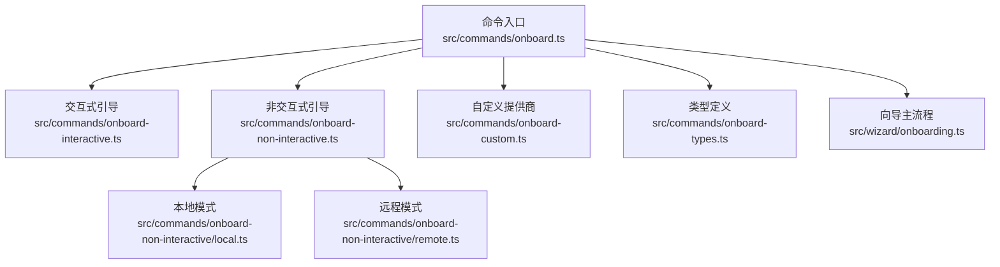
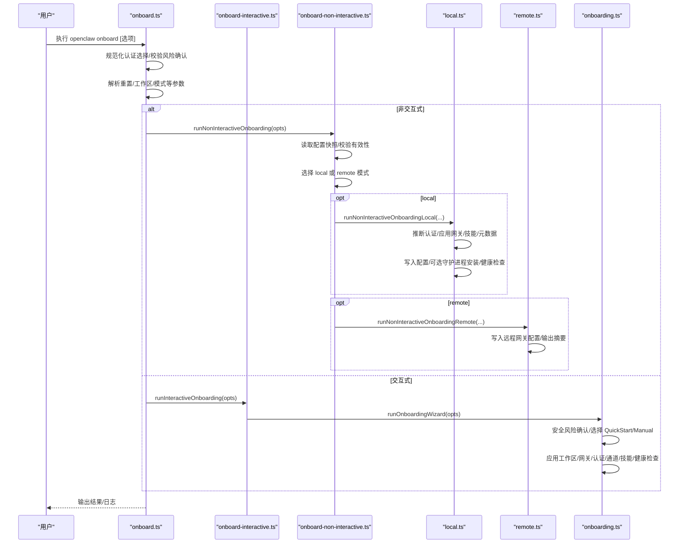
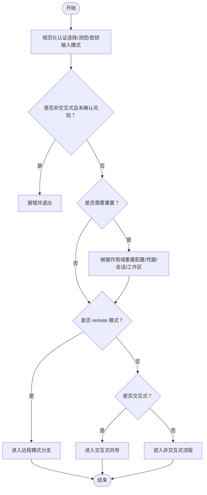
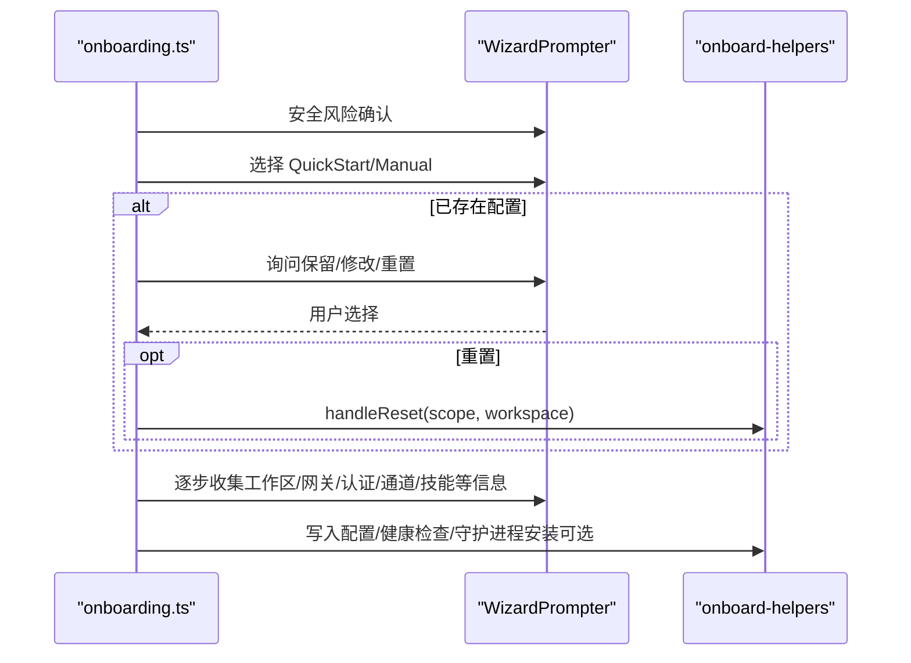
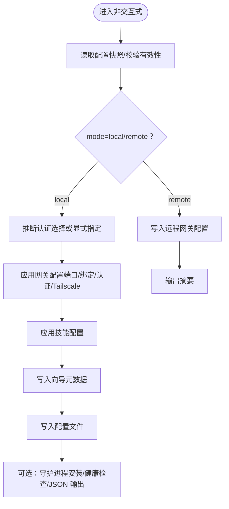
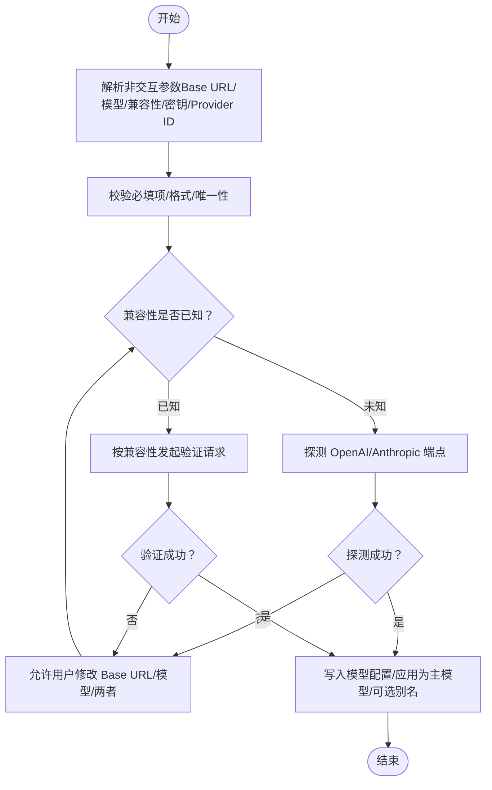
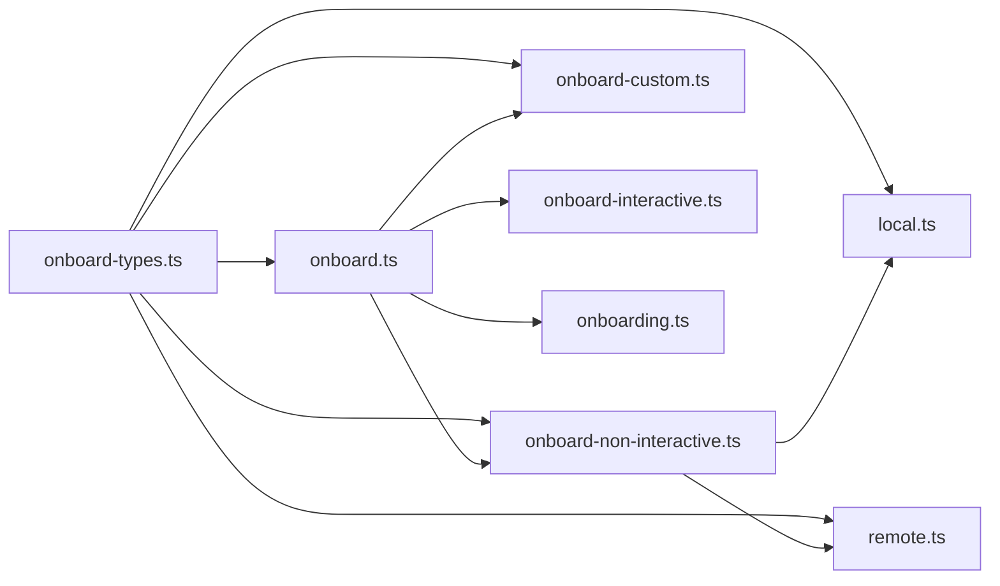

# 引导配置命令

<cite>
**本文引用的文件**
- [onboard.ts](file://src/commands/onboard.ts)
- [onboard-interactive.ts](file://src/commands/onboard-interactive.ts)
- [onboard-non-interactive.ts](file://src/commands/onboard-non-interactive.ts)
- [onboard-non-interactive/local.ts](file://src/commands/onboard-non-interactive/local.ts)
- [onboard-non-interactive/remote.ts](file://src/commands/onboard-non-interactive/remote.ts)
- [onboard-custom.ts](file://src/commands/onboard-custom.ts)
- [onboard-types.ts](file://src/commands/onboard-types.ts)
- [onboarding.md](file://docs/start/onboarding.md)
- [cli/onboard.md](file://docs/cli/onboard.md)
- [onboarding.ts](file://src/wizard/onboarding.ts)
</cite>

## 目录

1. [简介](#简介)
2. [项目结构](#项目结构)
3. [核心组件](#核心组件)
4. [架构总览](#架构总览)
5. [详细组件分析](#详细组件分析)
6. [依赖关系分析](#依赖关系分析)
7. [性能与可扩展性](#性能与可扩展性)
8. [故障排除指南](#故障排除指南)
9. [结论](#结论)
10. [附录：完整用法与示例](#附录完整用法与示例)

## 简介

本文件系统化梳理 OpenClaw 的引导配置命令，重点覆盖以下子命令与模式：

- onboard（交互式引导）
- onboard-non-interactive（非交互式引导）
- onboard-custom（自定义模型提供商接入）

并围绕“新用户设置流程、平台集成配置、认证设置、通道与技能配置、健康检查与守护进程安装”等关键步骤，提供面向不同使用场景（交互式 vs 非交互式）的实践指南、配置示例与故障排除建议。同时总结多平台（macOS、Linux、Windows）在引导过程中的差异与最佳实践。

## 项目结构

onboard 命令族位于 CLI 子系统中，核心入口与流程编排集中在命令层，具体功能拆分为：

- 交互式引导：通过向导驱动用户完成工作区、网关、认证、通道、技能等配置
- 非交互式引导：基于参数直接应用配置，适合自动化脚本与 CI/CD
- 自定义提供商：快速接入任意 OpenAI/Anthropic 兼容或未知类型的第三方推理服务

图表来源

- [onboard.ts:1-97](file://src/commands/onboard.ts#L1-L97)
- [onboard-interactive.ts:1-32](file://src/commands/onboard-interactive.ts#L1-L32)
- [onboard-non-interactive.ts:1-38](file://src/commands/onboard-non-interactive.ts#L1-L38)
- [onboard-non-interactive/local.ts:1-139](file://src/commands/onboard-non-interactive/local.ts#L1-L139)
- [onboard-non-interactive/remote.ts:1-54](file://src/commands/onboard-non-interactive/remote.ts#L1-L54)
- [onboard-custom.ts:1-826](file://src/commands/onboard-custom.ts#L1-L826)
- [onboard-types.ts:1-172](file://src/commands/onboard-types.ts#L1-L172)
- [onboarding.ts:1-200](file://src/wizard/onboarding.ts#L1-L200)

章节来源

- [onboard.ts:1-97](file://src/commands/onboard.ts#L1-L97)
- [onboard-interactive.ts:1-32](file://src/commands/onboard-interactive.ts#L1-L32)
- [onboard-non-interactive.ts:1-38](file://src/commands/onboard-non-interactive.ts#L1-L38)
- [onboard-non-interactive/local.ts:1-139](file://src/commands/onboard-non-interactive/local.ts#L1-L139)
- [onboard-non-interactive/remote.ts:1-54](file://src/commands/onboard-non-interactive/remote.ts#L1-L54)
- [onboard-custom.ts:1-826](file://src/commands/onboard-custom.ts#L1-L826)
- [onboard-types.ts:1-172](file://src/commands/onboard-types.ts#L1-L172)
- [onboarding.ts:1-200](file://src/wizard/onboarding.ts#L1-L200)

## 核心组件

- onboard 命令入口：解析参数、规范化认证选择、校验风险确认、分派到交互式或非交互式流程，并处理重置逻辑与平台提示
- 交互式引导：通过向导界面收集用户输入，按 QuickStart/Manual 流程推进，最终生成配置并可选进行健康检查与守护进程安装
- 非交互式引导：从参数推断认证方式，直接应用网关、技能、守护进程等配置，支持 JSON 输出便于自动化
- 自定义提供商：解析自定义 Base URL、兼容性、模型 ID、别名等，自动探测或验证端点，写入模型配置并应用为主模型
- 类型定义：集中声明所有引导选项、认证选择、网关绑定与守护进程运行时等类型

章节来源

- [onboard.ts:15-97](file://src/commands/onboard.ts#L15-L97)
- [onboarding.ts:73-200](file://src/wizard/onboarding.ts#L73-L200)
- [onboard-non-interactive.ts:10-38](file://src/commands/onboard-non-interactive.ts#L10-L38)
- [onboard-non-interactive/local.ts:22-139](file://src/commands/onboard-non-interactive/local.ts#L22-L139)
- [onboard-non-interactive/remote.ts:9-54](file://src/commands/onboard-non-interactive/remote.ts#L9-L54)
- [onboard-custom.ts:523-670](file://src/commands/onboard-custom.ts#L523-L670)
- [onboard-types.ts:96-172](file://src/commands/onboard-types.ts#L96-L172)

## 架构总览

下图展示从命令入口到各执行分支的整体调用链路与关键决策点：

图表来源

- [onboard.ts:15-97](file://src/commands/onboard.ts#L15-L97)
- [onboard-interactive.ts:9-32](file://src/commands/onboard-interactive.ts#L9-L32)
- [onboard-non-interactive.ts:10-38](file://src/commands/onboard-non-interactive.ts#L10-L38)
- [onboard-non-interactive/local.ts:22-139](file://src/commands/onboard-non-interactive/local.ts#L22-L139)
- [onboard-non-interactive/remote.ts:9-54](file://src/commands/onboard-non-interactive/remote.ts#L9-L54)
- [onboarding.ts:73-200](file://src/wizard/onboarding.ts#L73-L200)

## 详细组件分析

### 组件A：onboard 命令入口

- 负责参数规范化（认证选择、流控、密钥输入模式、重置范围）、平台提示（如 Windows 建议 WSL2）、以及交互式/非交互式分流
- 对非交互式强制要求风险确认标志位，确保自动化场景下的安全意识
- 支持重置作用域（仅配置、含凭据会话、完整重置），并结合默认工作区路径进行清理

图表来源

- [onboard.ts:15-97](file://src/commands/onboard.ts#L15-L97)

章节来源

- [onboard.ts:15-97](file://src/commands/onboard.ts#L15-L97)

### 组件B：交互式引导（onboarding 向导）

- 首先进行安全风险确认，随后根据 QuickStart/Manual 两种模式推进
- 支持对现有配置进行保留/修改/重置三种处理策略
- 在本地模式下，向导负责工作区、网关、认证、通道、技能、健康检查等步骤；在远程模式下跳过本地配置步骤

图表来源

- [onboarding.ts:73-200](file://src/wizard/onboarding.ts#L73-L200)

章节来源

- [onboarding.ts:73-200](file://src/wizard/onboarding.ts#L73-L200)

### 组件C：非交互式引导（local/remote）

- local 分支：解析工作区、推断认证来源、应用网关配置（端口、绑定、认证、Tailscale）、技能配置、守护进程安装、健康检查与 JSON 输出
- remote 分支：直接写入远程网关配置（URL、可选 token），输出摘要信息

图表来源

- [onboard-non-interactive.ts:10-38](file://src/commands/onboard-non-interactive.ts#L10-L38)
- [onboard-non-interactive/local.ts:22-139](file://src/commands/onboard-non-interactive/local.ts#L22-L139)
- [onboard-non-interactive/remote.ts:9-54](file://src/commands/onboard-non-interactive/remote.ts#L9-L54)

章节来源

- [onboard-non-interactive.ts:10-38](file://src/commands/onboard-non-interactive.ts#L10-L38)
- [onboard-non-interactive/local.ts:22-139](file://src/commands/onboard-non-interactive/local.ts#L22-L139)
- [onboard-non-interactive/remote.ts:9-54](file://src/commands/onboard-non-interactive/remote.ts#L9-L54)

### 组件D：自定义提供商（onboard-custom）

- 支持 OpenAI/Anthropic 兼容或 Unknown 自动探测
- 校验 Base URL、模型 ID、兼容性、Provider ID 唯一性与别名冲突
- 自动探测失败时允许用户选择修改 Base URL/模型或两者，支持 Azure OpenAI/AI Foundry 的部署路径转换
- 将模型写入配置并应用为主模型，支持别名

图表来源

- [onboard-custom.ts:523-670](file://src/commands/onboard-custom.ts#L523-L670)
- [onboard-custom.ts:700-775](file://src/commands/onboard-custom.ts#L700-L775)

章节来源

- [onboard-custom.ts:523-670](file://src/commands/onboard-custom.ts#L523-L670)
- [onboard-custom.ts:700-775](file://src/commands/onboard-custom.ts#L700-L775)

## 依赖关系分析

- 命令入口与类型定义耦合度低，便于扩展新的认证选择与网关模式
- 交互式与非交互式共享同一套配置写入与健康检查流程，减少重复逻辑
- 自定义提供商模块独立于认证模块，通过统一的模型配置接口注入

图表来源

- [onboard-types.ts:1-172](file://src/commands/onboard-types.ts#L1-L172)
- [onboard.ts:1-97](file://src/commands/onboard.ts#L1-L97)
- [onboard-non-interactive.ts:1-38](file://src/commands/onboard-non-interactive.ts#L1-L38)
- [onboard-non-interactive/local.ts:1-139](file://src/commands/onboard-non-interactive/local.ts#L1-L139)
- [onboard-non-interactive/remote.ts:1-54](file://src/commands/onboard-non-interactive/remote.ts#L1-L54)
- [onboard-custom.ts:1-826](file://src/commands/onboard-custom.ts#L1-L826)
- [onboarding.ts:1-200](file://src/wizard/onboarding.ts#L1-L200)

章节来源

- [onboard-types.ts:1-172](file://src/commands/onboard-types.ts#L1-L172)
- [onboard.ts:1-97](file://src/commands/onboard.ts#L1-L97)
- [onboard-non-interactive.ts:1-38](file://src/commands/onboard-non-interactive.ts#L1-L38)
- [onboard-non-interactive/local.ts:1-139](file://src/commands/onboard-non-interactive/local.ts#L1-L139)
- [onboard-non-interactive/remote.ts:1-54](file://src/commands/onboard-non-interactive/remote.ts#L1-L54)
- [onboard-custom.ts:1-826](file://src/commands/onboard-custom.ts#L1-L826)
- [onboarding.ts:1-200](file://src/wizard/onboarding.ts#L1-L200)

## 性能与可扩展性

- 非交互式模式通过参数直连配置，避免逐项交互等待，适合大规模部署与 CI/CD
- 自定义提供商在未知兼容性时进行探测，建议在生产环境预先明确兼容性以减少探测开销
- 健康检查与守护进程安装为可选步骤，可根据资源与网络条件调整执行时机

[本节为通用指导，不直接分析具体文件]

## 故障排除指南

- 配置无效：当检测到配置无效时，交互式与非交互式均会提示先执行诊断修复再重试
- 非交互式缺少风险确认：必须显式传入风险确认标志位，否则直接退出
- 认证选择废弃：若使用已废弃的认证选择，需改用当前推荐的替代方案
- Windows 平台：建议使用 WSL2 运行，原生 Windows 可能遇到兼容性问题
- 远程模式缺失 URL：远程模式必须提供远程网关 URL，否则报错
- 自定义提供商探测失败：允许用户修改 Base URL/模型后重试，或显式指定兼容性

章节来源

- [onboard.ts:19-34](file://src/commands/onboard.ts#L19-L34)
- [onboard.ts:56-66](file://src/commands/onboard.ts#L56-L66)
- [onboard-non-interactive/remote.ts:17-22](file://src/commands/onboard-non-interactive/remote.ts#L17-L22)
- [onboarding.md:77-86](file://docs/start/onboarding.md#L77-L86)
- [onboard-custom.ts:728-742](file://src/commands/onboard-custom.ts#L728-L742)

## 结论

onboard 命令族提供了从新手到高级用户的完整引导体验：交互式向导帮助用户逐步建立正确的安全基线与配置，非交互式模式满足自动化与规模化部署需求，自定义提供商则扩展了对第三方推理服务的支持。配合健康检查与守护进程安装，用户可在多平台上获得一致、可靠的初始配置体验。

[本节为总结性内容，不直接分析具体文件]

## 附录：完整用法与示例

### 交互式引导

- 基本用法：openclaw onboard
- 快速开始：openclaw onboard --flow quickstart
- 手动模式：openclaw onboard --flow manual
- 远程模式：openclaw onboard --mode remote --remote-url wss://gateway-host:18789

章节来源

- [cli/onboard.md:20-28](file://docs/cli/onboard.md#L20-L28)

### 非交互式引导（本地）

- 自定义提供商示例：参见“非交互式自定义提供商”示例
- 密钥存储为引用（推荐）：参见“非交互式 ref 模式合同”
- 网关令牌选项：参见“网关令牌选项（非交互式）”

章节来源

- [cli/onboard.md:32-56](file://docs/cli/onboard.md#L32-L56)
- [cli/onboard.md:58-73](file://docs/cli/onboard.md#L58-L73)
- [cli/onboard.md:64-84](file://docs/cli/onboard.md#L64-L84)

### 非交互式引导（远程）

- 基本用法：openclaw onboard --mode remote --remote-url <wss-url> [--remote-token <token>]
- 输出摘要：在非交互模式下可输出 JSON 摘要或纯文本摘要

章节来源

- [onboard-non-interactive/remote.ts:17-54](file://src/commands/onboard-non-interactive/remote.ts#L17-L54)
- [cli/onboard.md:46-56](file://docs/cli/onboard.md#L46-L56)

### 自定义提供商（非交互式）

- 示例：openclaw onboard --non-interactive --auth-choice custom-api-key --custom-base-url "<url>" --custom-model-id "<model>" --custom-api-key "$CUSTOM_API_KEY" --secret-input-mode plaintext --custom-compatibility openai
- 别名与唯一性：Provider ID 由 Base URL 推导，若冲突会自动加序号；别名不可与其他模型别名冲突
- Azure OpenAI/AI Foundry：自动添加部署路径前缀，无需手动拼接

章节来源

- [cli/onboard.md:32-42](file://docs/cli/onboard.md#L32-L42)
- [onboard-custom.ts:523-553](file://src/commands/onboard-custom.ts#L523-L553)
- [onboard-custom.ts:575-583](file://src/commands/onboard-custom.ts#L575-L583)
- [onboard-custom.ts:588-595](file://src/commands/onboard-custom.ts#L588-L595)
- [onboard-custom.ts:575-577](file://src/commands/onboard-custom.ts#L575-L577)

### 多平台支持与最佳实践

- macOS：首次运行时的权限与安全提示、本地 vs 远程网关选择、守护进程安装建议
- Windows：建议使用 WSL2；原生 Windows 可能遇到兼容性问题
- Linux：注意 systemd 权限与 headless 环境的探测行为；必要时放宽某些探测失败为非致命

章节来源

- [onboarding.md:40-61](file://docs/start/onboarding.md#L40-L61)
- [onboarding.md:77-86](file://docs/start/onboarding.md#L77-L86)
- [CHANGELOG 相关条目:215-268](file://CHANGELOG.md#L215-L268)
