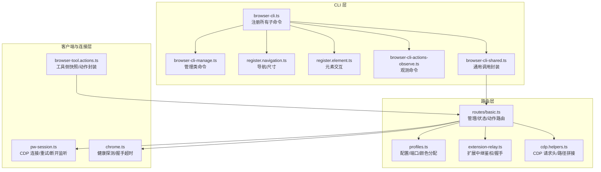
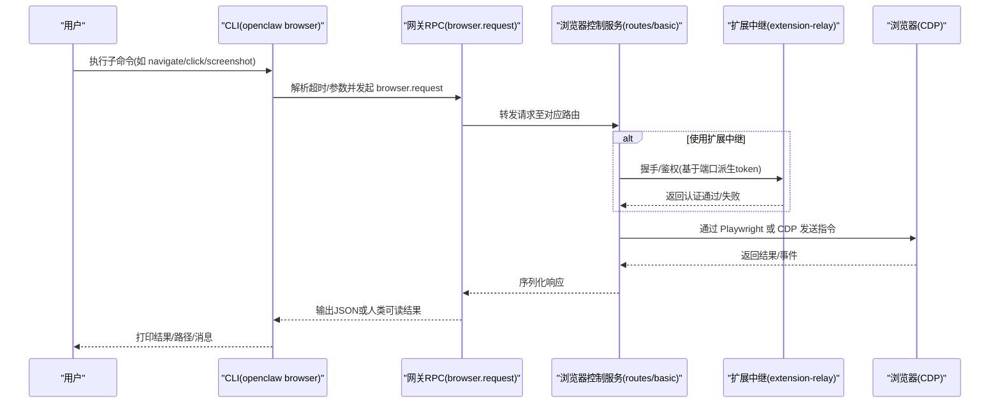
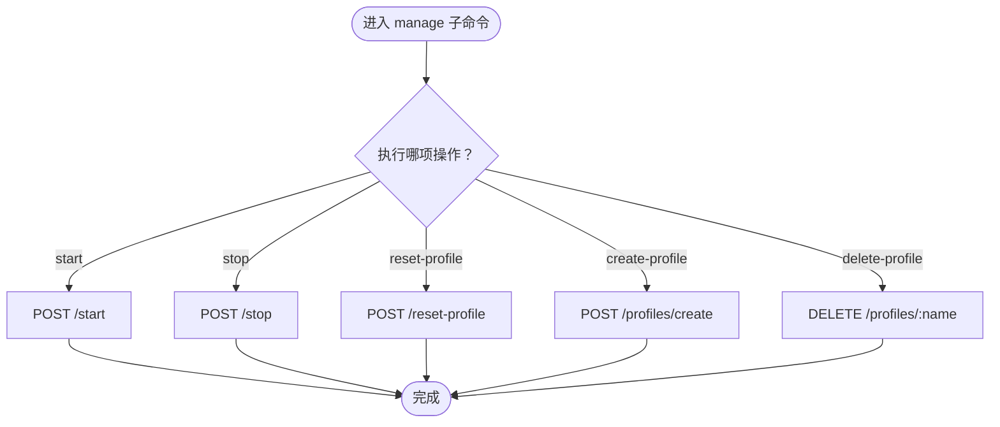
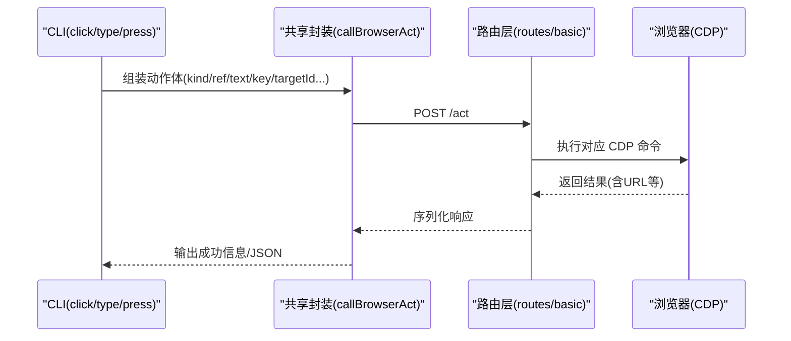
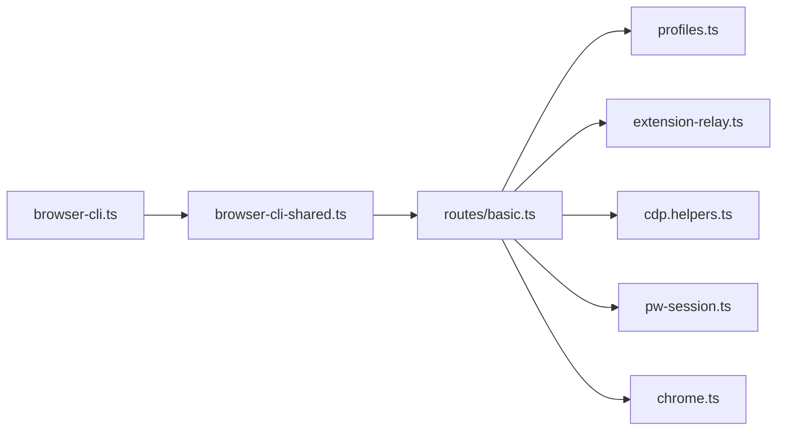

# 浏览器控制命令

<cite>
**本文引用的文件**
- [docs/cli/browser.md](file://docs/cli/browser.md)
- [src/cli/browser-cli.ts](file://src/cli/browser-cli.ts)
- [src/cli/browser-cli-shared.ts](file://src/cli/browser-cli-shared.ts)
- [src/cli/browser-cli-manage.ts](file://src/cli/browser-cli-manage.ts)
- [src/cli/browser-cli-actions-input/register.navigation.ts](file://src/cli/browser-cli-actions-input/register.navigation.ts)
- [src/cli/browser-cli-actions-input/register.element.ts](file://src/cli/browser-cli-actions-input/register.element.ts)
- [src/cli/browser-cli-actions-observe.ts](file://src/cli/browser-cli-actions-observe.ts)
- [src/browser/routes/basic.ts](file://src/browser/routes/basic.ts)
- [src/browser/profiles.ts](file://src/browser/profiles.ts)
- [src/browser/extension-relay.ts](file://src/browser/extension-relay.ts)
- [src/browser/cdp.helpers.ts](file://src/browser/cdp.helpers.ts)
- [src/browser/pw-session.ts](file://src/browser/pw-session.ts)
- [src/browser/chrome.ts](file://src/browser/chrome.ts)
- [src/agents/tools/browser-tool.actions.ts](file://src/agents/tools/browser-tool.actions.ts)
</cite>

## 目录

1. [简介](#简介)
2. [项目结构](#项目结构)
3. [核心组件](#核心组件)
4. [架构总览](#架构总览)
5. [详细组件分析](#详细组件分析)
6. [依赖关系分析](#依赖关系分析)
7. [性能与稳定性](#性能与稳定性)
8. [故障排查指南](#故障排查指南)
9. [结论](#结论)
10. [附录](#附录)

## 简介

本文件系统性梳理 OpenClaw 的浏览器控制命令体系，覆盖本地与远程浏览器管理、标签页与目标定位、元素交互（点击/输入/按键/拖拽/选择）、页面观测（控制台/响应体/PDF）、快照与截图、扩展中继、配置与性能优化、安全策略以及多浏览器与远程控制场景。读者可据此快速上手 CLI 浏览器控制，或将其集成到自动化流程与工具链中。

## 项目结构

OpenClaw 将“浏览器控制命令”划分为三层：

- CLI 层：定义命令、参数与帮助输出，组织子命令模块（管理、扩展、检查、动作、观测、状态）。
- 路由层：在浏览器控制服务端暴露 REST 接口，处理启动/停止/重置/重命名/删除等管理操作，以及导航、点击、截图、PDF 等动作。
- 客户端与连接层：封装与网关通信、CDP 连接、扩展中继鉴权、超时与重试、错误映射等。

图表来源

- [src/cli/browser-cli.ts:19-55](file://src/cli/browser-cli.ts#L19-L55)
- [src/cli/browser-cli-manage.ts:135-481](file://src/cli/browser-cli-manage.ts#L135-L481)
- [src/cli/browser-cli-actions-input/register.navigation.ts:8-71](file://src/cli/browser-cli-actions-input/register.navigation.ts#L8-L71)
- [src/cli/browser-cli-actions-input/register.element.ts:12-196](file://src/cli/browser-cli-actions-input/register.element.ts#L12-L196)
- [src/cli/browser-cli-actions-observe.ts:15-117](file://src/cli/browser-cli-actions-observe.ts#L15-L117)
- [src/cli/browser-cli-shared.ts:30-84](file://src/cli/browser-cli-shared.ts#L30-L84)
- [src/browser/routes/basic.ts:30-192](file://src/browser/routes/basic.ts#L30-L192)
- [src/browser/profiles.ts:1-114](file://src/browser/profiles.ts#L1-L114)
- [src/browser/extension-relay.ts:114-223](file://src/browser/extension-relay.ts#L114-L223)
- [src/browser/cdp.helpers.ts:36-69](file://src/browser/cdp.helpers.ts#L36-L69)
- [src/browser/pw-session.ts:343-382](file://src/browser/pw-session.ts#L343-L382)
- [src/browser/chrome.ts:151-215](file://src/browser/chrome.ts#L151-L215)
- [src/agents/tools/browser-tool.actions.ts:107-136](file://src/agents/tools/browser-tool.actions.ts#L107-L136)

章节来源

- [src/cli/browser-cli.ts:19-55](file://src/cli/browser-cli.ts#L19-L55)
- [src/browser/routes/basic.ts:30-192](file://src/browser/routes/basic.ts#L30-L192)

## 核心组件

- CLI 命令注册与帮助
  - 主命令 openclaw browser 注册管理、扩展、检查、动作、观测、调试、状态等子命令模块；支持 --browser-profile、--json、--timeout 等通用选项。
- 网关 RPC 封装
  - 统一封装 browser.request 调用，负责超时解析、查询参数归一化、进度提示等。
- 路由与动作
  - 提供 profiles 列表/创建/删除、启动/停止/重置、导航、点击、类型、按键、悬停、滚动、拖拽、选择、截图、PDF、控制台、响应体等待等接口。
- 配置与资源
  - 分配 CDP 端口范围、颜色、校验配置名；扩展中继鉴权头生成与校验；CDP 请求头合并与 Basic 认证注入。
- 连接与健康
  - Playwright CDP 连接、重试与断开监听；WebSocket 健康探测；代理绕过策略。

章节来源

- [src/cli/browser-cli.ts:19-55](file://src/cli/browser-cli.ts#L19-L55)
- [src/cli/browser-cli-shared.ts:30-84](file://src/cli/browser-cli-shared.ts#L30-L84)
- [src/browser/routes/basic.ts:30-192](file://src/browser/routes/basic.ts#L30-L192)
- [src/browser/profiles.ts:18-114](file://src/browser/profiles.ts#L18-L114)
- [src/browser/extension-relay.ts:217-223](file://src/browser/extension-relay.ts#L217-L223)
- [src/browser/cdp.helpers.ts:42-61](file://src/browser/cdp.helpers.ts#L42-L61)
- [src/browser/pw-session.ts:343-382](file://src/browser/pw-session.ts#L343-L382)
- [src/browser/chrome.ts:151-215](file://src/browser/chrome.ts#L151-L215)

## 架构总览

下图展示从 CLI 到浏览器控制服务端的整体调用链路，以及扩展中继与 CDP 连接的关键节点。

图表来源

- [src/cli/browser-cli.ts:19-55](file://src/cli/browser-cli.ts#L19-L55)
- [src/cli/browser-cli-shared.ts:30-62](file://src/cli/browser-cli-shared.ts#L30-L62)
- [src/browser/routes/basic.ts:30-192](file://src/browser/routes/basic.ts#L30-L192)
- [src/browser/extension-relay.ts:114-223](file://src/browser/extension-relay.ts#L114-L223)
- [src/browser/pw-session.ts:343-382](file://src/browser/pw-session.ts#L343-L382)

## 详细组件分析

### CLI 命令与参数

- 主命令 openclaw browser
  - 支持 --browser-profile 指定配置文件；--json 输出机器可读；--timeout 控制请求超时；继承网关 WebSocket URL 与令牌。
- 子命令分组
  - 管理：start/stop/reset-profile/delete-profile 等
  - 动作：navigate/resize/click/type/press/hover/scrollintoview/drag/select
  - 观测：console/pdf/responsebody
  - 其他：inspect/state 等（由各自模块注册）

章节来源

- [src/cli/browser-cli.ts:19-55](file://src/cli/browser-cli.ts#L19-L55)
- [docs/cli/browser.md:10-108](file://docs/cli/browser.md#L10-L108)

### 管理与配置

- 配置文件与端口
  - profiles 列表/创建/删除；CDP 端口范围默认 18800-18899，避免与网关/桥/其他服务冲突；颜色从预设集合轮询分配。
- 启动/停止/重置
  - start：确保浏览器可用；stop：尽力停止；reset-profile：移动用户数据目录到回收站（带日志提示）。
- 创建自定义配置
  - 可指定颜色、CDP 地址、驱动类型（openclaw/extension）。

图表来源

- [src/cli/browser-cli-manage.ts:135-481](file://src/cli/browser-cli-manage.ts#L135-L481)
- [src/browser/routes/basic.ts:98-191](file://src/browser/routes/basic.ts#L98-L191)
- [src/browser/profiles.ts:27-114](file://src/browser/profiles.ts#L27-L114)

章节来源

- [src/cli/browser-cli-manage.ts:135-481](file://src/cli/browser-cli-manage.ts#L135-L481)
- [src/browser/routes/basic.ts:30-192](file://src/browser/routes/basic.ts#L30-L192)
- [src/browser/profiles.ts:18-114](file://src/browser/profiles.ts#L18-L114)

### 导航与视口调整

- navigate
  - 向目标 URL 发起导航，支持按 targetId 定位特定 CDP 目标。
- resize
  - 调整视口尺寸，支持按 targetId 定位目标。

章节来源

- [src/cli/browser-cli-actions-input/register.navigation.ts:12-66](file://src/cli/browser-cli-actions-input/register.navigation.ts#L12-L66)

### 元素交互（点击/输入/按键/悬停/滚动/拖拽/选择）

- click/双击/修饰键/鼠标按钮
- type/提交/慢打
- press/按键
- hover/悬停
- scrollintoview/滚动到可视
- drag/拖拽
- select/选择选项

图表来源

- [src/cli/browser-cli-actions-input/register.element.ts:16-195](file://src/cli/browser-cli-actions-input/register.element.ts#L16-L195)
- [src/cli/browser-cli-shared.ts:30-62](file://src/cli/browser-cli-shared.ts#L30-L62)
- [src/browser/routes/basic.ts:98-191](file://src/browser/routes/basic.ts#L98-L191)

章节来源

- [src/cli/browser-cli-actions-input/register.element.ts:12-196](file://src/cli/browser-cli-actions-input/register.element.ts#L12-L196)

### 观测与数据提取

- console
  - 获取最近控制台消息，支持按级别过滤与目标定位。
- pdf
  - 将当前页面保存为 PDF，返回文件路径。
- responsebody
  - 等待网络响应并返回响应体，支持 URL 匹配模式、超时与最大字符数限制。

章节来源

- [src/cli/browser-cli-actions-observe.ts:19-116](file://src/cli/browser-cli-actions-observe.ts#L19-L116)

### 快照与截图

- 快照（AI/Aria/角色/标签等模式）
  - 工具侧封装了快照参数解析与默认值应用（如 AI 快照默认最大字符数、refs 模式、高效模式等），最终调用浏览器控制服务端接口。
- 截图
  - 支持全页/区域/元素/参考点截图，返回路径或二进制结果（由服务端决定）。

章节来源

- [src/agents/tools/browser-tool.actions.ts:107-136](file://src/agents/tools/browser-tool.actions.ts#L107-L136)

### 扩展中继与远程控制

- 扩展中继
  - 通过扩展中继鉴权头进行握手与认证；基于端口派生 token 并注入 Authorization 头；仅对回环地址生效。
- 远程控制
  - 当浏览器运行在另一台机器时，通过节点主机代理，网关将动作转发到该节点上的浏览器控制服务，无需单独浏览器控制服务器。

章节来源

- [src/browser/extension-relay.ts:114-223](file://src/browser/extension-relay.ts#L114-L223)
- [src/browser/cdp.helpers.ts:42-61](file://src/browser/cdp.helpers.ts#L42-L61)
- [docs/cli/browser.md:86-108](file://docs/cli/browser.md#L86-L108)

### CDP 连接与健康探测

- 连接重试与断开监听
  - 对 CDP 连接进行有限次重试，速率限制错误不重试；断开后清理缓存；绕过代理以避免 CDP 回环问题。
- 健康探测
  - 通过 WebSocket 发送 Browser.getVersion 命令探测浏览器是否就绪，带握手超时。

章节来源

- [src/browser/pw-session.ts:343-382](file://src/browser/pw-session.ts#L343-L382)
- [src/browser/chrome.ts:151-215](file://src/browser/chrome.ts#L151-L215)

## 依赖关系分析

- CLI 与路由
  - CLI 通过 browser.request 将命令转交路由层；路由层根据 profile 上下文与目标 ID 决定具体动作。
- 路由与连接
  - 路由层依赖 Playwright/CDP 进行实际操作；扩展中继与 CDP 请求头辅助认证。
- 配置与资源
  - profiles 模块负责端口/颜色分配与校验；cdp.helpers 负责请求头合并与 Basic 认证注入。

图表来源

- [src/cli/browser-cli.ts:19-55](file://src/cli/browser-cli.ts#L19-L55)
- [src/cli/browser-cli-shared.ts:30-62](file://src/cli/browser-cli-shared.ts#L30-L62)
- [src/browser/routes/basic.ts:30-192](file://src/browser/routes/basic.ts#L30-L192)
- [src/browser/profiles.ts:18-114](file://src/browser/profiles.ts#L18-L114)
- [src/browser/extension-relay.ts:114-223](file://src/browser/extension-relay.ts#L114-L223)
- [src/browser/cdp.helpers.ts:36-69](file://src/browser/cdp.helpers.ts#L36-L69)
- [src/browser/pw-session.ts:343-382](file://src/browser/pw-session.ts#L343-L382)
- [src/browser/chrome.ts:151-215](file://src/browser/chrome.ts#L151-L215)

章节来源

- [src/cli/browser-cli.ts:19-55](file://src/cli/browser-cli.ts#L19-L55)
- [src/cli/browser-cli-shared.ts:30-62](file://src/cli/browser-cli-shared.ts#L30-L62)
- [src/browser/routes/basic.ts:30-192](file://src/browser/routes/basic.ts#L30-L192)

## 性能与稳定性

- 超时与重试
  - CLI 层统一解析超时；CDP 连接采用指数退避重试，速率限制错误不重试；健康探测设置握手超时。
- 资源隔离
  - 通过 profiles 为每个实例分配独立 CDP 端口与用户数据目录，避免冲突。
- 代理与认证
  - 对 CDP 回环地址绕过代理；自动注入 Basic 认证头；扩展中继仅对回环生效，降低跨网风险。

章节来源

- [src/cli/browser-cli-shared.ts:35-45](file://src/cli/browser-cli-shared.ts#L35-L45)
- [src/browser/pw-session.ts:343-382](file://src/browser/pw-session.ts#L343-L382)
- [src/browser/chrome.ts:151-215](file://src/browser/chrome.ts#L151-L215)
- [src/browser/profiles.ts:27-45](file://src/browser/profiles.ts#L27-L45)
- [src/browser/cdp.helpers.ts:42-61](file://src/browser/cdp.helpers.ts#L42-L61)
- [src/browser/extension-relay.ts:201-215](file://src/browser/extension-relay.ts#L201-L215)

## 故障排查指南

- 无法连接 CDP
  - 检查浏览器是否已启动且可访问；确认 CDP URL/端口正确；查看重试与断开日志；必要时手动重启浏览器。
- 扩展中继认证失败
  - 确认扩展中继端口与网关令牌匹配；仅回环地址可启用中继；检查 relay token 是否正确派生。
- 响应超时
  - 增加 --timeout；检查网络与代理设置；确认目标页面加载正常。
- 目标定位问题
  - 使用 --target-id 精确指定 CDP 目标；若为扩展中继，确保扩展已连接且目标可见。

章节来源

- [src/browser/pw-session.ts:343-382](file://src/browser/pw-session.ts#L343-L382)
- [src/browser/extension-relay.ts:114-223](file://src/browser/extension-relay.ts#L114-L223)
- [src/browser/chrome.ts:151-215](file://src/browser/chrome.ts#L151-L215)
- [docs/cli/browser.md:101-108](file://docs/cli/browser.md#L101-L108)

## 结论

OpenClaw 的浏览器控制命令以 CLI 为中心，通过网关 RPC 将命令路由到浏览器控制服务端，结合扩展中继与 CDP 连接实现本地与远程的统一控制体验。其设计强调：

- 明确的子命令分层与参数规范
- 可配置的浏览器实例与目标定位
- 丰富的动作与观测能力
- 安全的扩展中继与 CDP 认证
- 可靠的连接重试与健康探测

建议在生产环境中：

- 使用 profiles 管理多实例与用户数据隔离
- 在远程场景下配合节点主机代理与安全策略
- 合理设置超时与重试，关注网络与代理配置
- 通过扩展中继仅在受控环境下启用

## 附录

- 常用示例与参考
  - 本地快速开始：列出配置、启动浏览器、打开页面、快照
  - 配置管理：列出/创建/删除配置
  - 动作示例：导航、点击、输入、截图
  - 远程与扩展：通过节点主机代理与扩展中继控制远端浏览器

章节来源

- [docs/cli/browser.md:27-108](file://docs/cli/browser.md#L27-L108)
