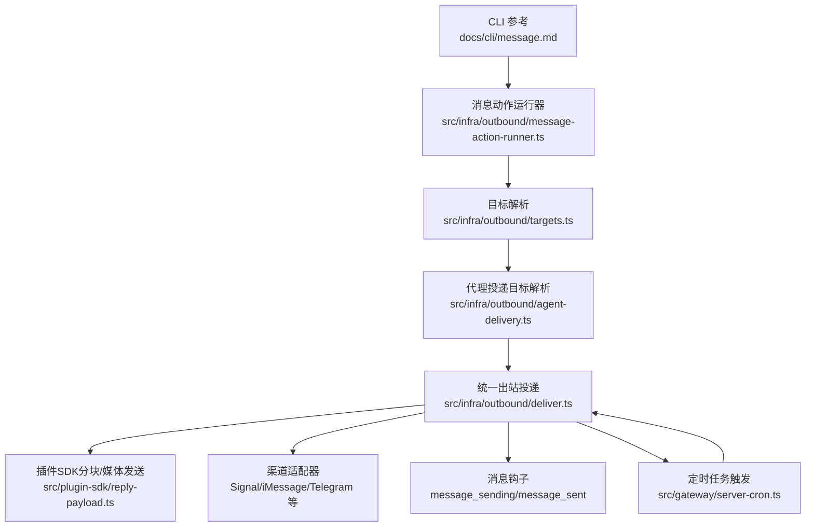
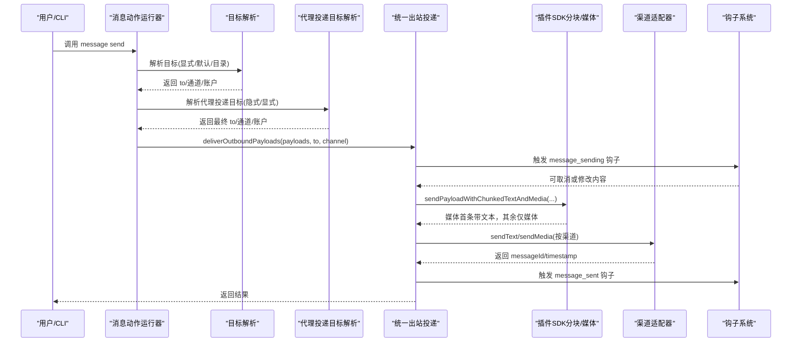
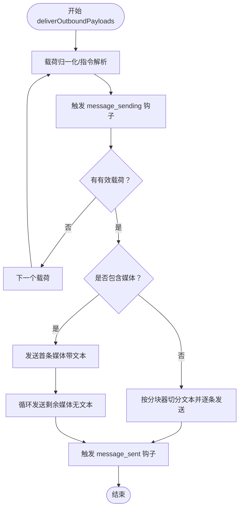
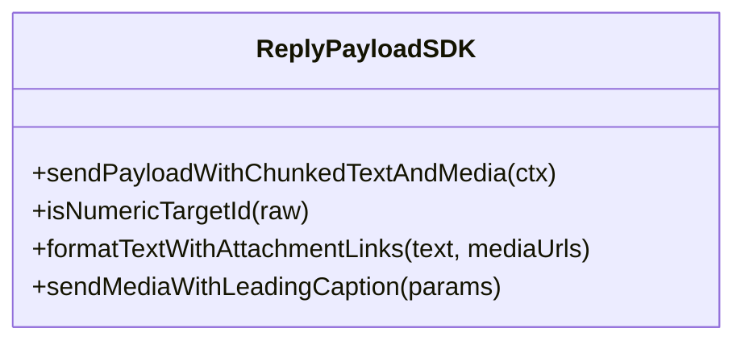
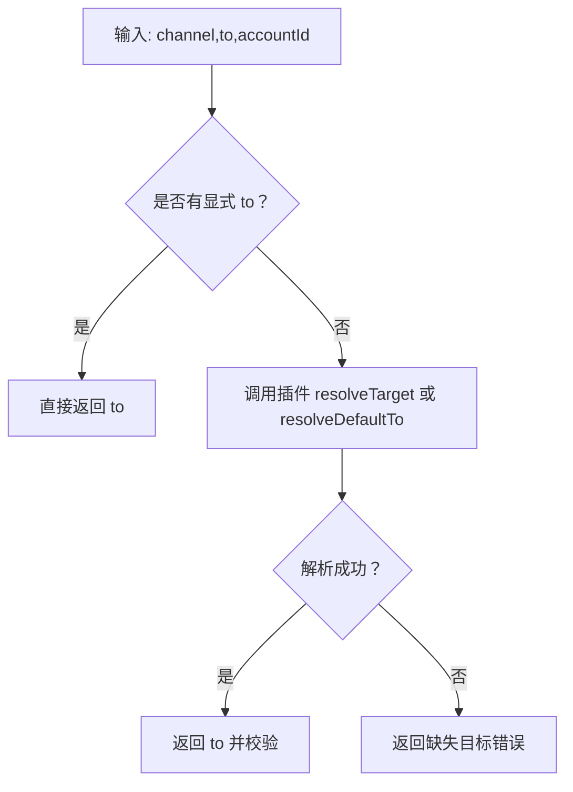
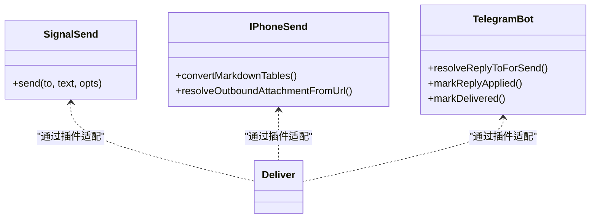
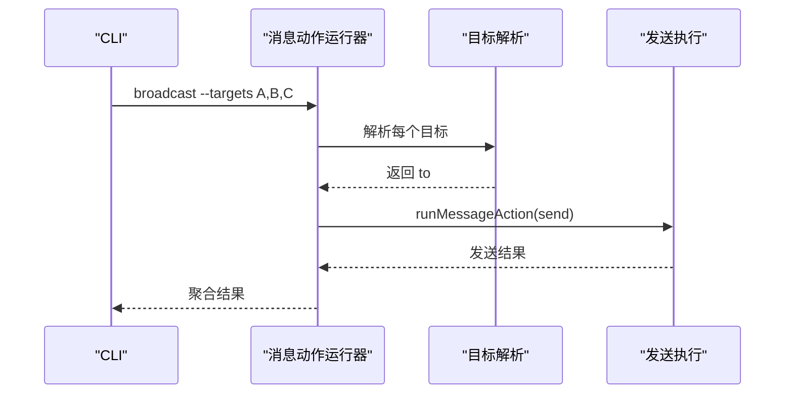
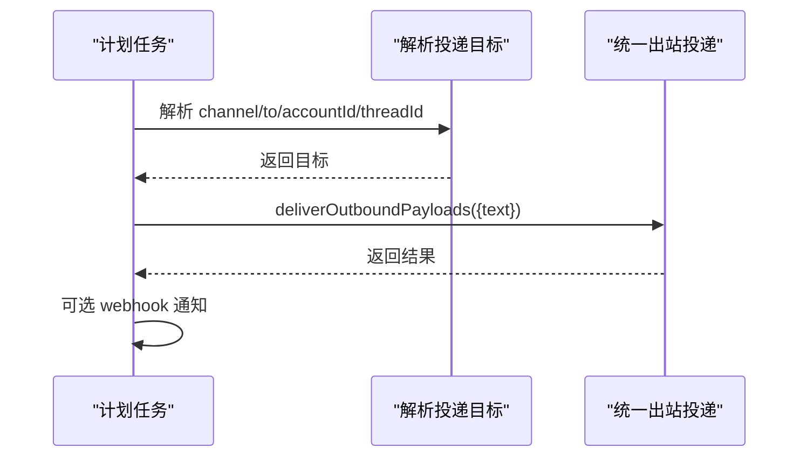
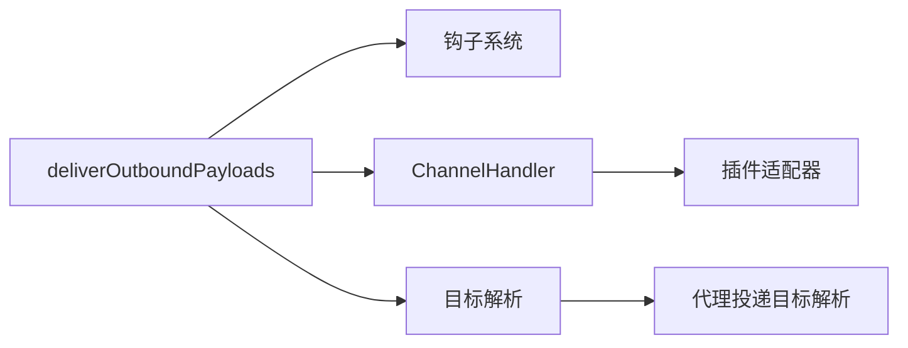

# 消息发送命令

<cite>
**本文引用的文件**
- [docs/cli/message.md](file://docs/cli/message.md)
- [src/infra/outbound/deliver.ts](file://src/infra/outbound/deliver.ts)
- [src/infra/outbound/payloads.ts](file://src/infra/outbound/payloads.ts)
- [src/plugin-sdk/reply-payload.ts](file://src/plugin-sdk/reply-payload.ts)
- [src/infra/outbound/targets.ts](file://src/infra/outbound/targets.ts)
- [src/infra/outbound/agent-delivery.ts](file://src/infra/outbound/agent-delivery.ts)
- [src/infra/outbound/message-action-runner.ts](file://src/infra/outbound/message-action-runner.ts)
- [src/signal/send.ts](file://src/signal/send.ts)
- [src/imessage/send.ts](file://src/imessage/send.ts)
- [src/telegram/bot/reply-threading.ts](file://src/telegram/bot/reply-threading.ts)
- [src/telegram/bot/delivery.replies.ts](file://src/telegram/bot/delivery.replies.ts)
- [src/gateway/server-cron.ts](file://src/gateway/server-cron.ts)
- [src/cron/isolated-agent/run.ts](file://src/cron/isolated-agent/run.ts)
- [src/channels/conversation-label.ts](file://src/channels/conversation-label.ts)
- [src/auto-reply/templating.ts](file://src/auto-reply/templating.ts)
- [src/config/types.messages.ts](file://src/config/types.messages.ts)
</cite>

## 目录

1. [简介](#简介)
2. [项目结构](#项目结构)
3. [核心组件](#核心组件)
4. [架构总览](#架构总览)
5. [详细组件分析](#详细组件分析)
6. [依赖关系分析](#依赖关系分析)
7. [性能考量](#性能考量)
8. [故障排查指南](#故障排查指南)
9. [结论](#结论)
10. [附录](#附录)

## 简介

本文件面向OpenClaw的“消息发送命令”，系统性阐述message命令在多通道（如WhatsApp、Telegram、Discord、Google Chat、Slack、Mattermost、Signal、iMessage、MS Teams）上的发送能力与扩展机制，覆盖以下主题：

- 文本消息、媒体文件、富文本（含交互组件）的发送
- 消息路由、目标选择、线程/回复上下文、格式化策略
- 批量发送、定时发送、条件触发（钩子/计划任务）
- 模板与个性化、自动化消息处理与最佳实践

## 项目结构

围绕消息发送的核心路径如下：

- CLI参考：docs/cli/message.md 提供message命令的用法、参数与示例
- 出站投递核心：src/infra/outbound/deliver.ts 负责统一的出站投递流程、分块、媒体处理、插件适配
- 载荷归一化：src/infra/outbound/payloads.ts 将多来源载荷标准化为统一结构
- 插件SDK：src/plugin-sdk/reply-payload.ts 提供通用的“带分块文本与媒体”的发送抽象
- 目标解析：src/infra/outbound/targets.ts 与 src/infra/outbound/agent-delivery.ts 解析并校验目标
- 渠道适配：各渠道发送实现（如Signal、iMessage、Telegram等）
- 定时与条件触发：src/gateway/server-cron.ts 与 src/cron/isolated-agent/run.ts 支持计划任务驱动的消息投递
- 模板与上下文：src/auto-reply/templating.ts 与 src/config/types.messages.ts 支持响应前缀、模板变量与上下文注入

图表来源

- [docs/cli/message.md:14-261](file://docs/cli/message.md#L14-L261)
- [src/infra/outbound/message-action-runner.ts:333-382](file://src/infra/outbound/message-action-runner.ts#L333-L382)
- [src/infra/outbound/targets.ts:209-238](file://src/infra/outbound/targets.ts#L209-L238)
- [src/infra/outbound/agent-delivery.ts:139-179](file://src/infra/outbound/agent-delivery.ts#L139-L179)
- [src/infra/outbound/deliver.ts:470-800](file://src/infra/outbound/deliver.ts#L470-L800)
- [src/plugin-sdk/reply-payload.ts:52-99](file://src/plugin-sdk/reply-payload.ts#L52-L99)
- [src/gateway/server-cron.ts:339-372](file://src/gateway/server-cron.ts#L339-L372)

章节来源

- [docs/cli/message.md:14-261](file://docs/cli/message.md#L14-L261)
- [src/infra/outbound/deliver.ts:470-800](file://src/infra/outbound/deliver.ts#L470-L800)

## 核心组件

- 统一出站投递器：负责将ReplyPayload按渠道适配、分块、媒体上传/拼接、钩子拦截与回执上报
- 插件SDK分块与媒体发送：提供“先发首条媒体（带文本），后续媒体不带文本”的策略；支持自定义分块器
- 目标解析器：根据配置与会话状态解析最终收件人，支持默认目标、目录缓存、显式/隐式模式
- 钩子系统：message_sending（可修改/取消）、message_sent（内部与插件钩子）
- 渠道适配：各渠道发送实现（如Signal富文本样式、iMessage Markdown表格转换、Telegram按钮/话题）

章节来源

- [src/infra/outbound/deliver.ts:470-800](file://src/infra/outbound/deliver.ts#L470-L800)
- [src/plugin-sdk/reply-payload.ts:52-99](file://src/plugin-sdk/reply-payload.ts#L52-L99)
- [src/infra/outbound/targets.ts:209-238](file://src/infra/outbound/targets.ts#L209-L238)
- [src/infra/outbound/agent-delivery.ts:139-179](file://src/infra/outbound/agent-delivery.ts#L139-L179)

## 架构总览

下图展示从CLI到渠道发送的整体调用链路与关键决策点。

图表来源

- [src/infra/outbound/message-action-runner.ts:333-382](file://src/infra/outbound/message-action-runner.ts#L333-L382)
- [src/infra/outbound/targets.ts:209-238](file://src/infra/outbound/targets.ts#L209-L238)
- [src/infra/outbound/agent-delivery.ts:139-179](file://src/infra/outbound/agent-delivery.ts#L139-L179)
- [src/infra/outbound/deliver.ts:470-800](file://src/infra/outbound/deliver.ts#L470-L800)
- [src/plugin-sdk/reply-payload.ts:52-99](file://src/plugin-sdk/reply-payload.ts#L52-L99)

## 详细组件分析

### 1) 统一出站投递与分块/媒体策略

- 分块策略：根据渠道与配置决定分块模式（长度/段落/换行），对Signal采用专用分块器并保留Markdown表格风格
- 媒体发送：若首条媒体带文本，后续媒体仅发送URL/附件，避免重复文本
- 钩子集成：message_sending可修改/取消；message_sent用于内部与插件通知
- 错误处理：bestEffort模式下记录部分失败，队列持久化保证幂等

图表来源

- [src/infra/outbound/deliver.ts:470-800](file://src/infra/outbound/deliver.ts#L470-L800)
- [src/infra/outbound/payloads.ts:43-79](file://src/infra/outbound/payloads.ts#L43-L79)
- [src/plugin-sdk/reply-payload.ts:52-99](file://src/plugin-sdk/reply-payload.ts#L52-L99)

章节来源

- [src/infra/outbound/deliver.ts:470-800](file://src/infra/outbound/deliver.ts#L470-L800)
- [src/infra/outbound/payloads.ts:43-79](file://src/infra/outbound/payloads.ts#L43-L79)

### 2) 插件SDK：带分块文本与媒体的发送

- sendPayloadWithChunkedTextAndMedia：统一入口，支持自定义分块器与文本限制
- isNumericTargetId：识别数字型目标ID（如电话号码）
- formatTextWithAttachmentLinks：将文本与媒体链接合并输出
- sendMediaWithLeadingCaption：首条媒体带标题，其余仅媒体

图表来源

- [src/plugin-sdk/reply-payload.ts:52-99](file://src/plugin-sdk/reply-payload.ts#L52-L99)
- [src/plugin-sdk/reply-payload.ts:101-146](file://src/plugin-sdk/reply-payload.ts#L101-L146)

章节来源

- [src/plugin-sdk/reply-payload.ts:52-99](file://src/plugin-sdk/reply-payload.ts#L52-L99)
- [src/plugin-sdk/reply-payload.ts:101-146](file://src/plugin-sdk/reply-payload.ts#L101-L146)

### 3) 目标解析与路由

- resolveOutboundTarget：优先使用显式to，否则回退到插件默认或目录缓存
- resolveAgentOutboundTarget：在未显式指定时，基于代理投递计划解析目标
- 会话路由：根据会话键、聊天类型、线程ID等进行路由

图表来源

- [src/infra/outbound/targets.ts:209-238](file://src/infra/outbound/targets.ts#L209-L238)
- [src/infra/outbound/agent-delivery.ts:139-179](file://src/infra/outbound/agent-delivery.ts#L139-L179)

章节来源

- [src/infra/outbound/targets.ts:209-238](file://src/infra/outbound/targets.ts#L209-L238)
- [src/infra/outbound/agent-delivery.ts:139-179](file://src/infra/outbound/agent-delivery.ts#L139-L179)

### 4) 渠道适配要点

- Signal：支持富文本样式数组；Markdown表格需按表模式转换
- iMessage：Markdown表格转换；媒体URL解析为本地文件；支持回复标签
- Telegram：按钮/话题/论坛主题；回复模式控制是否带reply_to

图表来源

- [src/signal/send.ts:142-193](file://src/signal/send.ts#L142-L193)
- [src/imessage/send.ts:125-169](file://src/imessage/send.ts#L125-L169)
- [src/telegram/bot/reply-threading.ts:15-33](file://src/telegram/bot/reply-threading.ts#L15-L33)
- [src/telegram/bot/delivery.replies.ts:84-103](file://src/telegram/bot/delivery.replies.ts#L84-L103)

章节来源

- [src/signal/send.ts:142-193](file://src/signal/send.ts#L142-L193)
- [src/imessage/send.ts:125-169](file://src/imessage/send.ts#L125-L169)
- [src/telegram/bot/reply-threading.ts:15-33](file://src/telegram/bot/reply-threading.ts#L15-L33)
- [src/telegram/bot/delivery.replies.ts:84-103](file://src/telegram/bot/delivery.replies.ts#L84-L103)

### 5) 批量发送与广播

- message-action-runner：遍历目标通道与目标列表，逐个解析并发送
- 结果聚合：记录每个目标的发送结果（成功/失败）

图表来源

- [src/infra/outbound/message-action-runner.ts:333-382](file://src/infra/outbound/message-action-runner.ts#L333-L382)

章节来源

- [src/infra/outbound/message-action-runner.ts:333-382](file://src/infra/outbound/message-action-runner.ts#L333-L382)

### 6) 定时发送与条件触发

- 计划任务：server-cron根据作业配置解析投递目标并调用deliverOutboundPayloads
- 隔离执行：isolated-agent在独立会话中解析投递上下文，必要时追加交付指令
- Webhook通知：作业完成后可选通知外部系统

图表来源

- [src/gateway/server-cron.ts:339-372](file://src/gateway/server-cron.ts#L339-L372)
- [src/cron/isolated-agent/run.ts:166-199](file://src/cron/isolated-agent/run.ts#L166-L199)

章节来源

- [src/gateway/server-cron.ts:339-372](file://src/gateway/server-cron.ts#L339-L372)
- [src/cron/isolated-agent/run.ts:166-199](file://src/cron/isolated-agent/run.ts#L166-L199)

### 7) 模板与个性化

- 模板变量：支持模型名、提供商、思考级别、身份名称等变量
- 上下文注入：MsgContext包含历史、线程、媒体、转发等丰富字段，便于构建个性化消息
- 响应前缀：可配置全局响应前缀，支持模板变量

章节来源

- [src/auto-reply/templating.ts:14-182](file://src/auto-reply/templating.ts#L14-L182)
- [src/config/types.messages.ts:85-114](file://src/config/types.messages.ts#L85-L114)

## 依赖关系分析

- deliverOutboundPayloads 依赖插件适配器（sendText/sendMedia/chunker）与钩子系统
- 插件SDK与渠道适配器解耦，通过ChannelHandler桥接
- 目标解析与会话路由相互协作，确保消息回到正确的对话/线程

图表来源

- [src/infra/outbound/deliver.ts:470-800](file://src/infra/outbound/deliver.ts#L470-L800)
- [src/infra/outbound/targets.ts:209-238](file://src/infra/outbound/targets.ts#L209-L238)
- [src/infra/outbound/agent-delivery.ts:139-179](file://src/infra/outbound/agent-delivery.ts#L139-L179)

章节来源

- [src/infra/outbound/deliver.ts:470-800](file://src/infra/outbound/deliver.ts#L470-L800)
- [src/infra/outbound/targets.ts:209-238](file://src/infra/outbound/targets.ts#L209-L238)
- [src/infra/outbound/agent-delivery.ts:139-179](file://src/infra/outbound/agent-delivery.ts#L139-L179)

## 性能考量

- 分块策略：按渠道与配置选择合适分块模式，减少单次发送失败影响
- 媒体上传：优先直传URL，失败回退至文本URL；Telegram/iMessage等对媒体有大小限制
- 最佳努力：bestEffort模式允许部分失败，提升吞吐
- 队列持久化：写入队列后发送，成功/失败后确认清理，避免重复

## 故障排查指南

- 缺少目标：resolveOutboundTarget返回缺失目标错误
- 无文本也无媒体：各渠道发送前校验，抛出“需要文本或媒体”错误
- 插件未实现sendMedia：降级为纯文本发送，若无文本则报错
- 钩子异常：message_sending钩子失败不会阻断投递，但需关注日志

章节来源

- [src/infra/outbound/targets.ts:209-238](file://src/infra/outbound/targets.ts#L209-L238)
- [src/signal/send.ts:157-159](file://src/signal/send.ts#L157-L159)
- [src/infra/outbound/deliver.ts:754-777](file://src/infra/outbound/deliver.ts#L754-L777)

## 结论

OpenClaw的消息发送命令以统一的出站投递为核心，结合插件SDK与渠道适配器，实现了跨平台、可扩展的消息发送能力。通过目标解析、钩子系统、分块与媒体策略以及定时/条件触发机制，既能满足日常文本与媒体发送，也能支撑复杂场景下的批量、自动化与个性化需求。

## 附录

- CLI参考与示例：参见docs/cli/message.md中的Actions与Examples部分
- 目标格式与名称解析：参见docs/cli/message.md中的Channel selection与Name lookup
- 会话与线程：参见src/telegram/bot/reply-threading.ts与src/telegram/bot/delivery.replies.ts中的回复模式与进度标记

章节来源

- [docs/cli/message.md:14-261](file://docs/cli/message.md#L14-L261)
- [src/telegram/bot/reply-threading.ts:15-33](file://src/telegram/bot/reply-threading.ts#L15-L33)
- [src/telegram/bot/delivery.replies.ts:84-103](file://src/telegram/bot/delivery.replies.ts#L84-L103)
