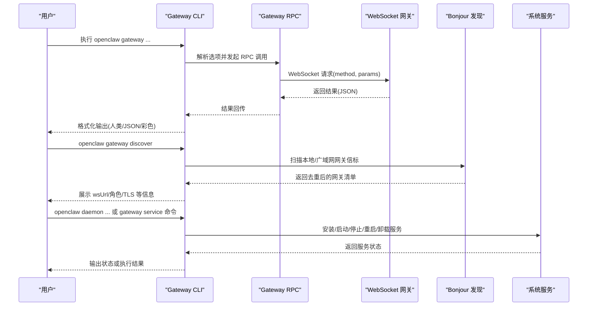
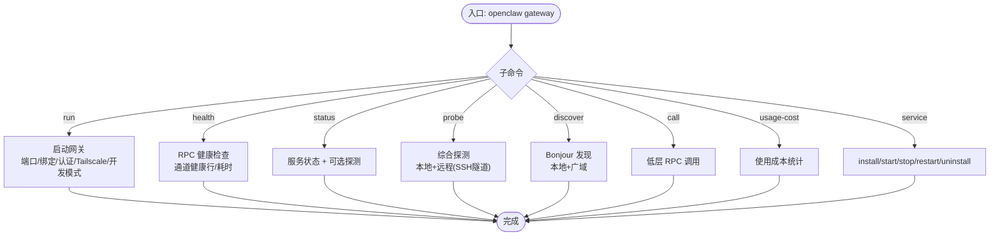
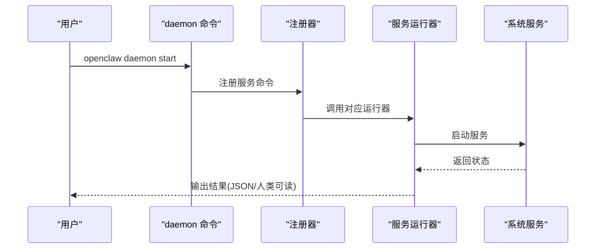
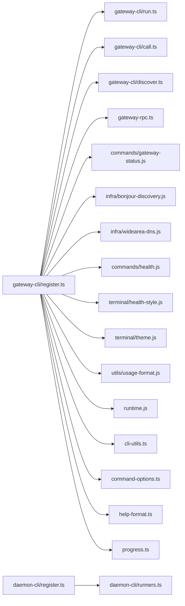

# 网关控制命令

<cite>
**本文引用的文件**
- [gateway.md](file://docs/cli/gateway.md)
- [daemon.md](file://docs/cli/daemon.md)
- [doctor.md](file://docs/cli/doctor.md)
- [status.md](file://docs/cli/status.md)
- [gateway-cli/register.ts](file://src/cli/gateway-cli/register.ts)
- [gateway-cli/run.ts](file://src/cli/gateway-cli/run.ts)
- [gateway-cli/call.ts](file://src/cli/gateway-cli/call.ts)
- [gateway-cli/discover.ts](file://src/cli/gateway-cli/discover.ts)
- [daemon-cli/register.ts](file://src/cli/daemon-cli/register.ts)
- [daemon-cli/runners.ts](file://src/cli/daemon-cli/runners.ts)
- [gateway-rpc.ts](file://src/cli/gateway-rpc.ts)
- [commands/gateway-status.js](file://src/commands/gateway-status.js)
- [infra/bonjour-discovery.js](file://src/infra/bonjour-discovery.js)
- [infra/widearea-dns.js](file://src/infra/widearea-dns.js)
- [commands/health.js](file://src/commands/health.js)
- [terminal/health-style.js](file://src/terminal/health-style.js)
- [terminal/theme.js](file://src/terminal/theme.js)
- [utils/usage-format.js](file://src/utils/usage-format.js)
- [runtime.js](file://src/runtime.js)
- [cli-utils.ts](file://src/cli/cli-utils.ts)
- [command-options.ts](file://src/cli/command-options.ts)
- [help-format.ts](file://src/cli/help-format.ts)
- [progress.ts](file://src/cli/progress.ts)
</cite>

## 目录

1. [简介](#简介)
2. [项目结构](#项目结构)
3. [核心组件](#核心组件)
4. [架构总览](#架构总览)
5. [详细组件分析](#详细组件分析)
6. [依赖关系分析](#依赖关系分析)
7. [性能考量](#性能考量)
8. [故障排除指南](#故障排除指南)
9. [结论](#结论)
10. [附录](#附录)

## 简介

本文件系统性梳理 OpenClaw 网关控制命令，覆盖 gateway、daemon、doctor、status-all（通过 status 子命令实现）等管理命令的功能与用法，说明网关启动、停止、重启、健康检查等操作流程，并扩展到状态监控、诊断工具、故障排除、配置管理、性能调优与安全设置等高级主题。同时给出多网关环境下的管理策略与最佳实践。

## 项目结构

OpenClaw 的 CLI 命令由两部分组成：

- 文档层：位于 docs/cli，提供用户手册与示例
- 实现层：位于 src/cli，包含命令注册、运行时、RPC 调用、服务生命周期管理等

```mermaid
graph TB
subgraph "文档层"
D1["docs/cli/gateway.md"]
D2["docs/cli/daemon.md"]
D3["docs/cli/doctor.md"]
D4["docs/cli/status.md"]
end
subgraph "实现层"
C1["src/cli/gateway-cli/register.ts"]
C2["src/cli/gateway-cli/run.ts"]
C3["src/cli/gateway-cli/call.ts"]
C4["src/cli/gateway-cli/discover.ts"]
C5["src/cli/daemon-cli/register.ts"]
C6["src/cli/daemon-cli/runners.ts"]
C7["src/cli/gateway-rpc.ts"]
C8["src/commands/gateway-status.js"]
C9["src/infra/bonjour-discovery.js"]
C10["src/infra/widearea-dns.js"]
C11["src/commands/health.js"]
C12["src/terminal/health-style.js"]
C13["src/terminal/theme.js"]
C14["src/utils/usage-format.js"]
C15["src/runtime.js"]
C16["src/cli/cli-utils.ts"]
C17["src/cli/command-options.ts"]
C18["src/cli/help-format.ts"]
C19["src/cli/progress.ts"]
end
D1 --> C1
D2 --> C5
D3 --> C8
D4 --> C8
C1 --> C2
C1 --> C3
C1 --> C4
C1 --> C8
C1 --> C9
C1 --> C10
C1 --> C11
C1 --> C12
C1 --> C13
C1 --> C14
C1 --> C15
C1 --> C16
C1 --> C17
C1 --> C18
C1 --> C19
C5 --> C6
C1 --> C7
```

图表来源

- [gateway-cli/register.ts:89-281](file://src/cli/gateway-cli/register.ts#L89-L281)
- [daemon-cli/register.ts:6-19](file://src/cli/daemon-cli/register.ts#L6-L19)
- [gateway.md:1-215](file://docs/cli/gateway.md#L1-L215)
- [daemon.md:1-52](file://docs/cli/daemon.md#L1-L52)
- [doctor.md:1-46](file://docs/cli/doctor.md#L1-L46)
- [status.md:1-29](file://docs/cli/status.md#L1-L29)

章节来源

- [gateway.md:1-215](file://docs/cli/gateway.md#L1-L215)
- [daemon.md:1-52](file://docs/cli/daemon.md#L1-L52)
- [doctor.md:1-46](file://docs/cli/doctor.md#L1-L46)
- [status.md:1-29](file://docs/cli/status.md#L1-L29)

## 核心组件

- 网关命令注册器：负责注册 gateway 及其子命令（run、health、status、probe、discover、call、usage-cost），并统一处理 RPC 选项继承与输出格式化。
- 守护进程命令注册器：提供 daemon 子命令（兼容旧版），映射到相同的网关服务生命周期命令。
- 网关 RPC：封装 WebSocket RPC 调用，支持参数解析与错误处理。
- 发现与探测：基于 Bonjour 的本地与广域发现，以及综合探测（本地+远程）。
- 健康与状态：聚合通道健康信息、格式化输出、主题化展示。
- 运行时与工具：统一的运行时日志、颜色主题、帮助格式化、进度条等。

章节来源

- [gateway-cli/register.ts:89-281](file://src/cli/gateway-cli/register.ts#L89-L281)
- [daemon-cli/register.ts:6-19](file://src/cli/daemon-cli/register.ts#L6-L19)
- [gateway-rpc.ts](file://src/cli/gateway-rpc.ts)
- [commands/gateway-status.js](file://src/commands/gateway-status.js)
- [infra/bonjour-discovery.js](file://src/infra/bonjour-discovery.js)
- [commands/health.js](file://src/commands/health.js)
- [terminal/health-style.js](file://src/terminal/health-style.js)
- [terminal/theme.js](file://src/terminal/theme.js)
- [utils/usage-format.js](file://src/utils/usage-format.js)
- [runtime.js](file://src/runtime.js)
- [cli-utils.ts](file://src/cli/cli-utils.ts)
- [command-options.ts](file://src/cli/command-options.ts)
- [help-format.ts](file://src/cli/help-format.ts)
- [progress.ts](file://src/cli/progress.ts)

## 架构总览

下图展示了从 CLI 到网关服务与外部基础设施的整体交互：

图表来源

- [gateway-cli/register.ts:114-279](file://src/cli/gateway-cli/register.ts#L114-L279)
- [gateway-cli/discover.ts](file://src/cli/gateway-cli/discover.ts)
- [daemon-cli/runners.ts](file://src/cli/daemon-cli/runners.ts)
- [gateway-rpc.ts](file://src/cli/gateway-rpc.ts)

## 详细组件分析

### 网关命令（gateway）

- 功能概览
  - 启动网关：前台运行、端口绑定、认证模式、暴露方式（Tailscale）、开发模式、强制启动等。
  - 查询网关：健康检查、状态查询、RPC 调用、使用成本统计、探测可达性、发现网关。
  - 管理服务：安装/启动/停止/重启/卸载网关服务，支持 token/password 认证与 SecretRef 验证。
  - 发现网关：本地与广域 Bonjour 发现，支持去重与 JSON 输出。
- 关键特性
  - 统一的 RPC 选项继承：子命令可继承父级 token/password。
  - 多样化输出：人类可读、JSON、禁色。
  - 探测与远程：支持 SSH 隧道探测远程网关。
  - 广域发现：根据配置解析 Wide-Area 域名，扫描多域信标。
- 典型流程
  - 启动：解析配置与运行参数 → 安全校验 → 启动网关进程 → 捕获信号进行重启/退出。
  - 健康检查：构造 RPC 请求 → 获取健康摘要 → 格式化通道健康行 → 输出耗时。
  - 服务管理：安装前验证 SecretRef 可解析；若需 token 且 SecretRef 未解析则拒绝安装。
  - 发现：扫描本地与可选广域域名 → 去重排序 → 生成 wsUrl/元数据 → 输出。

图表来源

- [gateway-cli/register.ts:89-281](file://src/cli/gateway-cli/register.ts#L89-L281)
- [gateway-cli/call.ts](file://src/cli/gateway-cli/call.ts)
- [gateway-cli/discover.ts](file://src/cli/gateway-cli/discover.ts)
- [commands/gateway-status.js](file://src/commands/gateway-status.js)

章节来源

- [gateway.md:22-215](file://docs/cli/gateway.md#L22-L215)
- [gateway-cli/register.ts:89-281](file://src/cli/gateway-cli/register.ts#L89-L281)
- [gateway-cli/run.ts](file://src/cli/gateway-cli/run.ts)
- [gateway-cli/call.ts](file://src/cli/gateway-cli/call.ts)
- [gateway-cli/discover.ts](file://src/cli/gateway-cli/discover.ts)
- [commands/gateway-status.js](file://src/commands/gateway-status.js)
- [infra/bonjour-discovery.js](file://src/infra/bonjour-discovery.js)
- [infra/widearea-dns.js](file://src/infra/widearea-dns.js)
- [commands/health.js](file://src/commands/health.js)
- [terminal/health-style.js](file://src/terminal/health-style.js)
- [terminal/theme.js](file://src/terminal/theme.js)
- [utils/usage-format.js](file://src/utils/usage-format.js)
- [runtime.js](file://src/runtime.js)
- [cli-utils.ts](file://src/cli/cli-utils.ts)
- [command-options.ts](file://src/cli/command-options.ts)
- [help-format.ts](file://src/cli/help-format.ts)
- [progress.ts](file://src/cli/progress.ts)

### 守护进程命令（daemon）

- 功能概览
  - 兼容旧版：daemon status/install/start/stop/restart/uninstall 映射到 gateway 服务命令。
  - 服务状态：解析 SecretRef 以用于探测认证；Linux systemd 下读取 Environment/EnvironmentFile。
  - 安装：支持端口、运行时、token、强制覆盖、JSON 输出；SecretRef 验证与拒绝明文持久化。
- 使用建议
  - 新脚本优先使用 openclaw gateway；如需兼容旧脚本可继续使用 daemon。

图表来源

- [daemon-cli/register.ts:6-19](file://src/cli/daemon-cli/register.ts#L6-L19)
- [daemon-cli/runners.ts](file://src/cli/daemon-cli/runners.ts)

章节来源

- [daemon.md:1-52](file://docs/cli/daemon.md#L1-L52)
- [daemon-cli/register.ts:6-19](file://src/cli/daemon-cli/register.ts#L6-L19)
- [daemon-cli/runners.ts](file://src/cli/daemon-cli/runners.ts)

### 诊断工具（doctor）

- 功能概览
  - 健康检查与快速修复：交互式提示（TTY 且非非交互模式）、备份配置、清理未知键、会话转储归档、cron 作业规范化、内存搜索就绪检查、Docker 可用性检测等。
  - macOS launchctl 环境变量覆盖：可查询/清除 OPENCLAW_GATEWAY_TOKEN/PASSWORD 导致的“未授权”问题。
- 使用建议
  - 在更新后或出现连接/认证问题时运行 doctor，必要时加上 --repair/--deep。

章节来源

- [doctor.md:1-46](file://docs/cli/doctor.md#L1-L46)

### 状态总览（status）

- 功能概览
  - 快速诊断通道与会话：支持 --all、--deep（对多个平台进行实时探测）、--usage（用量快照）。
  - 输出增强：包含网关/节点主机服务状态、更新通道与版本信息；SecretRef 不可用时以只读方式输出并给出诊断。
- 使用建议
  - 作为调试“一键包”，配合 --all/--deep/--usage 获取全面视图。

章节来源

- [status.md:1-29](file://docs/cli/status.md#L1-L29)

## 依赖关系分析

- 命令注册与运行
  - gateway-cli/register.ts 负责注册所有子命令，统一处理 RPC 选项继承、输出格式化与运行时包装。
  - daemon-cli/register.ts 将 daemon 子命令映射到相同的服务命令集合。
- RPC 与输出
  - gateway-rpc.ts 提供 RPC 调用封装；commands/health.js 与 terminal/\* 提供健康信息格式化与主题化。
- 发现与探测
  - infra/bonjour-discovery.js 与 infra/widearea-dns.js 协作完成本地与广域发现；gateway-cli/discover.ts 负责 CLI 侧的解析、去重与渲染。
- 工具与运行时
  - runtime.js、cli-utils.ts、command-options.ts、help-format.ts、progress.ts 提供统一的日志、颜色、选项继承、帮助格式与进度控制。

图表来源

- [gateway-cli/register.ts:89-281](file://src/cli/gateway-cli/register.ts#L89-L281)
- [gateway-cli/run.ts](file://src/cli/gateway-cli/run.ts)
- [gateway-cli/call.ts](file://src/cli/gateway-cli/call.ts)
- [gateway-cli/discover.ts](file://src/cli/gateway-cli/discover.ts)
- [gateway-rpc.ts](file://src/cli/gateway-rpc.ts)
- [commands/gateway-status.js](file://src/commands/gateway-status.js)
- [infra/bonjour-discovery.js](file://src/infra/bonjour-discovery.js)
- [infra/widearea-dns.js](file://src/infra/widearea-dns.js)
- [commands/health.js](file://src/commands/health.js)
- [terminal/health-style.js](file://src/terminal/health-style.js)
- [terminal/theme.js](file://src/terminal/theme.js)
- [utils/usage-format.js](file://src/utils/usage-format.js)
- [runtime.js](file://src/runtime.js)
- [cli-utils.ts](file://src/cli/cli-utils.ts)
- [command-options.ts](file://src/cli/command-options.ts)
- [help-format.ts](file://src/cli/help-format.ts)
- [progress.ts](file://src/cli/progress.ts)
- [daemon-cli/register.ts:6-19](file://src/cli/daemon-cli/register.ts#L6-L19)
- [daemon-cli/runners.ts](file://src/cli/daemon-cli/runners.ts)

章节来源

- [gateway-cli/register.ts:89-281](file://src/cli/gateway-cli/register.ts#L89-L281)
- [daemon-cli/register.ts:6-19](file://src/cli/daemon-cli/register.ts#L6-L19)

## 性能考量

- 日志与输出
  - 使用 --ws-log/auto|full|compact 控制 WebSocket 日志风格；--compact 为紧凑模式别名；--raw-stream/--raw-stream-path 输出原始流事件以便离线分析。
  - --json 与 NO_COLOR=1 可减少渲染开销，适合自动化与 CI。
- 探测与发现
  - discover/probe 支持超时与 JSON 输出，避免长时间阻塞；广域发现仅在配置启用时扫描指定域名。
- 运行时与资源
  - 默认运行时封装统一错误处理与退出码；合理设置超时与预算，避免长时间占用 CPU/GC。
- 诊断与修复
  - doctor 的内存搜索就绪检查与 cron 规范化可减少运行期异常与资源浪费。

章节来源

- [gateway.md:43-63](file://docs/cli/gateway.md#L43-L63)
- [gateway-cli/register.ts:213-279](file://src/cli/gateway-cli/register.ts#L213-L279)
- [doctor.md:26-33](file://docs/cli/doctor.md#L26-L33)

## 故障排除指南

- 认证与凭据
  - 若使用 SecretRef 管理 token/password，安装阶段会验证可解析性；若不可解析，安装失败以避免持久化明文。
  - 探测与查询时，若 SecretRef 在当前命令路径不可解析，将保持只读并报告降级输出；可通过显式传递 --token/--password 或先解析 SecretRef。
  - macOS launchctl 环境变量可能覆盖配置导致“未授权”；可查询/清除 OPENCLAW_GATEWAY_TOKEN/PASSWORD。
- 连接与可达性
  - 使用 gateway probe 结合 --ssh/--ssh-auto 对远程网关进行隧道探测；结合 discover 查看本地/广域网关清单。
  - 若绑定到环回地址且无认证，CLI 会阻止启动（安全防护）。
- 服务状态与漂移
  - Linux systemd 安装下，服务认证漂移检查会读取 Environment 与 EnvironmentFile；doctor 可协助识别与修复。
- 会话与存储
  - doctor 可检测并安全归档孤儿会话转录文件，释放磁盘空间；cron 作业可被就地规范化，避免运行期自动转换带来的开销。

章节来源

- [gateway.md:109-114](file://docs/cli/gateway.md#L109-L114)
- [gateway.md:171-177](file://docs/cli/gateway.md#L171-L177)
- [doctor.md:26-34](file://docs/cli/doctor.md#L26-L34)
- [daemon.md:35-47](file://docs/cli/daemon.md#L35-L47)

## 结论

OpenClaw 的网关控制命令提供了从启动、管理到诊断、发现的完整工具链。通过统一的 RPC 选项继承、丰富的输出格式与强大的发现/探测能力，用户可在单网关与多网关环境中高效运维。建议优先使用 gateway 子命令，结合 doctor 与 status 进行日常维护与故障排查，并在生产环境中严格管理 SecretRef 与暴露策略以确保安全与稳定。

## 附录

- 多网关环境管理策略
  - 使用隔离配置/端口区分不同网关实例；通过 discover/probe 识别与选择目标。
  - 在广域场景下配置 Wide-Area 域名与 DNS，确保 Bonjour 信标正确传播。
  - 为每个网关配置独立的 SecretRef，避免凭据冲突与漂移。
- 安全与合规
  - 默认拒绝无认证绑定到非环回地址；生产环境建议使用 token 认证与 TLS。
  - 定期运行 doctor 进行安全审计与修复；必要时调整 Sandbox 模式与 Docker 可用性。
- 性能优化建议
  - 合理设置日志级别与输出格式；在 CI 中使用 --json 与 NO_COLOR=1。
  - 使用 discover/probe 的超时与预算控制，避免长时间阻塞。
  - 定期归档会话与规范化 cron 作业，降低运行期开销。
