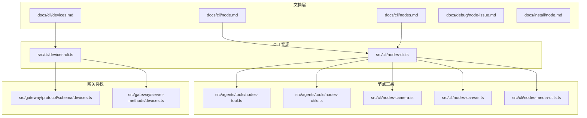
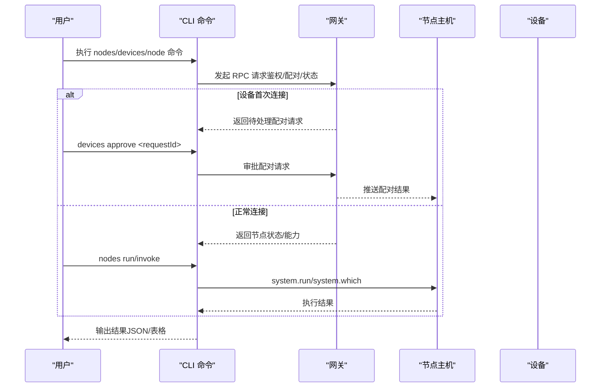
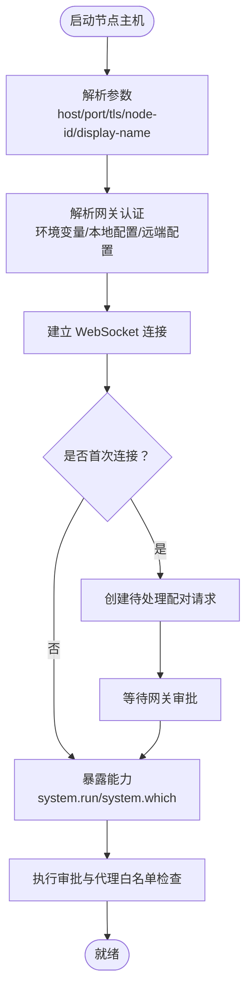
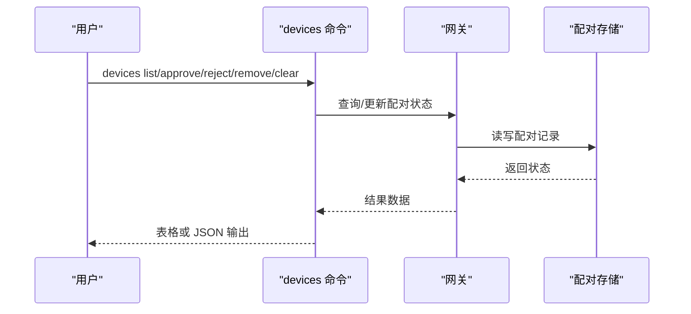
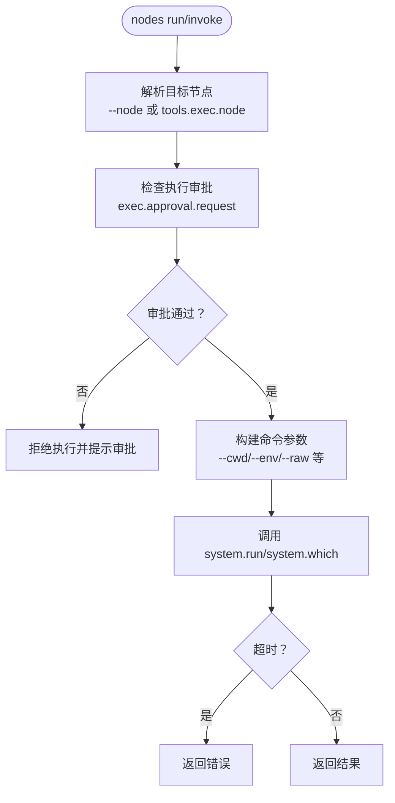
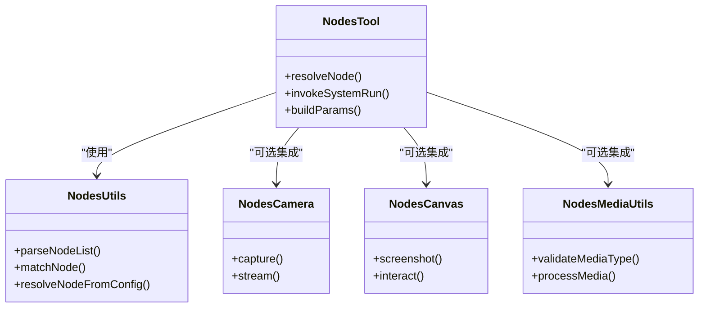
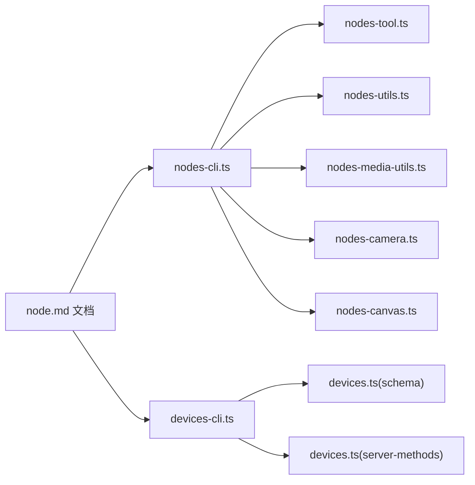

# 节点管理命令

<cite>
**本文档引用的文件**
- [docs/cli/node.md](file://docs/cli/node.md)
- [docs/cli/nodes.md](file://docs/cli/nodes.md)
- [docs/cli/devices.md](file://docs/cli/devices.md)
- [src/cli/nodes-cli.ts](file://src/cli/nodes-cli.ts)
- [src/cli/devices-cli.ts](file://src/cli/devices-cli.ts)
- [src/agents/tools/nodes-tool.ts](file://src/agents/tools/nodes-tool.ts)
- [src/agents/tools/nodes-utils.ts](file://src/agents/tools/nodes-utils.ts)
- [src/cli/nodes-camera.ts](file://src/cli/nodes-camera.ts)
- [src/cli/nodes-canvas.ts](file://src/cli/nodes-canvas.ts)
- [src/cli/nodes-media-utils.ts](file://src/cli/nodes-media-utils.ts)
- [src/gateway/protocol/schema/devices.ts](file://src/gateway/protocol/schema/devices.ts)
- [src/gateway/server-methods/devices.ts](file://src/gateway/server-methods/devices.ts)
- [docs/debug/node-issue.md](file://docs/debug/node-issue.md)
- [docs/install/node.md](file://docs/install/node.md)
- [docs/zh-CN/cli/node.md](file://docs/zh-CN/cli/node.md)
- [docs/zh-CN/cli/nodes.md](file://docs/zh-CN/cli/nodes.md)
- [docs/zh-CN/cli/devices.md](file://docs/zh-CN/cli/devices.md)
</cite>

## 目录

1. [简介](#简介)
2. [项目结构](#项目结构)
3. [核心组件](#核心组件)
4. [架构总览](#架构总览)
5. [详细组件分析](#详细组件分析)
6. [依赖关系分析](#依赖关系分析)
7. [性能考虑](#性能考虑)
8. [故障排除指南](#故障排除指南)
9. [结论](#结论)
10. [附录](#附录)

## 简介

本文件系统性梳理 OpenClaw 的节点管理命令体系，覆盖以下主题：

- 节点发现与配对：通过网关进行设备配对请求审批与令牌轮换
- 连接管理：节点主机运行模式（前台/后台服务）、TLS 验证、浏览器代理
- 设备与节点命令：nodes、node、devices 命令的功能、参数与使用场景
- 状态监控与性能统计：节点列表、连接状态、最近连接时间过滤
- 故障诊断：AUTH_TOKEN_MISMATCH 等常见问题的排查流程
- 配置与集群：执行审批、代理节点选择、跨节点命令执行
- 多节点环境：负载均衡与协调机制（基于节点能力与权限）

## 项目结构

OpenClaw 将节点管理相关的 CLI 文档与实现分布在如下位置：

- 文档层：docs/cli/\*.md 提供用户参考与使用说明
- 实现层：src/cli/_ 提供命令解析与调用逻辑；src/agents/tools/_ 提供节点工具与实用函数；src/gateway/\* 提供网关侧设备与配对协议

**图表来源**

- [docs/cli/node.md:1-124](file://docs/cli/node.md#L1-L124)
- [docs/cli/nodes.md:1-76](file://docs/cli/nodes.md#L1-L76)
- [docs/cli/devices.md:1-132](file://docs/cli/devices.md#L1-L132)
- [src/cli/nodes-cli.ts](file://src/cli/nodes-cli.ts)
- [src/cli/devices-cli.ts](file://src/cli/devices-cli.ts)
- [src/agents/tools/nodes-tool.ts](file://src/agents/tools/nodes-tool.ts)
- [src/agents/tools/nodes-utils.ts](file://src/agents/tools/nodes-utils.ts)
- [src/cli/nodes-camera.ts](file://src/cli/nodes-camera.ts)
- [src/cli/nodes-canvas.ts](file://src/cli/nodes-canvas.ts)
- [src/cli/nodes-media-utils.ts](file://src/cli/nodes-media-utils.ts)
- [src/gateway/protocol/schema/devices.ts](file://src/gateway/protocol/schema/devices.ts)
- [src/gateway/server-methods/devices.ts](file://src/gateway/server-methods/devices.ts)

**章节来源**

- [docs/cli/node.md:1-124](file://docs/cli/node.md#L1-L124)
- [docs/cli/nodes.md:1-76](file://docs/cli/nodes.md#L1-L76)
- [docs/cli/devices.md:1-132](file://docs/cli/devices.md#L1-L132)

## 核心组件

- 节点主机（Node Host）
  - 无头运行：在非 macOS 主机上提供 system.run/system.which 能力
  - 服务化部署：支持安装为用户服务，支持前台运行与后台服务管理
  - 安全控制：执行审批与代理白名单，TLS 证书指纹校验
  - 浏览器代理：自动暴露浏览器自动化能力（可禁用）
- 设备配对（Device Pairing）
  - 首次连接产生待处理配对请求，需在网关侧审批
  - 支持批量清理、移除、轮换与吊销设备令牌
- 节点管理（Nodes Management）
  - 列表/状态查询：按连接状态与最近连接时间过滤
  - 执行与调用：nodes run/invoke 支持工作目录、环境变量、超时、幂等键等
  - 能力扩展：相机、画布、屏幕等节点能力

**章节来源**

- [docs/cli/node.md:14-124](file://docs/cli/node.md#L14-L124)
- [docs/cli/nodes.md:9-76](file://docs/cli/nodes.md#L9-L76)
- [docs/cli/devices.md:9-132](file://docs/cli/devices.md#L9-L132)

## 架构总览

下图展示节点管理命令在整体系统中的交互关系：CLI 命令通过网关与节点主机通信，节点主机暴露 system.run/system.which 能力，网关负责配对、鉴权与路由。

**图表来源**

- [src/cli/nodes-cli.ts](file://src/cli/nodes-cli.ts)
- [src/cli/devices-cli.ts](file://src/cli/devices-cli.ts)
- [src/gateway/server-methods/devices.ts](file://src/gateway/server-methods/devices.ts)

## 详细组件分析

### 节点主机命令（openclaw node）

- 功能概述
  - 在非 macOS 主机上运行无头节点主机，提供 system.run/system.which
  - 支持前台运行与后台服务安装，支持 TLS 与证书指纹校验
  - 自动暴露浏览器代理（可禁用），便于浏览器自动化
- 关键参数
  - 连接参数：host、port、tls、tls-fingerprint
  - 身份参数：node-id、display-name
  - 服务参数：runtime、force
- 认证机制
  - 优先从环境变量 OPENCLAW_GATEWAY_TOKEN/PASSWORD 解析
  - 回退到本地配置 gateway.auth.token/password
  - 远端模式下允许远程凭据参与解析
- 使用场景
  - 在 Linux/Windows 上运行命令而不安装完整 macOS 应用
  - 将执行沙箱化在网关，但将具体执行委派给其他主机
  - CI/自动化节点的轻量级执行目标

**图表来源**

- [docs/cli/node.md:46-124](file://docs/cli/node.md#L46-L124)

**章节来源**

- [docs/cli/node.md:9-124](file://docs/cli/node.md#L9-L124)

### 设备配对命令（openclaw devices）

- 功能概述
  - 列出待处理配对请求与已配对设备
  - 移除单个设备、批量清理（受 --yes 保护）
  - 审批/拒绝待处理配对请求（支持 --latest）
  - 为特定角色轮换/吊销设备令牌（operator/node 等）
- 关键参数
  - --url/--token/--password：显式指定网关地址与凭据
  - --timeout：RPC 超时
  - --json：机器可读输出
- 安全与合规
  - 轮换令牌返回新密钥，需妥善保管
  - 清理操作需要明确确认
  - 某些场景可在本地回退使用配对通道

**图表来源**

- [src/cli/devices-cli.ts](file://src/cli/devices-cli.ts)
- [src/gateway/protocol/schema/devices.ts](file://src/gateway/protocol/schema/devices.ts)
- [src/gateway/server-methods/devices.ts](file://src/gateway/server-methods/devices.ts)

**章节来源**

- [docs/cli/devices.md:9-132](file://docs/cli/devices.md#L9-L132)

### 节点管理命令（openclaw nodes）

- 功能概述
  - 列出/查看节点状态，支持过滤“已连接”与“最近连接时间”
  - 审批节点配对请求（与 devices approve 对应）
  - 调用节点能力：nodes run/invoke
- 调用能力与默认行为
  - nodes run 默认遵循工具链 exec 行为：读取 tools.exec.\* 与代理配置
  - 通过 exec approvals 控制 system.run 的执行
  - 可省略 --node 若已设置 tools.exec.node
- 关键参数
  - invoke 参数：--params、--invoke-timeout、--idempotency-key
  - exec 风格参数：--cwd、--env、--command-timeout、--raw、--agent、--ask、--security
  - 权限要求：需要具备相应作用域

**图表来源**

- [docs/cli/nodes.md:40-76](file://docs/cli/nodes.md#L40-L76)
- [src/agents/tools/nodes-tool.ts](file://src/agents/tools/nodes-tool.ts)
- [src/agents/tools/nodes-utils.ts](file://src/agents/tools/nodes-utils.ts)

**章节来源**

- [docs/cli/nodes.md:9-76](file://docs/cli/nodes.md#L9-L76)

### 节点工具与媒体能力

- 节点工具
  - nodes-tool：封装节点选择、匹配与调用
  - nodes-utils：通用节点解析与列表处理
- 媒体能力
  - nodes-camera：相机节点能力
  - nodes-canvas：画布节点能力
  - nodes-media-utils：媒体相关工具

**图表来源**

- [src/agents/tools/nodes-tool.ts](file://src/agents/tools/nodes-tool.ts)
- [src/agents/tools/nodes-utils.ts](file://src/agents/tools/nodes-utils.ts)
- [src/cli/nodes-camera.ts](file://src/cli/nodes-camera.ts)
- [src/cli/nodes-canvas.ts](file://src/cli/nodes-canvas.ts)
- [src/cli/nodes-media-utils.ts](file://src/cli/nodes-media-utils.ts)

**章节来源**

- [src/agents/tools/nodes-tool.ts](file://src/agents/tools/nodes-tool.ts)
- [src/agents/tools/nodes-utils.ts](file://src/agents/tools/nodes-utils.ts)
- [src/cli/nodes-camera.ts](file://src/cli/nodes-camera.ts)
- [src/cli/nodes-canvas.ts](file://src/cli/nodes-canvas.ts)
- [src/cli/nodes-media-utils.ts](file://src/cli/nodes-media-utils.ts)

## 依赖关系分析

- CLI 与网关
  - nodes-cli 与 devices-cli 通过网关协议与服务方法进行交互
  - 网关负责设备配对状态管理与鉴权
- 节点工具与 CLI
  - nodes-tool 与 nodes-utils 为 nodes-cli 提供底层能力
  - 媒体能力模块为相机/画布等节点能力提供支撑
- 配置与认证
  - 节点主机与 CLI 均遵循统一的认证解析顺序（环境变量 → 本地配置 → 远端配置）

**图表来源**

- [src/cli/nodes-cli.ts](file://src/cli/nodes-cli.ts)
- [src/cli/devices-cli.ts](file://src/cli/devices-cli.ts)
- [src/agents/tools/nodes-tool.ts](file://src/agents/tools/nodes-tool.ts)
- [src/agents/tools/nodes-utils.ts](file://src/agents/tools/nodes-utils.ts)
- [src/cli/nodes-media-utils.ts](file://src/cli/nodes-media-utils.ts)
- [src/cli/nodes-camera.ts](file://src/cli/nodes-camera.ts)
- [src/cli/nodes-canvas.ts](file://src/cli/nodes-canvas.ts)
- [src/gateway/protocol/schema/devices.ts](file://src/gateway/protocol/schema/devices.ts)
- [src/gateway/server-methods/devices.ts](file://src/gateway/server-methods/devices.ts)
- [docs/cli/node.md:1-124](file://docs/cli/node.md#L1-L124)

**章节来源**

- [src/cli/nodes-cli.ts](file://src/cli/nodes-cli.ts)
- [src/cli/devices-cli.ts](file://src/cli/devices-cli.ts)
- [src/gateway/protocol/schema/devices.ts](file://src/gateway/protocol/schema/devices.ts)
- [src/gateway/server-methods/devices.ts](file://src/gateway/server-methods/devices.ts)

## 性能考虑

- 超时配置
  - nodes run/invoke 支持 --invoke-timeout 与 --command-timeout，避免长时间阻塞
- 幂等性
  - 通过 --idempotency-key 避免重复调用造成副作用
- 过滤与缓存
  - nodes list/status 支持 --connected 与 --last-connected，减少无效查询
- 批量操作
  - devices clear 支持 --pending，配合 --yes 防误操作

[本节为通用指导，无需列出具体文件来源]

## 故障排除指南

- AUTH_TOKEN_MISMATCH/DEVICE_TOKEN_MISMATCH
  - 检查当前网关令牌来源
  - 列出已配对设备并识别受影响设备 ID
  - 为目标设备轮换对应角色令牌
  - 如仍失败，移除陈旧配对后重新审批
  - 使用当前共享令牌重试客户端连接
- 节点连接问题
  - 检查 TLS 配置与证书指纹
  - 确认执行审批与代理白名单
  - 查看节点主机日志与网关日志定位异常
- 安装与服务
  - 使用 openclaw node install 安装服务，必要时 --force 强制覆盖
  - 使用 status/stop/restart/uninstall 管理服务

**章节来源**

- [docs/cli/devices.md:96-132](file://docs/cli/devices.md#L96-L132)
- [docs/debug/node-issue.md](file://docs/debug/node-issue.md)
- [docs/install/node.md](file://docs/install/node.md)

## 结论

OpenClaw 的节点管理命令围绕“安全、可控、可观测”的原则设计：通过网关集中管理设备配对与鉴权，节点主机提供最小化能力暴露，CLI 提供丰富的查询、审批与执行能力。在多节点环境中，结合执行审批、代理白名单与超时控制，可实现稳健的跨节点协作与负载分担。

[本节为总结性内容，无需列出具体文件来源]

## 附录

- 常用命令速查
  - 节点主机：run/install/status/stop/restart/uninstall
  - 设备管理：list/remove/clear/approve/reject/rotate/revoke
  - 节点操作：list/pending/approve/status/invoke/run
- 语言版本
  - 中文文档：docs/zh-CN/cli/\*.md

**章节来源**

- [docs/zh-CN/cli/node.md](file://docs/zh-CN/cli/node.md)
- [docs/zh-CN/cli/nodes.md](file://docs/zh-CN/cli/nodes.md)
- [docs/zh-CN/cli/devices.md](file://docs/zh-CN/cli/devices.md)
