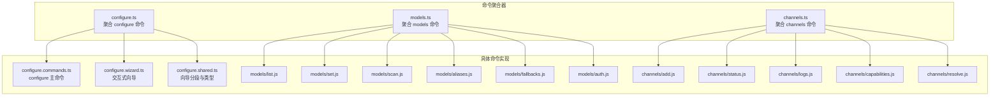
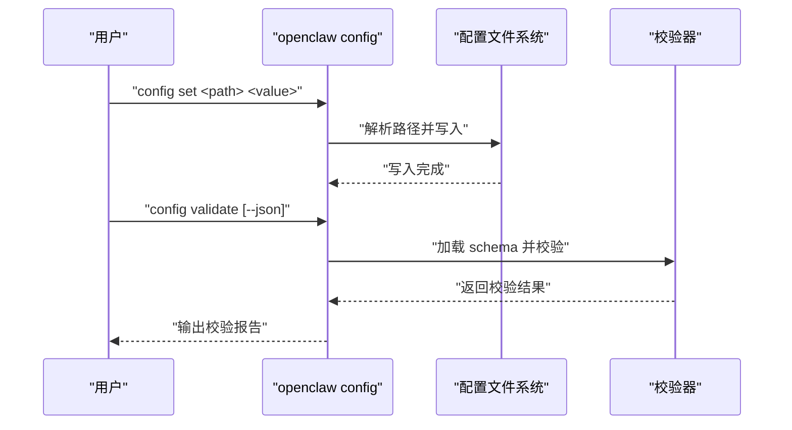
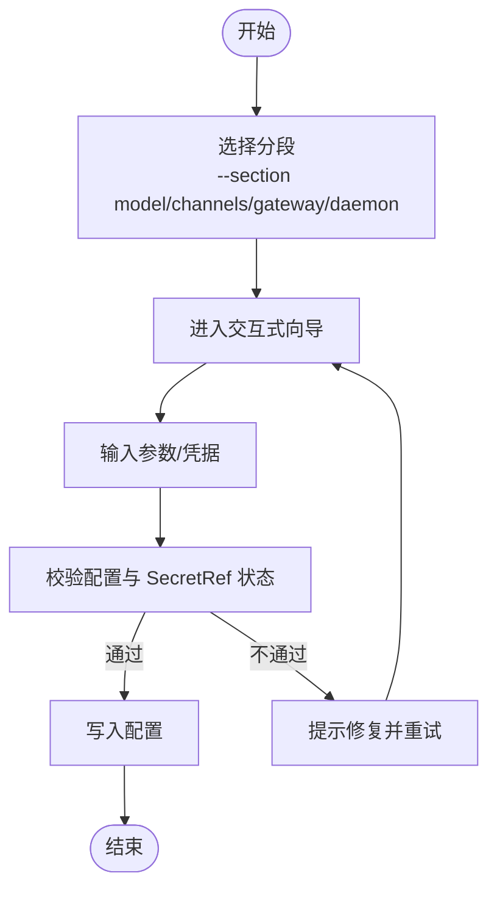
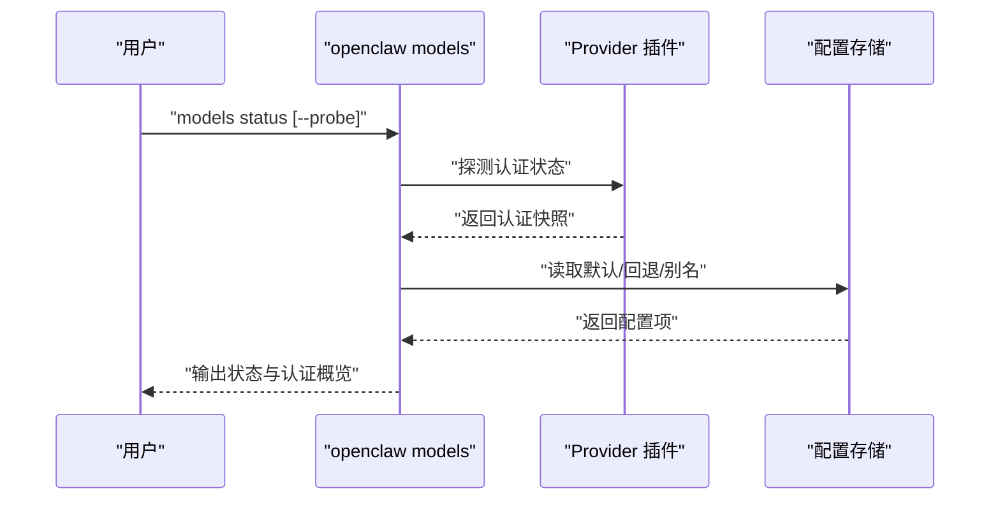
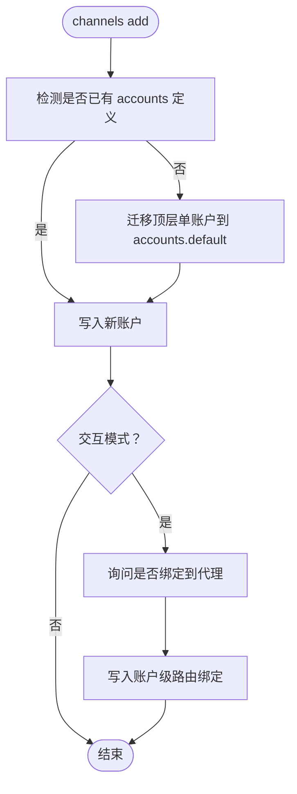
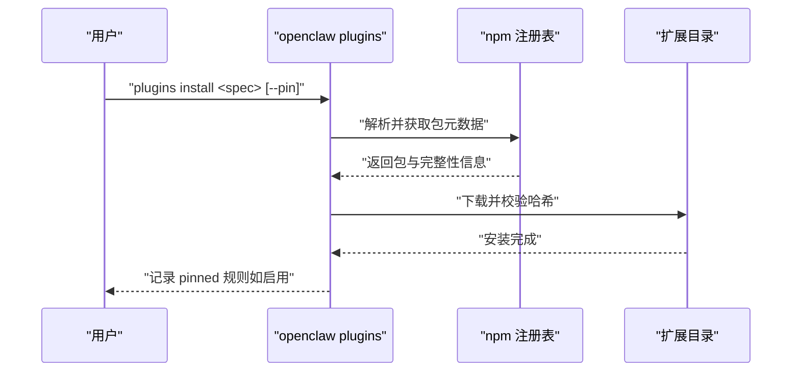
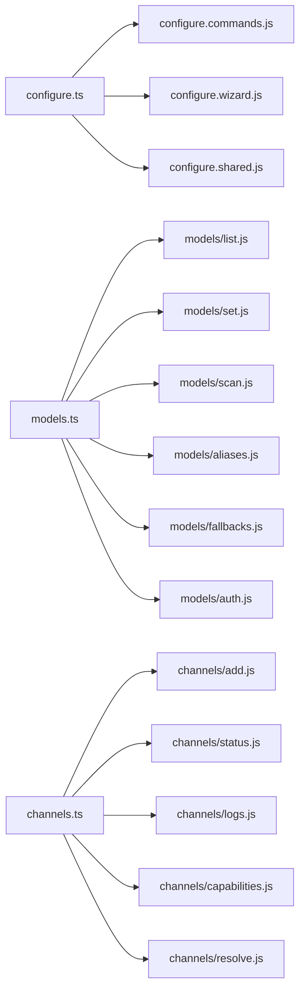

# 配置管理命令

<cite>
**本文引用的文件**
- [docs/cli/config.md](file://docs/cli/config.md)
- [docs/cli/configure.md](file://docs/cli/configure.md)
- [docs/cli/models.md](file://docs/cli/models.md)
- [docs/cli/channels.md](file://docs/cli/channels.md)
- [docs/cli/plugins.md](file://docs/cli/plugins.md)
- [src/commands/configure.ts](file://src/commands/configure.ts)
- [src/commands/models.ts](file://src/commands/models.ts)
- [src/commands/channels.ts](file://src/commands/channels.ts)
</cite>

## 目录

1. [简介](#简介)
2. [项目结构](#项目结构)
3. [核心组件](#核心组件)
4. [架构总览](#架构总览)
5. [详细组件分析](#详细组件分析)
6. [依赖关系分析](#依赖关系分析)
7. [性能考量](#性能考量)
8. [故障排查指南](#故障排查指南)
9. [结论](#结论)
10. [附录](#附录)

## 简介

本文件系统性梳理 OpenClaw 的配置管理命令体系，覆盖以下主题：

- 配置读写与校验：config 命令族（get/set/unset/file/validate）
- 模型发现与默认模型设置：models 命令族（status/list/set/scan、别名与回退、认证）
- 渠道账户与运行状态：channels 命令族（add/remove/status/logs/capabilities/resolve）
- 插件安装与生命周期：plugins 命令族（list/info/enable/disable/uninstall/update/doctor）

文档同时提供配置验证、动态更新、备份恢复、模板与最佳实践、迁移与版本管理、团队协作策略等高级主题，并通过图示帮助理解命令间的数据流与控制流。

## 项目结构

OpenClaw 将 CLI 子命令按功能域拆分到独立模块中，形成清晰的“命令聚合器 + 具体子命令”的组织方式：

- configure 命令族：交互式向导与分段配置（网关、认证、守护进程、渠道等）
- models 命令族：模型扫描、状态查询、默认模型设置、别名与回退、认证配置
- channels 命令族：渠道账户增删、状态检查、日志、能力探测、名称解析
- plugins 命令族：插件列表、信息、启用/禁用、卸载、更新、诊断

图表来源

- [src/commands/configure.ts](file://src/commands/configure.ts)
- [src/commands/models.ts](file://src/commands/models.ts)
- [src/commands/channels.ts](file://src/commands/channels.ts)

章节来源

- [docs/cli/config.md](file://docs/cli/config.md)
- [docs/cli/configure.md](file://docs/cli/configure.md)
- [docs/cli/models.md](file://docs/cli/models.md)
- [docs/cli/channels.md](file://docs/cli/channels.md)
- [docs/cli/plugins.md](file://docs/cli/plugins.md)

## 核心组件

- 配置读写与校验（config）
  - 支持路径表达式（点号或方括号）、JSON5 解析、严格 JSON 模式
  - 提供 file、get、set、unset、validate 子命令
  - 编辑后需重启网关以生效
- 模型管理（models）
  - 扫描可用模型、查看状态、设置默认模型、别名与回退、认证配置
  - 支持对指定代理的状态探针与认证探测
- 渠道管理（channels）
  - 账户增删、状态检查、日志、能力探测、名称解析
  - 支持多账户迁移与路由绑定
- 插件管理（plugins）
  - 列表、信息、启用/禁用、卸载、更新、诊断
  - 安全安装策略（仅允许 npm registry 规范包、支持 pin 与链接）

章节来源

- [docs/cli/config.md](file://docs/cli/config.md)
- [docs/cli/models.md](file://docs/cli/models.md)
- [docs/cli/channels.md](file://docs/cli/channels.md)
- [docs/cli/plugins.md](file://docs/cli/plugins.md)

## 架构总览

下图展示配置管理命令在 CLI 中的职责划分与调用关系：

```mermaid
graph TB
CLI["openclaw CLI"]
CFG["config 子命令族"]
CONF["configure 子命令族"]
MOD["models 子命令族"]
CH["channels 子命令族"]
PLG["plugins 子命令族"]
CLI --> CFG
CLI --> CONF
CLI --> MOD
CLI --> CH
CLI --> PLG
subgraph "config"
CFG_FILE["file"]
CFG_GET["get"]
CFG_SET["set"]
CFG_UNSET["unset"]
CFG_VAL["validate"]
end
subgraph "configure"
WZ["交互式向导"]
SEC["分段配置<br/>网关/认证/守护进程/渠道"]
end
subgraph "models"
M_STATUS["status"]
M_LIST["list"]
M_SET["set"]
M_SCAN["scan"]
M_ALIAS["aliases"]
M_FB["fallbacks"]
M_AUTH["auth"]
end
subgraph "channels"
C_ADD["add"]
C_REMOVE["remove"]
C_STATUS["status"]
C_LOGS["logs"]
C_CAP["capabilities"]
C_RESOLVE["resolve"]
end
subgraph "plugins"
P_LIST["list"]
P_INFO["info"]
P_EN["enable"]
P_DIS["disable"]
P_UNI["uninstall"]
P_UP["update"]
P_DOC["doctor"]
end
CFG --> CFG_FILE
CFG --> CFG_GET
CFG --> CFG_SET
CFG --> CFG_UNSET
CFG --> CFG_VAL
CONF --> WZ
CONF --> SEC
MOD --> M_STATUS
MOD --> M_LIST
MOD --> M_SET
MOD --> M_SCAN
MOD --> M_ALIAS
MOD --> M_FB
MOD --> M_AUTH
CH --> C_ADD
CH --> C_REMOVE
CH --> C_STATUS
CH --> C_LOGS
CH --> C_CAP
CH --> C_RESOLVE
PLG --> P_LIST
PLG --> P_INFO
PLG --> P_EN
PLG --> P_DIS
PLG --> P_UNI
PLG --> P_UP
PLG --> P_DOC
```

图表来源

- [src/commands/configure.ts](file://src/commands/configure.ts)
- [src/commands/models.ts](file://src/commands/models.ts)
- [src/commands/channels.ts](file://src/commands/channels.ts)
- [docs/cli/config.md](file://docs/cli/config.md)
- [docs/cli/configure.md](file://docs/cli/configure.md)
- [docs/cli/models.md](file://docs/cli/models.md)
- [docs/cli/channels.md](file://docs/cli/channels.md)
- [docs/cli/plugins.md](file://docs/cli/plugins.md)

## 详细组件分析

### 配置命令族（config）

- 功能要点
  - 路径表达式：支持点号与方括号两种语法；可定位数组索引与嵌套字段
  - 值解析：优先 JSON5 解析，否则作为字符串处理；支持严格 JSON 模式
  - 子命令：file（打印当前生效配置文件路径）、get（读取）、set（写入）、unset（删除）、validate（校验）
  - 生效机制：修改配置后需重启网关以应用新值
- 使用建议
  - 大规模批量变更前先执行 validate，避免启动失败
  - 对数组字段使用方括号路径进行精准定位
  - 在 CI/CD 中使用 --strict-json 保证配置一致性

图表来源

- [docs/cli/config.md](file://docs/cli/config.md)

章节来源

- [docs/cli/config.md](file://docs/cli/config.md)

### 交互式配置（configure）

- 功能要点
  - 交互式向导：分段配置网关、认证、守护进程、渠道等
  - 分段选择：支持仅运行特定分段（如 --section model --section channels）
  - 模型多选：模型分组允许对 agents.defaults.models 进行多选
  - 守护进程安装约束：当使用 SecretRef 且未解析时会阻断安装并提示修复
- 最佳实践
  - 首次部署建议使用 configure 完整走一遍流程
  - 若仅需调整模型或渠道，可使用 --section 精准执行对应分段

图表来源

- [docs/cli/configure.md](file://docs/cli/configure.md)

章节来源

- [docs/cli/configure.md](file://docs/cli/configure.md)

### 模型命令族（models）

- 功能要点
  - 扫描与状态：models scan、models status（支持 --probe、--agent 等选项）
  - 默认模型：models set 设置默认模型（支持 provider/model 或别名）
  - 别名与回退：aliases 与 fallbacks 的增删查改
  - 认证：auth add/login/setup-token/paste-token
- 使用建议
  - 使用 --probe 对已配置的认证进行实时探测，注意可能产生用量与限流
  - 通过 agents 绑定为特定代理单独配置模型与认证

图表来源

- [docs/cli/models.md](file://docs/cli/models.md)

章节来源

- [docs/cli/models.md](file://docs/cli/models.md)

### 渠道命令族（channels）

- 功能要点
  - 账户管理：channels add/remove（支持多账户形态与自动迁移）
  - 运行状态：channels status（网关不可达时提供配置态摘要）
  - 日志与能力：channels logs、channels capabilities
  - 名称解析：channels resolve（支持强制类型与优先匹配）
- 使用建议
  - 新增非 default 账户时，若仍使用单账户顶层配置，系统会自动迁移到 accounts.default
  - 交互模式下可选择将渠道账户绑定到代理，非交互模式不会自动写入路由规则

图表来源

- [docs/cli/channels.md](file://docs/cli/channels.md)

章节来源

- [docs/cli/channels.md](file://docs/cli/channels.md)

### 插件命令族（plugins）

- 功能要点
  - 生命周期：list、info、enable、disable、uninstall、update、doctor
  - 安装策略：仅允许 npm registry 包，支持 pin 与本地目录链接
  - 安全性：依赖安装忽略脚本，支持完整性哈希校验与预发布版本显式确认
- 使用建议
  - 生产环境优先使用 pinned 版本，避免引入不稳定变更
  - 卸载前评估是否保留文件（--keep-files），以便后续快速恢复

图表来源

- [docs/cli/plugins.md](file://docs/cli/plugins.md)

章节来源

- [docs/cli/plugins.md](file://docs/cli/plugins.md)

## 依赖关系分析

- 命令聚合器
  - configure.ts、models.ts、channels.ts 作为聚合入口，统一导出各子命令类型与实现
- 内聚与耦合
  - 各命令模块内部职责单一，对外通过聚合器暴露接口，降低跨模块耦合
  - 插件与 Provider 通过约定的清单文件与 schema 参与配置校验，增强可扩展性
- 外部依赖
  - plugins 安装受 npm 注册表与安全策略约束
  - channels 与 models 依赖 Provider 插件生态，认证状态由插件自身维护

图表来源

- [src/commands/configure.ts](file://src/commands/configure.ts)
- [src/commands/models.ts](file://src/commands/models.ts)
- [src/commands/channels.ts](file://src/commands/channels.ts)

章节来源

- [src/commands/configure.ts](file://src/commands/configure.ts)
- [src/commands/models.ts](file://src/commands/models.ts)
- [src/commands/channels.ts](file://src/commands/channels.ts)

## 性能考量

- 模型扫描与认证探测
  - 使用 --probe 会发起真实请求，可能触发用量与限流，建议在低峰时段执行或限制并发
  - 通过 --agent 精准定位目标代理，减少无关探测
- 渠道状态与日志
  - channels status 在网关不可达时采用配置态摘要，避免额外网络开销
  - channels logs 支持筛选通道与级别，避免全量日志带来的 IO 压力
- 插件安装
  - 使用 --pin 固定版本，减少频繁升级带来的配置漂移
  - 本地链接（--link）可加速开发调试阶段的迭代

## 故障排查指南

- 配置校验失败
  - 使用 config validate 或 config validate --json 获取详细错误
  - 结合 OPENCLAW_CONFIG_PATH 与默认位置定位实际生效文件
- 模型认证问题
  - 使用 models status --probe 探测认证状态；必要时重新登录或设置 token
  - 通过 models auth setup-token/paste-token 在多机之间同步认证
- 渠道账户异常
  - channels status 在网关不可达时提供配置态摘要；结合 doctor 与 deep status 进行综合诊断
  - channels resolve 支持名称到 ID 的映射，便于定位权限与路由问题
- 插件加载失败
  - 使用 plugins doctor 查看加载失败原因
  - 检查 openclaw.plugin.json 是否存在且包含合法的 configSchema
  - 通过 plugins update --all 或指定插件版本修复兼容性问题

章节来源

- [docs/cli/config.md](file://docs/cli/config.md)
- [docs/cli/models.md](file://docs/cli/models.md)
- [docs/cli/channels.md](file://docs/cli/channels.md)
- [docs/cli/plugins.md](file://docs/cli/plugins.md)

## 结论

OpenClaw 的配置管理命令以“命令聚合器 + 子命令模块”为核心架构，围绕配置读写、模型管理、渠道治理与插件生态构建了完整的 CLI 工具链。通过路径表达式、严格解析、校验与交互式向导，用户可以高效地完成从初始配置到日常运维的全生命周期管理。配合最佳实践与故障排查指引，可在保证安全性与稳定性的同时提升团队协作效率。

## 附录

- 配置模板与示例
  - 参考各命令文档中的示例片段，结合实际环境进行定制
- 备份与恢复
  - 在大规模变更前执行 config file 输出的配置文件路径，备份原文件
  - 发生问题时恢复备份并重启网关
- 版本管理与迁移
  - 使用 plugins update --all 与 pinned 版本策略控制插件演进
  - 渠道多账户迁移遵循 accounts.default 形态，必要时使用 doctor --fix 修正混杂状态
- 团队协作策略
  - 将配置变更纳入版本控制，使用 validate 作为 CI 步骤
  - 通过交互式向导与分段配置减少误操作风险
