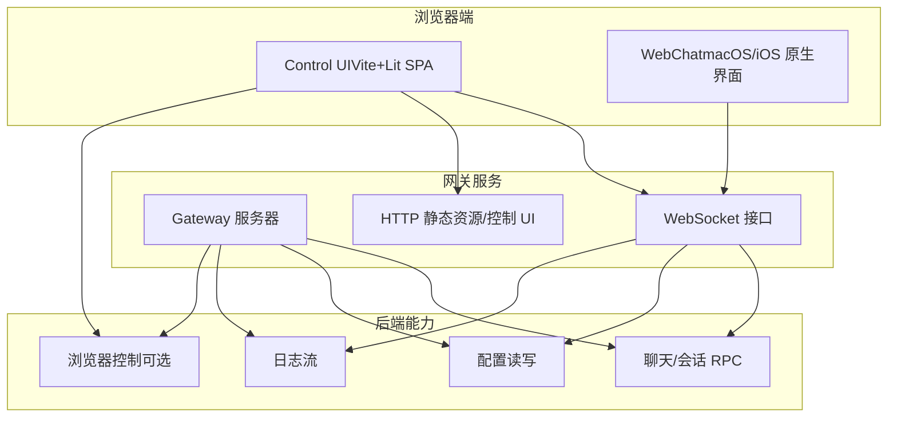
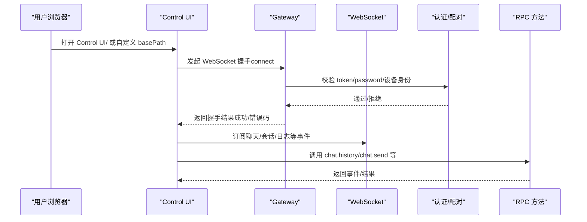
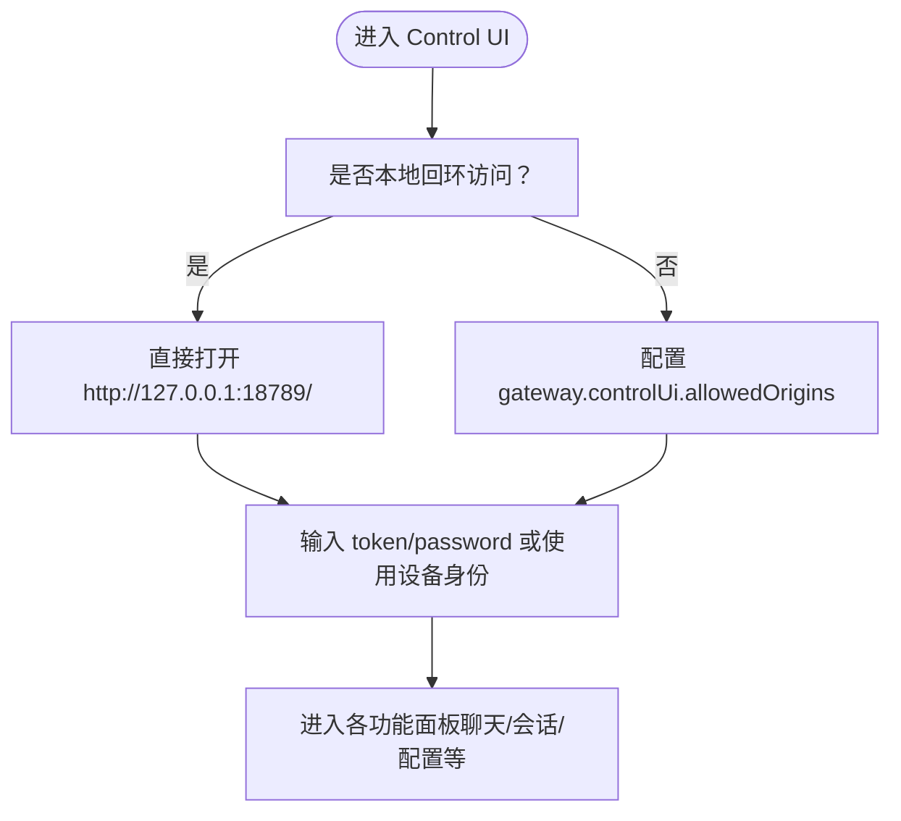
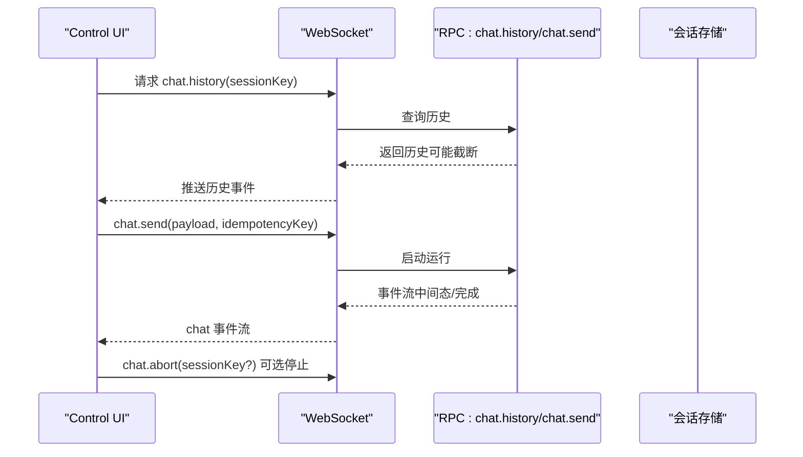
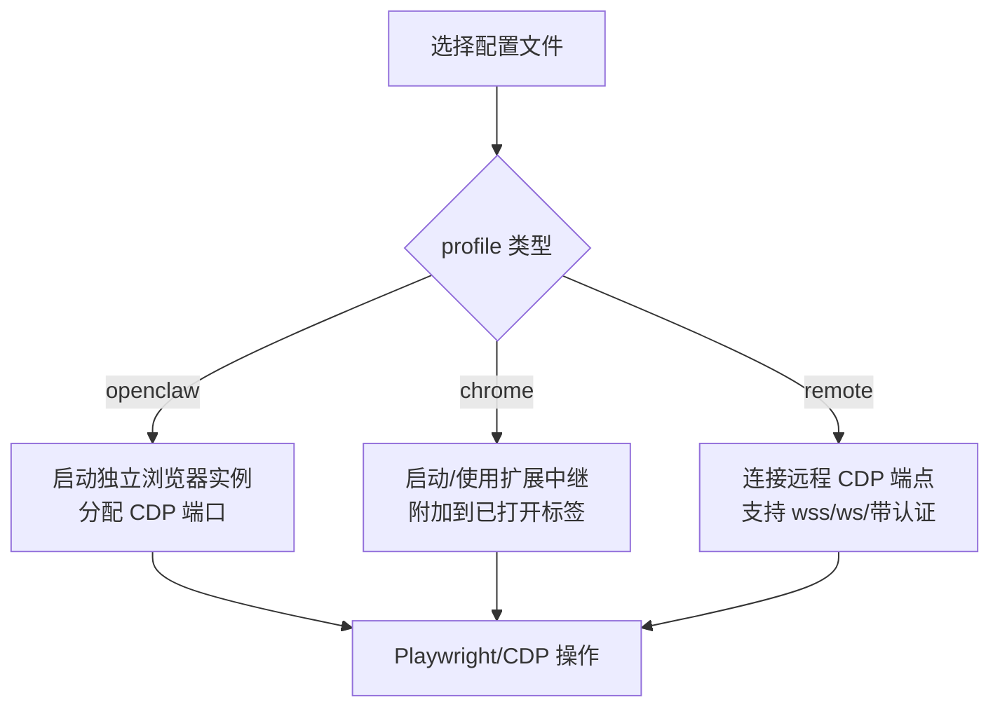
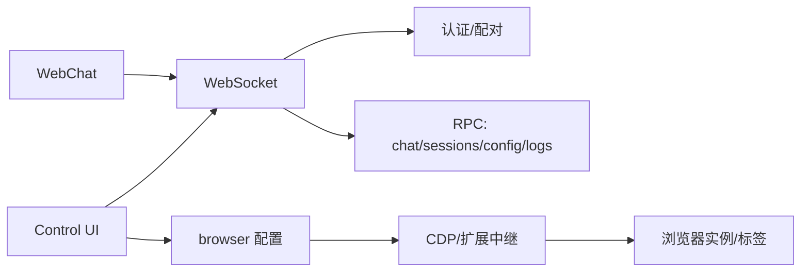

# Web界面使用

<cite>
**本文引用的文件**
- [docs/web/index.md](file://docs/web/index.md)
- [docs/web/control-ui.md](file://docs/web/control-ui.md)
- [docs/web/webchat.md](file://docs/web/webchat.md)
- [docs/web/dashboard.md](file://docs/web/dashboard.md)
- [docs/tools/browser.md](file://docs/tools/browser.md)
- [docs/gateway/security/index.md](file://docs/gateway/security/index.md)
- [docs/help/troubleshooting.md](file://docs/help/troubleshooting.md)
- [docs/gateway/troubleshooting.md](file://docs/gateway/troubleshooting.md)
- [src/gateway/server.sessions.gateway-server-sessions-a.test.ts](file://src/gateway/server.sessions.gateway-server-sessions-a.test.ts)
- [src/gateway/server-methods/sessions.ts](file://src/gateway/server-methods/sessions.ts)
- [src/browser/chrome.executables.ts](file://src/browser/chrome.executables.ts)
- [src/browser/chrome.ts](file://src/browser/chrome.ts)
- [scripts/sandbox-browser-entrypoint.sh](file://scripts/sandbox-browser-entrypoint.sh)
- [src/browser/config.ts](file://src/browser/config.ts)
- [apps/macos/Sources/OpenClaw/WebChatManager.swift](file://apps/macos/Sources/OpenClaw/WebChatManager.swift)
- [ui/src/ui/navigation.ts](file://ui/src/ui/navigation.ts)
- [ui/src/main.ts](file://ui/src/main.ts)
</cite>

## 目录

1. [简介](#简介)
2. [项目结构](#项目结构)
3. [核心组件](#核心组件)
4. [架构总览](#架构总览)
5. [详细组件分析](#详细组件分析)
6. [依赖关系分析](#依赖关系分析)
7. [性能考量](#性能考量)
8. [故障排除指南](#故障排除指南)
9. [结论](#结论)
10. [附录](#附录)

## 简介

本指南面向使用 OpenClaw Web 界面（浏览器控制 UI 与 WebChat）的用户，帮助您快速掌握控制面板、会话管理、设置配置、实时聊天、会话状态显示与管理，并提供浏览器控制（Chrome/Chromium）的配置与使用说明。同时涵盖安全设置、权限管理与常见问题排查，确保您能安全、稳定地使用 Web 界面完成日常运维与自动化任务。

## 项目结构

OpenClaw 的 Web 界面由“网关服务 + 浏览器控制 UI（Control UI）+ WebSocket 协议 + 可选的 WebChat 原生界面”构成。Control UI 默认通过网关端口提供静态资源与 WebSocket 连接；WebChat 则是原生应用直接连接网关 WebSocket 的聊天界面。

图示来源

- [docs/web/control-ui.md:11-16](file://docs/web/control-ui.md#L11-L16)
- [docs/web/webchat.md:10-16](file://docs/web/webchat.md#L10-L16)
- [docs/web/index.md:11-16](file://docs/web/index.md#L11-L16)

章节来源

- [docs/web/index.md:9-121](file://docs/web/index.md#L9-L121)
- [docs/web/control-ui.md:9-269](file://docs/web/control-ui.md#L9-L269)
- [docs/web/webchat.md:8-62](file://docs/web/webchat.md#L8-L62)

## 核心组件

- 控制 UI（Control UI）
  - 通过网关端口提供浏览器控制界面，支持聊天、通道、实例、会话、定时任务、技能、节点、配置、调试、日志等。
  - 直接与网关 WebSocket 通信，使用 RPC 方法进行交互。
- WebChat
  - 原生应用的聊天界面，同样直连网关 WebSocket，遵循相同的路由与会话规则。
- 浏览器控制（可选）
  - 网关内置的浏览器控制服务，支持多配置文件（openclaw、chrome、远程 CDP），并提供 HTTP API 与 Playwright 能力。
- 安全与权限
  - 网关默认强制认证；支持令牌/密码/受信代理身份；Control UI 在非安全上下文（HTTP）下需要设备身份或兼容开关。
  - 会话变更权限区分：WebChat 客户端不可修改会话元数据，Control UI 可。

章节来源

- [docs/web/control-ui.md:72-117](file://docs/web/control-ui.md#L72-L117)
- [docs/web/webchat.md:24-32](file://docs/web/webchat.md#L24-L32)
- [docs/tools/browser.md:10-33](file://docs/tools/browser.md#L10-L33)
- [docs/gateway/security/index.md:735-784](file://docs/gateway/security/index.md#L735-L784)
- [src/gateway/server-methods/sessions.ts:72-93](file://src/gateway/server-methods/sessions.ts#L72-L93)

## 架构总览

Web 界面的典型访问路径如下：

图示来源

- [docs/web/control-ui.md:26-31](file://docs/web/control-ui.md#L26-L31)
- [docs/web/dashboard.md:23-29](file://docs/web/dashboard.md#L23-L29)
- [docs/gateway/security/index.md:785-800](file://docs/gateway/security/index.md#L785-L800)

章节来源

- [docs/web/control-ui.md:18-31](file://docs/web/control-ui.md#L18-L31)
- [docs/web/dashboard.md:31-55](file://docs/web/dashboard.md#L31-L55)

## 详细组件分析

### 控制面板与导航

- 导航分组与路径
  - 控制面板包含“聊天、控制、智能体、设置”等标签页，路径与标签一一对应。
  - 支持通过 basePath 自定义访问前缀。
- 使用建议
  - 首次打开建议使用本地回环地址，若失败需先启动网关。
  - 若启用非回环绑定，需配置 allowedOrigins 并提供 token/password。

图示来源

- [ui/src/ui/navigation.ts:4-43](file://ui/src/ui/navigation.ts#L4-L43)
- [docs/web/control-ui.md:18-31](file://docs/web/control-ui.md#L18-L31)
- [docs/web/index.md:24-35](file://docs/web/index.md#L24-L35)

章节来源

- [ui/src/ui/navigation.ts:14-43](file://ui/src/ui/navigation.ts#L14-L43)
- [ui/src/main.ts:1-3](file://ui/src/main.ts#L1-L3)
- [docs/web/control-ui.md:18-31](file://docs/web/control-ui.md#L18-L31)
- [docs/web/index.md:24-35](file://docs/web/index.md#L24-L35)

### 实时聊天与会话管理

- 聊天行为
  - chat.send 非阻塞，立即返回运行状态；后续通过 chat 事件流推送结果。
  - chat.history 返回大小受限的对话历史；超长文本会被截断或替换占位符。
  - chat.inject 用于向会话注入助手备注，不触发实际运行。
  - 支持停止（chat.abort）、部分输出保留与持久化。
- 会话状态与变更
  - sessions.list：查看会话列表与主键。
  - sessions.patch：可按会话键更新思考模式/详细程度等覆盖项。
  - WebChat 客户端不可删除/修改会话元数据；Control UI 可在 WebChat 模式下删除会话。
- 会话隔离与安全
  - 会话键仅用于路由选择，不是授权令牌；跨用户隔离不在该信任模型内。

图示来源

- [docs/web/control-ui.md:103-117](file://docs/web/control-ui.md#L103-L117)
- [src/gateway/server-methods/sessions.ts:49-93](file://src/gateway/server-methods/sessions.ts#L49-L93)
- [src/gateway/server.sessions.gateway-server-sessions-a.test.ts:1328-1357](file://src/gateway/server.sessions.gateway-server-sessions-a.test.ts#L1328-L1357)

章节来源

- [docs/web/control-ui.md:72-117](file://docs/web/control-ui.md#L72-L117)
- [src/gateway/server-methods/sessions.ts:72-93](file://src/gateway/server-methods/sessions.ts#L72-L93)
- [src/gateway/server.sessions.gateway-server-sessions-a.test.ts:1328-1357](file://src/gateway/server.sessions.gateway-server-sessions-a.test.ts#L1328-L1357)

### 设置与配置

- 配置读写
  - 支持 config.get/config.set 读取/编辑配置文件。
  - 支持 config.apply 应用并重启，带校验与报告。
  - 配置写入包含 base-hash 保护，防止并发覆盖。
- 配置来源与基座路径
  - 默认 basePath 为 “/”，可通过 gateway.controlUi.basePath 自定义。
  - UI 构建产物由网关提供静态服务（dist/control-ui）。
- 语言与本地化
  - 首次加载基于浏览器语言；可在界面中切换并保存。

章节来源

- [docs/web/control-ui.md:82-89](file://docs/web/control-ui.md#L82-L89)
- [docs/web/index.md:24-35](file://docs/web/index.md#L24-L35)
- [docs/web/control-ui.md:63-71](file://docs/web/control-ui.md#L63-L71)

### 浏览器控制（Chrome/Chromium）

- 配置与启动
  - 支持多配置文件：openclaw（独立浏览器）、chrome（扩展中继）、远程 CDP。
  - 自动检测系统默认浏览器（优先 Chromium 系列），否则按顺序尝试 Chrome/Brave/Edge/Chromium/Chrome Canary。
  - Sandbox 场景下可通过脚本参数禁用 GPU/扩展等以适配无头环境。
- 与 Control UI 的关系
  - Control UI 可调用 browser 工具（状态/标签/截图/动作等），但具体驱动取决于所选 profile。
  - 扩展中继模式需在 Chrome 上安装并手动附加到目标标签页。
- 安全与隐私
  - openclaw profile 不触碰个人资料；默认端口与 CDP 端口避免冲突。
  - 远程 CDP URL 建议使用加密与短期令牌，避免明文长期凭据。

图示来源

- [docs/tools/browser.md:46-103](file://docs/tools/browser.md#L46-L103)
- [docs/tools/browser.md:277-332](file://docs/tools/browser.md#L277-L332)
- [src/browser/chrome.executables.ts:456-535](file://src/browser/chrome.executables.ts#L456-L535)
- [scripts/sandbox-browser-entrypoint.sh:36-83](file://scripts/sandbox-browser-entrypoint.sh#L36-L83)

章节来源

- [docs/tools/browser.md:46-103](file://docs/tools/browser.md#L46-L103)
- [docs/tools/browser.md:277-332](file://docs/tools/browser.md#L277-L332)
- [src/browser/chrome.executables.ts:456-535](file://src/browser/chrome.executables.ts#L456-L535)
- [scripts/sandbox-browser-entrypoint.sh:36-83](file://scripts/sandbox-browser-entrypoint.sh#L36-L83)

### WebChat 界面与原生集成

- WebChat 行为
  - 直连网关 WebSocket，使用 chat.history/chat.send/chat.inject。
  - 历史大小受限；中断后可保留部分输出；远端不可达时 UI 变为只读。
- 原生应用集成
  - macOS/iOS 原生应用通过 WebChatManager 管理窗口/面板展示，支持面板锚定与可见性回调。
- 远程使用
  - 通过 SSH/Tailscale 隧道转发网关 WebSocket，无需单独部署 WebChat 服务器。

章节来源

- [docs/web/webchat.md:24-46](file://docs/web/webchat.md#L24-L46)
- [apps/macos/Sources/OpenClaw/WebChatManager.swift:25-47](file://apps/macos/Sources/OpenClaw/WebChatManager.swift#L25-L47)

## 依赖关系分析

- Control UI 与网关
  - 通过同一端口提供 HTTP 静态资源与 WebSocket；UI 通过 connect.params.auth 提供 token/password。
  - 非回环部署需显式配置 allowedOrigins；Serve 模式可借助 Tailscale 身份头进行认证。
- 会话变更权限
  - WebChat 客户端不可 patch/delete 会话；Control UI 可在 WebChat 模式下删除会话。
- 浏览器控制与网关
  - browser 工具通过 CDP 与浏览器交互；openclaw profile 与 chrome 中继模式分别走不同路径。

图示来源

- [docs/web/control-ui.md:26-31](file://docs/web/control-ui.md#L26-L31)
- [docs/web/index.md:96-113](file://docs/web/index.md#L96-L113)
- [src/gateway/server-methods/sessions.ts:72-93](file://src/gateway/server-methods/sessions.ts#L72-L93)
- [docs/tools/browser.md:369-430](file://docs/tools/browser.md#L369-L430)

章节来源

- [docs/web/control-ui.md:26-31](file://docs/web/control-ui.md#L26-L31)
- [docs/web/index.md:96-113](file://docs/web/index.md#L96-L113)
- [src/gateway/server-methods/sessions.ts:72-93](file://src/gateway/server-methods/sessions.ts#L72-L93)
- [docs/tools/browser.md:369-430](file://docs/tools/browser.md#L369-L430)

## 性能考量

- Control UI 与 WebSocket
  - chat.send 非阻塞，事件流推送结果，适合实时交互。
  - chat.history 返回大小受限，避免 UI 卡顿与内存压力。
- 浏览器控制
  - Sandbox 场景禁用 GPU/扩展可降低资源占用；Playwright 未安装时部分高级能力不可用。
- 日志与监控
  - logs.tail 支持实时过滤与导出，便于定位性能瓶颈。

[本节为通用指导，不涉及特定文件分析]

## 故障排除指南

- 无法连接 Control UI
  - 检查网关是否运行、端口是否可达、认证是否正确（token/password/设备身份）。
  - 若为非回环部署，确认 allowedOrigins 是否配置。
- 设备身份/配对问题
  - 首次连接需配对批准；本地连接自动批准；远程连接需 CLI 审批。
- 会话变更被拒
  - WebChat 客户端不可修改会话元数据；如需修改，请使用 Control UI。
- 浏览器控制失败
  - 检查浏览器可执行路径、CDP 端口可达性、扩展中继是否附加、attachOnly 模式下的目标可达性。
- 其他
  - 使用诊断命令链快速定位：status、gateway status、logs --follow、doctor、channels status --probe。

章节来源

- [docs/help/troubleshooting.md:13-299](file://docs/help/troubleshooting.md#L13-L299)
- [docs/gateway/troubleshooting.md:91-151](file://docs/gateway/troubleshooting.md#L91-L151)
- [src/gateway/server-methods/sessions.ts:72-93](file://src/gateway/server-methods/sessions.ts#L72-L93)
- [docs/tools/browser.md:277-332](file://docs/tools/browser.md#L277-L332)

## 结论

通过本指南，您可以在安全前提下高效使用 OpenClaw Web 界面：利用 Control UI 完成聊天、会话管理、配置与调试；在需要时使用 WebChat 获取原生体验；结合浏览器控制实现网页自动化。遇到问题时，可依据故障排除章节快速定位并修复。建议始终遵循最小暴露原则与严格认证策略，确保系统安全与稳定。

[本节为总结性内容，不涉及特定文件分析]

## 附录

### 安全设置与权限管理要点

- 网关默认强制认证；非回环绑定必须配置 token/password。
- Control UI 在非安全上下文（HTTP）下需要设备身份或兼容开关。
- Serve 模式可借助 Tailscale 身份头进行认证，但 HTTP API 仍需 token/password。
- WebChat 客户端不可修改会话元数据；Control UI 可在 WebChat 模式下删除会话。
- 浏览器控制仅限 loopback，默认端口与 CDP 端口避免冲突；远程 CDP 建议加密与短期令牌。

章节来源

- [docs/gateway/security/index.md:96-113](file://docs/gateway/security/index.md#L96-L113)
- [docs/web/control-ui.md:154-200](file://docs/web/control-ui.md#L154-L200)
- [docs/web/index.md:96-113](file://docs/web/index.md#L96-L113)
- [src/gateway/server-methods/sessions.ts:72-93](file://src/gateway/server-methods/sessions.ts#L72-L93)
- [docs/tools/browser.md:246-259](file://docs/tools/browser.md#L246-L259)
