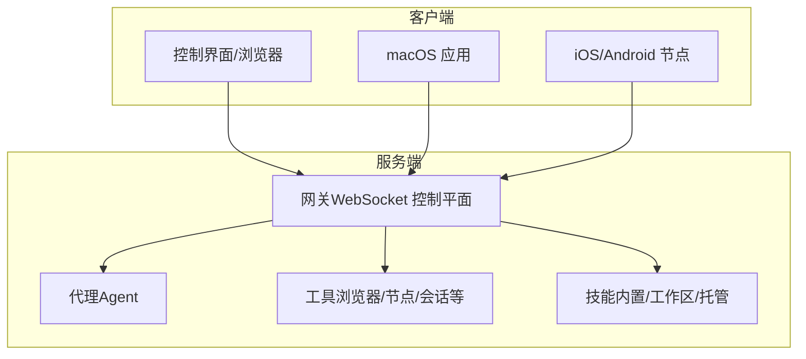
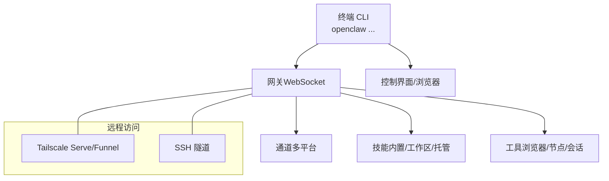
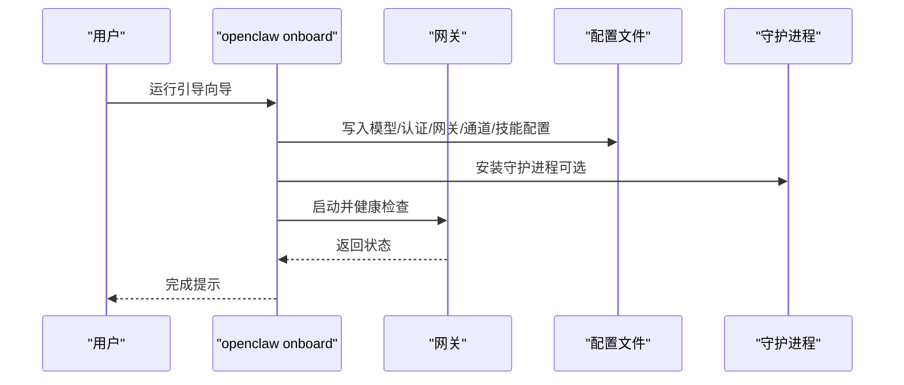
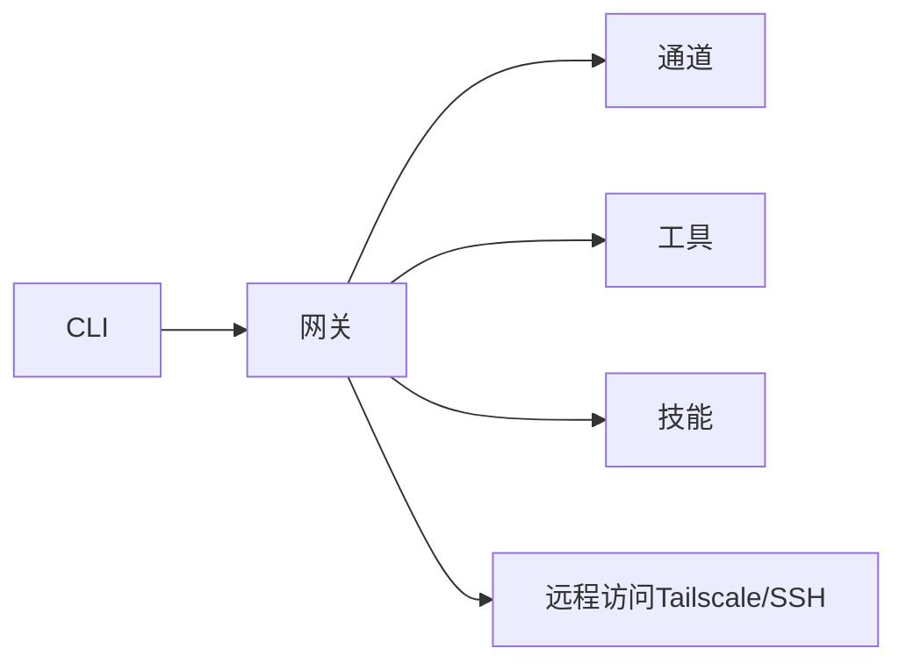

# 快速入门

<cite>
**本文引用的文件**
- [README.md](file://README.md)
- [getting-started.md](file://docs/start/getting-started.md)
- [quickstart.md](file://docs/start/quickstart.md)
- [onboarding.md](file://docs/start/onboarding.md)
- [index.md](file://docs/install/index.md)
- [wizard.md](file://docs/start/wizard.md)
- [onboard.md](file://docs/cli/onboard.md)
- [gateway.md](file://docs/cli/gateway.md)
- [message.md](file://docs/cli/message.md)
- [troubleshooting.md](file://docs/help/troubleshooting.md)
- [configuration.md](file://docs/gateway/configuration.md)
- [configuration-examples.md](file://docs/gateway/configuration-examples.md)
- [index.md](file://docs/channels/index.md)
- [setup.md](file://docs/start/setup.md)
</cite>

## 目录

1. [简介](#简介)
2. [项目结构](#项目结构)
3. [核心组件](#核心组件)
4. [架构总览](#架构总览)
5. [详细组件分析](#详细组件分析)
6. [依赖关系分析](#依赖关系分析)
7. [性能与安全建议](#性能与安全建议)
8. [故障排除指南](#故障排除指南)
9. [结论](#结论)
10. [附录](#附录)

## 简介

本指南面向首次接触 OpenClaw 的用户，目标是帮助你在最短时间内完成安装、运行与基础配置，并通过“引导向导（onboarding wizard）”完成网关、工作空间、频道与技能的初始设置。你将学会：

- 环境准备与安装
- 使用 CLI 引导向导进行本地或远程网关配置
- 基础工作空间与频道连接
- 初次聊天与常用命令
- 常见问题排查与安全注意事项

## 项目结构

OpenClaw 提供了多平台支持与丰富的扩展能力，核心由“网关（Gateway）+ 通道（Channels）+ 工具（Tools）+ 技能（Skills）+ 客户端应用（macOS/IOS/Android/Web）”构成。对于新用户，推荐从 CLI 引导向导入手，它会逐步完成认证、网关、工作空间、通道与技能的配置。

图表来源

- [README.md:185-202](file://README.md#L185-L202)

章节来源

- [README.md:21-27](file://README.md#L21-L27)
- [README.md:28-31](file://README.md#L28-L31)

## 核心组件

- 网关（Gateway）：WebSocket 控制平面，承载会话、通道、工具与事件；可通过 CLI 运行、查询与管理。
- 通道（Channels）：支持 WhatsApp、Telegram、Discord、Slack、Google Chat、Signal、iMessage、BlueBubbles、IRC、Microsoft Teams、Matrix、Feishu、LINE、Mattermost、Nextcloud Talk、Nostr、Synology Chat、Tlon、Twitch、Zalo、Zalo Personal、WebChat 等。
- 工具（Tools）：浏览器控制、Canvas、节点（相机/屏幕录制/通知）、定时任务、会话工具等。
- 技能（Skills）：内置/托管/工作区技能，支持安装与 UI 管理。
- 引导向导（Onboarding Wizard）：CLI 交互式向导，完成认证、网关、工作空间、通道与技能的配置。

章节来源

- [README.md:126-136](file://README.md#L126-L136)
- [README.md:144-176](file://README.md#L144-L176)

## 架构总览

下图展示了从终端到网关、再到各通道与技能的典型交互路径，以及控制界面与远程访问方式：

图表来源

- [README.md:185-202](file://README.md#L185-L202)
- [README.md:213-228](file://README.md#L213-L228)

## 详细组件分析

### 1) 环境准备与安装

- 系统要求：Node 22+；推荐在 macOS、Linux 或 Windows（WSL2）上安装。
- 推荐安装方式：使用安装脚本一键安装并启动引导向导；也可通过 npm/pnpm/bun 安装后运行引导向导。
- 可选安装方式：Docker/Podman/Nix/Ansible/Bun 等。

章节来源

- [index.md:14-22](file://docs/install/index.md#L14-L22)
- [index.md:24-104](file://docs/install/index.md#L24-L104)
- [index.md:143-161](file://docs/install/index.md#L143-L161)

### 2) 引导向导（Onboarding Wizard）

- 作用：交互式完成认证、网关、工作空间、通道与技能的初始配置。
- 快速路径：`openclaw onboard --install-daemon` 安装守护进程并启动网关。
- 高级模式：可选择“手动（Advanced）”以精细控制每一步。
- 输出内容：生成最小化配置、写入凭据、安装守护进程、健康检查、安装推荐技能等。

图表来源

- [wizard.md:66-90](file://docs/start/wizard.md#L66-L90)
- [onboard.md:20-27](file://docs/cli/onboard.md#L20-L27)

章节来源

- [wizard.md:10-31](file://docs/start/wizard.md#L10-L31)
- [wizard.md:44-62](file://docs/start/wizard.md#L44-L62)
- [wizard.md:64-90](file://docs/start/wizard.md#L64-L90)
- [onboard.md:12-18](file://docs/cli/onboard.md#L12-L18)

### 3) 网关运行与健康检查

- 运行网关：`openclaw gateway` 或 `openclaw gateway run`。
- 健康检查：`openclaw gateway health`、`openclaw gateway status`。
- 远程探测：`openclaw gateway probe` 支持 SSH 与 Bonjour 发现。
- 服务管理：`openclaw gateway install/start/stop/restart/uninstall`。

章节来源

- [gateway.md:22-63](file://docs/cli/gateway.md#L22-L63)
- [gateway.md:85-99](file://docs/cli/gateway.md#L85-L99)
- [gateway.md:115-127](file://docs/cli/gateway.md#L115-L127)
- [gateway.md:159-177](file://docs/cli/gateway.md#L159-L177)
- [gateway.md:179-214](file://docs/cli/gateway.md#L179-L214)

### 4) 工作空间与技能

- 工作空间默认位于 `~/.openclaw/workspace`，可自定义。
- 注入提示文件：`AGENTS.md`、`SOUL.md`、`TOOLS.md`。
- 技能：位于 `~/.openclaw/workspace/skills/<skill>/SKILL.md`，可通过引导向导安装推荐技能。

章节来源

- [README.md:312-317](file://README.md#L312-L317)
- [wizard.md:84-84](file://docs/start/wizard.md#L84-L84)

### 5) 频道连接与消息发送

- 支持频道：WhatsApp、Telegram、Discord、Slack、Google Chat、Signal、iMessage、BlueBubbles、IRC、Microsoft Teams、Matrix、Feishu、LINE、Mattermost、Nextcloud Talk、Nostr、Synology Chat、Tlon、Twitch、Zalo、Zalo Personal、WebChat。
- 消息发送：`openclaw message send --target ... --message "..."`。
- 其他动作：投票、反应、读取历史、编辑/删除、钉住、线程管理、表情包/贴纸、角色/成员/语音状态、事件、禁言/踢人/封禁、广播等。

章节来源

- [index.md:14-48](file://docs/channels/index.md#L14-L48)
- [message.md:14-52](file://docs/cli/message.md#L14-L52)
- [message.md:55-184](file://docs/cli/message.md#L55-L184)

### 6) 配置与示例

- 最小配置：包含代理工作空间与允许的 DM 来源。
- 常见任务：设置频道、选择模型、控制 DM 访问、群组提及门控、会话与重置、沙箱、心跳、定时任务、Webhook、多代理路由、拆分配置文件等。
- 热重载：大多数配置变更无需重启即可生效。

章节来源

- [configuration.md:26-34](file://docs/gateway/configuration.md#L26-L34)
- [configuration.md:74-347](file://docs/gateway/configuration.md#L74-L347)
- [configuration.md:349-387](file://docs/gateway/configuration.md#L349-L387)
- [configuration-examples.md:14-49](file://docs/gateway/configuration-examples.md#L14-L49)
- [configuration-examples.md:448-495](file://docs/gateway/configuration-examples.md#L448-L495)

### 7) macOS 应用首次运行（可选）

- 包含安全提示与权限请求（自动化、通知、无障碍、屏幕录制、麦克风、语音识别、相机、位置等）。
- 支持本地/远程网关选择与 CLI 安装。
- 首次运行后打开专用引导会话，帮助你了解下一步。

章节来源

- [onboarding.md:17-92](file://docs/start/onboarding.md#L17-L92)

### 8) 开发与高级设置（可选）

- 从源码构建：克隆仓库、安装依赖、构建 UI 与二进制、运行引导向导。
- 本地开发：使用 `pnpm gateway:watch` 实时热重载，配合 macOS 应用本地连接。
- 凭据存储映射：不同通道与认证的凭据存放位置。

章节来源

- [setup.md:51-79](file://docs/start/setup.md#L51-L79)
- [setup.md:80-116](file://docs/start/setup.md#L80-L116)
- [setup.md:125-139](file://docs/start/setup.md#L125-L139)

## 依赖关系分析

- CLI 与网关：CLI 通过 WebSocket 与网关通信，执行健康检查、状态查询、RPC 调用与服务管理。
- 网关与通道：网关负责接收/转发来自各通道的消息与事件，维护会话与路由策略。
- 网关与工具/技能：工具与技能通过网关暴露的能力执行具体操作（如浏览器控制、Canvas、节点调用、会话工具等）。
- 远程访问：通过 Tailscale Serve/Funnel 或 SSH 隧道实现远程访问与安全认证。

图表来源

- [README.md:185-202](file://README.md#L185-L202)
- [gateway.md:179-214](file://docs/cli/gateway.md#L179-L214)

章节来源

- [README.md:213-228](file://README.md#L213-L228)

## 性能与安全建议

- 安全默认：默认对未知发送者采用“配对（pairing）”策略，避免未授权 DM；可在配置中调整 DM 策略与允许列表。
- 模型选择：优先使用最新强模型，降低提示注入风险；必要时启用模型回退。
- 沙箱与工具策略：在群组/通道场景下，建议启用非主会话沙箱与严格工具白名单。
- 日志与监控：使用 `openclaw logs --follow` 观察实时日志，结合 `openclaw doctor` 进行诊断。

章节来源

- [README.md:112-125](file://README.md#L112-L125)
- [README.md:332-339](file://README.md#L332-L339)
- [troubleshooting.md:13-25](file://docs/help/troubleshooting.md#L13-L25)

## 故障排除指南

- 三分钟诊断流程：`openclaw status`、`openclaw status --all`、`openclaw gateway probe`、`openclaw gateway status`、`openclaw doctor`、`openclaw channels status --probe`、`openclaw logs --follow`。
- 常见问题分类与定位：无回复、控制界面无法连接、网关无法启动、通道已连接但消息不流动、定时任务未触发、节点工具失败、浏览器工具失败等。
- 通道与配对：检查 DM 策略、允许列表、提及门控与配对状态。
- 网关与服务：确认绑定地址、认证模式、端口占用与服务状态。
- 自动化与心跳：检查 cron 启用状态、活动时段与投递目标。
- 节点与工具：确认节点已配对、权限已授予、命令在允许列表内。
- 浏览器工具：确认浏览器可启动、扩展已附加、配置正确。

章节来源

- [troubleshooting.md:13-25](file://docs/help/troubleshooting.md#L13-L25)
- [troubleshooting.md:68-88](file://docs/help/troubleshooting.md#L68-L88)
- [troubleshooting.md:90-118](file://docs/help/troubleshooting.md#L90-L118)
- [troubleshooting.md:121-148](file://docs/help/troubleshooting.md#L121-L148)
- [troubleshooting.md:151-177](file://docs/help/troubleshooting.md#L151-L177)
- [troubleshooting.md:180-205](file://docs/help/troubleshooting.md#L180-L205)
- [troubleshooting.md:208-236](file://docs/help/troubleshooting.md#L208-L236)
- [troubleshooting.md:239-266](file://docs/help/troubleshooting.md#L239-L266)
- [troubleshooting.md:269-296](file://docs/help/troubleshooting.md#L269-L296)

## 结论

通过本快速入门，你已经完成了：

- 环境准备与安装
- 使用引导向导完成网关、工作空间、频道与技能的初始配置
- 运行网关并验证健康状态
- 通过控制界面或 CLI 进行首次聊天与消息发送
- 了解常见问题的排查思路与安全最佳实践

现在你可以继续探索更丰富的功能，如多代理路由、Webhook、定时任务、节点与浏览器工具等。

## 附录

### A. 从零到第一次聊天（TL;DR）

- 安装：使用安装脚本或 npm/pnpm/bun 安装 OpenClaw。
- 引导向导：运行 `openclaw onboard --install-daemon`。
- 启动网关：`openclaw gateway --port 18789`。
- 打开控制界面：`openclaw dashboard`。
- 发送测试消息：`openclaw message send --target +1234567890 --message "Hello from OpenClaw"`。
- 体验代理：`openclaw agent --message "Ship checklist" --thinking high`。

章节来源

- [README.md:50-81](file://README.md#L50-L81)
- [getting-started.md:28-81](file://docs/start/getting-started.md#L28-L81)

### B. 常用 CLI 命令清单

- 引导向导：`openclaw onboard`
- 网关运行/状态/探测/服务管理：`openclaw gateway ...`
- 消息发送/动作：`openclaw message ...`
- 配置查看/修改：`openclaw config ...`
- 健康检查与诊断：`openclaw doctor`、`openclaw health`、`openclaw logs --follow`

章节来源

- [onboard.md:20-27](file://docs/cli/onboard.md#L20-L27)
- [gateway.md:22-63](file://docs/cli/gateway.md#L22-L63)
- [message.md:14-52](file://docs/cli/message.md#L14-L52)
- [troubleshooting.md:13-25](file://docs/help/troubleshooting.md#L13-L25)
