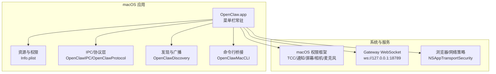
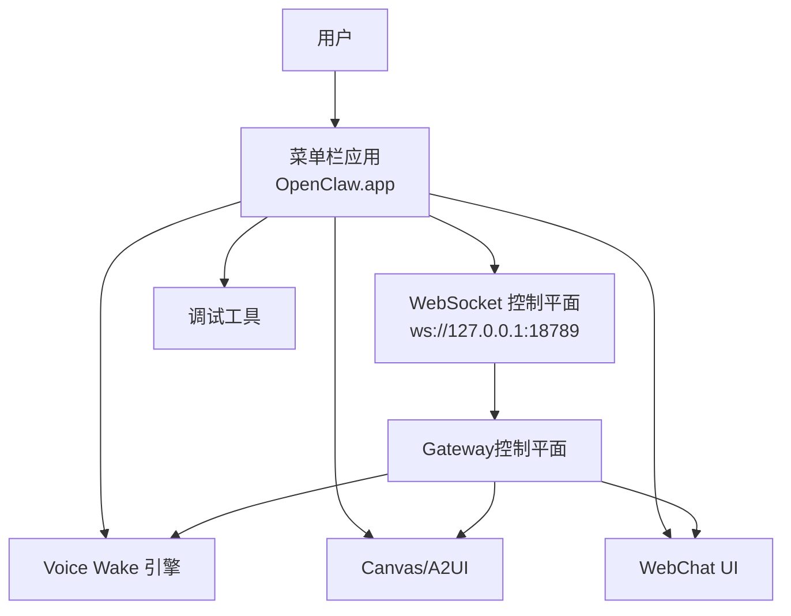
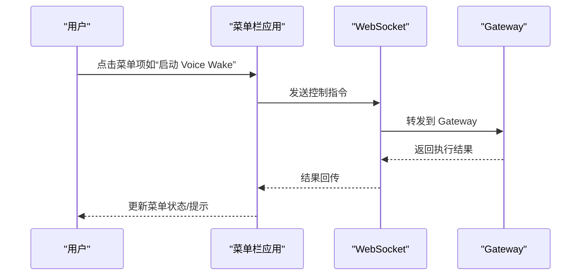
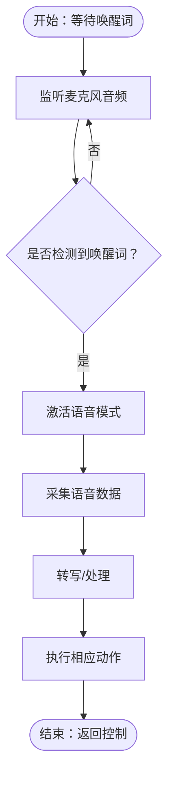
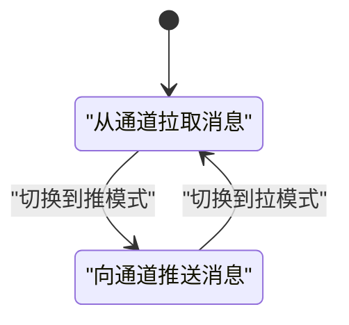
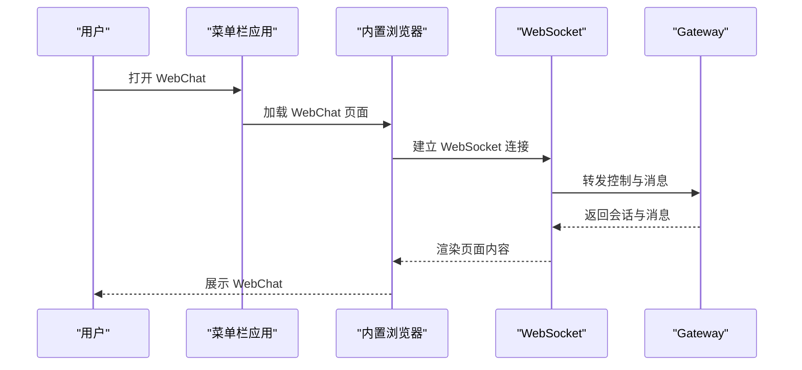
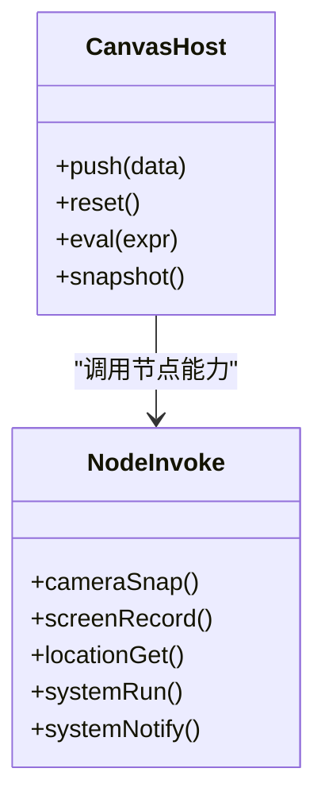
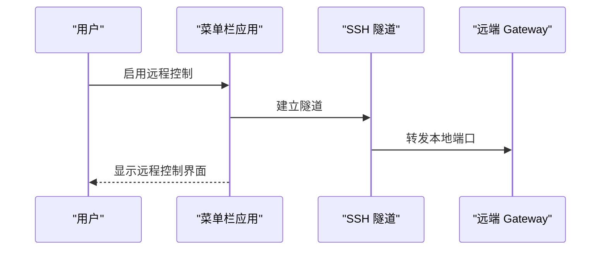
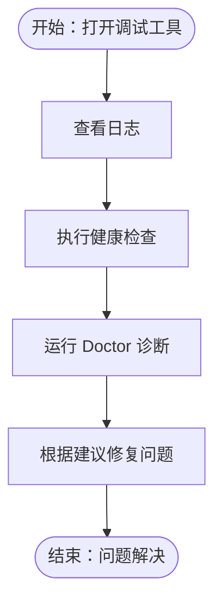
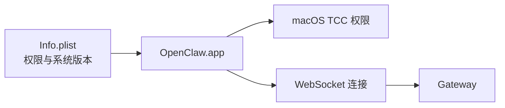

# 桌面应用使用

<cite>
**本文引用的文件**
- [README.md](file://README.md)
- [apps/macos/README.md](file://apps/macos/README.md)
- [apps/macos/Sources/OpenClaw/Resources/Info.plist](file://apps/macos/Sources/OpenClaw/Resources/Info.plist)
- [docs/platforms/macos.md](file://docs/platforms/macos.md)
- [docs/platforms/mac/menu-bar.md](file://docs/platforms/mac/menu-bar.md)
- [docs/platforms/mac/voicewake.md](file://docs/platforms/mac/voicewake.md)
- [docs/platforms/mac/canvas.md](file://docs/platforms/mac/canvas.md)
- [docs/web/webchat.md](file://docs/web/webchat.md)
- [docs/gateway/remote.md](file://docs/gateway/remote.md)
- [docs/help/troubleshooting.md](file://docs/help/troubleshooting.md)
- [docs/install/updating.md](file://docs/install/updating.md)
- [docs/gateway/doctor.md](file://docs/gateway/doctor.md)
- [docs/nodes/voicewake.md](file://docs/nodes/voicewake.md)
- [docs/nodes/talk.md](file://docs/nodes/talk.md)
- [docs/platforms/macos/dev-setup.md](file://docs/platforms/macos/dev-setup.md)
</cite>

## 目录

1. [简介](#简介)
2. [项目结构](#项目结构)
3. [核心组件](#核心组件)
4. [架构总览](#架构总览)
5. [详细组件分析](#详细组件分析)
6. [依赖关系分析](#依赖关系分析)
7. [性能考虑](#性能考虑)
8. [故障排除指南](#故障排除指南)
9. [结论](#结论)
10. [附录](#附录)

## 简介

本指南面向在 macOS 上使用 OpenClaw 桌面应用（OpenClaw.app）的用户，聚焦菜单栏控制、Voice Wake 功能、推拉模式、WebChat 界面与调试工具，并提供安装配置、权限设置与系统集成说明。同时覆盖 Canvas 操作、语音唤醒设置以及远程网关控制的使用方法，帮助您充分发挥桌面应用的各项能力。

## 项目结构

OpenClaw 的 macOS 应用位于 apps/macos 目录中，采用 Swift 包管理组织，核心入口通过 Info.plist 声明应用标识、最低系统版本与权限描述；应用以菜单栏常驻形式运行，提供网关健康状态、Voice Wake 控制、WebChat 与调试工具等能力。

图表来源

- [apps/macos/Sources/OpenClaw/Resources/Info.plist:1-80](file://apps/macos/Sources/OpenClaw/Resources/Info.plist#L1-L80)
- [README.md:185-239](file://README.md#L185-L239)

章节来源

- [README.md:288-311](file://README.md#L288-L311)
- [apps/macos/README.md:1-65](file://apps/macos/README.md#L1-L65)

## 核心组件

- 菜单栏控制：显示网关健康状态、启动/停止 Voice Wake、切换推拉模式、打开 WebChat 与调试工具。
- Voice Wake：基于本地唤醒词检测，支持 macOS/iOS 平台的唤醒触发与持续语音模式。
- 推拉模式：在“推”（主动推送消息到通道）与“拉”（从通道拉取消息）之间切换，便于不同工作流。
- WebChat：通过内置浏览器访问 Gateway 提供的 WebChat 界面，进行对话与控制。
- Canvas：在 macOS 上通过 Canvas/A2UI 进行可视化协作与操作。
- 远程网关控制：通过 SSH 隧道或 Tailscale 访问远端 Gateway，实现跨设备控制。
- 调试工具：查看日志、执行健康检查、诊断问题。

章节来源

- [README.md:126-176](file://README.md#L126-L176)
- [docs/platforms/macos.md:1-200](file://docs/platforms/macos.md#L1-L200)
- [docs/platforms/mac/menu-bar.md:1-200](file://docs/platforms/mac/menu-bar.md#L1-L200)
- [docs/platforms/mac/voicewake.md:1-200](file://docs/platforms/mac/voicewake.md#L1-L200)
- [docs/platforms/mac/canvas.md:1-200](file://docs/platforms/mac/canvas.md#L1-L200)
- [docs/web/webchat.md:1-200](file://docs/web/webchat.md#L1-L200)
- [docs/gateway/remote.md:1-200](file://docs/gateway/remote.md#L1-L200)

## 架构总览

OpenClaw 桌面应用通过菜单栏常驻进程与本地 Gateway 建立 WebSocket 连接，统一调度 Voice Wake、Canvas、WebChat 与调试工具等功能模块。应用还具备权限声明与系统集成能力，确保在 macOS 上安全合规地运行。

图表来源

- [README.md:185-239](file://README.md#L185-L239)
- [docs/platforms/macos.md:1-200](file://docs/platforms/macos.md#L1-L200)

## 详细组件分析

### 菜单栏控制

- 启动/停止 Voice Wake：在菜单中快速启用或禁用唤醒功能。
- 切换推拉模式：根据工作流选择“推”或“拉”，影响消息路由与处理方式。
- 打开 WebChat：在应用内打开内置浏览器访问 WebChat。
- 打开调试工具：查看日志、执行健康检查、诊断问题。

图表来源

- [docs/platforms/mac/menu-bar.md:1-200](file://docs/platforms/mac/menu-bar.md#L1-L200)

章节来源

- [docs/platforms/mac/menu-bar.md:1-200](file://docs/platforms/mac/menu-bar.md#L1-L200)

### Voice Wake 功能

- 唤醒词检测：在 macOS/iOS 上识别唤醒词，触发语音交互。
- 持续语音模式：在 Android 上支持连续语音输入，在 macOS 上可配合推拉模式使用。
- 设置与优化：通过菜单或配置调整灵敏度、触发词与反馈音量。

图表来源

- [docs/nodes/voicewake.md:1-200](file://docs/nodes/voicewake.md#L1-L200)
- [docs/platforms/mac/voicewake.md:1-200](file://docs/platforms/mac/voicewake.md#L1-L200)

章节来源

- [docs/nodes/voicewake.md:1-200](file://docs/nodes/voicewake.md#L1-L200)
- [docs/platforms/mac/voicewake.md:1-200](file://docs/platforms/mac/voicewake.md#L1-L200)

### 推拉模式

- 推模式：由应用主动向通道发送消息，适合自动化与主动通知场景。
- 拉模式：从通道拉取消息，适合被动接收与人工干预场景。
- 切换方式：在菜单栏中一键切换，立即生效。

图表来源

- [docs/platforms/macos.md:1-200](file://docs/platforms/macos.md#L1-L200)

章节来源

- [docs/platforms/macos.md:1-200](file://docs/platforms/macos.md#L1-L200)

### WebChat 界面

- 内置浏览器：通过应用内的浏览器访问 Gateway 提供的 WebChat。
- 会话管理：在 WebChat 中进行对话、查看历史与执行工具调用。
- 安全策略：遵循 NSAppTransportSecurity 配置，允许特定域名加载。

图表来源

- [docs/web/webchat.md:1-200](file://docs/web/webchat.md#L1-L200)
- [apps/macos/Sources/OpenClaw/Resources/Info.plist:63-77](file://apps/macos/Sources/OpenClaw/Resources/Info.plist#L63-L77)

章节来源

- [docs/web/webchat.md:1-200](file://docs/web/webchat.md#L1-L200)
- [apps/macos/Sources/OpenClaw/Resources/Info.plist:63-77](file://apps/macos/Sources/OpenClaw/Resources/Info.plist#L63-L77)

### Canvas 操作

- 可视化协作：通过 Canvas/A2UI 实现可视化操作与展示。
- 与节点集成：支持摄像头、屏幕录制、位置信息等节点能力。
- 权限要求：涉及屏幕录制、相机、位置等需用户授权。

图表来源

- [docs/platforms/mac/canvas.md:1-200](file://docs/platforms/mac/canvas.md#L1-L200)
- [README.md:240-254](file://README.md#L240-L254)

章节来源

- [docs/platforms/mac/canvas.md:1-200](file://docs/platforms/mac/canvas.md#L1-L200)
- [README.md:240-254](file://README.md#L240-L254)

### 远程网关控制

- SSH 隧道：通过 SSH 将远端 Gateway 暴露到本地端口，实现远程控制。
- Tailscale：支持 Serve/Funnel，安全地暴露 Gateway 服务。
- 认证与访问：支持密码认证与 Tailscale 身份验证。

图表来源

- [docs/gateway/remote.md:1-200](file://docs/gateway/remote.md#L1-L200)

章节来源

- [docs/gateway/remote.md:1-200](file://docs/gateway/remote.md#L1-L200)

### 调试工具

- 日志查看：在应用内查看 Gateway 与各子系统的日志。
- 健康检查：执行健康检查，定位连接、权限与配置问题。
- Doctor 工具：自动诊断常见问题并给出修复建议。

图表来源

- [docs/help/troubleshooting.md:1-200](file://docs/help/troubleshooting.md#L1-L200)
- [docs/gateway/doctor.md:1-200](file://docs/gateway/doctor.md#L1-L200)

章节来源

- [docs/help/troubleshooting.md:1-200](file://docs/help/troubleshooting.md#L1-L200)
- [docs/gateway/doctor.md:1-200](file://docs/gateway/doctor.md#L1-L200)

## 依赖关系分析

- 应用依赖 macOS 系统权限框架（TCC），用于通知、屏幕捕获、相机、麦克风、位置与自动化。
- 应用通过 Info.plist 声明最低系统版本与权限用途描述。
- 应用通过 WebSocket 与本地 Gateway 通信，实现菜单控制、Canvas 与 WebChat 功能。

图表来源

- [apps/macos/Sources/OpenClaw/Resources/Info.plist:34-61](file://apps/macos/Sources/OpenClaw/Resources/Info.plist#L34-L61)
- [README.md:185-239](file://README.md#L185-L239)

章节来源

- [apps/macos/Sources/OpenClaw/Resources/Info.plist:34-61](file://apps/macos/Sources/OpenClaw/Resources/Info.plist#L34-L61)
- [README.md:185-239](file://README.md#L185-L239)

## 性能考虑

- 降低唤醒误触发：合理设置唤醒词与灵敏度，避免频繁激活。
- 合理使用 Canvas：在需要时开启屏幕录制与摄像头，避免不必要的资源占用。
- 网络与隧道：优先使用本地回环连接，减少网络延迟；远程访问时选择合适的隧道方案。
- 日志级别：在日常使用中保持默认日志级别，仅在排查问题时提高日志详细度。

## 故障排除指南

- 权限未授予：若通知、屏幕录制、相机、麦克风或位置权限被拒绝，请在系统设置中手动授予。
- 网络连接异常：检查本地 Gateway 是否正常运行，确认端口绑定与防火墙设置。
- 远程访问失败：确认 SSH 隧道或 Tailscale 配置正确，认证凭据有效。
- Doctor 诊断：使用 Doctor 工具自动检查配置与运行环境，按提示修复问题。

章节来源

- [docs/help/troubleshooting.md:1-200](file://docs/help/troubleshooting.md#L1-L200)
- [docs/gateway/doctor.md:1-200](file://docs/gateway/doctor.md#L1-L200)

## 结论

OpenClaw 桌面应用为 macOS 用户提供了便捷的菜单栏控制、Voice Wake、Canvas、WebChat 与调试工具，结合本地 Gateway 与远程网关控制，满足从本地到跨设备的多种使用场景。通过合理的权限配置与系统集成，您可以获得稳定、高效且安全的个人 AI 助手体验。

## 附录

### 安装与更新

- 使用包管理器安装最新版本后，可通过向导完成 Gateway 守护进程安装与配置。
- 更新时建议先运行健康检查，再升级应用与 Gateway。

章节来源

- [README.md:50-82](file://README.md#L50-L82)
- [docs/install/updating.md:1-200](file://docs/install/updating.md#L1-L200)

### 开发与签名

- 开发运行：提供脚本快速重启应用与打包流程。
- 签名行为：自动选择开发者证书，支持强制签名与临时签名选项。
- 团队 ID 审计：对嵌入二进制进行团队 ID 校验，防止 Sparkle 团队不匹配导致加载失败。
- 库验证绕过：开发阶段可临时关闭库验证以解决加载问题。

章节来源

- [apps/macos/README.md:1-65](file://apps/macos/README.md#L1-L65)

### 系统集成与权限

- 最低系统版本：macOS 15.0。
- 权限描述：通知、屏幕捕获、相机、位置、麦克风、语音识别与自动化等用途说明。
- 网络策略：允许特定域名加载，便于 WebChat 与内部服务访问。

章节来源

- [apps/macos/Sources/OpenClaw/Resources/Info.plist:34-77](file://apps/macos/Sources/OpenClaw/Resources/Info.plist#L34-L77)
