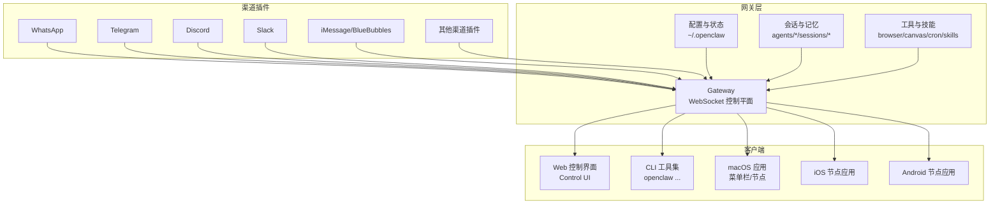
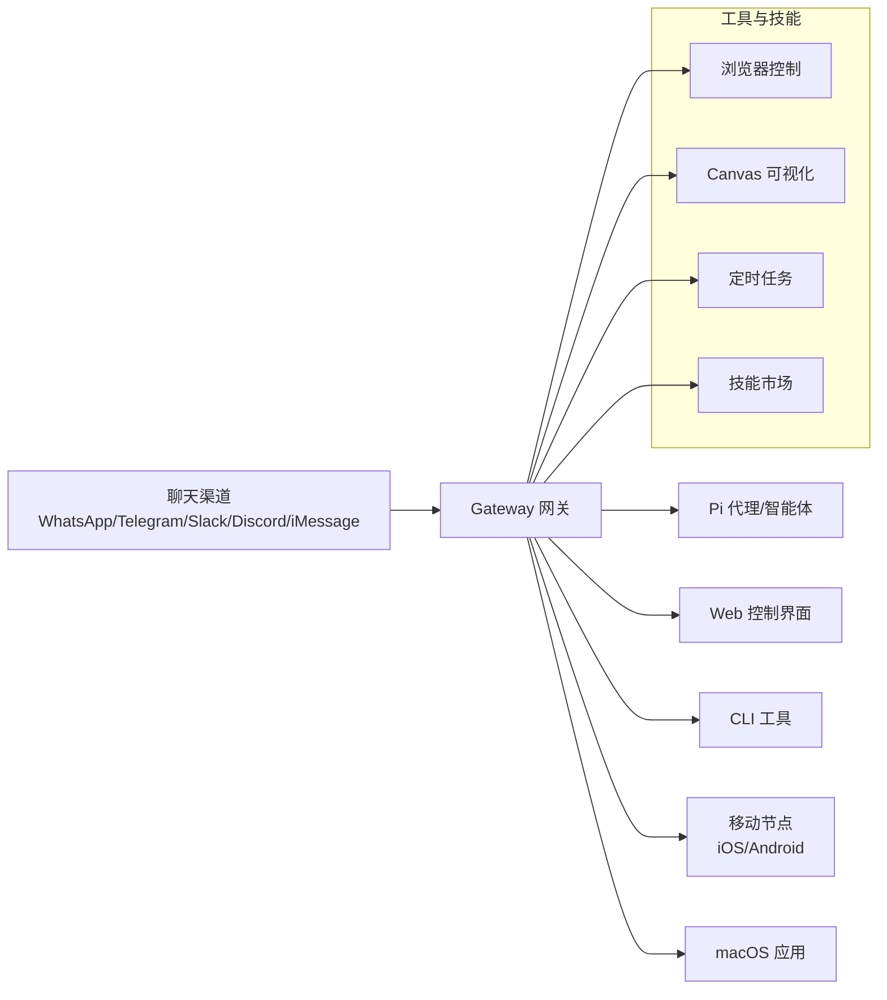
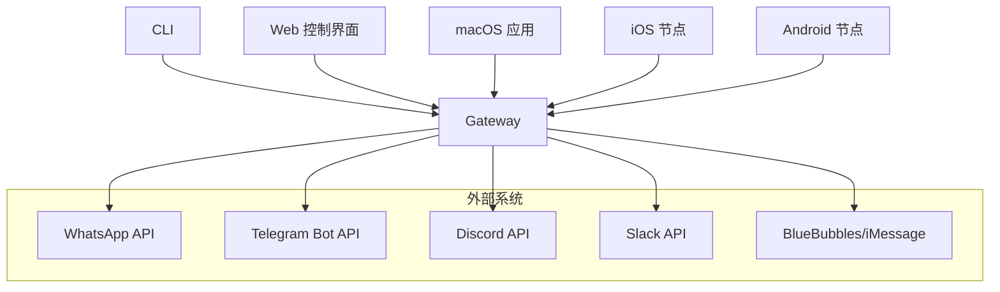

# 用户指南

<cite>
**本文档引用的文件**
- [README.md](file://README.md)
- [docs/index.md](file://docs/index.md)
- [docs/start/getting-started.md](file://docs/start/getting-started.md)
- [docs/help/faq.md](file://docs/help/faq.md)
- [docs/cli/index.md](file://docs/cli/index.md)
- [docs/web/index.md](file://docs/web/index.md)
- [docs/platforms/android.md](file://docs/platforms/android.md)
- [docs/platforms/ios.md](file://docs/platforms/ios.md)
</cite>

## 目录

1. [简介](#简介)
2. [项目结构](#项目结构)
3. [核心组件](#核心组件)
4. [架构总览](#架构总览)
5. [详细组件分析](#详细组件分析)
6. [依赖关系分析](#依赖关系分析)
7. [性能考虑](#性能考虑)
8. [故障排除指南](#故障排除指南)
9. [结论](#结论)
10. [附录](#附录)

## 简介

OpenClaw 是一个可在任意操作系统上运行的个人 AI 助手，通过统一的网关（Gateway）连接到您常用的聊天渠道（如 WhatsApp、Telegram、Discord、iMessage 等），并在本地或远程服务器上持续运行。它支持多通道消息收发、会话与记忆管理、工具调用、节点（设备）控制、浏览器自动化、Canvas 可视化工作区等能力。

- 支持平台：macOS、Linux、Windows（WSL2）、iOS、Android
- 运行方式：本地自托管网关 + 多端客户端（Web 控制界面、桌面应用、移动节点）
- 安全模型：默认仅在主会话执行工具；群组/频道会话可沙箱隔离

本指南面向不同平台用户提供从入门到进阶的完整使用说明，覆盖 CLI 命令参考、Web 界面使用、移动应用操作与桌面应用功能，并提供典型使用场景与故障排除建议。

章节来源

- [README.md:1-560](file://README.md#L1-L560)
- [docs/index.md:1-193](file://docs/index.md#L1-L193)

## 项目结构

OpenClaw 的核心由“网关（WebSocket 控制平面）+ 多端客户端 + 插件生态”构成。下图展示了主要模块及其交互关系：

图表来源

- [README.md:185-202](file://README.md#L185-L202)
- [docs/index.md:59-71](file://docs/index.md#L59-L71)

章节来源

- [README.md:185-202](file://README.md#L185-L202)
- [docs/index.md:59-71](file://docs/index.md#L59-L71)

## 核心组件

- 网关（Gateway）：单一路由与控制平面，负责会话、路由、事件、工具与渠道连接。
- CLI：命令行工具集，覆盖安装向导、配置、诊断、服务管理、消息发送、节点与设备管理等。
- Web 控制界面：浏览器仪表盘，用于聊天、配置、会话与节点管理。
- 移动节点：iOS/Android 应用作为“节点”连接网关，提供 Canvas、相机、屏幕录制、通知、位置等本地能力。
- 渠道插件：针对 WhatsApp、Telegram、Discord、Slack、iMessage 等渠道的适配器。
- 工具与技能：浏览器控制、Canvas、定时任务、会话间协作、ClawHub 技能市场等。

章节来源

- [docs/cli/index.md:1-800](file://docs/cli/index.md#L1-L800)
- [docs/web/index.md:1-121](file://docs/web/index.md#L1-L121)
- [docs/platforms/android.md:1-165](file://docs/platforms/android.md#L1-L165)
- [docs/platforms/ios.md:1-109](file://docs/platforms/ios.md#L1-L109)

## 架构总览

下图展示 OpenClaw 的端到端架构与数据流：

图表来源

- [README.md:185-202](file://README.md#L185-L202)

章节来源

- [README.md:185-202](file://README.md#L185-L202)

## 详细组件分析

### CLI 命令参考（快速上手）

- 安装与初始化
  - 使用安装脚本安装后，推荐运行“引导向导”完成认证、网关设置与可选渠道配置。
  - 常用命令：`openclaw onboard`、`openclaw dashboard`、`openclaw gateway --port 18789`。
- 网关与服务
  - 启动/停止/重启网关服务，查看状态与健康检查。
  - 支持通过 Tailscale Serve/Funnel 暴露网关，或通过 SSH 隧道访问。
- 渠道与消息
  - 添加/移除渠道账号，登录/登出，查看状态与日志。
  - 发送消息、投票、表情包、语音状态等。
- 会话与代理
  - 列表/重置/历史查询；跨会话协作工具（sessions\_\*）。
  - 单次代理调用（agent）与本地嵌入模式。
- 设备与节点
  - 查看/批准/拒绝设备配对请求；节点状态与命令调用。
- 配置与诊断
  - 获取/设置/校验配置；doctor 修复；日志跟踪；健康快照。
- 浏览器与 Web
  - 浏览器状态、启动/停止、标签页管理、截图/快照、导航、上传、等待、评估等。
  - Webhook/Gmail Pub/Sub 集成。

章节来源

- [docs/cli/index.md:1-800](file://docs/cli/index.md#L1-L800)
- [docs/start/getting-started.md:1-136](file://docs/start/getting-started.md#L1-L136)

### Web 控制界面（浏览器仪表盘）

- 默认地址：`http://127.0.0.1:18789/`（本地），或通过 Tailscale Serve/Funnel/SSH 隧道远程访问。
- 访问控制：非 loopback 绑定需共享令牌/密码；Serve 模式可使用 Tailscale 身份头认证。
- 功能：聊天、配置编辑、会话列表、节点状态、健康检查、Hook 管理等。
- UI 构建：通过网关内置静态资源目录提供，可按需构建。

章节来源

- [docs/web/index.md:1-121](file://docs/web/index.md#L1-L121)
- [docs/start/getting-started.md:13-18](file://docs/start/getting-started.md#L13-L18)

### 移动应用（iOS/Android 节点）

- iOS 节点
  - 通过 Bonjour（局域网）或 Tailscale unicast DNS-SD（跨网络）发现并连接网关。
  - 支持 Canvas 导航/评估/截图、相机/屏幕录制、位置、语音唤醒/说话模式等。
  - 常见错误：后台音频限制、Canvas 主机未配置、重新安装后配对令牌丢失。
- Android 节点
  - 通过 mDNS/NSD 或 Tailscale DNS-SD 发现网关；支持手动主机/端口。
  - 支持 Canvas 导航/评估/截图、相机拍照/视频、通知、联系人/日历/运动等设备命令。
  - 连接流程：启动网关 → 发现/手动输入 → CLI 批准配对 → 验证节点状态 → 聊天/历史同步。

章节来源

- [docs/platforms/ios.md:1-109](file://docs/platforms/ios.md#L1-L109)
- [docs/platforms/android.md:1-165](file://docs/platforms/android.md#L1-L165)

### 桌面应用（macOS）

- 菜单栏控制：网关健康、远程控制（SSH）、语音唤醒/推说模式、WebChat、调试工具。
- 权限模型：通过网关协议调用本地能力（如系统命令、通知、Canvas、相机、屏幕录制、位置），遵循 macOS TCC 权限。
- 提升体验：配合 iOS/Android 节点实现跨设备协同与本地能力扩展。

章节来源

- [README.md:289-311](file://README.md#L289-L311)

### 典型使用场景与操作示例

- 快速开始（无需渠道）
  - 安装 → 引导向导 → 启动网关 → 打开控制界面 → 直接聊天。
  - 参考：[Getting Started:13-18](file://docs/start/getting-started.md#L13-L18)、[CLI Reference:311-382](file://docs/cli/index.md#L311-L382)。

- 连接 WhatsApp 并开始聊天
  - 在网关主机上登录渠道：`openclaw channels login`。
  - 启动网关：`openclaw gateway --port 18789`。
  - 通过控制界面或移动端发起消息：`openclaw message send --target +1234567890 --message "Hello"`。
  - 参考：[Getting Started:94-101](file://docs/start/getting-started.md#L94-L101)、[CLI Reference:531-554](file://docs/cli/index.md#L531-L554)。

- 远程网关与节点协同
  - 在 VPS 上运行网关，通过 Tailscale Serve/Funnel 或 SSH 隧道访问。
  - 将本地 Mac/iPhone/Android 作为节点连接网关，调用本地能力（屏幕/相机/通知）。
  - 参考：[FAQ 远程网关与节点:1570-1599](file://docs/help/faq.md#L1570-L1599)、[Web:37-113](file://docs/web/index.md#L37-L113)。

- iOS/Android 节点配对与 Canvas 使用
  - iOS：Bonjour 发现 → CLI 批准 → Canvas 导航/评估/截图。
  - Android：mDNS/NSD 或手动主机 → CLI 批准 → Canvas/相机/通知等命令。
  - 参考：[iOS:28-109](file://docs/platforms/ios.md#L28-L109)、[Android:24-165](file://docs/platforms/android.md#L24-L165)。

- 代理交互与会话协作
  - 单次代理调用：`openclaw agent --message "Ship checklist" --thinking high`。
  - 会话间协作：`sessions_list/history/send` 实现跨会话协调。
  - 参考：[CLI Reference:555-703](file://docs/cli/index.md#L555-L703)。

- 浏览器控制与自动化
  - 启动/停止浏览器、打开/聚焦标签页、截图/快照、导航、上传、等待、评估等。
  - 参考：[CLI Reference:215-243](file://docs/cli/index.md#L215-L243)。

章节来源

- [docs/start/getting-started.md:13-136](file://docs/start/getting-started.md#L13-L136)
- [docs/cli/index.md:311-800](file://docs/cli/index.md#L311-L800)
- [docs/web/index.md:1-121](file://docs/web/index.md#L1-121)
- [docs/platforms/ios.md:28-109](file://docs/platforms/ios.md#L28-L109)
- [docs/platforms/android.md:24-165](file://docs/platforms/android.md#L24-L165)
- [docs/help/faq.md:1570-1599](file://docs/help/faq.md#L1570-L1599)

## 依赖关系分析

- 组件耦合
  - 网关是单一控制平面，所有客户端（Web、CLI、桌面、移动节点）均通过 WebSocket 与其交互。
  - 渠道插件与工具/技能通过网关暴露的 RPC 接口进行调用。
- 外部依赖
  - 渠道插件依赖对应平台的 API/SDK（例如 Telegram Bot Token、Discord 应用密钥、iMessage BlueBubbles 服务等）。
  - 远程访问依赖 Tailscale 或 SSH 隧道。
- 安全边界
  - 工具执行默认在网关主机上进行；群组/频道会话可通过沙箱隔离降低风险。
  - 访问控制通过网关认证（令牌/密码/Tailscale 身份头）实现。

图表来源

- [README.md:151-154](file://README.md#L151-L154)
- [docs/cli/index.md:414-470](file://docs/cli/index.md#L414-L470)

章节来源

- [README.md:151-154](file://README.md#L151-L154)
- [docs/cli/index.md:414-470](file://docs/cli/index.md#L414-L470)

## 性能考虑

- 资源占用
  - 网关轻量，个人使用建议 1 核 1GB 内存起步；若启用浏览器自动化与媒体处理，建议 2GB+。
- 运行环境
  - 优先在 VPS/树莓派等常开设备上运行网关，减少睡眠/重启带来的中断。
  - 使用 Tailscale Serve/Funnel 或 SSH 隧道以获得稳定的远程访问。
- 会话与记忆
  - 合理使用会话压缩与记忆索引，避免上下文过长导致延迟与截断。
- 沙箱与安全
  - 对群组/频道会话启用沙箱，限制工具权限，降低风险同时保持可用性。

章节来源

- [docs/help/faq.md:952-976](file://docs/help/faq.md#L952-L976)
- [docs/help/faq.md:1234-1266](file://docs/help/faq.md#L1234-L1266)

## 故障排除指南

- 快速诊断清单（前 60 秒）
  - 检查状态：`openclaw status`
  - 检查模型状态：`openclaw models status`
  - 运行修复：`openclaw doctor`
  - 查看日志：`openclaw logs --follow`
  - 网关健康：`openclaw health --json`
- 常见问题
  - 无法访问控制界面：确认绑定模式与认证（loopback 默认需要令牌；非 loopback 必须配置 gateway.auth）。
  - 远程访问失败：检查 Tailscale 连接、Serve/Funnel 配置与端口转发。
  - 通道无响应：检查通道登录状态、令牌有效性与网络连通性。
  - 节点无法配对：在网关主机上使用 `openclaw devices list/approve` 完成批准。
  - Windows 控制台乱码：调整控制台代码页与输出编码。
- 更多参考
  - FAQ 中的“第一分钟”诊断流程与“常见问题”章节提供了详尽的排查步骤与建议。

章节来源

- [docs/help/faq.md:203-267](file://docs/help/faq.md#L203-L267)
- [docs/help/faq.md:342-361](file://docs/help/faq.md#L342-L361)
- [docs/help/faq.md:1570-1599](file://docs/help/faq.md#L1570-L1599)

## 结论

OpenClaw 提供了从 CLI 到 Web、从桌面到移动的完整使用体验，通过统一网关实现多渠道、多设备、多会话的协同工作。建议新用户先完成引导向导与基础配置，再逐步接入渠道与技能，结合 FAQ 与诊断工具解决常见问题，最终实现高效、安全、可扩展的个人 AI 助手工作流。

## 附录

### 快速命令速查

- 初始化与启动
  - `openclaw onboard --install-daemon`
  - `openclaw gateway --port 18789`
  - `openclaw dashboard`
- 渠道与消息
  - `openclaw channels add --channel telegram --account alerts --token $TELEGRAM_BOT_TOKEN`
  - `openclaw message send --target +1234567890 --message "Hello"`
- 诊断与维护
  - `openclaw status --all`
  - `openclaw logs --follow`
  - `openclaw doctor`
- 节点与设备
  - `openclaw devices list/approve`
  - `openclaw nodes status`

章节来源

- [docs/cli/index.md:311-800](file://docs/cli/index.md#L311-L800)
- [docs/start/getting-started.md:13-136](file://docs/start/getting-started.md#L13-L136)
