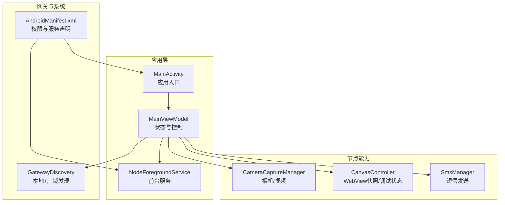
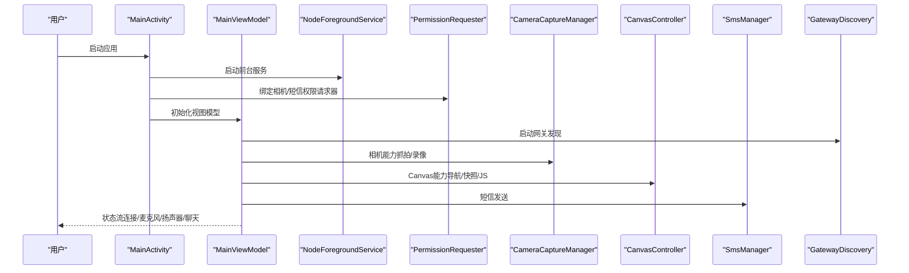
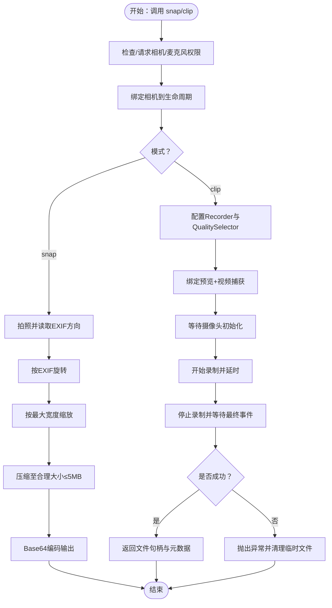
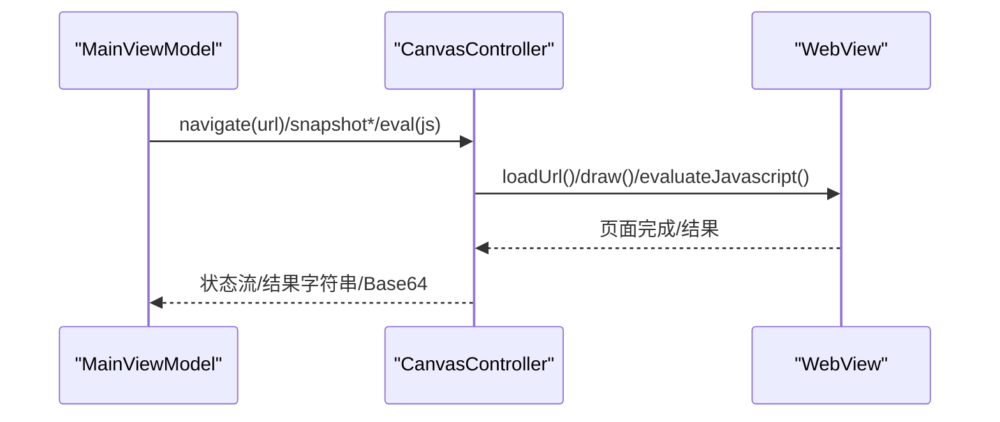
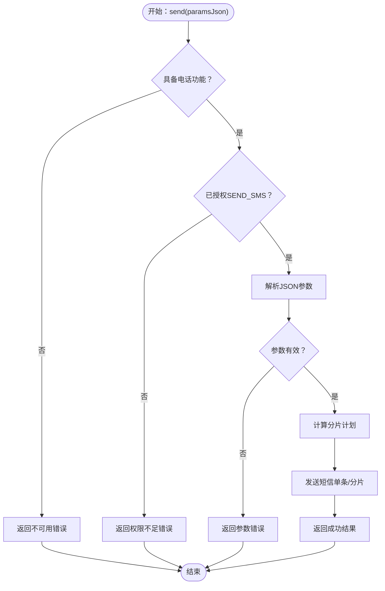
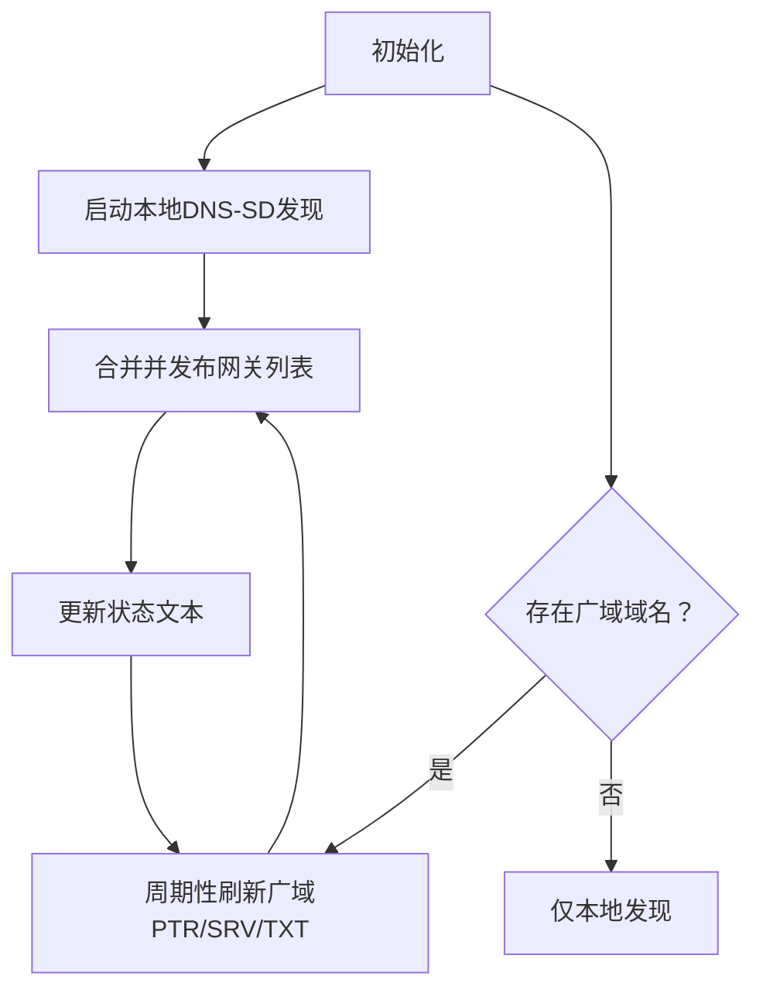
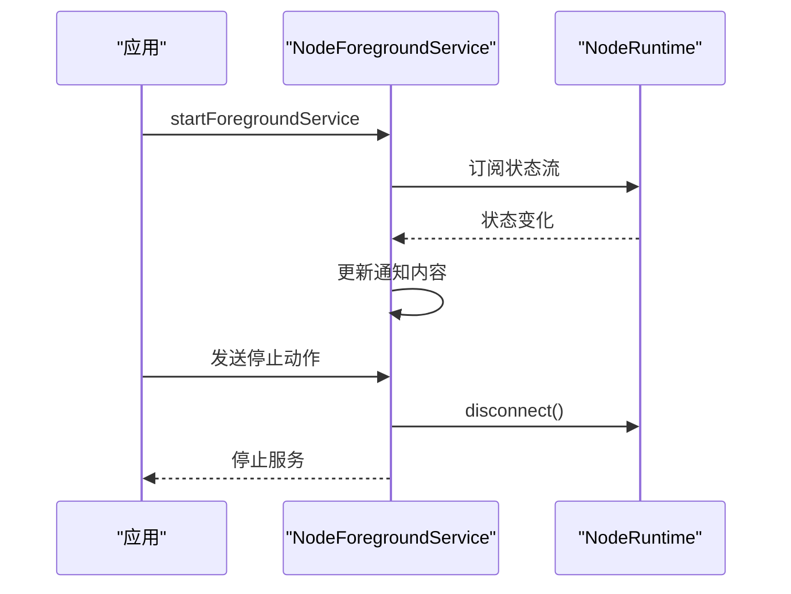
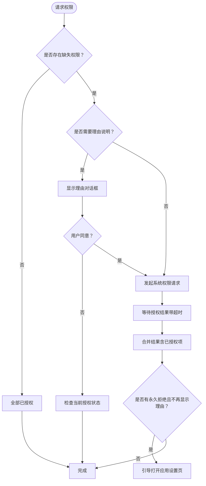
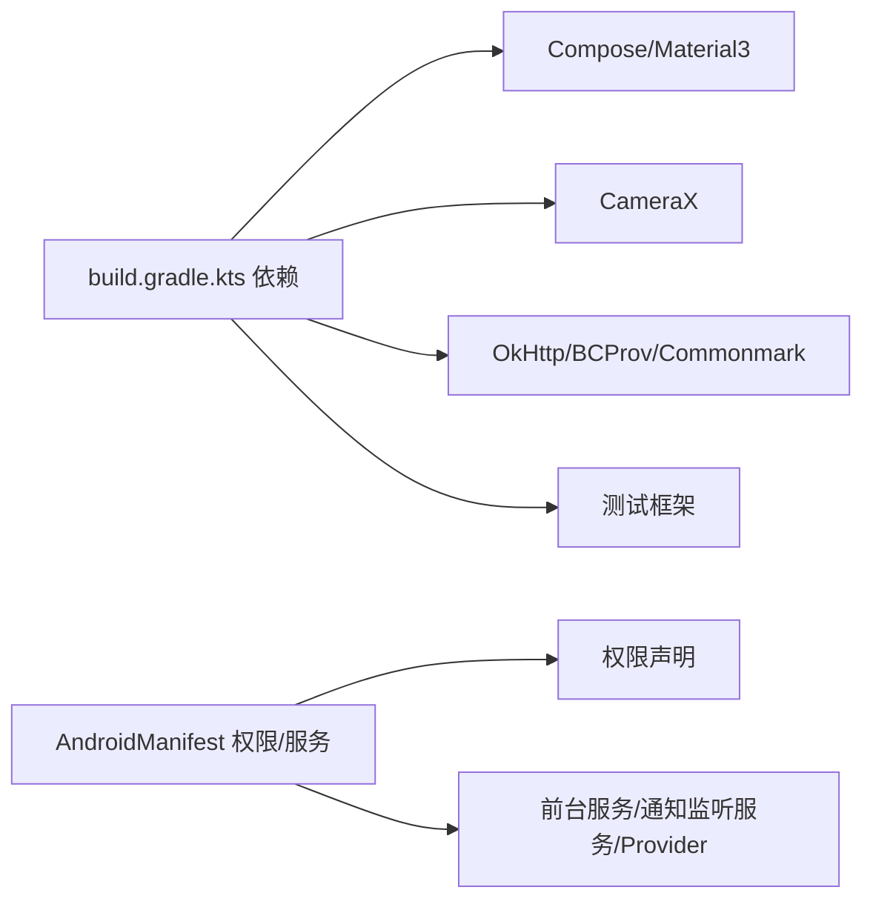

# Android应用使用

<cite>
**本文引用的文件**
- [apps/android/README.md](file://apps/android/README.md)
- [apps/android/app/build.gradle.kts](file://apps/android/app/build.gradle.kts)
- [apps/android/app/src/main/AndroidManifest.xml](file://apps/android/app/src/main/AndroidManifest.xml)
- [apps/android/app/src/main/java/ai/openclaw/app/MainActivity.kt](file://apps/android/app/src/main/java/ai/openclaw/app/MainActivity.kt)
- [apps/android/app/src/main/java/ai/openclaw/app/MainViewModel.kt](file://apps/android/app/src/main/java/ai/openclaw/app/MainViewModel.kt)
- [apps/android/app/src/main/java/ai/openclaw/app/NodeApp.kt](file://apps/android/app/src/main/java/ai/openclaw/app/NodeApp.kt)
- [apps/android/app/src/main/java/ai/openclaw/app/NodeForegroundService.kt](file://apps/android/app/src/main/java/ai/openclaw/app/NodeForegroundService.kt)
- [apps/android/app/src/main/java/ai/openclaw/app/PermissionRequester.kt](file://apps/android/app/src/main/java/ai/openclaw/app/PermissionRequester.kt)
- [apps/android/app/src/main/java/ai/openclaw/app/node/CameraCaptureManager.kt](file://apps/android/app/src/main/java/ai/openclaw/app/node/CameraCaptureManager.kt)
- [apps/android/app/src/main/java/ai/openclaw/app/node/CanvasController.kt](file://apps/android/app/src/main/java/ai/openclaw/app/node/CanvasController.kt)
- [apps/android/app/src/main/java/ai/openclaw/app/node/SmsManager.kt](file://apps/android/app/src/main/java/ai/openclaw/app/node/SmsManager.kt)
- [apps/android/app/src/main/java/ai/openclaw/app/gateway/GatewayDiscovery.kt](file://apps/android/app/src/main/java/ai/openclaw/app/gateway/GatewayDiscovery.kt)
</cite>

## 目录

1. [简介](#简介)
2. [项目结构](#项目结构)
3. [核心组件](#核心组件)
4. [架构总览](#架构总览)
5. [详细组件分析](#详细组件分析)
6. [依赖关系分析](#依赖关系分析)
7. [性能与稳定性建议](#性能与稳定性建议)
8. [故障排查指南](#故障排查指南)
9. [结论](#结论)
10. [附录：使用步骤与示例](#附录使用步骤与示例)

## 简介

本指南面向在Android设备上使用OpenClaw节点应用的用户与维护者，覆盖从安装、配对、连接到日常使用的完整流程，并重点说明Android特有的功能（相机抓拍/视频录制、屏幕快照、Canvas操作、通知与前台服务、权限请求）以及后台运行与电池优化注意事项。文档同时提供端到端的使用步骤、连接验证方法与常见问题的快速修复路径。

## 项目结构

Android应用位于apps/android目录，采用Kotlin + Jetpack Compose实现，核心模块包括：

- 应用入口与生命周期：MainActivity、NodeApp、NodeForegroundService
- 运行时与状态：MainViewModel、NodeRuntime（由NodeApp延迟初始化）
- 节点能力：CameraCaptureManager（相机）、CanvasController（屏幕快照/Canvas交互）、SmsManager（短信）
- 网关发现：GatewayDiscovery（本地DNS-SD与广域域名解析）
- 权限与系统集成：PermissionRequester（权限请求）、AndroidManifest.xml（权限声明）

图表来源

- [apps/android/app/src/main/java/ai/openclaw/app/MainActivity.kt:18-64](file://apps/android/app/src/main/java/ai/openclaw/app/MainActivity.kt#L18-L64)
- [apps/android/app/src/main/java/ai/openclaw/app/MainViewModel.kt:13-203](file://apps/android/app/src/main/java/ai/openclaw/app/MainViewModel.kt#L13-L203)
- [apps/android/app/src/main/java/ai/openclaw/app/NodeForegroundService.kt:20-159](file://apps/android/app/src/main/java/ai/openclaw/app/NodeForegroundService.kt#L20-L159)
- [apps/android/app/src/main/java/ai/openclaw/app/node/CameraCaptureManager.kt:44-420](file://apps/android/app/src/main/java/ai/openclaw/app/node/CameraCaptureManager.kt#L44-L420)
- [apps/android/app/src/main/java/ai/openclaw/app/node/CanvasController.kt:26-273](file://apps/android/app/src/main/java/ai/openclaw/app/node/CanvasController.kt#L26-L273)
- [apps/android/app/src/main/java/ai/openclaw/app/node/SmsManager.kt:20-231](file://apps/android/app/src/main/java/ai/openclaw/app/node/SmsManager.kt#L20-L231)
- [apps/android/app/src/main/java/ai/openclaw/app/gateway/GatewayDiscovery.kt:47-522](file://apps/android/app/src/main/java/ai/openclaw/app/gateway/GatewayDiscovery.kt#L47-L522)
- [apps/android/app/src/main/AndroidManifest.xml:1-77](file://apps/android/app/src/main/AndroidManifest.xml#L1-L77)

章节来源

- [apps/android/README.md:1-229](file://apps/android/README.md#L1-L229)
- [apps/android/app/build.gradle.kts:1-214](file://apps/android/app/build.gradle.kts#L1-L214)
- [apps/android/app/src/main/AndroidManifest.xml:1-77](file://apps/android/app/src/main/AndroidManifest.xml#L1-L77)

## 核心组件

- 应用入口与生命周期
  - MainActivity负责启动前台服务、绑定相机与权限请求器、保持屏幕常亮开关等。
  - NodeApp延迟持有NodeRuntime，供全局使用。
  - NodeForegroundService提供连接状态通知，支持停止动作并断开连接。
- 运行时与状态
  - MainViewModel聚合所有节点能力（相机、Canvas、短信、聊天、网关发现、麦克风/扬声器状态等），并通过状态流暴露给UI。
- 节点能力
  - CameraCaptureManager：支持相机抓拍（JPEG，含EXIF旋转与压缩上限）、视频录制（MP4，可选音频）。
  - CanvasController：在WebView中加载默认脚手架或指定URL，支持PNG/JPEG快照、JS执行、调试状态显示。
  - SmsManager：基于Android SMS API发送短信，支持分片发送与权限校验。
- 网关发现
  - GatewayDiscovery通过本地DNS-SD与可选广域域名进行服务发现，解析服务名、主机、端口、TLS指纹等信息。
- 权限与系统集成
  - PermissionRequester统一处理多权限请求、理由提示与“打开设置”引导。
  - AndroidManifest声明网络、通知、位置、相机、录音、短信、文件访问等权限。

章节来源

- [apps/android/app/src/main/java/ai/openclaw/app/MainActivity.kt:18-64](file://apps/android/app/src/main/java/ai/openclaw/app/MainActivity.kt#L18-L64)
- [apps/android/app/src/main/java/ai/openclaw/app/NodeApp.kt:6-27](file://apps/android/app/src/main/java/ai/openclaw/app/NodeApp.kt#L6-L27)
- [apps/android/app/src/main/java/ai/openclaw/app/NodeForegroundService.kt:20-159](file://apps/android/app/src/main/java/ai/openclaw/app/NodeForegroundService.kt#L20-L159)
- [apps/android/app/src/main/java/ai/openclaw/app/MainViewModel.kt:13-203](file://apps/android/app/src/main/java/ai/openclaw/app/MainViewModel.kt#L13-L203)
- [apps/android/app/src/main/java/ai/openclaw/app/node/CameraCaptureManager.kt:44-420](file://apps/android/app/src/main/java/ai/openclaw/app/node/CameraCaptureManager.kt#L44-L420)
- [apps/android/app/src/main/java/ai/openclaw/app/node/CanvasController.kt:26-273](file://apps/android/app/src/main/java/ai/openclaw/app/node/CanvasController.kt#L26-L273)
- [apps/android/app/src/main/java/ai/openclaw/app/node/SmsManager.kt:20-231](file://apps/android/app/src/main/java/ai/openclaw/app/node/SmsManager.kt#L20-L231)
- [apps/android/app/src/main/java/ai/openclaw/app/gateway/GatewayDiscovery.kt:47-522](file://apps/android/app/src/main/java/ai/openclaw/app/gateway/GatewayDiscovery.kt#L47-L522)
- [apps/android/app/src/main/java/ai/openclaw/app/PermissionRequester.kt:22-134](file://apps/android/app/src/main/java/ai/openclaw/app/PermissionRequester.kt#L22-L134)
- [apps/android/app/src/main/AndroidManifest.xml:1-77](file://apps/android/app/src/main/AndroidManifest.xml#L1-L77)

## 架构总览

下图展示应用启动、前台服务、权限请求、节点能力调用与网关发现的整体交互：

图表来源

- [apps/android/app/src/main/java/ai/openclaw/app/MainActivity.kt:22-52](file://apps/android/app/src/main/java/ai/openclaw/app/MainActivity.kt#L22-L52)
- [apps/android/app/src/main/java/ai/openclaw/app/NodeForegroundService.kt:25-57](file://apps/android/app/src/main/java/ai/openclaw/app/NodeForegroundService.kt#L25-L57)
- [apps/android/app/src/main/java/ai/openclaw/app/PermissionRequester.kt:22-31](file://apps/android/app/src/main/java/ai/openclaw/app/PermissionRequester.kt#L22-L31)
- [apps/android/app/src/main/java/ai/openclaw/app/MainViewModel.kt:13-74](file://apps/android/app/src/main/java/ai/openclaw/app/MainViewModel.kt#L13-L74)
- [apps/android/app/src/main/java/ai/openclaw/app/node/CameraCaptureManager.kt:97-160](file://apps/android/app/src/main/java/ai/openclaw/app/node/CameraCaptureManager.kt#L97-L160)
- [apps/android/app/src/main/java/ai/openclaw/app/node/CanvasController.kt:67-117](file://apps/android/app/src/main/java/ai/openclaw/app/node/CanvasController.kt#L67-L117)
- [apps/android/app/src/main/java/ai/openclaw/app/node/SmsManager.kt:142-202](file://apps/android/app/src/main/java/ai/openclaw/app/node/SmsManager.kt#L142-L202)
- [apps/android/app/src/main/java/ai/openclaw/app/gateway/GatewayDiscovery.kt:92-113](file://apps/android/app/src/main/java/ai/openclaw/app/gateway/GatewayDiscovery.kt#L92-L113)

## 详细组件分析

### 相机与视频录制（CameraCaptureManager）

- 抓拍（snap）
  - 支持选择前置/后置/外部摄像头、最大宽度缩放、质量压缩与EXIF方向修正。
  - 输出为JSON对象，包含格式、Base64编码图像、宽高，受API限制上限约5MB。
- 录制（clip）
  - 默认最低质量以减小文件体积；可选包含音频。
  - 需要预览用例激活摄像头管线；录制完成后等待最终事件并检查错误。
- 设备列表与选择
  - 列出可用摄像头并解析位置与类型；支持按deviceId精确选择。

图表来源

- [apps/android/app/src/main/java/ai/openclaw/app/node/CameraCaptureManager.kt:73-95](file://apps/android/app/src/main/java/ai/openclaw/app/node/CameraCaptureManager.kt#L73-L95)
- [apps/android/app/src/main/java/ai/openclaw/app/node/CameraCaptureManager.kt:97-160](file://apps/android/app/src/main/java/ai/openclaw/app/node/CameraCaptureManager.kt#L97-L160)
- [apps/android/app/src/main/java/ai/openclaw/app/node/CameraCaptureManager.kt:163-266](file://apps/android/app/src/main/java/ai/openclaw/app/node/CameraCaptureManager.kt#L163-L266)

章节来源

- [apps/android/app/src/main/java/ai/openclaw/app/node/CameraCaptureManager.kt:44-420](file://apps/android/app/src/main/java/ai/openclaw/app/node/CameraCaptureManager.kt#L44-L420)

### 屏幕快照与Canvas操作（CanvasController）

- 导航与加载
  - 可加载默认脚手架或自定义URL；当前URL通过状态流暴露。
- 快照
  - 支持PNG与JPEG格式，可设置质量与最大宽度；内部通过绘制WebView生成位图并压缩。
- JS执行
  - 在WebView中执行JavaScript并返回结果字符串。
- 调试状态
  - 可启用调试状态并在WebView侧通过全局API设置标题/副标题。

图表来源

- [apps/android/app/src/main/java/ai/openclaw/app/node/CanvasController.kt:67-117](file://apps/android/app/src/main/java/ai/openclaw/app/node/CanvasController.kt#L67-L117)
- [apps/android/app/src/main/java/ai/openclaw/app/node/CanvasController.kt:145-153](file://apps/android/app/src/main/java/ai/openclaw/app/node/CanvasController.kt#L145-L153)
- [apps/android/app/src/main/java/ai/openclaw/app/node/CanvasController.kt:155-180](file://apps/android/app/src/main/java/ai/openclaw/app/node/CanvasController.kt#L155-L180)

章节来源

- [apps/android/app/src/main/java/ai/openclaw/app/node/CanvasController.kt:26-273](file://apps/android/app/src/main/java/ai/openclaw/app/node/CanvasController.kt#L26-L273)

### 短信发送（SmsManager）

- 参数解析与校验
  - 解析JSON参数中的接收方与消息文本，若缺失则返回错误。
- 发送策略
  - 若消息过长自动分片发送；否则单条发送。
- 权限与设备特性
  - 需要SEND_SMS权限与电话功能；若无权限或未授权则返回相应错误。

图表来源

- [apps/android/app/src/main/java/ai/openclaw/app/node/SmsManager.kt:142-202](file://apps/android/app/src/main/java/ai/openclaw/app/node/SmsManager.kt#L142-L202)

章节来源

- [apps/android/app/src/main/java/ai/openclaw/app/node/SmsManager.kt:20-231](file://apps/android/app/src/main/java/ai/openclaw/app/node/SmsManager.kt#L20-L231)

### 网关发现（GatewayDiscovery）

- 本地发现
  - 使用NsdManager通过DNS-SD扫描本地服务，解析SRV/TXT记录获取主机、端口、TLS指纹等。
- 广域发现
  - 可选通过环境变量开启广域域名解析，使用DNS查询PTR/SRV/TXT记录并合并结果。
- 状态与发布
  - 持续维护本地与广域网关列表，状态文本动态更新。

图表来源

- [apps/android/app/src/main/java/ai/openclaw/app/gateway/GatewayDiscovery.kt:92-113](file://apps/android/app/src/main/java/ai/openclaw/app/gateway/GatewayDiscovery.kt#L92-L113)
- [apps/android/app/src/main/java/ai/openclaw/app/gateway/GatewayDiscovery.kt:221-293](file://apps/android/app/src/main/java/ai/openclaw/app/gateway/GatewayDiscovery.kt#L221-L293)
- [apps/android/app/src/main/java/ai/openclaw/app/gateway/GatewayDiscovery.kt:169-193](file://apps/android/app/src/main/java/ai/openclaw/app/gateway/GatewayDiscovery.kt#L169-L193)

章节来源

- [apps/android/app/src/main/java/ai/openclaw/app/gateway/GatewayDiscovery.kt:47-522](file://apps/android/app/src/main/java/ai/openclaw/app/gateway/GatewayDiscovery.kt#L47-L522)

### 前台服务与通知（NodeForegroundService）

- 生命周期
  - 在应用启动后尽快启动前台服务，持续显示连接状态通知。
- 动态更新
  - 结合连接状态、服务器名、麦克风监听状态动态更新通知内容。
- 停止行为
  - 提供“断开”动作，点击后停止服务并触发断开连接。

图表来源

- [apps/android/app/src/main/java/ai/openclaw/app/NodeForegroundService.kt:25-57](file://apps/android/app/src/main/java/ai/openclaw/app/NodeForegroundService.kt#L25-L57)
- [apps/android/app/src/main/java/ai/openclaw/app/NodeForegroundService.kt:59-69](file://apps/android/app/src/main/java/ai/openclaw/app/NodeForegroundService.kt#L59-L69)
- [apps/android/app/src/main/java/ai/openclaw/app/NodeForegroundService.kt:146-155](file://apps/android/app/src/main/java/ai/openclaw/app/NodeForegroundService.kt#L146-L155)

章节来源

- [apps/android/app/src/main/java/ai/openclaw/app/NodeForegroundService.kt:20-159](file://apps/android/app/src/main/java/ai/openclaw/app/NodeForegroundService.kt#L20-L159)

### 权限请求与处理（PermissionRequester）

- 多权限批量请求
  - 对缺失权限发起系统请求，支持理由对话框与“打开设置”引导。
- 超时与合并
  - 请求超时前返回已决结果，合并“已授权但未在本次请求中出现”的权限。
- 引导设置页
  - 对永久拒绝且不再显示理由的权限，弹窗引导用户前往设置手动开启。

图表来源

- [apps/android/app/src/main/java/ai/openclaw/app/PermissionRequester.kt:33-85](file://apps/android/app/src/main/java/ai/openclaw/app/PermissionRequester.kt#L33-L85)
- [apps/android/app/src/main/java/ai/openclaw/app/PermissionRequester.kt:100-114](file://apps/android/app/src/main/java/ai/openclaw/app/PermissionRequester.kt#L100-L114)

章节来源

- [apps/android/app/src/main/java/ai/openclaw/app/PermissionRequester.kt:22-134](file://apps/android/app/src/main/java/ai/openclaw/app/PermissionRequester.kt#L22-L134)

## 依赖关系分析

- 构建与依赖
  - Compose、Material3、CameraX、OkHttp、BCProv、Commonmark等库用于UI、相机、网络与Markdown处理。
  - 测试框架：JUnit、Kotest、Robolectric、MockWebServer。
- 清单与权限
  - INTERNET、ACCESS*NETWORK_STATE、FOREGROUND_SERVICE、POST_NOTIFICATIONS、NEARBY_WIFI_DEVICES、ACCESS_FINE_LOCATION、CAMERA、RECORD_AUDIO、SEND_SMS、READ_MEDIA*\*、READ_CONTACTS/CALENDAR、ACTIVITY_RECOGNITION等。
- 服务与Provider
  - 前台数据同步服务、通知监听服务、FileProvider。

图表来源

- [apps/android/app/build.gradle.kts:155-209](file://apps/android/app/build.gradle.kts#L155-L209)
- [apps/android/app/src/main/AndroidManifest.xml:1-77](file://apps/android/app/src/main/AndroidManifest.xml#L1-L77)

章节来源

- [apps/android/app/build.gradle.kts:1-214](file://apps/android/app/build.gradle.kts#L1-L214)
- [apps/android/app/src/main/AndroidManifest.xml:1-77](file://apps/android/app/src/main/AndroidManifest.xml#L1-L77)

## 性能与稳定性建议

- 启动与帧时序
  - 使用宏基准任务评估冷启动与帧时序，报告输出于benchmark/build/reports/androidTests/。
- 启动性能测量
  - 提供低噪声的启动时间测量与热点提取脚本，便于快速迭代。
- 热重载与快速迭代
  - 支持Live Edit与Apply Changes，适合UI与非结构性代码修改；结构性变更需全量重装。
- 后台运行与通知
  - 前台服务类型为数据同步，确保稳定连接；通知栏显示连接状态与断开动作。

章节来源

- [apps/android/README.md:59-92](file://apps/android/README.md#L59-L92)
- [apps/android/README.md:134-142](file://apps/android/README.md#L134-L142)
- [apps/android/app/src/main/java/ai/openclaw/app/NodeForegroundService.kt:131-138](file://apps/android/app/src/main/java/ai/openclaw/app/NodeForegroundService.kt#L131-L138)

## 故障排查指南

- 配对与连接
  - 先在主机运行网关，再在应用Connect标签页使用“Setup Code”或“Manual”模式连接；在主机批准待处理设备请求。
- 权限相关
  - 相机/录音/短信等权限缺失会导致对应功能失败；通过权限请求器或设置页授予。
- Canvas不可用
  - 需要在应用处于前台且Screen标签页活跃时才能进行Canvas操作；必要时主动重新注入。
- USB联调
  - 使用adb reverse将Android本地回环端口转发到主机，便于无局域网时联调。
- 常见错误与修复
  - “配对需要”：在主机批准最新待处理请求后重试。
  - “A2UI主机不可达”：确认网关Canvas主机可达且应用在Screen标签页；应用会自动尝试一次重注。
  - “节点后台不可用（Canvas不可用）”：保持应用前台与Screen标签页活跃。

章节来源

- [apps/android/README.md:143-164](file://apps/android/README.md#L143-L164)
- [apps/android/README.md:165-174](file://apps/android/README.md#L165-L174)
- [apps/android/README.md:216-224](file://apps/android/README.md#L216-L224)

## 结论

OpenClaw Android应用提供了从网关发现、权限管理到相机/Canvas/短信等核心节点能力的完整体验。通过前台服务与通知、权限请求器与清晰的使用流程，用户可在Android设备上稳定地使用OpenClaw节点功能。建议在首次使用时完成配对与权限授予，并在后台运行场景下关注电池优化与通知权限，以确保连接稳定与功能可用。

## 附录：使用步骤与示例

### 一、安装与运行

- 在Android Studio中打开apps/android目录，或使用Gradle脚本构建与安装。
- 支持热重载与快速迭代，适合UI与非结构性代码修改。

章节来源

- [apps/android/README.md:22-56](file://apps/android/README.md#L22-L56)
- [apps/android/README.md:134-142](file://apps/android/README.md#L134-L142)

### 二、配对与连接

- 步骤
  1. 在主机运行网关并监听端口。
  2. 在Android应用Connect标签页选择“Setup Code”或“Manual”模式。
  3. 在主机批准待处理设备请求。
- 连接验证
  - 打开聊天或Screen标签页，观察状态流与连接指示。

章节来源

- [apps/android/README.md:143-164](file://apps/android/README.md#L143-L164)

### 三、权限管理

- 必需权限
  - 网络与通知：INTERNET、ACCESS_NETWORK_STATE、FOREGROUND_SERVICE、POST_NOTIFICATIONS
  - 发现与定位：NEARBY_WIFI_DEVICES、ACCESS_FINE_LOCATION、ACCESS_COARSE_LOCATION
  - 摄像头与录音：CAMERA、RECORD_AUDIO
  - 短信：SEND_SMS
  - 媒体读取：READ_MEDIA_IMAGES、READ_MEDIA_VISUAL_USER_SELECTED（部分版本）
- 授权流程
  - 首次调用相机/录音/短信等功能时，权限请求器会弹窗说明并发起系统请求；若被永久拒绝，引导至设置页。

章节来源

- [apps/android/app/src/main/AndroidManifest.xml:1-31](file://apps/android/app/src/main/AndroidManifest.xml#L1-L31)
- [apps/android/app/src/main/java/ai/openclaw/app/PermissionRequester.kt:33-85](file://apps/android/app/src/main/java/ai/openclaw/app/PermissionRequester.kt#L33-L85)

### 四、相机与视频录制

- 抓拍（snap）
  - 支持指定前置/后置/外部摄像头、最大宽度与质量；输出为JSON对象（含Base64图像与尺寸）。
- 录制（clip）
  - 支持包含音频的短视频录制，默认最低质量；录制结束后返回文件与元数据。
- 注意事项
  - 需要相机权限；录制前会绑定预览用例以激活摄像头管线。

章节来源

- [apps/android/app/src/main/java/ai/openclaw/app/node/CameraCaptureManager.kt:97-160](file://apps/android/app/src/main/java/ai/openclaw/app/node/CameraCaptureManager.kt#L97-L160)
- [apps/android/app/src/main/java/ai/openclaw/app/node/CameraCaptureManager.kt:163-266](file://apps/android/app/src/main/java/ai/openclaw/app/node/CameraCaptureManager.kt#L163-L266)

### 五、屏幕快照与Canvas操作

- 导航与加载
  - 可加载默认脚手架或自定义URL；当前URL通过状态流暴露。
- 快照
  - 支持PNG与JPEG格式，可设置质量与最大宽度；内部通过绘制WebView生成位图并压缩。
- JS执行
  - 在WebView中执行JavaScript并返回结果字符串。
- 调试状态
  - 可启用调试状态并在WebView侧设置标题/副标题。

章节来源

- [apps/android/app/src/main/java/ai/openclaw/app/node/CanvasController.kt:67-117](file://apps/android/app/src/main/java/ai/openclaw/app/node/CanvasController.kt#L67-L117)
- [apps/android/app/src/main/java/ai/openclaw/app/node/CanvasController.kt:145-180](file://apps/android/app/src/main/java/ai/openclaw/app/node/CanvasController.kt#L145-L180)

### 六、短信发送

- 参数
  - JSON对象包含接收方与消息文本；若缺失则返回错误。
- 发送
  - 自动分片发送长消息；返回包含成功/失败与错误信息的JSON字符串。
- 权限
  - 需要SEND_SMS权限与电话功能。

章节来源

- [apps/android/app/src/main/java/ai/openclaw/app/node/SmsManager.kt:142-202](file://apps/android/app/src/main/java/ai/openclaw/app/node/SmsManager.kt#L142-L202)

### 七、后台服务与通知

- 前台服务
  - 启动后立即显示连接状态通知，支持“断开”动作；连接状态变化时动态更新通知。
- 电池优化
  - 建议将应用加入白名单，避免系统限制导致连接中断。

章节来源

- [apps/android/app/src/main/java/ai/openclaw/app/NodeForegroundService.kt:25-57](file://apps/android/app/src/main/java/ai/openclaw/app/NodeForegroundService.kt#L25-L57)
- [apps/android/app/src/main/java/ai/openclaw/app/NodeForegroundService.kt:146-155](file://apps/android/app/src/main/java/ai/openclaw/app/NodeForegroundService.kt#L146-L155)

### 八、网关发现与本地联调

- 发现
  - 本地DNS-SD与可选广域域名解析，合并结果并动态更新状态文本。
- USB联调
  - 使用adb reverse将Android本地端口转发到主机，无需局域网即可联调。

章节来源

- [apps/android/app/src/main/java/ai/openclaw/app/gateway/GatewayDiscovery.kt:92-113](file://apps/android/app/src/main/java/ai/openclaw/app/gateway/GatewayDiscovery.kt#L92-L113)
- [apps/android/README.md:112-133](file://apps/android/README.md#L112-L133)
