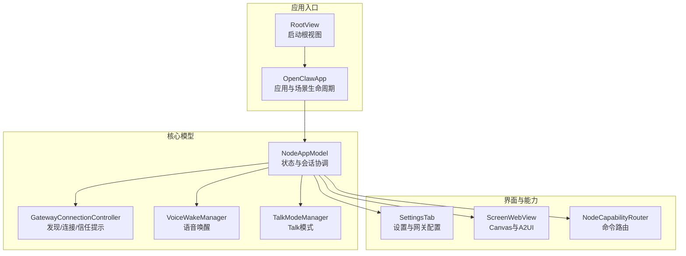
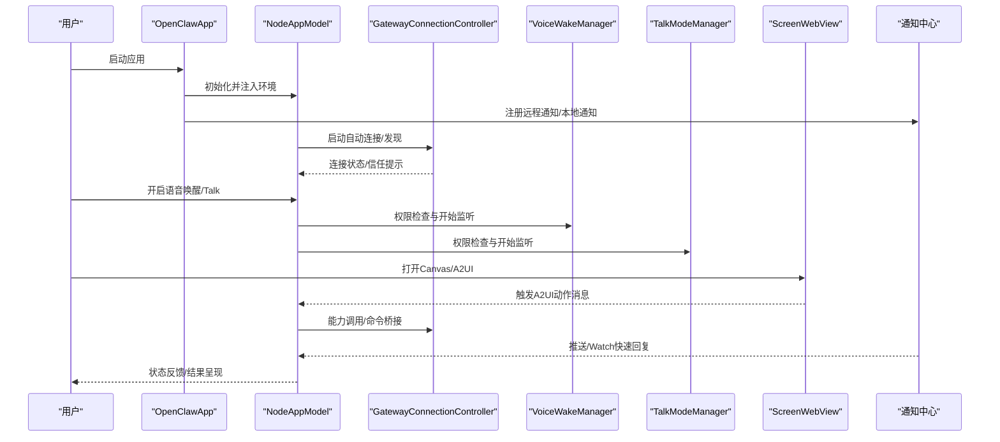
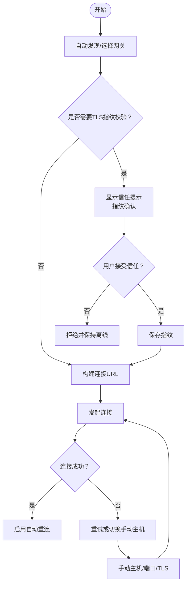
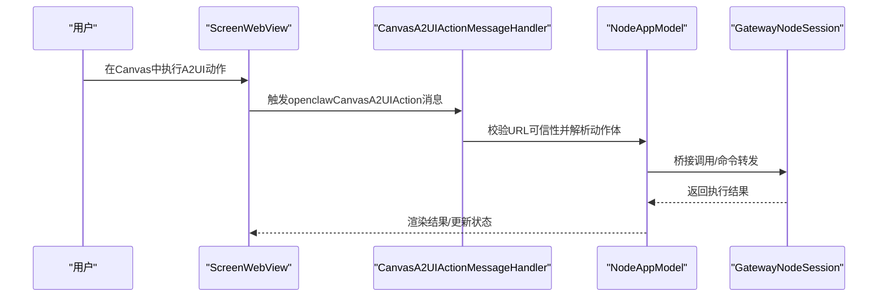
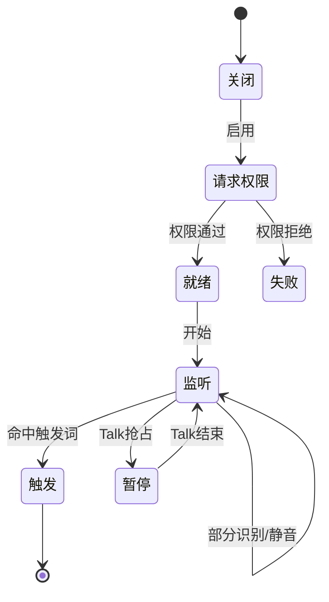
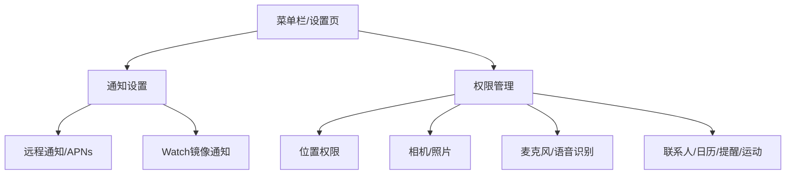
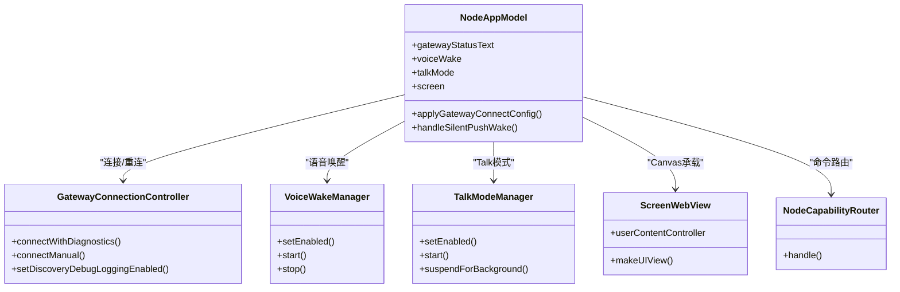

# iOS应用使用

<cite>
**本文引用的文件**
- [OpenClawApp.swift](file://apps/ios/Sources/OpenClawApp.swift)
- [README.md](file://apps/ios/README.md)
- [ScreenWebView.swift](file://apps/ios/Sources/Screen/ScreenWebView.swift)
- [VoiceWakeManager.swift](file://apps/ios/Sources/Voice/VoiceWakeManager.swift)
- [TalkModeManager.swift](file://apps/ios/Sources/Voice/TalkModeManager.swift)
- [GatewayConnectionController.swift](file://apps/ios/Sources/Gateway/GatewayConnectionController.swift)
- [SettingsTab.swift](file://apps/ios/Sources/Settings/SettingsTab.swift)
- [NodeAppModel.swift](file://apps/ios/Sources/Model/NodeAppModel.swift)
- [NodeCapabilityRouter.swift](file://apps/ios/Sources/Capabilities/NodeCapabilityRouter.swift)
- [RootView.swift](file://apps/ios/Sources/RootView.swift)
</cite>

## 目录

1. [简介](#简介)
2. [项目结构](#项目结构)
3. [核心组件](#核心组件)
4. [架构总览](#架构总览)
5. [详细组件分析](#详细组件分析)
6. [依赖关系分析](#依赖关系分析)
7. [性能与后台行为](#性能与后台行为)
8. [故障排查指南](#故障排查指南)
9. [结论](#结论)
10. [附录：使用步骤与操作清单](#附录使用步骤与操作清单)

## 简介

本指南面向在iOS上使用OpenClaw节点应用的用户，帮助您完成设备配对、网络发现与连接、Canvas与A2UI操作、语音唤醒与Talk模式、菜单栏控制、通知与权限管理、后台音频限制等关键使用流程，并提供配对步骤、连接验证方法与常见问题排查建议。应用当前处于超级内测阶段，前台使用最为稳定，后台行为仍在优化中。

## 项目结构

iOS应用位于apps/ios目录，采用SwiftUI与Swift语言开发，核心模块围绕“网关连接”“语音能力”“Canvas与屏幕”“设备能力路由”等展开。应用通过NodeAppModel统一协调各子系统，通过GatewayConnectionController处理Bonjour/Tailnet/手动主机的发现与连接，通过VoiceWakeManager与TalkModeManager实现语音唤醒与对话模式，通过ScreenWebView承载Canvas并注入A2UI交互通道。

图表来源

- [OpenClawApp.swift:492-526](file://apps/ios/Sources/OpenClawApp.swift#L492-L526)
- [NodeAppModel.swift:50-180](file://apps/ios/Sources/Model/NodeAppModel.swift#L50-L180)
- [GatewayConnectionController.swift:20-80](file://apps/ios/Sources/Gateway/GatewayConnectionController.swift#L20-L80)
- [VoiceWakeManager.swift:82-120](file://apps/ios/Sources/Voice/VoiceWakeManager.swift#L82-L120)
- [TalkModeManager.swift:32-60](file://apps/ios/Sources/Voice/TalkModeManager.swift#L32-L60)
- [ScreenWebView.swift:5-30](file://apps/ios/Sources/Screen/ScreenWebView.swift#L5-L30)
- [SettingsTab.swift:9-60](file://apps/ios/Sources/Settings/SettingsTab.swift#L9-L60)
- [NodeCapabilityRouter.swift:4-26](file://apps/ios/Sources/Capabilities/NodeCapabilityRouter.swift#L4-L26)
- [RootView.swift:3-7](file://apps/ios/Sources/RootView.swift#L3-L7)

章节来源

- [OpenClawApp.swift:492-526](file://apps/ios/Sources/OpenClawApp.swift#L492-L526)
- [RootView.swift:3-7](file://apps/ios/Sources/RootView.swift#L3-L7)

## 核心组件

- 应用入口与生命周期：OpenClawApp负责应用初始化、场景切换、远程通知注册与处理、后台刷新任务调度。
- NodeAppModel：统一协调网关会话、语音唤醒、Talk模式、Canvas/屏幕、设备能力路由、通知镜像、Watch快速回复等。
- GatewayConnectionController：负责Bonjour/Tailnet服务发现、SRV/A解析、TLS指纹探测与信任提示、自动重连策略。
- VoiceWakeManager：麦克风与语音识别授权、触发词匹配、暂停/恢复逻辑（与Talk模式互斥）。
- TalkModeManager：连续/按压说话模式、静音检测、增量TTS、与网关聊天发送与结果订阅。
- ScreenWebView：承载Canvas页面、拦截openclaw://深链、注入CanvasA2UI动作消息处理器。
- SettingsTab：设置页，包含配对码连接、自动连接、手动主机、发现日志、Canvas调试开关、设备信息等。
- NodeCapabilityRouter：根据命令名分发到具体能力处理器。

章节来源

- [NodeAppModel.swift:50-180](file://apps/ios/Sources/Model/NodeAppModel.swift#L50-L180)
- [GatewayConnectionController.swift:20-80](file://apps/ios/Sources/Gateway/GatewayConnectionController.swift#L20-L80)
- [VoiceWakeManager.swift:82-120](file://apps/ios/Sources/Voice/VoiceWakeManager.swift#L82-L120)
- [TalkModeManager.swift:32-60](file://apps/ios/Sources/Voice/TalkModeManager.swift#L32-L60)
- [ScreenWebView.swift:5-30](file://apps/ios/Sources/Screen/ScreenWebView.swift#L5-L30)
- [SettingsTab.swift:9-60](file://apps/ios/Sources/Settings/SettingsTab.swift#L9-L60)
- [NodeCapabilityRouter.swift:4-26](file://apps/ios/Sources/Capabilities/NodeCapabilityRouter.swift#L4-L26)

## 架构总览

下图展示iOS节点应用与网关、语音、Canvas、通知等关键子系统的交互关系与数据流。

图表来源

- [OpenClawApp.swift:17-96](file://apps/ios/Sources/OpenClawApp.swift#L17-L96)
- [NodeAppModel.swift:180-210](file://apps/ios/Sources/Model/NodeAppModel.swift#L180-L210)
- [GatewayConnectionController.swift:90-160](file://apps/ios/Sources/Gateway/GatewayConnectionController.swift#L90-L160)
- [VoiceWakeManager.swift:160-220](file://apps/ios/Sources/Voice/VoiceWakeManager.swift#L160-L220)
- [TalkModeManager.swift:166-210](file://apps/ios/Sources/Voice/TalkModeManager.swift#L166-L210)
- [ScreenWebView.swift:172-194](file://apps/ios/Sources/Screen/ScreenWebView.swift#L172-L194)

## 详细组件分析

### 组件A：网关连接与发现（Bonjour/Tailnet/手动主机）

- 发现与连接
  - 自动发现：Bonjour服务解析、SRV/A/AAAA记录解析、Tailnet域名适配。
  - TLS指纹校验：首次连接时探测远端证书指纹，弹出信任提示；后续仅允许已信任指纹的连接。
  - 自动重连：基于用户偏好与上次连接记录进行安全重连（仅对已信任网关）。
- 手动主机
  - 支持指定主机、端口与TLS开关；端口为空时对Tailnet强制443或默认18789。
- 配对与认证
  - 通过设置页输入配对码，应用解析后自动填充主机/端口/TLS与凭据，随后发起连接。
- 连接验证
  - 设置页显示服务器名、远端地址、状态文本；支持复制地址、查看发现日志与调试Canvas状态。

图表来源

- [GatewayConnectionController.swift:90-160](file://apps/ios/Sources/Gateway/GatewayConnectionController.swift#L90-L160)
- [GatewayConnectionController.swift:162-207](file://apps/ios/Sources/Gateway/GatewayConnectionController.swift#L162-L207)
- [GatewayConnectionController.swift:209-218](file://apps/ios/Sources/Gateway/GatewayConnectionController.swift#L209-L218)
- [SettingsTab.swift:61-121](file://apps/ios/Sources/Settings/SettingsTab.swift#L61-L121)

章节来源

- [GatewayConnectionController.swift:90-218](file://apps/ios/Sources/Gateway/GatewayConnectionController.swift#L90-L218)
- [SettingsTab.swift:61-121](file://apps/ios/Sources/Settings/SettingsTab.swift#L61-L121)

### 组件B：Canvas与A2UI（屏幕、导航、JS执行、截图）

- 屏幕承载
  - 使用ScreenWebView承载Canvas页面，配置非持久化WKWebView、全黑背景、禁用透明底。
- 深链与A2UI
  - 拦截openclaw://深链，避免系统默认行为；注入CanvasA2UI动作消息处理器，从Canvas侧触发A2UI动作。
- 安全约束
  - 仅允许受信Canvas UI或本地网络Canvas URL触发A2UI动作，防止跨域风险。
- 截图与调试
  - 设置页可开启Canvas调试状态显示；应用层提供截图能力（由Canvas侧触发并通过网关返回）。

图表来源

- [ScreenWebView.swift:128-170](file://apps/ios/Sources/Screen/ScreenWebView.swift#L128-L170)
- [ScreenWebView.swift:172-194](file://apps/ios/Sources/Screen/ScreenWebView.swift#L172-L194)
- [NodeAppModel.swift:100-108](file://apps/ios/Sources/Model/NodeAppModel.swift#L100-L108)

章节来源

- [ScreenWebView.swift:5-194](file://apps/ios/Sources/Screen/ScreenWebView.swift#L5-L194)
- [NodeAppModel.swift:100-108](file://apps/ios/Sources/Model/NodeAppModel.swift#L100-L108)

### 组件C：语音唤醒与Talk模式

- 语音唤醒（Voice Wake）
  - 权限请求：麦克风与语音识别授权；模拟器不支持。
  - 触发词匹配：基于Swabble的门限与分段匹配；支持暂停（被Talk抢占）。
  - 状态反馈：就绪/监听/暂停/失败等状态文本。
- Talk模式（Talk）
  - 连续/按压说话两种模式；静音窗口检测自动结束；支持增量TTS。
  - 与语音唤醒互斥：Talk运行时暂停唤醒；Talk结束恢复唤醒。
  - 背景限制：后台默认暂停录音，除非显式允许“后台监听”。

图表来源

- [VoiceWakeManager.swift:160-220](file://apps/ios/Sources/Voice/VoiceWakeManager.swift#L160-L220)
- [VoiceWakeManager.swift:146-158](file://apps/ios/Sources/Voice/VoiceWakeManager.swift#L146-L158)
- [TalkModeManager.swift:248-285](file://apps/ios/Sources/Voice/TalkModeManager.swift#L248-L285)

章节来源

- [VoiceWakeManager.swift:82-220](file://apps/ios/Sources/Voice/VoiceWakeManager.swift#L82-L220)
- [TalkModeManager.swift:248-285](file://apps/ios/Sources/Voice/TalkModeManager.swift#L248-L285)

### 组件D：菜单栏控制、通知与权限管理

- 菜单栏控制
  - 主界面包含Canvas、语音、设置等标签页；设置页提供网关连接、自动连接、手动主机、发现日志、Canvas调试等。
- 通知
  - 注册远程通知；支持Watch镜像通知；支持前台/后台推送唤醒；可配置通知类别与动作。
- 权限管理
  - 位置权限：Off/WhileUsing/Always三档；Always用于后台位置事件；变更后需重新注册能力。
  - 相机/麦克风/照片/联系人/日历/提醒事项/运动：通过设置页开关，变更后需刷新网关注册。

图表来源

- [OpenClawApp.swift:17-96](file://apps/ios/Sources/OpenClawApp.swift#L17-L96)
- [OpenClawApp.swift:265-463](file://apps/ios/Sources/OpenClawApp.swift#L265-L463)
- [SettingsTab.swift:252-392](file://apps/ios/Sources/Settings/SettingsTab.swift#L252-L392)

章节来源

- [OpenClawApp.swift:17-96](file://apps/ios/Sources/OpenClawApp.swift#L17-L96)
- [OpenClawApp.swift:265-463](file://apps/ios/Sources/OpenClawApp.swift#L265-L463)
- [SettingsTab.swift:252-392](file://apps/ios/Sources/Settings/SettingsTab.swift#L252-L392)

### 组件E：后台音频限制与唤醒

- 后台限制
  - Talk模式默认在后台暂停；若启用“后台监听”，将消耗更多电量。
  - 语音唤醒在后台可能暂停，以避免资源竞争。
- 唤醒与恢复
  - 支持APNs静默推送唤醒；支持后台刷新任务定时唤醒；支持Watch快速回复镜像。
  - 场景切换（进入后台/回到前台）会触发刷新任务调度与状态恢复。

章节来源

- [OpenClawApp.swift:98-156](file://apps/ios/Sources/OpenClawApp.swift#L98-L156)
- [OpenClawApp.swift:158-262](file://apps/ios/Sources/OpenClawApp.swift#L158-L262)
- [TalkModeManager.swift:248-285](file://apps/ios/Sources/Voice/TalkModeManager.swift#L248-L285)

## 依赖关系分析

- 组件耦合
  - NodeAppModel作为中枢，依赖GatewayConnectionController、VoiceWakeManager、TalkModeManager、ScreenWebView、NodeCapabilityRouter等。
  - ScreenWebView依赖WKWebView与CanvasA2UI动作处理器，与NodeAppModel通过回调交互。
  - SettingsTab与NodeAppModel、GatewayConnectionController双向交互，驱动连接与能力开关。
- 外部集成
  - 语音：AVAudioEngine、SFSpeechRecognizer、SwabbleKit。
  - 网络：Bonjour/NetService、NWEndpoint解析、TLS指纹探测。
  - 系统：通知中心、后台任务、位置服务、相机/相册/联系人/日历/提醒/运动。

图表来源

- [NodeAppModel.swift:50-180](file://apps/ios/Sources/Model/NodeAppModel.swift#L50-L180)
- [GatewayConnectionController.swift:20-80](file://apps/ios/Sources/Gateway/GatewayConnectionController.swift#L20-L80)
- [VoiceWakeManager.swift:82-120](file://apps/ios/Sources/Voice/VoiceWakeManager.swift#L82-L120)
- [TalkModeManager.swift:32-60](file://apps/ios/Sources/Voice/TalkModeManager.swift#L32-L60)
- [ScreenWebView.swift:5-30](file://apps/ios/Sources/Screen/ScreenWebView.swift#L5-L30)
- [NodeCapabilityRouter.swift:4-26](file://apps/ios/Sources/Capabilities/NodeCapabilityRouter.swift#L4-L26)

章节来源

- [NodeAppModel.swift:50-180](file://apps/ios/Sources/Model/NodeAppModel.swift#L50-L180)
- [GatewayConnectionController.swift:20-80](file://apps/ios/Sources/Gateway/GatewayConnectionController.swift#L20-L80)
- [VoiceWakeManager.swift:82-120](file://apps/ios/Sources/Voice/VoiceWakeManager.swift#L82-L120)
- [TalkModeManager.swift:32-60](file://apps/ios/Sources/Voice/TalkModeManager.swift#L32-L60)
- [ScreenWebView.swift:5-30](file://apps/ios/Sources/Screen/ScreenWebView.swift#L5-L30)
- [NodeCapabilityRouter.swift:4-26](file://apps/ios/Sources/Capabilities/NodeCapabilityRouter.swift#L4-L26)

## 性能与后台行为

- 前台优先：当前仅前台使用最可靠，后台存在Socket挂起与重连恢复优化空间。
- 后台命令限制：Canvas、Camera、Screen、Talk在后台受限，建议在前台执行。
- 电池与热管理：后台位置与监听会增加耗电，建议按需开启。
- 重连与唤醒：APNs与后台刷新任务用于恢复连接，避免频繁的人工干预。

## 故障排查指南

- 构建与签名基线
  - 重新生成工程（xcodegen generate），核对团队与Bundle ID。
- 网关状态核对
  - 设置页“网关”区域查看状态、服务器名、远端地址；若显示配对/认证阻塞，先在Telegram执行配对批准。
- 发现不稳定
  - 开启“发现调试日志”，在“发现日志”中查看最近日志条目。
- 手动主机
  - 当Bonjour被阻断时，使用“使用手动网关”，留空端口将按Tailnet/非Tailnet自动选择443或18789。
- Xcode日志过滤
  - 关键子系统：ai.openclaw.ios、GatewayDiag、APNs registration failed。
- 背景期望验证
  - 先在前台复现，再测试后台切回后的重连与状态恢复。

章节来源

- [README.md:156-178](file://apps/ios/README.md#L156-L178)
- [SettingsTab.swift:123-165](file://apps/ios/Sources/Settings/SettingsTab.swift#L123-L165)

## 结论

OpenClaw iOS节点应用提供了从网关发现与连接、Canvas与A2UI、语音唤醒与Talk模式到通知与权限管理的完整体验。当前以内测为主，前台使用最为稳定，后台行为正在持续优化。遵循本文提供的配对与连接步骤、权限与通知设置、后台限制与故障排查建议，可显著提升使用稳定性与效率。

## 附录：使用步骤与操作清单

- 设备配对与连接
  - 在聊天中执行配对命令，复制返回的配对码，在设置页粘贴并连接；随后在聊天中执行批准配对。
  - 若发现不稳定，使用“使用手动网关”并填写主机/端口/TLS，留空端口将按规则自动推断。
- Canvas与A2UI
  - 在Canvas中执行A2UI动作，确保URL可信；如需调试，可在设置中开启Canvas调试状态。
- 语音唤醒与Talk
  - 在设置中启用“语音唤醒”与“Talk模式”，注意Talk运行时会暂停唤醒；后台可选开启“后台监听”但会增加耗电。
- 菜单栏控制与通知
  - 在设置页查看网关状态、自动连接、发现日志、Canvas调试；确保通知授权已开启，以便接收推送与Watch镜像通知。
- 权限管理
  - 位置权限：Off/WhileUsing/Always；Always用于后台位置事件；相机/麦克风/照片/联系人/日历/提醒/运动等可通过设置页开关。
- 连接验证
  - 设置页显示服务器名与远端地址；可复制地址进行进一步验证；若状态异常，先在Telegram批准配对，再重连。
- 常见问题
  - APNs注册失败：检查推送能力与配置文件；查看Xcode日志中的APNs registration failed。
  - 后台无响应：先在前台复现，再测试后台切回；必要时开启后台刷新任务与推送唤醒。

章节来源

- [README.md:98-178](file://apps/ios/README.md#L98-L178)
- [SettingsTab.swift:61-121](file://apps/ios/Sources/Settings/SettingsTab.swift#L61-L121)
- [OpenClawApp.swift:17-96](file://apps/ios/Sources/OpenClawApp.swift#L17-L96)
- [VoiceWakeManager.swift:160-220](file://apps/ios/Sources/Voice/VoiceWakeManager.swift#L160-L220)
- [TalkModeManager.swift:166-210](file://apps/ios/Sources/Voice/TalkModeManager.swift#L166-L210)
- [ScreenWebView.swift:128-170](file://apps/ios/Sources/Screen/ScreenWebView.swift#L128-L170)
