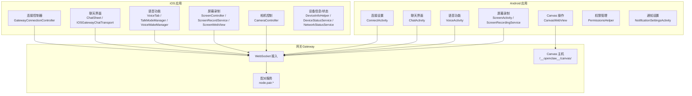
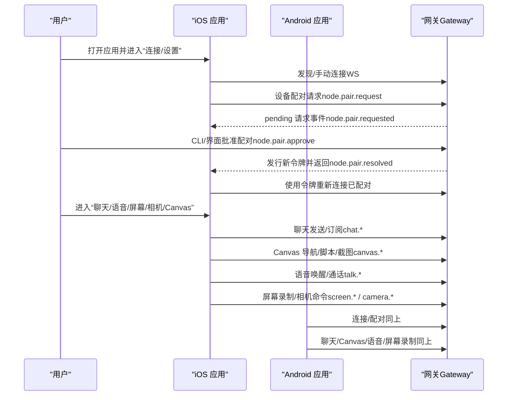
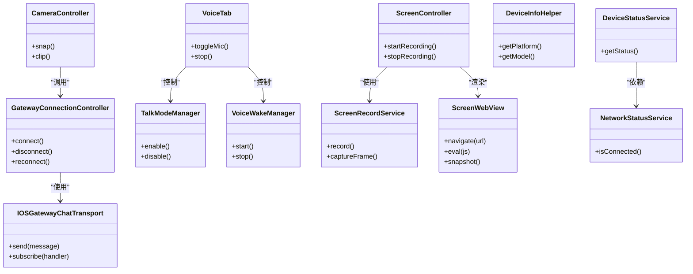
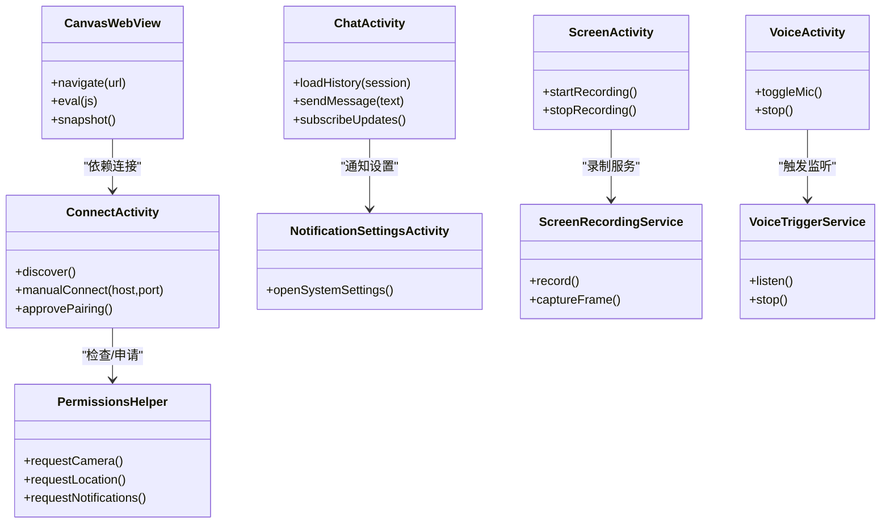
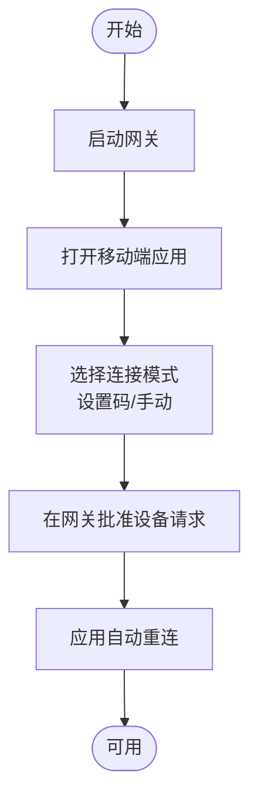
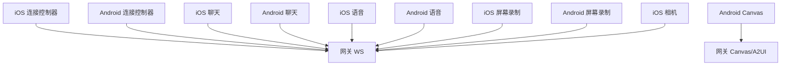

# 移动应用使用

<cite>
**本文引用的文件**
- [apps/ios/README.md](file://apps/ios/README.md)
- [apps/android/README.md](file://apps/android/README.md)
- [docs/platforms/ios.md](file://docs/platforms/ios.md)
- [docs/platforms/android.md](file://docs/platforms/android.md)
- [docs/gateway/pairing.md](file://docs/gateway/pairing.md)
- [docs/nodes/camera.md](file://docs/nodes/camera.md)
- [docs/nodes/audio.md](file://docs/nodes/audio.md)
- [skills/canvas/SKILL.md](file://skills/canvas/SKILL.md)
- [apps/ios/Sources/Chat/ChatSheet.swift](file://apps/ios/Sources/Chat/ChatSheet.swift)
- [apps/ios/Sources/Chat/IOSGatewayChatTransport.swift](file://apps/ios/Sources/Chat/IOSGatewayChatTransport.swift)
- [apps/ios/Sources/Voice/VoiceTab.swift](file://apps/ios/Sources/Voice/VoiceTab.swift)
- [apps/ios/Sources/Voice/TalkModeManager.swift](file://apps/ios/Sources/Voice/TalkModeManager.swift)
- [apps/ios/Sources/Voice/VoiceWakeManager.swift](file://apps/ios/Sources/Voice/VoiceWakeManager.swift)
- [apps/ios/Sources/Screen/ScreenController.swift](file://apps/ios/Sources/Screen/ScreenController.swift)
- [apps/ios/Sources/Screen/ScreenRecordService.swift](file://apps/ios/Sources/Screen/ScreenRecordService.swift)
- [apps/ios/Sources/Screen/ScreenTab.swift](file://apps/ios/Sources/Screen/ScreenTab.swift)
- [apps/ios/Sources/Screen/ScreenWebView.swift](file://apps/ios/Sources/Screen/ScreenWebView.swift)
- [apps/ios/Sources/Camera/CameraController.swift](file://apps/ios/Sources/Camera/CameraController.swift)
- [apps/ios/Sources/Device/DeviceInfoHelper.swift](file://apps/ios/Sources/Device/DeviceInfoHelper.swift)
- [apps/ios/Sources/Device/DeviceStatusService.swift](file://apps/ios/Sources/Device/DeviceStatusService.swift)
- [apps/ios/Sources/Device/NetworkStatusService.swift](file://apps/ios/Sources/Device/NetworkStatusService.swift)
- [apps/ios/Sources/Gateway/GatewayConnectConfig.swift](file://apps/ios/Sources/Gateway/GatewayConnectConfig.swift)
- [apps/ios/Sources/Gateway/GatewayConnectionController.swift](file://apps/ios/Sources/Gateway/GatewayConnectionController.swift)
- [apps/ios/Sources/Gateway/GatewayDiscoveryModel.swift](file://apps/ios/Sources/Gateway/GatewayDiscoveryModel.swift)
- [apps/ios/Sources/Gateway/GatewayHealthMonitor.swift](file://apps/ios/Sources/Gateway/GatewayHealthMonitor.swift)
- [apps/ios/Sources/Gateway/GatewayQuickSetupSheet.swift](file://apps/ios/Sources/Gateway/GatewayQuickSetupSheet.swift)
- [apps/ios/Sources/Gateway/GatewayServiceResolver.swift](file://apps/ios/Sources/Gateway/GatewayServiceResolver.swift)
- [apps/ios/Sources/Gateway/GatewayDiscoveryDebugLogView.swift](file://apps/ios/Sources/Gateway/GatewayDiscoveryDebugLogView.swift)
- [apps/ios/Sources/Gateway/GatewayConnectionIssue.swift](file://apps/ios/Sources/Gateway/GatewayConnectionIssue.swift)
- [apps/ios/Sources/Calendar/CalendarService.swift](file://apps/ios/Sources/Calendar/CalendarService.swift)
- [apps/ios/Sources/Contacts/ContactsService.swift](file://apps/ios/Sources/Contacts/ContactsService.swift)
- [apps/ios/Sources/EventKit/EventKitAuthorization.swift](file://apps/ios/Sources/EventKit/EventKitAuthorization.swift)
- [apps/ios/Sources/Device/NodeDisplayName.swift](file://apps/ios/Sources/Device/NodeDisplayName.swift)
- [apps/android/app/src/main/java/.../ConnectActivity.kt](file://apps/android/app/src/main/java/.../ConnectActivity.kt)
- [apps/android/app/src/main/java/.../ChatActivity.kt](file://apps/android/app/src/main/java/.../ChatActivity.kt)
- [apps/android/app/src/main/java/.../VoiceActivity.kt](file://apps/android/app/src/main/java/.../VoiceActivity.kt)
- [apps/android/app/src/main/java/.../ScreenActivity.kt](file://apps/android/app/src/main/java/.../ScreenActivity.kt)
- [apps/android/app/src/main/java/.../CanvasWebView.kt](file://apps/android/app/src/main/java/.../CanvasWebView.kt)
- [apps/android/app/src/main/java/.../PermissionsHelper.kt](file://apps/android/app/src/main/java/.../PermissionsHelper.kt)
- [apps/android/app/src/main/java/.../NotificationSettingsActivity.kt](file://apps/android/app/src/main/java/.../NotificationSettingsActivity.kt)
- [apps/android/app/src/main/java/.../ScreenRecordingService.kt](file://apps/android/app/src/main/java/.../ScreenRecordingService.kt)
- [apps/android/app/src/main/java/.../VoiceTriggerService.kt](file://apps/android/app/src/main/java/.../VoiceTriggerService.kt)
</cite>

## 目录

1. [简介](#简介)
2. [项目结构](#项目结构)
3. [核心组件](#核心组件)
4. [架构总览](#架构总览)
5. [详细组件分析](#详细组件分析)
6. [依赖关系分析](#依赖关系分析)
7. [性能考虑](#性能考虑)
8. [故障排查指南](#故障排查指南)
9. [结论](#结论)
10. [附录](#附录)

## 简介

本指南面向在移动设备（iOS 和 Android）上使用 OpenClaw 的用户与运维人员，帮助您完成设备配对、节点连接、聊天界面、语音功能与 Canvas 操作，并提供 iOS 的菜单栏控制、通知设置与权限管理，以及 Android 的连接设置、语音触发与屏幕录制功能说明。文档同时覆盖常见问题与性能优化建议，确保您能在移动端获得完整的 OpenClaw 体验。

## 项目结构

OpenClaw 移动端由 iOS 与 Android 应用组成，二者均通过网关（Gateway）进行连接与配对，支持聊天、Canvas 展示、相机拍摄、屏幕录制、语音唤醒与通话等能力。下图展示了移动端与网关之间的交互关系：

图表来源

- [apps/ios/Sources/Gateway/GatewayConnectionController.swift](file://apps/ios/Sources/Gateway/GatewayConnectionController.swift)
- [apps/ios/Sources/Chat/ChatSheet.swift](file://apps/ios/Sources/Chat/ChatSheet.swift)
- [apps/ios/Sources/Chat/IOSGatewayChatTransport.swift](file://apps/ios/Sources/Chat/IOSGatewayChatTransport.swift)
- [apps/ios/Sources/Voice/VoiceTab.swift](file://apps/ios/Sources/Voice/VoiceTab.swift)
- [apps/ios/Sources/Voice/TalkModeManager.swift](file://apps/ios/Sources/Voice/TalkModeManager.swift)
- [apps/ios/Sources/Voice/VoiceWakeManager.swift](file://apps/ios/Sources/Voice/VoiceWakeManager.swift)
- [apps/ios/Sources/Screen/ScreenController.swift](file://apps/ios/Sources/Screen/ScreenController.swift)
- [apps/ios/Sources/Screen/ScreenRecordService.swift](file://apps/ios/Sources/Screen/ScreenRecordService.swift)
- [apps/ios/Sources/Screen/ScreenWebView.swift](file://apps/ios/Sources/Screen/ScreenWebView.swift)
- [apps/ios/Sources/Camera/CameraController.swift](file://apps/ios/Sources/Camera/CameraController.swift)
- [apps/ios/Sources/Device/DeviceInfoHelper.swift](file://apps/ios/Sources/Device/DeviceInfoHelper.swift)
- [apps/ios/Sources/Device/DeviceStatusService.swift](file://apps/ios/Sources/Device/DeviceStatusService.swift)
- [apps/ios/Sources/Device/NetworkStatusService.swift](file://apps/ios/Sources/Device/NetworkStatusService.swift)
- [apps/android/app/src/main/java/.../ConnectActivity.kt](file://apps/android/app/src/main/java/.../ConnectActivity.kt)
- [apps/android/app/src/main/java/.../ChatActivity.kt](file://apps/android/app/src/main/java/.../ChatActivity.kt)
- [apps/android/app/src/main/java/.../VoiceActivity.kt](file://apps/android/app/src/main/java/.../VoiceActivity.kt)
- [apps/android/app/src/main/java/.../ScreenActivity.kt](file://apps/android/app/src/main/java/.../ScreenActivity.kt)
- [apps/android/app/src/main/java/.../CanvasWebView.kt](file://apps/android/app/src/main/java/.../CanvasWebView.kt)
- [apps/android/app/src/main/java/.../PermissionsHelper.kt](file://apps/android/app/src/main/java/.../PermissionsHelper.kt)
- [apps/android/app/src/main/java/.../NotificationSettingsActivity.kt](file://apps/android/app/src/main/java/.../NotificationSettingsActivity.kt)
- [apps/android/app/src/main/java/.../ScreenRecordingService.kt](file://apps/android/app/src/main/java/.../ScreenRecordingService.kt)
- [apps/android/app/src/main/java/.../VoiceTriggerService.kt](file://apps/android/app/src/main/java/.../VoiceTriggerService.kt)

章节来源

- [apps/ios/README.md:18-48](file://apps/ios/README.md#L18-L48)
- [apps/android/README.md:22-46](file://apps/android/README.md#L22-L46)
- [docs/platforms/ios.md:28-50](file://docs/platforms/ios.md#L28-L50)
- [docs/platforms/android.md:24-112](file://docs/platforms/android.md#L24-L112)

## 核心组件

- 设备配对与连接：iOS 与 Android 均通过网关进行设备配对（role: node），并支持自动发现或手动输入主机/端口。
- 聊天界面：iOS 使用内置聊天视图与网关传输层；Android 提供聊天会话选择与历史读取。
- 语音功能：iOS 支持语音唤醒与通话模式；Android 提供语音开关与转写/播放。
- Canvas 操作：iOS 与 Android 均可加载网关提供的 Canvas/A2UI 内容，支持导航、脚本执行与截图。
- 屏幕录制：iOS 与 Android 均支持屏幕录制（Android 需要交互式授权）。
- 相机控制：iOS/Android 均支持拍照与短视频录制（Android 需要相机/录音权限）。
- 权限与通知：Android 明确列出权限与通知要求；iOS 在后台行为与权限方面有严格限制。

章节来源

- [apps/ios/README.md:98-104](file://apps/ios/README.md#L98-L104)
- [apps/android/README.md:165-174](file://apps/android/README.md#L165-L174)
- [docs/platforms/ios.md:14-18](file://docs/platforms/ios.md#L14-L18)
- [docs/platforms/android.md:121-165](file://docs/platforms/android.md#L121-L165)

## 架构总览

下图展示从移动端到网关的关键交互路径，包括配对、发现、聊天、Canvas 与语音等模块：

图表来源

- [docs/gateway/pairing.md:27-62](file://docs/gateway/pairing.md#L27-L62)
- [apps/ios/Sources/Gateway/GatewayConnectionController.swift](file://apps/ios/Sources/Gateway/GatewayConnectionController.swift)
- [apps/ios/Sources/Chat/IOSGatewayChatTransport.swift](file://apps/ios/Sources/Chat/IOSGatewayChatTransport.swift)
- [apps/ios/Sources/Voice/TalkModeManager.swift](file://apps/ios/Sources/Voice/TalkModeManager.swift)
- [apps/ios/Sources/Screen/ScreenRecordService.swift](file://apps/ios/Sources/Screen/ScreenRecordService.swift)
- [apps/ios/Sources/Camera/CameraController.swift](file://apps/ios/Sources/Camera/CameraController.swift)
- [apps/android/app/src/main/java/.../ConnectActivity.kt](file://apps/android/app/src/main/java/.../ConnectActivity.kt)
- [apps/android/app/src/main/java/.../ChatActivity.kt](file://apps/android/app/src/main/java/.../ChatActivity.kt)
- [apps/android/app/src/main/java/.../VoiceActivity.kt](file://apps/android/app/src/main/java/.../VoiceActivity.kt)
- [apps/android/app/src/main/java/.../ScreenActivity.kt](file://apps/android/app/src/main/java/.../ScreenActivity.kt)
- [apps/android/app/src/main/java/.../CanvasWebView.kt](file://apps/android/app/src/main/java/.../CanvasWebView.kt)

## 详细组件分析

### iOS 应用使用指南

- 分发与部署
  - 支持本地 Xcode 构建与 Fastlane 测试版分发；调试构建注册 APNs sandbox，发布构建使用生产环境。
- 连接与配对
  - 支持 Bonjour/LAN、跨网络 Tailscale 与手动主机/端口；首次配对需在网关侧批准。
- 聊天界面
  - 通过聊天视图与网关传输层进行消息收发与订阅。
- 语音功能
  - 语音唤醒与通话模式在设置中启用；后台音频受限，前台使用更可靠。
- Canvas 操作
  - 通过网关 Canvas/A2UI 主机加载内容，支持导航、脚本执行与截图。
- 屏幕录制
  - 支持屏幕录制，需前台运行。
- 相机控制
  - 支持拍照与短视频录制，需前台运行。
- 权限与通知
  - 后台位置需要“始终允许”；后台命令受限；APNs 注册需正确签名与推送能力配置。

章节来源

- [apps/ios/README.md:50-87](file://apps/ios/README.md#L50-L87)
- [apps/ios/README.md:89-96](file://apps/ios/README.md#L89-L96)
- [apps/ios/README.md:98-104](file://apps/ios/README.md#L98-L104)
- [apps/ios/README.md:106-136](file://apps/ios/README.md#L106-L136)
- [apps/ios/README.md:137-146](file://apps/ios/README.md#L137-L146)
- [apps/ios/README.md:156-178](file://apps/ios/README.md#L156-L178)
- [docs/platforms/ios.md:28-50](file://docs/platforms/ios.md#L28-L50)
- [docs/platforms/ios.md:67-91](file://docs/platforms/ios.md#L67-L91)
- [docs/platforms/ios.md:92-96](file://docs/platforms/ios.md#L92-L96)
- [docs/platforms/ios.md:97-103](file://docs/platforms/ios.md#L97-L103)

#### iOS 类关系图（代码级）

图表来源

- [apps/ios/Sources/Gateway/GatewayConnectionController.swift](file://apps/ios/Sources/Gateway/GatewayConnectionController.swift)
- [apps/ios/Sources/Chat/IOSGatewayChatTransport.swift](file://apps/ios/Sources/Chat/IOSGatewayChatTransport.swift)
- [apps/ios/Sources/Voice/VoiceTab.swift](file://apps/ios/Sources/Voice/VoiceTab.swift)
- [apps/ios/Sources/Voice/TalkModeManager.swift](file://apps/ios/Sources/Voice/TalkModeManager.swift)
- [apps/ios/Sources/Voice/VoiceWakeManager.swift](file://apps/ios/Sources/Voice/VoiceWakeManager.swift)
- [apps/ios/Sources/Screen/ScreenController.swift](file://apps/ios/Sources/Screen/ScreenController.swift)
- [apps/ios/Sources/Screen/ScreenRecordService.swift](file://apps/ios/Sources/Screen/ScreenRecordService.swift)
- [apps/ios/Sources/Screen/ScreenWebView.swift](file://apps/ios/Sources/Screen/ScreenWebView.swift)
- [apps/ios/Sources/Camera/CameraController.swift](file://apps/ios/Sources/Camera/CameraController.swift)
- [apps/ios/Sources/Device/DeviceInfoHelper.swift](file://apps/ios/Sources/Device/DeviceInfoHelper.swift)
- [apps/ios/Sources/Device/DeviceStatusService.swift](file://apps/ios/Sources/Device/DeviceStatusService.swift)
- [apps/ios/Sources/Device/NetworkStatusService.swift](file://apps/ios/Sources/Device/NetworkStatusService.swift)

### Android 应用使用指南

- 连接与配对
  - 支持“设置码”与“手动”两种连接方式；首次配对需在网关侧批准。
- 聊天界面
  - 支持会话选择与历史读取，消息推送为尽力而为。
- Canvas 操作
  - 通过网关 Canvas/A2UI 主机加载内容，支持导航、脚本执行与截图。
- 语音功能
  - 单一麦克风开关，支持转写与 TTS 回放；后台停止。
- 屏幕录制
  - 需要交互式授权，后台不可用。
- 权限管理
  - 列举了发现、通知、相机/录音等权限需求；缺失时会提示授权。

章节来源

- [apps/android/README.md:143-163](file://apps/android/README.md#L143-L163)
- [apps/android/README.md:165-174](file://apps/android/README.md#L165-L174)
- [apps/android/README.md:175-200](file://apps/android/README.md#L175-L200)
- [docs/platforms/android.md:73-112](file://docs/platforms/android.md#L73-L112)
- [docs/platforms/android.md:113-165](file://docs/platforms/android.md#L113-L165)

#### Android 类关系图（代码级）

图表来源

- [apps/android/app/src/main/java/.../ConnectActivity.kt](file://apps/android/app/src/main/java/.../ConnectActivity.kt)
- [apps/android/app/src/main/java/.../ChatActivity.kt](file://apps/android/app/src/main/java/.../ChatActivity.kt)
- [apps/android/app/src/main/java/.../VoiceActivity.kt](file://apps/android/app/src/main/java/.../VoiceActivity.kt)
- [apps/android/app/src/main/java/.../ScreenActivity.kt](file://apps/android/app/src/main/java/.../ScreenActivity.kt)
- [apps/android/app/src/main/java/.../CanvasWebView.kt](file://apps/android/app/src/main/java/.../CanvasWebView.kt)
- [apps/android/app/src/main/java/.../PermissionsHelper.kt](file://apps/android/app/src/main/java/.../PermissionsHelper.kt)
- [apps/android/app/src/main/java/.../NotificationSettingsActivity.kt](file://apps/android/app/src/main/java/.../NotificationSettingsActivity.kt)
- [apps/android/app/src/main/java/.../ScreenRecordingService.kt](file://apps/android/app/src/main/java/.../ScreenRecordingService.kt)
- [apps/android/app/src/main/java/.../VoiceTriggerService.kt](file://apps/android/app/src/main/java/.../VoiceTriggerService.kt)

### 设备配对流程（iOS 与 Android）

- 步骤概览
  - 启动网关并在移动端打开“连接/设置”。
  - 选择“设置码”或“手动”模式，按提示完成配对。
  - 在网关侧批准设备请求后，应用自动重连。
- 错误处理
  - 若未显示配对提示，可在网关侧查看待批准列表并手动批准。
  - 重新安装后需重新配对。

图表来源

- [docs/platforms/ios.md:28-50](file://docs/platforms/ios.md#L28-L50)
- [docs/platforms/android.md:73-112](file://docs/platforms/android.md#L73-L112)
- [docs/gateway/pairing.md:37-45](file://docs/gateway/pairing.md#L37-L45)

章节来源

- [apps/ios/README.md:100-101](file://apps/ios/README.md#L100-L101)
- [apps/android/README.md:151-162](file://apps/android/README.md#L151-L162)
- [docs/gateway/pairing.md:27-62](file://docs/gateway/pairing.md#L27-L62)

### 聊天界面使用

- iOS
  - 通过聊天视图与网关传输层进行消息收发与订阅。
- Android
  - 支持会话选择与历史读取，消息推送为尽力而为。

章节来源

- [apps/ios/Sources/Chat/ChatSheet.swift](file://apps/ios/Sources/Chat/ChatSheet.swift)
- [apps/ios/Sources/Chat/IOSGatewayChatTransport.swift](file://apps/ios/Sources/Chat/IOSGatewayChatTransport.swift)
- [apps/android/app/src/main/java/.../ChatActivity.kt](file://apps/android/app/src/main/java/.../ChatActivity.kt)
- [docs/platforms/android.md:113-120](file://docs/platforms/android.md#L113-L120)

### 语音功能使用

- iOS
  - 设置中启用语音唤醒与通话模式；后台音频受限，前台使用更稳定。
- Android
  - 语音标签页提供单一麦克风开关，支持转写与 TTS 回放；后台停止。

章节来源

- [apps/ios/Sources/Voice/VoiceTab.swift](file://apps/ios/Sources/Voice/VoiceTab.swift)
- [apps/ios/Sources/Voice/TalkModeManager.swift](file://apps/ios/Sources/Voice/TalkModeManager.swift)
- [apps/ios/Sources/Voice/VoiceWakeManager.swift](file://apps/ios/Sources/Voice/VoiceWakeManager.swift)
- [apps/android/app/src/main/java/.../VoiceActivity.kt](file://apps/android/app/src/main/java/.../VoiceActivity.kt)
- [docs/nodes/audio.md:10-20](file://docs/nodes/audio.md#L10-L20)

### Canvas 操作使用

- iOS/Android
  - 通过网关 Canvas/A2UI 主机加载内容，支持导航、脚本执行与截图。
  - 前台运行以避免后台不可用错误。

章节来源

- [skills/canvas/SKILL.md:48-57](file://skills/canvas/SKILL.md#L48-L57)
- [docs/platforms/ios.md:67-91](file://docs/platforms/ios.md#L67-L91)
- [docs/platforms/android.md:121-146](file://docs/platforms/android.md#L121-L146)

### 屏幕录制使用

- iOS/Android
  - 支持屏幕录制；Android 需要交互式授权，后台不可用。

章节来源

- [apps/ios/Sources/Screen/ScreenRecordService.swift](file://apps/ios/Sources/Screen/ScreenRecordService.swift)
- [apps/ios/Sources/Screen/ScreenController.swift](file://apps/ios/Sources/Screen/ScreenController.swift)
- [apps/android/app/src/main/java/.../ScreenRecordingService.kt](file://apps/android/app/src/main/java/.../ScreenRecordingService.kt)
- [apps/android/app/src/main/java/.../ScreenActivity.kt](file://apps/android/app/src/main/java/.../ScreenActivity.kt)

### 相机控制使用

- iOS/Android
  - 支持拍照与短视频录制；Android 需要相机/录音权限；前台运行以避免后台不可用错误。

章节来源

- [docs/nodes/camera.md:19-63](file://docs/nodes/camera.md#L19-L63)
- [docs/nodes/camera.md:82-102](file://docs/nodes/camera.md#L82-L102)
- [apps/ios/Sources/Camera/CameraController.swift](file://apps/ios/Sources/Camera/CameraController.swift)
- [apps/android/app/src/main/java/.../PermissionsHelper.kt](file://apps/android/app/src/main/java/.../PermissionsHelper.kt)

### iOS 菜单栏控制、通知设置与权限管理

- 菜单栏控制
  - iOS 应用通过系统菜单与设置项进行控制（如相机、位置、通知等）。
- 通知设置
  - 调试构建注册 APNs sandbox，发布构建使用生产；若推送失败，检查签名与推送能力。
- 权限管理
  - 后台位置需要“始终允许”；后台命令受限；相机/屏幕录制需前台运行。

章节来源

- [apps/ios/README.md:89-96](file://apps/ios/README.md#L89-L96)
- [apps/ios/README.md:106-136](file://apps/ios/README.md#L106-L136)
- [apps/ios/README.md:137-146](file://apps/ios/README.md#L137-L146)

### Android 连接设置、语音触发与屏幕录制

- 连接设置
  - 支持“设置码”与“手动”两种连接方式；首次配对需在网关批准。
- 语音触发
  - 语音标签页提供单一麦克风开关，支持转写与 TTS 回放。
- 屏幕录制
  - 需要交互式授权，后台不可用。

章节来源

- [apps/android/README.md:143-163](file://apps/android/README.md#L143-L163)
- [apps/android/app/src/main/java/.../VoiceTriggerService.kt](file://apps/android/app/src/main/java/.../VoiceTriggerService.kt)
- [apps/android/app/src/main/java/.../ScreenRecordingService.kt](file://apps/android/app/src/main/java/.../ScreenRecordingService.kt)

## 依赖关系分析

- 组件耦合
  - iOS/Android 的连接控制器依赖网关的 WebSocket 与配对服务；聊天、语音、屏幕录制与 Canvas 模块均通过网关协议进行调用。
- 外部依赖
  - iOS 需要正确的签名与推送能力；Android 需要权限与通知设置；Canvas/A2UI 依赖网关的 HTTP 服务。
- 循环依赖
  - 无明显循环依赖；各模块通过网关作为统一入口。

图表来源

- [apps/ios/Sources/Gateway/GatewayConnectionController.swift](file://apps/ios/Sources/Gateway/GatewayConnectionController.swift)
- [apps/android/app/src/main/java/.../ConnectActivity.kt](file://apps/android/app/src/main/java/.../ConnectActivity.kt)
- [apps/ios/Sources/Chat/IOSGatewayChatTransport.swift](file://apps/ios/Sources/Chat/IOSGatewayChatTransport.swift)
- [apps/android/app/src/main/java/.../ChatActivity.kt](file://apps/android/app/src/main/java/.../ChatActivity.kt)
- [apps/ios/Sources/Voice/TalkModeManager.swift](file://apps/ios/Sources/Voice/TalkModeManager.swift)
- [apps/android/app/src/main/java/.../VoiceActivity.kt](file://apps/android/app/src/main/java/.../VoiceActivity.kt)
- [apps/ios/Sources/Screen/ScreenRecordService.swift](file://apps/ios/Sources/Screen/ScreenRecordService.swift)
- [apps/android/app/src/main/java/.../ScreenActivity.kt](file://apps/android/app/src/main/java/.../ScreenActivity.kt)
- [apps/ios/Sources/Camera/CameraController.swift](file://apps/ios/Sources/Camera/CameraController.swift)
- [apps/android/app/src/main/java/.../CanvasWebView.kt](file://apps/android/app/src/main/java/.../CanvasWebView.kt)

## 性能考虑

- 前台优先：iOS/Android 均建议在前台使用相机、屏幕录制与 Canvas 等高负载功能，以避免后台限制导致的失败或性能退化。
- 网络路径：优先使用局域网或 Tailscale 以减少延迟；必要时使用手动主机/端口。
- 权限与通知：提前授予所需权限与通知，避免运行时弹窗打断流程。
- Canvas 加载：使用网关 Canvas/A2UI 主机时，注意 URL 与绑定模式匹配，避免白屏或无法加载。

## 故障排查指南

- 配对相关
  - 若未显示配对提示，检查网关侧待批准列表并手动批准；重新安装后需重新配对。
- 连接相关
  - 若发现不稳定，尝试切换到手动主机/端口；检查网关日志与诊断输出。
- iOS 特有问题
  - 后台命令受限；APNs 注册失败请检查签名与推送能力；后台位置需“始终允许”。
- Android 特有问题
  - 权限缺失会导致命令失败；屏幕录制需交互式授权；Canvas 不可达时保持前台并重试。

章节来源

- [apps/ios/README.md:137-146](file://apps/ios/README.md#L137-L146)
- [apps/ios/README.md:156-178](file://apps/ios/README.md#L156-L178)
- [apps/android/README.md:216-224](file://apps/android/README.md#L216-L224)
- [docs/platforms/ios.md:97-103](file://docs/platforms/ios.md#L97-L103)

## 结论

通过本文档，您可以在 iOS 与 Android 上完成 OpenClaw 的设备配对与连接，并熟练使用聊天、语音、Canvas、屏幕录制与相机等功能。建议优先在前台使用高负载功能，提前配置好权限与通知，并根据网络条件选择合适的连接路径。遇到问题时，可参考故障排查章节与相关文档链接进行定位与修复。

## 附录

- 相关文档链接
  - iOS 平台说明：[iOS App:10-109](file://docs/platforms/ios.md#L10-L109)
  - Android 平台说明：[Android App:10-165](file://docs/platforms/android.md#L10-L165)
  - 设备配对说明：[Gateway Owned Pairing:10-100](file://docs/gateway/pairing.md#L10-L100)
  - 相机节点说明：[Camera Capture:9-163](file://docs/nodes/camera.md#L9-L163)
  - Canvas 技能说明：[Canvas Skill:1-199](file://skills/canvas/SKILL.md#L1-L199)
