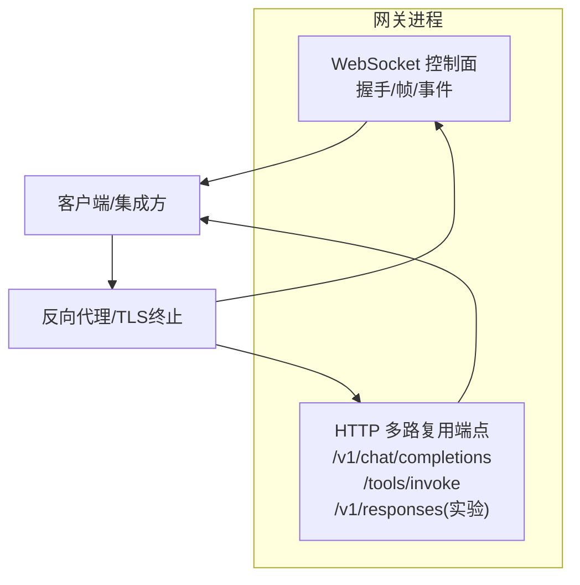
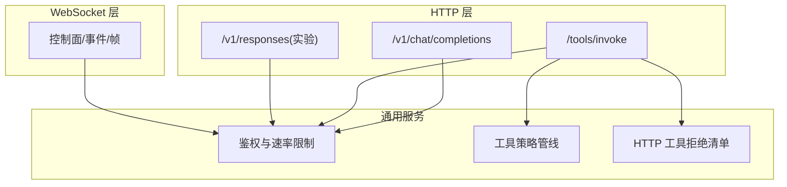
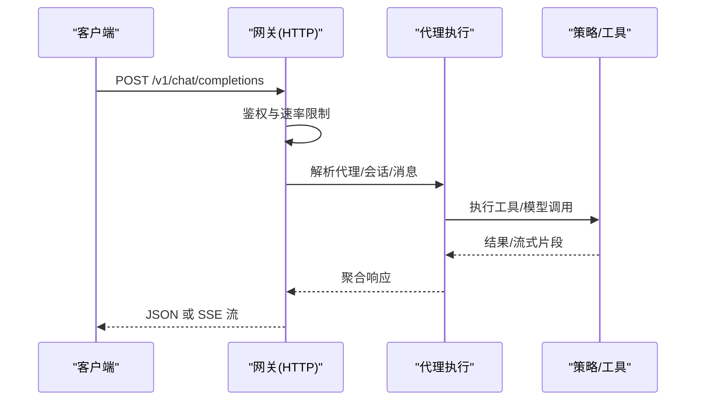
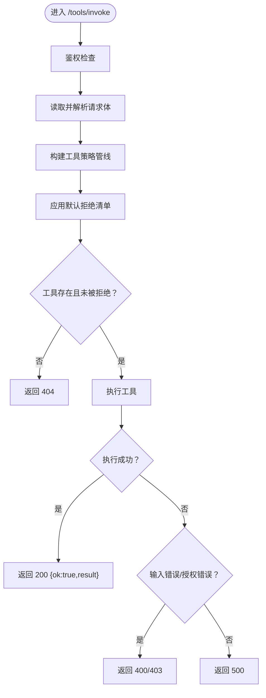
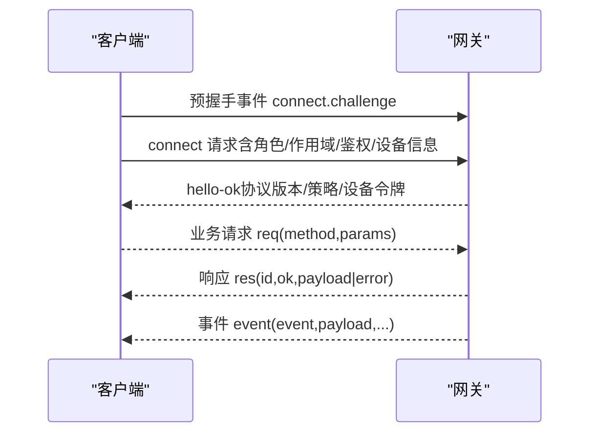
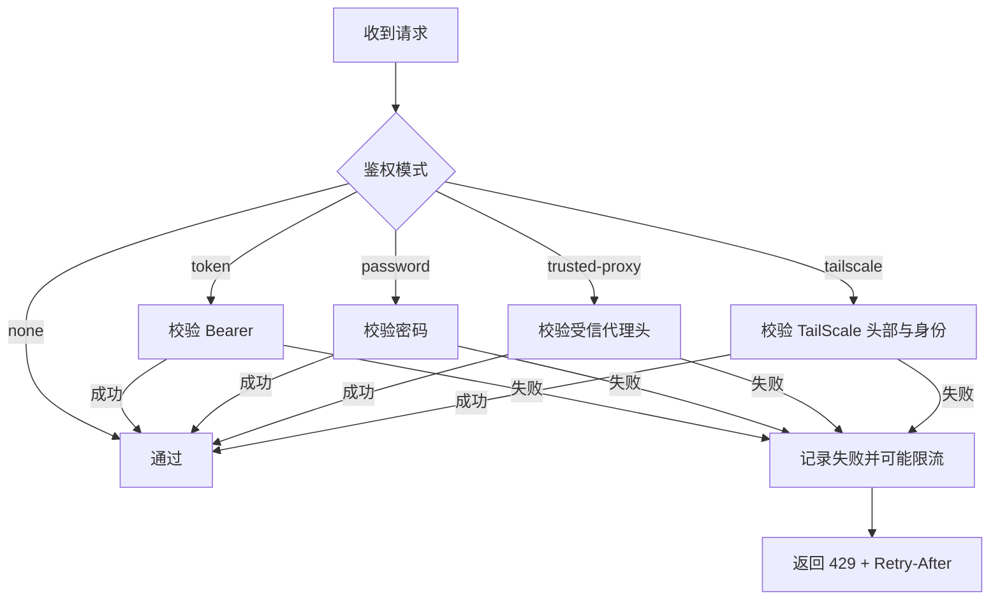
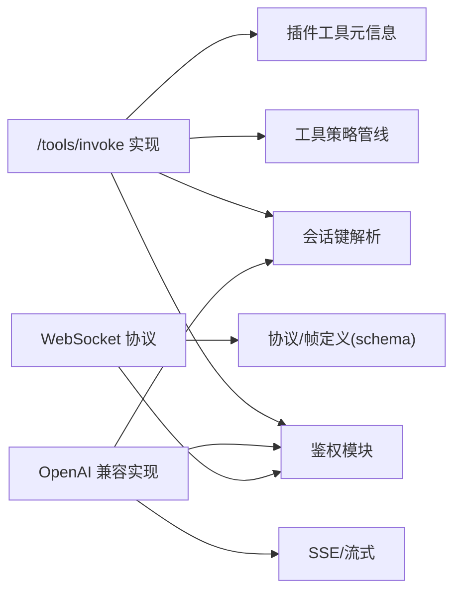

# API接口

<cite>
**本文引用的文件**
- [docs/gateway/index.md](file://docs/gateway/index.md)
- [docs/gateway/openai-http-api.md](file://docs/gateway/openai-http-api.md)
- [docs/gateway/tools-invoke-http-api.md](file://docs/gateway/tools-invoke-http-api.md)
- [docs/gateway/protocol.md](file://docs/gateway/protocol.md)
- [src/gateway/tools-invoke-http.ts](file://src/gateway/tools-invoke-http.ts)
- [src/gateway/openai-http.ts](file://src/gateway/openai-http.ts)
- [src/gateway/auth.ts](file://src/gateway/auth.ts)
- [src/gateway/http-common.ts](file://src/gateway/http-common.ts)
- [src/gateway/http-utils.ts](file://src/gateway/http-utils.ts)
- [src/gateway/protocol/schema.ts](file://src/gateway/protocol/schema.ts)
</cite>

## 目录

1. [简介](#简介)
2. [项目结构](#项目结构)
3. [核心组件](#核心组件)
4. [架构总览](#架构总览)
5. [详细组件分析](#详细组件分析)
6. [依赖关系分析](#依赖关系分析)
7. [性能考量](#性能考量)
8. [故障排查指南](#故障排查指南)
9. [结论](#结论)
10. [附录](#附录)

## 简介

本文件面向集成开发者与平台工程师，系统化梳理 OpenClaw 网关提供的 API 接口体系，覆盖：

- HTTP REST API：OpenAI 兼容聊天补全端点、通用工具调用端点、Responses 兼容端点（实验性）
- WebSocket 控制面协议：握手、帧格式、权限与作用域、设备身份与配对、版本与安全
- 插件与工具链：工具策略管线、HTTP 工具调用的策略与拒绝清单
- 错误码与鉴权：统一的鉴权与速率限制、错误响应结构
- 集成示例与最佳实践：请求/响应模式、参数校验、安全边界与暴露策略

目标是帮助读者在理解 OpenClaw 网关能力的同时，快速、安全地完成对接与集成。

## 项目结构

OpenClaw 网关在同一端口上复用一个监听器，同时提供：

- WebSocket 控制面与节点通道
- HTTP REST API（OpenAI 兼容、工具调用、Responses 兼容等）

图示来源

- [docs/gateway/index.md:70-76](file://docs/gateway/index.md#L70-L76)

章节来源

- [docs/gateway/index.md:70-76](file://docs/gateway/index.md#L70-L76)

## 核心组件

- HTTP 端点
  - OpenAI 兼容聊天补全：/v1/chat/completions（需显式启用）
  - 工具调用：/tools/invoke（始终可用，受策略与鉴权约束）
  - Responses 兼容端点：/v1/responses（实验性，默认关闭）
- WebSocket 协议
  - 握手与挑战、帧类型与方法、角色与作用域、设备身份与配对、TLS 与指纹
- 鉴权与速率限制
  - 支持 token、密码、受信代理、TailScale 头部认证
  - 统一的速率限制与错误响应
- 工具策略与拒绝清单
  - 策略管线：配置文件、全局/按提供者、代理/子代理、群组策略
  - HTTP 工具调用的默认拒绝清单与可定制项

章节来源

- [docs/gateway/openai-http-api.md:14](file://docs/gateway/openai-http-api.md#L14)
- [docs/gateway/tools-invoke-http-api.md:13](file://docs/gateway/tools-invoke-http-api.md#L13)
- [docs/gateway/protocol.md:12](file://docs/gateway/protocol.md#L12)
- [src/gateway/auth.ts:23](file://src/gateway/auth.ts#L23)

## 架构总览

下图展示 HTTP 与 WebSocket 在同一端口上的交互关系，以及与工具策略、鉴权与速率限制的协作。

图示来源

- [docs/gateway/index.md:70-76](file://docs/gateway/index.md#L70-L76)
- [src/gateway/tools-invoke-http.ts:293](file://src/gateway/tools-invoke-http.ts#L293)
- [src/gateway/auth.ts:487](file://src/gateway/auth.ts#L487)

## 详细组件分析

### HTTP：OpenAI 兼容聊天补全（/v1/chat/completions）

- 端点与绑定
  - POST /v1/chat/completions
  - 与网关同一端口，需在配置中显式启用
- 鉴权
  - 使用网关统一鉴权：Bearer Token 或密码
  - 支持速率限制与 Retry-After
- 选择代理与会话
  - model 字段或 x-openclaw-agent-id 头指定代理
  - user 字段派生稳定会话键，否则每次请求新会话
- 流式输出（SSE）
  - stream=true 时返回 text/event-stream，以 data: 行分隔，结束标记为 [DONE]
- 安全边界
  - 该端点等同于“全操作员访问”面，应仅限本地/内网/受信任入口
- 示例
  - 非流式与流式调用示例见文档

图示来源

- [docs/gateway/openai-http-api.md:14](file://docs/gateway/openai-http-api.md#L14)
- [docs/gateway/openai-http-api.md:19](file://docs/gateway/openai-http-api.md#L19)
- [docs/gateway/openai-http-api.md:97](file://docs/gateway/openai-http-api.md#L97)

章节来源

- [docs/gateway/openai-http-api.md:14](file://docs/gateway/openai-http-api.md#L14)
- [docs/gateway/openai-http-api.md:19](file://docs/gateway/openai-http-api.md#L19)
- [docs/gateway/openai-http-api.md:97](file://docs/gateway/openai-http-api.md#L97)

### HTTP：工具调用（/tools/invoke）

- 端点与绑定
  - POST /tools/invoke
  - 始终启用，受网关鉴权与工具策略约束
- 请求体字段
  - tool（必填）、action（可选）、args（可选）、sessionKey（可选，默认主会话）、dryRun（保留）
- 策略与路由
  - 采用与代理一致的策略链：配置文件、全局/按提供者、代理/子代理、群组策略
  - 默认拒绝清单（即使策略允许）：如 sessions_spawn、sessions_send、gateway、whatsapp_login
  - 可通过 gateway.tools.allow/gateway.tools.deny 自定义
- 响应
  - 200：成功返回 { ok: true, result }
  - 400/403：工具输入错误或未授权
  - 401：未授权
  - 404：工具不可用（未找到或未白名单）
  - 405：方法不允许
  - 500：工具执行异常（已清洗）
- 可选头
  - x-openclaw-message-channel、x-openclaw-account-id、x-openclaw-message-to、x-openclaw-thread-id

图示来源

- [src/gateway/tools-invoke-http.ts:134](file://src/gateway/tools-invoke-http.ts#L134)
- [src/gateway/tools-invoke-http.ts:293](file://src/gateway/tools-invoke-http.ts#L293)
- [src/gateway/tools-invoke-http.ts:313](file://src/gateway/tools-invoke-http.ts#L313)

章节来源

- [docs/gateway/tools-invoke-http-api.md:30](file://docs/gateway/tools-invoke-http-api.md#L30)
- [docs/gateway/tools-invoke-http-api.md:50](file://docs/gateway/tools-invoke-http-api.md#L50)
- [docs/gateway/tools-invoke-http-api.md:89](file://docs/gateway/tools-invoke-http-api.md#L89)
- [src/gateway/tools-invoke-http.ts:134](file://src/gateway/tools-invoke-http.ts#L134)
- [src/gateway/tools-invoke-http.ts:293](file://src/gateway/tools-invoke-http.ts#L293)

### HTTP：Responses 兼容端点（/v1/responses，实验）

- 端点与启用
  - POST /v1/responses（默认关闭，需在配置中开启）
- 输入与行为
  - 支持 input（字符串或带角色的消息数组）、instructions（拼接到系统提示）、tools、tool_choice、stream、max_output_tokens、user
  - 忽略项：max_tool_calls、reasoning、metadata、store、previous_response_id、truncation
- 会话行为
  - 默认每次请求无状态；若携带 user，则派生稳定会话键
- 安全与兼容
  - 与 OpenAI 兼容端点独立，建议在稳定后逐步迁移至 Responses 端点

章节来源

- [docs/zh-CN/gateway/openresponses-http-api.md:53](file://docs/zh-CN/gateway/openresponses-http-api.md#L53)
- [docs/zh-CN/gateway/openresponses-http-api.md:85](file://docs/zh-CN/gateway/openresponses-http-api.md#L85)

### WebSocket：控制面协议

- 传输与握手
  - 文本帧 JSON；首帧必须为 connect
  - 预握手事件 connect.challenge，随后客户端发送 connect 请求，网关返回 hello-ok
- 帧类型
  - req（请求）、res（响应）、event（事件）
- 角色与作用域
  - operator（控制面）、node（节点能力）
  - operator.read/write/admin/approvals/pairing 等
- 设备身份与配对
  - connect.params.device 包含设备指纹、公钥签名、签名时间与随机数
  - 设备令牌按角色与作用域签发，支持轮换与撤销
- 版本与安全
  - 协议版本在源码中定义与校验
  - 支持 TLS 并可进行证书指纹固定

图示来源

- [docs/gateway/protocol.md:22](file://docs/gateway/protocol.md#L22)
- [docs/gateway/protocol.md:127](file://docs/gateway/protocol.md#L127)
- [docs/gateway/protocol.md:200](file://docs/gateway/protocol.md#L200)

章节来源

- [docs/gateway/protocol.md:12](file://docs/gateway/protocol.md#L12)
- [docs/gateway/protocol.md:127](file://docs/gateway/protocol.md#L127)
- [docs/gateway/protocol.md:200](file://docs/gateway/protocol.md#L200)

### 鉴权与速率限制

- 鉴权模式
  - none、token、password、trusted-proxy、tailscale（受控）
- 速率限制
  - 可对失败尝试进行追踪与退避
  - 429 响应包含 Retry-After
- HTTP 与 WS
  - HTTP 使用 authorizeHttpGatewayConnect
  - WS 控制 UI 可启用受信代理头部认证（非 HTTP 场景）

图示来源

- [src/gateway/auth.ts:378](file://src/gateway/auth.ts#L378)
- [src/gateway/auth.ts:487](file://src/gateway/auth.ts#L487)

章节来源

- [src/gateway/auth.ts:23](file://src/gateway/auth.ts#L23)
- [src/gateway/auth.ts:487](file://src/gateway/auth.ts#L487)

## 依赖关系分析

- HTTP 工具调用端点依赖：
  - 鉴权模块：authorizeHttpGatewayConnect
  - 工具策略管线：策略收集、子代理策略、默认拒绝清单
  - 工具元数据：插件工具元信息
  - 会话键解析：主会话键与用户会话键
- OpenAI 兼容端点依赖：
  - 鉴权模块
  - 会话键与消息通道解析
  - SSE 输出与流式处理
- WebSocket 协议依赖：
  - 协议版本与帧定义在 schema.ts 中导出
  - 设备身份与配对逻辑

图示来源

- [src/gateway/tools-invoke-http.ts:134](file://src/gateway/tools-invoke-http.ts#L134)
- [src/gateway/openai-http.ts:74](file://src/gateway/openai-http.ts#L74)
- [src/gateway/protocol/schema.ts:1](file://src/gateway/protocol/schema.ts#L1)

章节来源

- [src/gateway/tools-invoke-http.ts:134](file://src/gateway/tools-invoke-http.ts#L134)
- [src/gateway/openai-http.ts:74](file://src/gateway/openai-http.ts#L74)
- [src/gateway/protocol/schema.ts:1](file://src/gateway/protocol/schema.ts#L1)

## 性能考量

- 速率限制与退避：合理设置 Retry-After，避免触发 429
- 流式输出：SSE 下游应以流式方式消费，减少内存占用
- 工具调用：尽量使用明确的策略白名单，减少不必要的工具枚举与筛选
- 会话键：利用 user 派生稳定会话键，降低重复初始化成本
- 端口与绑定：默认 loopback 绑定，生产环境建议通过受信代理/TLS 终止

## 故障排查指南

- 常见错误与症状
  - 401 未授权：检查 Authorization 头与网关鉴权配置
  - 429 限流：检查速率限制配置与重试策略
  - 404 工具不可用：确认工具名、策略白名单与默认拒绝清单
  - 405 方法不允许：确保使用 POST
  - 500 工具执行失败：查看网关日志，确认工具输入与环境
- WebSocket
  - 首帧必须为 connect；预握手事件 connect.challenge 必须正确响应
  - 设备签名与随机数必须匹配，过期或不匹配会导致连接失败
- 远程访问
  - 非 loopback 绑定且未配置鉴权会被拒绝
  - 通过 SSH 隧道或 Tailscale/VPN 访问时仍需提供有效凭据

章节来源

- [docs/gateway/index.md:235](file://docs/gateway/index.md#L235)
- [docs/gateway/protocol.md:236](file://docs/gateway/protocol.md#L236)

## 结论

OpenClaw 网关提供了统一的多协议 API 平台：HTTP 端点满足 OpenAI/Responses 兼容与直接工具调用需求，WebSocket 控制面承载全量网关能力与设备管理。通过可配置的鉴权与速率限制、完善的工具策略与默认拒绝清单，以及清晰的错误与流式输出机制，开发者可以在保证安全的前提下快速集成各类 AI 与自动化场景。

## 附录

### API 参考速查

- HTTP
  - /v1/chat/completions
    - 方法：POST
    - 鉴权：Bearer Token 或密码
    - 参数：model、messages、stream、user 等（OpenAI 兼容）
    - 响应：JSON 或 SSE 流
  - /tools/invoke
    - 方法：POST
    - 鉴权：Bearer Token 或密码
    - 参数：tool、action、args、sessionKey、dryRun
    - 响应：200/400/401/403/404/405/500
  - /v1/responses（实验）
    - 方法：POST
    - 鉴权：Bearer Token 或密码
    - 参数：input、instructions、tools、tool_choice、stream、max_output_tokens、user
    - 响应：JSON
- WebSocket
  - 首帧：connect
  - 帧类型：req/res/event
  - 角色：operator/node
  - 作用域：read/write/admin/approvals/pairing

章节来源

- [docs/gateway/openai-http-api.md:14](file://docs/gateway/openai-http-api.md#L14)
- [docs/gateway/tools-invoke-http-api.md:13](file://docs/gateway/tools-invoke-http-api.md#L13)
- [docs/gateway/protocol.md:12](file://docs/gateway/protocol.md#L12)
