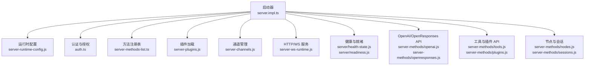
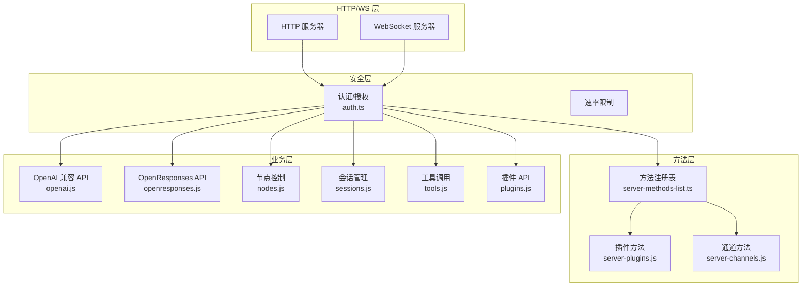
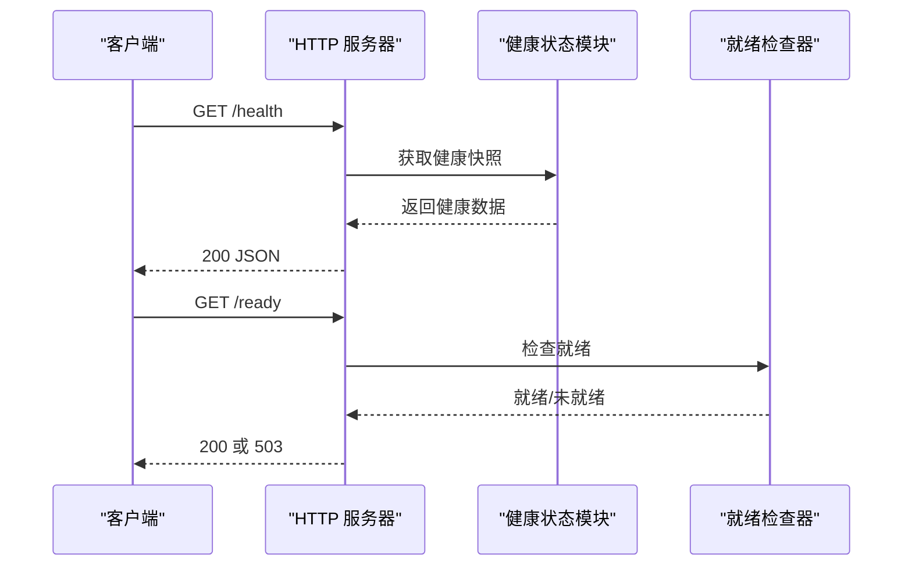
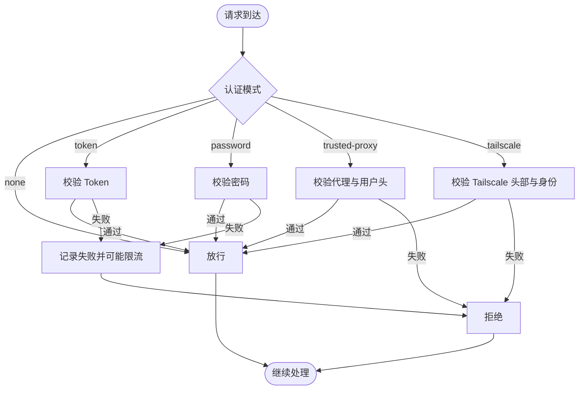
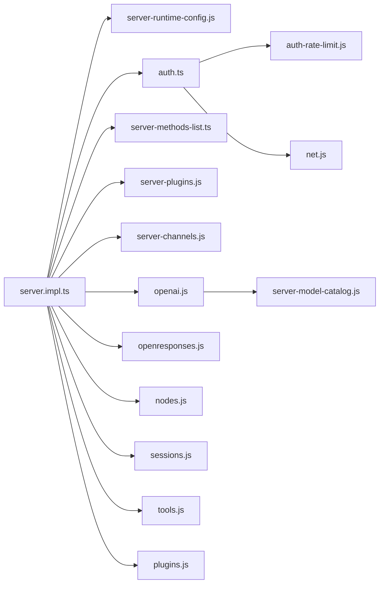

# HTTP REST API

<cite>
**本文引用的文件**
- [server.impl.ts](file://src/gateway/server.impl.ts)
- [auth.ts](file://src/gateway/auth.ts)
- [server-methods-list.ts](file://src/gateway/server-methods-list.ts)
- [server-methods.ts](file://src/gateway/server-methods.js)
- [server-channels.ts](file://src/gateway/server-channels.js)
- [server-plugins.ts](file://src/gateway/server-plugins.js)
- [server-runtime-config.ts](file://src/gateway/server-runtime-config.js)
- [server.readiness.ts](file://src/gateway/server/readiness.js)
- [server.health-state.ts](file://src/gateway/server/health-state.js)
- [server-cron.ts](file://src/gateway/server-cron.js)
- [server-discovery-runtime.ts](file://src/gateway/server-discovery-runtime.js)
- [server-tls.ts](file://src/gateway/server/tls.js)
- [server-browser.ts](file://src/gateway/server-browser.js)
- [server-ws-runtime.ts](file://src/gateway/server-ws-runtime.js)
- [server-node-subscriptions.ts](file://src/gateway/server-node-subscriptions.js)
- [server-session-key.ts](file://src/gateway/server-session-key.js)
- [server-model-catalog.ts](file://src/gateway/server-model-catalog.js)
- [server-methods/exec-approval.ts](file://src/gateway/server-methods/exec-approval.js)
- [server-methods/secrets.ts](file://src/gateway/server-methods/secrets.js)
- [server-methods/nodes.helpers.ts](file://src/gateway/server-methods/nodes.helpers.js)
- [server-methods/health.ts](file://src/gateway/server-methods/health.js)
- [server-methods/config.ts](file://src/gateway/server-methods/config.js)
- [server-methods/sessions.ts](file://src/gateway/server-methods/sessions.js)
- [server-methods/nodes.ts](file://src/gateway/server-methods/nodes.js)
- [server-methods/tools.ts](file://src/gateway/server-methods/tools.js)
- [server-methods/plugins.ts](file://src/gateway/server-methods/plugins.js)
- [server-methods/openai.ts](file://src/gateway/server-methods/openai.js)
- [server-methods/openresponses.ts](file://src/gateway/server-methods/openresponses.js)
- [server-methods/tools-invoke-http-api.ts](file://src/gateway/server-methods/tools-invoke-http-api.js)
- [server-methods/trusted-proxy-auth.ts](file://src/gateway/server-methods/trusted-proxy-auth.js)
- [server-methods/agent-events.ts](file://src/gateway/server-methods/agent-events.js)
- [server-methods/channel-events.ts](file://src/gateway/server-methods/channel-events.js)
- [server-methods/node-events.ts](file://src/gateway/server-methods/node-events.js)
- [server-methods/system-events.ts](file://src/gateway/server-methods/system-events.js)
- [server-methods/heartbeat.ts](file://src/gateway/server-methods/heartbeat.js)
- [server-methods/updates.ts](file://src/gateway/server-methods/updates.js)
- [server-methods/version.ts](file://src/gateway/server-methods/version.js)
- [server-methods/status.ts](file://src/gateway/server-methods/status.js)
- [server-methods/presence.ts](file://src/gateway/server-methods/presence.js)
- [server-methods/discovery.ts](file://src/gateway/server-methods/discovery.js)
- [server-methods/tls.ts](file://src/gateway/server-methods/tls.js)
- [server-methods/browser.ts](file://src/gateway/server-methods/browser.js)
- [server-methods/cron.ts](file://src/gateway/server-methods/cron.js)
- [server-methods/canvas.ts](file://src/gateway/server-methods/canvas.js)
- [server-methods/controls.ts](file://src/gateway/server-methods/controls.js)
- [server-methods/notifications.ts](file://src/gateway/server-methods/notifications.js)
- [server-methods/logs.ts](file://src/gateway/server-methods/logs.js)
- [server-methods/events.ts](file://src/gateway/server-methods/events.js)
- [server-methods/webhooks.ts](file://src/gateway/server-methods/webhooks.js)
- [server-methods/hooks.ts](file://src/gateway/server-methods/hooks.js)
- [server-methods/commands.ts](file://src/gateway/server-methods/commands.js)
- [server-methods/agents.ts](file://src/gateway/server-methods/agents.js)
- [server-methods/queues.ts](file://src/gateway/server-methods/queues.js)
- [server-methods/locks.ts](file://src/gateway/server-methods/locks.js)
- [server-methods/locks.ts](file://src/gateway/server-methods/locks.js)
- [server-methods/locks.ts](file://src/gateway/server-methods/locks.js)
- [server-methods/locks.ts](file://src/gateway/server-methods/locks.js)
- [server-methods/locks.ts](file://src/gateway/server-methods/locks.js)
- [server-methods/locks.ts](file://src/gateway/server-methods/locks.js)
- [server-methods/locks.ts](file://src/gateway/server-methods/locks.js)
- [server-methods/locks.ts](file://src/gateway/server-methods/locks.js)
- [server-methods/locks.ts](file://src/gateway/server-methods/locks.js)
- [server-methods/locks.ts](file://src/gateway/server-methods/locks.js)
- [server-methods/locks.ts](file://src/gateway/server-methods/locks.js)
- [server-methods/locks.ts](file://src/gateway/server-methods/locks.js)
- [server-methods/locks.ts](file://src/gateway/server-methods/locks.js)
- [server-methods/locks.ts](file://src/gateway/server-methods/locks.js)
- [server-methods/locks.ts](file://src/gateway/server-methods/locks.js)
- [server-methods/locks.ts](file://src/gateway/server-methods/locks.js)
- [server-methods/locks.ts](file://src/gateway/server-methods/locks.js)
- [server-methods/locks.ts](file://src/gateway/server-methods/locks.js)
- [server-methods/locks.ts](file://src/gateway/server-methods/locks.js)
- [server-methods/locks.ts](file://src/gateway/server-methods/locks.js)
- [server-methods/locks.ts](file://src/gateway/server-methods/locks.js)
- [server-methods/locks.ts](file://src/gateway/server-methods/locks.js)
- [server-methods/locks.ts](file://src/gateway/server-methods/locks.js)
- [server-methods/locks.ts](file://src/gateway/server-methods/locks.js)
-......
</cite>

## 目录

1. [简介](#简介)
2. [项目结构](#项目结构)
3. [核心组件](#核心组件)
4. [架构总览](#架构总览)
5. [详细组件分析](#详细组件分析)
6. [依赖关系分析](#依赖关系分析)
7. [性能考量](#性能考量)
8. [故障排查指南](#故障排查指南)
9. [结论](#结论)
10. [附录](#附录)

## 简介

本文件为 OpenClaw 网关的 HTTP REST API 技术文档，覆盖健康检查、配置管理、会话操作、节点控制、OpenAI 兼容 API、工具调用 API、插件 API 等接口规范。文档基于代码库中的网关服务器实现与方法注册机制，系统性梳理端点定义、认证方式、请求/响应格式、错误码与典型使用场景，并提供序列图与流程图帮助理解。

## 项目结构

OpenClaw 网关通过统一的启动流程装配 HTTP/WS 服务、认证、插件与通道方法，并在运行时动态暴露各类 API。核心入口与能力分布如下：

- 启动与运行时装配：server.impl.ts
- 认证与授权：auth.ts
- 方法清单与注册：server-methods-list.ts、server-methods.js
- 运行时配置解析：server-runtime-config.js
- 健康状态与就绪检查：server/health-state.js、server/readiness.js
- 插件与通道集成：server-plugins.js、server-channels.js
- OpenAI 兼容与 OpenResponses API：server-methods/openai.js、server-methods/openresponses.js
- 工具调用与插件 API：server-methods/tools.js、server-methods/plugins.js
- 节点与会话：server-methods/nodes.js、server-methods/sessions.js
- 其他子系统：TLS、发现、浏览器控制、心跳、更新等

图表来源

- [server.impl.ts:266-800](file://src/gateway/server.impl.ts#L266-L800)
- [server-methods-list.ts](file://src/gateway/server-methods-list.ts)
- [server-plugins.js](file://src/gateway/server-plugins.js)
- [server-channels.js](file://src/gateway/server-channels.js)
- [server-ws-runtime.js](file://src/gateway/server-ws-runtime.js)
- [server/health-state.js](file://src/gateway/server/health-state.js)
- [server/readiness.js](file://src/gateway/server/readiness.js)
- [server-methods/openai.js](file://src/gateway/server-methods/openai.js)
- [server-methods/openresponses.js](file://src/gateway/server-methods/openresponses.js)
- [server-methods/tools.js](file://src/gateway/server-methods/tools.js)
- [server-methods/plugins.js](file://src/gateway/server-methods/plugins.js)
- [server-methods/nodes.js](file://src/gateway/server-methods/nodes.js)
- [server-methods/sessions.js](file://src/gateway/server-methods/sessions.js)

章节来源

- [server.impl.ts:266-800](file://src/gateway/server.impl.ts#L266-L800)

## 核心组件

- 网关服务器与运行时
  - 提供 HTTP/WS 服务、TLS、绑定策略（loopback/lan/tailnet/auto）、控制 UI、OpenAI/OpenResponses 端点开关等。
  - 关键选项：bind/host/controlUiEnabled/openAiChatCompletionsEnabled/openResponsesEnabled/auth/tailscale。
- 认证与授权
  - 支持 none/token/password/trusted-proxy 模式；可配置速率限制；支持 Tailscale 头部认证（WS 控制 UI 场景）。
- 方法注册与路由
  - 基于核心方法与插件/通道扩展方法构建统一方法表，按需启用 HTTP 端点。
- 健康与就绪
  - 提供健康快照、版本号、存在性版本号、就绪检查器等。
- 插件与通道
  - 动态加载插件与通道，注入各自 gatewayMethods 并合并到全局方法集。

章节来源

- [server.impl.ts:211-265](file://src/gateway/server.impl.ts#L211-L265)
- [auth.ts:23-50](file://src/gateway/auth.ts#L23-L50)
- [server-methods-list.ts](file://src/gateway/server-methods-list.ts)
- [server/health-state.js](file://src/gateway/server/health-state.js)
- [server/readiness.js](file://src/gateway/server/readiness.js)
- [server-plugins.js](file://src/gateway/server-plugins.js)
- [server-channels.js](file://src/gateway/server-channels.js)

## 架构总览

下图展示网关启动后，HTTP/WS 服务如何与认证、方法注册、插件/通道、OpenAI/OpenResponses API、节点/会话等模块协同工作。

图表来源

- [server.impl.ts:468-487](file://src/gateway/server.impl.ts#L468-L487)
- [auth.ts:378-503](file://src/gateway/auth.ts#L378-L503)
- [server-methods-list.ts](file://src/gateway/server-methods-list.ts)
- [server-plugins.js](file://src/gateway/server-plugins.js)
- [server-channels.js](file://src/gateway/server-channels.js)
- [server-methods/openai.js](file://src/gateway/server-methods/openai.js)
- [server-methods/openresponses.js](file://src/gateway/server-methods/openresponses.js)
- [server-methods/nodes.js](file://src/gateway/server-methods/nodes.js)
- [server-methods/sessions.js](file://src/gateway/server-methods/sessions.js)
- [server-methods/tools.js](file://src/gateway/server-methods/tools.js)
- [server-methods/plugins.js](file://src/gateway/server-methods/plugins.js)

## 详细组件分析

### 健康检查与就绪检查

- 端点
  - GET /health：返回健康状态与版本信息
  - GET /ready：返回就绪状态
- 请求参数
  - 无
- 响应格式
  - JSON 对象，包含健康状态、版本号、存在性版本号、时间戳等
- 错误码
  - 503 未就绪时
  - 500 内部错误
- 使用场景
  - 容器编排探针、负载均衡前置检查、运维监控

图表来源

- [server-methods/health.js](file://src/gateway/server-methods/health.js)
- [server/readiness.js](file://src/gateway/server/readiness.js)
- [server/health-state.js](file://src/gateway/server/health-state.js)

章节来源

- [server-methods/health.js](file://src/gateway/server-methods/health.js)
- [server/readiness.js](file://src/gateway/server/readiness.js)
- [server/health-state.js](file://src/gateway/server/health-state.js)

### 配置管理 API

- 端点
  - GET /v1/config：获取当前配置快照
  - PUT /v1/config：更新配置（需要相应权限）
- 请求参数
  - GET：无
  - PUT：JSON 配置体（遵循配置 schema）
- 响应格式
  - GET：JSON 配置对象
  - PUT：操作结果（成功/失败及原因）
- 错误码
  - 400 参数无效
  - 401 未授权
  - 403 权限不足
  - 500 内部错误
- 使用场景
  - 远程运维、灰度变更、热重载

章节来源

- [server-methods/config.js](file://src/gateway/server-methods/config.js)

### 会话操作 API

- 端点
  - GET /v1/sessions：列出会话
  - GET /v1/sessions/{key}：获取会话详情
  - POST /v1/sessions：创建会话
  - DELETE /v1/sessions/{key}：删除会话
- 请求参数
  - 路径参数：{key}
  - POST：会话初始化参数（如 agentId、channel 等）
- 响应格式
  - JSON 会话对象或列表
- 错误码
  - 404 会话不存在
  - 400 参数错误
  - 401 未授权
  - 500 内部错误
- 使用场景
  - 多会话并发管理、会话生命周期维护

章节来源

- [server-methods/sessions.js](file://src/gateway/server-methods/sessions.js)

### 节点控制 API

- 端点
  - GET /v1/nodes：列出节点
  - GET /v1/nodes/{id}：获取节点状态
  - POST /v1/nodes/{id}/control：向节点发送控制事件
  - POST /v1/nodes/{id}/subscribe：订阅节点事件
  - DELETE /v1/nodes/{id}/subscribe：取消订阅
- 请求参数
  - 路径参数：{id}
  - POST /control：事件类型与负载
  - POST /subscribe：订阅会话 key
- 响应格式
  - JSON 状态或确认
- 错误码
  - 404 节点不存在
  - 400 参数错误
  - 401 未授权
  - 500 内部错误
- 使用场景
  - 移动节点/设备控制、事件订阅与推送

章节来源

- [server-methods/nodes.js](file://src/gateway/server-methods/nodes.js)
- [server-methods/nodes.helpers.js](file://src/gateway/server-methods/nodes.helpers.js)
- [server-node-subscriptions.js](file://src/gateway/server-node-subscriptions.js)

### OpenAI 兼容 API

- 端点
  - POST /v1/chat/completions：聊天补全（兼容 OpenAI）
- 请求参数
  - JSON：messages、model、temperature、max_tokens、stream 等（遵循 OpenAI schema）
- 响应格式
  - 流式或非流式 JSON，遵循 OpenAI 响应结构
- 错误码
  - 400 请求参数无效
  - 401 未授权
  - 403 模型不可用/配额限制
  - 500 内部错误
- 使用场景
  - 第三方应用直连、SDK 兼容

章节来源

- [server-methods/openai.js](file://src/gateway/server-methods/openai.js)

### OpenResponses API

- 端点
  - POST /v1/responses：生成响应（OpenResponses）
- 请求参数
  - JSON：prompt、model、temperature、max_tokens、stream 等
- 响应格式
  - 流式或非流式 JSON，遵循 OpenResponses 响应结构
- 错误码
  - 400 请求参数无效
  - 401 未授权
  - 403 权限不足
  - 500 内部错误
- 使用场景
  - 企业内部响应生成、统一输出格式

章节来源

- [server-methods/openresponses.js](file://src/gateway/server-methods/openresponses.js)

### 工具调用 API

- 端点
  - POST /v1/tools/invoke：调用工具
  - GET /v1/tools：列出可用工具
- 请求参数
  - POST /invoke：工具名、参数、会话 key
- 响应格式
  - JSON 工具执行结果
- 错误码
  - 404 工具不存在
  - 400 参数错误
  - 401 未授权
  - 500 内部错误
- 使用场景
  - 自动化技能、外部系统集成

章节来源

- [server-methods/tools.js](file://src/gateway/server-methods/tools.js)
- [server-methods/tools-invoke-http-api.js](file://src/gateway/server-methods/tools-invoke-http-api.js)

### 插件 API

- 端点
  - GET /v1/plugins：列出已加载插件
  - GET /v1/plugins/{id}：获取插件元信息
  - POST /v1/plugins/{id}/enable/disable：启停插件
- 请求参数
  - 路径参数：{id}
  - POST：空体或启停标志
- 响应格式
  - JSON 插件状态或元信息
- 错误码
  - 404 插件不存在
  - 400 参数错误
  - 401 未授权
  - 500 内部错误
- 使用场景
  - 插件生命周期管理、动态扩展

章节来源

- [server-methods/plugins.js](file://src/gateway/server-methods/plugins.js)
- [server-plugins.js](file://src/gateway/server-plugins.js)

### 认证与授权

- 支持模式
  - none：无需认证
  - token：Bearer Token
  - password：Basic 密码
  - trusted-proxy：受信代理透传用户
- 速率限制
  - 可配置共享密钥作用域的速率限制
- Tailscale 头部认证
  - WS 控制 UI 场景允许基于 Tailscale 头部进行免令牌登录
- 适用范围
  - HTTP/WS 控制面均受控于同一认证策略

图表来源

- [auth.ts:217-503](file://src/gateway/auth.ts#L217-L503)

章节来源

- [auth.ts:23-50](file://src/gateway/auth.ts#L23-L50)
- [auth.ts:217-503](file://src/gateway/auth.ts#L217-L503)

### 事件与通知 API

- 端点
  - GET /v1/events：订阅事件流
  - POST /v1/notifications：发送通知
- 请求参数
  - GET：查询参数（如 eventTypes、since）
  - POST：通知内容与目标
- 响应格式
  - 事件流或确认
- 错误码
  - 400 参数错误
  - 401 未授权
  - 500 内部错误
- 使用场景
  - 实时事件订阅、系统通知

章节来源

- [server-methods/events.js](file://src/gateway/server-methods/events.js)
- [server-methods/notifications.js](file://src/gateway/server-methods/notifications.js)

### 系统与诊断 API

- 端点
  - GET /v1/status：系统状态
  - GET /v1/presence：在线存在
  - GET /v1/version：版本信息
  - GET /v1/logs：日志检索
  - GET /v1/heartbeat：心跳
  - GET /v1/discovery：发现状态
  - GET /v1/tls：TLS 状态
  - GET /v1/browser：浏览器控制状态
  - GET /v1/cron：定时任务状态
  - GET /v1/canvas：画布状态
  - GET /v1/updates：更新检查
- 请求参数
  - 无或查询参数
- 响应格式
  - JSON 对象
- 错误码
  - 401 未授权
  - 500 内部错误
- 使用场景
  - 运维诊断、状态巡检

章节来源

- [server-methods/status.js](file://src/gateway/server-methods/status.js)
- [server-methods/presence.js](file://src/gateway/server-methods/presence.js)
- [server-methods/version.js](file://src/gateway/server-methods/version.js)
- [server-methods/logs.js](file://src/gateway/server-methods/logs.js)
- [server-methods/heartbeat.js](file://src/gateway/server-methods/heartbeat.js)
- [server-methods/discovery.js](file://src/gateway/server-methods/discovery.js)
- [server-methods/tls.js](file://src/gateway/server-methods/tls.js)
- [server-methods/browser.js](file://src/gateway/server-methods/browser.js)
- [server-methods/cron.js](file://src/gateway/server-methods/cron.js)
- [server-methods/canvas.js](file://src/gateway/server-methods/canvas.js)
- [server-methods/updates.js](file://src/gateway/server-methods/updates.js)

## 依赖关系分析

- 组件耦合
  - server.impl.ts 作为装配中心，依赖配置、认证、插件、通道、方法注册等模块
  - 认证模块对速率限制、Tailscale、受信代理有强依赖
  - OpenAI/OpenResponses API 依赖模型目录与运行时配置
- 外部依赖
  - TLS、发现、浏览器控制、心跳、更新等子系统通过独立模块提供能力
- 循环依赖
  - 通过方法注册与动态加载避免直接循环依赖

图表来源

- [server.impl.ts:468-487](file://src/gateway/server.impl.ts#L468-L487)
- [auth.ts:11-14](file://src/gateway/auth.ts#L11-L14)
- [server-methods/openai.js](file://src/gateway/server-methods/openai.js)
- [server-methods/openresponses.js](file://src/gateway/server-methods/openresponses.js)
- [server-methods/nodes.js](file://src/gateway/server-methods/nodes.js)
- [server-methods/sessions.js](file://src/gateway/server-methods/sessions.js)
- [server-methods/tools.js](file://src/gateway/server-methods/tools.js)
- [server-methods/plugins.js](file://src/gateway/server-methods/plugins.js)
- [server-model-catalog.js](file://src/gateway/server-model-catalog.js)

章节来源

- [server.impl.ts:468-487](file://src/gateway/server.impl.ts#L468-L487)

## 性能考量

- 速率限制
  - 通过共享密钥作用域的速率限制器保护认证端点，防止暴力破解
- 流式响应
  - OpenAI/OpenResponses API 支持流式输出，降低首字节延迟
- 缓存与预热
  - 模型目录与远程技能缓存减少冷启动开销
- 并发与队列
  - 心跳、维护定时器与命令队列确保后台任务有序执行

## 故障排查指南

- 常见问题
  - 401 未授权：检查认证模式与凭据；确认受信代理配置；核对 Tailscale 头部
  - 403 权限不足：确认方法作用域与 operator scopes
  - 500 内部错误：查看系统事件与日志；检查插件/通道异常
  - 503 未就绪：等待就绪检查器通过；检查通道健康状态
- 排查步骤
  - 使用 /v1/status、/v1/presence、/v1/heartbeat、/v1/logs 获取系统状态
  - 使用 /v1/discovery、/v1/tls、/v1/browser、/v1/cron、/v1/canvas 检查子系统
  - 查看系统事件与诊断日志

章节来源

- [server-methods/status.js](file://src/gateway/server-methods/status.js)
- [server-methods/logs.js](file://src/gateway/server-methods/logs.js)
- [server-methods/heartbeat.js](file://src/gateway/server-methods/heartbeat.js)
- [server-methods/discovery.js](file://src/gateway/server-methods/discovery.js)
- [server-methods/tls.js](file://src/gateway/server-methods/tls.js)
- [server-methods/browser.js](file://src/gateway/server-methods/browser.js)
- [server-methods/cron.js](file://src/gateway/server-methods/cron.js)
- [server-methods/canvas.js](file://src/gateway/server-methods/canvas.js)

## 结论

OpenClaw 网关通过统一的启动装配、灵活的认证授权、动态的方法注册与丰富的子系统，提供了完整的 HTTP/WS API 能力。本文档梳理了健康检查、配置管理、会话与节点控制、OpenAI/OpenResponses 兼容 API、工具与插件 API 的规范与使用场景，并给出了认证流程、依赖关系与故障排查建议，便于开发者与运维人员快速上手与稳定运营。

## 附录

- 端点总览（按功能分组）
  - 健康与就绪：/health, /ready
  - 配置：/v1/config
  - 会话：/v1/sessions
  - 节点：/v1/nodes
  - OpenAI 兼容：/v1/chat/completions
  - OpenResponses：/v1/responses
  - 工具：/v1/tools
  - 插件：/v1/plugins
  - 事件与通知：/v1/events, /v1/notifications
  - 系统与诊断：/v1/status, /v1/presence, /v1/version, /v1/logs, /v1/heartbeat, /v1/discovery, /v1/tls, /v1/browser, /v1/cron, /v1/canvas, /v1/updates
- 认证方式
  - none/token/password/trusted-proxy；支持速率限制与 Tailscale 头部认证
- 错误码参考
  - 200 成功、400 参数错误、401 未授权、403 权限不足、404 资源不存在、500 内部错误、503 未就绪
