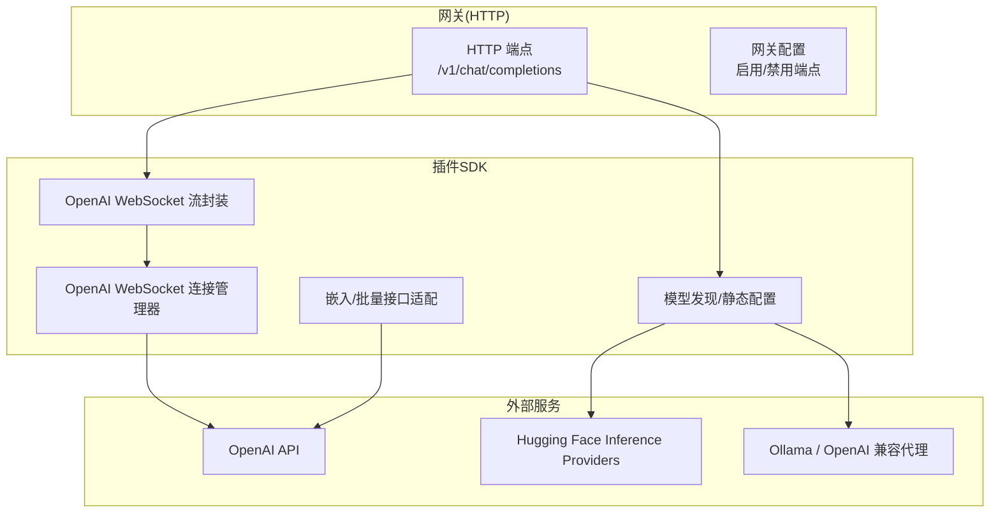
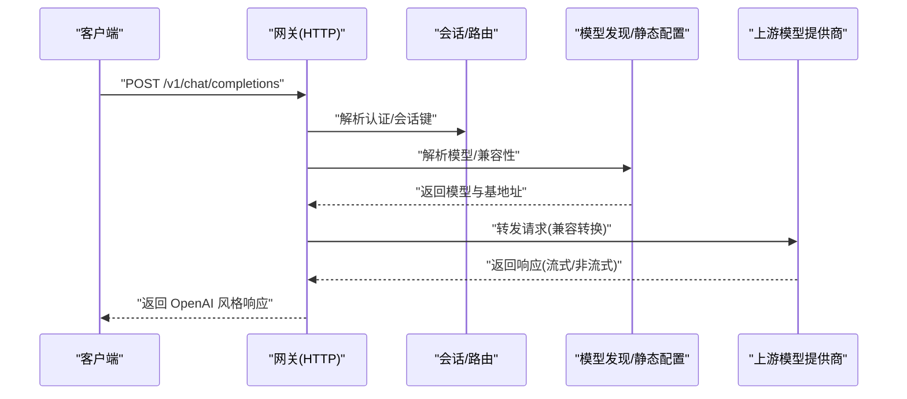
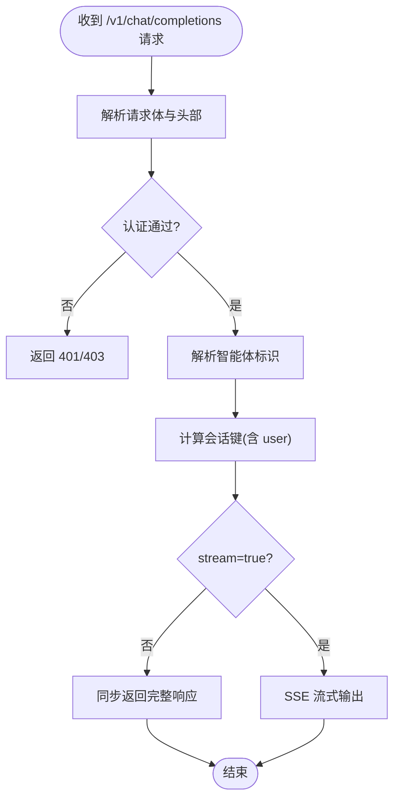
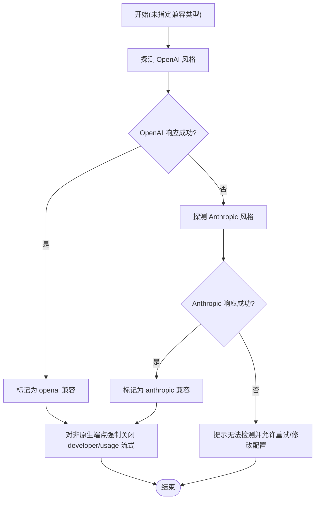
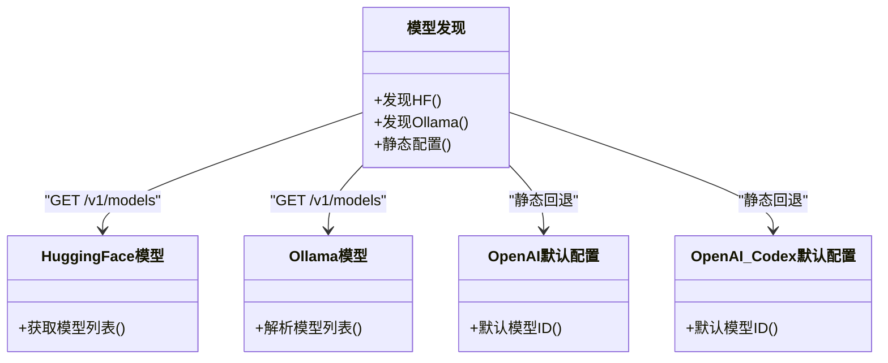
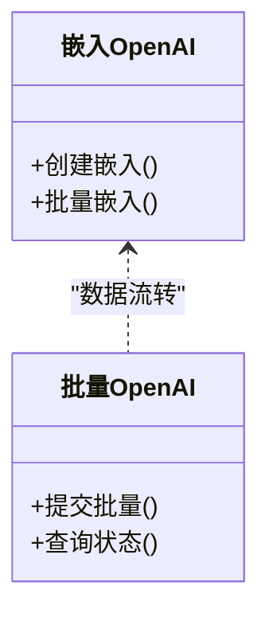
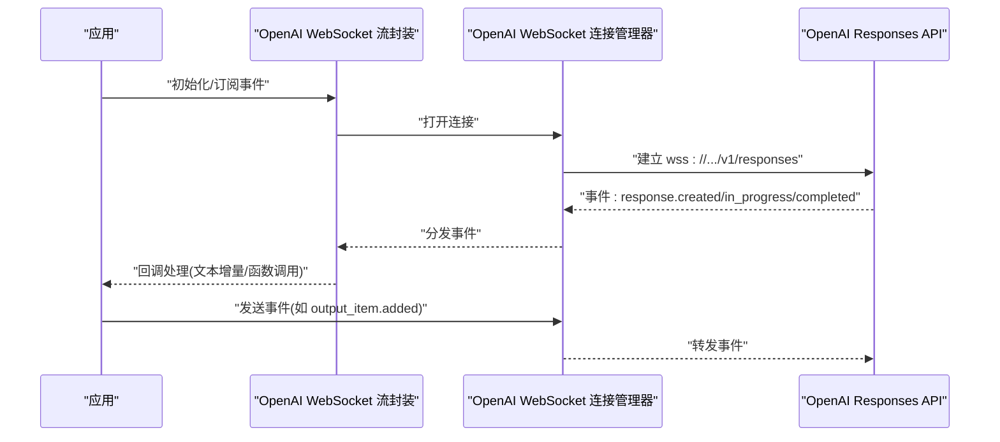
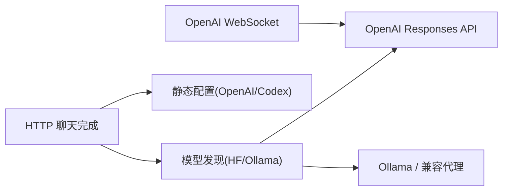

# OpenAI兼容API

<cite>
**本文引用的文件**
- [openai-http-api.md](file://docs/zh-CN/gateway/openai-http-api.md)
- [onboard-custom.ts](file://src/commands/onboard-custom.ts)
- [model-compat.ts](file://src/agents/model-compat.ts)
- [model-compat.test.ts](file://src/agents/model-compat.test.ts)
- [openresponses-gateway.md](file://docs/experiments/plans/openresponses-gateway.md)
- [openai-ws-connection.d.ts](file://apps/electron/release/mac-arm64/OpenClaw.app/Contents/Resources/openclaw/dist/plugin-sdk/agents/openai-ws-connection.d.ts)
- [openai-ws-stream.d.ts](file://apps/electron/release/mac-arm64/OpenClaw.app/Contents/Resources/openclaw/dist/plugin-sdk/agents/openai-ws-stream.d.ts)
- [openai-model-default.d.ts](file://apps/electron/release/mac-arm64/OpenClaw.app/Contents/Resources/openclaw/dist/plugin-sdk/commands/openai-model-default.d.ts)
- [openai-codex-model-default.d.ts](file://apps/electron/release/mac-arm64/OpenClaw.app/Contents/Resources/openclaw/dist/plugin-sdk/commands/openai-codex-model-default.d.ts)
- [huggingface-models.d.ts](file://apps/electron/release/mac-arm64/OpenClaw.app/Contents/Resources/openclaw/dist/plugin-sdk/agents/huggingface-models.d.ts)
- [models-config.providers.discovery.d.ts](file://apps/electron/release/mac-arm64/OpenClaw.app/Contents/Resources/openclaw/dist/plugin-sdk/agents/models-config.providers.discovery.d.ts)
- [models-config.providers.static.d.ts](file://apps/electron/release/mac-arm64/OpenClaw.app/Contents/Resources/openclaw/dist/plugin-sdk/agents/models-config.providers.static.d.ts)
- [ollama-stream.d.ts](file://apps/electron/release/mac-arm64/OpenClaw.app/Contents/Resources/openclaw/dist/plugin-sdk/agents/ollama-stream.d.ts)
- [embeddings-openai.d.ts](file://apps/electron/release/mac-arm64/OpenClaw.app/Contents/Resources/openclaw/dist/plugin-sdk/memory/embeddings-openai.d.ts)
- [batch-openai.d.ts](file://apps/electron/release/mac-arm64/OpenClaw.app/Contents/Resources/openclaw/dist/plugin-sdk/memory/batch-openai.d.ts)
- [pi-embedded-helpers/openai.d.ts](file://apps/electron/release/mac-arm64/OpenClaw.app/Contents/Resources/openclaw/dist/plugin-sdk/agents/pi-embedded-helpers/openai.d.ts)
- [pi-embedded-runner/openai-stream-wrappers.d.ts](file://apps/electron/release/mac-arm64/OpenClaw.app/Contents/Resources/openclaw/dist/plugin-sdk/agents/pi-embedded-runner/openai-stream-wrappers.d.ts)
</cite>

## 目录

1. [简介](#简介)
2. [项目结构](#项目结构)
3. [核心组件](#核心组件)
4. [架构总览](#架构总览)
5. [详细组件分析](#详细组件分析)
6. [依赖关系分析](#依赖关系分析)
7. [性能考量](#性能考量)
8. [故障排查指南](#故障排查指南)
9. [结论](#结论)
10. [附录](#附录)

## 简介

本文件系统化阐述 OpenClaw 对 OpenAI HTTP API 的兼容实现，覆盖聊天完成、模型列表、图像生成等关键端点，并给出兼容性映射、参数转换与响应格式说明。同时，文档对比标准 OpenAI API 的差异、提供迁移指南与最佳实践，并附上完整的 API 参考与使用示例。

## 项目结构

OpenClaw 将 OpenAI 兼容能力主要置于“网关”层，通过 HTTP 端点暴露 OpenAI 风格的接口；同时在插件 SDK 中提供 OpenAI 响应式 WebSocket 连接与流封装，便于构建更贴近 OpenAI Responses 规范的多轮工具调用工作流。

图示来源

- [openai-http-api.md:15-125](file://docs/zh-CN/gateway/openai-http-api.md#L15-L125)
- [openai-ws-connection.d.ts:1-300](file://apps/electron/release/mac-arm64/OpenClaw.app/Contents/Resources/openclaw/dist/plugin-sdk/agents/openai-ws-connection.d.ts#L1-L300)
- [openai-ws-stream.d.ts:1-60](file://apps/electron/release/mac-arm64/OpenClaw.app/Contents/Resources/openclaw/dist/plugin-sdk/agents/openai-ws-stream.d.ts#L1-L60)
- [huggingface-models.d.ts:1-20](file://apps/electron/release/mac-arm64/OpenClaw.app/Contents/Resources/openclaw/dist/plugin-sdk/agents/huggingface-models.d.ts#L1-L20)
- [models-config.providers.discovery.d.ts:1-20](file://apps/electron/release/mac-arm64/OpenClaw.app/Contents/Resources/openclaw/dist/plugin-sdk/agents/models-config.providers.discovery.d.ts#L1-L20)
- [models-config.providers.static.d.ts:1-30](file://apps/electron/release/mac-arm64/OpenClaw.app/Contents/Resources/openclaw/dist/plugin-sdk/agents/models-config.providers.static.d.ts#L1-L30)
- [embeddings-openai.d.ts:1-40](file://apps/electron/release/mac-arm64/OpenClaw.app/Contents/Resources/openclaw/dist/plugin-sdk/memory/embeddings-openai.d.ts#L1-L40)

章节来源

- [openai-http-api.md:15-125](file://docs/zh-CN/gateway/openai-http-api.md#L15-L125)

## 核心组件

- HTTP 聊天完成端点：提供 OpenAI 风格的 /v1/chat/completions 接口，默认禁用，需在网关配置中开启。
- 模型兼容与探测：内置对 OpenAI 与 Anthropic 端点的探测逻辑，自动识别兼容类型并调整模型兼容标志。
- 模型发现与静态配置：支持从 Hugging Face、Ollama 等 OpenAI 兼容后端发现模型，或使用静态配置。
- 嵌入与批量接口适配：提供与 OpenAI 兼容的嵌入与批量接口类型定义。
- OpenAI 响应式 WebSocket：提供连接管理器与流封装，用于 OpenAI Responses 工作流。

章节来源

- [openai-http-api.md:15-125](file://docs/zh-CN/gateway/openai-http-api.md#L15-L125)
- [onboard-custom.ts:689-743](file://src/commands/onboard-custom.ts#L689-L743)
- [model-compat.ts:51-79](file://src/agents/model-compat.ts#L51-L79)
- [huggingface-models.d.ts:1-20](file://apps/electron/release/mac-arm64/OpenClaw.app/Contents/Resources/openclaw/dist/plugin-sdk/agents/huggingface-models.d.ts#L1-L20)
- [models-config.providers.discovery.d.ts:1-20](file://apps/electron/release/mac-arm64/OpenClaw.app/Contents/Resources/openclaw/dist/plugin-sdk/agents/models-config.providers.discovery.d.ts#L1-L20)
- [embeddings-openai.d.ts:1-40](file://apps/electron/release/mac-arm64/OpenClaw.app/Contents/Resources/openclaw/dist/plugin-sdk/memory/embeddings-openai.d.ts#L1-L40)
- [openai-ws-connection.d.ts:1-300](file://apps/electron/release/mac-arm64/OpenClaw.app/Contents/Resources/openclaw/dist/plugin-sdk/agents/openai-ws-connection.d.ts#L1-L300)
- [openai-ws-stream.d.ts:1-60](file://apps/electron/release/mac-arm64/OpenClaw.app/Contents/Resources/openclaw/dist/plugin-sdk/agents/openai-ws-stream.d.ts#L1-L60)

## 架构总览

下图展示 OpenClaw 如何通过网关暴露 OpenAI 兼容端点，并与模型发现、嵌入与 WebSocket 工作流协同：

图示来源

- [openai-http-api.md:21-125](file://docs/zh-CN/gateway/openai-http-api.md#L21-L125)
- [onboard-custom.ts:705-743](file://src/commands/onboard-custom.ts#L705-L743)
- [model-compat.ts:51-79](file://src/agents/model-compat.ts#L51-L79)

## 详细组件分析

### 组件A：HTTP 聊天完成端点

- 端点与认证：默认禁用，需在网关配置中启用；认证方式遵循网关统一策略（Bearer 令牌）。
- 选择智能体：通过 model 字段或专用头指定 OpenClaw 智能体 ID。
- 会话行为：默认每请求无状态；若携带 user 字段可派生稳定会话键以复用会话。
- 流式传输：支持 SSE，逐行返回 data: <json>，以 data: [DONE] 结束。
- 示例：提供非流式与流式的 cURL 示例。

图示来源

- [openai-http-api.md:26-125](file://docs/zh-CN/gateway/openai-http-api.md#L26-L125)

章节来源

- [openai-http-api.md:15-125](file://docs/zh-CN/gateway/openai-http-api.md#L15-L125)

### 组件B：模型兼容与探测

- 自动探测：在未显式指定兼容类型时，尝试向 OpenAI 或 Anthropic 风格端点发起探测请求以判断类型。
- 兼容标志强制：对于非原生 OpenAI 的兼容端点，强制关闭 developer 角色与流式 usage 支持，避免解析错误。
- 测试用例：包含针对 developer 角色与流式 usage 的兼容性断言。

图示来源

- [onboard-custom.ts:705-743](file://src/commands/onboard-custom.ts#L705-L743)
- [model-compat.ts:51-79](file://src/agents/model-compat.ts#L51-L79)
- [model-compat.test.ts:83-88](file://src/agents/model-compat.test.ts#L83-L88)

章节来源

- [onboard-custom.ts:689-743](file://src/commands/onboard-custom.ts#L689-L743)
- [model-compat.ts:51-79](file://src/agents/model-compat.ts#L51-L79)
- [model-compat.test.ts:45-88](file://src/agents/model-compat.test.ts#L45-L88)

### 组件C：模型发现与静态配置

- Hugging Face 发现：从 Hugging Face Inference Providers 获取 /v1/models，支持 OpenAI 兼容聊天完成。
- Ollama 发现：通过 /v1/models 动态发现本地或远程 Ollama 模型。
- 静态配置：提供 OpenAI Codex 与 OpenAI 模型默认配置项，便于快速接入。

图示来源

- [huggingface-models.d.ts:1-20](file://apps/electron/release/mac-arm64/OpenClaw.app/Contents/Resources/openclaw/dist/plugin-sdk/agents/huggingface-models.d.ts#L1-L20)
- [models-config.providers.discovery.d.ts:1-20](file://apps/electron/release/mac-arm64/OpenClaw.app/Contents/Resources/openclaw/dist/plugin-sdk/agents/models-config.providers.discovery.d.ts#L1-L20)
- [models-config.providers.static.d.ts:1-30](file://apps/electron/release/mac-arm64/OpenClaw.app/Contents/Resources/openclaw/dist/plugin-sdk/agents/models-config.providers.static.d.ts#L1-L30)
- [openai-model-default.d.ts:1-40](file://apps/electron/release/mac-arm64/OpenClaw.app/Contents/Resources/openclaw/dist/plugin-sdk/commands/openai-model-default.d.ts#L1-L40)
- [openai-codex-model-default.d.ts:1-40](file://apps/electron/release/mac-arm64/OpenClaw.app/Contents/Resources/openclaw/dist/plugin-sdk/commands/openai-codex-model-default.d.ts#L1-L40)

章节来源

- [huggingface-models.d.ts:1-20](file://apps/electron/release/mac-arm64/OpenClaw.app/Contents/Resources/openclaw/dist/plugin-sdk/agents/huggingface-models.d.ts#L1-L20)
- [models-config.providers.discovery.d.ts:1-20](file://apps/electron/release/mac-arm64/OpenClaw.app/Contents/Resources/openclaw/dist/plugin-sdk/agents/models-config.providers.discovery.d.ts#L1-L20)
- [models-config.providers.static.d.ts:1-30](file://apps/electron/release/mac-arm64/OpenClaw.app/Contents/Resources/openclaw/dist/plugin-sdk/agents/models-config.providers.static.d.ts#L1-L30)
- [openai-model-default.d.ts:1-40](file://apps/electron/release/mac-arm64/OpenClaw.app/Contents/Resources/openclaw/dist/plugin-sdk/commands/openai-model-default.d.ts#L1-L40)
- [openai-codex-model-default.d.ts:1-40](file://apps/electron/release/mac-arm64/OpenClaw.app/Contents/Resources/openclaw/dist/plugin-sdk/commands/openai-codex-model-default.d.ts#L1-L40)

### 组件D：嵌入与批量接口适配

- 嵌入接口：提供与 OpenAI 兼容的嵌入接口类型定义，便于统一处理文本向量。
- 批量接口：提供批量操作的类型定义，便于扩展批量化任务。

图示来源

- [embeddings-openai.d.ts:1-40](file://apps/electron/release/mac-arm64/OpenClaw.app/Contents/Resources/openclaw/dist/plugin-sdk/memory/embeddings-openai.d.ts#L1-L40)
- [batch-openai.d.ts:1-40](file://apps/electron/release/mac-arm64/OpenClaw.app/Contents/Resources/openclaw/dist/plugin-sdk/memory/batch-openai.d.ts#L1-L40)

章节来源

- [embeddings-openai.d.ts:1-40](file://apps/electron/release/mac-arm64/OpenClaw.app/Contents/Resources/openclaw/dist/plugin-sdk/memory/embeddings-openai.d.ts#L1-L40)
- [batch-openai.d.ts:1-40](file://apps/electron/release/mac-arm64/OpenClaw.app/Contents/Resources/openclaw/dist/plugin-sdk/memory/batch-openai.d.ts#L1-L40)

### 组件E：OpenAI 响应式 WebSocket（OpenResponses）

- 连接管理器：维护到 OpenAI Responses API 的持久 WebSocket 连接，支持多轮工具调用工作流。
- 流封装：将连接管理器包装为 StreamFn，按会话键管理连接实例。
- 事件类型：涵盖响应创建、进行中、完成、失败以及内容部件与函数调用参数的增量事件。

图示来源

- [openai-ws-connection.d.ts:1-300](file://apps/electron/release/mac-arm64/OpenClaw.app/Contents/Resources/openclaw/dist/plugin-sdk/agents/openai-ws-connection.d.ts#L1-L300)
- [openai-ws-stream.d.ts:1-60](file://apps/electron/release/mac-arm64/OpenClaw.app/Contents/Resources/openclaw/dist/plugin-sdk/agents/openai-ws-stream.d.ts#L1-L60)

章节来源

- [openai-ws-connection.d.ts:1-300](file://apps/electron/release/mac-arm64/OpenClaw.app/Contents/Resources/openclaw/dist/plugin-sdk/agents/openai-ws-connection.d.ts#L1-L300)
- [openai-ws-stream.d.ts:1-60](file://apps/electron/release/mac-arm64/OpenClaw.app/Contents/Resources/openclaw/dist/plugin-sdk/agents/openai-ws-stream.d.ts#L1-L60)

### 组件F：图像生成与多模态输入

- 图像输入：OpenAI 兼容模型通常支持文本与图像输入；在消息结构中可包含图像内容。
- Ollama 流封装：提供图像数组的流封装类型，便于与本地/远程 Ollama 兼容后端集成。

章节来源

- [model-compat.test.ts:45-73](file://src/agents/model-compat.test.ts#L45-L73)
- [ollama-stream.d.ts:1-20](file://apps/electron/release/mac-arm64/OpenClaw.app/Contents/Resources/openclaw/dist/plugin-sdk/agents/ollama-stream.d.ts#L1-L20)

## 依赖关系分析

- 网关 HTTP 与模型发现解耦：HTTP 层仅负责路由与认证，模型解析由模型发现模块承担。
- WebSocket 与 HTTP 并行：HTTP 用于一次性聊天完成，WebSocket 用于多轮工具调用工作流。
- 外部依赖：Hugging Face、Ollama、OpenAI 等作为上游模型提供方，OpenClaw 通过统一的模型配置与探测机制接入。

图示来源

- [huggingface-models.d.ts:1-20](file://apps/electron/release/mac-arm64/OpenClaw.app/Contents/Resources/openclaw/dist/plugin-sdk/agents/huggingface-models.d.ts#L1-L20)
- [models-config.providers.discovery.d.ts:1-20](file://apps/electron/release/mac-arm64/OpenClaw.app/Contents/Resources/openclaw/dist/plugin-sdk/agents/models-config.providers.discovery.d.ts#L1-L20)
- [openai-ws-connection.d.ts:1-300](file://apps/electron/release/mac-arm64/OpenClaw.app/Contents/Resources/openclaw/dist/plugin-sdk/agents/openai-ws-connection.d.ts#L1-L300)

## 性能考量

- 流式传输：优先使用 SSE 流式输出，降低首字节延迟，提升交互体验。
- 会话复用：通过 user 字段派生稳定会话键，减少重复上下文开销。
- 模型探测：在首次接入时进行探测，避免后续请求因兼容性问题导致的重试与失败。
- 连接池与复用：WebSocket 连接按会话键管理，避免频繁握手成本。

## 故障排查指南

- 端点未启用：确认网关配置中已启用 HTTP 端点。
- 认证失败：检查 Bearer 令牌是否正确，或根据网关认证模式配置相应凭据。
- 会话不复用：若未携带 user 字段，将产生新会话；添加 user 可获得稳定会话键。
- 流式输出异常：确保客户端正确处理 SSE 协议与 [DONE] 结束标记。
- 兼容性问题：若上游非原生 OpenAI 端点，将自动关闭 developer 角色与流式 usage，避免解析错误。

章节来源

- [openai-http-api.md:26-125](file://docs/zh-CN/gateway/openai-http-api.md#L26-L125)
- [model-compat.ts:51-79](file://src/agents/model-compat.ts#L51-L79)

## 结论

OpenClaw 通过网关层提供 OpenAI 兼容的 /v1/chat/completions 接口，并结合模型发现、静态配置与探测机制，实现对多种 OpenAI 兼容后端的无缝接入。同时，插件 SDK 提供 OpenAI 响应式 WebSocket 能力，满足多轮工具调用场景。建议在生产环境中启用流式传输、合理使用会话复用，并在接入新后端时利用内置探测与兼容标志自动优化。

## 附录

### API 参考与使用示例

- 端点
  - POST /v1/chat/completions
  - 认证：Authorization: Bearer <token>
  - 选择智能体：model 字段或 x-openclaw-agent-id 头
  - 会话：user 字段派生稳定会话键
  - 流式：stream: true 返回 SSE

- 示例
  - 非流式与流式 cURL 示例见文档。

章节来源

- [openai-http-api.md:21-125](file://docs/zh-CN/gateway/openai-http-api.md#L21-L125)

### 与标准 OpenAI API 的差异

- 端点差异：OpenClaw 默认禁用 /v1/chat/completions，需显式启用；OpenAI 为默认可用。
- 会话行为：OpenClaw 默认每请求无状态，可通过 user 字段复用会话；标准 OpenAI 无此差异。
- 兼容性：非原生 OpenAI 端点将强制关闭 developer 角色与流式 usage，避免解析错误。

章节来源

- [openai-http-api.md:17-125](file://docs/zh-CN/gateway/openai-http-api.md#L17-L125)
- [model-compat.ts:51-79](file://src/agents/model-compat.ts#L51-L79)

### 迁移指南

- 从其他 OpenAI 兼容后端迁移：使用内置探测功能自动识别兼容类型；必要时手动设置兼容类型。
- 从旧版兼容层迁移：逐步迁移到 /v1/responses（OpenResponses）以获得更好的多轮工具调用体验。
- 参数映射：将 OpenAI 的 model 映射为 openclaw:<agentId>，或将 agentId 通过头传入。

章节来源

- [onboard-custom.ts:689-743](file://src/commands/onboard-custom.ts#L689-L743)
- [openresponses-gateway.md:1-37](file://docs/experiments/plans/openresponses-gateway.md#L1-L37)

### 最佳实践

- 使用流式传输提升用户体验。
- 通过 user 字段稳定会话，减少上下文重复。
- 在接入新后端时，优先使用 /v1/models 发现模型，再进行探测与配置。
- 对于多轮工具调用，优先采用 OpenAI WebSocket 工作流。

章节来源

- [openai-http-api.md:84-125](file://docs/zh-CN/gateway/openai-http-api.md#L84-L125)
- [huggingface-models.d.ts:1-20](file://apps/electron/release/mac-arm64/OpenClaw.app/Contents/Resources/openclaw/dist/plugin-sdk/agents/huggingface-models.d.ts#L1-L20)
- [openai-ws-connection.d.ts:1-300](file://apps/electron/release/mac-arm64/OpenClaw.app/Contents/Resources/openclaw/dist/plugin-sdk/agents/openai-ws-connection.d.ts#L1-L300)
