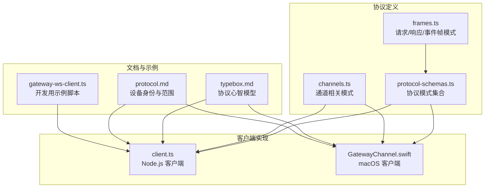
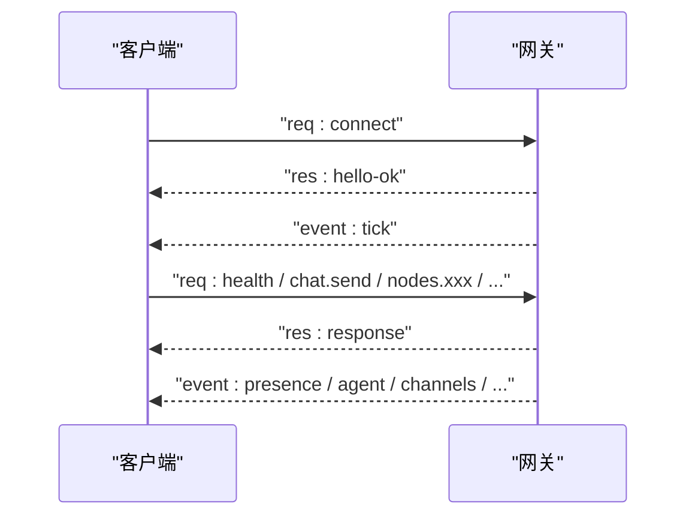
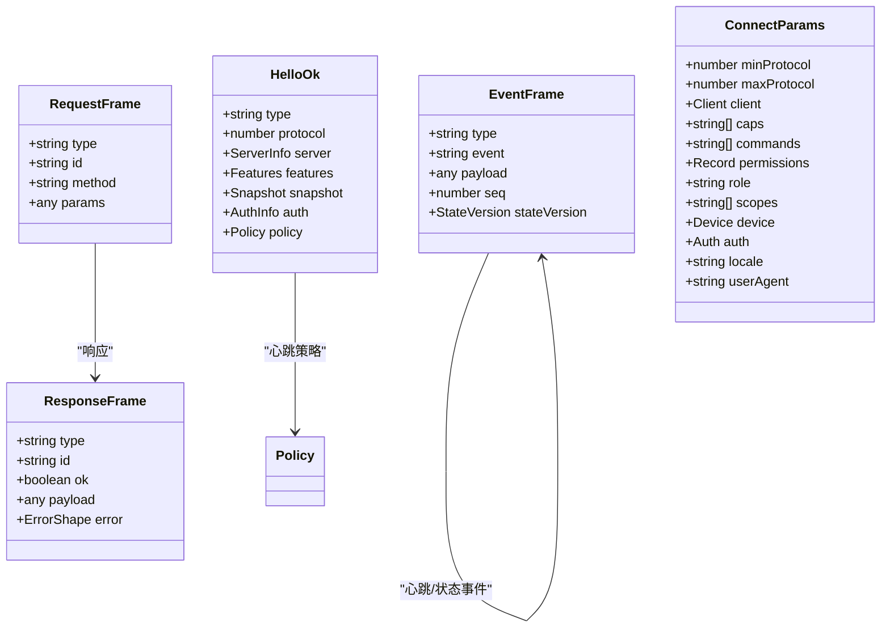
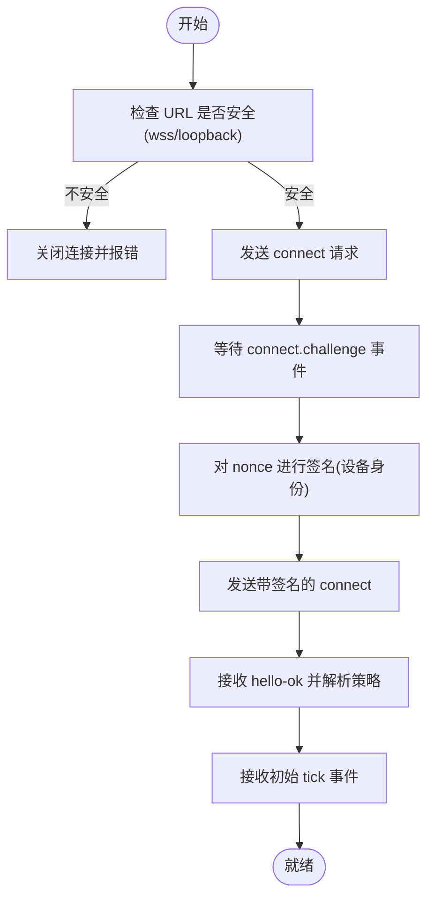
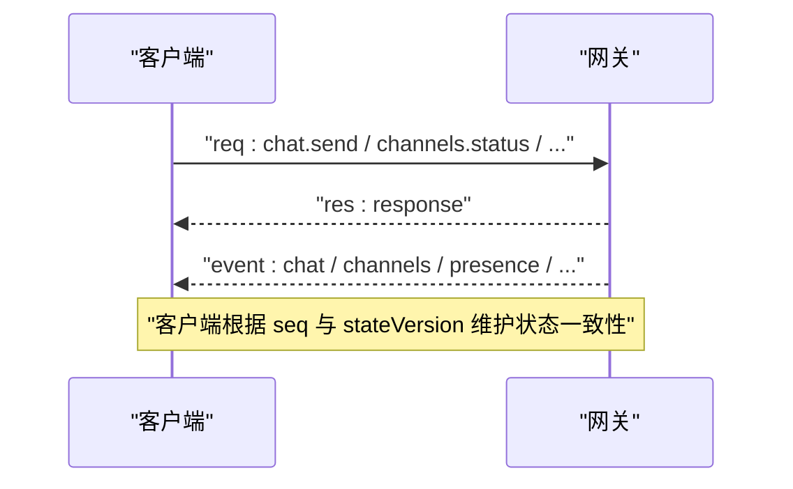
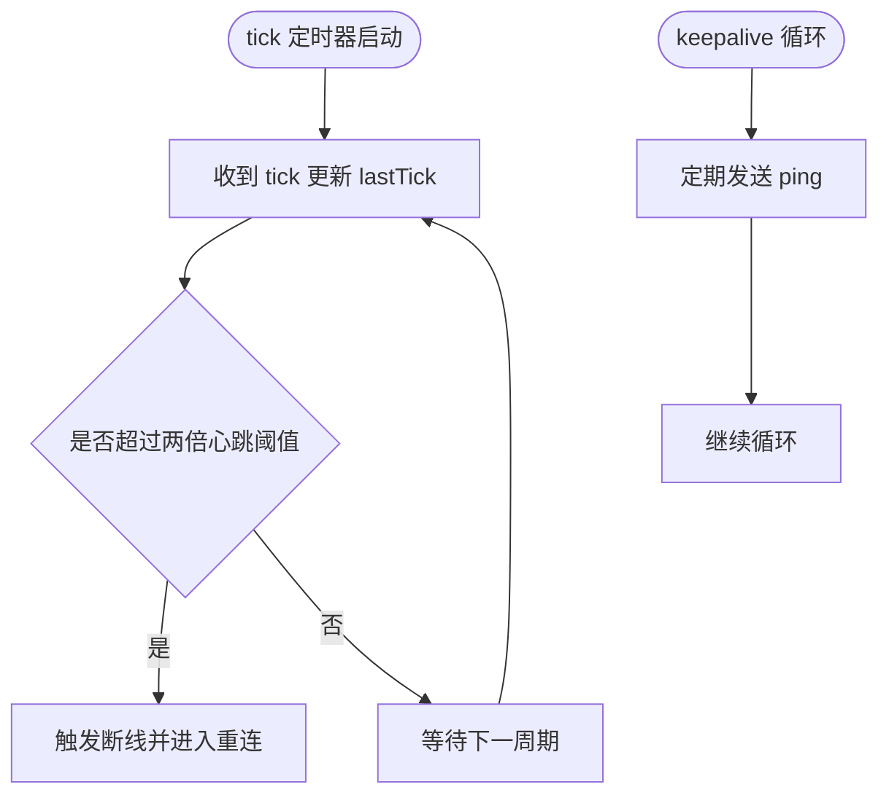
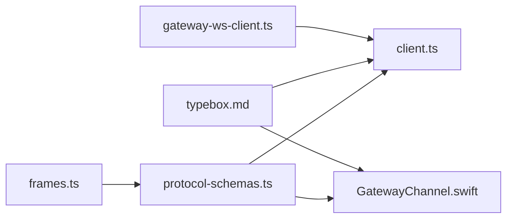
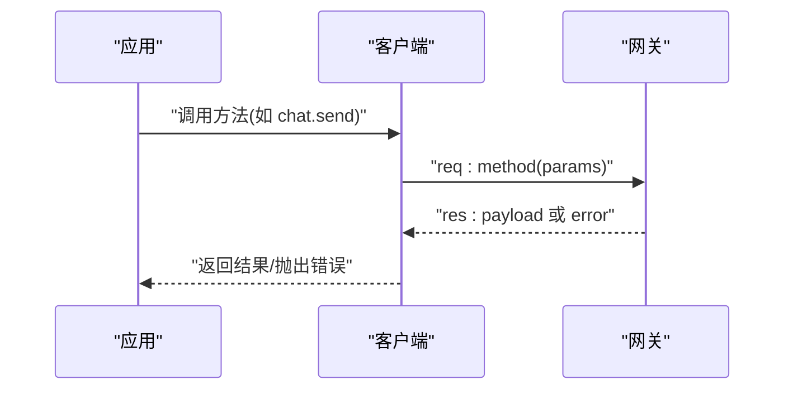

# WebSocket API

<cite>
**本文引用的文件**
- [GatewayChannel.swift](file://apps/shared/OpenClawKit/Sources/OpenClawKit/GatewayChannel.swift)
- [client.ts](file://src/gateway/client.ts)
- [frames.ts](file://src/gateway/protocol/schema/frames.ts)
- [protocol-schemas.ts](file://src/gateway/protocol/schema/protocol-schemas.ts)
- [channels.ts](file://src/gateway/protocol/schema/channels.ts)
- [typebox.md](file://docs/concepts/typebox.md)
- [protocol.md](file://docs/zh-CN/gateway/protocol.md)
- [gateway-ws-client.ts](file://scripts/dev/gateway-ws-client.ts)
</cite>

## 目录

1. [简介](#简介)
2. [项目结构](#项目结构)
3. [核心组件](#核心组件)
4. [架构总览](#架构总览)
5. [详细组件分析](#详细组件分析)
6. [依赖关系分析](#依赖关系分析)
7. [性能考量](#性能考量)
8. [故障排除指南](#故障排除指南)
9. [结论](#结论)
10. [附录](#附录)

## 简介

本文件系统化阐述 OpenClaw 网关的 WebSocket 实时通信协议与客户端实现，覆盖连接建立、消息帧格式、事件类型、状态管理、心跳保活、错误处理与重连策略，并给出聊天会话、节点通信、设备控制等实时功能的 API 规范与交互流程。目标读者既包括需要集成客户端的开发者，也包括希望理解协议细节的运维与平台工程师。

## 项目结构

OpenClaw 的 WebSocket 协议以“TypeBox 模式”为单一真实来源，驱动运行时校验、JSON Schema 导出与 Swift 代码生成；客户端实现分别提供 Node.js 与 Swift 版本，二者共享同一协议语义与行为模型。

**图表来源**

- [frames.ts:1-164](file://src/gateway/protocol/schema/frames.ts#L1-L164)
- [protocol-schemas.ts:1-302](file://src/gateway/protocol/schema/protocol-schemas.ts#L1-L302)
- [channels.ts:1-193](file://src/gateway/protocol/schema/channels.ts#L1-L193)
- [client.ts:1-674](file://src/gateway/client.ts#L1-L674)
- [GatewayChannel.swift:1-935](file://apps/shared/OpenClawKit/Sources/OpenClawKit/GatewayChannel.swift#L1-L935)
- [typebox.md:1-41](file://docs/concepts/typebox.md#L1-L41)
- [protocol.md:199-221](file://docs/zh-CN/gateway/protocol.md#L199-L221)
- [gateway-ws-client.ts](file://scripts/dev/gateway-ws-client.ts)

**章节来源**

- [frames.ts:1-164](file://src/gateway/protocol/schema/frames.ts#L1-L164)
- [protocol-schemas.ts:1-302](file://src/gateway/protocol/schema/protocol-schemas.ts#L1-L302)
- [channels.ts:1-193](file://src/gateway/protocol/schema/channels.ts#L1-L193)
- [client.ts:1-674](file://src/gateway/client.ts#L1-L674)
- [GatewayChannel.swift:1-935](file://apps/shared/OpenClawKit/Sources/OpenClawKit/GatewayChannel.swift#L1-L935)
- [typebox.md:1-41](file://docs/concepts/typebox.md#L1-L41)
- [protocol.md:199-221](file://docs/zh-CN/gateway/protocol.md#L199-L221)
- [gateway-ws-client.ts](file://scripts/dev/gateway-ws-client.ts)

## 核心组件

- 协议帧模型：统一定义三类帧（请求、响应、事件），并以判别联合类型确保下游代码生成更精确。
- 客户端：Node.js 与 Swift 双端实现，均遵循相同的握手、鉴权、事件订阅、心跳与重连策略。
- 事件与状态：包含 tick 心跳、断连检测、序列号 gap 检测、快照与状态版本字段。
- 方法与事件：通过协议模式导出完整方法集与事件集，涵盖聊天、通道、节点、会话、配置、设备、代理、技能、日志等。

**章节来源**

- [frames.ts:125-164](file://src/gateway/protocol/schema/frames.ts#L125-L164)
- [protocol-schemas.ts:162-302](file://src/gateway/protocol/schema/protocol-schemas.ts#L162-L302)
- [client.ts:109-674](file://src/gateway/client.ts#L109-L674)
- [GatewayChannel.swift:169-935](file://apps/shared/OpenClawKit/Sources/OpenClawKit/GatewayChannel.swift#L169-L935)

## 架构总览

WebSocket 客户端与网关之间的交互遵循严格的握手与帧交换顺序：先发送 connect 请求，等待 hello-ok 响应与初始 tick 事件，随后可调用任意方法并订阅所需事件。

**图表来源**

- [typebox.md:20-41](file://docs/concepts/typebox.md#L20-L41)
- [client.ts:267-415](file://src/gateway/client.ts#L267-L415)
- [GatewayChannel.swift:372-564](file://apps/shared/OpenClawKit/Sources/OpenClawKit/GatewayChannel.swift#L372-L564)

## 详细组件分析

### 协议帧与消息结构

- 帧类型
  - 请求帧：包含 type、id、method、params。
  - 响应帧：包含 type、id、ok、payload 或 error。
  - 事件帧：包含 type、event、payload、可选 seq 与 stateVersion。
- 连接参数与握手
  - connect 参数包含客户端标识、能力、权限、角色与作用域、认证信息与设备签名等。
  - hello-ok 包含协议版本、服务端信息、特性列表、快照、鉴权返回的设备令牌与策略（如心跳间隔）。
- 错误形状
  - error 字段包含 code、message、details、retryable、retryAfterMs 等，便于客户端进行可重试判断与退避。

**图表来源**

- [frames.ts:125-164](file://src/gateway/protocol/schema/frames.ts#L125-L164)
- [protocol-schemas.ts:162-302](file://src/gateway/protocol/schema/protocol-schemas.ts#L162-L302)

**章节来源**

- [frames.ts:1-164](file://src/gateway/protocol/schema/frames.ts#L1-L164)
- [protocol-schemas.ts:1-302](file://src/gateway/protocol/schema/protocol-schemas.ts#L1-L302)

### 连接建立与鉴权

- 安全要求
  - 远程连接必须使用 wss://；本地回环可使用 ws://，但不建议在生产环境开启明文。
  - 支持 TLS 指纹固定，避免中间人攻击。
- 握手流程
  - 客户端发送 connect 请求，携带 min/maxProtocol、client、caps、commands、permissions、role、scopes、auth、device 等。
  - 网关返回 hello-ok，包含策略与初始快照；同时推送 tick 事件作为保活信号。
- 设备身份与配对
  - 设备需具备稳定的设备身份；非本地连接必须对网关下发的 nonce 进行签名。
  - 控制 UI 在特定配置下可豁免设备身份，但不建议在生产使用。

**图表来源**

- [client.ts:134-251](file://src/gateway/client.ts#L134-L251)
- [client.ts:267-415](file://src/gateway/client.ts#L267-L415)
- [GatewayChannel.swift:291-345](file://apps/shared/OpenClawKit/Sources/OpenClawKit/GatewayChannel.swift#L291-L345)
- [GatewayChannel.swift:420-512](file://apps/shared/OpenClawKit/Sources/OpenClawKit/GatewayChannel.swift#L420-L512)
- [protocol.md:199-221](file://docs/zh-CN/gateway/protocol.md#L199-L221)

**章节来源**

- [client.ts:134-251](file://src/gateway/client.ts#L134-L251)
- [client.ts:267-415](file://src/gateway/client.ts#L267-L415)
- [GatewayChannel.swift:291-345](file://apps/shared/OpenClawKit/Sources/OpenClawKit/GatewayChannel.swift#L291-L345)
- [GatewayChannel.swift:420-512](file://apps/shared/OpenClawKit/Sources/OpenClawKit/GatewayChannel.swift#L420-L512)
- [protocol.md:199-221](file://docs/zh-CN/gateway/protocol.md#L199-L221)

### 事件订阅机制

- 事件类型
  - 心跳 tick：周期性推送，客户端据此检测连接存活。
  - 状态事件：如 presence、agent、channels、nodes、sessions 等，携带 stateVersion 与可选 seq。
- 订阅方式
  - 通过方法调用或网关内置订阅机制获取事件流；客户端维护 lastSeq 并在乱序或缺号时上报 gap。
- 通道与聊天
  - channels._ 与 chat._ 方法族用于通道登录、状态查询与聊天发送/注入/历史等。

**图表来源**

- [GatewayChannel.swift:592-622](file://apps/shared/OpenClawKit/Sources/OpenClawKit/GatewayChannel.swift#L592-L622)
- [channels.ts:1-193](file://src/gateway/protocol/schema/channels.ts#L1-L193)

**章节来源**

- [GatewayChannel.swift:592-622](file://apps/shared/OpenClawKit/Sources/OpenClawKit/GatewayChannel.swift#L592-L622)
- [channels.ts:1-193](file://src/gateway/protocol/schema/channels.ts#L1-L193)

### 心跳保活与断线重连

- 心跳策略
  - 网关周期性推送 tick；客户端记录 lastTick 并按策略阈值检测超时。
  - 客户端还通过 ping 保持 NAT/代理侧连接活性。
- 断线与重连
  - 指数退避重连，遇到不可恢复鉴权错误暂停重连。
  - 对设备令牌不匹配等场景提供有限次的“受信端点重试”。

**图表来源**

- [client.ts:596-618](file://src/gateway/client.ts#L596-L618)
- [client.ts:576-587](file://src/gateway/client.ts#L576-L587)
- [GatewayChannel.swift:676-696](file://apps/shared/OpenClawKit/Sources/OpenClawKit/GatewayChannel.swift#L676-L696)
- [GatewayChannel.swift:347-370](file://apps/shared/OpenClawKit/Sources/OpenClawKit/GatewayChannel.swift#L347-L370)

**章节来源**

- [client.ts:576-618](file://src/gateway/client.ts#L576-L618)
- [GatewayChannel.swift:347-370](file://apps/shared/OpenClawKit/Sources/OpenClawKit/GatewayChannel.swift#L347-L370)
- [GatewayChannel.swift:676-696](file://apps/shared/OpenClawKit/Sources/OpenClawKit/GatewayChannel.swift#L676-L696)

### 错误处理与状态管理

- 错误形态
  - 响应帧中的 error 字段包含 code、message、details、retryable、retryAfterMs。
  - 客户端将错误封装为 GatewayClientRequestError，保留网关错误码与详情。
- 鉴权错误分类
  - 包括令牌缺失、密码不匹配、速率限制、需要配对、缺少设备身份等；部分错误不可恢复，需人工介入。
- 状态与快照
  - hello-ok 中的 snapshot 与 stateVersion 用于客户端初始化与增量更新。

**章节来源**

- [frames.ts:114-123](file://src/gateway/protocol/schema/frames.ts#L114-L123)
- [client.ts:55-65](file://src/gateway/client.ts#L55-L65)
- [client.ts:417-444](file://src/gateway/client.ts#L417-L444)
- [GatewayChannel.swift:514-564](file://apps/shared/OpenClawKit/Sources/OpenClawKit/GatewayChannel.swift#L514-L564)

### API 规范（方法与事件）

- 方法族概览（基于协议模式）
  - 聊天：chat.send、chat.history、chat.abort、chat.inject
  - 通道：channels.status、channels.logout、talk.config、web 登录流程
  - 节点：node.\*（配对、描述、调用、排队、待处理等）
  - 会话：sessions.\*（列表、预览、解析、补丁、重置、删除、压缩、用量）
  - 配置：config.\*（获取、设置、应用、打补丁、模式）
  - 设备：device.\*（配对、轮换/吊销令牌）
  - 代理/技能/工具：agents._、skills._、tools._、models._
  - 日志：logs.tail
  - 其他：presence、agent、wizard、exec-approvals、cron 等
- 事件族
  - tick、presence、agent、channels._、nodes._、sessions.\*、shutdown 等

**章节来源**

- [protocol-schemas.ts:162-302](file://src/gateway/protocol/schema/protocol-schemas.ts#L162-L302)
- [channels.ts:1-193](file://src/gateway/protocol/schema/channels.ts#L1-L193)

## 依赖关系分析

- 协议到实现
  - frames.ts 与 protocol-schemas.ts 提供强类型约束，client.ts 与 GatewayChannel.swift 严格遵循该约束。
- 文档与示例
  - typebox.md 提供协议心智模型；gateway-ws-client.ts 展示最小可用连接示例。

**图表来源**

- [frames.ts:1-164](file://src/gateway/protocol/schema/frames.ts#L1-L164)
- [protocol-schemas.ts:1-302](file://src/gateway/protocol/schema/protocol-schemas.ts#L1-L302)
- [client.ts:1-674](file://src/gateway/client.ts#L1-L674)
- [GatewayChannel.swift:1-935](file://apps/shared/OpenClawKit/Sources/OpenClawKit/GatewayChannel.swift#L1-L935)
- [typebox.md:1-41](file://docs/concepts/typebox.md#L1-L41)
- [gateway-ws-client.ts](file://scripts/dev/gateway-ws-client.ts)

**章节来源**

- [frames.ts:1-164](file://src/gateway/protocol/schema/frames.ts#L1-L164)
- [protocol-schemas.ts:1-302](file://src/gateway/protocol/schema/protocol-schemas.ts#L1-L302)
- [client.ts:1-674](file://src/gateway/client.ts#L1-L674)
- [GatewayChannel.swift:1-935](file://apps/shared/OpenClawKit/Sources/OpenClawKit/GatewayChannel.swift#L1-L935)
- [typebox.md:1-41](file://docs/concepts/typebox.md#L1-L41)
- [gateway-ws-client.ts](file://scripts/dev/gateway-ws-client.ts)

## 性能考量

- 大消息支持
  - 客户端允许较大的消息载荷（例如 16MB/25MB），以支持节点快照与历史数据传输。
- 心跳与保活
  - 合理的心跳间隔与超时阈值有助于及时发现网络异常；ping 保活避免 NAT/代理层空闲回收。
- 重连退避
  - 指数退避上限控制重连频率，避免雪崩效应。

**章节来源**

- [GatewayChannel.swift:61-64](file://apps/shared/OpenClawKit/Sources/OpenClawKit/GatewayChannel.swift#L61-L64)
- [client.ts:169-173](file://src/gateway/client.ts#L169-L173)
- [GatewayChannel.swift:697-720](file://apps/shared/OpenClawKit/Sources/OpenClawKit/GatewayChannel.swift#L697-L720)
- [client.ts:576-587](file://src/gateway/client.ts#L576-L587)

## 故障排除指南

- 常见错误与定位
  - 连接挑战缺失 nonce：确认网关已推送 connect.challenge 且客户端正确解析。
  - 设备令牌不匹配：在受信端点（本地回环）可有限次自动重试；否则需人工干预。
  - 速率限制/配对需求/缺少设备身份：属于不可恢复错误，需调整配置或完成配对。
- 安全与 TLS
  - 确认使用 wss:// 或受信任的本地回环；必要时配置 TLS 指纹固定。
- 连接与断线
  - 若心跳超时，检查网络质量与 NAT/代理策略；观察 ping 是否成功。
- 开发调试
  - 使用开发脚本快速验证连接与基本方法调用。

**章节来源**

- [client.ts:267-415](file://src/gateway/client.ts#L267-L415)
- [GatewayChannel.swift:420-512](file://apps/shared/OpenClawKit/Sources/OpenClawKit/GatewayChannel.swift#L420-L512)
- [client.ts:417-444](file://src/gateway/client.ts#L417-L444)
- [GatewayChannel.swift:747-760](file://apps/shared/OpenClawKit/Sources/OpenClawKit/GatewayChannel.swift#L747-L760)
- [protocol.md:199-221](file://docs/zh-CN/gateway/protocol.md#L199-L221)
- [gateway-ws-client.ts](file://scripts/dev/gateway-ws-client.ts)

## 结论

OpenClaw 的 WebSocket 协议以 TypeBox 模式为核心，确保了跨语言实现的一致性与强类型安全；两端客户端在握手、鉴权、事件订阅、心跳保活与错误处理方面保持高度一致。通过合理的安全策略、心跳与重连机制，以及完善的错误分类，协议能够满足聊天会话、节点通信、设备控制等复杂实时场景的需求。

## 附录

### 连接示例（Node.js）

- 使用开发脚本进行最小化连接验证，参考：
  - [gateway-ws-client.ts](file://scripts/dev/gateway-ws-client.ts)

**章节来源**

- [gateway-ws-client.ts](file://scripts/dev/gateway-ws-client.ts)

### 关键流程图（方法调用序列）

**图表来源**

- [client.ts:647-672](file://src/gateway/client.ts#L647-L672)
- [GatewayChannel.swift:793-800](file://apps/shared/OpenClawKit/Sources/OpenClawKit/GatewayChannel.swift#L793-L800)
