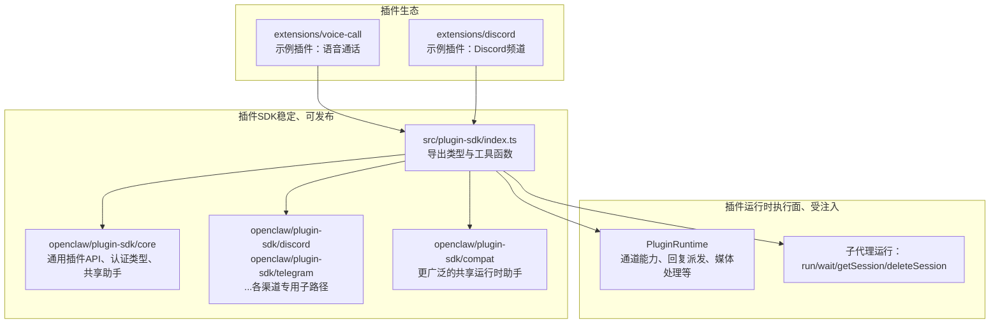
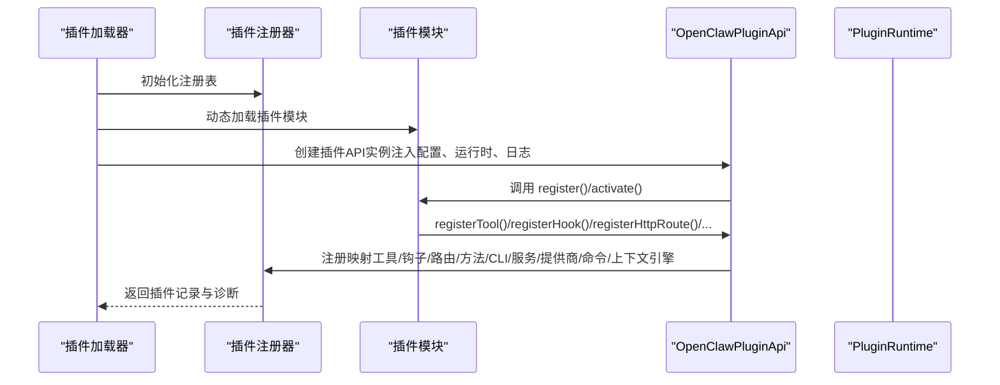
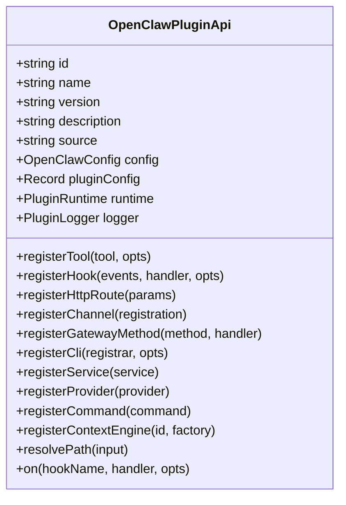
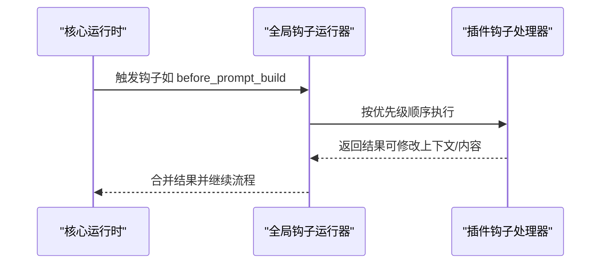
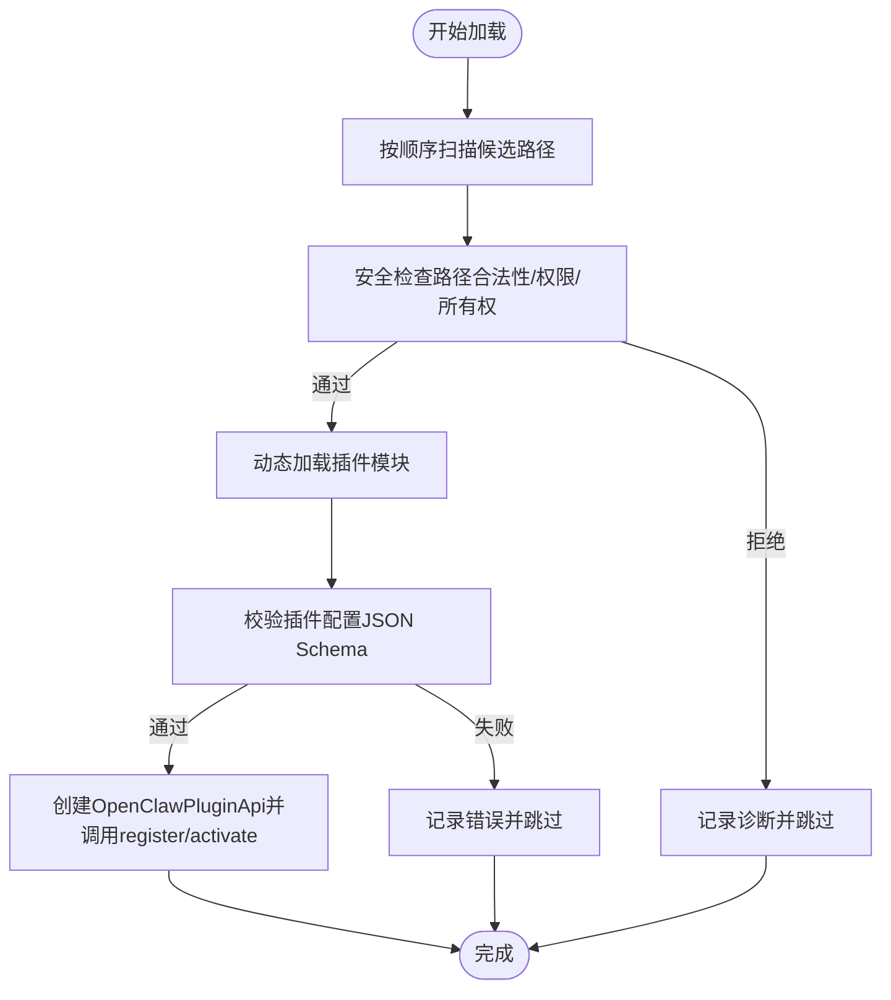
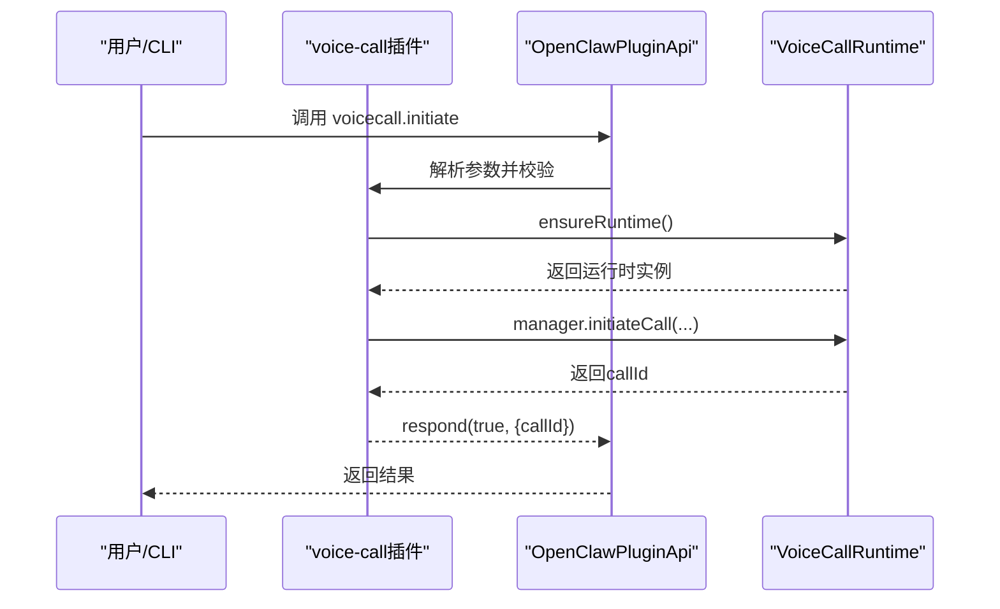
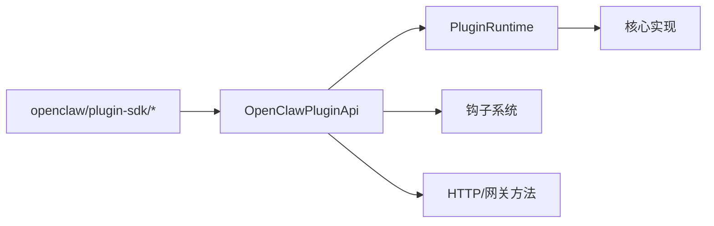

# 插件API

<cite>
**本文引用的文件**
- [index.ts](file://src/plugin-sdk/index.ts)
- [plugin-sdk.md](file://docs/refactor/plugin-sdk.md)
- [plugin.md](file://docs/tools/plugin.md)
- [types.ts](file://src/plugins/types.ts)
- [types.ts](file://src/plugins/runtime/types.ts)
- [types.ts](file://src/channels/plugins/types.ts)
- [runtime.ts](file://src/plugins/runtime.ts)
- [loader.ts](file://src/plugins/loader.ts)
- [registry.ts](file://src/plugins/registry.ts)
- [hook-runner-global.ts](file://src/plugins/hook-runner-global.ts)
- [hooks.ts](file://src/plugins/hooks.ts)
- [openclaw.plugin.json](file://extensions/voice-call/openclaw.plugin.json)
- [index.ts](file://extensions/voice-call/index.ts)
- [openclaw.plugin.json](file://extensions/discord/openclaw.plugin.json)
- [index.ts](file://extensions/discord/index.ts)
</cite>

## 目录

1. [简介](#简介)
2. [项目结构](#项目结构)
3. [核心组件](#核心组件)
4. [架构总览](#架构总览)
5. [详细组件分析](#详细组件分析)
6. [依赖关系分析](#依赖关系分析)
7. [性能考量](#性能考量)
8. [故障排查指南](#故障排查指南)
9. [结论](#结论)
10. [附录](#附录)

## 简介

本文件系统化阐述 OpenClaw 插件系统的 API 接口与运行机制，覆盖插件注册、生命周期管理、方法暴露、事件通信、SDK 规范与集成模式，并提供开发示例、调试与发布流程建议。目标读者既包括需要快速上手的插件开发者，也包括希望理解系统内部实现的技术人员。

## 项目结构

OpenClaw 的插件体系由“插件 SDK（稳定、可发布）+ 插件运行时（执行面、受注入）”两层组成，所有插件通过统一的 OpenClawPluginApi 进行注册与交互，避免直接导入核心源码，确保升级与扩展的稳定性与安全性。



图表来源

- [index.ts:1-826](file://src/plugin-sdk/index.ts#L1-L826)
- [plugin-sdk.md:19-145](file://docs/refactor/plugin-sdk.md#L19-L145)

章节来源

- [plugin-sdk.md:1-215](file://docs/refactor/plugin-sdk.md#L1-L215)
- [plugin.md:1-180](file://docs/tools/plugin.md#L1-L180)

## 核心组件

- 插件 API（OpenClawPluginApi）
  - 职责：为插件提供统一注册入口与运行时访问点，包括工具注册、钩子注册、HTTP 路由、网关方法、CLI、服务、提供商、命令、上下文引擎等。
  - 关键字段与方法：id/name/version/description/source/config/pluginConfig/runtime/logger/register\* 等。
- 插件运行时（PluginRuntime）
  - 职责：封装对核心行为的只读访问，如通道文本处理、回复派发、路由解析、配对、媒体抓取与保存、提及匹配、群组策略、去抖动、命令授权等；同时提供子代理运行能力。
- 插件类型与钩子
  - 类型：OpenClawPluginConfigSchema、OpenClawPluginToolContext、OpenClawPluginCommandDefinition、OpenClawPluginHttpRouteParams、OpenClawPluginService、ProviderPlugin 等。
  - 钩子：包括 before*model_resolve、before_prompt_build、before_agent_start、llm_input、llm_output、agent_end、before_compaction、after_compaction、before_reset、message*_、tool\__、before*message_write、session*_、subagent\__、gateway\_\* 等。
- 插件加载与注册
  - 加载器负责发现、校验、实例化与激活插件，生成插件记录与诊断信息；注册器将插件 API 注入到插件模块中，建立工具、钩子、HTTP 路由、网关方法、CLI、服务、提供商、命令、上下文引擎等映射。

章节来源

- [types.ts:263-306](file://src/plugins/types.ts#L263-L306)
- [types.ts:51-63](file://src/plugins/runtime/types.ts#L51-L63)
- [types.ts:321-377](file://src/plugins/types.ts#L321-L377)
- [registry.ts:575-608](file://src/plugins/registry.ts#L575-L608)
- [loader.ts:256-284](file://src/plugins/loader.ts#L256-L284)

## 架构总览

OpenClaw 插件系统采用“SDK + 运行时”的分层设计，插件通过 OpenClawPluginApi 访问运行时能力，运行时再对接核心实现，保证无副作用、可测试与可演进。



图表来源

- [registry.ts:575-608](file://src/plugins/registry.ts#L575-L608)
- [loader.ts:769-773](file://src/plugins/loader.ts#L769-L773)

章节来源

- [plugin-sdk.md:19-145](file://docs/refactor/plugin-sdk.md#L19-L145)
- [plugin.md:484-521](file://docs/tools/plugin.md#L484-L521)

## 详细组件分析

### 组件A：插件API（OpenClawPluginApi）

- 能力边界
  - 工具注册：支持工厂函数或直接工具对象，可声明名称、别名与可选性。
  - 钩子注册：支持字符串或数组事件名，带选项（名称、描述、是否默认注册）。
  - HTTP 路由：支持精确匹配与前缀匹配、替换现有路由、认证级别（gateway/plugin）。
  - 网关方法：注册 RPC 方法，供外部调用。
  - CLI：注册命令行子程序，支持声明命令集合。
  - 服务：声明后台服务（启动/停止），由运行时托管。
  - 提供商：注册模型提供商认证流程（OAuth/API Key/设备码等）。
  - 命令：注册自定义命令（绕过 LLM），优先于内置命令与代理调用。
  - 上下文引擎：注册独占槽位的上下文引擎实现。
  - 其他：路径解析、生命周期钩子（on）、运行时访问（runtime）。
- 安全与约束
  - 所有插件必须通过 manifest 与 JSON Schema 进行配置校验，不执行插件代码即可验证。
  - 插件不得直接导入 src/\*\*，需通过 SDK 或运行时访问核心行为。
  - 禁止重复注册相同路径（exact/prefix 冲突需 replaceExisting 显式允许）。
  - 网关方法与 HTTP 路由均需显式声明认证级别。



图表来源

- [types.ts:263-306](file://src/plugins/types.ts#L263-L306)

章节来源

- [types.ts:263-306](file://src/plugins/types.ts#L263-L306)
- [plugin.md:114-145](file://docs/tools/plugin.md#L114-L145)

### 组件B：插件运行时（PluginRuntime）

- 通道能力
  - 文本：分块、文本长度解析、控制命令识别。
  - 回复：缓冲派发器、打字模拟适配。
  - 路由：会话键解析。
  - 配对：构建配对回复、读取允许列表、请求配对。
  - 媒体：远程媒体抓取、本地保存。
  - 提及：正则构建与匹配。
  - 群组：策略解析、是否需要提及。
  - 去抖动：批量刷新与错误回调。
  - 命令：授权判定。
- 子代理运行
  - run/waitForRun/getSessionMessages/getSession/deleteSession
- 日志与状态
  - 日志开关、子日志器、状态目录解析。

```mermaid
classDiagram
class PluginRuntime {
+channel : PluginRuntimeChannel
+subagent : {
run(params)
waitForRun(params)
getSessionMessages(params)
getSession(params)
deleteSession(params)
}
+logging : {
shouldLogVerbose()
getChildLogger(name)
}
+state : {
resolveStateDir(cfg)
}
}
```

图表来源

- [types.ts:51-63](file://src/plugins/runtime/types.ts#L51-L63)

章节来源

- [plugin-sdk.md:40-145](file://docs/refactor/plugin-sdk.md#L40-L145)
- [types.ts:8-63](file://src/plugins/runtime/types.ts#L8-L63)

### 组件C：插件生命周期与钩子

- 生命周期钩子
  - before_model_resolve：覆盖模型/提供商。
  - before_prompt_build：拼接系统提示、前置/后置上下文。
  - before_agent_start：兼容旧版合并钩子。
  - llm_input/llm_output：输入输出事件。
  - agent_end：结束事件。
  - before_compaction/after_compaction：压缩前后事件。
  - before_reset：会话重置事件。
  - message\_\*：消息收发事件。
  - tool\_\*：工具调用前后事件。
  - before_message_write：写入前拦截。
  - session\_\*：会话开始/结束。
  - subagent\_\*：子代理孵化/交付/结束。
  - gateway\_\*：网关启动/停止。
- 全局钩子运行器
  - 在插件加载时初始化，可在系统任意位置触发。



图表来源

- [hook-runner-global.ts:36-46](file://src/plugins/hook-runner-global.ts#L36-L46)
- [hooks.ts:685-705](file://src/plugins/hooks.ts#L685-L705)

章节来源

- [types.ts:321-377](file://src/plugins/types.ts#L321-L377)
- [hook-runner-global.ts:1-46](file://src/plugins/hook-runner-global.ts#L1-L46)
- [hooks.ts:685-723](file://src/plugins/hooks.ts#L685-L723)

### 组件D：插件发现、加载与安全

- 发现顺序
  - 配置路径 -> 工作区扩展 -> 全局扩展 -> 内置扩展。
- 安全加固
  - 路径安全检查（防止越权、世界可写、可疑所有权）。
  - 未安装/未追踪插件发出警告，建议使用 plugins.allow 或安装记录。
  - 缓存窗口可调（插件发现与清单缓存）。
- 配置与验证
  - 严格校验未知插件 ID、未知通道键、禁用插件仍保留配置并告警。
  - 插件配置通过 JSON Schema 校验，支持 UI 提示（uiHints）。



图表来源

- [plugin.md:228-304](file://docs/tools/plugin.md#L228-L304)
- [loader.ts:256-284](file://src/plugins/loader.ts#L256-L284)

章节来源

- [plugin.md:228-304](file://docs/tools/plugin.md#L228-L304)
- [loader.ts:412-440](file://src/plugins/loader.ts#L412-L440)

### 组件E：插件开发示例（语音通话插件）

- 清单与配置
  - openclaw.plugin.json 提供 configSchema 与 uiHints，定义插件配置项与 UI 提示。
- 注册与运行
  - 在 register 中解析配置、校验提供商参数、创建运行时、注册网关方法（initiate/continue/speak/end/status/start）、注册工具、CLI 与服务。
- 安全与容错
  - 对弃用字段给出警告；失败时重置运行时以避免端口孤儿问题。



图表来源

- [openclaw.plugin.json:162-599](file://extensions/voice-call/openclaw.plugin.json#L162-L599)
- [index.ts:151-375](file://extensions/voice-call/index.ts#L151-L375)

章节来源

- [openclaw.plugin.json:1-601](file://extensions/voice-call/openclaw.plugin.json#L1-L601)
- [index.ts:1-543](file://extensions/voice-call/index.ts#L1-L543)

### 组件F：频道插件（Discord 示例）

- 清单与频道
  - openclaw.plugin.json 声明 channels: ["discord"]，表示该插件注册一个 Discord 频道。
- 注册与运行
  - 在 register 中设置运行时、注册频道插件、注册子代理钩子。

章节来源

- [openclaw.plugin.json:1-10](file://extensions/discord/openclaw.plugin.json#L1-L10)
- [index.ts:1-20](file://extensions/discord/index.ts#L1-L20)

## 依赖关系分析

- 插件 SDK 与运行时
  - SDK 仅导出类型与工具，不包含运行时状态；运行时通过注入方式提供核心能力。
- 插件与核心
  - 插件只能通过 api.runtime 访问核心行为，禁止直接导入 src/\*\*。
- 插件间耦合
  - 通过钩子与共享运行时进行松耦合协作；HTTP 路由与网关方法遵循唯一性与认证约束。



图表来源

- [index.ts:1-826](file://src/plugin-sdk/index.ts#L1-L826)
- [types.ts:263-306](file://src/plugins/types.ts#L263-L306)
- [types.ts:51-63](file://src/plugins/runtime/types.ts#L51-L63)

章节来源

- [plugin-sdk.md:19-145](file://docs/refactor/plugin-sdk.md#L19-L145)
- [plugin.md:484-521](file://docs/tools/plugin.md#L484-L521)

## 性能考量

- 插件发现与清单缓存
  - 支持禁用与调整缓存窗口，减少启动/重载时的重复工作。
- 钩子执行
  - 按优先级顺序执行，注意合并与覆盖规则，避免过度修改导致额外开销。
- 子代理运行
  - 使用 run/waitForRun/getSessionMessages 管理会话与等待，避免阻塞主流程。
- HTTP 路由
  - 精确匹配优先，避免过多前缀匹配链带来的查找成本。

章节来源

- [plugin.md:219-227](file://docs/tools/plugin.md#L219-L227)
- [types.ts:8-63](file://src/plugins/runtime/types.ts#L8-L63)

## 故障排查指南

- 常见错误与修复
  - 使用已废弃 API：如 api.registerHttpHandler(...) 已被移除，请改用 api.registerHttpRoute(...) 或动态生命周期路由注册。
  - 配置无效：检查 JSON Schema 校验错误，修正字段或值。
  - 重复路由冲突：同一 exact/prefix 路径冲突需启用 replaceExisting 或调整路径。
  - 未安装插件：未追踪的非内置插件会发出警告，建议通过 plugins.allow 或安装记录进行信任管理。
- 诊断与日志
  - 使用 openclaw plugins doctor 查看诊断信息。
  - 插件运行时错误会记录在插件记录中，便于定位。

章节来源

- [loader.ts:256-284](file://src/plugins/loader.ts#L256-L284)
- [plugin.md:476-483](file://docs/tools/plugin.md#L476-L483)

## 结论

OpenClaw 插件系统通过“SDK + 运行时”的清晰分层，提供了稳定、可扩展且安全的插件开发与运行环境。开发者只需遵循统一的 API 规范与安全约束，即可快速构建工具、命令、HTTP 路由、网关方法、CLI、服务与上下文引擎，实现从简单自动化到复杂业务集成的多种场景。

## 附录

### A. 插件开发步骤（实践清单）

- 准备清单
  - 编写 openclaw.plugin.json（id、configSchema、uiHints、channels 等）。
  - 设计插件模块结构（register/activate 导出）。
- 实现注册
  - 在 register 中解析配置、校验参数、创建运行时（如需）、注册工具/钩子/HTTP 路由/网关方法/CLI/服务/提供商/命令/上下文引擎。
- 安全与兼容
  - 遵循 SDK 导入路径（openclaw/plugin-sdk/\*），避免直接导入 src/\*\*。
  - 处理弃用字段与兼容逻辑。
- 测试与发布
  - 使用 openclaw plugins doctor 检查诊断。
  - 通过 openclaw plugins install/update 管理安装与更新。
  - 如需外部发布，遵循 npm 规范（registry-only，不接受 semver 范围）。

章节来源

- [plugin.md:1-80](file://docs/tools/plugin.md#L1-L80)
- [plugin.md:460-521](file://docs/tools/plugin.md#L460-L521)
