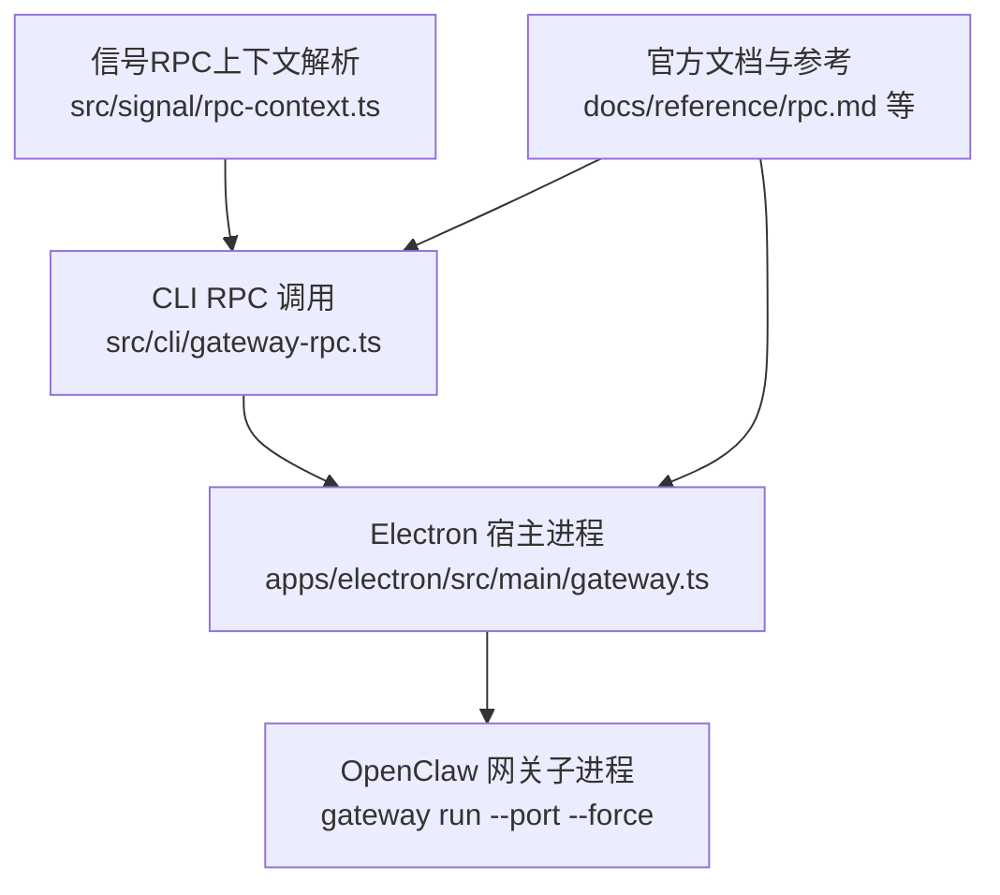
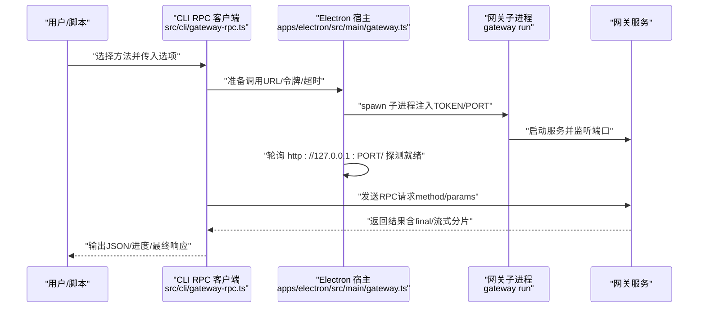
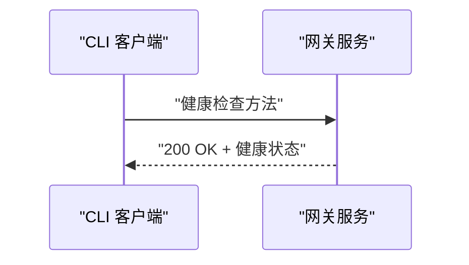
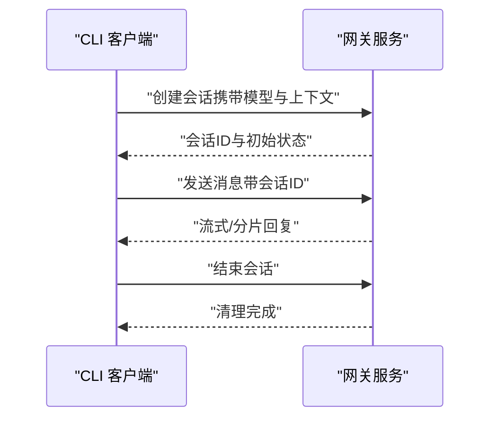
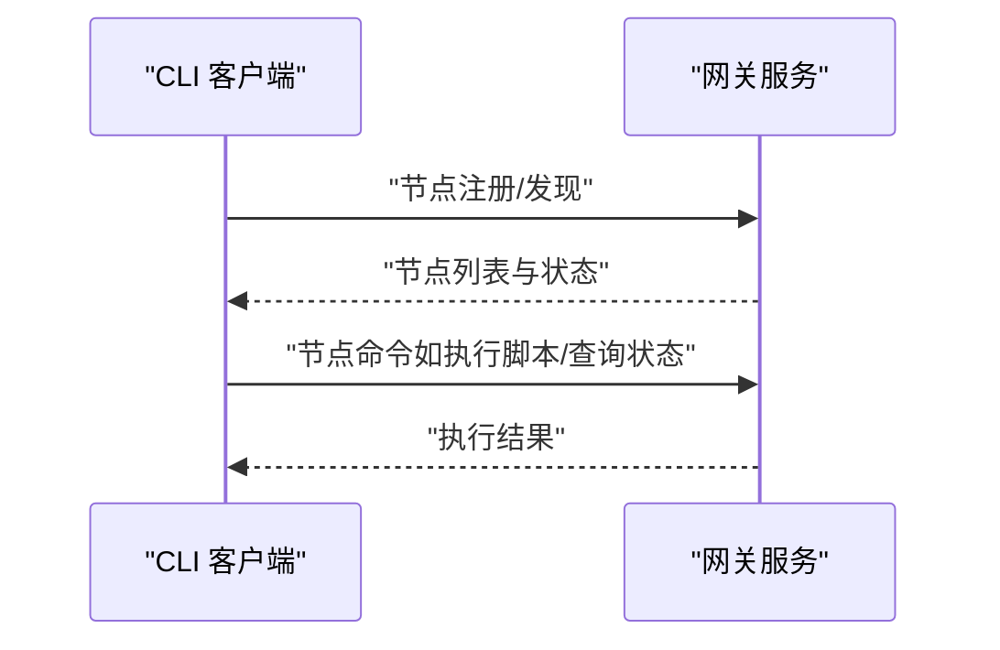
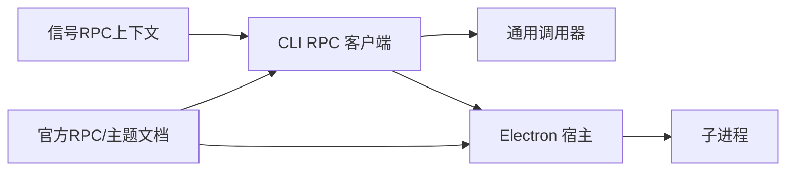

# 网关方法

<cite>
**本文引用的文件**
- [src/cli/gateway-rpc.ts](file://src/cli/gateway-rpc.ts)
- [apps/electron/src/main/gateway.ts](file://apps/electron/src/main/gateway.ts)
- [src/signal/rpc-context.ts](file://src/signal/rpc-context.ts)
- [docs/reference/rpc.md](file://docs/reference/rpc.md)
- [docs/gateway/index.md](file://docs/gateway/index.md)
- [docs/gateway/health.md](file://docs/gateway/health.md)
- [docs/gateway/configuration.md](file://docs/gateway/configuration.md)
- [docs/gateway/pairing.md](file://docs/gateway/pairing.md)
- [docs/gateway/authentication.md](file://docs/gateway/authentication.md)
- [docs/gateway/heartbeat.md](file://docs/gateway/heartbeat.md)
- [docs/cli/gateway.md](file://docs/cli/gateway.md)
- [docs/concepts/session.md](file://docs/concepts/session.md)
- [docs/concepts/agent.md](file://docs/concepts/agent.md)
- [docs/concepts/model-providers.md](file://docs/concepts/model-providers.md)
- [docs/channels/index.md](file://docs/channels/index.md)
- [extensions/*/README.md](file://extensions/feishu/README.md)
</cite>

## 目录

1. [简介](#简介)
2. [项目结构](#项目结构)
3. [核心组件](#核心组件)
4. [架构总览](#架构总览)
5. [详细组件分析](#详细组件分析)
6. [依赖关系分析](#依赖关系分析)
7. [性能考量](#性能考量)
8. [故障排查指南](#故障排查指南)
9. [结论](#结论)
10. [附录](#附录)

## 简介

本文件面向OpenClaw网关的RPC方法，系统性梳理其核心能力与调用方式，覆盖健康检查、配置管理、会话控制、节点操作等关键功能，并按“基础方法、通道方法、插件方法”进行分类说明。文档同时给出调用示例、最佳实践与性能建议，帮助开发者与运维人员高效、安全地集成与使用网关。

## 项目结构

围绕网关RPC方法的关键代码与文档分布如下：

- CLI层：封装RPC调用选项与执行流程，统一透传URL、令牌、超时等参数。
- Electron宿主：负责本地子进程启动、端口绑定、令牌注入与就绪探测。
- 信号上下文解析：为RPC调用提供账户与基地址解析逻辑。
- 文档与参考：官方RPC规范、网关健康、配置、配对、认证、心跳等主题文档。

**图表来源**

- [src/cli/gateway-rpc.ts:1-48](file://src/cli/gateway-rpc.ts#L1-L48)
- [apps/electron/src/main/gateway.ts:100-151](file://apps/electron/src/main/gateway.ts#L100-L151)
- [src/signal/rpc-context.ts:1-25](file://src/signal/rpc-context.ts#L1-L25)

**章节来源**

- [src/cli/gateway-rpc.ts:1-48](file://src/cli/gateway-rpc.ts#L1-L48)
- [apps/electron/src/main/gateway.ts:100-151](file://apps/electron/src/main/gateway.ts#L100-L151)
- [src/signal/rpc-context.ts:1-25](file://src/signal/rpc-context.ts#L1-L25)

## 核心组件

- CLI RPC客户端：提供统一的RPC调用入口，支持URL、令牌、超时、最终响应等待等选项；内部通过通用调用器发起请求。
- Electron网关宿主：以子进程形式启动网关，绑定本地回环端口，注入令牌与端口环境变量，轮询检测就绪状态。
- 信号RPC上下文：解析Signal相关RPC所需的基地址与账户信息，确保调用链路具备必要上下文。
- 官方RPC参考与主题文档：定义方法集合、参数与返回值规范，以及健康检查、配对、认证、心跳等专题。

**章节来源**

- [src/cli/gateway-rpc.ts:22-47](file://src/cli/gateway-rpc.ts#L22-L47)
- [apps/electron/src/main/gateway.ts:100-151](file://apps/electron/src/main/gateway.ts#L100-L151)
- [src/signal/rpc-context.ts:4-24](file://src/signal/rpc-context.ts#L4-L24)
- [docs/reference/rpc.md](file://docs/reference/rpc.md)

## 架构总览

下图展示从CLI到网关子进程的典型调用链路，以及Electron宿主如何管理网关生命周期。

**图表来源**

- [src/cli/gateway-rpc.ts:22-47](file://src/cli/gateway-rpc.ts#L22-L47)
- [apps/electron/src/main/gateway.ts:100-151](file://apps/electron/src/main/gateway.ts#L100-L151)

## 详细组件分析

### CLI RPC 客户端

- 功能要点
  - 选项：URL、令牌、超时、是否等待最终响应、JSON输出模式。
  - 行为：根据是否JSON模式决定是否显示进度条；统一透传到通用调用器。
  - 客户端标识：记录客户端名称与模式，便于网关侧审计与统计。
- 参数与返回
  - 输入：方法名、选项对象、可选参数、额外控制（如是否等待最终响应、是否显示进度）。
  - 输出：RPC调用结果，支持流式分片与最终聚合。
- 权限与安全
  - 令牌通过环境变量注入，避免命令行参数泄露；建议仅在受信环境中使用。
- 最佳实践
  - 明确设置超时，避免长时间阻塞。
  - 在自动化场景中启用JSON输出，便于解析。
  - 使用“等待最终响应”选项获取完整结果（适用于需要聚合的长流程）。

**章节来源**

- [src/cli/gateway-rpc.ts:6-20](file://src/cli/gateway-rpc.ts#L6-L20)
- [src/cli/gateway-rpc.ts:22-47](file://src/cli/gateway-rpc.ts#L22-L47)

### Electron 网关宿主

- 功能要点
  - 解析捆绑的Node与OpenClaw入口，支持打包与开发两种模式。
  - 读取现有配置中的网关令牌，复用以保持UI会话连续性。
  - 子进程启动网关，注入TOKEN与PORT环境变量，标准输出/错误重定向。
  - 就绪探测：轮询HTTP端点，遇到非5xx状态即认为就绪。
  - 生命周期：提供启动、停止、重启能力，重启前等待端口释放。
- 配置与端口
  - 默认端口与强制覆盖策略，避免冲突。
- 最佳实践
  - 首次启动前确保令牌可用；若无则由上层生成并注入。
  - 监控子进程日志，定位启动失败原因。
  - 更新配置后使用重启流程，确保新配置生效。

**章节来源**

- [apps/electron/src/main/gateway.ts:14-176](file://apps/electron/src/main/gateway.ts#L14-L176)

### 信号RPC上下文解析

- 功能要点
  - 当缺少基地址或账户时，自动解析当前配置中的账户信息。
  - 校验基地址必填，否则抛出错误。
- 适用场景
  - 与Signal相关的RPC调用，确保上下文完整。

**章节来源**

- [src/signal/rpc-context.ts:4-24](file://src/signal/rpc-context.ts#L4-L24)

### 方法分类与调用示例

#### 基础方法

- 健康检查
  - 用途：确认网关运行状态与可达性。
  - 调用方式：通过CLI或任意RPC客户端向网关发送健康检查方法。
  - 参数：无或极简。
  - 返回：状态码与简要信息。
  - 权限：通常无需认证。
  - 参考：见官方健康检查文档。
- 系统状态
  - 用途：查询网关版本、运行时间、资源占用等。
  - 调用方式：CLI或HTTP/WebSocket均可。
  - 权限：视部署策略而定，常见为管理员或受信范围。
- 配置读取/写入
  - 用途：读取或更新网关配置（如端口、令牌、通道与插件配置）。
  - 调用方式：CLI或RPC客户端。
  - 权限：仅允许受信账户或管理员。
  - 参考：见官方配置文档。

**章节来源**

- [docs/gateway/health.md](file://docs/gateway/health.md)
- [docs/gateway/configuration.md](file://docs/gateway/configuration.md)
- [docs/cli/gateway.md](file://docs/cli/gateway.md)

#### 通道方法

- 用途：对接各类消息通道（如Discord、Slack、Telegram等），实现消息路由、群组管理、事件订阅等。
- 调用方式：通过网关RPC方法提交通道特定参数（如频道ID、群组ID、消息内容等）。
- 权限：需具备对应通道的授权凭据与角色权限。
- 参考：各通道独立文档与示例。

**章节来源**

- [docs/channels/index.md](file://docs/channels/index.md)
- [extensions/\*/README.md](file://extensions/feishu/README.md)

#### 插件方法

- 用途：加载、卸载、启停插件，查询插件状态与版本，触发插件内工具或技能。
- 调用方式：通过网关RPC方法传递插件标识与参数。
- 权限：仅管理员或受信账户。
- 参考：插件SDK与清单规范。

**章节来源**

- [docs/plugins/manifest.md](file://docs/plugins/manifest.md)
- [docs/plugins/agent-tools.md](file://docs/plugins/agent-tools.md)

### 调用序列示例

#### 健康检查序列

**图表来源**

- [docs/gateway/health.md](file://docs/gateway/health.md)

#### 会话控制序列

**图表来源**

- [docs/concepts/session.md](file://docs/concepts/session.md)
- [docs/concepts/agent.md](file://docs/concepts/agent.md)

#### 节点操作序列

**图表来源**

- [docs/nodes/index.md](file://docs/nodes/index.md)

## 依赖关系分析

- CLI RPC客户端依赖通用调用器与Electron宿主提供的子进程管理。
- Electron宿主依赖Node与OpenClaw入口，通过环境变量注入令牌与端口。
- 信号RPC上下文解析依赖配置加载与账户解析模块。
- 官方文档与参考为RPC方法提供权威约束与示例。

**图表来源**

- [src/cli/gateway-rpc.ts:22-47](file://src/cli/gateway-rpc.ts#L22-L47)
- [apps/electron/src/main/gateway.ts:100-151](file://apps/electron/src/main/gateway.ts#L100-L151)
- [src/signal/rpc-context.ts:1-25](file://src/signal/rpc-context.ts#L1-L25)

**章节来源**

- [src/cli/gateway-rpc.ts:22-47](file://src/cli/gateway-rpc.ts#L22-L47)
- [apps/electron/src/main/gateway.ts:100-151](file://apps/electron/src/main/gateway.ts#L100-L151)
- [src/signal/rpc-context.ts:1-25](file://src/signal/rpc-context.ts#L1-L25)

## 性能考量

- 超时设置：为所有RPC调用配置合理超时，避免长时间阻塞导致资源浪费。
- 流式响应：对于长耗时任务，优先采用流式分片返回，前端可渐进渲染。
- 并发控制：限制并发RPC数量，避免网关过载。
- 缓存与复用：对频繁访问的配置与元数据进行缓存，减少重复请求。
- 端口与网络：本地回环端口具备低延迟优势；跨网络调用应考虑TLS与代理配置。

[本节为通用指导，不直接分析具体文件]

## 故障排查指南

- 启动失败
  - 检查Node版本与OpenClaw入口路径解析是否正确。
  - 查看子进程标准输出/错误日志，定位异常。
- 无法就绪
  - 确认端口未被占用；使用“强制覆盖”策略或更换端口。
  - 观察就绪轮询日志，关注HTTP状态码。
- 认证失败
  - 确认令牌已正确注入环境变量且未被截断。
  - 检查令牌有效期与作用域。
- 健康检查异常
  - 使用官方健康检查文档核对期望行为与返回格式。
- 通道/插件问题
  - 根据对应通道或插件文档排查权限与配置。

**章节来源**

- [apps/electron/src/main/gateway.ts:78-94](file://apps/electron/src/main/gateway.ts#L78-L94)
- [docs/gateway/health.md](file://docs/gateway/health.md)
- [docs/gateway/authentication.md](file://docs/gateway/authentication.md)

## 结论

OpenClaw网关通过CLI RPC客户端、Electron宿主与官方文档形成完整的调用体系。遵循本文的分类、参数规范、权限要求与最佳实践，可在保障安全与性能的前提下，稳定地使用健康检查、配置管理、会话控制与节点操作等核心能力。

[本节为总结性内容，不直接分析具体文件]

## 附录

- 官方RPC参考与主题文档索引
  - [RPC参考](file://docs/reference/rpc.md)
  - [网关首页](file://docs/gateway/index.md)
  - [健康检查](file://docs/gateway/health.md)
  - [配置管理](file://docs/gateway/configuration.md)
  - [配对机制](file://docs/gateway/pairing.md)
  - [认证策略](file://docs/gateway/authentication.md)
  - [心跳与保活](file://docs/gateway/heartbeat.md)
  - [CLI网关命令](file://docs/cli/gateway.md)
  - [会话概念](file://docs/concepts/session.md)
  - [Agent概念](file://docs/concepts/agent.md)
  - [模型提供方](file://docs/concepts/model-providers.md)
  - [通道总览](file://docs/channels/index.md)

[本节为索引性内容，不直接分析具体文件]
