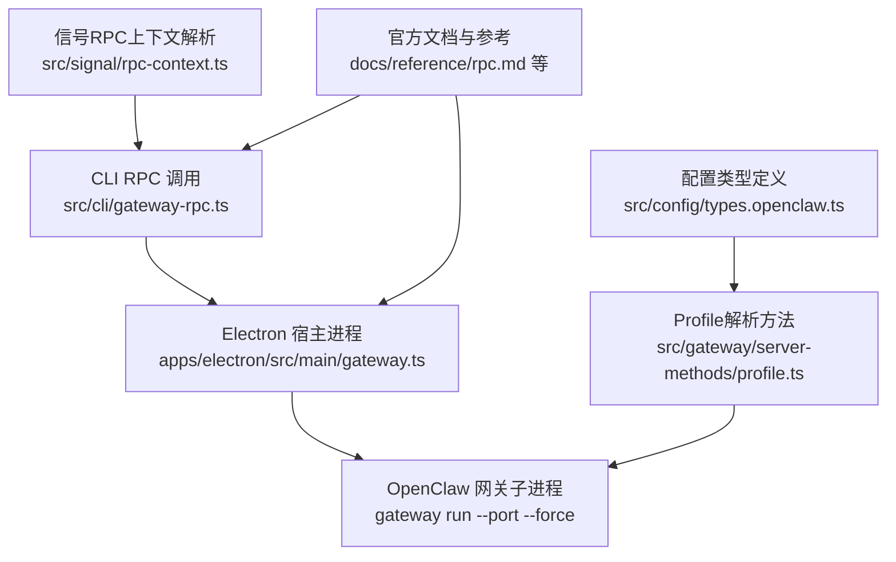
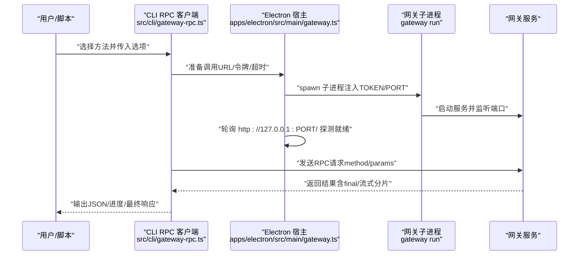
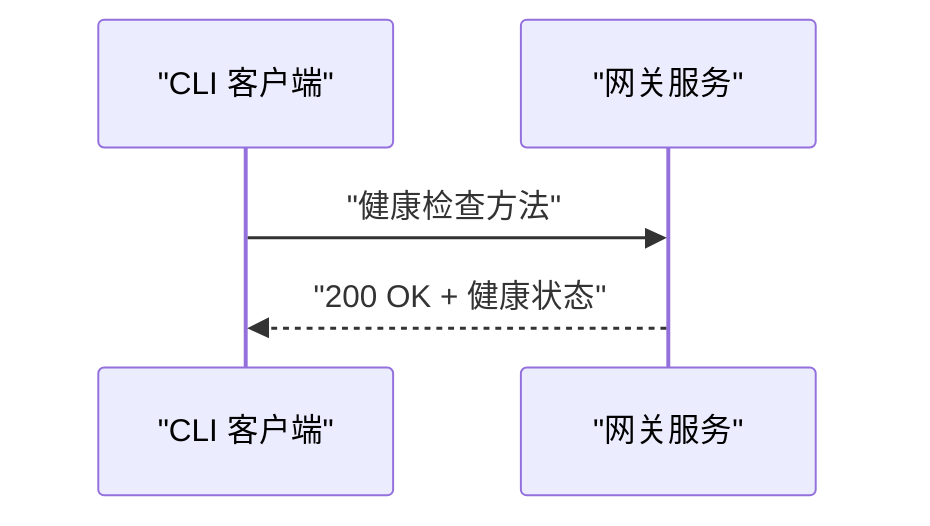
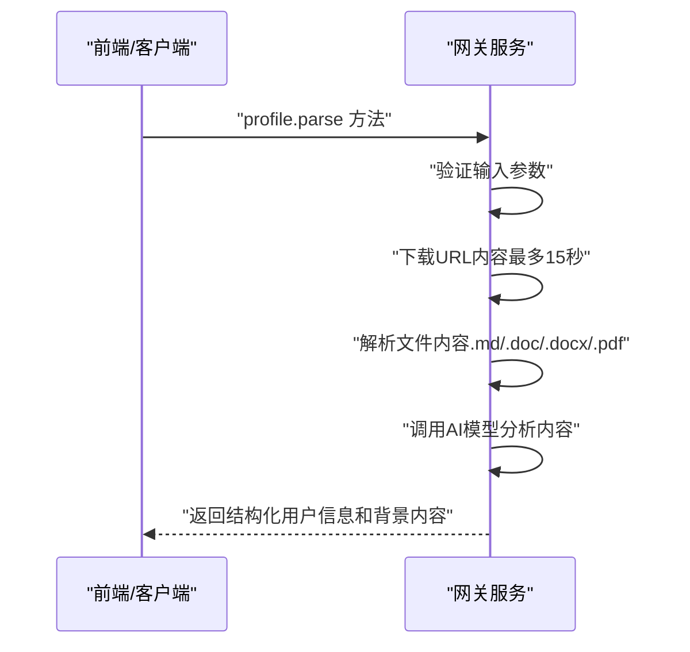
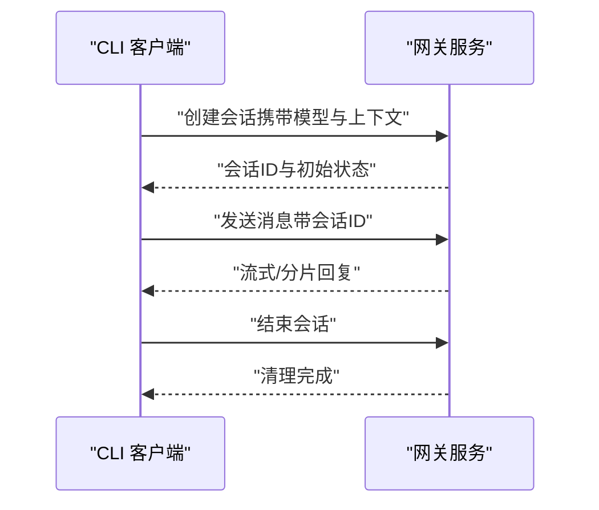
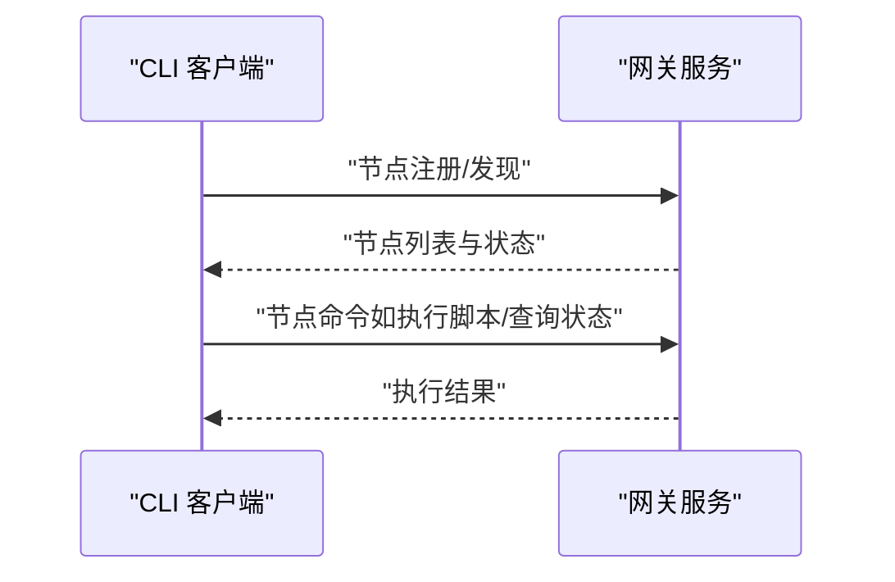
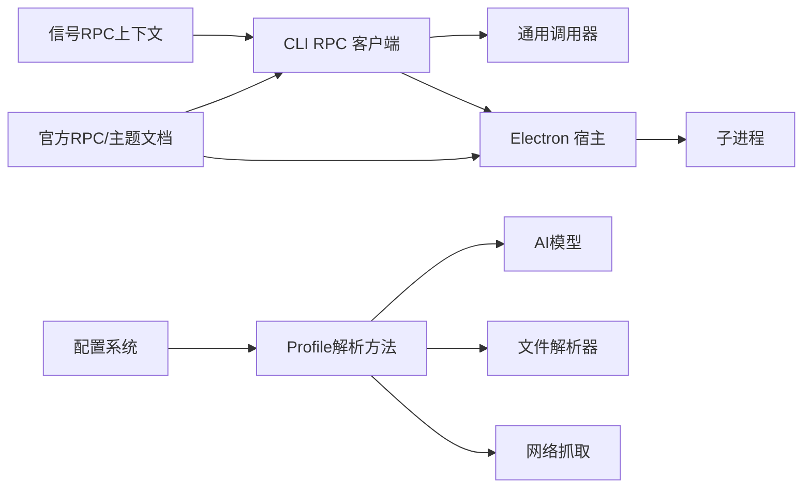

# 网关方法

<cite>
**本文引用的文件**
- [src/cli/gateway-rpc.ts](file://src/cli/gateway-rpc.ts)
- [apps/electron/src/main/gateway.ts](file://apps/electron/src/main/gateway.ts)
- [src/signal/rpc-context.ts](file://src/signal/rpc-context.ts)
- [docs/reference/rpc.md](file://docs/reference/rpc.md)
- [docs/gateway/index.md](file://docs/gateway/index.md)
- [docs/gateway/health.md](file://docs/gateway/health.md)
- [docs/gateway/configuration.md](file://docs/gateway/configuration.md)
- [docs/gateway/pairing.md](file://docs/gateway/pairing.md)
- [docs/gateway/authentication.md](file://docs/gateway/authentication.md)
- [docs/gateway/heartbeat.md](file://docs/gateway/heartbeat.md)
- [docs/cli/gateway.md](file://docs/cli/gateway.md)
- [docs/concepts/session.md](file://docs/concepts/session.md)
- [docs/concepts/agent.md](file://docs/concepts/agent.md)
- [docs/concepts/model-providers.md](file://docs/concepts/model-providers.md)
- [docs/channels/index.md](file://docs/channels/index.md)
- [docs/features/profile-feature-design.md](file://docs/features/profile-feature-design.md)
- [src/gateway/server-methods/profile.ts](file://src/gateway/server-methods/profile.ts)
- [src/gateway/server-methods-list.ts](file://src/gateway/server-methods-list.ts)
- [src/gateway/server-methods.ts](file://src/gateway/server-methods.ts)
- [src/config/types.openclaw.ts](file://src/config/types.openclaw.ts)
- [ui/src/ui/views/profile.ts](file://ui/src/ui/views/profile.ts)
- [extensions/*/README.md](file://extensions/feishu/README.md)
</cite>

## 更新摘要
**所做更改**
- 新增Profile解析方法章节，详细介绍profile.parse方法的功能特性
- 更新方法分类，将Profile解析方法归类为基础方法
- 添加文件处理能力和AI分析功能的技术规范
- 更新配置管理和权限要求说明
- 增加调用示例和最佳实践指导

## 目录
1. [简介](#简介)
2. [项目结构](#项目结构)
3. [核心组件](#核心组件)
4. [架构总览](#架构总览)
5. [详细组件分析](#详细组件分析)
6. [依赖关系分析](#依赖关系分析)
7. [性能考量](#性能考量)
8. [故障排查指南](#故障排查指南)
9. [结论](#结论)
10. [附录](#附录)

## 简介
本文件面向OpenClaw网关的RPC方法，系统性梳理其核心能力与调用方式，覆盖健康检查、配置管理、会话控制、节点操作等关键功能，并按"基础方法、通道方法、插件方法"进行分类说明。文档同时给出调用示例、最佳实践与性能建议，帮助开发者与运维人员高效、安全地集成与使用网关。

**更新** 新增Profile解析方法(profile.parse)，集成文件处理能力和AI分析功能，支持从文本、URL和文件中提取用户画像信息。

## 项目结构
围绕网关RPC方法的关键代码与文档分布如下：
- CLI层：封装RPC调用选项与执行流程，统一透传URL、令牌、超时等参数。
- Electron宿主：负责本地子进程启动、端口绑定、令牌注入与就绪探测。
- 信号上下文解析：为RPC调用提供账户与基地址解析逻辑。
- 文档与参考：官方RPC规范、网关健康、配置、配对、认证、心跳等主题文档。
- Profile解析方法：新增的Profile功能实现，支持文件处理和AI分析。


```mermaid
graph TB
CLI["CLI RPC 调用<br/>src/cli/gateway-rpc.ts"] --> GWProc["Electron 宿主进程<br/>apps/electron/src/main/gateway.ts"]
GWProc --> Gateway["OpenClaw 网关子进程<br/>gateway run --port --force"]
SignalCtx["信号RPC上下文解析<br/>src/signal/rpc-context.ts"] --> CLI
Docs["官方文档与参考<br/>docs/reference/rpc.md 等"] --> CLI
Docs --> GWProc
Profile["Profile解析方法<br/>src/gateway/server-methods/profile.ts"] --> Gateway
Config["配置类型定义<br/>src/config/types.openclaw.ts"] --> Profile
```

**图表来源**
- [src/cli/gateway-rpc.ts:1-48](file://src/cli/gateway-rpc.ts#L1-L48)
- [apps/electron/src/main/gateway.ts:100-151](file://apps/electron/src/main/gateway.ts#L100-L151)
- [src/signal/rpc-context.ts:1-25](file://src/signal/rpc-context.ts#L1-L25)
- [src/gateway/server-methods/profile.ts:1-378](file://src/gateway/server-methods/profile.ts#L1-L378)
- [src/config/types.openclaw.ts:120-165](file://src/config/types.openclaw.ts#L120-L165)

**章节来源**
- [src/cli/gateway-rpc.ts:1-48](file://src/cli/gateway-rpc.ts#L1-L48)
- [apps/electron/src/main/gateway.ts:100-151](file://apps/electron/src/main/gateway.ts#L100-L151)
- [src/signal/rpc-context.ts:1-25](file://src/signal/rpc-context.ts#L1-L25)
- [src/gateway/server-methods/profile.ts:1-378](file://src/gateway/server-methods/profile.ts#L1-L378)
- [src/config/types.openclaw.ts:120-165](file://src/config/types.openclaw.ts#L120-L165)

## 核心组件
- CLI RPC客户端：提供统一的RPC调用入口，支持URL、令牌、超时、最终响应等待等选项；内部通过通用调用器发起请求。
- Electron网关宿主：以子进程形式启动网关，绑定本地回环端口，注入令牌与端口环境变量，轮询检测就绪状态。
- 信号RPC上下文：解析Signal相关RPC所需的基地址与账户信息，确保调用链路具备必要上下文。
- 官方RPC参考与主题文档：定义方法集合、参数与返回值规范，以及健康检查、配对、认证、心跳等专题。
- Profile解析方法：新增的Profile功能实现，支持文件处理和AI分析，集成多种文件格式解析能力。

**章节来源**
- [src/cli/gateway-rpc.ts:22-47](file://src/cli/gateway-rpc.ts#L22-L47)
- [apps/electron/src/main/gateway.ts:100-151](file://apps/electron/src/main/gateway.ts#L100-L151)
- [src/signal/rpc-context.ts:4-24](file://src/signal/rpc-context.ts#L4-L24)
- [docs/reference/rpc.md](file://docs/reference/rpc.md)
- [src/gateway/server-methods/profile.ts:1-378](file://src/gateway/server-methods/profile.ts#L1-L378)

## 架构总览
下图展示从CLI到网关子进程的典型调用链路，以及Electron宿主如何管理网关生命周期。


```mermaid
sequenceDiagram
participant User as "用户/脚本"
participant CLI as "CLI RPC 客户端<br/>src/cli/gateway-rpc.ts"
participant Host as "Electron 宿主<br/>apps/electron/src/main/gateway.ts"
participant Proc as "网关子进程<br/>gateway run"
participant GW as "网关服务"
User->>CLI : "选择方法并传入选项"
CLI->>Host : "准备调用URL/令牌/超时"
Host->>Proc : "spawn 子进程注入TOKEN/PORT"
Proc->>GW : "启动服务并监听端口"
Host->>Host : "轮询 http : //127.0.0.1 : PORT/ 探测就绪"
CLI->>GW : "发送RPC请求method/params"
GW-->>CLI : "返回结果含final/流式分片"
CLI-->>User : "输出JSON/进度/最终响应"
```

**图表来源**
- [src/cli/gateway-rpc.ts:22-47](file://src/cli/gateway-rpc.ts#L22-L47)
- [apps/electron/src/main/gateway.ts:100-151](file://apps/electron/src/main/gateway.ts#L100-L151)

## 详细组件分析

### CLI RPC 客户端
- 功能要点
  - 选项：URL、令牌、超时、是否等待最终响应、JSON输出模式。
  - 行为：根据是否JSON模式决定是否显示进度条；统一透传到通用调用器。
  - 客户端标识：记录客户端名称与模式，便于网关侧审计与统计。
- 参数与返回
  - 输入：方法名、选项对象、可选参数、额外控制（如是否等待最终响应、是否显示进度）。
  - 输出：RPC调用结果，支持流式分片与最终聚合。
- 权限与安全
  - 令牌通过环境变量注入，避免命令行参数泄露；建议仅在受信环境中使用。
- 最佳实践
  - 明确设置超时，避免长时间阻塞。
  - 在自动化场景中启用JSON输出，便于解析。
  - 使用"等待最终响应"选项获取完整结果（适用于需要聚合的长流程）。

**章节来源**
- [src/cli/gateway-rpc.ts:6-20](file://src/cli/gateway-rpc.ts#L6-L20)
- [src/cli/gateway-rpc.ts:22-47](file://src/cli/gateway-rpc.ts#L22-L47)

### Electron 网关宿主
- 功能要点
  - 解析捆绑的Node与OpenClaw入口，支持打包与开发两种模式。
  - 读取现有配置中的网关令牌，复用以保持UI会话连续性。
  - 子进程启动网关，注入TOKEN与PORT环境变量，标准输出/错误重定向。
  - 就绪探测：轮询HTTP端点，遇到非5xx状态即认为就绪。
  - 生命周期：提供启动、停止、重启能力，重启前等待端口释放。
- 配置与端口
  - 默认端口与强制覆盖策略，避免冲突。
- 最佳实践
  - 首次启动前确保令牌可用；若无则由上层生成并注入。
  - 监控子进程日志，定位启动失败原因。
  - 更新配置后使用重启流程，确保新配置生效。

**章节来源**
- [apps/electron/src/main/gateway.ts:14-176](file://apps/electron/src/main/gateway.ts#L14-L176)

### 信号RPC上下文解析
- 功能要点
  - 当缺少基地址或账户时，自动解析当前配置中的账户信息。
  - 校验基地址必填，否则抛出错误。
- 适用场景
  - 与Signal相关的RPC调用，确保上下文完整。

**章节来源**
- [src/signal/rpc-context.ts:4-24](file://src/signal/rpc-context.ts#L4-L24)

### 方法分类与调用示例

#### 基础方法
- 健康检查
  - 用途：确认网关运行状态与可达性。
  - 调用方式：通过CLI或任意RPC客户端向网关发送健康检查方法。
  - 参数：无或极简。
  - 返回：状态码与简要信息。
  - 权限：通常无需认证。
  - 参考：见官方健康检查文档。
- 系统状态
  - 用途：查询网关版本、运行时间、资源占用等。
  - 调用方式：CLI或HTTP/WebSocket均可。
  - 权限：视部署策略而定，常见为管理员或受信范围。
- 配置读取/写入
  - 用途：读取或更新网关配置（如端口、令牌、通道与插件配置）。
  - 调用方式：CLI或RPC客户端。
  - 权限：仅允许受信账户或管理员。
  - 参考：见官方配置文档。
- **Profile解析方法**
  - 用途：解析用户提供的文本、URL和文件，提取结构化用户画像信息。
  - 调用方式：通过网关RPC方法调用profile.parse。
  - 参数：text（可选字符串）、urls（可选字符串数组）、files（可选文件数组）。
  - 返回：userMdContent（结构化用户信息）、memoryContent（补充背景信息）、skippedUrls（跳过的URL列表）、skippedFiles（跳过的文件列表）。
  - 权限：需要有效的API密钥和可用的默认模型配置。
  - 功能特性：支持.md、.doc、.docx、.pdf文件解析，URL内容抓取，AI模型分析。

**章节来源**
- [docs/gateway/health.md](file://docs/gateway/health.md)
- [docs/gateway/configuration.md](file://docs/gateway/configuration.md)
- [docs/cli/gateway.md](file://docs/cli/gateway.md)
- [docs/features/profile-feature-design.md](file://docs/features/profile-feature-design.md)
- [src/gateway/server-methods/profile.ts:206-378](file://src/gateway/server-methods/profile.ts#L206-L378)

#### 通道方法
- 用途：对接各类消息通道（如Discord、Slack、Telegram等），实现消息路由、群组管理、事件订阅等。
- 调用方式：通过网关RPC方法提交通道特定参数（如频道ID、群组ID、消息内容等）。
- 权限：需具备对应通道的授权凭据与角色权限。
- 参考：各通道独立文档与示例。

**章节来源**
- [docs/channels/index.md](file://docs/channels/index.md)
- [extensions/*/README.md](file://extensions/feishu/README.md)

#### 插件方法
- 用途：加载、卸载、启停插件，查询插件状态与版本，触发插件内工具或技能。
- 调用方式：通过网关RPC方法传递插件标识与参数。
- 权限：仅管理员或受信账户。
- 参考：插件SDK与清单规范。

**章节来源**
- [docs/plugins/manifest.md](file://docs/plugins/manifest.md)
- [docs/plugins/agent-tools.md](file://docs/plugins/agent-tools.md)

### 调用序列示例

#### 健康检查序列

```mermaid
sequenceDiagram
participant Client as "CLI 客户端"
participant Gateway as "网关服务"
Client->>Gateway : "健康检查方法"
Gateway-->>Client : "200 OK + 健康状态"
```

**图表来源**
- [docs/gateway/health.md](file://docs/gateway/health.md)

#### Profile解析序列

```mermaid
sequenceDiagram
participant Client as "前端/客户端"
participant Gateway as "网关服务"
Client->>Gateway : "profile.parse 方法"
Gateway->>Gateway : "验证输入参数"
Gateway->>Gateway : "下载URL内容最多15秒"
Gateway->>Gateway : "解析文件内容.md/.doc/.docx/.pdf"
Gateway->>Gateway : "调用AI模型分析内容"
Gateway-->>Client : "返回结构化用户信息和背景内容"
```

**图表来源**
- [docs/features/profile-feature-design.md](file://docs/features/profile-feature-design.md)
- [src/gateway/server-methods/profile.ts:206-378](file://src/gateway/server-methods/profile.ts#L206-L378)

#### 会话控制序列

```mermaid
sequenceDiagram
participant Client as "CLI 客户端"
participant Gateway as "网关服务"
Client->>Gateway : "创建会话携带模型与上下文"
Gateway-->>Client : "会话ID与初始状态"
Client->>Gateway : "发送消息带会话ID"
Gateway-->>Client : "流式/分片回复"
Client->>Gateway : "结束会话"
Gateway-->>Client : "清理完成"
```

**图表来源**
- [docs/concepts/session.md](file://docs/concepts/session.md)
- [docs/concepts/agent.md](file://docs/concepts/agent.md)

#### 节点操作序列

```mermaid
sequenceDiagram
participant Client as "CLI 客户端"
participant Gateway as "网关服务"
Client->>Gateway : "节点注册/发现"
Gateway-->>Client : "节点列表与状态"
Client->>Gateway : "节点命令如执行脚本/查询状态"
Gateway-->>Client : "执行结果"
```

**图表来源**
- [docs/nodes/index.md](file://docs/nodes/index.md)

### Profile解析方法详细说明

#### 功能概述
Profile解析方法(profile.parse)是OpenClaw新增的核心功能，旨在帮助用户快速构建AI代理的用户画像。该方法能够处理多种输入源，包括用户直接输入的文本、网页URL链接，以及本地文件上传，通过AI模型分析提取结构化的用户信息和补充背景内容。

#### 支持的输入格式
- **文本输入**：用户直接输入的描述性文本
- **URL链接**：支持网页内容抓取，最长15秒超时
- **文件上传**：支持.md、.doc、.docx、.pdf四种格式
  - .md文件：直接读取UTF-8文本内容
  - .doc/.docx文件：使用mammoth库提取纯文本
  - .pdf文件：使用pdf-parse库提取文本内容

#### AI分析与输出
方法使用网关配置的默认AI模型进行内容分析，输出格式严格遵循预设的XML标签结构：

```xml
<USER_MD>
- **Name**: [姓名或省略]
- **Role**: [职业或省略]
- **Domains**: [领域1, 领域2, ... 或省略]
- **Tools**: [工具1, 工具2, ... 或省略]
- **Preferences**: [偏好1, 偏好2, ... 或省略]
</USER_MD>
<MEMORY_MD>
[格式良好的Markdown内容，包含标题和结构，或空内容]
</MEMORY_MD>
```

#### 配置与限制
- **文件上传限制**：默认最多5个文件，单个文件最大5MB，可通过配置调整
- **URL抓取超时**：15秒超时，失败的URL会被记录在skippedUrls中
- **AI分析超时**：60秒超时，防止长时间阻塞
- **API密钥要求**：需要有效的API密钥和可用的默认模型配置

#### 错误处理
方法提供了完善的错误处理机制：
- 参数验证：确保至少有一个有效输入源
- 文件大小验证：超过限制的文件会被跳过
- 文件类型验证：不支持的文件类型会被跳过
- URL抓取失败：网络错误或内容无效的URL会被跳过
- AI分析失败：模型不可用或返回无效内容时返回相应错误

**章节来源**
- [docs/features/profile-feature-design.md](file://docs/features/profile-feature-design.md)
- [src/gateway/server-methods/profile.ts:1-378](file://src/gateway/server-methods/profile.ts#L1-L378)
- [src/config/types.openclaw.ts:120-165](file://src/config/types.openclaw.ts#L120-165)
- [ui/src/ui/views/profile.ts:310-509](file://ui/src/ui/views/profile.ts#L310-509)

## 依赖关系分析
- CLI RPC客户端依赖通用调用器与Electron宿主提供的子进程管理。
- Electron宿主依赖Node与OpenClaw入口，通过环境变量注入令牌与端口。
- 信号RPC上下文解析依赖配置加载与账户解析模块。
- 官方文档与参考为RPC方法提供权威约束与示例。
- Profile解析方法依赖AI模型配置、文件处理库和网络抓取功能。


```mermaid
graph LR
CLI["CLI RPC 客户端"] --> Call["通用调用器"]
CLI --> Host["Electron 宿主"]
Host --> Proc["子进程"]
Signal["信号RPC上下文"] --> CLI
Docs["官方RPC/主题文档"] --> CLI
Docs --> Host
Profile["Profile解析方法"] --> AI["AI模型"]
Profile --> FileParser["文件解析器"]
Profile --> Network["网络抓取"]
Config["配置系统"] --> Profile
```

**图表来源**
- [src/cli/gateway-rpc.ts:22-47](file://src/cli/gateway-rpc.ts#L22-L47)
- [apps/electron/src/main/gateway.ts:100-151](file://apps/electron/src/main/gateway.ts#L100-L151)
- [src/signal/rpc-context.ts:1-25](file://src/signal/rpc-context.ts#L1-L25)
- [src/gateway/server-methods/profile.ts:1-378](file://src/gateway/server-methods/profile.ts#L1-L378)

**章节来源**
- [src/cli/gateway-rpc.ts:22-47](file://src/cli/gateway-rpc.ts#L22-L47)
- [apps/electron/src/main/gateway.ts:100-151](file://apps/electron/src/main/gateway.ts#L100-L151)
- [src/signal/rpc-context.ts:1-25](file://src/signal/rpc-context.ts#L1-L25)
- [src/gateway/server-methods/profile.ts:1-378](file://src/gateway/server-methods/profile.ts#L1-L378)

## 性能考量
- 超时设置：为所有RPC调用配置合理超时，避免长时间阻塞导致资源浪费。
- 流式响应：对于长耗时任务，优先采用流式分片返回，前端可渐进渲染。
- 并发控制：限制并发RPC数量，避免网关过载。
- 缓存与复用：对频繁访问的配置与元数据进行缓存，减少重复请求。
- 端口与网络：本地回环端口具备低延迟优势；跨网络调用应考虑TLS与代理配置。
- **Profile解析优化**：合理设置文件上传限制，避免大文件影响性能；网络抓取设置合适的超时时间。

**更新** Profile解析方法具有特定的性能考量，包括文件大小限制、URL抓取超时和AI分析超时，这些都需要在配置中合理设置以平衡性能和功能需求。

## 故障排查指南
- 启动失败
  - 检查Node版本与OpenClaw入口路径解析是否正确。
  - 查看子进程标准输出/错误日志，定位异常。
- 无法就绪
  - 确认端口未被占用；使用"强制覆盖"策略或更换端口。
  - 观察就绪轮询日志，关注HTTP状态码。
- 认证失败
  - 确认令牌已正确注入环境变量且未被截断。
  - 检查令牌有效期与作用域。
- 健康检查异常
  - 使用官方健康检查文档核对期望行为与返回格式。
- 通道/插件问题
  - 根据对应通道或插件文档排查权限与配置。
- **Profile解析问题**
  - 检查API密钥配置和默认模型设置。
  - 验证文件格式和大小限制。
  - 确认网络连接和URL可达性。
  - 查看skippedUrls和skippedFiles列表了解失败原因。

**章节来源**
- [apps/electron/src/main/gateway.ts:78-94](file://apps/electron/src/main/gateway.ts#L78-L94)
- [docs/gateway/health.md](file://docs/gateway/health.md)
- [docs/gateway/authentication.md](file://docs/gateway/authentication.md)
- [src/gateway/server-methods/profile.ts:206-378](file://src/gateway/server-methods/profile.ts#L206-L378)

## 结论
OpenClaw网关通过CLI RPC客户端、Electron宿主与官方文档形成完整的调用体系。随着Profile解析方法的引入，网关现在具备了强大的文件处理和AI分析能力，能够帮助用户快速构建个性化的AI代理画像。遵循本文的分类、参数规范、权限要求与最佳实践，可在保障安全与性能的前提下，稳定地使用健康检查、配置管理、会话控制、节点操作以及新的Profile解析等核心能力。

**更新** Profile解析方法的加入为OpenClaw网关增加了重要的AI分析能力，通过统一的方法接口实现了文件处理、网络抓取和智能分析的完整流程，为用户提供了便捷的画像构建体验。

## 附录
- 官方RPC参考与主题文档索引
  - [RPC参考](file://docs/reference/rpc.md)
  - [网关首页](file://docs/gateway/index.md)
  - [健康检查](file://docs/gateway/health.md)
  - [配置管理](file://docs/gateway/configuration.md)
  - [配对机制](file://docs/gateway/pairing.md)
  - [认证策略](file://docs/gateway/authentication.md)
  - [心跳与保活](file://docs/gateway/heartbeat.md)
  - [CLI网关命令](file://docs/cli/gateway.md)
  - [会话概念](file://docs/concepts/session.md)
  - [Agent概念](file://docs/concepts/agent.md)
  - [模型提供方](file://docs/concepts/model-providers.md)
  - [通道总览](file://docs/channels/index.md)
  - [Profile功能设计](file://docs/features/profile-feature-design.md)

- **新增方法索引**
  - [profile.parse方法实现](file://src/gateway/server-methods/profile.ts)
  - [方法注册列表](file://src/gateway/server-methods-list.ts)
  - [配置类型定义](file://src/config/types.openclaw.ts)
  - [前端调用实现](file://ui/src/ui/views/profile.ts)

[本节为索引性内容，不直接分析具体文件]