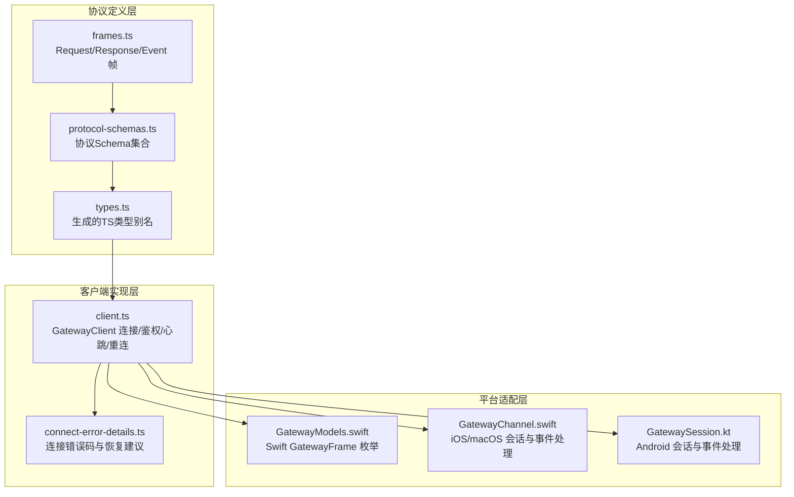
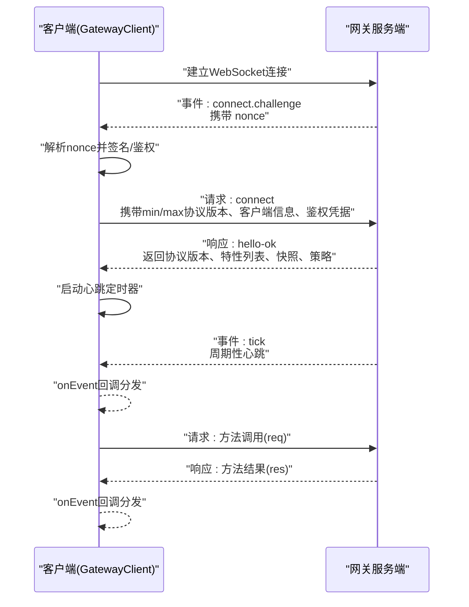
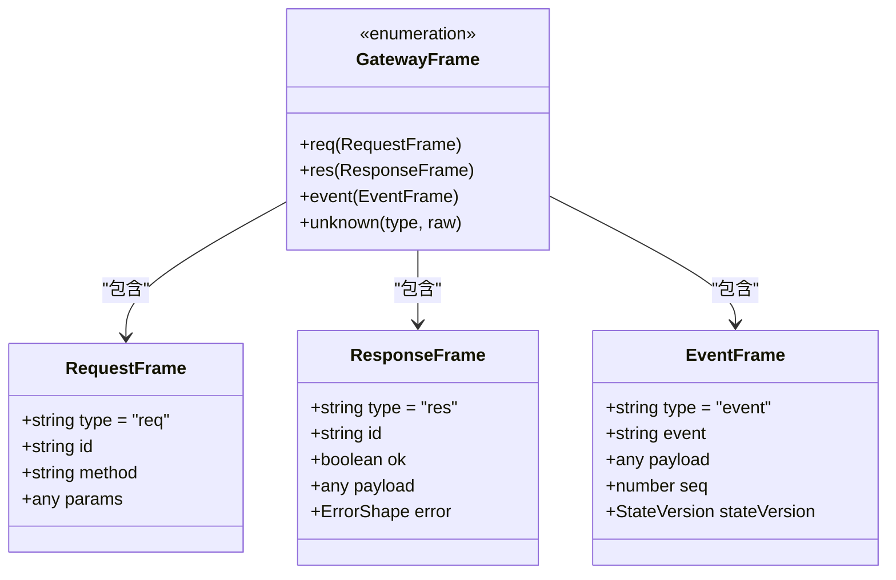
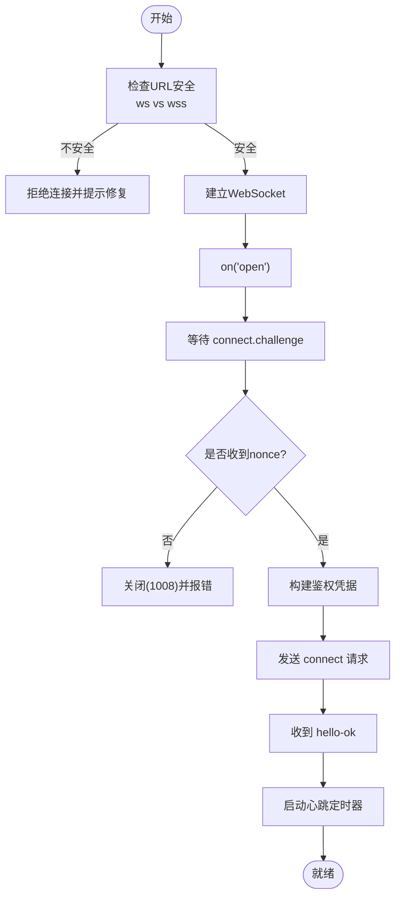
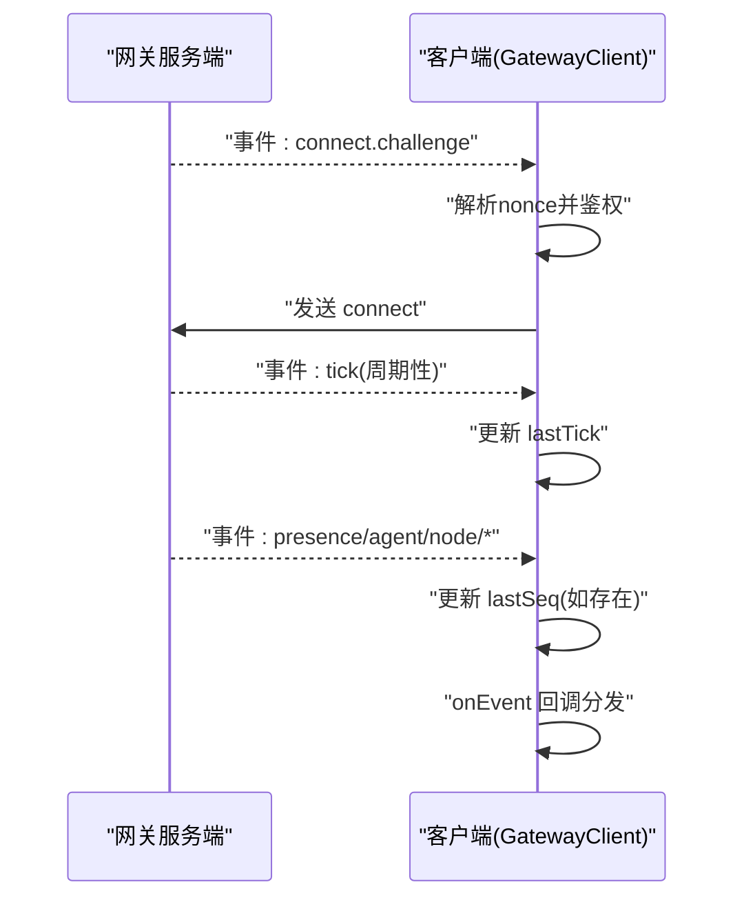
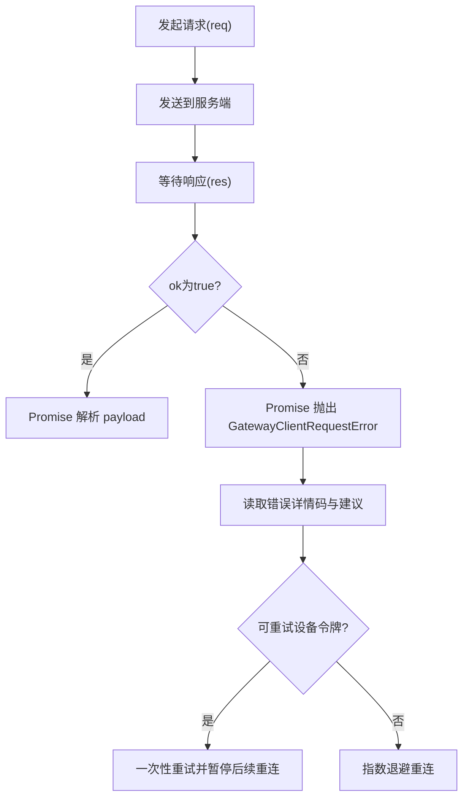
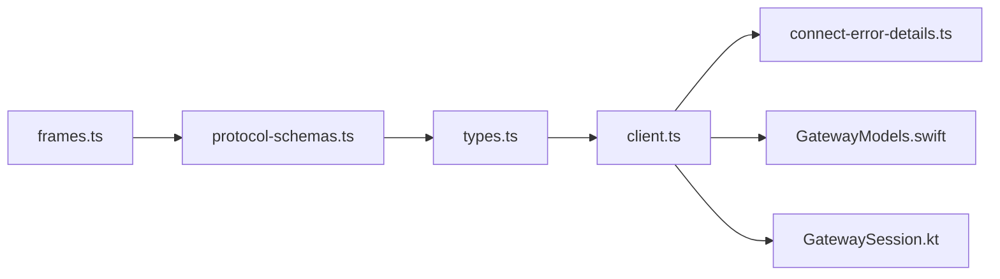

# WebSocket协议

<cite>
**本文档引用的文件**
- [client.ts](file://src/gateway/client.ts)
- [index.ts](file://src/gateway/protocol/index.ts)
- [schema.ts](file://src/gateway/protocol/schema.ts)
- [frames.ts](file://src/gateway/protocol/schema/frames.ts)
- [protocol-schemas.ts](file://src/gateway/protocol/schema/protocol-schemas.ts)
- [types.ts](file://src/gateway/protocol/schema/types.ts)
- [connect-error-details.ts](file://src/gateway/protocol/connect-error-details.ts)
- [GatewayModels.swift](file://apps/shared/OpenClawKit/Sources/OpenClawProtocol/GatewayModels.swift)
- [GatewayModels.swift](file://apps/macos/Sources/OpenClawProtocol/GatewayModels.swift)
- [GatewayChannel.swift](file://apps/shared/OpenClawKit/Sources/OpenClawKit/GatewayChannel.swift)
- [GatewayFrameDecodeTests.swift](file://apps/macos/Tests/OpenClawIPCTests/GatewayFrameDecodeTests.swift)
- [protocol-gen-swift.ts](file://scripts/protocol-gen-swift.ts)
- [GatewayNodeSessionTests.swift](file://apps/shared/OpenClawKit/Tests/OpenClawKitTests/GatewayNodeSessionTests.swift)
- [GatewaySession.kt](file://apps/android/app/src/main/java/ai/openclaw/app/gateway/GatewaySession.kt)
- [invoke.ts](file://src/node-host/invoke.ts)
- [system.ts](file://src/gateway/server-methods/system.ts)
</cite>

## 目录

1. [简介](#简介)
2. [项目结构](#项目结构)
3. [核心组件](#核心组件)
4. [架构总览](#架构总览)
5. [详细组件分析](#详细组件分析)
6. [依赖关系分析](#依赖关系分析)
7. [性能考量](#性能考量)
8. [故障排查指南](#故障排查指南)
9. [结论](#结论)
10. [附录](#附录)

## 简介

本文件系统性阐述 OpenClaw 网关的 WebSocket 通信协议实现，覆盖连接建立、消息格式、事件类型与实时交互模式。文档重点说明：

- 数据帧结构与序列化机制（JSON）
- 消息验证与错误处理策略
- 状态管理与心跳保活
- 客户端连接生命周期与重连退避
- 协议版本协商与兼容性
- 调试工具与监控方法
- 版本兼容性与迁移指南

## 项目结构

OpenClaw 的 WebSocket 协议由“协议定义 + 客户端实现 + 平台适配”三层构成：

- 协议定义：使用 TypeBox Schema 统一描述帧结构与参数，导出 TypeScript 类型与 Swift 结构体
- 客户端实现：Node.js 端 GatewayClient 负责连接、鉴权、请求/响应、事件分发、心跳与重连
- 平台适配：Swift（macOS/iOS）、Android、Electron 等平台对协议进行解码与事件处理

图表来源

- [frames.ts:125-163](file://src/gateway/protocol/schema/frames.ts#L125-L163)
- [protocol-schemas.ts:162-299](file://src/gateway/protocol/schema/protocol-schemas.ts#L162-L299)
- [types.ts:1-30](file://src/gateway/protocol/schema/types.ts#L1-L30)
- [client.ts:109-132](file://src/gateway/client.ts#L109-L132)
- [connect-error-details.ts:1-137](file://src/gateway/protocol/connect-error-details.ts#L1-L137)
- [GatewayModels.swift:3543-3583](file://apps/shared/OpenClawKit/Sources/OpenClawProtocol/GatewayModels.swift#L3543-L3583)

章节来源

- [schema.ts:1-19](file://src/gateway/protocol/schema.ts#L1-L19)
- [protocol-schemas.ts:162-302](file://src/gateway/protocol/schema/protocol-schemas.ts#L162-L302)
- [frames.ts:125-163](file://src/gateway/protocol/schema/frames.ts#L125-L163)

## 核心组件

- GatewayClient（Node.js）：负责连接建立、鉴权挑战、发送请求、接收响应与事件、心跳检测、错误处理与自动重连
- 协议 Schema：统一定义帧结构、参数与错误形状，支持运行时校验与跨语言代码生成
- 平台解码器：Swift/Android 等平台对 GatewayFrame 进行枚举解码，支持未知类型回退

章节来源

- [client.ts:109-132](file://src/gateway/client.ts#L109-L132)
- [index.ts:253-458](file://src/gateway/protocol/index.ts#L253-L458)
- [GatewayModels.swift:3543-3583](file://apps/shared/OpenClawKit/Sources/OpenClawProtocol/GatewayModels.swift#L3543-L3583)

## 架构总览

WebSocket 协议采用“帧驱动”的消息模型，所有消息均为 JSON 对象，通过 type 字段区分帧类型。客户端在握手阶段完成鉴权挑战，随后进入事件驱动的实时交互。

图表来源

- [client.ts:199-210](file://src/gateway/client.ts#L199-L210)
- [client.ts:502-512](file://src/gateway/client.ts#L502-L512)
- [client.ts:369-414](file://src/gateway/client.ts#L369-L414)
- [frames.ts:125-163](file://src/gateway/protocol/schema/frames.ts#L125-L163)

## 详细组件分析

### 1) 数据帧结构与消息序列化

- 帧类型
  - req：请求帧，包含 id、method、params
  - res：响应帧，包含 id、ok、payload 或 error
  - event：事件帧，包含 event、payload、可选 seq 与 stateVersion
- 序列化机制
  - 使用 Ajv 编译 Schema，运行时校验请求/响应/事件
  - Swift 侧通过 GatewayFrame 枚举按 type 分派到具体帧结构
- 关键字段
  - id：请求唯一标识，用于匹配响应
  - seq：事件序号，用于检测丢包与乱序
  - stateVersion：状态版本，用于增量同步

图表来源

- [frames.ts:125-163](file://src/gateway/protocol/schema/frames.ts#L125-L163)
- [GatewayModels.swift:3543-3583](file://apps/shared/OpenClawKit/Sources/OpenClawProtocol/GatewayModels.swift#L3543-L3583)

章节来源

- [frames.ts:125-163](file://src/gateway/protocol/schema/frames.ts#L125-L163)
- [protocol-gen-swift.ts:158-211](file://scripts/protocol-gen-swift.ts#L158-L211)
- [GatewayModels.swift:3543-3583](file://apps/shared/OpenClawKit/Sources/OpenClawProtocol/GatewayModels.swift#L3543-L3583)

### 2) 连接建立与鉴权流程

- 安全约束
  - 阻止非本地明文 ws:// 连接，除非显式允许（OPENCLAW_ALLOW_INSECURE_PRIVATE_WS）
  - wss:// 必须校验证书指纹（tlsFingerprint），否则拒绝连接
- 握手步骤
  - 服务器推送 connect.challenge（含 nonce）
  - 客户端解析 nonce，准备鉴权凭据（共享令牌/设备令牌/密码）
  - 发送 connect 请求，声明 min/max 协议版本与客户端元信息
  - 服务器返回 hello-ok，包含协议版本、特性、快照、策略（含心跳间隔）
- 设备令牌重试策略
  - 当出现令牌不匹配且端点可信时，允许一次性重试使用已存储设备令牌
  - 若达到重试预算或端点不可信，则暂停自动重连直至人工干预

图表来源

- [client.ts:134-168](file://src/gateway/client.ts#L134-L168)
- [client.ts:199-210](file://src/gateway/client.ts#L199-L210)
- [client.ts:502-512](file://src/gateway/client.ts#L502-L512)
- [client.ts:369-414](file://src/gateway/client.ts#L369-L414)

章节来源

- [client.ts:134-168](file://src/gateway/client.ts#L134-L168)
- [client.ts:199-210](file://src/gateway/client.ts#L199-L210)
- [client.ts:502-512](file://src/gateway/client.ts#L502-L512)
- [client.ts:369-414](file://src/gateway/client.ts#L369-L414)
- [connect-error-details.ts:1-137](file://src/gateway/protocol/connect-error-details.ts#L1-L137)

### 3) 事件类型与实时交互

- 事件示例
  - connect.challenge：握手挑战，携带 nonce
  - tick：心跳事件，用于保活检测
  - shutdown：服务端通知重启，可携带预期重启时间
  - presence、agent._、node._ 等：系统与业务事件
- 事件处理
  - 客户端维护 lastSeq，检测丢包并触发 onGap 回调
  - 收到 tick 事件更新 lastTick，心跳超时则主动断开
  - 事件帧可携带 stateVersion，用于增量同步

图表来源

- [client.ts:497-554](file://src/gateway/client.ts#L497-L554)
- [frames.ts:5-18](file://src/gateway/protocol/schema/frames.ts#L5-L18)

章节来源

- [client.ts:497-554](file://src/gateway/client.ts#L497-L554)
- [frames.ts:5-18](file://src/gateway/protocol/schema/frames.ts#L5-L18)

### 4) 错误处理与状态管理

- 错误分类
  - 认证类：令牌缺失/不匹配、密码缺失/不匹配、速率限制、设备鉴权失败等
  - 设备令牌重试：当端点可信且未耗尽预算时，允许一次性重试
  - 连接错误细节码与恢复建议：从错误详情中提取 code 与 recommendedNextStep
- 状态管理
  - backoffMs 指数退避重连，上限 30 秒
  - tickWatch：基于心跳间隔检测静默停滞，超时主动断开
  - pending 请求队列：按 id 匹配响应，支持 expectFinal 等待最终结果

图表来源

- [client.ts:647-672](file://src/gateway/client.ts#L647-L672)
- [client.ts:527-550](file://src/gateway/client.ts#L527-L550)
- [connect-error-details.ts:107-136](file://src/gateway/protocol/connect-error-details.ts#L107-L136)

章节来源

- [client.ts:527-550](file://src/gateway/client.ts#L527-L550)
- [client.ts:647-672](file://src/gateway/client.ts#L647-L672)
- [connect-error-details.ts:107-136](file://src/gateway/protocol/connect-error-details.ts#L107-L136)

### 5) 客户端连接管理

- 生命周期
  - start()：根据 URL 与 TLS 指纹配置建立连接，注册事件处理器
  - stop()：清理 pending 请求、停止心跳、关闭连接
  - scheduleReconnect()：指数退避重连
- 选项与能力
  - 支持最小/最大协议版本协商
  - 支持设备身份签名与设备令牌
  - 支持 capabilities、permissions、commands 等扩展能力声明
  - 支持路径环境变量与实例标识

章节来源

- [client.ts:127-132](file://src/gateway/client.ts#L127-L132)
- [client.ts:253-265](file://src/gateway/client.ts#L253-L265)
- [client.ts:576-587](file://src/gateway/client.ts#L576-L587)

### 6) 平台解码与事件监听

- Swift 平台
  - GatewayFrame 枚举按 type 解析到 Request/Response/Event
  - 未知类型回退到 unknown，保留原始 JSON
- iOS/macOS
  - GatewayChannel 在异步任务中解码 GatewayFrame，并监听 connect.challenge 与 connect 响应
- Android
  - GatewaySession 提供事件解析与 invoke 结果回传

章节来源

- [GatewayModels.swift:3543-3583](file://apps/shared/OpenClawKit/Sources/OpenClawProtocol/GatewayModels.swift#L3543-L3583)
- [GatewayChannel.swift:626-655](file://apps/shared/OpenClawKit/Sources/OpenClawKit/GatewayChannel.swift#L626-L655)
- [GatewaySession.kt:517-585](file://apps/android/app/src/main/java/ai/openclaw/app/gateway/GatewaySession.kt#L517-L585)

### 7) 方法调用与节点交互

- 方法调用
  - 客户端通过 request(method, params) 发送 req 帧，等待 res 帧
  - 支持 expectFinal 等待最终结果
- 节点交互
  - 服务端通过 node.invoke.request 事件下发命令
  - 客户端处理后通过 node.invoke.result 返回结果
  - Node.js 侧对 payload 进行强制转换与 JSON 序列化

章节来源

- [client.ts:647-672](file://src/gateway/client.ts#L647-L672)
- [GatewaySession.kt:523-585](file://apps/android/app/src/main/java/ai/openclaw/app/gateway/GatewaySession.kt#L523-L585)
- [invoke.ts:565-609](file://src/node-host/invoke.ts#L565-L609)

## 依赖关系分析

- 协议定义依赖
  - frames.ts 定义帧结构
  - protocol-schemas.ts 汇总所有 Schema
  - types.ts 生成 TypeScript 类型别名
- 客户端依赖
  - client.ts 依赖 protocol/index.ts 中的编译后校验器
  - connect-error-details.ts 提供错误码与恢复建议
- 平台依赖
  - Swift/Android 依赖 GatewayModels.swift/GatewaySession.kt 解码 GatewayFrame

图表来源

- [frames.ts:125-163](file://src/gateway/protocol/schema/frames.ts#L125-L163)
- [protocol-schemas.ts:162-299](file://src/gateway/protocol/schema/protocol-schemas.ts#L162-L299)
- [types.ts:1-30](file://src/gateway/protocol/schema/types.ts#L1-L30)
- [client.ts:1-674](file://src/gateway/client.ts#L1-L674)
- [connect-error-details.ts:1-137](file://src/gateway/protocol/connect-error-details.ts#L1-L137)
- [GatewayModels.swift:3543-3583](file://apps/shared/OpenClawKit/Sources/OpenClawProtocol/GatewayModels.swift#L3543-L3583)
- [GatewaySession.kt:517-585](file://apps/android/app/src/main/java/ai/openclaw/app/gateway/GatewaySession.kt#L517-L585)

章节来源

- [index.ts:253-458](file://src/gateway/protocol/index.ts#L253-L458)
- [protocol-schemas.ts:162-302](file://src/gateway/protocol/schema/protocol-schemas.ts#L162-L302)

## 性能考量

- 心跳保活
  - 服务端通过 policy.tickIntervalMs 控制心跳周期
  - 客户端启动 tickWatch，超过两倍周期未收到 tick 则断开
- 大消息支持
  - 客户端设置 maxPayload 为 25MB，满足屏幕快照等场景
- 序列化与校验
  - Ajv 编译 Schema，减少运行时开销
  - Swift 侧 GatewayFrame 枚举解码，避免动态反射

章节来源

- [client.ts:169-172](file://src/gateway/client.ts#L169-L172)
- [client.ts:596-618](file://src/gateway/client.ts#L596-L618)
- [index.ts:253-257](file://src/gateway/protocol/index.ts#L253-L257)

## 故障排查指南

- 常见错误码与恢复建议
  - AUTH_TOKEN_MISSING/AUTH_TOKEN_MISMATCH：检查共享令牌或设备令牌配置
  - AUTH*PASSWORD*\*：核对密码配置
  - AUTH_RATE_LIMITED：等待后重试
  - DEVICE*AUTH*\*：检查设备签名、nonce、公钥有效性
  - PAIRING_REQUIRED：完成设备配对流程
- 自动恢复策略
  - 设备令牌重试：在可信端点且预算未耗尽时自动重试一次
  - 退避重连：指数退避，上限 30 秒
- 调试工具
  - Swift 测试用例验证 GatewayFrame 解码行为
  - Node.js 单测模拟 WebSocket 事件流
  - Android/iOS 侧日志输出与事件监听

章节来源

- [connect-error-details.ts:1-137](file://src/gateway/protocol/connect-error-details.ts#L1-L137)
- [client.ts:417-444](file://src/gateway/client.ts#L417-L444)
- [GatewayFrameDecodeTests.swift:1-54](file://apps/macos/Tests/OpenClawIPCTests/GatewayFrameDecodeTests.swift#L1-L54)
- [GatewayNodeSessionTests.swift:104-138](file://apps/shared/OpenClawKit/Tests/OpenClawKitTests/GatewayNodeSessionTests.swift#L104-L138)

## 结论

OpenClaw 的 WebSocket 协议以清晰的帧模型与严格的 Schema 校验为基础，结合设备身份与令牌体系，提供了安全、可靠、可观测的实时通信能力。客户端在连接、鉴权、心跳、错误处理与重连方面具备完善的策略，平台侧通过代码生成与枚举解码确保跨语言一致性。

## 附录

### A. 协议版本与兼容性

- 协议版本：PROTOCOL_VERSION = 3
- 版本协商：客户端在 connect 请求中声明 min/maxProtocol
- 兼容性原则：向后兼容；任何破坏性变更前需引入显式版本字段

章节来源

- [protocol-schemas.ts:301-302](file://src/gateway/protocol/schema/protocol-schemas.ts#L301-L302)
- [frames.ts:20-69](file://src/gateway/protocol/schema/frames.ts#L20-L69)

### B. 迁移指南

- 从 v2 升级到 v3
  - 检查 connect 请求中的 min/maxProtocol 设置
  - 确保客户端支持新的 hello-ok 字段（features、snapshot、policy）
  - 如使用设备令牌，确认端点可信并启用一次性重试逻辑
- 从 v1 升级到 v2/v3
  - 引入 min/maxProtocol 字段
  - 更新平台解码器以支持 GatewayFrame 枚举
  - 核对事件与方法名称，确保与最新 Schema 一致

章节来源

- [protocol-schemas.ts:162-299](file://src/gateway/protocol/schema/protocol-schemas.ts#L162-L299)
- [GatewayModels.swift:3543-3583](file://apps/shared/OpenClawKit/Sources/OpenClawProtocol/GatewayModels.swift#L3543-L3583)
