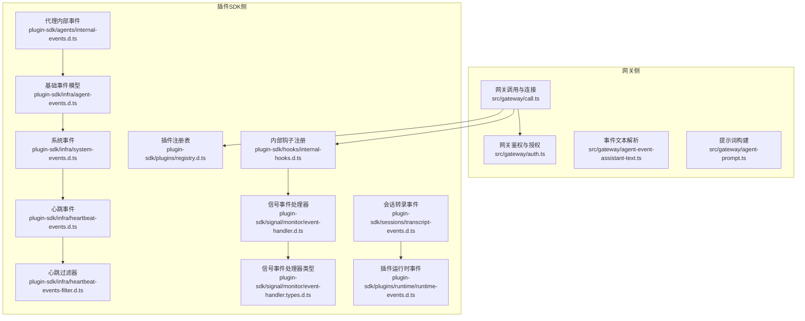
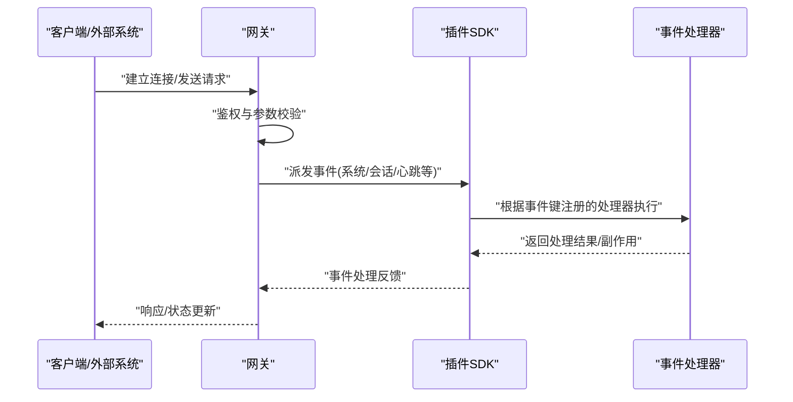
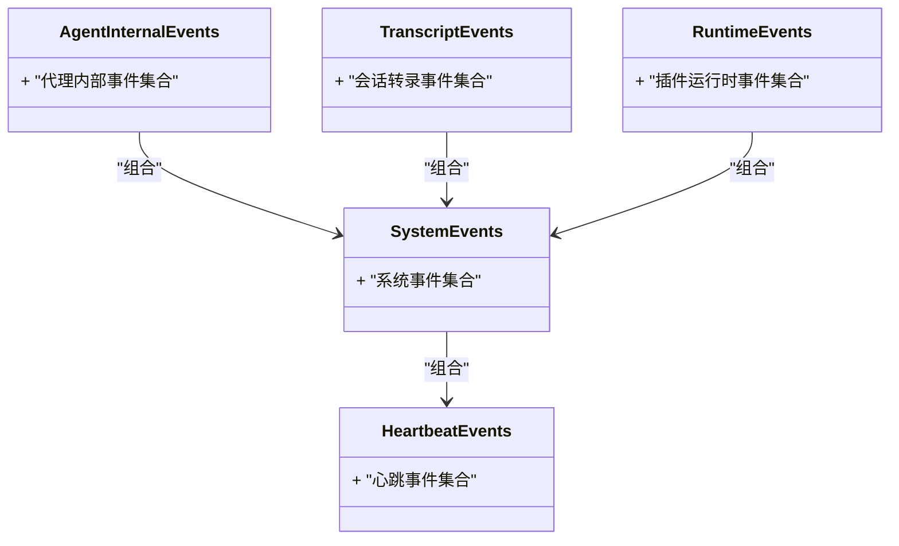
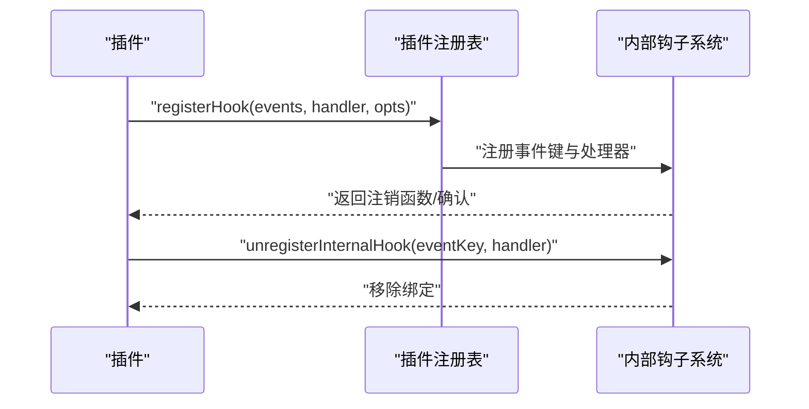
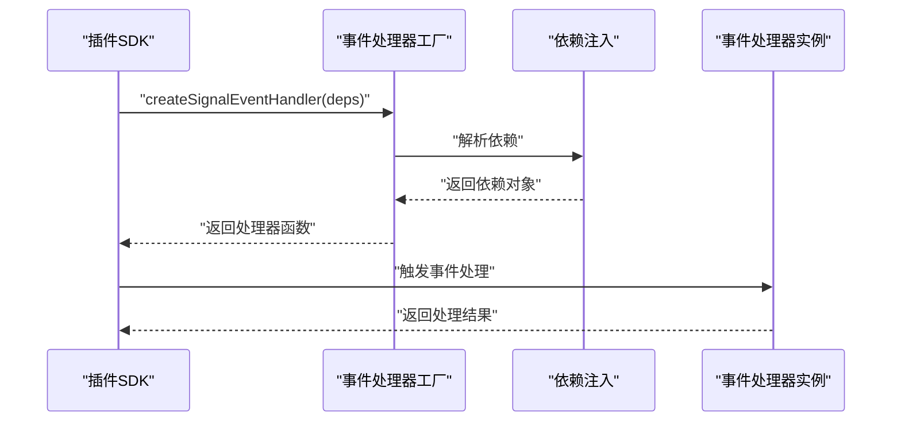
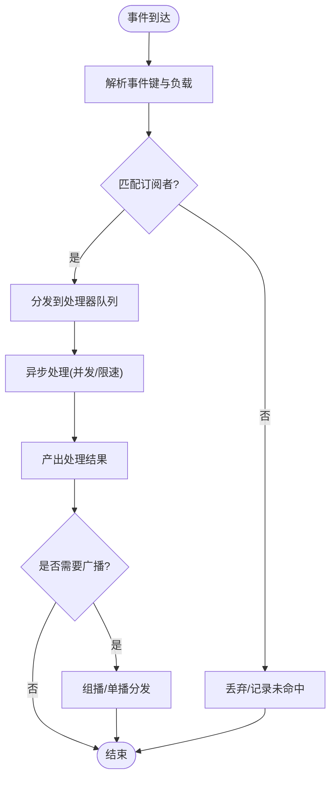
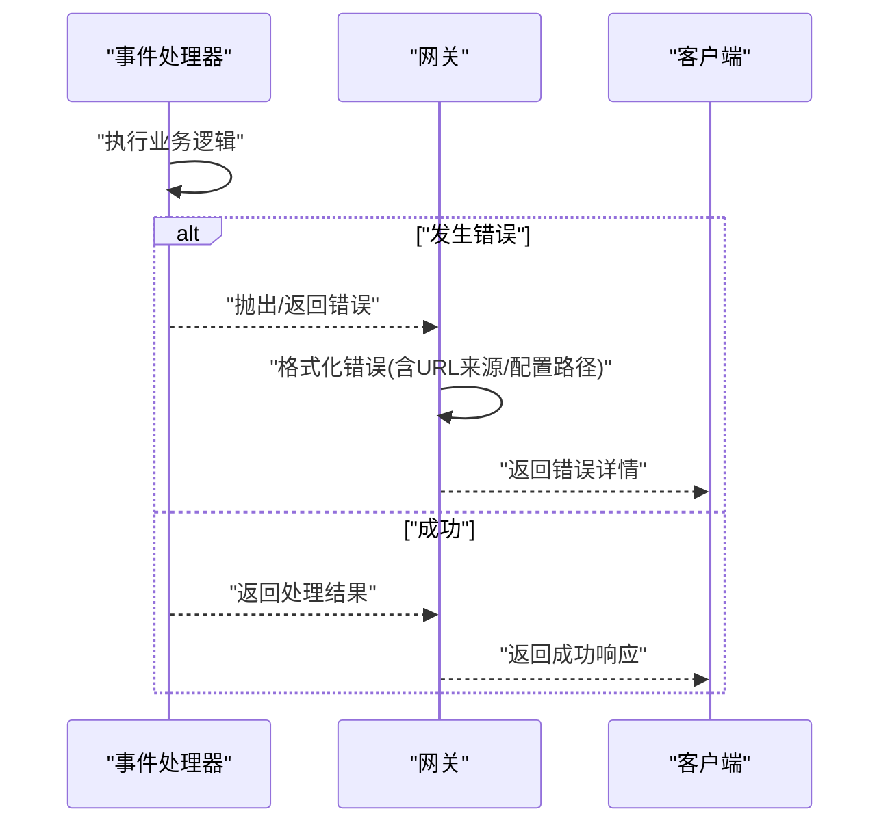
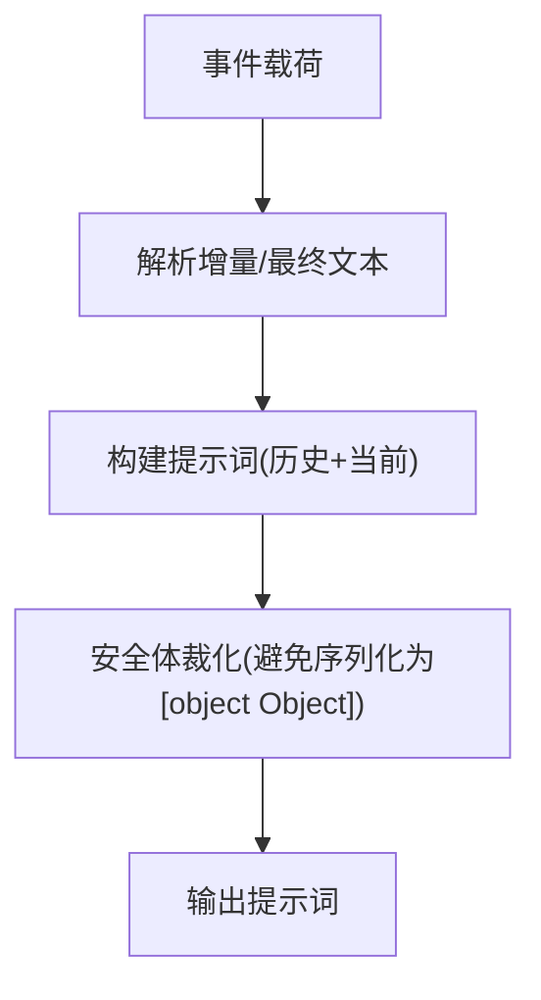
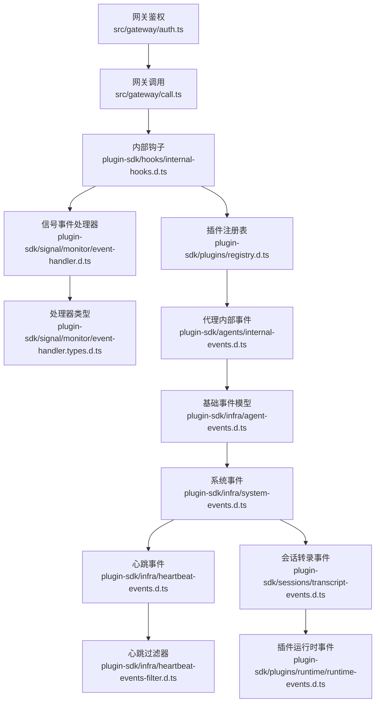

# 事件分发

<cite>
**本文引用的文件**
- [src/gateway/call.ts](file://src/gateway/call.ts)
- [src/gateway/auth.ts](file://src/gateway/auth.ts)
- [src/gateway/agent-event-assistant-text.ts](file://src/gateway/agent-event-assistant-text.ts)
- [src/gateway/agent-prompt.ts](file://src/gateway/agent-prompt.ts)
- [apps/electron/release/mac-arm64/OpenClaw.app/Contents/Resources/openclaw/dist/plugin-sdk/hooks/internal-hooks.d.ts](file://apps/electron/release/mac-arm64/OpenClaw.app/Contents/Resources/openclaw/dist/plugin-sdk/hooks/internal-hooks.d.ts)
- [apps/electron/release/mac-arm64/OpenClaw.app/Contents/Resources/openclaw/dist/plugin-sdk/plugins/registry.d.ts](file://apps/electron/release/mac-arm64/OpenClaw.app/Contents/Resources/openclaw/dist/plugin-sdk/plugins/registry.d.ts)
- [apps/electron/release/mac-arm64/OpenClaw.app/Contents/Resources/openclaw/dist/plugin-sdk/signal/monitor/event-handler.d.ts](file://apps/electron/release/mac-arm64/OpenClaw.app/Contents/Resources/openclaw/dist/plugin-sdk/signal/monitor/event-handler.d.ts)
- [apps/electron/release/mac-arm64/OpenClaw.app/Contents/Resources/openclaw/dist/plugin-sdk/signal/monitor/event-handler.types.d.ts](file://apps/electron/release/mac-arm64/OpenClaw.app/Contents/Resources/openclaw/dist/plugin-sdk/signal/monitor/event-handler.types.d.ts)
- [apps/electron/release/mac-arm64/OpenClaw.app/Contents/Resources/openclaw/dist/plugin-sdk/agents/internal-events.d.ts](file://apps/electron/release/mac-arm64/OpenClaw.app/Contents/Resources/openclaw/dist/plugin-sdk/agents/internal-events.d.ts)
- [apps/electron/release/mac-arm64/OpenClaw.app/Contents/Resources/openclaw/dist/plugin-sdk/infra/agent-events.d.ts](file://apps/electron/release/mac-arm64/OpenClaw.app/Contents/Resources/openclaw/dist/plugin-sdk/infra/agent-events.d.ts)
- [apps/electron/release/mac-arm64/OpenClaw.app/Contents/Resources/openclaw/dist/plugin-sdk/infra/system-events.d.ts](file://apps/electron/release/mac-arm64/OpenClaw.app/Contents/Resources/openclaw/dist/plugin-sdk/infra/system-events.d.ts)
- [apps/electron/release/mac-arm64/OpenClaw.app/Contents/Resources/openclaw/dist/plugin-sdk/infra/heartbeat-events.d.ts](file://apps/electron/release/mac-arm64/OpenClaw.app/Contents/Resources/openclaw/dist/plugin-sdk/infra/heartbeat-events.d.ts)
- [apps/electron/release/mac-arm64/OpenClaw.app/Contents/Resources/openclaw/dist/plugin-sdk/infra/heartbeat-events-filter.d.ts](file://apps/electron/release/mac-arm64/OpenClaw.app/Contents/Resources/openclaw/dist/plugin-sdk/infra/heartbeat-events-filter.d.ts)
- [apps/electron/release/mac-arm64/OpenClaw.app/Contents/Resources/openclaw/dist/plugin-sdk/sessions/transcript-events.d.ts](file://apps/electron/release/mac-arm64/OpenClaw.app/Contents/Resources/openclaw/dist/plugin-sdk/sessions/transcript-events.d.ts)
- [apps/electron/release/mac-arm64/OpenClaw.app/Contents/Resources/openclaw/dist/plugin-sdk/plugins/runtime/runtime-events.d.ts](file://apps/electron/release/mac-arm64/OpenClaw.app/Contents/Resources/openclaw/dist/plugin-sdk/plugins/runtime/runtime-events.d.ts)
</cite>

## 目录

1. [简介](#简介)
2. [项目结构](#项目结构)
3. [核心组件](#核心组件)
4. [架构总览](#架构总览)
5. [详细组件分析](#详细组件分析)
6. [依赖关系分析](#依赖关系分析)
7. [性能考量](#性能考量)
8. [故障排除指南](#故障排除指南)
9. [结论](#结论)
10. [附录](#附录)

## 简介

本文件面向OpenClaw网关的事件分发系统，聚焦于事件驱动架构、消息路由机制与事件处理器实现。文档从事件类型定义、订阅管理、广播策略与异步处理模式入手，逐步展开到事件流水线、错误传播机制与性能监控，并提供调试工具、故障排除指南与扩展开发最佳实践。为保证可追溯性，所有技术细节均对应仓库中的具体源码文件。

## 项目结构

OpenClaw在“网关侧”提供了事件相关的基础设施与工具（如事件文本解析、提示词构建等），并在“插件SDK侧”暴露了事件钩子、事件处理器类型与事件模型，用于插件生态中的事件订阅与处理。

- 网关侧关键文件
  - 事件文本解析：[src/gateway/agent-event-assistant-text.ts](file://src/gateway/agent-event-assistant-text.ts)
  - 提示词构建：[src/gateway/agent-prompt.ts](file://src/gateway/agent-prompt.ts)
  - 网关调用与连接：[src/gateway/call.ts](file://src/gateway/call.ts)
  - 网关鉴权与授权：[src/gateway/auth.ts](file://src/gateway/auth.ts)

- 插件SDK侧关键类型与接口
  - 内部钩子注册：[apps/electron/release/mac-arm64/OpenClaw.app/Contents/Resources/openclaw/dist/plugin-sdk/hooks/internal-hooks.d.ts](file://apps/electron/release/mac-arm64/OpenClaw.app/Contents/Resources/openclaw/dist/plugin-sdk/hooks/internal-hooks.d.ts)
  - 插件注册表：[apps/electron/release/mac-arm64/OpenClaw.app/Contents/Resources/openclaw/dist/plugin-sdk/plugins/registry.d.ts](file://apps/electron/release/mac-arm64/OpenClaw.app/Contents/Resources/openclaw/dist/plugin-sdk/plugins/registry.d.ts)
  - 信号事件处理器：[apps/electron/release/mac-arm64/OpenClaw.app/Contents/Resources/openclaw/dist/plugin-sdk/signal/monitor/event-handler.d.ts](file://apps/electron/release/mac-arm64/OpenClaw.app/Contents/Resources/openclaw/dist/plugin-sdk/signal/monitor/event-handler.d.ts)
  - 信号事件处理器类型：[apps/electron/release/mac-arm64/OpenClaw.app/Contents/Resources/openclaw/dist/plugin-sdk/signal/monitor/event-handler.types.d.ts](file://apps/electron/release/mac-arm64/OpenClaw.app/Contents/Resources/openclaw/dist/plugin-sdk/signal/monitor/event-handler.types.d.ts)
  - 代理内部事件：[apps/electron/release/mac-arm64/OpenClaw.app/Contents/Resources/openclaw/dist/plugin-sdk/agents/internal-events.d.ts](file://apps/electron/release/mac-arm64/OpenClaw.app/Contents/Resources/openclaw/dist/plugin-sdk/agents/internal-events.d.ts)
  - 基础事件模型：[apps/electron/release/mac-arm64/OpenClaw.app/Contents/Resources/openclaw/dist/plugin-sdk/infra/agent-events.d.ts](file://apps/electron/release/mac-arm64/OpenClaw.app/Contents/Resources/openclaw/dist/plugin-sdk/infra/agent-events.d.ts)
  - 系统事件：[apps/electron/release/mac-arm64/OpenClaw.app/Contents/Resources/openclaw/dist/plugin-sdk/infra/system-events.d.ts](file://apps/electron/release/mac-arm64/OpenClaw.app/Contents/Resources/openclaw/dist/plugin-sdk/infra/system-events.d.ts)
  - 心跳事件与过滤器：[apps/electron/release/mac-arm64/OpenClaw.app/Contents/Resources/openclaw/dist/plugin-sdk/infra/heartbeat-events.d.ts](file://apps/electron/release/mac-arm64/OpenClaw.app/Contents/Resources/openclaw/dist/plugin-sdk/infra/heartbeat-events.d.ts)、[apps/electron/release/mac-arm64/OpenClaw.app/Contents/Resources/openclaw/dist/plugin-sdk/infra/heartbeat-events-filter.d.ts](file://apps/electron/release/mac-arm64/OpenClaw.app/Contents/Resources/openclaw/dist/plugin-sdk/infra/heartbeat-events-filter.d.ts)
  - 会话转录事件：[apps/electron/release/mac-arm64/OpenClaw.app/Contents/Resources/openclaw/dist/plugin-sdk/sessions/transcript-events.d.ts](file://apps/electron/release/mac-arm64/OpenClaw.app/Contents/Resources/openclaw/dist/plugin-sdk/sessions/transcript-events.d.ts)
  - 插件运行时事件：[apps/electron/release/mac-arm64/OpenClaw.app/Contents/Resources/openclaw/dist/plugin-sdk/plugins/runtime/runtime-events.d.ts](file://apps/electron/release/mac-arm64/OpenClaw.app/Contents/Resources/openclaw/dist/plugin-sdk/plugins/runtime/runtime-events.d.ts)

**图表来源**

- [src/gateway/call.ts](file://src/gateway/call.ts)
- [src/gateway/auth.ts](file://src/gateway/auth.ts)
- [src/gateway/agent-event-assistant-text.ts](file://src/gateway/agent-event-assistant-text.ts)
- [src/gateway/agent-prompt.ts](file://src/gateway/agent-prompt.ts)
- [apps/electron/release/mac-arm64/OpenClaw.app/Contents/Resources/openclaw/dist/plugin-sdk/hooks/internal-hooks.d.ts](file://apps/electron/release/mac-arm64/OpenClaw.app/Contents/Resources/openclaw/dist/plugin-sdk/hooks/internal-hooks.d.ts)
- [apps/electron/release/mac-arm64/OpenClaw.app/Contents/Resources/openclaw/dist/plugin-sdk/plugins/registry.d.ts](file://apps/electron/release/mac-arm64/OpenClaw.app/Contents/Resources/openclaw/dist/plugin-sdk/plugins/registry.d.ts)
- [apps/electron/release/mac-arm64/OpenClaw.app/Contents/Resources/openclaw/dist/plugin-sdk/signal/monitor/event-handler.d.ts](file://apps/electron/release/mac-arm64/OpenClaw.app/Contents/Resources/openclaw/dist/plugin-sdk/signal/monitor/event-handler.d.ts)
- [apps/electron/release/mac-arm64/OpenClaw.app/Contents/Resources/openclaw/dist/plugin-sdk/signal/monitor/event-handler.types.d.ts](file://apps/electron/release/mac-arm64/OpenClaw.app/Contents/Resources/openclaw/dist/plugin-sdk/signal/monitor/event-handler.types.d.ts)
- [apps/electron/release/mac-arm64/OpenClaw.app/Contents/Resources/openclaw/dist/plugin-sdk/agents/internal-events.d.ts](file://apps/electron/release/mac-arm64/OpenClaw.app/Contents/Resources/openclaw/dist/plugin-sdk/agents/internal-events.d.ts)
- [apps/electron/release/mac-arm64/OpenClaw.app/Contents/Resources/openclaw/dist/plugin-sdk/infra/agent-events.d.ts](file://apps/electron/release/mac-arm64/OpenClaw.app/Contents/Resources/openclaw/dist/plugin-sdk/infra/agent-events.d.ts)
- [apps/electron/release/mac-arm64/OpenClaw.app/Contents/Resources/openclaw/dist/plugin-sdk/infra/system-events.d.ts](file://apps/electron/release/mac-arm64/OpenClaw.app/Contents/Resources/openclaw/dist/plugin-sdk/infra/system-events.d.ts)
- [apps/electron/release/mac-arm64/OpenClaw.app/Contents/Resources/openclaw/dist/plugin-sdk/infra/heartbeat-events.d.ts](file://apps/electron/release/mac-arm64/OpenClaw.app/Contents/Resources/openclaw/dist/plugin-sdk/infra/heartbeat-events.d.ts)
- [apps/electron/release/mac-arm64/OpenClaw.app/Contents/Resources/openclaw/dist/plugin-sdk/infra/heartbeat-events-filter.d.ts](file://apps/electron/release/mac-arm64/OpenClaw.app/Contents/Resources/openclaw/dist/plugin-sdk/infra/heartbeat-events-filter.d.ts)
- [apps/electron/release/mac-arm64/OpenClaw.app/Contents/Resources/openclaw/dist/plugin-sdk/sessions/transcript-events.d.ts](file://apps/electron/release/mac-arm64/OpenClaw.app/Contents/Resources/openclaw/dist/plugin-sdk/sessions/transcript-events.d.ts)
- [apps/electron/release/mac-arm64/OpenClaw.app/Contents/Resources/openclaw/dist/plugin-sdk/plugins/runtime/runtime-events.d.ts](file://apps/electron/release/mac-arm64/OpenClaw.app/Contents/Resources/openclaw/dist/plugin-sdk/plugins/runtime/runtime-events.d.ts)

**章节来源**

- [src/gateway/call.ts](file://src/gateway/call.ts)
- [src/gateway/auth.ts](file://src/gateway/auth.ts)
- [src/gateway/agent-event-assistant-text.ts](file://src/gateway/agent-event-assistant-text.ts)
- [src/gateway/agent-prompt.ts](file://src/gateway/agent-prompt.ts)
- [apps/electron/release/mac-arm64/OpenClaw.app/Contents/Resources/openclaw/dist/plugin-sdk/hooks/internal-hooks.d.ts](file://apps/electron/release/mac-arm64/OpenClaw.app/Contents/Resources/openclaw/dist/plugin-sdk/hooks/internal-hooks.d.ts)
- [apps/electron/release/mac-arm64/OpenClaw.app/Contents/Resources/openclaw/dist/plugin-sdk/plugins/registry.d.ts](file://apps/electron/release/mac-arm64/OpenClaw.app/Contents/Resources/openclaw/dist/plugin-sdk/plugins/registry.d.ts)
- [apps/electron/release/mac-arm64/OpenClaw.app/Contents/Resources/openclaw/dist/plugin-sdk/signal/monitor/event-handler.d.ts](file://apps/electron/release/mac-arm64/OpenClaw.app/Contents/Resources/openclaw/dist/plugin-sdk/signal/monitor/event-handler.d.ts)
- [apps/electron/release/mac-arm64/OpenClaw.app/Contents/Resources/openclaw/dist/plugin-sdk/signal/monitor/event-handler.types.d.ts](file://apps/electron/release/mac-arm64/OpenClaw.app/Contents/Resources/openclaw/dist/plugin-sdk/signal/monitor/event-handler.types.d.ts)
- [apps/electron/release/mac-arm64/OpenClaw.app/Contents/Resources/openclaw/dist/plugin-sdk/agents/internal-events.d.ts](file://apps/electron/release/mac-arm64/OpenClaw.app/Contents/Resources/openclaw/dist/plugin-sdk/agents/internal-events.d.ts)
- [apps/electron/release/mac-arm64/OpenClaw.app/Contents/Resources/openclaw/dist/plugin-sdk/infra/agent-events.d.ts](file://apps/electron/release/mac-arm64/OpenClaw.app/Contents/Resources/openclaw/dist/plugin-sdk/infra/agent-events.d.ts)
- [apps/electron/release/mac-arm64/OpenClaw.app/Contents/Resources/openclaw/dist/plugin-sdk/infra/system-events.d.ts](file://apps/electron/release/mac-arm64/OpenClaw.app/Contents/Resources/openclaw/dist/plugin-sdk/infra/system-events.d.ts)
- [apps/electron/release/mac-arm64/OpenClaw.app/Contents/Resources/openclaw/dist/plugin-sdk/infra/heartbeat-events.d.ts](file://apps/electron/release/mac-arm64/OpenClaw.app/Contents/Resources/openclaw/dist/plugin-sdk/infra/heartbeat-events.d.ts)
- [apps/electron/release/mac-arm64/OpenClaw.app/Contents/Resources/openclaw/dist/plugin-sdk/infra/heartbeat-events-filter.d.ts](file://apps/electron/release/mac-arm64/OpenClaw.app/Contents/Resources/openclaw/dist/plugin-sdk/infra/heartbeat-events-filter.d.ts)
- [apps/electron/release/mac-arm64/OpenClaw.app/Contents/Resources/openclaw/dist/plugin-sdk/sessions/transcript-events.d.ts](file://apps/electron/release/mac-arm64/OpenClaw.app/Contents/Resources/openclaw/dist/plugin-sdk/sessions/transcript-events.d.ts)
- [apps/electron/release/mac-arm64/OpenClaw.app/Contents/Resources/openclaw/dist/plugin-sdk/plugins/runtime/runtime-events.d.ts](file://apps/electron/release/mac-arm64/OpenClaw.app/Contents/Resources/openclaw/dist/plugin-sdk/plugins/runtime/runtime-events.d.ts)

## 核心组件

- 事件类型与数据模型
  - 代理内部事件：[apps/electron/release/mac-arm64/OpenClaw.app/Contents/Resources/openclaw/dist/plugin-sdk/agents/internal-events.d.ts](file://apps/electron/release/mac-arm64/OpenClaw.app/Contents/Resources/openclaw/dist/plugin-sdk/agents/internal-events.d.ts)
  - 基础事件模型：[apps/electron/release/mac-arm64/OpenClaw.app/Contents/Resources/openclaw/dist/plugin-sdk/infra/agent-events.d.ts](file://apps/electron/release/mac-arm64/OpenClaw.app/Contents/Resources/openclaw/dist/plugin-sdk/infra/agent-events.d.ts)
  - 系统事件：[apps/electron/release/mac-arm64/OpenClaw.app/Contents/Resources/openclaw/dist/plugin-sdk/infra/system-events.d.ts](file://apps/electron/release/mac-arm64/OpenClaw.app/Contents/Resources/openclaw/dist/plugin-sdk/infra/system-events.d.ts)
  - 心跳事件与过滤器：[apps/electron/release/mac-arm64/OpenClaw.app/Contents/Resources/openclaw/dist/plugin-sdk/infra/heartbeat-events.d.ts](file://apps/electron/release/mac-arm64/OpenClaw.app/Contents/Resources/openclaw/dist/plugin-sdk/infra/heartbeat-events.d.ts)、[apps/electron/release/mac-arm64/OpenClaw.app/Contents/Resources/openclaw/dist/plugin-sdk/infra/heartbeat-events-filter.d.ts](file://apps/electron/release/mac-arm64/OpenClaw.app/Contents/Resources/openclaw/dist/plugin-sdk/infra/heartbeat-events-filter.d.ts)
  - 会话转录事件：[apps/electron/release/mac-arm64/OpenClaw.app/Contents/Resources/openclaw/dist/plugin-sdk/sessions/transcript-events.d.ts](file://apps/electron/release/mac-arm64/OpenClaw.app/Contents/Resources/openclaw/dist/plugin-sdk/sessions/transcript-events.d.ts)
  - 插件运行时事件：[apps/electron/release/mac-arm64/OpenClaw.app/Contents/Resources/openclaw/dist/plugin-sdk/plugins/runtime/runtime-events.d.ts](file://apps/electron/release/mac-arm64/OpenClaw.app/Contents/Resources/openclaw/dist/plugin-sdk/plugins/runtime/runtime-events.d.ts)

- 订阅与钩子
  - 内部钩子注册与注销：[apps/electron/release/mac-arm64/OpenClaw.app/Contents/Resources/openclaw/dist/plugin-sdk/hooks/internal-hooks.d.ts](file://apps/electron/release/mac-arm64/OpenClaw.app/Contents/Resources/openclaw/dist/plugin-sdk/hooks/internal-hooks.d.ts)
  - 插件注册表（含注册钩子方法）：[apps/electron/release/mac-arm64/OpenClaw.app/Contents/Resources/openclaw/dist/plugin-sdk/plugins/registry.d.ts](file://apps/electron/release/mac-arm64/OpenClaw.app/Contents/Resources/openclaw/dist/plugin-sdk/plugins/registry.d.ts)

- 事件处理器
  - 信号事件处理器（工厂函数与依赖类型）：[apps/electron/release/mac-arm64/OpenClaw.app/Contents/Resources/openclaw/dist/plugin-sdk/signal/monitor/event-handler.d.ts](file://apps/electron/release/mac-arm64/OpenClaw.app/Contents/Resources/openclaw/dist/plugin-sdk/signal/monitor/event-handler.d.ts)、[apps/electron/release/mac-arm64/OpenClaw.app/Contents/Resources/openclaw/dist/plugin-sdk/signal/monitor/event-handler.types.d.ts](file://apps/electron/release/mac-arm64/OpenClaw.app/Contents/Resources/openclaw/dist/plugin-sdk/signal/monitor/event-handler.types.d.ts)

- 网关侧事件辅助
  - 事件文本解析：[src/gateway/agent-event-assistant-text.ts](file://src/gateway/agent-event-assistant-text.ts)
  - 提示词构建：[src/gateway/agent-prompt.ts](file://src/gateway/agent-prompt.ts)

**章节来源**

- [apps/electron/release/mac-arm64/OpenClaw.app/Contents/Resources/openclaw/dist/plugin-sdk/agents/internal-events.d.ts](file://apps/electron/release/mac-arm64/OpenClaw.app/Contents/Resources/openclaw/dist/plugin-sdk/agents/internal-events.d.ts)
- [apps/electron/release/mac-arm64/OpenClaw.app/Contents/Resources/openclaw/dist/plugin-sdk/infra/agent-events.d.ts](file://apps/electron/release/mac-arm64/OpenClaw.app/Contents/Resources/openclaw/dist/plugin-sdk/infra/agent-events.d.ts)
- [apps/electron/release/mac-arm64/OpenClaw.app/Contents/Resources/openclaw/dist/plugin-sdk/infra/system-events.d.ts](file://apps/electron/release/mac-arm64/OpenClaw.app/Contents/Resources/openclaw/dist/plugin-sdk/infra/system-events.d.ts)
- [apps/electron/release/mac-arm64/OpenClaw.app/Contents/Resources/openclaw/dist/plugin-sdk/infra/heartbeat-events.d.ts](file://apps/electron/release/mac-arm64/OpenClaw.app/Contents/Resources/openclaw/dist/plugin-sdk/infra/heartbeat-events.d.ts)
- [apps/electron/release/mac-arm64/OpenClaw.app/Contents/Resources/openclaw/dist/plugin-sdk/infra/heartbeat-events-filter.d.ts](file://apps/electron/release/mac-arm64/OpenClaw.app/Contents/Resources/openclaw/dist/plugin-sdk/infra/heartbeat-events-filter.d.ts)
- [apps/electron/release/mac-arm64/OpenClaw.app/Contents/Resources/openclaw/dist/plugin-sdk/sessions/transcript-events.d.ts](file://apps/electron/release/mac-arm64/OpenClaw.app/Contents/Resources/openclaw/dist/plugin-sdk/sessions/transcript-events.d.ts)
- [apps/electron/release/mac-arm64/OpenClaw.app/Contents/Resources/openclaw/dist/plugin-sdk/plugins/runtime/runtime-events.d.ts](file://apps/electron/release/mac-arm64/OpenClaw.app/Contents/Resources/openclaw/dist/plugin-sdk/plugins/runtime/runtime-events.d.ts)
- [apps/electron/release/mac-arm64/OpenClaw.app/Contents/Resources/openclaw/dist/plugin-sdk/hooks/internal-hooks.d.ts](file://apps/electron/release/mac-arm64/OpenClaw.app/Contents/Resources/openclaw/dist/plugin-sdk/hooks/internal-hooks.d.ts)
- [apps/electron/release/mac-arm64/OpenClaw.app/Contents/Resources/openclaw/dist/plugin-sdk/plugins/registry.d.ts](file://apps/electron/release/mac-arm64/OpenClaw.app/Contents/Resources/openclaw/dist/plugin-sdk/plugins/registry.d.ts)
- [apps/electron/release/mac-arm64/OpenClaw.app/Contents/Resources/openclaw/dist/plugin-sdk/signal/monitor/event-handler.d.ts](file://apps/electron/release/mac-arm64/OpenClaw.app/Contents/Resources/openclaw/dist/plugin-sdk/signal/monitor/event-handler.d.ts)
- [apps/electron/release/mac-arm64/OpenClaw.app/Contents/Resources/openclaw/dist/plugin-sdk/signal/monitor/event-handler.types.d.ts](file://apps/electron/release/mac-arm64/OpenClaw.app/Contents/Resources/openclaw/dist/plugin-sdk/signal/monitor/event-handler.types.d.ts)
- [src/gateway/agent-event-assistant-text.ts](file://src/gateway/agent-event-assistant-text.ts)
- [src/gateway/agent-prompt.ts](file://src/gateway/agent-prompt.ts)

## 架构总览

OpenClaw的事件分发由“网关侧”与“插件SDK侧”协同完成：

- 网关侧负责事件生成、文本解析与提示词构建，确保事件数据结构清晰、可追踪。
- 插件SDK侧提供统一的事件类型定义、钩子注册机制与事件处理器工厂，便于插件订阅与异步处理。

**图表来源**

- [src/gateway/call.ts](file://src/gateway/call.ts)
- [src/gateway/auth.ts](file://src/gateway/auth.ts)
- [apps/electron/release/mac-arm64/OpenClaw.app/Contents/Resources/openclaw/dist/plugin-sdk/hooks/internal-hooks.d.ts](file://apps/electron/release/mac-arm64/OpenClaw.app/Contents/Resources/openclaw/dist/plugin-sdk/hooks/internal-hooks.d.ts)
- [apps/electron/release/mac-arm64/OpenClaw.app/Contents/Resources/openclaw/dist/plugin-sdk/signal/monitor/event-handler.d.ts](file://apps/electron/release/mac-arm64/OpenClaw.app/Contents/Resources/openclaw/dist/plugin-sdk/signal/monitor/event-handler.d.ts)

## 详细组件分析

### 事件类型与数据模型

- 代理内部事件与会话转录事件：用于描述代理生命周期、工具调用、消息流等内部状态变化。
- 基础事件模型与系统事件：抽象出通用事件结构与系统级事件（如心跳、诊断等）。
- 插件运行时事件：承载插件生命周期与运行态事件。

**图表来源**

- [apps/electron/release/mac-arm64/OpenClaw.app/Contents/Resources/openclaw/dist/plugin-sdk/agents/internal-events.d.ts](file://apps/electron/release/mac-arm64/OpenClaw.app/Contents/Resources/openclaw/dist/plugin-sdk/agents/internal-events.d.ts)
- [apps/electron/release/mac-arm64/OpenClaw.app/Contents/Resources/openclaw/dist/plugin-sdk/sessions/transcript-events.d.ts](file://apps/electron/release/mac-arm64/OpenClaw.app/Contents/Resources/openclaw/dist/plugin-sdk/sessions/transcript-events.d.ts)
- [apps/electron/release/mac-arm64/OpenClaw.app/Contents/Resources/openclaw/dist/plugin-sdk/infra/system-events.d.ts](file://apps/electron/release/mac-arm64/OpenClaw.app/Contents/Resources/openclaw/dist/plugin-sdk/infra/system-events.d.ts)
- [apps/electron/release/mac-arm64/OpenClaw.app/Contents/Resources/openclaw/dist/plugin-sdk/infra/heartbeat-events.d.ts](file://apps/electron/release/mac-arm64/OpenClaw.app/Contents/Resources/openclaw/dist/plugin-sdk/infra/heartbeat-events.d.ts)
- [apps/electron/release/mac-arm64/OpenClaw.app/Contents/Resources/openclaw/dist/plugin-sdk/plugins/runtime/runtime-events.d.ts](file://apps/electron/release/mac-arm64/OpenClaw.app/Contents/Resources/openclaw/dist/plugin-sdk/plugins/runtime/runtime-events.d.ts)

**章节来源**

- [apps/electron/release/mac-arm64/OpenClaw.app/Contents/Resources/openclaw/dist/plugin-sdk/agents/internal-events.d.ts](file://apps/electron/release/mac-arm64/OpenClaw.app/Contents/Resources/openclaw/dist/plugin-sdk/agents/internal-events.d.ts)
- [apps/electron/release/mac-arm64/OpenClaw.app/Contents/Resources/openclaw/dist/plugin-sdk/sessions/transcript-events.d.ts](file://apps/electron/release/mac-arm64/OpenClaw.app/Contents/Resources/openclaw/dist/plugin-sdk/sessions/transcript-events.d.ts)
- [apps/electron/release/mac-arm64/OpenClaw.app/Contents/Resources/openclaw/dist/plugin-sdk/infra/system-events.d.ts](file://apps/electron/release/mac-arm64/OpenClaw.app/Contents/Resources/openclaw/dist/plugin-sdk/infra/system-events.d.ts)
- [apps/electron/release/mac-arm64/OpenClaw.app/Contents/Resources/openclaw/dist/plugin-sdk/infra/heartbeat-events.d.ts](file://apps/electron/release/mac-arm64/OpenClaw.app/Contents/Resources/openclaw/dist/plugin-sdk/infra/heartbeat-events.d.ts)
- [apps/electron/release/mac-arm64/OpenClaw.app/Contents/Resources/openclaw/dist/plugin-sdk/plugins/runtime/runtime-events.d.ts](file://apps/electron/release/mac-arm64/OpenClaw.app/Contents/Resources/openclaw/dist/plugin-sdk/plugins/runtime/runtime-events.d.ts)

### 订阅管理与钩子机制

- 内部钩子注册/注销：通过统一的注册接口将事件键与处理器绑定，支持按事件键取消注册，避免重复或泄漏。
- 插件注册表：提供注册钩子的方法签名，允许插件以字符串或数组形式订阅事件，并传入可选配置与上下文。

**图表来源**

- [apps/electron/release/mac-arm64/OpenClaw.app/Contents/Resources/openclaw/dist/plugin-sdk/hooks/internal-hooks.d.ts](file://apps/electron/release/mac-arm64/OpenClaw.app/Contents/Resources/openclaw/dist/plugin-sdk/hooks/internal-hooks.d.ts)
- [apps/electron/release/mac-arm64/OpenClaw.app/Contents/Resources/openclaw/dist/plugin-sdk/plugins/registry.d.ts](file://apps/electron/release/mac-arm64/OpenClaw.app/Contents/Resources/openclaw/dist/plugin-sdk/plugins/registry.d.ts)

**章节来源**

- [apps/electron/release/mac-arm64/OpenClaw.app/Contents/Resources/openclaw/dist/plugin-sdk/hooks/internal-hooks.d.ts](file://apps/electron/release/mac-arm64/OpenClaw.app/Contents/Resources/openclaw/dist/plugin-sdk/hooks/internal-hooks.d.ts)
- [apps/electron/release/mac-arm64/OpenClaw.app/Contents/Resources/openclaw/dist/plugin-sdk/plugins/registry.d.ts](file://apps/electron/release/mac-arm64/OpenClaw.app/Contents/Resources/openclaw/dist/plugin-sdk/plugins/registry.d.ts)

### 事件处理器实现

- 信号事件处理器：通过工厂函数创建处理器实例，接收事件对象并执行业务逻辑；依赖类型定义了处理器所需的依赖项。
- 处理器生命周期：通常包含初始化、事件处理、清理阶段；建议在处理器中实现幂等与错误隔离。

**图表来源**

- [apps/electron/release/mac-arm64/OpenClaw.app/Contents/Resources/openclaw/dist/plugin-sdk/signal/monitor/event-handler.d.ts](file://apps/electron/release/mac-arm64/OpenClaw.app/Contents/Resources/openclaw/dist/plugin-sdk/signal/monitor/event-handler.d.ts)
- [apps/electron/release/mac-arm64/OpenClaw.app/Contents/Resources/openclaw/dist/plugin-sdk/signal/monitor/event-handler.types.d.ts](file://apps/electron/release/mac-arm64/OpenClaw.app/Contents/Resources/openclaw/dist/plugin-sdk/signal/monitor/event-handler.types.d.ts)

**章节来源**

- [apps/electron/release/mac-arm64/OpenClaw.app/Contents/Resources/openclaw/dist/plugin-sdk/signal/monitor/event-handler.d.ts](file://apps/electron/release/mac-arm64/OpenClaw.app/Contents/Resources/openclaw/dist/plugin-sdk/signal/monitor/event-handler.d.ts)
- [apps/electron/release/mac-arm64/OpenClaw.app/Contents/Resources/openclaw/dist/plugin-sdk/signal/monitor/event-handler.types.d.ts](file://apps/electron/release/mac-arm64/OpenClaw.app/Contents/Resources/openclaw/dist/plugin-sdk/signal/monitor/event-handler.types.d.ts)

### 事件流水线与广播策略

- 事件流水线
  - 输入：来自通道/会话/系统的心跳/转录/内部事件。
  - 路由：根据事件键与订阅者映射，选择目标处理器。
  - 处理：异步执行处理器，支持并发与串行策略。
  - 输出：事件处理结果回传至网关或SDK，触发后续动作。
- 广播策略
  - 单播：针对特定订阅者。
  - 组播：对多个订阅者广播，注意去重与顺序控制。
  - 过滤：使用心跳过滤器等策略减少冗余事件。

**图表来源**

- [apps/electron/release/mac-arm64/OpenClaw.app/Contents/Resources/openclaw/dist/plugin-sdk/infra/heartbeat-events-filter.d.ts](file://apps/electron/release/mac-arm64/OpenClaw.app/Contents/Resources/openclaw/dist/plugin-sdk/infra/heartbeat-events-filter.d.ts)
- [apps/electron/release/mac-arm64/OpenClaw.app/Contents/Resources/openclaw/dist/plugin-sdk/infra/heartbeat-events.d.ts](file://apps/electron/release/mac-arm64/OpenClaw.app/Contents/Resources/openclaw/dist/plugin-sdk/infra/heartbeat-events.d.ts)
- [apps/electron/release/mac-arm64/OpenClaw.app/Contents/Resources/openclaw/dist/plugin-sdk/infra/system-events.d.ts](file://apps/electron/release/mac-arm64/OpenClaw.app/Contents/Resources/openclaw/dist/plugin-sdk/infra/system-events.d.ts)

**章节来源**

- [apps/electron/release/mac-arm64/OpenClaw.app/Contents/Resources/openclaw/dist/plugin-sdk/infra/heartbeat-events-filter.d.ts](file://apps/electron/release/mac-arm64/OpenClaw.app/Contents/Resources/openclaw/dist/plugin-sdk/infra/heartbeat-events-filter.d.ts)
- [apps/electron/release/mac-arm64/OpenClaw.app/Contents/Resources/openclaw/dist/plugin-sdk/infra/heartbeat-events.d.ts](file://apps/electron/release/mac-arm64/OpenClaw.app/Contents/Resources/openclaw/dist/plugin-sdk/infra/heartbeat-events.d.ts)
- [apps/electron/release/mac-arm64/OpenClaw.app/Contents/Resources/openclaw/dist/plugin-sdk/infra/system-events.d.ts](file://apps/electron/release/mac-arm64/OpenClaw.app/Contents/Resources/openclaw/dist/plugin-sdk/infra/system-events.d.ts)

### 异步处理模式与错误传播

- 异步处理
  - 使用Promise/回调模式，确保事件处理器非阻塞。
  - 对高吞吐事件采用并发限制与背压策略。
- 错误传播
  - 处理器内部捕获异常并转换为可传播的错误对象。
  - 网关侧在连接与调用失败时格式化错误信息，包含URL来源与配置路径，便于定位问题。

**图表来源**

- [src/gateway/call.ts](file://src/gateway/call.ts)

**章节来源**

- [src/gateway/call.ts](file://src/gateway/call.ts)

### 网关侧事件辅助与提示词构建

- 事件文本解析：从事件载荷中提取增量/最终文本，保障消息流一致性。
- 提示词构建：将历史条目与当前消息整合为模板化的提示词，优先最近用户/工具输入，避免重复上下文。

**图表来源**

- [src/gateway/agent-event-assistant-text.ts](file://src/gateway/agent-event-assistant-text.ts)
- [src/gateway/agent-prompt.ts](file://src/gateway/agent-prompt.ts)

**章节来源**

- [src/gateway/agent-event-assistant-text.ts](file://src/gateway/agent-event-assistant-text.ts)
- [src/gateway/agent-prompt.ts](file://src/gateway/agent-prompt.ts)

## 依赖关系分析

- 组件耦合
  - 网关调用与鉴权紧密耦合，鉴权结果影响事件路由与处理权限。
  - 插件SDK的钩子系统与事件处理器解耦，通过事件键实现松耦合订阅。
- 外部依赖
  - WebSocket/TLS、环境变量、配置文件与密钥解析系统共同决定事件通道的安全性与可用性。

**图表来源**

- [src/gateway/auth.ts](file://src/gateway/auth.ts)
- [src/gateway/call.ts](file://src/gateway/call.ts)
- [apps/electron/release/mac-arm64/OpenClaw.app/Contents/Resources/openclaw/dist/plugin-sdk/hooks/internal-hooks.d.ts](file://apps/electron/release/mac-arm64/OpenClaw.app/Contents/Resources/openclaw/dist/plugin-sdk/hooks/internal-hooks.d.ts)
- [apps/electron/release/mac-arm64/OpenClaw.app/Contents/Resources/openclaw/dist/plugin-sdk/plugins/registry.d.ts](file://apps/electron/release/mac-arm64/OpenClaw.app/Contents/Resources/openclaw/dist/plugin-sdk/plugins/registry.d.ts)
- [apps/electron/release/mac-arm64/OpenClaw.app/Contents/Resources/openclaw/dist/plugin-sdk/signal/monitor/event-handler.d.ts](file://apps/electron/release/mac-arm64/OpenClaw.app/Contents/Resources/openclaw/dist/plugin-sdk/signal/monitor/event-handler.d.ts)
- [apps/electron/release/mac-arm64/OpenClaw.app/Contents/Resources/openclaw/dist/plugin-sdk/signal/monitor/event-handler.types.d.ts](file://apps/electron/release/mac-arm64/OpenClaw.app/Contents/Resources/openclaw/dist/plugin-sdk/signal/monitor/event-handler.types.d.ts)
- [apps/electron/release/mac-arm64/OpenClaw.app/Contents/Resources/openclaw/dist/plugin-sdk/agents/internal-events.d.ts](file://apps/electron/release/mac-arm64/OpenClaw.app/Contents/Resources/openclaw/dist/plugin-sdk/agents/internal-events.d.ts)
- [apps/electron/release/mac-arm64/OpenClaw.app/Contents/Resources/openclaw/dist/plugin-sdk/infra/agent-events.d.ts](file://apps/electron/release/mac-arm64/OpenClaw.app/Contents/Resources/openclaw/dist/plugin-sdk/infra/agent-events.d.ts)
- [apps/electron/release/mac-arm64/OpenClaw.app/Contents/Resources/openclaw/dist/plugin-sdk/infra/system-events.d.ts](file://apps/electron/release/mac-arm64/OpenClaw.app/Contents/Resources/openclaw/dist/plugin-sdk/infra/system-events.d.ts)
- [apps/electron/release/mac-arm64/OpenClaw.app/Contents/Resources/openclaw/dist/plugin-sdk/infra/heartbeat-events.d.ts](file://apps/electron/release/mac-arm64/OpenClaw.app/Contents/Resources/openclaw/dist/plugin-sdk/infra/heartbeat-events.d.ts)
- [apps/electron/release/mac-arm64/OpenClaw.app/Contents/Resources/openclaw/dist/plugin-sdk/infra/heartbeat-events-filter.d.ts](file://apps/electron/release/mac-arm64/OpenClaw.app/Contents/Resources/openclaw/dist/plugin-sdk/infra/heartbeat-events-filter.d.ts)
- [apps/electron/release/mac-arm64/OpenClaw.app/Contents/Resources/openclaw/dist/plugin-sdk/sessions/transcript-events.d.ts](file://apps/electron/release/mac-arm64/OpenClaw.app/Contents/Resources/openclaw/dist/plugin-sdk/sessions/transcript-events.d.ts)
- [apps/electron/release/mac-arm64/OpenClaw.app/Contents/Resources/openclaw/dist/plugin-sdk/plugins/runtime/runtime-events.d.ts](file://apps/electron/release/mac-arm64/OpenClaw.app/Contents/Resources/openclaw/dist/plugin-sdk/plugins/runtime/runtime-events.d.ts)

**章节来源**

- [src/gateway/auth.ts](file://src/gateway/auth.ts)
- [src/gateway/call.ts](file://src/gateway/call.ts)
- [apps/electron/release/mac-arm64/OpenClaw.app/Contents/Resources/openclaw/dist/plugin-sdk/hooks/internal-hooks.d.ts](file://apps/electron/release/mac-arm64/OpenClaw.app/Contents/Resources/openclaw/dist/plugin-sdk/hooks/internal-hooks.d.ts)
- [apps/electron/release/mac-arm64/OpenClaw.app/Contents/Resources/openclaw/dist/plugin-sdk/plugins/registry.d.ts](file://apps/electron/release/mac-arm64/OpenClaw.app/Contents/Resources/openclaw/dist/plugin-sdk/plugins/registry.d.ts)
- [apps/electron/release/mac-arm64/OpenClaw.app/Contents/Resources/openclaw/dist/plugin-sdk/signal/monitor/event-handler.d.ts](file://apps/electron/release/mac-arm64/OpenClaw.app/Contents/Resources/openclaw/dist/plugin-sdk/signal/monitor/event-handler.d.ts)
- [apps/electron/release/mac-arm64/OpenClaw.app/Contents/Resources/openclaw/dist/plugin-sdk/signal/monitor/event-handler.types.d.ts](file://apps/electron/release/mac-arm64/OpenClaw.app/Contents/Resources/openclaw/dist/plugin-sdk/signal/monitor/event-handler.types.d.ts)
- [apps/electron/release/mac-arm64/OpenClaw.app/Contents/Resources/openclaw/dist/plugin-sdk/agents/internal-events.d.ts](file://apps/electron/release/mac-arm64/OpenClaw.app/Contents/Resources/openclaw/dist/plugin-sdk/agents/internal-events.d.ts)
- [apps/electron/release/mac-arm64/OpenClaw.app/Contents/Resources/openclaw/dist/plugin-sdk/infra/agent-events.d.ts](file://apps/electron/release/mac-arm64/OpenClaw.app/Contents/Resources/openclaw/dist/plugin-sdk/infra/agent-events.d.ts)
- [apps/electron/release/mac-arm64/OpenClaw.app/Contents/Resources/openclaw/dist/plugin-sdk/infra/system-events.d.ts](file://apps/electron/release/mac-arm64/OpenClaw.app/Contents/Resources/openclaw/dist/plugin-sdk/infra/system-events.d.ts)
- [apps/electron/release/mac-arm64/OpenClaw.app/Contents/Resources/openclaw/dist/plugin-sdk/infra/heartbeat-events.d.ts](file://apps/electron/release/mac-arm64/OpenClaw.app/Contents/Resources/openclaw/dist/plugin-sdk/infra/heartbeat-events.d.ts)
- [apps/electron/release/mac-arm64/OpenClaw.app/Contents/Resources/openclaw/dist/plugin-sdk/infra/heartbeat-events-filter.d.ts](file://apps/electron/release/mac-arm64/OpenClaw.app/Contents/Resources/openclaw/dist/plugin-sdk/infra/heartbeat-events-filter.d.ts)
- [apps/electron/release/mac-arm64/OpenClaw.app/Contents/Resources/openclaw/dist/plugin-sdk/sessions/transcript-events.d.ts](file://apps/electron/release/mac-arm64/OpenClaw.app/Contents/Resources/openclaw/dist/plugin-sdk/sessions/transcript-events.d.ts)
- [apps/electron/release/mac-arm64/OpenClaw.app/Contents/Resources/openclaw/dist/plugin-sdk/plugins/runtime/runtime-events.d.ts](file://apps/electron/release/mac-arm64/OpenClaw.app/Contents/Resources/openclaw/dist/plugin-sdk/plugins/runtime/runtime-events.d.ts)

## 性能考量

- 并发与限速
  - 对高频事件（如心跳）采用并发限制与背压策略，避免过载。
- 序列化与带宽
  - 提示词构建时进行安全体裁化，避免大对象序列化导致的内存与网络开销。
- 连接与超时
  - 网关调用设置合理超时与定时器上限，防止长时间占用资源。
- 监控与可观测性
  - 在事件处理器中埋点计数与耗时指标，结合心跳事件与系统事件进行聚合分析。

[本节为通用指导，无需列出章节来源]

## 故障排除指南

- 连接与URL安全
  - 若出现明文ws://到非环回地址的错误，需检查远程URL是否使用wss://或本地绑定模式，并参考安全提示修复。
- 鉴权失败
  - 检查令牌/密码配置与来源（环境变量/配置文件），确认速率限制与代理头是否正确传递。
- 事件未命中
  - 确认事件键是否正确注册，处理器是否已加载，是否存在过滤器导致事件被丢弃。
- 错误信息定位
  - 网关侧在连接关闭/超时时会附带连接详情（来源、配置路径），便于快速定位问题。

**章节来源**

- [src/gateway/call.ts](file://src/gateway/call.ts)
- [src/gateway/auth.ts](file://src/gateway/auth.ts)

## 结论

OpenClaw的事件分发体系通过“网关侧事件生成与辅助”与“插件SDK侧事件模型与处理器”的协作，实现了清晰的事件驱动架构。借助统一的事件类型、订阅管理与异步处理模式，系统具备良好的扩展性与可维护性。配合错误传播与性能监控，可在复杂场景下保持稳定与高效。

[本节为总结，无需列出章节来源]

## 附录

- 扩展开发最佳实践
  - 使用事件键进行精确订阅，避免过度广播。
  - 在处理器中实现幂等与错误隔离，确保单个事件失败不影响整体流水线。
  - 合理设置并发与限速，结合心跳事件进行健康度监测。
  - 利用提示词构建与事件文本解析，确保消息流一致性与可读性。

[本节为通用指导，无需列出章节来源]
