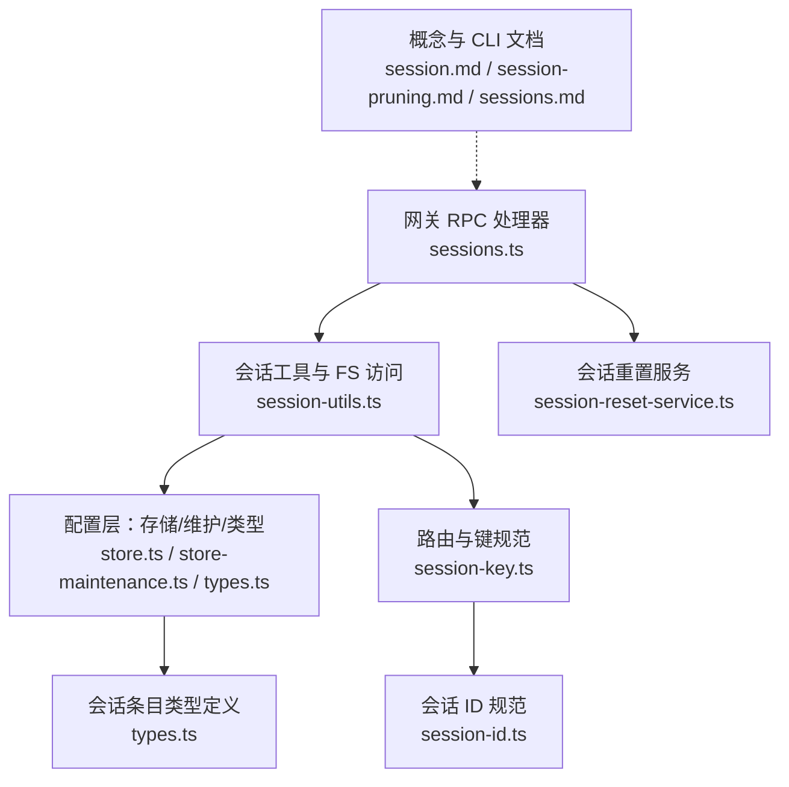
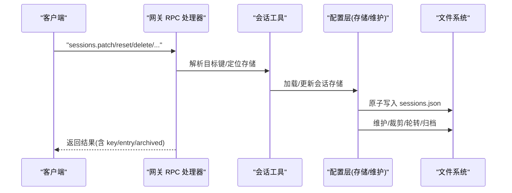
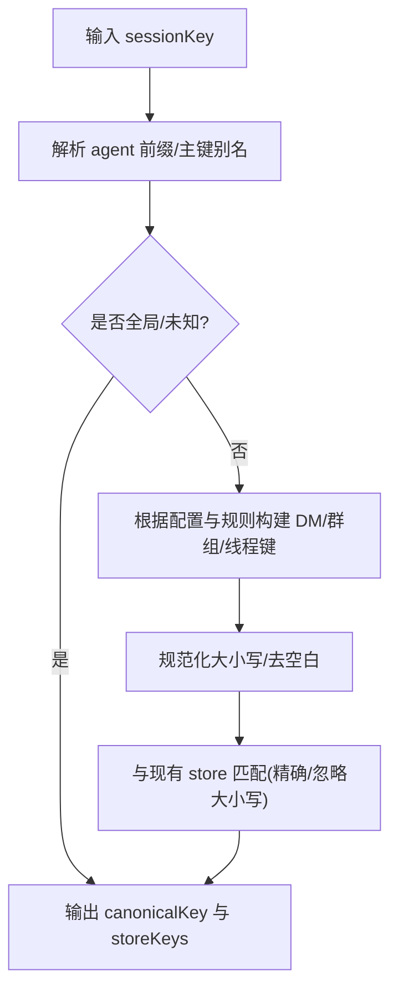
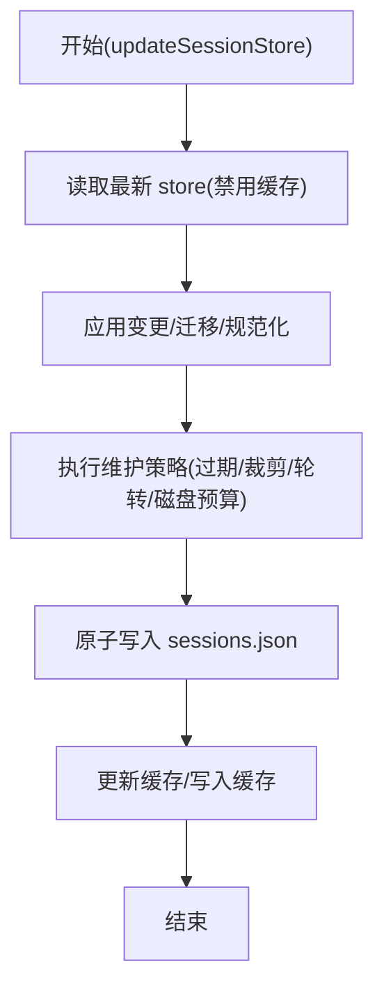
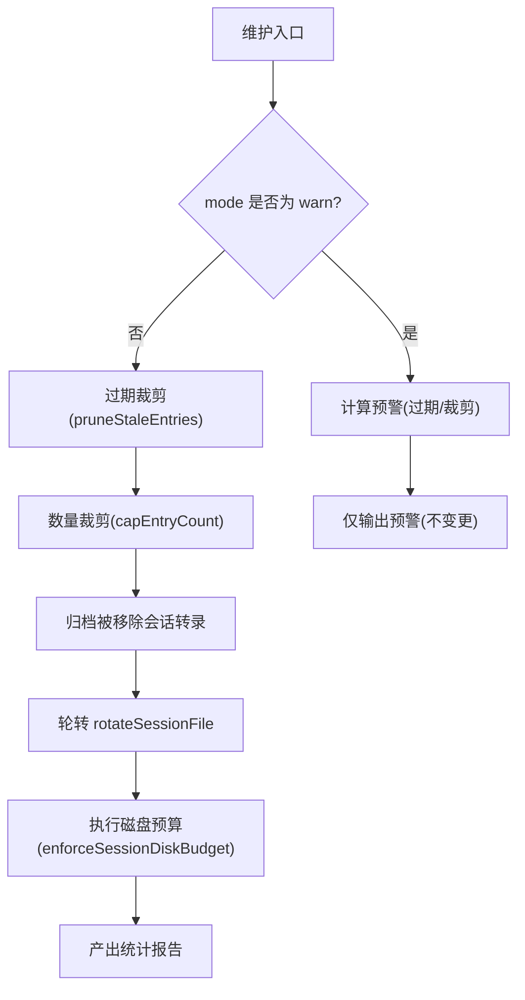
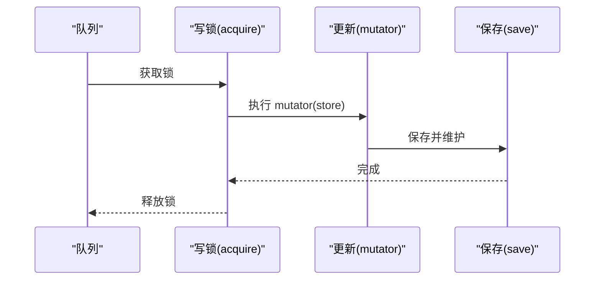
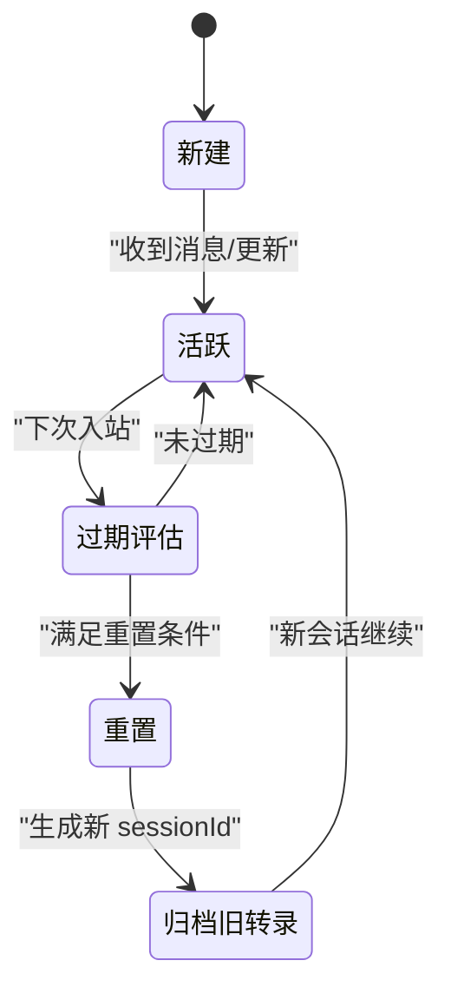
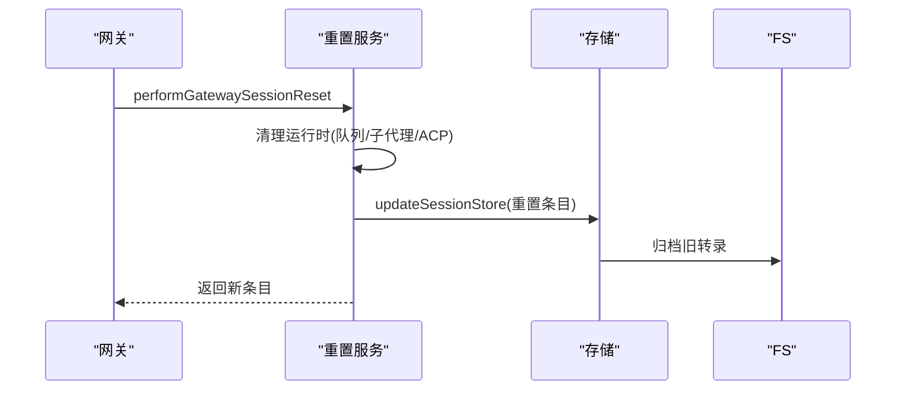
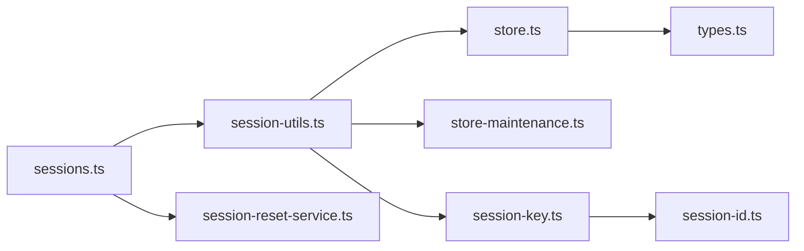

# 会话管理

<cite>
**本文引用的文件**
- [src/gateway/server-methods/sessions.ts](file://src/gateway/server-methods/sessions.ts)
- [src/gateway/session-utils.ts](file://src/gateway/session-utils.ts)
- [src/gateway/session-reset-service.ts](file://src/gateway/session-reset-service.ts)
- [src/config/sessions/store.ts](file://src/config/sessions/store.ts)
- [src/config/sessions/store-maintenance.ts](file://src/config/sessions/store-maintenance.ts)
- [src/config/sessions/types.ts](file://src/config/sessions/types.ts)
- [src/routing/session-key.ts](file://src/routing/session-key.ts)
- [src/sessions/session-id.ts](file://src/sessions/session-id.ts)
- [docs/concepts/session.md](file://docs/concepts/session.md)
- [docs/concepts/session-pruning.md](file://docs/concepts/session-pruning.md)
- [docs/cli/sessions.md](file://docs/cli/sessions.md)
</cite>

## 目录

1. [简介](#简介)
2. [项目结构](#项目结构)
3. [核心组件](#核心组件)
4. [架构总览](#架构总览)
5. [详细组件分析](#详细组件分析)
6. [依赖关系分析](#依赖关系分析)
7. [性能考量](#性能考量)
8. [故障排查指南](#故障排查指南)
9. [结论](#结论)
10. [附录](#附录)

## 简介

本文件系统性阐述 OpenClaw 网关中的会话管理系统，覆盖会话生命周期管理、状态跟踪与持久化、会话键生成与规范化、存储策略、清理与维护机制、并发访问控制、内存管理与性能优化、监控指标与故障恢复、以及最佳实践。内容基于源码与官方概念文档整理，确保技术细节可追溯至具体实现。

## 项目结构

会话管理由“网关 RPC 处理器”、“会话工具与 FS 访问”、“配置层（存储、维护、类型）”、“路由与键规范”等模块协同完成，并通过 CLI 与文档提供运维与审计能力。

**图表来源**

- [src/gateway/server-methods/sessions.ts:120-473](file://src/gateway/server-methods/sessions.ts#L120-L473)
- [src/gateway/session-utils.ts:1-800](file://src/gateway/session-utils.ts#L1-L800)
- [src/gateway/session-reset-service.ts:1-365](file://src/gateway/session-reset-service.ts#L1-L365)
- [src/config/sessions/store.ts:1-884](file://src/config/sessions/store.ts#L1-L884)
- [src/config/sessions/store-maintenance.ts:1-328](file://src/config/sessions/store-maintenance.ts#L1-L328)
- [src/config/sessions/types.ts:1-380](file://src/config/sessions/types.ts#L1-L380)
- [src/routing/session-key.ts:1-254](file://src/routing/session-key.ts#L1-L254)
- [src/sessions/session-id.ts:1-6](file://src/sessions/session-id.ts#L1-L6)
- [docs/concepts/session.md:1-311](file://docs/concepts/session.md#L1-L311)
- [docs/concepts/session-pruning.md:1-122](file://docs/concepts/session-pruning.md#L1-L122)
- [docs/cli/sessions.md:1-105](file://docs/cli/sessions.md#L1-L105)

**章节来源**

- [src/gateway/server-methods/sessions.ts:120-473](file://src/gateway/server-methods/sessions.ts#L120-L473)
- [src/gateway/session-utils.ts:1-800](file://src/gateway/session-utils.ts#L1-L800)
- [src/gateway/session-reset-service.ts:1-365](file://src/gateway/session-reset-service.ts#L1-L365)
- [src/config/sessions/store.ts:1-884](file://src/config/sessions/store.ts#L1-L884)
- [src/config/sessions/store-maintenance.ts:1-328](file://src/config/sessions/store-maintenance.ts#L1-L328)
- [src/config/sessions/types.ts:1-380](file://src/config/sessions/types.ts#L1-L380)
- [src/routing/session-key.ts:1-254](file://src/routing/session-key.ts#L1-L254)
- [src/sessions/session-id.ts:1-6](file://src/sessions/session-id.ts#L1-L6)
- [docs/concepts/session.md:1-311](file://docs/concepts/session.md#L1-L311)
- [docs/concepts/session-pruning.md:1-122](file://docs/concepts/session-pruning.md#L1-L122)
- [docs/cli/sessions.md:1-105](file://docs/cli/sessions.md#L1-L105)

## 核心组件

- 网关会话 RPC 处理器：提供 list/preview/resolve/patch/reset/delete/get/compact 等方法，统一入口处理客户端请求。
- 会话工具与 FS 访问：负责加载/读取/预览会话、解析键、定位存储路径、归档与清理历史、读写 JSONL 转录。
- 配置层（存储/维护/类型）：定义 SessionEntry 结构、缓存与锁、维护策略（裁剪、过期、轮转、磁盘预算）、迁移与归档。
- 路由与键规范：会话键标准化、主键别名解析、DM/群组/线程键构建、账号与身份映射。
- 会话重置服务：在重置前进行运行时清理（队列、子代理、浏览器标签、ACP 运行时），生成新 sessionId 并归档旧转录。

**章节来源**

- [src/gateway/server-methods/sessions.ts:120-473](file://src/gateway/server-methods/sessions.ts#L120-L473)
- [src/gateway/session-utils.ts:1-800](file://src/gateway/session-utils.ts#L1-L800)
- [src/gateway/session-reset-service.ts:1-365](file://src/gateway/session-reset-service.ts#L1-L365)
- [src/config/sessions/store.ts:1-884](file://src/config/sessions/store.ts#L1-L884)
- [src/config/sessions/store-maintenance.ts:1-328](file://src/config/sessions/store-maintenance.ts#L1-L328)
- [src/config/sessions/types.ts:1-380](file://src/config/sessions/types.ts#L1-L380)
- [src/routing/session-key.ts:1-254](file://src/routing/session-key.ts#L1-L254)

## 架构总览

下图展示从客户端到网关、再到存储与 FS 的关键交互流程。

**图表来源**

- [src/gateway/server-methods/sessions.ts:120-473](file://src/gateway/server-methods/sessions.ts#L120-L473)
- [src/gateway/session-utils.ts:1-800](file://src/gateway/session-utils.ts#L1-L800)
- [src/config/sessions/store.ts:511-533](file://src/config/sessions/store.ts#L511-L533)
- [src/config/sessions/store-maintenance.ts:155-327](file://src/config/sessions/store-maintenance.ts#L155-L327)

## 详细组件分析

### 会话键生成与规范化

- 键标准化规则
  - 支持 agent:<agentId>:<mainKey> 主键别名；当 mainKey 非 "main" 时，会识别大小写变体并合并。
  - DM 分级隔离：main/per-peer/per-channel-peer/per-account-channel-peer，支持 identityLinks 将多平台同一个人映射为同一会话。
  - 群组/频道键：agent:<agentId>:<channel>:(group|channel):<id>，线程键支持 :thread:<threadId> 后缀。
  - 全局/未知键："global"/"unknown" 保留字。
- 会话 ID 规范
  - 使用 UUID v4，正则校验会话 ID 字符串格式。

**图表来源**

- [src/routing/session-key.ts:118-174](file://src/routing/session-key.ts#L118-L174)
- [src/gateway/session-utils.ts:407-442](file://src/gateway/session-utils.ts#L407-L442)
- [src/gateway/session-utils.ts:480-533](file://src/gateway/session-utils.ts#L480-L533)
- [src/sessions/session-id.ts:1-6](file://src/sessions/session-id.ts#L1-L6)

**章节来源**

- [src/routing/session-key.ts:118-174](file://src/routing/session-key.ts#L118-L174)
- [src/gateway/session-utils.ts:407-442](file://src/gateway/session-utils.ts#L407-L442)
- [src/gateway/session-utils.ts:480-533](file://src/gateway/session-utils.ts#L480-L533)
- [src/sessions/session-id.ts:1-6](file://src/sessions/session-id.ts#L1-L6)

### 会话存储策略与持久化

- 存储位置
  - 每个 agent 对应独立 sessions.json；路径模板支持 {agentId} 占位。
- 缓存与锁
  - 读缓存：按文件 mtime/size/TTL 缓存序列化与对象，减少重复 IO。
  - 写锁：Promise 链式队列，避免并发写冲突；支持超时与过期清理。
- 写入流程
  - 读取最新 store（跳过缓存）
  - 应用变更（合并/迁移/规范化）
  - 维护策略执行（裁剪/过期/轮转/磁盘预算）
  - 原子写入 sessions.json（Windows 重试与回退）
  - 更新缓存

**图表来源**

- [src/config/sessions/store.ts:521-533](file://src/config/sessions/store.ts#L521-L533)
- [src/config/sessions/store.ts:511-520](file://src/config/sessions/store.ts#L511-L520)
- [src/config/sessions/store.ts:340-509](file://src/config/sessions/store.ts#L340-L509)
- [src/config/sessions/store.ts:695-727](file://src/config/sessions/store.ts#L695-L727)

**章节来源**

- [src/config/sessions/store.ts:195-270](file://src/config/sessions/store.ts#L195-L270)
- [src/config/sessions/store.ts:340-509](file://src/config/sessions/store.ts#L340-L509)
- [src/config/sessions/store.ts:511-533](file://src/config/sessions/store.ts#L511-L533)
- [src/config/sessions/store.ts:695-727](file://src/config/sessions/store.ts#L695-L727)

### 会话清理与维护机制

- 维护策略
  - 过期裁剪：按 updatedAt 超过 pruneAfter 删除。
  - 数量裁剪：保留最近更新的 maxEntries 条。
  - 文件轮转：超过 rotateBytes 重命名为 .bak.<timestamp>，最多保留 3 份备份。
  - 磁盘预算：按 maxDiskBytes/highWaterBytes 控制目录占用，强制清理旧转录与归档。
- 预警模式
  - mode: "warn" 仅报告不会删除活跃会话；可通过 activeSessionKey 保护特定键。

**图表来源**

- [src/config/sessions/store.ts:340-455](file://src/config/sessions/store.ts#L340-L455)
- [src/config/sessions/store-maintenance.ts:155-327](file://src/config/sessions/store-maintenance.ts#L155-L327)

**章节来源**

- [src/config/sessions/store-maintenance.ts:130-148](file://src/config/sessions/store-maintenance.ts#L130-L148)
- [src/config/sessions/store-maintenance.ts:155-259](file://src/config/sessions/store-maintenance.ts#L155-L259)
- [src/config/sessions/store-maintenance.ts:275-327](file://src/config/sessions/store-maintenance.ts#L275-L327)

### 并发访问控制

- Promise 链式队列锁
  - 每个 sessions.json 维护一个队列，任务串行执行，避免竞态。
  - 支持超时与过期检测，失败时释放锁并清理队列。
- 读写一致性
  - 写入前重新加载 store，避免覆盖并发写入。
  - 写后缓存更新，保证后续读取命中最新数据。

**图表来源**

- [src/config/sessions/store.ts:695-727](file://src/config/sessions/store.ts#L695-L727)
- [src/config/sessions/store.ts:641-693](file://src/config/sessions/store.ts#L641-L693)

**章节来源**

- [src/config/sessions/store.ts:535-596](file://src/config/sessions/store.ts#L535-L596)
- [src/config/sessions/store.ts:695-727](file://src/config/sessions/store.ts#L695-L727)

### 会话生命周期与状态跟踪

- 生命周期阶段
  - 创建：首次写入或重置后生成新 sessionId。
  - 活跃：每次消息写入更新 updatedAt。
  - 过期：下次入站消息触发重置评估（每日/空闲/类型/通道覆盖）。
  - 清理：维护策略定期裁剪/轮转/归档。
- 状态字段
  - sessionId、updatedAt、model/modelProvider、tokens、队列/权限/提示词等运行时元信息。
  - origin/deliveryContext/last\* 用于溯源与路由。

**图表来源**

- [docs/concepts/session.md:207-218](file://docs/concepts/session.md#L207-L218)
- [src/gateway/session-reset-service.ts:271-364](file://src/gateway/session-reset-service.ts#L271-L364)
- [src/config/sessions/types.ts:68-171](file://src/config/sessions/types.ts#L68-L171)

**章节来源**

- [docs/concepts/session.md:207-218](file://docs/concepts/session.md#L207-L218)
- [src/gateway/session-reset-service.ts:271-364](file://src/gateway/session-reset-service.ts#L271-L364)
- [src/config/sessions/types.ts:68-171](file://src/config/sessions/types.ts#L68-L171)

### 会话重置与清理流程

- 重置前清理
  - 停止队列、终止子代理、关闭浏览器标签、取消/关闭 ACP 运行时。
- 重置操作
  - 生成新 sessionId，保留部分配置字段（如策略、标签、模型偏好）。
  - 归档旧转录，触发解绑生命周期事件。
- 删除操作
  - 可选删除转录；删除后归档并触发生命周期事件。

**图表来源**

- [src/gateway/server-methods/sessions.ts:255-276](file://src/gateway/server-methods/sessions.ts#L255-L276)
- [src/gateway/session-reset-service.ts:271-364](file://src/gateway/session-reset-service.ts#L271-L364)
- [src/gateway/session-reset-service.ts:92-125](file://src/gateway/session-reset-service.ts#L92-L125)

**章节来源**

- [src/gateway/server-methods/sessions.ts:255-347](file://src/gateway/server-methods/sessions.ts#L255-L347)
- [src/gateway/session-reset-service.ts:245-364](file://src/gateway/session-reset-service.ts#L245-L364)

### 会话预览与列表

- 预览
  - 支持按多个 key 批量读取最近若干条转录项，限制条数与字符长度。
- 列表
  - 支持筛选 agentId、spawnedBy、label、搜索、活跃分钟数等，聚合多 agent store。

**章节来源**

- [src/gateway/server-methods/sessions.ts:136-197](file://src/gateway/server-methods/sessions.ts#L136-L197)
- [src/gateway/session-utils.ts:718-800](file://src/gateway/session-utils.ts#L718-L800)

### 会话压缩与转录归档

- 压缩
  - 读取最新转录，保留末尾指定行数，其余归档为 bak 文件，更新 store 中计数字段。
- 归档
  - 删除/重置时按 sessionId 归档对应转录与目录。

**章节来源**

- [src/gateway/server-methods/sessions.ts:370-471](file://src/gateway/server-methods/sessions.ts#L370-L471)
- [src/gateway/session-utils.ts:49-59](file://src/gateway/session-utils.ts#L49-L59)

## 依赖关系分析

- 组件耦合
  - sessions.ts 依赖 session-utils 与 session-reset-service 提供解析、FS 访问与重置清理。
  - session-utils 依赖 store.ts/types.ts/store-maintenance.ts 实现存储与维护。
  - 路由与键规范为上层提供键构建与解析，贯穿所有模块。
- 外部依赖
  - 文件系统（读写 sessions.json、转录文件、轮转备份）。
  - 配置系统（session.maintenance、dmScope、reset 等）。

**图表来源**

- [src/gateway/server-methods/sessions.ts:1-48](file://src/gateway/server-methods/sessions.ts#L1-L48)
- [src/gateway/session-utils.ts:1-48](file://src/gateway/session-utils.ts#L1-L48)
- [src/gateway/session-reset-service.ts:1-32](file://src/gateway/session-reset-service.ts#L1-L32)
- [src/config/sessions/store.ts:1-46](file://src/config/sessions/store.ts#L1-L46)
- [src/config/sessions/store-maintenance.ts:1-10](file://src/config/sessions/store-maintenance.ts#L1-L10)
- [src/config/sessions/types.ts:1-10](file://src/config/sessions/types.ts#L1-L10)
- [src/routing/session-key.ts:1-17](file://src/routing/session-key.ts#L1-L17)
- [src/sessions/session-id.ts:1-6](file://src/sessions/session-id.ts#L1-L6)

**章节来源**

- [src/gateway/server-methods/sessions.ts:1-48](file://src/gateway/server-methods/sessions.ts#L1-L48)
- [src/gateway/session-utils.ts:1-48](file://src/gateway/session-utils.ts#L1-L48)
- [src/gateway/session-reset-service.ts:1-32](file://src/gateway/session-reset-service.ts#L1-L32)
- [src/config/sessions/store.ts:1-46](file://src/config/sessions/store.ts#L1-L46)
- [src/config/sessions/store-maintenance.ts:1-10](file://src/config/sessions/store-maintenance.ts#L1-L10)
- [src/config/sessions/types.ts:1-10](file://src/config/sessions/types.ts#L1-L10)
- [src/routing/session-key.ts:1-17](file://src/routing/session-key.ts#L1-L17)
- [src/sessions/session-id.ts:1-6](file://src/sessions/session-id.ts#L1-L6)

## 性能考量

- 读性能
  - 读缓存：基于文件 mtime/size/TTL 的对象与序列化缓存，显著降低频繁读取开销。
  - 跨 agent 聚合：批量加载与合并，减少多次 IO。
- 写性能
  - Promise 队列串行写入，避免竞争；Windows 下带重试与回退。
  - 维护工作在写路径执行，大 store 会增加写延迟，建议合理设置 pruneAfter/maxEntries/rotateBytes。
- 磁盘预算
  - 启用 maxDiskBytes/highWaterBytes 时，清理成本更高，建议与时间/数量限制配合使用。
- 工具结果修剪（会话修剪）
  - 仅对 Anthropic 请求生效，减少缓存写入体积，提升后续请求缓存命中效率。

**章节来源**

- [src/config/sessions/store.ts:195-270](file://src/config/sessions/store.ts#L195-L270)
- [src/config/sessions/store.ts:511-533](file://src/config/sessions/store.ts#L511-L533)
- [src/config/sessions/store-maintenance.ts:130-148](file://src/config/sessions/store-maintenance.ts#L130-L148)
- [docs/concepts/session-pruning.md:1-122](file://docs/concepts/session-pruning.md#L1-L122)

## 故障排查指南

- 常见问题
  - 会话无法删除：主会话键不可删除，需使用其他键或删除转录。
  - 重置失败：若会话仍处于活跃状态（ACP/子代理/嵌入运行），会返回 UNAVAILABLE，稍后再试。
  - 写入失败：Windows 下 rename 可能因锁失败，系统会重试；若仍失败，检查权限与磁盘空间。
- 排查步骤
  - 使用 CLI 查看状态与会话列表，确认键与 agentId。
  - 使用 cleanup 预览维护影响，再决定 dry-run/enforce。
  - 检查 sessions.json 与 .bak.\* 备份，必要时手动清理。
  - 关注日志中的维护统计与错误码。

**章节来源**

- [src/gateway/server-methods/sessions.ts:292-299](file://src/gateway/server-methods/sessions.ts#L292-L299)
- [src/gateway/session-reset-service.ts:165-169](file://src/gateway/session-reset-service.ts#L165-L169)
- [src/config/sessions/store.ts:464-508](file://src/config/sessions/store.ts#L464-L508)
- [docs/cli/sessions.md:48-105](file://docs/cli/sessions.md#L48-L105)

## 结论

OpenClaw 的会话管理以“网关为中心”的设计，结合严格的键规范化、强一致的存储写入、完善的维护与清理策略，实现了高可用与可运维的会话生命周期管理。通过 CLI 与文档，用户可以安全地进行会话审计、清理与重置。建议在高吞吐场景下合理配置维护参数与磁盘预算，并利用会话修剪降低缓存写入成本。

## 附录

### 会话监控指标

- 存储层面
  - sessions.json 行数、大小、轮转次数、归档目录数量。
  - 维护统计：pruned/capped/rotated/diskBudget。
- 运行层面
  - 活跃会话数、最近更新时间、模型与上下文令牌使用情况。
- CLI 指令
  - openclaw sessions、openclaw sessions cleanup（--json 输出详细统计）。

**章节来源**

- [src/config/sessions/store.ts:289-305](file://src/config/sessions/store.ts#L289-L305)
- [src/config/sessions/store.ts:446-454](file://src/config/sessions/store.ts#L446-L454)
- [docs/cli/sessions.md:1-105](file://docs/cli/sessions.md#L1-L105)

### 最佳实践

- 配置建议
  - 生产环境启用 enforce 模式并设置 pruneAfter 与 maxEntries。
  - 启用磁盘预算时，合理设置 highWaterBytes，避免过度清理。
- 键设计
  - DM 场景按需选择 per-peer/per-channel-peer/per-account-channel-peer，必要时使用 identityLinks。
  - 群组/线程键显式区分，避免混用。
- 运维建议
  - 定期使用 cleanup 预览影响，再执行 enforce。
  - 重置/删除前确认会话无活跃运行，必要时等待或强制清理。

**章节来源**

- [docs/concepts/session.md:74-176](file://docs/concepts/session.md#L74-L176)
- [docs/concepts/session.md:246-277](file://docs/concepts/session.md#L246-L277)
- [docs/concepts/session-pruning.md:52-122](file://docs/concepts/session-pruning.md#L52-L122)
