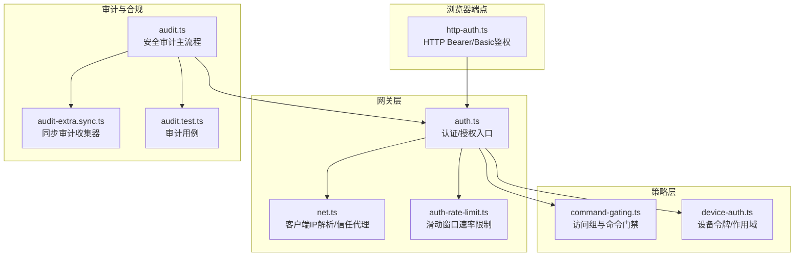
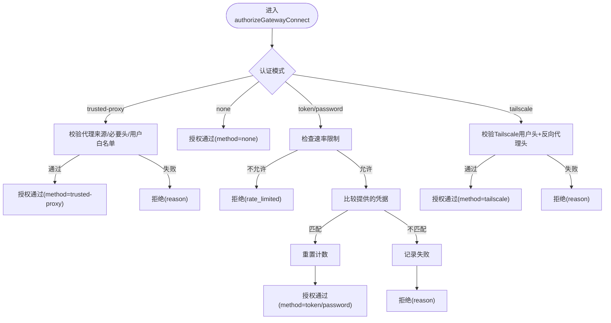
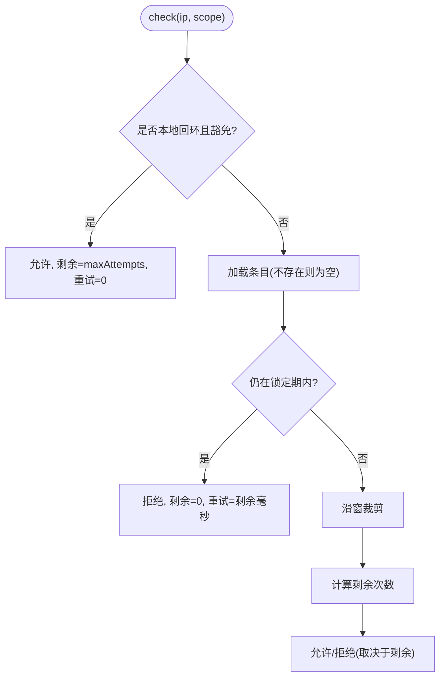
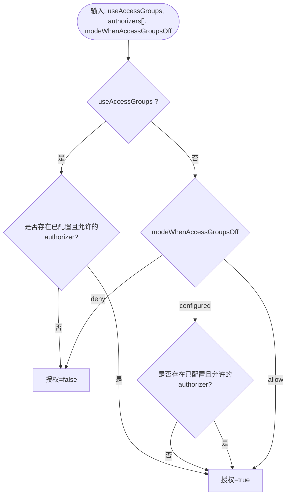
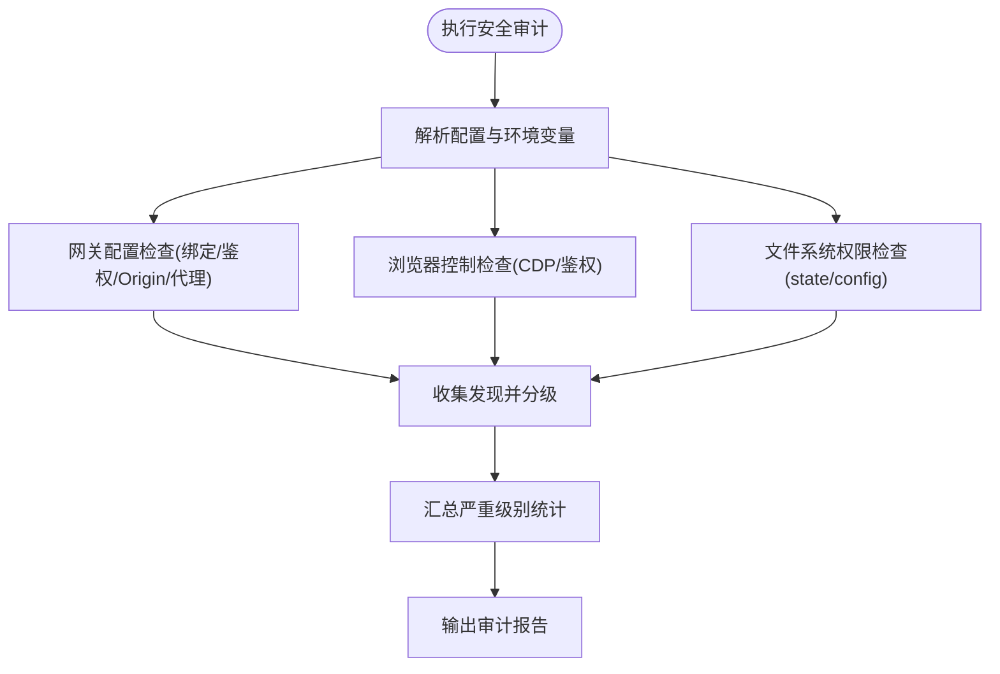
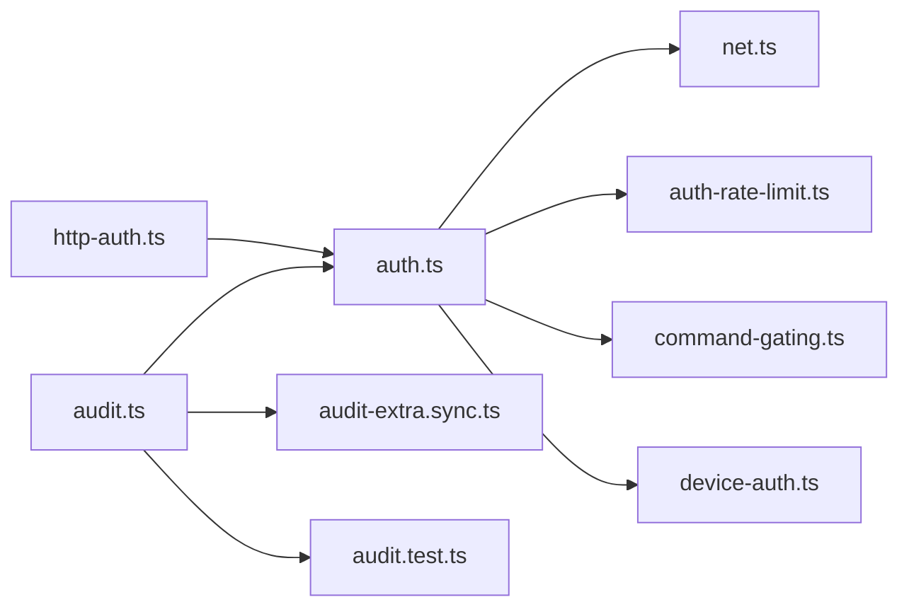

# 权限控制

<cite>
**本文引用的文件**
- [src/gateway/auth.ts](file://src/gateway/auth.ts)
- [src/gateway/auth-rate-limit.ts](file://src/gateway/auth-rate-limit.ts)
- [src/gateway/net.ts](file://src/gateway/net.ts)
- [src/channels/command-gating.ts](file://src/channels/command-gating.ts)
- [src/shared/device-auth.ts](file://src/shared/device-auth.ts)
- [src/security/audit.ts](file://src/security/audit.ts)
- [src/browser/http-auth.ts](file://src/browser/http-auth.ts)
- [src/commands/onboard-non-interactive/local/gateway-config.ts](file://src/commands/onboard-non-interactive/local/gateway-config.ts)
- [src/gateway/startup-auth.test.ts](file://src/gateway/startup-auth.test.ts)
- [src/gateway/server.auth.default-token.test.ts](file://src/gateway/server.auth.default-token.test.ts)
- [src/security/audit.test.ts](file://src/security/audit.test.ts)
- [src/security/audit-extra.sync.ts](file://src/security/audit-extra.sync.ts)
</cite>

## 目录

1. [简介](#简介)
2. [项目结构](#项目结构)
3. [核心组件](#核心组件)
4. [架构总览](#架构总览)
5. [详细组件分析](#详细组件分析)
6. [依赖关系分析](#依赖关系分析)
7. [性能考量](#性能考量)
8. [故障排查指南](#故障排查指南)
9. [结论](#结论)
10. [附录](#附录)

## 简介

本文件系统化阐述 OpenClaw 网关的权限控制体系，覆盖认证机制、授权策略与访问控制模型，重点包括：

- 认证模式：共享密钥（令牌/密码）、受信代理（trusted-proxy）与 Tailscale 头部认证
- 授权策略：基于访问组的命令门禁与细粒度工具/通道策略
- 访问控制：速率限制、来源地址校验、反向代理信任边界
- 安全审计：自动扫描暴露面、鉴权缺失与弱口令风险
- 审计日志：安全审计报告与严重级别统计
- 合规与最佳实践：最小权限、强口令、网络暴露面收敛

## 项目结构

围绕权限控制的关键模块分布如下：

- 网关认证与授权：gateway/auth.ts、gateway/net.ts、gateway/auth-rate-limit.ts
- 命令门禁与访问组：channels/command-gating.ts
- 设备令牌与作用域：shared/device-auth.ts
- 浏览器端点鉴权：browser/http-auth.ts
- 安全审计：security/audit.ts、security/audit-extra.sync.ts、security/audit.test.ts
- 配置与启动：commands/onboard-non-interactive/local/gateway-config.ts、gateway/startup-auth.test.ts、gateway/server.auth.default-token.test.ts



图表来源

- [src/gateway/auth.ts:1-504](file://src/gateway/auth.ts#L1-L504)
- [src/gateway/net.ts:1-200](file://src/gateway/net.ts#L1-L200)
- [src/gateway/auth-rate-limit.ts:1-233](file://src/gateway/auth-rate-limit.ts#L1-L233)
- [src/channels/command-gating.ts:1-46](file://src/channels/command-gating.ts#L1-L46)
- [src/shared/device-auth.ts:1-31](file://src/shared/device-auth.ts#L1-L31)
- [src/browser/http-auth.ts:1-48](file://src/browser/http-auth.ts#L1-L48)
- [src/security/audit.ts:1-800](file://src/security/audit.ts#L1-L800)
- [src/security/audit-extra.sync.ts:1-200](file://src/security/audit-extra.sync.ts#L1-L200)
- [src/security/audit.test.ts:324-643](file://src/security/audit.test.ts#L324-L643)

章节来源

- [src/gateway/auth.ts:1-504](file://src/gateway/auth.ts#L1-L504)
- [src/gateway/net.ts:1-200](file://src/gateway/net.ts#L1-L200)
- [src/gateway/auth-rate-limit.ts:1-233](file://src/gateway/auth-rate-limit.ts#L1-L233)
- [src/channels/command-gating.ts:1-46](file://src/channels/command-gating.ts#L1-L46)
- [src/shared/device-auth.ts:1-31](file://src/shared/device-auth.ts#L1-L31)
- [src/browser/http-auth.ts:1-48](file://src/browser/http-auth.ts#L1-L48)
- [src/security/audit.ts:1-800](file://src/security/audit.ts#L1-L800)
- [src/security/audit-extra.sync.ts:1-200](file://src/security/audit-extra.sync.ts#L1-L200)
- [src/security/audit.test.ts:324-643](file://src/security/audit.test.ts#L324-L643)

## 核心组件

- 网关认证与授权
  - 支持多种模式：共享令牌、共享密码、受信代理、无鉴权、默认令牌模式
  - 支持 Tailscale 身份头认证与本地直连判定
  - 可选速率限制与失败追踪
- 命令门禁与访问组
  - 基于 authorizer 列表与 useAccessGroups 开关的授权决策
  - 支持“当未启用访问组”时的三种行为模式（允许/拒绝/按配置）
- 设备令牌与作用域
  - 设备令牌存储结构、角色标准化与作用域去重排序
- 速率限制
  - 滑动窗口计数、锁定期、按 {scope, clientIp} 维度独立计数
  - 默认豁免本地回环地址，支持周期清理
- 安全审计
  - 自动扫描暴露面、鉴权缺失、Origin 白名单、mDNS 泄露等
  - 生成严重级别统计与修复建议

章节来源

- [src/gateway/auth.ts:217-292](file://src/gateway/auth.ts#L217-L292)
- [src/gateway/auth.ts:378-503](file://src/gateway/auth.ts#L378-L503)
- [src/channels/command-gating.ts:8-45](file://src/channels/command-gating.ts#L8-L45)
- [src/shared/device-auth.ts:1-31](file://src/shared/device-auth.ts#L1-L31)
- [src/gateway/auth-rate-limit.ts:95-232](file://src/gateway/auth-rate-limit.ts#L95-L232)
- [src/security/audit.ts:339-686](file://src/security/audit.ts#L339-L686)

## 架构总览

下图展示从请求进入网关到完成鉴权与授权的整体流程，以及与速率限制、信任代理、Tailscale 身份头的交互。

```mermaid
sequenceDiagram
participant Client as "客户端"
participant GW as "网关(auth.ts)"
participant Net as "网络(net.ts)"
participant RL as "速率限制(auth-rate-limit.ts)"
participant TA as "信任代理/身份头"
Client->>GW : "建立连接/发起请求"
GW->>Net : "解析客户端IP(考虑XFF/X-Real-IP)"
Net-->>GW : "返回可信源IP或空"
GW->>RL : "检查当前IP+scope的速率限制"
RL-->>GW : "允许/拒绝(剩余次数/重试时间)"
alt "受信代理模式"
GW->>TA : "校验代理身份头/用户白名单"
TA-->>GW : "通过则返回用户标识"
else "令牌/密码模式"
GW->>GW : "比较提供的凭据与配置"
GW->>RL : "失败则记录失败; 成功则重置计数"
else "Tailscale头部认证(WS控制UI)"
GW->>TA : "校验tailscale-user-*与反向代理头"
TA-->>GW : "通过则返回用户标识"
end
GW-->>Client : "授权结果(含reason/重试时间)"
```

图表来源

- [src/gateway/auth.ts:378-503](file://src/gateway/auth.ts#L378-L503)
- [src/gateway/net.ts:156-185](file://src/gateway/net.ts#L156-L185)
- [src/gateway/auth-rate-limit.ts:141-172](file://src/gateway/auth-rate-limit.ts#L141-L172)

章节来源

- [src/gateway/auth.ts:378-503](file://src/gateway/auth.ts#L378-L503)
- [src/gateway/net.ts:156-185](file://src/gateway/net.ts#L156-L185)
- [src/gateway/auth-rate-limit.ts:141-172](file://src/gateway/auth-rate-limit.ts#L141-L172)

## 详细组件分析

### 网关认证与授权（auth.ts）

- 模式解析与优先级
  - 支持显式覆盖、配置、密码、令牌、默认五种来源；默认令牌模式
  - 受信代理模式需提供 userHeader 与受信代理列表
- 请求授权流程
  - 受信代理：校验代理来源、必要头、用户白名单
  - 令牌/密码：比较凭据，失败计入速率限制，成功重置
  - Tailscale 头部认证：仅在 WS 控制 UI 表面启用，校验用户身份与反向代理头
  - 速率限制：可选传入 limiter 实例，按 IP+scope 计数
- 本地直连判定
  - 结合 host 头与代理头判断是否为本地直连，用于特定策略分支



图表来源

- [src/gateway/auth.ts:378-503](file://src/gateway/auth.ts#L378-L503)

章节来源

- [src/gateway/auth.ts:217-292](file://src/gateway/auth.ts#L217-L292)
- [src/gateway/auth.ts:378-503](file://src/gateway/auth.ts#L378-L503)

### 速率限制（auth-rate-limit.ts）

- 滑动窗口算法
  - 按 {scope, clientIp} 维度维护最近失败时间戳
  - 超过 maxAttempts 后进入 lockoutMs 的锁定期
- 配置项
  - maxAttempts、windowMs、lockoutMs、exemptLoopback、pruneIntervalMs
- 关键能力
  - check()/recordFailure()/reset()/prune()/dispose()
  - 默认豁免本地回环地址，避免本地 CLI 被误锁
  - 周期清理避免内存无限增长



图表来源

- [src/gateway/auth-rate-limit.ts:141-172](file://src/gateway/auth-rate-limit.ts#L141-L172)

章节来源

- [src/gateway/auth-rate-limit.ts:95-232](file://src/gateway/auth-rate-limit.ts#L95-L232)

### 命令门禁与访问组（command-gating.ts）

- 授权决策
  - useAccessGroups 为真：必须存在已配置且允许的 authorizer
  - useAccessGroups 为假：根据 modeWhenAccessGroupsOff 决策（allow/deny/configured）
  - configured 表示该 authorizer 是否已配置；allowed 表示是否放行
- 控制命令阻断
  - 当 allowTextCommands 为真且检测到控制命令但未授权时，shouldBlock 为真



图表来源

- [src/channels/command-gating.ts:8-45](file://src/channels/command-gating.ts#L8-L45)

章节来源

- [src/channels/command-gating.ts:1-46](file://src/channels/command-gating.ts#L1-L46)

### 设备令牌与作用域（shared/device-auth.ts）

- 数据结构
  - DeviceAuthEntry：token、role、scopes、updatedAtMs
  - DeviceAuthStore：version、deviceId、tokens 映射
- 规范化
  - 角色去空白
  - 作用域数组去空白、去重、排序

章节来源

- [src/shared/device-auth.ts:1-31](file://src/shared/device-auth.ts#L1-L31)

### 浏览器端点鉴权（browser/http-auth.ts）

- 支持 Bearer 令牌与 Basic 密码
- 与网关共享令牌/密码配置进行安全比较

章节来源

- [src/browser/http-auth.ts:1-48](file://src/browser/http-auth.ts#L1-L48)

### 安全审计（security/audit.ts 与 audit-extra.sync.ts）

- 审计范围
  - 网关绑定与鉴权：bind 与 auth 配置一致性、Control UI 允许的 Origin、mDNS 模式、Tailscale 暴露级别
  - 受信代理：是否配置、userHeader 是否缺失、allowUsers 是否为空
  - 速率限制：非 loopback 绑定但未配置 rateLimit 的警告
  - 文件系统与配置权限：状态目录与配置文件的权限问题
- 报告结构
  - SecurityAuditReport：时间戳、严重级别统计、发现列表、深度探测信息



图表来源

- [src/security/audit.ts:339-686](file://src/security/audit.ts#L339-L686)
- [src/security/audit-extra.sync.ts:1-200](file://src/security/audit-extra.sync.ts#L1-L200)

章节来源

- [src/security/audit.ts:1-800](file://src/security/audit.ts#L1-L800)
- [src/security/audit-extra.sync.ts:1-200](file://src/security/audit-extra.sync.ts#L1-L200)
- [src/security/audit.test.ts:324-643](file://src/security/audit.test.ts#L324-L643)

## 依赖关系分析

- 组件耦合
  - auth.ts 依赖 net.ts 进行 IP 解析与信任代理判定，依赖 auth-rate-limit.ts 进行失败计数与锁定
  - command-gating.ts 作为策略层，被上层调用以决定命令是否放行
  - browser/http-auth.ts 与网关共享令牌/密码配置，形成统一鉴权基线
  - audit.ts 依赖多个子模块收集发现，形成闭环的合规检查
- 外部依赖
  - Node.js 内置 net、os、path 等模块
  - 无外部第三方鉴权库，内建速率限制与安全审计



图表来源

- [src/gateway/auth.ts:1-504](file://src/gateway/auth.ts#L1-L504)
- [src/gateway/net.ts:1-200](file://src/gateway/net.ts#L1-L200)
- [src/gateway/auth-rate-limit.ts:1-233](file://src/gateway/auth-rate-limit.ts#L1-L233)
- [src/channels/command-gating.ts:1-46](file://src/channels/command-gating.ts#L1-L46)
- [src/shared/device-auth.ts:1-31](file://src/shared/device-auth.ts#L1-L31)
- [src/browser/http-auth.ts:1-48](file://src/browser/http-auth.ts#L1-L48)
- [src/security/audit.ts:1-800](file://src/security/audit.ts#L1-L800)
- [src/security/audit-extra.sync.ts:1-200](file://src/security/audit-extra.sync.ts#L1-L200)
- [src/security/audit.test.ts:324-643](file://src/security/audit.test.ts#L324-L643)

章节来源

- [src/gateway/auth.ts:1-504](file://src/gateway/auth.ts#L1-L504)
- [src/gateway/net.ts:1-200](file://src/gateway/net.ts#L1-L200)
- [src/gateway/auth-rate-limit.ts:1-233](file://src/gateway/auth-rate-limit.ts#L1-L233)
- [src/channels/command-gating.ts:1-46](file://src/channels/command-gating.ts#L1-L46)
- [src/shared/device-auth.ts:1-31](file://src/shared/device-auth.ts#L1-L31)
- [src/browser/http-auth.ts:1-48](file://src/browser/http-auth.ts#L1-L48)
- [src/security/audit.ts:1-800](file://src/security/audit.ts#L1-L800)
- [src/security/audit-extra.sync.ts:1-200](file://src/security/audit-extra.sync.ts#L1-L200)
- [src/security/audit.test.ts:324-643](file://src/security/audit.test.ts#L324-L643)

## 性能考量

- 速率限制
  - 使用纯内存 Map 存储，避免外部依赖；默认每分钟清理一次，防止无限增长
  - 本地回环豁免避免影响本地 CLI 会话
- 认证路径
  - 令牌/密码比较采用安全常量时间比较，降低侧信道风险
  - 仅在必要时进行失败计数，避免对缺失凭据的惩罚
- 审计扫描
  - 同步审计收集器不进行 I/O，减少扫描开销；异步收集器按需执行

[本节为通用性能讨论，无需列出章节来源]

## 故障排查指南

- 常见问题定位
  - 速率限制导致频繁拒绝：检查 maxAttempts/windowMs/lockoutMs 配置，确认客户端 IP 是否被锁定
  - 受信代理模式无法登录：核对 gateway.auth.trustedProxy.userHeader、allowUsers 与代理转发头
  - Control UI 无法访问：检查 gateway.bind 与 gateway.auth 是否配置；loopback 模式下需配置鉴权
  - 浏览器控制端点报错：确认 gateway.auth.token 或 password 已配置
- 审计报告解读
  - critical/warn/info 分别代表高危、中危与提示；优先修复 critical
  - 关注“gateway.auth_no_rate_limit”、“gateway.bind_no_auth”、“gateway.trusted_proxies_missing”等关键发现

章节来源

- [src/security/audit.ts:428-462](file://src/security/audit.ts#L428-L462)
- [src/security/audit.ts:673-684](file://src/security/audit.ts#L673-L684)
- [src/security/audit.test.ts:324-366](file://src/security/audit.test.ts#L324-L366)

## 结论

OpenClaw 的权限控制体系以“最小暴露面、强口令、受信代理与速率限制”为核心原则，结合命令门禁与安全审计形成闭环。通过明确的认证模式与授权策略，既满足本地开发场景，又能在公网暴露时保持足够的安全强度。建议在生产环境中：

- 将 gateway.bind 限制为 loopback 或 tailnet-only
- 配置强随机令牌或密码，并启用速率限制
- 对受信代理模式严格限定代理来源与用户白名单
- 定期运行安全审计，及时修复发现项

[本节为总结性内容，无需列出章节来源]

## 附录

### 权限矩阵与策略配置要点

- 网关绑定与鉴权
  - loopback：建议配置鉴权；若通过反向代理暴露，需配置 trustedProxies
  - 非 loopback：必须配置 gateway.auth（推荐令牌），并启用速率限制
- 受信代理
  - 必须设置 userHeader；可选 allowUsers；确保仅允许代理服务器进入
- Control UI
  - 非 loopback 时必须配置 allowedOrigins；禁止使用通配符
- 速率限制
  - 建议配置 maxAttempts、windowMs、lockoutMs；默认豁免本地回环

章节来源

- [src/security/audit.ts:428-505](file://src/security/audit.ts#L428-L505)
- [src/security/audit.ts:673-684](file://src/security/audit.ts#L673-L684)

### 审计日志与报告

- 输出字段
  - 时间戳、严重级别统计、发现列表、深度探测信息（可选）
- 建议
  - 将审计报告纳入 CI/CD 安全检查；对 critical 发现立即处置

章节来源

- [src/security/audit.ts:72-85](file://src/security/audit.ts#L72-L85)

### 启动与配置示例

- 自动生成默认令牌
  - 在未显式配置时，启动阶段可生成默认令牌并写入配置
- 环境变量注入
  - 支持通过环境变量注入令牌/密码，便于容器化部署

章节来源

- [src/commands/onboard-non-interactive/local/gateway-config.ts:59-113](file://src/commands/onboard-non-interactive/local/gateway-config.ts#L59-L113)
- [src/gateway/startup-auth.test.ts:308-360](file://src/gateway/startup-auth.test.ts#L308-L360)
- [src/gateway/server.auth.default-token.test.ts:1-9](file://src/gateway/server.auth.default-token.test.ts#L1-L9)
