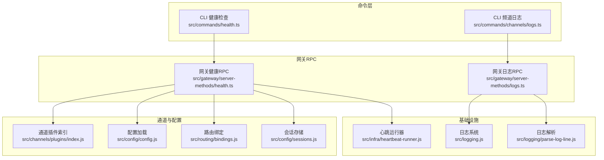
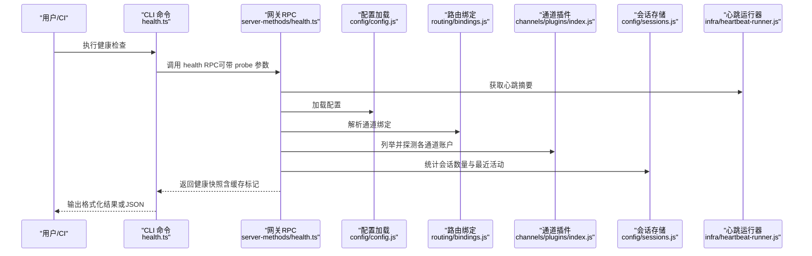
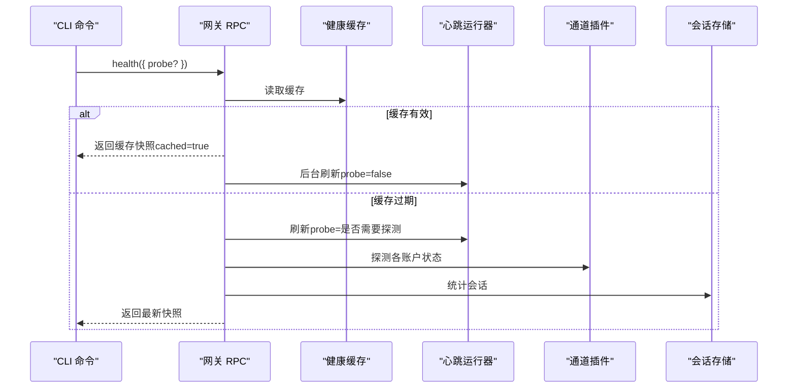
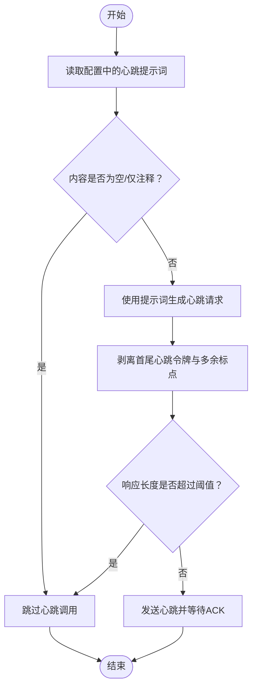
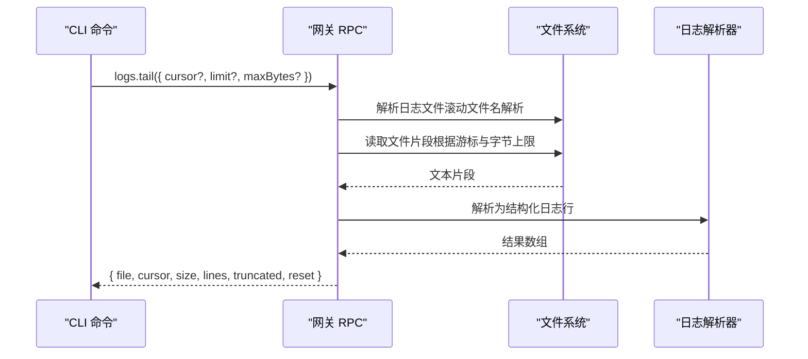
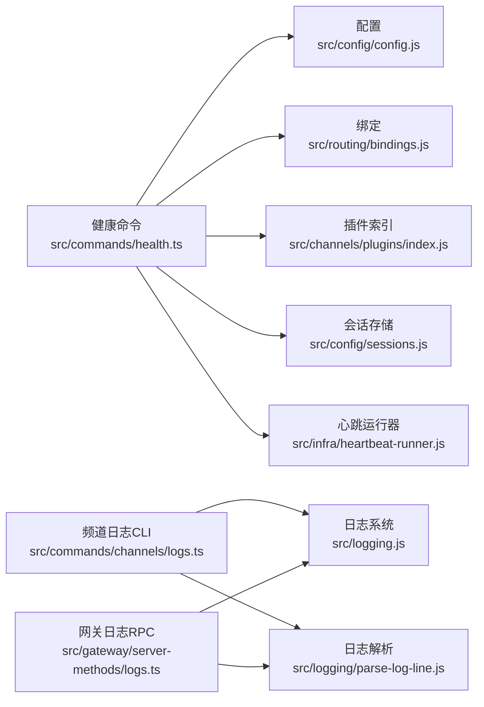

# 监控与诊断

<cite>
**本文引用的文件**
- [src/commands/health.ts](file://src/commands/health.ts)
- [src/gateway/server-methods/health.ts](file://src/gateway/server-methods/health.ts)
- [src/auto-reply/heartbeat.ts](file://src/auto-reply/heartbeat.ts)
- [src/commands/channels/logs.ts](file://src/commands/channels/logs.ts)
- [src/gateway/server-methods/logs.ts](file://src/gateway/server-methods/logs.ts)
- [src/infra/heartbeat-runner.js](file://src/infra/heartbeat-runner.js)
- [src/routing/bindings.js](file://src/routing/bindings.js)
- [src/config/config.js](file://src/config/config.js)
- [src/config/sessions.js](file://src/config/sessions.js)
- [src/gateway/call.js](file://src/gateway/call.js)
- [src/terminal/health-style.js](file://src/terminal/health-style.js)
- [src/logging.js](file://src/logging.js)
- [src/logging/parse-log-line.js](file://src/logging/parse-log-line.js)
- [src/gateway/server-constants.js](file://src/gateway/server-constants.js)
- [src/gateway/ws-log.js](file://src/gateway/ws-log.js)
- [src/gateway/protocol/index.js](file://src/gateway/protocol/index.js)
- [src/gateway/server-utils.js](file://src/gateway/server-utils.js)
- [src/gateway/server-methods/types.js](file://src/gateway/server-methods/types.js)
- [src/runtime.js](file://src/runtime.js)
- [src/utils.js](file://src/utils.js)
- [src/globals.js](file://src/globals.js)
- [src/infra/env.js](file://src/infra/env.js)
- [src/infra/errors.js](file://src/infra/errors.js)
- [src/terminal/theme.js](file://src/terminal/theme.js)
- [src/routing/session-key.js](file://src/routing/session-key.js)
- [src/channels/plugins/index.js](file://src/channels/plugins/index.js)
- [src/channels/plugins/helpers.js](file://src/channels/plugins/helpers.js)
- [src/channels/plugins/types.js](file://src/channels/plugins/types.js)
</cite>

## 目录

1. [简介](#简介)
2. [项目结构](#项目结构)
3. [核心组件](#核心组件)
4. [架构总览](#架构总览)
5. [详细组件分析](#详细组件分析)
6. [依赖关系分析](#依赖关系分析)
7. [性能考量](#性能考量)
8. [故障排除指南](#故障排除指南)
9. [结论](#结论)
10. [附录](#附录)

## 简介

本文件面向OpenClaw网关的监控与诊断体系，系统性阐述健康检查机制、心跳检测、资源使用统计、错误追踪与日志分析，并给出监控仪表板、告警机制与性能优化建议。内容覆盖CLI命令、网关RPC方法、通道插件探测、日志采集与过滤、心跳运行器等关键模块，帮助开发者与运维人员快速定位问题、建立可观测性与稳定性保障。

## 项目结构

OpenClaw的监控与诊断能力由“命令层（CLI）—网关RPC—通道插件—日志系统”构成，形成从终端到后端的闭环观测链路。核心路径如下：

- 健康检查：CLI命令与网关RPC方法协同，支持缓存与探测两种模式
- 心跳检测：基于配置解析与任务判定，避免无效调用
- 日志分析：滚动日志文件解析、按通道过滤、尾部读取与分页游标
- 资源与会话：会话存储统计、最近活动展示

**图示来源**

- [src/commands/health.ts:1-752](file://src/commands/health.ts#L1-L752)
- [src/gateway/server-methods/health.ts:1-38](file://src/gateway/server-methods/health.ts#L1-L38)
- [src/commands/channels/logs.ts:1-114](file://src/commands/channels/logs.ts#L1-L114)
- [src/gateway/server-methods/logs.ts:1-181](file://src/gateway/server-methods/logs.ts#L1-L181)
- [src/channels/plugins/index.js](file://src/channels/plugins/index.js)
- [src/config/config.js](file://src/config/config.js)
- [src/routing/bindings.js](file://src/routing/bindings.js)
- [src/config/sessions.js](file://src/config/sessions.js)
- [src/infra/heartbeat-runner.js](file://src/infra/heartbeat-runner.js)
- [src/logging.js](file://src/logging.js)
- [src/logging/parse-log-line.js](file://src/logging/parse-log-line.js)

**章节来源**

- [src/commands/health.ts:1-752](file://src/commands/health.ts#L1-L752)
- [src/gateway/server-methods/health.ts:1-38](file://src/gateway/server-methods/health.ts#L1-L38)
- [src/commands/channels/logs.ts:1-114](file://src/commands/channels/logs.ts#L1-L114)
- [src/gateway/server-methods/logs.ts:1-181](file://src/gateway/server-methods/logs.ts#L1-L181)

## 核心组件

- 健康检查（Health）
  - CLI命令：收集通道账户状态、心跳摘要、会话统计，支持探测与格式化输出
  - 网关RPC：提供缓存优先策略与后台刷新，统一对外暴露健康快照
- 心跳检测（Heartbeat）
  - 解析默认提示词、时间间隔、ACK长度限制；提供内容有效性判断与令牌剥离逻辑
- 日志分析（Logs）
  - 滚动日志文件解析与定位；按通道过滤；尾部读取与游标分页
- 会话与资源（Sessions）
  - 会话存储路径解析、计数与最近活动展示，辅助健康视图

**章节来源**

- [src/commands/health.ts:348-523](file://src/commands/health.ts#L348-L523)
- [src/gateway/server-methods/health.ts:10-37](file://src/gateway/server-methods/health.ts#L10-L37)
- [src/auto-reply/heartbeat.ts:1-172](file://src/auto-reply/heartbeat.ts#L1-L172)
- [src/commands/channels/logs.ts:76-113](file://src/commands/channels/logs.ts#L76-L113)
- [src/gateway/server-methods/logs.ts:147-180](file://src/gateway/server-methods/logs.ts#L147-L180)
- [src/config/sessions.js](file://src/config/sessions.js)

## 架构总览

下图展示健康检查与日志分析在CLI与网关之间的交互流程，以及与通道插件、配置与日志系统的耦合关系。

**图示来源**

- [src/commands/health.ts:525-751](file://src/commands/health.ts#L525-L751)
- [src/gateway/server-methods/health.ts:10-37](file://src/gateway/server-methods/health.ts#L10-L37)
- [src/infra/heartbeat-runner.js](file://src/infra/heartbeat-runner.js)
- [src/config/config.js](file://src/config/config.js)
- [src/routing/bindings.js](file://src/routing/bindings.js)
- [src/channels/plugins/index.js](file://src/channels/plugins/index.js)
- [src/config/sessions.js](file://src/config/sessions.js)

## 详细组件分析

### 健康检查组件（CLI 与网关）

- CLI职责
  - 收集通道账户状态、心跳摘要、会话统计
  - 可选探测（probe），对每个账户执行状态探测
  - 格式化输出，支持rich样式与调试信息
- 网关RPC职责
  - 缓存优先策略：在刷新间隔内返回缓存快照
  - 后台刷新：在返回缓存的同时触发无探测刷新
  - 错误处理：UNAVAILABLE错误码与日志记录

**图示来源**

- [src/gateway/server-methods/health.ts:10-29](file://src/gateway/server-methods/health.ts#L10-L29)
- [src/commands/health.ts:348-523](file://src/commands/health.ts#L348-L523)

**章节来源**

- [src/commands/health.ts:348-523](file://src/commands/health.ts#L348-L523)
- [src/gateway/server-methods/health.ts:10-37](file://src/gateway/server-methods/health.ts#L10-L37)

### 心跳检测组件（提示词与令牌处理）

- 默认心跳提示词与时间间隔定义
- 内容有效性判断：仅空白/注释/空列表项时视为“无任务”
- ACK长度限制与令牌剥离：去除首尾心跳令牌与多余标点，控制响应长度

**图示来源**

- [src/auto-reply/heartbeat.ts:5-172](file://src/auto-reply/heartbeat.ts#L5-L172)

**章节来源**

- [src/auto-reply/heartbeat.ts:1-172](file://src/auto-reply/heartbeat.ts#L1-L172)

### 日志分析组件（通道日志与网关日志）

- 频道日志（CLI）
  - 按通道过滤（all/具体频道），解析日志行，输出时间、级别与消息
  - 限制读取字节数与行数，避免过大输出
- 网关日志（RPC）
  - 支持游标分页与最大字节限制
  - 自动解析滚动日志文件名并选择最新文件
  - 返回文件路径、游标、截断与重置标记

**图示来源**

- [src/commands/channels/logs.ts:76-113](file://src/commands/channels/logs.ts#L76-L113)
- [src/gateway/server-methods/logs.ts:147-180](file://src/gateway/server-methods/logs.ts#L147-L180)

**章节来源**

- [src/commands/channels/logs.ts:1-114](file://src/commands/channels/logs.ts#L1-L114)
- [src/gateway/server-methods/logs.ts:1-181](file://src/gateway/server-methods/logs.ts#L1-L181)

### 会话与资源统计

- 会话存储路径解析与计数
- 最近活动展示：键名、更新时间与年龄
- 与健康快照集成，便于在CLI输出中呈现

**章节来源**

- [src/config/sessions.js](file://src/config/sessions.js)
- [src/commands/health.ts:146-162](file://src/commands/health.ts#L146-L162)

## 依赖关系分析

- 健康检查对以下模块存在直接依赖：
  - 配置加载与会话存储：用于构建会话摘要
  - 通道插件：列举并探测账户状态
  - 路由绑定：解析账户与代理人的绑定关系
  - 心跳运行器：获取心跳摘要
- 日志分析对以下模块存在直接依赖：
  - 日志系统与解析器：统一日志格式与字段
  - 文件系统：滚动日志文件解析与尾部读取

**图示来源**

- [src/commands/health.ts:1-752](file://src/commands/health.ts#L1-L752)
- [src/gateway/server-methods/logs.ts:1-181](file://src/gateway/server-methods/logs.ts#L1-L181)
- [src/commands/channels/logs.ts:1-114](file://src/commands/channels/logs.ts#L1-L114)
- [src/config/config.js](file://src/config/config.js)
- [src/routing/bindings.js](file://src/routing/bindings.js)
- [src/channels/plugins/index.js](file://src/channels/plugins/index.js)
- [src/config/sessions.js](file://src/config/sessions.js)
- [src/infra/heartbeat-runner.js](file://src/infra/heartbeat-runner.js)
- [src/logging.js](file://src/logging.js)
- [src/logging/parse-log-line.js](file://src/logging/parse-log-line.js)

**章节来源**

- [src/commands/health.ts:1-752](file://src/commands/health.ts#L1-L752)
- [src/gateway/server-methods/logs.ts:1-181](file://src/gateway/server-methods/logs.ts#L1-L181)
- [src/commands/channels/logs.ts:1-114](file://src/commands/channels/logs.ts#L1-L114)

## 性能考量

- 健康检查缓存
  - 网关在刷新间隔内返回缓存快照，减少重复探测开销
  - 后台触发无探测刷新，确保数据新鲜度
- 探测超时与并发
  - CLI侧设置默认超时，避免单个通道阻塞整体健康检查
  - 对账户集合进行去重与优选，降低探测次数
- 日志读取
  - 限制最大字节数与行数，避免一次性读取过大文件
  - 游标分页与截断标记，支持增量拉取
- 输出与样式
  - CLI输出支持rich样式与调试开关，便于在不同环境渲染

**章节来源**

- [src/gateway/server-methods/health.ts:10-29](file://src/gateway/server-methods/health.ts#L10-L29)
- [src/commands/health.ts:348-523](file://src/commands/health.ts#L348-L523)
- [src/gateway/server-methods/logs.ts:13-17](file://src/gateway/server-methods/logs.ts#L13-L17)
- [src/commands/channels/logs.ts:16-17](file://src/commands/channels/logs.ts#L16-L17)

## 故障排除指南

- 健康检查失败
  - 确认网关可达性与RPC权限
  - 使用verbose模式查看通道探测详情与绑定映射
  - 检查通道账户配置与鉴权状态
- 心跳未触发
  - 检查HEARTBEAT.md是否存在且包含可执行任务
  - 确认心跳间隔配置与ACK长度阈值
- 日志缺失或不完整
  - 检查日志文件路径与滚动文件名匹配
  - 使用游标参数进行增量拉取，关注truncated/reset标记
- 会话统计异常
  - 核对会话存储路径与权限
  - 关注最近活动键与更新时间

**章节来源**

- [src/commands/health.ts:525-751](file://src/commands/health.ts#L525-L751)
- [src/auto-reply/heartbeat.ts:1-172](file://src/auto-reply/heartbeat.ts#L1-L172)
- [src/gateway/server-methods/logs.ts:147-180](file://src/gateway/server-methods/logs.ts#L147-L180)
- [src/commands/channels/logs.ts:76-113](file://src/commands/channels/logs.ts#L76-L113)

## 结论

OpenClaw的监控与诊断体系通过“CLI健康检查+网关RPC+通道探测+日志解析”的组合，实现了对网关运行状态、心跳行为与日志流的全链路可观测。建议在生产环境中启用缓存与后台刷新、合理设置探测超时、使用通道过滤与游标分页以提升性能与稳定性，并结合告警机制与仪表板实现自动化运维。

## 附录

- 常用命令与参数
  - 健康检查：支持json、timeoutMs、verbose、config等参数
  - 频道日志：支持channel、lines、json等参数
- 关键配置与环境变量
  - OPENCLAW_DEBUG_HEALTH：开启健康检查调试输出
  - 日志文件路径与滚动命名规则
- 运维最佳实践
  - 定期巡检心跳与通道状态
  - 使用日志RPC进行增量采集与告警联动
  - 限制探测范围与超时，避免对上游服务造成压力
