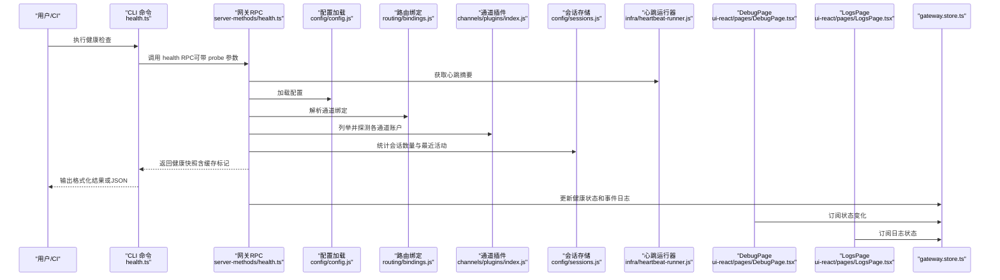
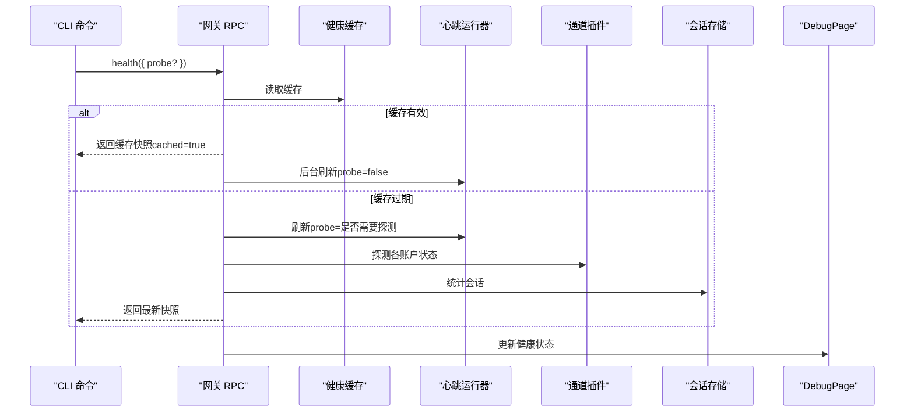
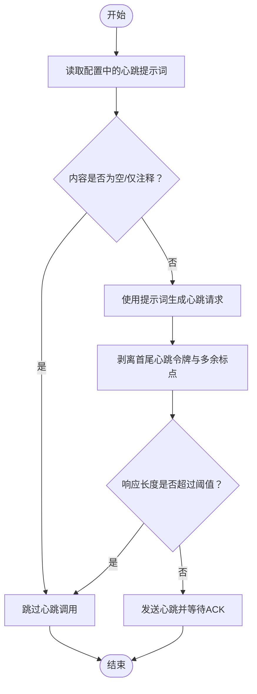
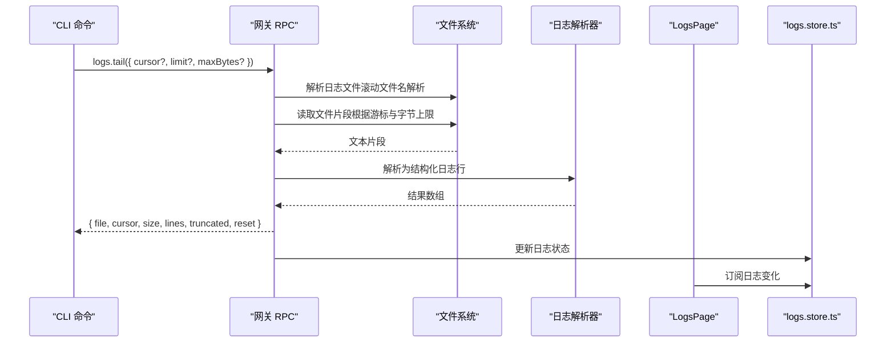
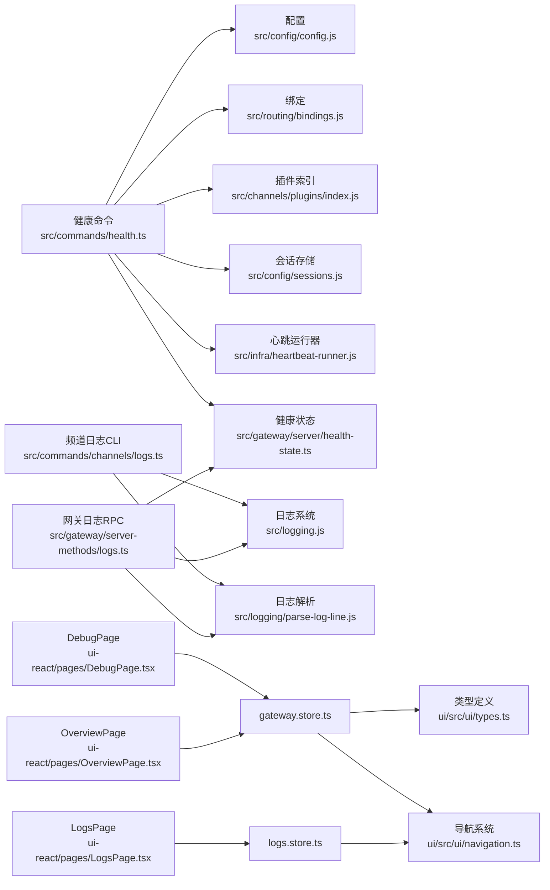

# 监控与诊断

<cite>
**本文引用的文件**
- [src/commands/health.ts](file://src/commands/health.ts)
- [src/gateway/server-methods/health.ts](file://src/gateway/server-methods/health.ts)
- [src/auto-reply/heartbeat.ts](file://src/auto-reply/heartbeat.ts)
- [src/commands/channels/logs.ts](file://src/commands/channels/logs.ts)
- [src/gateway/server-methods/logs.ts](file://src/gateway/server-methods/logs.ts)
- [src/infra/heartbeat-runner.js](file://src/infra/heartbeat-runner.js)
- [src/routing/bindings.js](file://src/routing/bindings.js)
- [src/config/config.js](file://src/config/config.js)
- [src/config/sessions.js](file://src/config/sessions.js)
- [src/gateway/call.js](file://src/gateway/call.js)
- [src/terminal/health-style.js](file://src/terminal/health-style.js)
- [src/logging.js](file://src/logging.js)
- [src/logging/parse-log-line.js](file://src/logging/parse-log-line.js)
- [src/gateway/server-constants.js](file://src/gateway/server-constants.js)
- [src/gateway/ws-log.js](file://src/gateway/ws-log.js)
- [src/gateway/protocol/index.js](file://src/gateway/protocol/index.js)
- [src/gateway/server-utils.js](file://src/gateway/server-utils.js)
- [src/gateway/server-methods/types.js](file://src/gateway/server-methods/types.js)
- [src/runtime.js](file://src/runtime.js)
- [src/utils.js](file://src/utils.js)
- [src/globals.js](file://src/globals.js)
- [src/infra/env.js](file://src/infra/env.js)
- [src/infra/errors.js](file://src/infra/errors.js)
- [src/terminal/theme.js](file://src/terminal/theme.js)
- [src/routing/session-key.js](file://src/routing/session-key.js)
- [src/channels/plugins/index.js](file://src/channels/plugins/index.js)
- [src/channels/plugins/helpers.js](file://src/channels/plugins/helpers.js)
- [src/channels/plugins/types.js](file://src/channels/plugins/types.js)
- [ui-react/src/pages/DebugPage.tsx](file://ui-react/src/pages/DebugPage.tsx)
- [ui-react/src/pages/LogsPage.tsx](file://ui-react/src/pages/LogsPage.tsx)
- [ui-react/src/pages/OverviewPage.tsx](file://ui-react/src/pages/OverviewPage.tsx)
- [ui-react/src/store/logs.store.ts](file://ui-react/src/store/logs.store.ts)
- [ui-react/src/store/gateway.store.ts](file://ui-react/src/store/gateway.store.ts)
- [ui/src/ui/types.ts](file://ui/src/ui/types.ts)
- [ui/src/ui/navigation.ts](file://ui/src/ui/navigation.ts)
- [ui/src/ui/app-settings.ts](file://ui/src/ui/app-settings.ts)
- [src/gateway/server/health-state.ts](file://src/gateway/server/health-state.ts)
</cite>

## 更新摘要
**变更内容**
- 新增React前端监控页面(DebugPage、LogsPage、OverviewPage)的详细文档
- 新增logs.store.ts状态管理的完整说明
- 新增gateway.store.ts状态管理的详细分析
- 新增UI类型定义和导航系统的监控集成
- 更新监控仪表板和实时诊断功能的架构描述

## 目录
1. [简介](#简介)
2. [项目结构](#项目结构)
3. [核心组件](#核心组件)
4. [架构总览](#架构总览)
5. [详细组件分析](#详细组件分析)
6. [新增监控页面](#新增监控页面)
7. [状态管理系统](#状态管理系统)
8. [依赖关系分析](#依赖关系分析)
9. [性能考量](#性能考量)
10. [故障排除指南](#故障排除指南)
11. [结论](#结论)
12. [附录](#附录)

## 简介
本文件面向OpenClaw网关的监控与诊断体系，系统性阐述健康检查机制、心跳检测、资源使用统计、错误追踪与日志分析，并给出监控仪表板、告警机制与性能优化建议。内容覆盖CLI命令、网关RPC方法、通道插件探测、日志采集与过滤、心跳运行器等关键模块，同时新增了React前端监控页面和状态管理系统的详细说明，帮助开发者与运维人员快速定位问题、建立可观测性与稳定性保障。

## 项目结构
OpenClaw的监控与诊断能力由"命令层（CLI）—网关RPC—通道插件—日志系统—前端监控页面"构成，形成从终端到后端再到前端的完整观测链路。核心路径如下：
- 健康检查：CLI命令与网关RPC方法协同，支持缓存与探测两种模式
- 心跳检测：基于配置解析与任务判定，避免无效调用
- 日志分析：滚动日志文件解析、按通道过滤、尾部读取与分页游标
- 资源与会话：会话存储统计、最近活动展示
- 前端监控：DebugPage、LogsPage、OverviewPage提供实时监控界面
- 状态管理：Zustand stores管理应用状态和数据流

```mermaid
graph TB
subgraph "命令层"
CLI_H["CLI 健康检查<br/>src/commands/health.ts"]
CLI_LC["CLI 频道日志<br/>src/commands/channels/logs.ts"]
end
subgraph "网关RPC"
GW_H["网关健康RPC<br/>src/gateway/server-methods/health.ts"]
GW_L["网关日志RPC<br/>src/gateway/server-methods/logs.ts"]
end
subgraph "通道与配置"
PLG["通道插件索引<br/>src/channels/plugins/index.js"]
CFG["配置加载<br/>src/config/config.js"]
BIND["路由绑定<br/>src/routing/bindings.js"]
SESS["会话存储<br/>src/config/sessions.js"]
END_HEALTH["健康状态<br/>src/gateway/server/health-state.ts"]
end
subgraph "基础设施"
HB_RUN["心跳运行器<br/>src/infra/heartbeat-runner.js"]
LOG_SYS["日志系统<br/>src/logging.js"]
PARSER["日志解析<br/>src/logging/parse-log-line.js"]
END_STATE["状态管理<br/>ui-react/src/store/gateway.store.ts"]
END_LOGS["日志状态<br/>ui-react/src/store/logs.store.ts"]
END_NAV["导航系统<br/>ui/src/ui/navigation.ts"]
END_TYPES["类型定义<br/>ui/src/ui/types.ts"]
end
subgraph "前端监控页面"
DEBUG_PAGE["DebugPage<br/>ui-react/src/pages/DebugPage.tsx"]
LOGS_PAGE["LogsPage<br/>ui-react/src/pages/LogsPage.tsx"]
OVERVIEW_PAGE["OverviewPage<br/>ui-react/src/pages/OverviewPage.tsx"]
END_POLL["轮询管理<br/>ui/src/ui/app-settings.ts"]
end
CLI_H --> GW_H
CLI_LC --> GW_L
GW_H --> HB_RUN
GW_H --> PLG
GW_H --> CFG
GW_H --> BIND
GW_H --> SESS
GW_H --> END_HEALTH
GW_L --> LOG_SYS
GW_L --> PARSER
GW_H --> END_STATE
GW_L --> END_LOGS
DEBUG_PAGE --> END_STATE
LOGS_PAGE --> END_LOGS
OVERVIEW_PAGE --> END_STATE
DEBUG_PAGE --> END_POLL
LOGS_PAGE --> END_POLL
```

**图示来源**
- [src/commands/health.ts:1-752](file://src/commands/health.ts#L1-L752)
- [src/gateway/server-methods/health.ts:1-38](file://src/gateway/server-methods/health.ts#L1-L38)
- [src/commands/channels/logs.ts:1-114](file://src/commands/channels/logs.ts#L1-L114)
- [src/gateway/server-methods/logs.ts:1-181](file://src/gateway/server-methods/logs.ts#L1-L181)
- [src/channels/plugins/index.js](file://src/channels/plugins/index.js)
- [src/config/config.js](file://src/config/config.js)
- [src/routing/bindings.js](file://src/routing/bindings.js)
- [src/config/sessions.js](file://src/config/sessions.js)
- [src/infra/heartbeat-runner.js](file://src/infra/heartbeat-runner.js)
- [src/logging.js](file://src/logging.js)
- [src/logging/parse-log-line.js](file://src/logging/parse-log-line.js)
- [src/gateway/server/health-state.ts:17-64](file://src/gateway/server/health-state.ts#L17-L64)
- [ui-react/src/pages/DebugPage.tsx:1-227](file://ui-react/src/pages/DebugPage.tsx#L1-L227)
- [ui-react/src/pages/LogsPage.tsx:1-194](file://ui-react/src/pages/LogsPage.tsx#L1-L194)
- [ui-react/src/pages/OverviewPage.tsx:1-235](file://ui-react/src/pages/OverviewPage.tsx#L1-L235)
- [ui-react/src/store/gateway.store.ts:1-184](file://ui-react/src/store/gateway.store.ts#L1-L184)
- [ui-react/src/store/logs.store.ts:1-105](file://ui-react/src/store/logs.store.ts#L1-L105)
- [ui/src/ui/navigation.ts:104-165](file://ui/src/ui/navigation.ts#L104-L165)
- [ui/src/ui/types.ts:1-628](file://ui/src/ui/types.ts#L1-L628)
- [ui/src/ui/app-settings.ts:348-395](file://ui/src/ui/app-settings.ts#L348-L395)

**章节来源**
- [src/commands/health.ts:1-752](file://src/commands/health.ts#L1-L752)
- [src/gateway/server-methods/health.ts:1-38](file://src/gateway/server-methods/health.ts#L1-L38)
- [src/commands/channels/logs.ts:1-114](file://src/commands/channels/logs.ts#L1-L114)
- [src/gateway/server-methods/logs.ts:1-181](file://src/gateway/server-methods/logs.ts#L1-L181)
- [ui-react/src/pages/DebugPage.tsx:1-227](file://ui-react/src/pages/DebugPage.tsx#L1-L227)
- [ui-react/src/pages/LogsPage.tsx:1-194](file://ui-react/src/pages/LogsPage.tsx#L1-L194)
- [ui-react/src/pages/OverviewPage.tsx:1-235](file://ui-react/src/pages/OverviewPage.tsx#L1-L235)
- [ui-react/src/store/gateway.store.ts:1-184](file://ui-react/src/store/gateway.store.ts#L1-L184)
- [ui-react/src/store/logs.store.ts:1-105](file://ui-react/src/store/logs.store.ts#L1-L105)

## 核心组件
- 健康检查（Health）
  - CLI命令：收集通道账户状态、心跳摘要、会话统计，支持探测与格式化输出
  - 网关RPC：提供缓存优先策略与后台刷新，统一对外暴露健康快照
  - 前端DebugPage：实时显示健康状态快照和连接信息
- 心跳检测（Heartbeat）
  - 解析默认提示词、时间间隔、ACK长度限制；提供内容有效性判断与令牌剥离逻辑
- 日志分析（Logs）
  - 滚动日志文件解析与定位；按通道过滤；尾部读取与游标分页
  - 前端LogsPage：提供实时日志监控、过滤和导出功能
- 会话与资源（Sessions）
  - 会话存储路径解析、计数与最近活动展示，辅助健康视图
- 前端监控页面
  - DebugPage：连接状态、健康快照、事件日志的综合调试界面
  - LogsPage：实时日志流监控，支持自动跟随和过滤
  - OverviewPage：系统概览和连接状态监控
- 状态管理系统
  - gateway.store.ts：管理网关连接状态、健康数据、事件日志
  - logs.store.ts：管理日志数据、过滤条件和轮询状态

**章节来源**
- [src/commands/health.ts:348-523](file://src/commands/health.ts#L348-L523)
- [src/gateway/server-methods/health.ts:10-37](file://src/gateway/server-methods/health.ts#L10-L37)
- [src/auto-reply/heartbeat.ts:1-172](file://src/auto-reply/heartbeat.ts#L1-L172)
- [src/commands/channels/logs.ts:76-113](file://src/commands/channels/logs.ts#L76-L113)
- [src/gateway/server-methods/logs.ts:147-180](file://src/gateway/server-methods/logs.ts#L147-L180)
- [src/config/sessions.js](file://src/config/sessions.js)
- [ui-react/src/pages/DebugPage.tsx:1-227](file://ui-react/src/pages/DebugPage.tsx#L1-L227)
- [ui-react/src/pages/LogsPage.tsx:1-194](file://ui-react/src/pages/LogsPage.tsx#L1-L194)
- [ui-react/src/pages/OverviewPage.tsx:1-235](file://ui-react/src/pages/OverviewPage.tsx#L1-L235)
- [ui-react/src/store/gateway.store.ts:1-184](file://ui-react/src/store/gateway.store.ts#L1-L184)
- [ui-react/src/store/logs.store.ts:1-105](file://ui-react/src/store/logs.store.ts#L1-L105)

## 架构总览
下图展示健康检查与日志分析在CLI与网关之间的交互流程，以及与通道插件、配置与日志系统的耦合关系，同时包含了新增的前端监控页面和状态管理系统。

```mermaid
sequenceDiagram
participant User as "用户/CI"
participant CLI as "CLI 命令<br/>health.ts"
participant GW as "网关RPC<br/>server-methods/health.ts"
participant Cfg as "配置加载<br/>config/config.js"
participant Bind as "路由绑定<br/>routing/bindings.js"
participant Plg as "通道插件<br/>channels/plugins/index.js"
participant Sess as "会话存储<br/>config/sessions.js"
participant HB as "心跳运行器<br/>infra/heartbeat-runner.js"
participant DebugUI as "DebugPage<br/>ui-react/pages/DebugPage.tsx"
participant LogsUI as "LogsPage<br/>ui-react/pages/LogsPage.tsx"
participant GatewayStore as "gateway.store.ts"
User->>CLI : 执行健康检查
CLI->>GW : 调用 health RPC可带 probe 参数
GW->>HB : 获取心跳摘要
GW->>Cfg : 加载配置
GW->>Bind : 解析通道绑定
GW->>Plg : 列举并探测各通道账户
GW->>Sess : 统计会话数量与最近活动
GW-->>CLI : 返回健康快照含缓存标记
CLI-->>User : 输出格式化结果或JSON
GW->>GatewayStore : 更新健康状态和事件日志
DebugUI->>GatewayStore : 订阅状态变化
LogsUI->>GatewayStore : 订阅日志状态
```

**图示来源**
- [src/commands/health.ts:525-751](file://src/commands/health.ts#L525-L751)
- [src/gateway/server-methods/health.ts:10-37](file://src/gateway/server-methods/health.ts#L10-L37)
- [src/infra/heartbeat-runner.js](file://src/infra/heartbeat-runner.js)
- [src/config/config.js](file://src/config/config.js)
- [src/routing/bindings.js](file://src/routing/bindings.js)
- [src/channels/plugins/index.js](file://src/channels/plugins/index.js)
- [src/config/sessions.js](file://src/config/sessions.js)
- [ui-react/src/pages/DebugPage.tsx:1-227](file://ui-react/src/pages/DebugPage.tsx#L1-L227)
- [ui-react/src/pages/LogsPage.tsx:1-194](file://ui-react/src/pages/LogsPage.tsx#L1-L194)
- [ui-react/src/store/gateway.store.ts:1-184](file://ui-react/src/store/gateway.store.ts#L1-L184)

## 详细组件分析

### 健康检查组件（CLI 与网关）
- CLI职责
  - 收集通道账户状态、心跳摘要、会话统计
  - 可选探测（probe），对每个账户执行状态探测
  - 格式化输出，支持rich样式与调试信息
- 网关RPC职责
  - 缓存优先策略：在刷新间隔内返回缓存快照
  - 后台刷新：在返回缓存的同时触发无探测刷新
  - 错误处理：UNAVAILABLE错误码与日志记录
- 前端DebugPage集成
  - 实时显示健康快照和连接状态
  - 支持手动刷新功能
  - 提供JSON格式的详细信息查看

```mermaid
sequenceDiagram
participant CLI as "CLI 命令"
participant GW as "网关 RPC"
participant Cache as "健康缓存"
participant Runner as "心跳运行器"
participant Plugins as "通道插件"
participant Store as "会话存储"
participant DebugPage as "DebugPage"
CLI->>GW : health({ probe? })
GW->>Cache : 读取缓存
alt 缓存有效
GW-->>CLI : 返回缓存快照cached=true
GW->>Runner : 后台刷新probe=false
else 缓存过期
GW->>Runner : 刷新probe=是否需要探测
GW->>Plugins : 探测各账户状态
GW->>Store : 统计会话
GW-->>CLI : 返回最新快照
end
GW->>DebugPage : 更新健康状态
```

**图示来源**
- [src/gateway/server-methods/health.ts:10-29](file://src/gateway/server-methods/health.ts#L10-L29)
- [src/commands/health.ts:348-523](file://src/commands/health.ts#L348-L523)
- [ui-react/src/pages/DebugPage.tsx:18-31](file://ui-react/src/pages/DebugPage.tsx#L18-L31)

**章节来源**
- [src/commands/health.ts:348-523](file://src/commands/health.ts#L348-L523)
- [src/gateway/server-methods/health.ts:10-37](file://src/gateway/server-methods/health.ts#L10-L37)
- [ui-react/src/pages/DebugPage.tsx:1-227](file://ui-react/src/pages/DebugPage.tsx#L1-L227)

### 心跳检测组件（提示词与令牌处理）
- 默认心跳提示词与时间间隔定义
- 内容有效性判断：仅空白/注释/空列表项时视为"无任务"
- ACK长度限制与令牌剥离：去除首尾心跳令牌与多余标点，控制响应长度

```mermaid
flowchart TD
Start(["开始"]) --> Load["读取配置中的心跳提示词"]
Load --> Empty{"内容是否为空/仅注释？"}
Empty -- 是 --> Skip["跳过心跳调用"]
Empty -- 否 --> Prompt["使用提示词生成心跳请求"]
Prompt --> Token["剥离首尾心跳令牌与多余标点"]
Token --> Limit{"响应长度是否超过阈值？"}
Limit -- 是 --> Skip
Limit -- 否 --> Send["发送心跳并等待ACK"]
Send --> End(["结束"])
Skip --> End
```

**图示来源**
- [src/auto-reply/heartbeat.ts:5-172](file://src/auto-reply/heartbeat.ts#L5-L172)

**章节来源**
- [src/auto-reply/heartbeat.ts:1-172](file://src/auto-reply/heartbeat.ts#L1-L172)

### 日志分析组件（通道日志与网关日志）
- 频道日志（CLI）
  - 按通道过滤（all/具体频道），解析日志行，输出时间、级别与消息
  - 限制读取字节数与行数，避免过大输出
- 网关日志（RPC）
  - 支持游标分页与最大字节限制
  - 自动解析滚动日志文件名并选择最新文件
  - 返回文件路径、游标、截断与重置标记
- 前端LogsPage集成
  - 实时日志流监控和自动跟随
  - 多级过滤（文本、级别、子系统）
  - 日志导出功能

```mermaid
sequenceDiagram
participant CLI as "CLI 命令"
participant GW as "网关 RPC"
participant FS as "文件系统"
participant Parser as "日志解析器"
participant LogsUI as "LogsPage"
participant LogsStore as "logs.store.ts"
CLI->>GW : logs.tail({ cursor?, limit?, maxBytes? })
GW->>FS : 解析日志文件滚动文件名解析
GW->>FS : 读取文件片段根据游标与字节上限
FS-->>GW : 文本片段
GW->>Parser : 解析为结构化日志行
Parser-->>GW : 结果数组
GW-->>CLI : { file, cursor, size, lines, truncated, reset }
GW->>LogsStore : 更新日志状态
LogsUI->>LogsStore : 订阅日志变化
```

**图示来源**
- [src/commands/channels/logs.ts:76-113](file://src/commands/channels/logs.ts#L76-L113)
- [src/gateway/server-methods/logs.ts:147-180](file://src/gateway/server-methods/logs.ts#L147-L180)
- [ui-react/src/pages/LogsPage.tsx:44-54](file://ui-react/src/pages/LogsPage.tsx#L44-L54)
- [ui-react/src/store/logs.store.ts:56-80](file://ui-react/src/store/logs.store.ts#L56-L80)

**章节来源**
- [src/commands/channels/logs.ts:1-114](file://src/commands/channels/logs.ts#L1-L114)
- [src/gateway/server-methods/logs.ts:1-181](file://src/gateway/server-methods/logs.ts#L1-L181)
- [ui-react/src/pages/LogsPage.tsx:1-194](file://ui-react/src/pages/LogsPage.tsx#L1-L194)
- [ui-react/src/store/logs.store.ts:1-105](file://ui-react/src/store/logs.store.ts#L1-L105)

### 会话与资源统计
- 会话存储路径解析与计数
- 最近活动展示：键名、更新时间与年龄
- 与健康快照集成，便于在CLI输出中呈现
- 前端OverviewPage集成：实时显示会话数量和系统状态

**章节来源**
- [src/config/sessions.js](file://src/config/sessions.js)
- [src/commands/health.ts:146-162](file://src/commands/health.ts#L146-L162)
- [ui-react/src/pages/OverviewPage.tsx:30-48](file://ui-react/src/pages/OverviewPage.tsx#L30-L48)

## 新增监控页面

### DebugPage - 综合调试界面
DebugPage提供了网关连接状态、健康快照和事件日志的综合调试功能：

- **连接信息标签页**
  - 显示服务器版本、协议信息、连接ID
  - 提供完整的hello响应JSON查看
  - 实时连接状态指示器

- **健康状态标签页**
  - 显示系统健康快照
  - 支持手动刷新功能
  - JSON格式的详细健康信息

- **事件日志标签页**
  - 实时显示最近250个事件
  - 按事件类型着色（chat、tool、agent、presence等）
  - 支持展开查看事件负载详情

**章节来源**
- [ui-react/src/pages/DebugPage.tsx:1-227](file://ui-react/src/pages/DebugPage.tsx#L1-L227)

### LogsPage - 实时日志监控
LogsPage提供了强大的日志监控和分析功能：

- **实时日志流**
  - 自动跟随最新日志条目
  - 支持手动滚动和暂停
  - 时间戳、级别、子系统显示

- **高级过滤功能**
  - 文本搜索过滤
  - 多级别过滤（trace/debug/info/warn/error/fatal）
  - 子系统过滤

- **日志导出**
  - 支持导出可见或筛选后的日志
  - JSON Lines格式保存

**章节来源**
- [ui-react/src/pages/LogsPage.tsx:1-194](file://ui-react/src/pages/LogsPage.tsx#L1-L194)

### OverviewPage - 系统概览
OverviewPage提供系统状态的概览视图：

- **连接状态监控**
  - 实时连接状态指示
  - 服务器版本显示
  - 连接按钮和错误信息

- **关键指标卡片**
  - 运行时间显示
  - 设备数量统计
  - 会话数量统计
  - Cron状态显示

- **系统信息**
  - 协议版本和连接ID
  - Tick间隔配置
  - 网关URL显示

**章节来源**
- [ui-react/src/pages/OverviewPage.tsx:1-235](file://ui-react/src/pages/OverviewPage.tsx#L1-L235)

## 状态管理系统

### gateway.store.ts - 网关状态管理
gateway.store.ts使用Zustand管理网关相关的所有状态：

- **连接状态管理**
  - status: disconnected/connecting/connected/error
  - client: 网关客户端实例
  - hello: 连接响应数据
  - lastError/lastErrorCode: 最近错误信息

- **健康和监控数据**
  - presenceEntries: 在线设备列表
  - debugHealth: 健康快照数据
  - presenceStatus: 存在状态摘要
  - updateAvailable: 更新可用信息

- **事件日志缓冲**
  - eventLogBuffer: 最近250个事件的日志缓冲区
  - 支持事件类型分类和着色

- **状态操作**
  - setClient/setConnecting/setConnected/setDisconnected
  - handleEvent: 处理来自网关的事件
  - reset: 重置所有状态

**章节来源**
- [ui-react/src/store/gateway.store.ts:1-184](file://ui-react/src/store/gateway.store.ts#L1-L184)

### logs.store.ts - 日志状态管理
logs.store.ts专门管理日志相关的状态和操作：

- **日志状态**
  - loading: 日志加载状态
  - error: 错误信息
  - file: 当前日志文件路径
  - entries: 日志条目数组
  - filterText: 文本过滤器
  - levelFilters: 级别过滤器（trace/debug/info/warn/error/fatal）
  - autoFollow: 自动跟随模式
  - truncated: 截断标记

- **核心操作**
  - loadLogs: 从网关获取日志数据
  - setFilterText: 设置文本过滤器
  - toggleLevel: 切换级别过滤器
  - setAutoFollow: 设置自动跟随
  - exportLogs: 导出日志

- **轮询管理**
  - 与前端页面的生命周期集成
  - 自动停止和启动轮询

**章节来源**
- [ui-react/src/store/logs.store.ts:1-105](file://ui-react/src/store/logs.store.ts#L1-L105)

### 类型定义和导航系统
- **类型定义**
  - LogEntry接口定义日志条目的结构
  - LogLevel枚举定义日志级别
  - HealthSnapshot和StatusSummary类型定义健康数据结构

- **导航系统**
  - 支持debug和logs标签的轮询管理
  - URL同步和路由处理
  - 图标和标题的本地化支持

**章节来源**
- [ui/src/ui/types.ts:618-628](file://ui/src/ui/types.ts#L618-L628)
- [ui/src/ui/navigation.ts:104-165](file://ui/src/ui/navigation.ts#L104-L165)
- [ui/src/ui/app-settings.ts:348-395](file://ui/src/ui/app-settings.ts#L348-L395)

## 依赖关系分析
- 健康检查对以下模块存在直接依赖：
  - 配置加载与会话存储：用于构建会话摘要
  - 通道插件：列举并探测账户状态
  - 路由绑定：解析账户与代理人的绑定关系
  - 心跳运行器：获取心跳摘要
  - 健康状态管理：提供健康快照数据
- 日志分析对以下模块存在直接依赖：
  - 日志系统与解析器：统一日志格式与字段
  - 文件系统：滚动日志文件解析与尾部读取
  - 状态管理：前端日志状态管理
- 前端监控页面对以下模块存在依赖：
  - 状态管理：订阅网关和日志状态
  - 类型定义：确保类型安全
  - 导航系统：路由和轮询管理

```mermaid
graph LR
HealthCmd["健康命令<br/>src/commands/health.ts"] --> Cfg["配置<br/>src/config/config.js"]
HealthCmd --> Bind["绑定<br/>src/routing/bindings.js"]
HealthCmd --> Plg["插件索引<br/>src/channels/plugins/index.js"]
HealthCmd --> Sess["会话存储<br/>src/config/sessions.js"]
HealthCmd --> HBRun["心跳运行器<br/>src/infra/heartbeat-runner.js"]
HealthCmd --> HealthState["健康状态<br/>src/gateway/server/health-state.ts"]
LogsCmd["频道日志CLI<br/>src/commands/channels/logs.ts"] --> LogSys["日志系统<br/>src/logging.js"]
LogsCmd --> LogParse["日志解析<br/>src/logging/parse-log-line.js"]
GWLogs["网关日志RPC<br/>src/gateway/server-methods/logs.ts"] --> LogSys
GWLogs --> LogParse
GWLogs --> HealthState
DebugPage["DebugPage<br/>ui-react/pages/DebugPage.tsx"] --> GatewayStore["gateway.store.ts"]
LogsPage["LogsPage<br/>ui-react/pages/LogsPage.tsx"] --> LogsStore["logs.store.ts"]
OverviewPage["OverviewPage<br/>ui-react/pages/OverviewPage.tsx"] --> GatewayStore
GatewayStore --> Types["类型定义<br/>ui/src/ui/types.ts"]
GatewayStore --> Nav["导航系统<br/>ui/src/ui/navigation.ts"]
LogsStore --> Nav
```

**图示来源**
- [src/commands/health.ts:1-752](file://src/commands/health.ts#L1-L752)
- [src/gateway/server-methods/logs.ts:1-181](file://src/gateway/server-methods/logs.ts#L1-L181)
- [src/commands/channels/logs.ts:1-114](file://src/commands/channels/logs.ts#L1-L114)
- [src/config/config.js](file://src/config/config.js)
- [src/routing/bindings.js](file://src/routing/bindings.js)
- [src/channels/plugins/index.js](file://src/channels/plugins/index.js)
- [src/config/sessions.js](file://src/config/sessions.js)
- [src/infra/heartbeat-runner.js](file://src/infra/heartbeat-runner.js)
- [src/logging.js](file://src/logging.js)
- [src/logging/parse-log-line.js](file://src/logging/parse-log-line.js)
- [src/gateway/server/health-state.ts:17-64](file://src/gateway/server/health-state.ts#L17-L64)
- [ui-react/src/pages/DebugPage.tsx:1-227](file://ui-react/src/pages/DebugPage.tsx#L1-L227)
- [ui-react/src/pages/LogsPage.tsx:1-194](file://ui-react/src/pages/LogsPage.tsx#L1-L194)
- [ui-react/src/pages/OverviewPage.tsx:1-235](file://ui-react/src/pages/OverviewPage.tsx#L1-L235)
- [ui-react/src/store/gateway.store.ts:1-184](file://ui-react/src/store/gateway.store.ts#L1-L184)
- [ui-react/src/store/logs.store.ts:1-105](file://ui-react/src/store/logs.store.ts#L1-L105)
- [ui/src/ui/types.ts:1-628](file://ui/src/ui/types.ts#L1-L628)
- [ui/src/ui/navigation.ts:104-165](file://ui/src/ui/navigation.ts#L104-L165)

**章节来源**
- [src/commands/health.ts:1-752](file://src/commands/health.ts#L1-L752)
- [src/gateway/server-methods/logs.ts:1-181](file://src/gateway/server-methods/logs.ts#L1-L181)
- [src/commands/channels/logs.ts:1-114](file://src/commands/channels/logs.ts#L1-L114)
- [ui-react/src/pages/DebugPage.tsx:1-227](file://ui-react/src/pages/DebugPage.tsx#L1-L227)
- [ui-react/src/pages/LogsPage.tsx:1-194](file://ui-react/src/pages/LogsPage.tsx#L1-L194)
- [ui-react/src/pages/OverviewPage.tsx:1-235](file://ui-react/src/pages/OverviewPage.tsx#L1-L235)
- [ui-react/src/store/gateway.store.ts:1-184](file://ui-react/src/store/gateway.store.ts#L1-L184)
- [ui-react/src/store/logs.store.ts:1-105](file://ui-react/src/store/logs.store.ts#L1-L105)

## 性能考量
- 健康检查缓存
  - 网关在刷新间隔内返回缓存快照，减少重复探测开销
  - 后台触发无探测刷新，确保数据新鲜度
- 探测超时与并发
  - CLI侧设置默认超时，避免单个通道阻塞整体健康检查
  - 对账户集合进行去重与优选，降低探测次数
- 日志读取
  - 限制最大字节数与行数，避免一次性读取过大文件
  - 游标分页与截断标记，支持增量拉取
  - 前端自动跟随模式优化用户体验
- 输出与样式
  - CLI输出支持rich样式与调试开关，便于在不同环境渲染
- 前端性能优化
  - Zustand状态管理减少不必要的重新渲染
  - 条件轮询（仅在对应标签页激活时）
  - 事件日志缓冲区大小限制（250个事件）

**章节来源**
- [src/gateway/server-methods/health.ts:10-29](file://src/gateway/server-methods/health.ts#L10-L29)
- [src/commands/health.ts:348-523](file://src/commands/health.ts#L348-L523)
- [src/gateway/server-methods/logs.ts:13-17](file://src/gateway/server-methods/logs.ts#L13-L17)
- [src/commands/channels/logs.ts:16-17](file://src/commands/channels/logs.ts#L16-L17)
- [ui-react/src/store/logs.store.ts:56-80](file://ui-react/src/store/logs.store.ts#L56-L80)
- [ui/src/ui/app-settings.ts:348-395](file://ui/src/ui/app-settings.ts#L348-L395)

## 故障排除指南
- 健康检查失败
  - 确认网关可达性与RPC权限
  - 使用verbose模式查看通道探测详情与绑定映射
  - 检查通道账户配置与鉴权状态
  - 在DebugPage中查看详细的健康快照信息
- 心跳未触发
  - 检查HEARTBEAT.md是否存在且包含可执行任务
  - 确认心跳间隔配置与ACK长度阈值
  - 查看DebugPage的健康状态标签页确认心跳数据
- 日志缺失或不完整
  - 检查日志文件路径与滚动文件名匹配
  - 使用游标参数进行增量拉取，关注truncated/reset标记
  - 在LogsPage中使用过滤功能定位特定日志
  - 检查网络连接和网关状态
- 会话统计异常
  - 核对会话存储路径与权限
  - 关注最近活动键与更新时间
  - 在OverviewPage中查看实时会话统计
- 前端页面问题
  - 检查浏览器控制台错误
  - 确认网关连接状态
  - 尝试刷新页面或重启应用
  - 检查Zustand状态是否正确更新

**章节来源**
- [src/commands/health.ts:525-751](file://src/commands/health.ts#L525-L751)
- [src/auto-reply/heartbeat.ts:1-172](file://src/auto-reply/heartbeat.ts#L1-L172)
- [src/gateway/server-methods/logs.ts:147-180](file://src/gateway/server-methods/logs.ts#L147-L180)
- [src/commands/channels/logs.ts:76-113](file://src/commands/channels/logs.ts#L76-L113)
- [ui-react/src/pages/DebugPage.tsx:1-227](file://ui-react/src/pages/DebugPage.tsx#L1-L227)
- [ui-react/src/pages/LogsPage.tsx:1-194](file://ui-react/src/pages/LogsPage.tsx#L1-L194)
- [ui-react/src/pages/OverviewPage.tsx:1-235](file://ui-react/src/pages/OverviewPage.tsx#L1-L235)

## 结论
OpenClaw的监控与诊断体系通过"CLI健康检查+网关RPC+通道探测+日志解析+前端监控页面"的完整组合，实现了对网关运行状态、心跳行为、日志流和系统概览的全链路可观测。新增的React前端监控页面（DebugPage、LogsPage、OverviewPage）和状态管理系统（Zustand stores）显著提升了用户体验和诊断效率。建议在生产环境中启用缓存与后台刷新、合理设置探测超时、使用通道过滤与游标分页以提升性能与稳定性，并结合告警机制与仪表板实现自动化运维。

## 附录
- 常用命令与参数
  - 健康检查：支持json、timeoutMs、verbose、config等参数
  - 频道日志：支持channel、lines、json等参数
- 关键配置与环境变量
  - OPENCLAW_DEBUG_HEALTH：开启健康检查调试输出
  - 日志文件路径与滚动命名规则
  - 前端轮询间隔配置
- 运维最佳实践
  - 定期巡检心跳与通道状态
  - 使用日志RPC进行增量采集与告警联动
  - 限制探测范围与超时，避免对上游服务造成压力
  - 利用前端监控页面进行实时诊断
  - 合理使用过滤器和自动跟随功能
  - 定期检查事件日志缓冲区状态