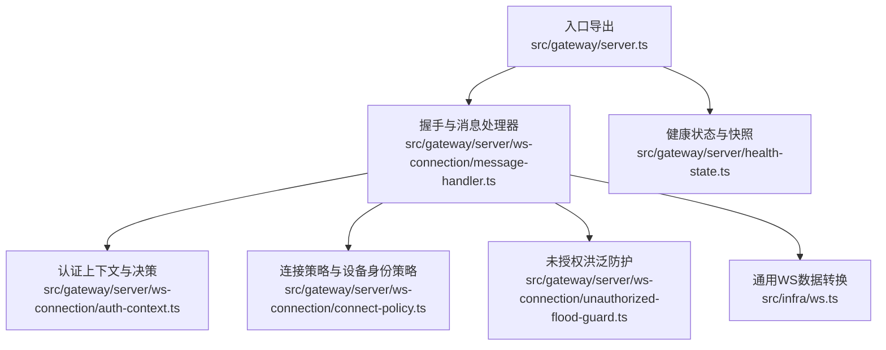
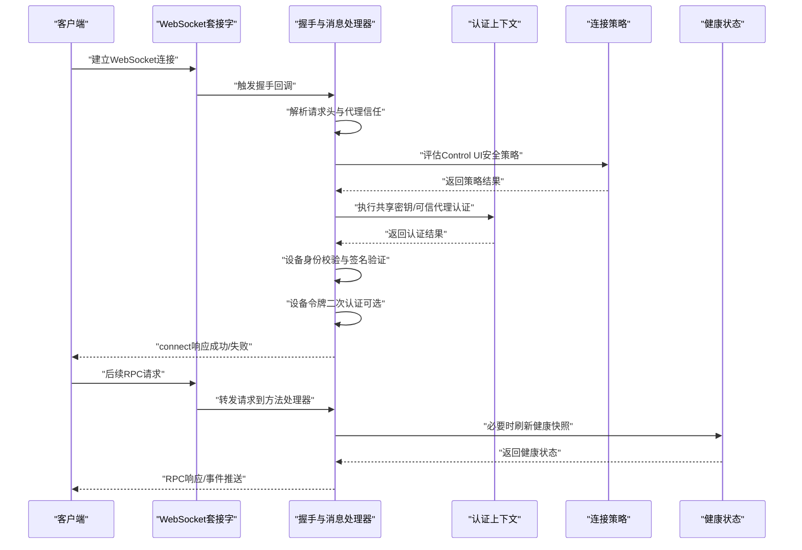
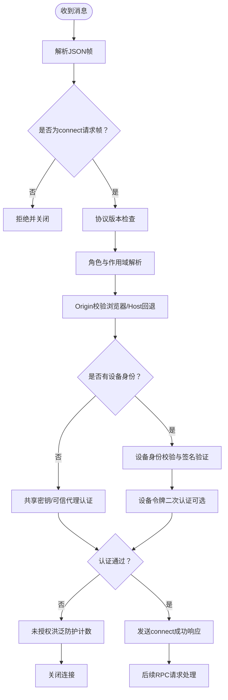
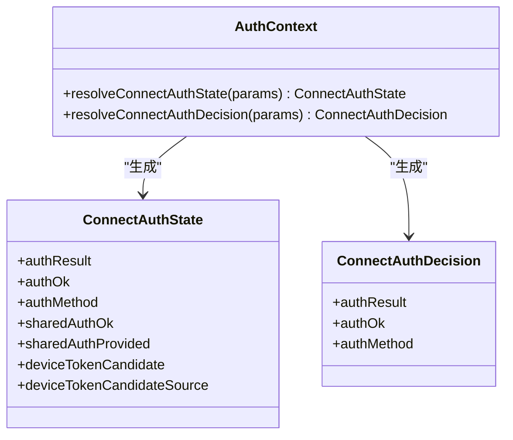
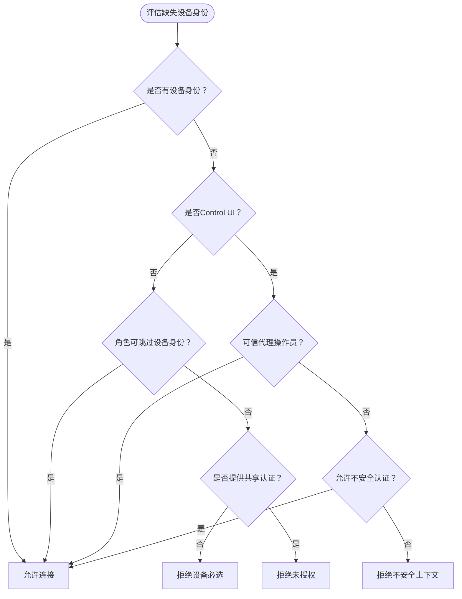
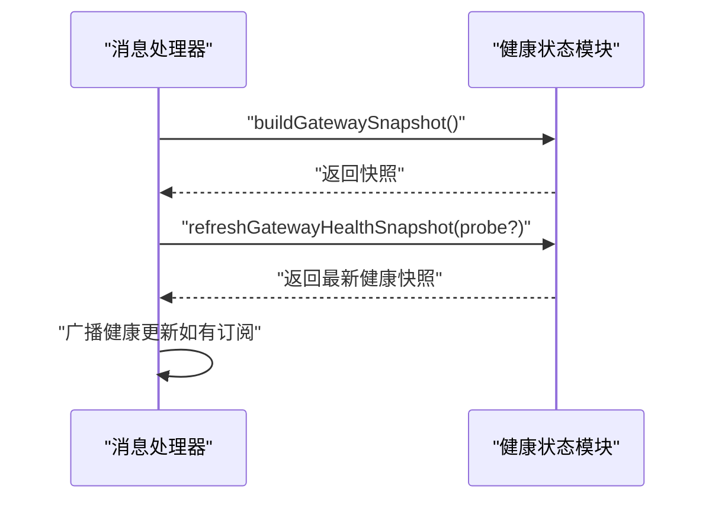
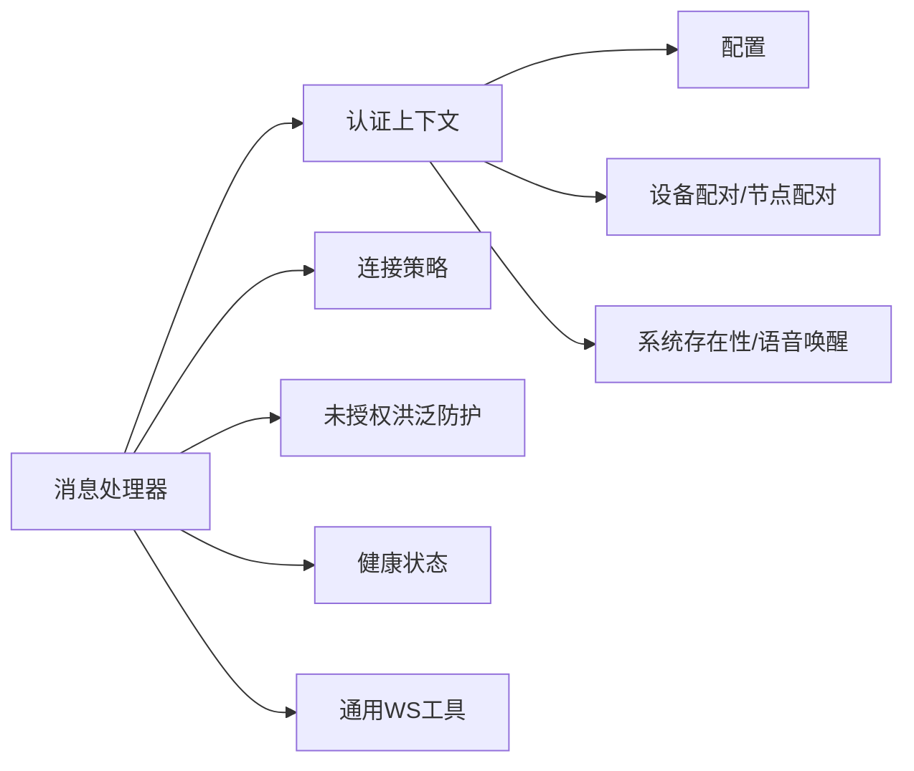

# 网关服务器

<cite>
**本文引用的文件**
- [src/gateway/server.ts](file://src/gateway/server.ts)
- [src/gateway/server/ws-connection/message-handler.ts](file://src/gateway/server/ws-connection/message-handler.ts)
- [src/gateway/server/ws-connection/auth-context.ts](file://src/gateway/server/ws-connection/auth-context.ts)
- [src/gateway/server/ws-connection/connect-policy.ts](file://src/gateway/server/ws-connection/connect-policy.ts)
- [src/gateway/server/ws-connection/unauthorized-flood-guard.ts](file://src/gateway/server/ws-connection/unauthorized-flood-guard.ts)
- [src/gateway/server/health-state.ts](file://src/gateway/server/health-state.ts)
- [src/infra/ws.ts](file://src/infra/ws.ts)
- [src/gateway/server.sessions.gateway-server-sessions-a.test.ts](file://src/gateway/server.sessions.gateway-server-sessions-a.test.ts)
</cite>

## 目录

1. [简介](#简介)
2. [项目结构](#项目结构)
3. [核心组件](#核心组件)
4. [架构总览](#架构总览)
5. [详细组件分析](#详细组件分析)
6. [依赖关系分析](#依赖关系分析)
7. [性能考量](#性能考量)
8. [故障排除指南](#故障排除指南)
9. [结论](#结论)
10. [附录](#附录)

## 简介

本文件为“网关服务器”的技术文档，聚焦于 WebSocket 控制平面的实现原理、会话管理机制、权限控制系统与事件分发逻辑。内容覆盖启动流程、配置选项、安全策略（含 Origin 校验、设备身份、代理信任、速率限制）、性能优化建议，并提供 API 参考、消息格式规范、错误处理机制、配置示例与集成案例，以及监控指标、日志记录与故障排除最佳实践。

## 项目结构

网关服务器位于 src/gateway 目录下，核心入口导出位于 src/gateway/server.ts；控制平面握手与消息处理集中在 src/gateway/server/ws-connection 下，健康状态与广播在 src/gateway/server/health-state.ts 中维护；通用 WebSocket 数据转换工具在 src/infra/ws.ts。

图示来源

- [src/gateway/server.ts:1-4](file://src/gateway/server.ts#L1-L4)
- [src/gateway/server/ws-connection/message-handler.ts:1-1243](file://src/gateway/server/ws-connection/message-handler.ts#L1-L1243)
- [src/gateway/server/ws-connection/auth-context.ts:1-219](file://src/gateway/server/ws-connection/auth-context.ts#L1-L219)
- [src/gateway/server/ws-connection/connect-policy.ts:1-103](file://src/gateway/server/ws-connection/connect-policy.ts#L1-L103)
- [src/gateway/server/ws-connection/unauthorized-flood-guard.ts:1-70](file://src/gateway/server/ws-connection/unauthorized-flood-guard.ts#L1-L70)
- [src/gateway/server/health-state.ts:1-86](file://src/gateway/server/health-state.ts#L1-L86)
- [src/infra/ws.ts:1-22](file://src/infra/ws.ts#L1-L22)

章节来源

- [src/gateway/server.ts:1-4](file://src/gateway/server.ts#L1-L4)
- [src/gateway/server/ws-connection/message-handler.ts:1-1243](file://src/gateway/server/ws-connection/message-handler.ts#L1-L1243)
- [src/gateway/server/health-state.ts:1-86](file://src/gateway/server/health-state.ts#L1-L86)
- [src/infra/ws.ts:1-22](file://src/infra/ws.ts#L1-L22)

## 核心组件

- WebSocket 控制平面握手与消息处理：负责协议版本协商、角色与作用域解析、Origin 校验、设备身份校验、共享密钥与设备令牌认证、配对跳过策略、未授权洪泛防护、请求路由与响应发送。
- 权限控制与认证上下文：封装共享密钥（token/password）与设备令牌认证流程，支持速率限制与可信代理旁路。
- 连接策略：针对 Control UI 的安全策略（允许不安全认证、禁用设备认证等），决定是否需要设备身份或可由可信代理放行。
- 健康状态与广播：构建网关快照、维护健康版本、异步刷新健康状态并广播更新。
- 通用工具：统一 WebSocket 原始数据到字符串的转换。

章节来源

- [src/gateway/server/ws-connection/message-handler.ts:236-800](file://src/gateway/server/ws-connection/message-handler.ts#L236-L800)
- [src/gateway/server/ws-connection/auth-context.ts:75-219](file://src/gateway/server/ws-connection/auth-context.ts#L75-L219)
- [src/gateway/server/ws-connection/connect-policy.ts:12-103](file://src/gateway/server/ws-connection/connect-policy.ts#L12-L103)
- [src/gateway/server/health-state.ts:17-86](file://src/gateway/server/health-state.ts#L17-L86)
- [src/infra/ws.ts:4-21](file://src/infra/ws.ts#L4-L21)

## 架构总览

网关服务器通过 WebSocket 提供控制平面服务。客户端首次建立连接时必须发送 connect 请求帧，随后进行协议版本协商、角色与作用域解析、Origin 校验、设备身份校验与认证决策。认证通过后，客户端可调用方法（如 sessions.\*）并接收事件推送。

图示来源

- [src/gateway/server/ws-connection/message-handler.ts:363-800](file://src/gateway/server/ws-connection/message-handler.ts#L363-L800)
- [src/gateway/server/ws-connection/auth-context.ts:75-219](file://src/gateway/server/ws-connection/auth-context.ts#L75-L219)
- [src/gateway/server/ws-connection/connect-policy.ts:12-103](file://src/gateway/server/ws-connection/connect-policy.ts#L12-L103)
- [src/gateway/server/health-state.ts:70-86](file://src/gateway/server/health-state.ts#L70-L86)

## 详细组件分析

### WebSocket 握手与消息处理

- 协议版本协商：要求客户端最小/最大协议号与服务端当前协议兼容，否则拒绝并关闭。
- 角色与作用域：默认角色为 operator，作用域必须显式声明；若无设备身份且未使用共享密钥，将清空作用域以避免自声明权限。
- Origin 校验：浏览器场景下强制校验，支持 Host 头回退（受配置开关控制），并记录安全警告与度量。
- 设备身份校验：校验设备 ID、签名时间偏差、nonce 一致性、公钥有效性与签名版本（v2/v3）。
- 认证决策：优先共享密钥认证，其次可信代理旁路，最后设备令牌二次认证（带独立速率限制）。
- 未授权洪泛防护：统计未授权尝试次数，超过阈值自动关闭连接，降低恶意探测成本。
- 请求路由：将合法 RPC 请求转交方法处理器，按需返回响应或事件。

图示来源

- [src/gateway/server/ws-connection/message-handler.ts:363-800](file://src/gateway/server/ws-connection/message-handler.ts#L363-L800)
- [src/gateway/server/ws-connection/unauthorized-flood-guard.ts:18-58](file://src/gateway/server/ws-connection/unauthorized-flood-guard.ts#L18-L58)

章节来源

- [src/gateway/server/ws-connection/message-handler.ts:363-800](file://src/gateway/server/ws-connection/message-handler.ts#L363-L800)
- [src/gateway/server/ws-connection/unauthorized-flood-guard.ts:1-70](file://src/gateway/server/ws-connection/unauthorized-flood-guard.ts#L1-L70)

### 权限控制与认证上下文

- 共享认证提取：从 connect 参数中提取 token/password，去除空白字符。
- 设备令牌候选：优先显式设备令牌，否则回退到共享 token。
- 认证状态：执行 WebSocket/HTTP 双通道认证，支持可信代理旁路，区分共享认证是否已提供。
- 决策流程：若具备设备令牌候选且速率未受限，则验证设备令牌；成功则切换为设备令牌认证方式。

图示来源

- [src/gateway/server/ws-connection/auth-context.ts:23-154](file://src/gateway/server/ws-connection/auth-context.ts#L23-L154)
- [src/gateway/server/ws-connection/auth-context.ts:156-219](file://src/gateway/server/ws-connection/auth-context.ts#L156-L219)

章节来源

- [src/gateway/server/ws-connection/auth-context.ts:75-219](file://src/gateway/server/ws-connection/auth-context.ts#L75-L219)

### 连接策略与设备身份策略

- Control UI 安全策略：支持允许不安全认证（仅本地）、危险地禁用设备认证（绕过设备身份要求），决定是否允许共享认证旁路。
- 配对跳过：当来自可信代理的操作员连接、或满足特定条件的后端自连接时，可跳过设备配对流程。
- 缺失设备身份决策：综合角色、共享认证、可信代理、本地客户端等因素，决定允许、拒绝或要求设备身份。

图示来源

- [src/gateway/server/ws-connection/connect-policy.ts:12-103](file://src/gateway/server/ws-connection/connect-policy.ts#L12-L103)

章节来源

- [src/gateway/server/ws-connection/connect-policy.ts:1-103](file://src/gateway/server/ws-connection/connect-policy.ts#L1-L103)

### 健康状态与事件分发

- 快照构建：聚合系统存在性、配置路径、会话默认参数、认证模式与更新可用性等信息。
- 版本管理：维护 presence 与 health 版本号，刷新时递增版本并广播。
- 异步刷新：健康快照异步拉取，避免阻塞握手与请求处理。

图示来源

- [src/gateway/server/health-state.ts:17-86](file://src/gateway/server/health-state.ts#L17-L86)

章节来源

- [src/gateway/server/health-state.ts:1-86](file://src/gateway/server/health-state.ts#L1-L86)

### 会话管理机制

- 客户端类型与权限差异：Webchat 客户端在 UI 模式下无法删除/修改会话；Control UI 客户端即使处于 Webchat 模式也可删除会话。
- 测试用例验证：通过 RPC 请求 sessions.delete 验证权限差异与行为一致性。

章节来源

- [src/gateway/server.sessions.gateway-server-sessions-a.test.ts:1328-1406](file://src/gateway/server.sessions.gateway-server-sessions-a.test.ts#L1328-L1406)

## 依赖关系分析

- 组件内聚与耦合：消息处理器集中协调认证、策略、健康与日志；认证上下文与策略模块职责清晰，低耦合高内聚。
- 外部依赖：依赖配置加载、设备配对与节点元数据、系统存在性、语音唤醒配置、Canvas 能力令牌等基础设施模块。
- 速率限制：共享密钥与设备令牌分别采用不同速率限制范围，避免误伤正常流量。

图示来源

- [src/gateway/server/ws-connection/message-handler.ts:1-1243](file://src/gateway/server/ws-connection/message-handler.ts#L1-L1243)
- [src/gateway/server/ws-connection/auth-context.ts:1-219](file://src/gateway/server/ws-connection/auth-context.ts#L1-L219)
- [src/gateway/server/ws-connection/connect-policy.ts:1-103](file://src/gateway/server/ws-connection/connect-policy.ts#L1-L103)
- [src/gateway/server/health-state.ts:1-86](file://src/gateway/server/health-state.ts#L1-L86)
- [src/infra/ws.ts:1-22](file://src/infra/ws.ts#L1-L22)

## 性能考量

- 原始数据转换：统一将多种原始数据类型转换为字符串，减少后续解析开销。
- 速率限制：对共享密钥与设备令牌分别施加速率限制，防止暴力破解与滥用。
- 未授权洪泛防护：快速关闭恶意连接，降低资源占用。
- 健康状态异步刷新：避免阻塞主流程，提升响应速度。
- 代理信任与 IP 解析：仅在可信代理场景启用本地客户端判定，减少误判带来的额外校验。

章节来源

- [src/infra/ws.ts:4-21](file://src/infra/ws.ts#L4-L21)
- [src/gateway/server/ws-connection/auth-context.ts:108-122](file://src/gateway/server/ws-connection/auth-context.ts#L108-L122)
- [src/gateway/server/ws-connection/unauthorized-flood-guard.ts:18-58](file://src/gateway/server/ws-connection/unauthorized-flood-guard.ts#L18-L58)
- [src/gateway/server/health-state.ts:70-86](file://src/gateway/server/health-state.ts#L70-L86)

## 故障排除指南

- 握手失败
  - 协议不匹配：检查客户端最小/最大协议号与服务端协议版本。
  - 非法握手帧：确认首帧为 connect 请求，参数结构正确。
  - 角色非法：确保角色字符串有效。
  - Origin 不被允许：在配置中添加允许的 Origin 或使用受信主机头回退（谨慎启用）。
- 认证失败
  - 未授权：检查 token/password 是否正确，或是否需要设备令牌重试。
  - 设备身份缺失：确认客户端提供了有效的 device 字段，或满足角色可跳过设备身份的条件。
  - 设备签名问题：核对设备公钥、签名时间、nonce 与签名版本。
  - 速率限制：等待重试间隔或调整速率限制策略。
- 会话操作异常
  - Webchat 客户端无法删除/修改会话：改用 Control UI 客户端或在 UI 模式下通过其他方式管理。
- 健康状态异常
  - 健康快照为空或陈旧：等待异步刷新完成，或手动触发探针刷新。

章节来源

- [src/gateway/server/ws-connection/message-handler.ts:462-774](file://src/gateway/server/ws-connection/message-handler.ts#L462-L774)
- [src/gateway/server.ws-connection/auth-context.ts:108-122](file://src/gateway/server.ws-connection/auth-context.ts#L108-L122)
- [src/gateway/server.sessions.gateway-server-sessions-a.test.ts:1328-1406](file://src/gateway/server.sessions.gateway-server-sessions-a.test.ts#L1328-L1406)

## 结论

该网关服务器以 WebSocket 为控制平面，围绕握手、认证、策略与健康状态构建了高安全性与可运维性的系统。通过严格的 Origin 校验、设备身份与多级认证、速率限制与洪泛防护，以及异步健康刷新与事件广播，实现了稳健的控制平面能力。结合本文的 API 参考、消息格式规范与配置示例，开发者可快速理解并扩展网关功能。

## 附录

### 启动流程与入口

- 入口导出：通过导出 startGatewayServer 与类型定义，对外暴露网关启动与配置接口。
- 建议：在应用启动阶段加载配置、初始化速率限制器与日志子系统，再启动 WebSocket 服务器。

章节来源

- [src/gateway/server.ts:1-4](file://src/gateway/server.ts#L1-L4)

### 配置选项与安全策略

- 代理信任与 IP 解析：gateway.trustedProxies、gateway.allowRealIpFallback。
- Control UI 安全策略：gateway.controlUi.allowInsecureAuth、gateway.controlUi.dangerouslyDisableDeviceAuth、gateway.controlUi.allowedOrigins、gateway.controlUi.dangerouslyAllowHostHeaderOriginFallback。
- 速率限制：共享密钥与设备令牌的速率限制范围与策略。
- 健康状态：健康快照异步刷新与广播。

章节来源

- [src/gateway/server/ws-connection/message-handler.ts:305-330](file://src/gateway/server/ws-connection/message-handler.ts#L305-L330)
- [src/gateway/server/ws-connection/connect-policy.ts:22-32](file://src/gateway/server/ws-connection/connect-policy.ts#L22-L32)
- [src/gateway/server/health-state.ts:70-86](file://src/gateway/server/health-state.ts#L70-L86)

### API 参考与消息格式规范

- 首帧（握手）
  - 类型：req
  - 方法：connect
  - 参数：包含客户端标识、版本、模式、角色、作用域、设备身份、认证凭据等字段。
- RPC 请求
  - 类型：req
  - 方法：具体方法名（如 sessions.\*）
  - 参数：按方法定义传入
  - 响应：包含 ok、payload 或 error 字段。
- 错误码与错误形状
  - 使用统一错误形状与错误码，便于客户端识别与处理。
- 事件推送
  - 服务器在会话状态变化等场景向客户端推送事件。

章节来源

- [src/gateway/server/ws-connection/message-handler.ts:396-434](file://src/gateway/server/ws-connection/message-handler.ts#L396-L434)
- [src/gateway/server/health-state.ts:17-47](file://src/gateway/server/health-state.ts#L17-L47)

### 监控指标与日志记录

- Origin 校验度量：Host 头回退接受计数与安全警告日志。
- 未授权洪泛防护：注册未授权尝试次数、日志频率与关闭阈值。
- 健康状态版本：presence 与 health 版本号递增与广播。
- 日志子系统：使用子系统日志器输出握手、健康与 WebSocket 控制面日志。

章节来源

- [src/gateway/server/ws-connection/message-handler.ts:521-531](file://src/gateway/server/ws-connection/message-handler.ts#L521-L531)
- [src/gateway/server/ws-connection/unauthorized-flood-guard.ts:18-58](file://src/gateway/server/ws-connection/unauthorized-flood-guard.ts#L18-L58)
- [src/gateway/server/health-state.ts:57-68](file://src/gateway/server/health-state.ts#L57-L68)

### 集成案例与最佳实践

- Control UI 安全集成：在受信网络中启用 allowInsecureAuth 仅用于本地开发，生产环境保持设备身份强制。
- 代理部署：正确配置 trustedProxies 与 X-Forwarded-\* 头，避免将外部请求误判为本地。
- 速率限制：根据部署规模设置合理的共享密钥与设备令牌速率限制，防止滥用。
- 事件驱动：利用健康状态广播与事件推送，实现前端 UI 的实时更新与告警。

章节来源

- [src/gateway/server/ws-connection/connect-policy.ts:22-32](file://src/gateway/server/ws-connection/connect-policy.ts#L22-L32)
- [src/gateway/server/health-state.ts:66-78](file://src/gateway/server/health-state.ts#L66-L78)
