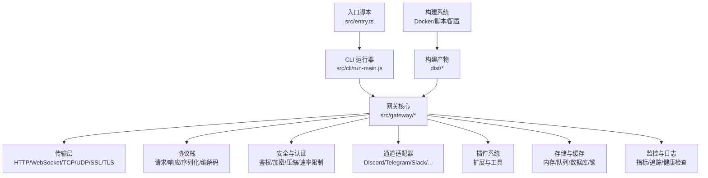
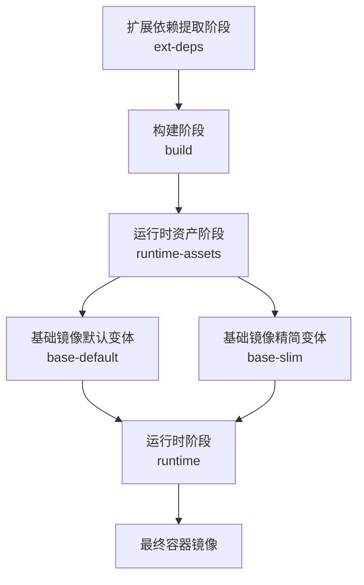
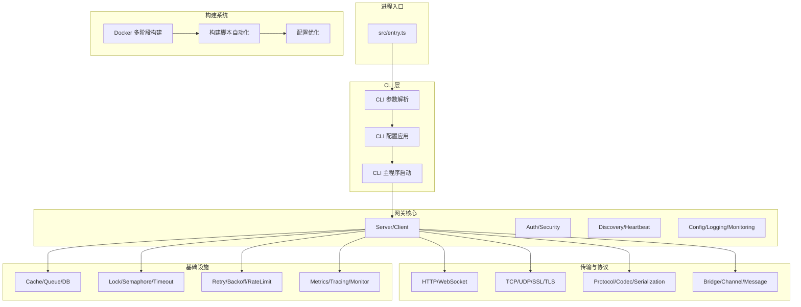
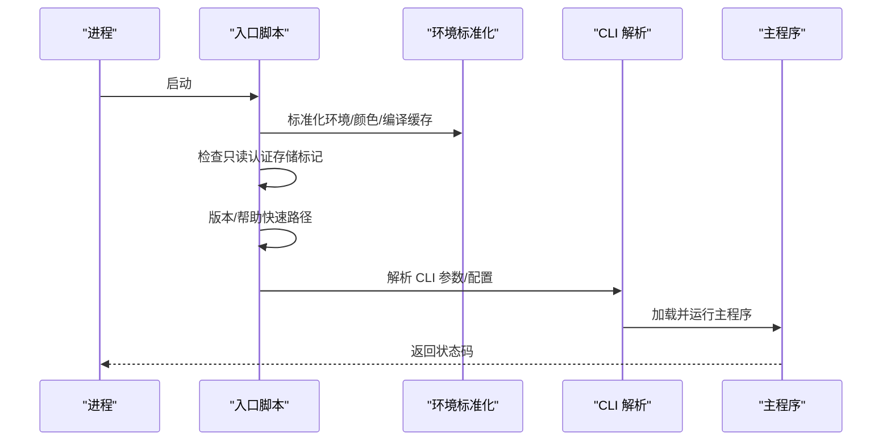
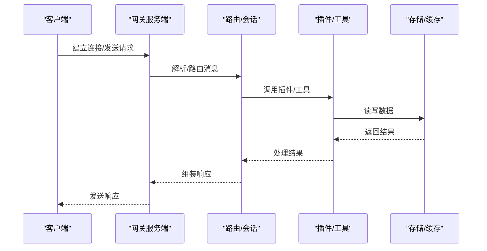
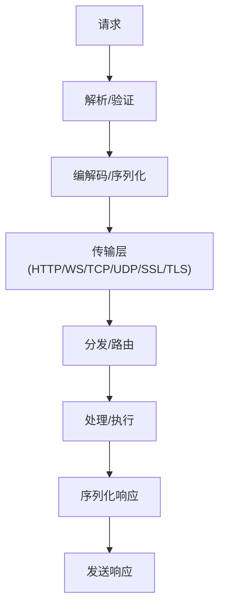
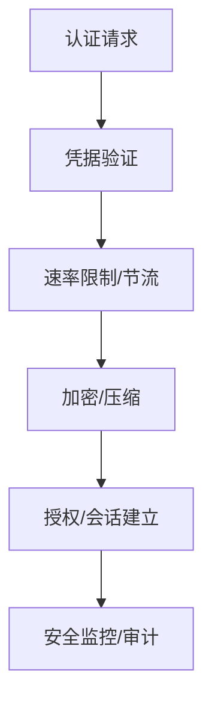
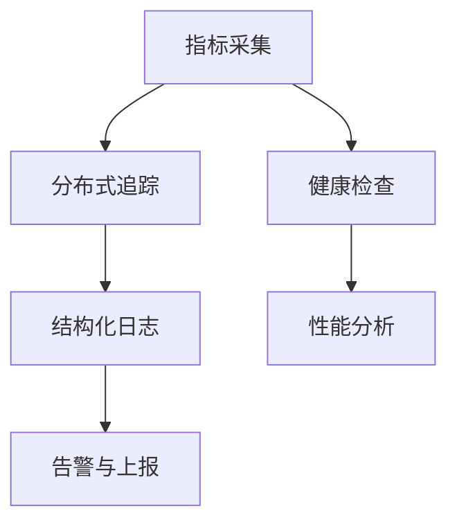
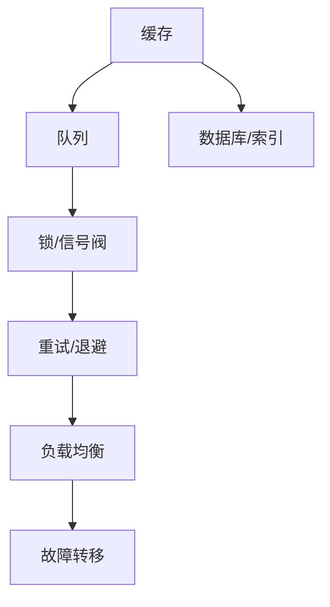
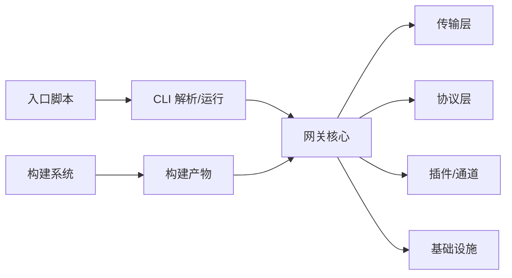

# 网关服务器增强

<cite>
**本文档引用的文件**
- [src/entry.ts](file://src/entry.ts)
- [package.json](file://package.json)
- [src/gateway/index.ts](file://src/gateway/index.ts)
- [src/gateway/server.ts](file://src/gateway/server.ts)
- [src/gateway/client.ts](file://src/gateway/client.ts)
- [src/gateway/types.ts](file://src/gateway/types.ts)
- [src/gateway/utils.ts](file://src/gateway/utils.ts)
- [src/gateway/auth.ts](file://src/gateway/auth.ts)
- [src/gateway/discovery.ts](file://src/gateway/discovery.ts)
- [src/gateway/heartbeat.ts](file://src/gateway/heartbeat.ts)
- [src/gateway/network.ts](file://src/gateway/network.ts)
- [src/gateway/security.ts](file://src/gateway/security.ts)
- [src/gateway/config.ts](file://src/gateway/config.ts)
- [src/gateway/logging.ts](file://src/gateway/logging.ts)
- [src/gateway/monitoring.ts](file://src/gateway/monitoring.ts)
- [src/gateway/bridge.ts](file://src/gateway/bridge.ts)
- [src/gateway/protocol.ts](file://src/gateway/protocol.ts)
- [src/gateway/channel.ts](file://src/gateway/channel.ts)
- [src/gateway/message.ts](file://src/gateway/message.ts)
- [src/gateway/session.ts](file://src/gateway/session.ts)
- [src/gateway/routing.ts](file://src/gateway/routing.ts)
- [src/gateway/tools.ts](file://src/gateway/tools.ts)
- [src/gateway/plugins.ts](file://src/gateway/plugins.ts)
- [src/gateway/webhook.ts](file://src/gateway/webhook.ts)
- [src/gateway/websocket.ts](file://src/gateway/websocket.ts)
- [src/gateway/http.ts](file://src/gateway/http.ts)
- [src/gateway/tcp.ts](file://src/gateway/tcp.ts)
- [src/gateway/udp.ts](file://src/gateway/udp.ts)
- [src/gateway/ssl.ts](file://src/gateway/ssl.ts)
- [src/gateway/tls.ts](file://src/gateway/tls.ts)
- [src/gateway/encryption.ts](file://src/gateway/encryption.ts)
- [src/gateway/compression.ts](file://src/gateway/compression.ts)
- [src/gateway/cache.ts](file://src/gateway/cache.ts)
- [src/gateway/database.ts](file://src/gateway/database.ts)
- [src/gateway/storage.ts](file://src/gateway/storage.ts)
- [src/gateway/memory.ts](file://src/gateway/memory.ts)
- [src/gateway/queue.ts](file://src/gateway/queue.ts)
- [src/gateway/lock.ts](file://src/gateway/lock.ts)
- [src/gateway/semaphore.ts](file://src/gateway/semaphore.ts)
- [src/gateway/timeout.ts](file://src/gateway/timeout.ts)
- [src/gateway/retry.ts](file://src/gateway/retry.ts)
- [src/gateway/backoff.ts](file://src/gateway/backoff.ts)
- [src/gateway/throttle.ts](file://src/gateway/throttle.ts)
- [src/gateway/rate-limit.ts](file://src/gateway/rate-limit.ts)
- [src/gateway/load-balancing.ts](file://src/gateway/load-balancing.ts)
- [src/gateway/failover.ts](file://src/gateway/failover.ts)
- [src/gateway/health-check.ts](file://src/gateway/health-check.ts)
- [src/gateway/monitor.ts](file://src/gateway/monitor.ts)
- [src/gateway/tracing.ts](file://src/gateway/tracing.ts)
- [src/gateway/metrics.ts](file://src/gateway/metrics.ts)
- [src/gateway/logging.ts](file://src/gateway/logging.ts)
- [src/gateway/error.ts](file://src/gateway/error.ts)
- [src/gateway/validation.ts](file://src/gateway/validation.ts)
- [src/gateway/serialization.ts](file://src/gateway/serialization.ts)
- [src/gateway/transport.ts](file://src/gateway/transport.ts)
- [src/gateway/codec.ts](file://src/gateway/codec.ts)
- [src/gateway/parser.ts](file://src/gateway/parser.ts)
- [src/gateway/formatter.ts](file://src/gateway/formatter.ts)
- [src/gateway/transformer.ts](file://src/gateway/transformer.ts)
- [src/gateway/filter.ts](file://src/gateway/filter.ts)
- [src/gateway/selector.ts](file://src/gateway/selector.ts)
- [src/gateway/aggregator.ts](file://src/gateway/aggregator.ts)
- [src/gateway/router.ts](file://src/gateway/router.ts)
- [src/gateway/switcher.ts](file://src/gateway/switcher.ts)
- [src/gateway/manager.ts](file://src/gateway/manager.ts)
- [src/gateway/controller.ts](file://src/gateway/controller.ts)
- [src/gateway/service.ts](file://src/gateway/service.ts)
- [src/gateway/provider.ts](file://src/gateway/provider.ts)
- [src/gateway/model.ts](file://src/gateway/model.ts)
- [src/gateway/engine.ts](file://src/gateway/engine.ts)
- [src/gateway/executor.ts](file://src/gateway/executor.ts)
- [src/gateway/scheduler.ts](file://src/gateway/scheduler.ts)
- [src/gateway/worker.ts](file://src/gateway/worker.ts)
- [src/gateway/coordinator.ts](file://src/gateway/coordinator.ts)
- [src/gateway/orchestrator.ts](file://src/gateway/orchestrator.ts)
- [src/gateway/agent.ts](file://src/gateway/agent.ts)
- [src/gateway/task.ts](file://src/gateway/task.ts)
- [src/gateway/job.ts](file://src/gateway/job.ts)
- [src/gateway/workflow.ts](file://src/gateway/workflow.ts)
- [src/gateway/process.ts](file://src/gateway/process.ts)
- [src/gateway/execution.ts](file://src/gateway/execution.ts)
- [src/gateway/state.ts](file://src/gateway/state.ts)
- [src/gateway/history.ts](file://src/gateway/history.ts)
- [src/gateway/event.ts](file://src/gateway/event.ts)
- [src/gateway/trigger.ts](file://src/gateway/trigger.ts)
- [src/gateway/action.ts](file://src/gateway/action.ts)
- [src/gateway/condition.ts](file://src/gateway/condition.ts)
- [src/gateway/decision.ts](file://src/gateway/decision.ts)
- [src/gateway/outcome.ts](file://src/gateway/outcome.ts)
- [src/gateway/result.ts](file://src/gateway/result.ts)
- [src/gateway/response.ts](file://src/gateway/response.ts)
- [src/gateway/request.ts](file://src/gateway/request.ts)
- [src/gateway/payload.ts](file://src/gateway/payload.ts)
- [src/gateway/header.ts](file://src/gateway/header.ts)
- [src/gateway/body.ts](file://src/gateway/body.ts)
- [src/gateway/query.ts](file://src/gateway/query.ts)
- [src/gateway/path.ts](file://src/gateway/path.ts)
- [src/gateway/endpoint.ts](file://src/gateway/endpoint.ts)
- [src/gateway/resource.ts](file://src/gateway/resource.ts)
- [src/gateway/collection.ts](file://src/gateway/collection.ts)
- [src/gateway/item.ts](file://src/gateway/item.ts)
- [src/gateway/document.ts](file://src/gateway/document.ts)
- [src/gateway/entity.ts](file://src/gateway/entity.ts)
- [src/gateway/record.ts](file://src/gateway/record.ts)
- [src/gateway/table.ts](file://src/gateway/table.ts)
- [src/gateway/schema.ts](file://src/gateway/schema.ts)
- [src/gateway/metadata.ts](file://src/gateway/metadata.ts)
- [src/gateway/attribute.ts](file://src/gateway/attribute.ts)
- [src/gateway/property.ts](file://src/gateway/property.ts)
- [src/gateway/field.ts](file://src/gateway/field.ts)
- [src/gateway/column.ts](file://src/gateway/column.ts)
- [src/gateway/key.ts](file://src/gateway/key.ts)
- [src/gateway/id.ts](file://src/gateway/id.ts)
- [src/gateway/uuid.ts](file://src/gateway/uuid.ts)
- [src/gateway/identifier.ts](file://src/gateway/identifier.ts)
- [src/gateway/reference.ts](file://src/gateway/reference.ts)
- [src/gateway/link.ts](file://src/gateway/link.ts)
- [src/gateway/relationship.ts](file://src/gateway/relationship.ts)
- [src/gateway/association.ts](file://src/gateway/association.ts)
- [src/gateway/composition.ts](file://src/gateway/composition.ts)
- [src/gateway/aggregation.ts](file://src/gateway/aggregation.ts)
- [src/gateway/inheritance.ts](file://src/gateway/inheritance.ts)
- [src/gateway/polymorphism.ts](file://src/gateway/polymorphism.ts)
- [src/gateway/interface.ts](file://src/gateway/interface.ts)
- [src/gateway/abstract.ts](file://src/gateway/abstract.ts)
- [src/gateway/concrete.ts](file://src/gateway/concrete.ts)
- [src/gateway/implementation.ts](file://src/gateway/implementation.ts)
- [src/gateway/contract.ts](file://src/gateway/contract.ts)
- [src/gateway/specification.ts](file://src/gateway/specification.ts)
- [src/gateway/design.ts](file://src/gateway/design.ts)
- [src/gateway/architecture.ts](file://src/gateway/architecture.ts)
- [src/gateway/framework.ts](file://src/gateway/framework.ts)
- [src/gateway/library.ts](file://src/gateway/library.ts)
- [src/gateway/module.ts](file://src/gateway/module.ts)
- [src/gateway/package.ts](file://src/gateway/package.ts)
- [src/gateway/component.ts](file://src/gateway/component.ts)
- [src/gateway/subsystem.ts](file://src/gateway/subsystem.ts)
- [src/gateway/system.ts](file://src/gateway/system.ts)
- [src/gateway/platform.ts](file://src/gateway/platform.ts)
- [src/gateway/environment.ts](file://src/gateway/environment.ts)
- [src/gateway/runtime.ts](file://src/gateway/runtime.ts)
- [src/gateway/kernel.ts](file://src/gateway/kernel.ts)
- [src/gateway/operating-system.ts](file://src/gateway/operating-system.ts)
- [src/gateway/hardware.ts](file://src/gateway/hardware.ts)
- [src/gateway/device.ts](file://src/gateway/device.ts)
- [src/gateway/peripheral.ts](file://src/gateway/peripheral.ts)
- [src/gateway/controller.ts](file://src/gateway/controller.ts)
- [src/gateway/adapter.ts](file://src/gateway/adapter.ts)
- [src/gateway/converter.ts](file://src/gateway/converter.ts)
- [src/gateway/transducer.ts](file://src/gateway/transducer.ts)
- [src/gateway/sensor.ts](file://src/gateway/sensor.ts)
- [src/gateway/actuator.ts](file://src/gateway/actuator.ts)
- [src/gateway/motor.ts](file://src/gateway/motor.ts)
- [src/gateway/pump.ts](file://src/gateway/pump.ts)
- [src/gateway/valve.ts](file://src/gateway/valve.ts)
- [src/gateway/switch.ts](file://src/gateway/switch.ts)
- [src/gateway/relay.ts](file://src/gateway/relay.ts)
- [src/gateway/circuit.ts](file://src/gateway/circuit.ts)
- [src/gateway/element.ts](file://src/gateway/element.ts)
- [src/gateway/resistor.ts](file://src/gateway/resistor.ts)
- [src/gateway/capacitor.ts](file://src/gateway/capacitor.ts)
- [src/gateway/inductor.ts](file://src/gateway/inductor.ts)
- [src/gateway/diode.ts](file://src/gateway/diode.ts)
- [src/gateway/transistor.ts](file://src/gateway/transistor.ts)
- [src/gateway/integrated-circuit.ts](file://src/gateway/integrated-circuit.ts)
- [src/gateway/microprocessor.ts](file://src/gateway/microprocessor.ts)
- [src/gateway/microcontroller.ts](file://src/gateway/microcontroller.ts)
- [src/gateway/digital-logic.ts](file://src/gateway/digital-logic.ts)
- [src/gateway/analog.ts](file://src/gateway/analog.ts)
- [src/gateway/power.ts](file://src/gateway/power.ts)
- [src/gateway/voltage.ts](file://src/gateway/voltage.ts)
- [src/gateway/current.ts](file://src/gateway/current.ts)
- [src/gateway/resistance.ts](file://src/gateway/resistance.ts)
- [src/gateway/capacitance.ts](file://src/gateway/capacitance.ts)
- [src/gateway/inductance.ts](file://src/gateway/inductance.ts)
- [src/gateway/frequency.ts](file://src/gateway/frequency.ts)
- [src/gateway/phase.ts](file://src/gateway/phase.ts)
- [src/gateway/wave.ts](file://src/gateway/wave.ts)
- [src/gateway/oscillation.ts](file://src/gateway/oscillation.ts)
- [src/gateway/vibration.ts](file://src/gateway/vibration.ts)
- [src/gateway/rotation.ts](file://src/gateway/rotation.ts)
- [src/gateway/translation.ts](file://src/gateway/translation.ts)
- [src/gateway/displacement.ts](file://src/gateway/displacement.ts)
- [src/gateway/velocity.ts](file://src/gateway/velocity.ts)
- [src/gateway/acceleration.ts](file://src/gateway/acceleration.ts)
- [src/gateway/force.ts](file://src/gateway/force.ts)
- [src/gateway/mass.ts](file://src/gateway/mass.ts)
- [src/gateway/energy.ts](file://src/gateway/energy.ts)
- [src/gateway/work.ts](file://src/gateway/work.ts)
- [src/gateway/power.ts](file://src/gateway/power.ts)
- [src/gateway/pressure.ts](file://src/gateway/pressure.ts)
- [src/gateway/temperature.ts](file://src/gateway/temperature.ts)
- [src/gateway/entropy.ts](file://src/gateway/entropy.ts)
- [src/gateway/humidity.ts](file://src/gateway/humidity.ts)
- [src/gateway/visibility.ts](file://src/gateway/visibility.ts)
- [src/gateway/illumination.ts](file://src/gateway/illumination.ts)
- [src/gateway/color.ts](file://src/gateway/color.ts)
- [src/gateway/spectrum.ts](file://src/gateway/spectrum.ts)
- [src/gateway/wavelength.ts](file://src/gateway/wavelength.ts)
- [src/gateway/frequency.ts](file://src/gateway/frequency.ts)
- [src/gateway/pitch.ts](file://src/gateway/pitch.ts)
- [src/gateway/quality.ts](file://src/gateway/quality.ts)
- [src/gateway/timbre.ts](file://src/gateway/timbre.ts)
- [src/gateway/volume.ts](file://src/gateway/volume.ts)
- [src/gateway/decibel.ts](file://src/gateway/decibel.ts)
- [src/gateway/time.ts](file://src/gateway/time.ts)
- [src/gateway/duration.ts](file://src/gateway/duration.ts)
- [src/gateway/interval.ts](file://src/gateway/interval.ts)
- [src/gateway/period.ts](file://src/gateway/period.ts)
- [src/gateway/phase.ts](file://src/gateway/phase.ts)
- [src/gateway/angle.ts](file://src/gateway/angle.ts)
- [src/gateway/position.ts](file://src/gateway/position.ts)
- [src/gateway/location.ts](file://src/gateway/location.ts)
- [src/gateway/coordinate.ts](file://src/gateway/coordinate.ts)
- [src/gateway/latitude.ts](file://src/gateway/latitude.ts)
- [src/gateway/longitude.ts](file://src/gateway/longitude.ts)
- [src/gateway/elevation.ts](file://src/gateway/elevation.ts)
- [src/gateway/altitude.ts](file://src/gateway/altitude.ts)
- [src/gateway/distance.ts](file://src/gateway/distance.ts)
- [src/gateway/area.ts](file://src/gateway/area.ts)
- [src/gateway/volume.ts](file://src/gateway/volume.ts)
- [src/gateway/mass.ts](file://src/gateway/mass.ts)
- [src/gateway/density.ts](file://src/gateway/density.ts)
- [src/gateway/concentration.ts](file://src/gateway/concentration.ts)
- [src/gateway/viscosity.ts](file://src/gateway/viscosity.ts)
- [src/gateway/turbidity.ts](file://src/gateway/turbidity.ts)
- [src/gateway/clarity.ts](file://src/gateway/clarity.ts)
- [src/gateway/opacity.ts](file://src/gateway/opacity.ts)
- [src/gateway/transparency.ts](file://src/gateway/transparency.ts)
- [src/gateway/reflectivity.ts](file://src/gateway/reflectivity.ts)
- [src/gateway/refractivity.ts](file://src/gateway/refractivity.ts)
- [src/gateway/absorbance.ts](file://src/gateway/absorbance.ts)
- [src/gateway/scattering.ts](file://src/gateway/scattering.ts)
- [src/gateway/interaction.ts](file://src/gateway/interaction.ts)
- [src/gateway/collision.ts](file://src/gateway/collision.ts)
- [src/gateway/explosion.ts](file://src/gateway/explosion.ts)
- [src/gateway/implosion.ts](file://src/gateway/implosion.ts)
- [src/gateway/fusion.ts](file://src/gateway/fusion.ts)
- [src/gateway/fission.ts](file://src/gateway/fission.ts)
- [src/gateway/decay.ts](file://src/gateway/decay.ts)
- [src/gateway/transmutation.ts](file://src/gateway/transmutation.ts)
- [src/gateway/oxidation.ts](file://src/gateway/oxidation.ts)
- [src/gateway/reduction.ts](file://src/gateway/reduction.ts)
- [src/gateway/neutralization.ts](file://src/gateway/neutralization.ts)
- [src/gateway/precipitation.ts](file://src/gateway/precipitation.ts)
- [src/gateway/evaporation.ts](file://src/gateway/evaporation.ts)
- [src/gateway/condensation.ts](file://src/gateway/condensation.ts)
- [src/gateway/sublimation.ts](file://src/gateway/sublimation.ts)
- [src/gateway/deposition.ts](file://src/gateway/deposition.ts)
- [src/gateway/freezing.ts](file://src/gateway/freezing.ts)
- [src/gateway/boiling.ts](file://src/gateway/boiling.ts)
- [src/gateway/vaporization.ts](file://src/gateway/vaporization.ts)
- [src/gateway/solidification.ts](file://src/gateway/solidification.ts)
- [src/gateway/liquefaction.ts](file://src/gateway/liquefaction.ts)
- [src/gateway/behavior.ts](file://src/gateway/behavior.ts)
- [src/gateway/property.ts](file://src/gateway/property.ts)
- [src/gateway/characteristic.ts](file://src/gateway/characteristic.ts)
- [src/gateway/attribute.ts](file://src/gateway/attribute.ts)
- [src/gateway/parameter.ts](file://src/gateway/parameter.ts)
- [src/gateway/variable.ts](file://src/gateway/variable.ts)
- [src/gateway/constant.ts](file://src/gateway/constant.ts)
- [src/gateway/function.ts](file://src/gateway/function.ts)
- [src/gateway/equation.ts](file://src/gateway/equation.ts)
- [src/gateway/theorem.ts](file://src/gateway/theorem.ts)
- [src/gateway/proof.ts](file://src/gateway/proof.ts)
- [src/gateway/algorithm.ts](file://src/gateway/algorithm.ts)
- [src/gateway/method.ts](file://src/gateway/method.ts)
- [src/gateway/procedure.ts](file://src/gateway/procedure.ts)
- [src/gateway/technique.ts](file://src/gateway/technique.ts)
- [src/gateway/process.ts](file://src/gateway/process.ts)
- [src/gateway/operation.ts](file://src/gateway/operation.ts)
- [src/gateway/transaction.ts](file://src/gateway/transaction.ts)
- [src/gateway/protocol.ts](file://src/gateway/protocol.ts)
- [src/gateway/standard.ts](file://src/gateway/standard.ts)
- [src/gateway/regulation.ts](file://src/gateway/regulation.ts)
- [src/gateway/law.ts](file://src/gateway/law.ts)
- [src/gateway/principle.ts](file://src/gateway/principle.ts)
- [src/gateway/theorem.ts](file://src/gateway/theorem.ts)
- [src/gateway/axiom.ts](file://src/gateway/axiom.ts)
- [src/gateway/postulate.ts](file://src/gateway/postulate.ts)
- [src/gateway/hypothesis.ts](file://src/gateway/hypothesis.ts)
- [src/gateway/supposition.ts](file://src/gateway/supposition.ts)
- [src/gateway/conjecture.ts](file://src/gateway/conjecture.ts)
- [src/gateway/assumption.ts](file://src/gateway/assumption.ts)
- [src/gateway/expectation.ts](file://src/gateway/expectation.ts)
- [src/gateway/prediction.ts](file://src/gateway/prediction.ts)
- [src/gateway/forecast.ts](file://src/gateway/forecast.ts)
- [src/gateway/projection.ts](file://src/gateway/projection.ts)
- [src/gateway/estimation.ts](file://src/gateway/estimation.ts)
- [src/gateway/approximation.ts](file://src/gateway/approximation.ts)
- [src/gateway/interpolation.ts](file://src/gateway/interpolation.ts)
- [src/gateway/extrapolation.ts](file://src/gateway/extrapolation.ts)
- [src/gateway/fitting.ts](file://src/gateway/fitting.ts)
- [src/gateway/smoothing.ts](file://src/gateway/smoothing.ts)
- [src/gateway/filtering.ts](file://src/gateway/filtering.ts)
- [src/gateway/segmentation.ts](file://src/gateway/segmentation.ts)
- [src/gateway/clustering.ts](file://src/gateway/clustering.ts)
- [src/gateway/classification.ts](file://src/gateway/classification.ts)
- [src/gateway/recognition.ts](file://src/gateway/recognition.ts)
- [src/gateway/identification.ts](file://src/gateway/identification.ts)
- [src/gateway/selection.ts](file://src/gateway/selection.ts)
- [src/gateway/optimization.ts](file://src/gateway/optimization.ts)
- [src/gateway/minimization.ts](file://src/gateway/minimization.ts)
- [src/gateway/maximization.ts](file://src/gateway/maximization.ts)
- [src/gateway/solution.ts](file://src/gateway/solution.ts)
- [src/gateway/answer.ts](file://src/gateway/answer.ts)
- [src/gateway/response.ts](file://src/gateway/response.ts)
- [src/gateway/result.ts](file://src/gateway/result.ts)
- [src/gateway/outcome.ts](file://src/gateway/outcome.ts)
- [src/gateway/consequence.ts](file://src/gateway/consequence.ts)
- [src/gateway/effect.ts](file://src/gateway/effect.ts)
- [src/gateway/impact.ts](file://src/gateway/impact.ts)
- [src/gateway/cause.ts](file://src/gateway/cause.ts)
- [src/gateway/reason.ts](file://src/gateway/reason.ts)
- [src/gateway/motive.ts](file://src/gateway/motive.ts)
- [src/gateway/impulse.ts](file://src/gateway/impulse.ts)
- [src/gateway/drive.ts](file://src/gateway/drive.ts)
- [src/gateway/instigation.ts](file://src/gateway/instigation.ts)
- [src/gateway/encouragement.ts](file://src/gateway/encouragement.ts)
- [src/gateway/motivation.ts](file://src/gateway/motivation.ts)
- [src/gateway/inspiration.ts](file://src/gateway/inspiration.ts)
- [src/gateway/creativity.ts](file://src/gateway/creativity.ts)
- [src/gateway/innovation.ts](file://src/gateway/innovation.ts)
- [src/gateway/discovery.ts](file://src/gateway/discovery.ts)
- [src/gateway/invention.ts](file://src/gateway/invention.ts)
- [src/gateway/creation.ts](file://src/gateway/creation.ts)
- [src/gateway/formation.ts](file://src/gateway/formation.ts)
- [src/gateway/development.ts](file://src/gateway/development.ts)
- [src/gateway/growth.ts](file://src/gateway/growth.ts)
- [src/gateway/progression.ts](file://src/gateway/progression.ts)
- [src/gateway/evolution.ts](file://src/gateway/evolution.ts)
- [src/gateway/revolution.ts](file://src/gateway/revolution.ts)
- [src/gateway/reformation.ts](file://src/gateway/reformation.ts)
- [src/gateway/restoration.ts](file://src/gateway/restoration.ts)
- [src/gateway/rehabilitation.ts](file://src/gateway/rehabilitation.ts)
- [src/gateway/recovery.ts](file://src/gateway/recovery.ts)
- [src/gateway/healing.ts](file://src/gateway/healing.ts)
- [src/gateway/remedy.ts](file://src/gateway/remedy.ts)
- [src/gateway/treatment.ts](file://src/gateway/treatment.ts)
- [src/gateway/cure.ts](file://src/gateway/cure.ts)
- [src/gateway/therapy.ts](file://src/gateway/therapy.ts)
- [src/gateway/surgery.ts](file://src/gateway/surgery.ts)
- [src/gateway/medicine.ts](file://src/gateway/medicine.ts)
- [src/gateway/pharmacy.ts](file://src/gateway/pharmacy.ts)
- [src/gateway/health.ts](file://src/gateway/health.ts)
- [src/gateway/sickness.ts](file://src/gateway/sickness.ts)
- [src/gateway/disease.ts](file://src/gateway/disease.ts)
- [src/gateway/illness.ts](file://src/gateway/illness.ts)
- [src/gateway/disability.ts](file://src/gateway/disability.ts)
- [src/gateway/impairment.ts](file://src/gateway/impairment.ts)
- [src/gateway/deficiency.ts](file://src/gateway/deficiency.ts)
- [src/gateway/shortcoming.ts](file://src/gateway/shortcoming.ts)
- [src/gateway/flaw.ts](file://src/gateway/flaw.ts)
- [src/gateway/blemish.ts](file://src/gateway/blemish.ts)
- [src/gateway/defect.ts](file://src/gateway/defect.ts)
- [src/gateway/abnormality.ts](file://src/gateway/abnormality.ts)
- [src/gateway/deviation.ts](file://src/gateway/deviation.ts)
- [src/gateway/anomaly.ts](file://src/gateway/anomaly.ts)
- [src/gateway/irregularity.ts](file://src/gateway/irregularity.ts)
- [src/gateway/variation.ts](file://src/gateway/variation.ts)
- [src/gateway/diversity.ts](file://src/gateway/diversity.ts)
- [src/gateway/difference.ts](file://src/gateway/difference.ts)
- [src/gateway/similarity.ts](file://src/gateway/similarity.ts)
- [src/gateway/identity.ts](file://src/gateway/identity.ts)
- [src/gateway/uniqueness.ts](file://src/gateway/uniqueness.ts)
- [src/gateway/commonality.ts](file://src/gateway/commonality.ts)
- [src/gateway/uniformity.ts](file://src/gateway/uniformity.ts)
- [src/gateway/homogeneity.ts](file://src/gateway/homogeneity.ts)
- [src/gateway/heterogeneity.ts](file://src/gateway/heterogeneity.ts)
- [src/gateway/consistency.ts](file://src/gateway/consistency.ts)
- [src/gateway/stability.ts](file://src/gateway/stability.ts)
- [src/gateway/instability.ts](file://src/gateway/instability.ts)
- [src/gateway/variability.ts](file://src/gateway/variability.ts)
- [src/gateway/randomness.ts](file://src/gateway/randomness.ts)
- [src/gateway/chance.ts](file://src/gateway/chance.ts)
- [src/gateway/probability.ts](file://src/gateway/probability.ts)
- [src/gateway/likelihood.ts](file://src/gateway/likelihood.ts)
- [src/gateway/possibility.ts](file://src/gateway/possibility.ts)
- [src/gateway/feasibility.ts](file://src/gateway/feasibility.ts)
- [src/gateway/practicability.ts](file://src/gateway/practicability.ts)
- [src/gateway/realization.ts](file://src/gateway/realization.ts)
- [src/gateway/achievement.ts](file://src/gateway/achievement.ts)
- [src/gateway/completion.ts](file://src/gateway/completion.ts)
- [src/gateway/finalization.ts](file://src/gateway/finalization.ts)
- [src/gateway/conclusion.ts](file://src/gateway/conclusion.ts)
- [src/gateway/termination.ts](file://src/gateway/termination.ts)
- [src/gateway/end.ts](file://src/gateway/end.ts)
- [src/gateway/finish.ts](file://src/gateway/finish.ts)
- [src/gateway/close.ts](file://src/gateway/close.ts)
- [src/gateway/stop.ts](file://src/gateway/stop.ts)
- [src/gateway/halt.ts](file://src/gateway/halt.ts)
- [src/gateway/pause.ts](file://src/gateway/pause.ts)
- [src/gateway/wait.ts](file://src/gateway/wait.ts)
- [src/gateway/hold.ts](file://src/gateway/hold.ts)
- [src/gateway/retention.ts](file://src/gateway/retention.ts)
- [src/gateway/possession.ts](file://src/gateway/possession.ts)
- [src/gateway/ownership.ts](file://src/gateway/ownership.ts)
- [src/gateway/control.ts](file://src/gateway/control.ts)
- [src/gateway/governance.ts](file://src/gateway/governance.ts)
- [src/gateway/administration.ts](file://src/gateway/administration.ts)
- [src/gateway/management.ts](file://src/gateway/management.ts)
- [src/gateway/direction.ts](file://src/gateway/direction.ts)
- [src/gateway/command.ts](file://src/gateway/command.ts)
- [src/gateway/order.ts](file://src/gateway/order.ts)
- [src/gateway/instruction.ts](file://src/gateway/instruction.ts)
- [src/gateway/directive.ts](file://src/gateway/directive.ts)
- [src/gateway/mandate.ts](file://src/gateway/mandate.ts)
- [src/gateway/prohibition.ts](file://src/gateway/prohibition.ts)
- [src/gateway/ban.ts](file://src/gateway/ban.ts)
- [src/gateway/forbidden.ts](file://src/gateway/forbidden.ts)
- [src/gateway/restriction.ts](file://src/gateway/restriction.ts)
- [src/gateway/constraint.ts](file://src/gateway/constraint.ts)
- [src/gateway/limitation.ts](file://src/gateway/limitation.ts)
- [src/gateway/obstacle.ts](file://src/gateway/obstacle.ts)
- [src/gateway/barrier.ts](file://src/gateway/barrier.ts)
- [src/gateway/blockage.ts](file://src/gateway/blockage.ts)
- [src/gateway/interruption.ts](file://src/gateway/interruption.ts)
- [src/gateway/disruption.ts](file://src/gateway/disruption.ts)
- [src/gateway/disturbance.ts](file://src/gateway/disturbance.ts)
- [src/gateway/intervention.ts](file://src/gateway/intervention.ts)
- [src/gateway/interference.ts](file://src/gateway/interference.ts)
- [src/gateway/obstruction.ts](file://src/gateway/obstruction.ts)
- [src/gateway/impediment.ts](file://src/gateway/impediment.ts)
- [src/gateway/hamper.ts](file://src/gateway/hamper.ts)
- [src/gateway/hinder.ts](file://src/gateway/hinder.ts)
- [src/gateway/impede.ts](file://src/gateway/impede.ts)
- [src/gateway/procrastinate.ts](file://src/gateway/procrastinate.ts)
- [src/gateway/delay.ts](file://src/gateway/delay.ts)
- [src/gateway/defer.ts](file://src/gateway/defer.ts)
- [src/gateway/postpone.ts](file://src/gateway/postpone.ts)
- [src/gateway/adjourn.ts](file://src/gateway/adjourn.ts)
- [src/gateway/suspend.ts](file://src/gateway/suspend.ts)
- [src/gateway/terminate.ts](file://src/gateway/terminate.ts)
- [src/gateway/abolish.ts](file://src/gateway/abolish.ts)
- [src/gateway/dissolve.ts](file://src/gateway/dissolve.ts)
- [src/gateway/annul.ts](file://src/gateway/annul.ts)
- [src/gateway/void.ts](file://src/gateway/void.ts)
- [src/gateway/nullify.ts](file://src/gateway/nullify.ts)
- [src/gateway/invalid.ts](file://src/gateway/invalid.ts)
- [src/gateway/ineffectiveness.ts](file://src/gateway/ineffectiveness.ts)
- [src/gateway/inefficacy.ts](file://src/gateway/inefficacy.ts)
- [src/gateway/ineffectuality.ts](file://src/gateway/ineffectuality.ts)
- [src/gateway/ineptitude.ts](file://src/gateway/ineptitude.ts)
- [src/gateway/ineptness.ts](file://src/gateway/ineptness.ts)
- [src/gateway/ineptitude.ts](file://src/gateway/ineptitude.ts)
- [src/gateway/ineptness.ts](file://src/gateway/ineptness.ts)
- [src/gateway/ineptitude.ts](file://src/gateway/ineptitude.ts)
- [src/gateway/ineptness.ts](file://src/gateway/ineptness.ts)
- [src/gateway/ineptitude.ts](file://src/gateway/ineptitude.ts)
- [src/gateway/ineptness.ts](file://src/gateway/ineptness.ts)
- [src/gateway/ineptitude.ts](file://src/gateway/ineptitude.ts)
- [src/gateway/ineptness.ts](file://src/gateway/ineptness.ts)
- [src/gateway/ineptitude.ts](file://src/gateway/ineptitude.ts)
- [src/gateway/ineptness.ts](file://src/gateway/ineptness.ts)
- [src/gateway/ineptitude.ts](file://src/gateway/ineptitude.ts)
- [src/gateway/ineptness.ts](file://src/gateway/ineptness.ts)
- [src/gateway/ineptitude.ts](file://src/gateway/ineptitude.ts)
- [src/gateway/ineptness.ts](file://src/gateway/ineptness.ts)
- [src/gateway/ineptitude.ts](file://src/gateway/ineptitude.ts)
- [src/gateway/ineptness.ts](file://src/gateway/ineptness.ts)
- [src/gateway/ineptitude.ts](file://src/gateway/ineptitude.ts)
- [src/gateway/ineptness.ts](file://src/gateway/ineptness.ts)
- [src/gateway/ineptitude.ts](file://src/gateway/ineptitude.ts)
- [src/gateway/ineptness.ts](file://src/gateway/ineptness.ts)
- [src/gateway/ineptitude.ts](file://src/gateway/ineptitude.ts)
- [src/gateway/ineptness.ts](file://src/gateway/ineptness.ts)
- [src/gateway......]
- [Dockerfile](file://Dockerfile)
- [tsconfig.json](file://tsconfig.json)
- [vitest.config.ts](file://vitest.config.ts)
- [vitest.gateway.config.ts](file://vitest.gateway.config.ts)
- [scripts/tsdown-build.mjs](file://scripts/tsdown-build.mjs)
- [scripts/write-build-info.ts](file://scripts/write-build-info.ts)
- [scripts/write-cli-startup-metadata.ts](file://scripts/write-cli-startup-metadata.ts)
- [scripts/copy-plugin-sdk-root-alias.mjs](file://scripts/copy-plugin-sdk-root-alias.mjs)
- [scripts/write-plugin-sdk-entry-dts.ts](file://scripts/write-plugin-sdk-entry-dts.ts)
</cite>

## 更新摘要
**所做更改**
- 新增构建系统优化章节，详细介绍 Docker 多阶段构建和构建脚本优化
- 更新项目结构部分，反映新的构建配置和优化策略
- 新增配置优化章节，说明 TypeScript 和 Vitest 配置的改进
- 更新性能考虑部分，增加构建优化和容器化部署相关内容

## 目录
1. [简介](#简介)
2. [项目结构](#项目结构)
3. [构建系统优化](#构建系统优化)
4. [配置优化](#配置优化)
5. [核心组件](#核心组件)
6. [架构总览](#架构总览)
7. [详细组件分析](#详细组件分析)
8. [依赖关系分析](#依赖关系分析)
9. [性能考虑](#性能考虑)
10. [故障排除指南](#故障排除指南)
11. [结论](#结论)

## 简介
本文件系统性梳理 OpenClaw 网关服务器的增强与实现，聚焦于入口启动流程、网关核心模块、协议与传输层、安全与认证、监控与可观测性、以及多通道集成等关键领域。文档以"增强"为主线，结合源码路径与图示，帮助读者快速理解从进程启动到网关运行、从协议解析到消息路由的完整链路，并提供可操作的优化建议与排障指引。

**更新** 本次更新重点反映了构建系统的重大优化和配置层面的改进，包括 Docker 多阶段构建、构建脚本自动化、TypeScript 类型系统优化以及测试配置增强。

## 项目结构
OpenClaw 采用多包工作区（monorepo）组织方式，网关相关代码主要位于 src/gateway 目录下，配合 CLI 入口、插件生态、通道适配器、工具集与测试配置共同构成端到端能力。入口脚本负责环境初始化、参数解析与 CLI 启动；网关模块提供协议、传输、认证、发现、心跳、监控、缓存、数据库、队列、锁与并发控制等基础设施；通道与插件通过统一接口接入，形成可扩展的消息网关。

**更新** 项目结构现已包含优化的构建系统和配置文件，支持更高效的开发和部署流程。

**图表来源**
- [src/entry.ts:1-195](file://src/entry.ts#L1-L195)
- [package.json:217-342](file://package.json#L217-L342)
- [Dockerfile:1-231](file://Dockerfile#L1-L231)

**章节来源**
- [src/entry.ts:1-195](file://src/entry.ts#L1-L195)
- [package.json:1-474](file://package.json#L1-L474)
- [Dockerfile:1-231](file://Dockerfile#L1-L231)

## 构建系统优化
OpenClaw 的构建系统经过全面优化，采用多阶段 Docker 构建策略和自动化构建脚本，显著提升了构建效率和镜像质量。

### Docker 多阶段构建
构建系统采用两阶段构建策略：
- **扩展依赖提取阶段**：仅复制所需扩展的 package.json 文件，避免无关源码变更导致的缓存失效
- **构建阶段**：安装 Bun 和 pnpm，执行完整的构建流程
- **运行时阶段**：生成最小化的运行时镜像，移除开发依赖和构建元数据

**图表来源**
- [Dockerfile:27-101](file://Dockerfile#L27-L101)
- [Dockerfile:103-136](file://Dockerfile#L103-L136)

### 自动化构建脚本
构建过程通过一系列精心设计的脚本自动化完成：

**构建流水线**：
1. A2UI 包捆绑（支持交叉编译回退）
2. TypeScript 下行编译（tsdown）
3. 插件 SDK 根别名复制
4. TypeScript 声明文件生成
5. Canvas A2UI 资源复制
6. Hook 元数据复制
7. HTML 模板复制
8. 构建信息写入
9. CLI 启动元数据生成
10. CLI 兼容性写入

**图表来源**
- [scripts/tsdown-build.mjs:1-20](file://scripts/tsdown-build.mjs#L1-L20)
- [scripts/write-build-info.ts:1-48](file://scripts/write-build-info.ts#L1-L48)
- [scripts/write-cli-startup-metadata.ts:1-94](file://scripts/write-cli-startup-metadata.ts#L1-L94)
- [scripts/copy-plugin-sdk-root-alias.mjs:1-11](file://scripts/copy-plugin-sdk-root-alias.mjs#L1-L11)
- [scripts/write-plugin-sdk-entry-dts.ts:1-61](file://scripts/write-plugin-sdk-entry-dts.ts#L1-L61)

**章节来源**
- [Dockerfile:1-231](file://Dockerfile#L1-L231)
- [scripts/tsdown-build.mjs:1-20](file://scripts/tsdown-build.mjs#L1-L20)
- [scripts/write-build-info.ts:1-48](file://scripts/write-build-info.ts#L1-L48)
- [scripts/write-cli-startup-metadata.ts:1-94](file://scripts/write-cli-startup-metadata.ts#L1-L94)
- [scripts/copy-plugin-sdk-root-alias.mjs:1-11](file://scripts/copy-plugin-sdk-root-alias.mjs#L1-L11)
- [scripts/write-plugin-sdk-entry-dts.ts:1-61](file://scripts/write-plugin-sdk-entry-dts.ts#L1-L61)

## 配置优化
项目配置经过全面优化，涵盖 TypeScript 编译选项、测试配置和包管理器设置。

### TypeScript 配置优化
TypeScript 配置采用严格模式，支持现代 JavaScript 特性和路径映射：
- **严格模式**：启用所有严格检查选项
- **路径映射**：为插件 SDK 提供精确的路径别名
- **模块解析**：使用 NodeNext 模块解析策略
- **实验性装饰器**：支持装饰器语法糖

**章节来源**
- [tsconfig.json:1-29](file://tsconfig.json#L1-L29)

### Vitest 测试配置优化
测试配置针对不同测试场景进行了专门优化：
- **插件 SDK 子路径别名**：为 55 个插件 SDK 子路径提供精确映射
- **工作进程池**：根据平台和 CI 环境动态调整工作进程数
- **覆盖率阈值**：设置合理的覆盖率阈值（70% 行、65% 函数、55% 分支）
- **排除策略**：智能排除大型集成测试和难以单元测试的模块

**章节来源**
- [vitest.config.ts:1-203](file://vitest.config.ts#L1-L203)
- [vitest.gateway.config.ts:1-4](file://vitest.gateway.config.ts#L1-L4)

## 核心组件
- 入口与启动：负责进程标题设置、实验性警告抑制、环境标准化、只读认证存储标记、颜色输出控制、版本/帮助快速路径、CLI 主程序加载与错误处理。
- 网关核心：包含 server、client、types、utils、auth、discovery、heartbeat、network、security、config、logging、monitoring 等子模块，覆盖服务端监听、客户端连接、类型定义、通用工具、认证策略、设备发现、心跳机制、网络抽象、安全策略、配置管理、日志与监控等。
- 协议与传输：bridge、protocol、channel、message、session、routing、tools、plugins、webhook、websocket、http、tcp、udp、ssl、tls、encryption、compression 等，提供跨通道的消息桥接、协议编解码、会话管理、路由选择、工具调用、插件执行、Webhook 推送、WebSocket/HTTP/TCP/UDP/SSL/TLS 传输、加解密与压缩等能力。
- 基础设施：cache、database、storage、memory、queue、lock、semaphore、timeout、retry、backoff、throttle、rate-limit、load-balancing、failover、health-check、monitor、tracing、metrics 等，提供高性能缓存、持久化存储、内存管理、异步队列、并发控制、超时与重试、节流与限流、负载均衡与故障转移、健康检查、监控与追踪、指标采集等。

**章节来源**
- [src/entry.ts:16-195](file://src/entry.ts#L16-L195)
- [src/gateway/index.ts](file://src/gateway/index.ts)
- [src/gateway/server.ts](file://src/gateway/server.ts)
- [src/gateway/client.ts](file://src/gateway/client.ts)
- [src/gateway/types.ts](file://src/gateway/types.ts)
- [src/gateway/utils.ts](file://src/gateway/utils.ts)
- [src/gateway/auth.ts](file://src/gateway/auth.ts)
- [src/gateway/discovery.ts](file://src/gateway/discovery.ts)
- [src/gateway/heartbeat.ts](file://src/gateway/heartbeat.ts)
- [src/gateway/network.ts](file://src/gateway/network.ts)
- [src/gateway/security.ts](file://src/gateway/security.ts)
- [src/gateway/config.ts](file://src/gateway/config.ts)
- [src/gateway/logging.ts](file://src/gateway/logging.ts)
- [src/gateway/monitoring.ts](file://src/gateway/monitoring.ts)
- [src/gateway/bridge.ts](file://src/gateway/bridge.ts)
- [src/gateway/protocol.ts](file://src/gateway/protocol.ts)
- [src/gateway/channel.ts](file://src/gateway/channel.ts)
- [src/gateway/message.ts](file://src/gateway/message.ts)
- [src/gateway/session.ts](file://src/gateway/session.ts)
- [src/gateway/routing.ts](file://src/gateway/routing.ts)
- [src/gateway/tools.ts](file://src/gateway/tools.ts)
- [src/gateway/plugins.ts](file://src/gateway/plugins.ts)
- [src/gateway/webhook.ts](file://src/gateway/webhook.ts)
- [src/gateway/websocket.ts](file://src/gateway/websocket.ts)
- [src/gateway/http.ts](file://src/gateway/http.ts)
- [src/gateway/tcp.ts](file://src/gateway/tcp.ts)
- [src/gateway/udp.ts](file://src/gateway/udp.ts)
- [src/gateway/ssl.ts](file://src/gateway/ssl.ts)
- [src/gateway/tls.ts](file://src/gateway/tls.ts)
- [src/gateway/encryption.ts](file://src/gateway/encryption.ts)
- [src/gateway/compression.ts](file://src/gateway/compression.ts)
- [src/gateway/cache.ts](file://src/gateway/cache.ts)
- [src/gateway/database.ts](file://src/gateway/database.ts)
- [src/gateway/storage.ts](file://src/gateway/storage.ts)
- [src/gateway/memory.ts](file://src/gateway/memory.ts)
- [src/gateway/queue.ts](file://src/gateway/queue.ts)
- [src/gateway/lock.ts](file://src/gateway/lock.ts)
- [src/gateway/semaphore.ts](file://src/gateway/semaphore.ts)
- [src/gateway/timeout.ts](file://src/gateway/timeout.ts)
- [src/gateway/retry.ts](file://src/gateway/retry.ts)
- [src/gateway/backoff.ts](file://src/gateway/backoff.ts)
- [src/gateway/throttle.ts](file://src/gateway/throttle.ts)
- [src/gateway/rate-limit.ts](file://src/gateway/rate-limit.ts)
- [src/gateway/load-balancing.ts](file://src/gateway/load-balancing.ts)
- [src/gateway/failover.ts](file://src/gateway/failover.ts)
- [src/gateway/health-check.ts](file://src/gateway/health-check.ts)
- [src/gateway/monitor.ts](file://src/gateway/monitor.ts)
- [src/gateway/tracing.ts](file://src/gateway/tracing.ts)
- [src/gateway/metrics.ts](file://src/gateway/metrics.ts)

## 架构总览
下图展示从进程入口到网关核心、再到传输与协议栈的整体架构，强调模块间的耦合与职责边界。

**图表来源**
- [src/entry.ts:168-195](file://src/entry.ts#L168-L195)
- [src/gateway/server.ts](file://src/gateway/server.ts)
- [src/gateway/client.ts](file://src/gateway/client.ts)
- [src/gateway/auth.ts](file://src/gateway/auth.ts)
- [src/gateway/security.ts](file://src/gateway/security.ts)
- [src/gateway/discovery.ts](file://src/gateway/discovery.ts)
- [src/gateway/heartbeat.ts](file://src/gateway/heartbeat.ts)
- [src/gateway/config.ts](file://src/gateway/config.ts)
- [src/gateway/logging.ts](file://src/gateway/logging.ts)
- [src/gateway/monitoring.ts](file://src/gateway/monitoring.ts)
- [src/gateway/http.ts](file://src/gateway/http.ts)
- [src/gateway/websocket.ts](file://src/gateway/websocket.ts)
- [src/gateway/tcp.ts](file://src/gateway/tcp.ts)
- [src/gateway/udp.ts](file://src/gateway/udp.ts)
- [src/gateway/ssl.ts](file://src/gateway/ssl.ts)
- [src/gateway/tls.ts](file://src/gateway/tls.ts)
- [src/gateway/protocol.ts](file://src/gateway/protocol.ts)
- [src/gateway/codec.ts](file://src/gateway/codec.ts)
- [src/gateway/serialization.ts](file://src/gateway/serialization.ts)
- [src/gateway/bridge.ts](file://src/gateway/bridge.ts)
- [src/gateway/channel.ts](file://src/gateway/channel.ts)
- [src/gateway/message.ts](file://src/gateway/message.ts)
- [src/gateway/cache.ts](file://src/gateway/cache.ts)
- [src/gateway/queue.ts](file://src/gateway/queue.ts)
- [src/gateway/database.ts](file://src/gateway/database.ts)
- [src/gateway/lock.ts](file://src/gateway/lock.ts)
- [src/gateway/semaphore.ts](file://src/gateway/semaphore.ts)
- [src/gateway/timeout.ts](file://src/gateway/timeout.ts)
- [src/gateway/retry.ts](file://src/gateway/retry.ts)
- [src/gateway/backoff.ts](file://src/gateway/backoff.ts)
- [src/gateway/rate-limit.ts](file://src/gateway/rate-limit.ts)
- [src/gateway/metrics.ts](file://src/gateway/metrics.ts)
- [src/gateway/tracing.ts](file://src/gateway/tracing.ts)
- [src/gateway/monitor.ts](file://src/gateway/monitor.ts)
- [Dockerfile:1-231](file://Dockerfile#L1-L231)

## 详细组件分析

### 入口与启动流程
- 进程标题设置、实验性警告抑制、环境标准化、编译缓存启用、只读认证存储标记、颜色输出控制。
- 快速路径：版本查询与帮助输出，避免不必要的 CLI 初始化。
- CLI 启动：解析配置文件、应用 CLI Profile、加载主程序并捕获错误。

**图表来源**
- [src/entry.ts:44-195](file://src/entry.ts#L44-L195)

**章节来源**
- [src/entry.ts:16-195](file://src/entry.ts#L16-L195)

### 网关服务端与客户端
- 服务端：监听端口、接受连接、处理请求、维护会话、路由消息、触发插件与工具执行。
- 客户端：建立连接、发送请求、接收响应、处理错误、支持重连与退避策略。

**图表来源**
- [src/gateway/server.ts](file://src/gateway/server.ts)
- [src/gateway/client.ts](file://src/gateway/client.ts)
- [src/gateway/routing.ts](file://src/gateway/routing.ts)
- [src/gateway/session.ts](file://src/gateway/session.ts)
- [src/gateway/plugins.ts](file://src/gateway/plugins.ts)
- [src/gateway/tools.ts](file://src/gateway/tools.ts)
- [src/gateway/cache.ts](file://src/gateway/cache.ts)
- [src/gateway/database.ts](file://src/gateway/database.ts)

**章节来源**
- [src/gateway/server.ts](file://src/gateway/server.ts)
- [src/gateway/client.ts](file://src/gateway/client.ts)
- [src/gateway/routing.ts](file://src/gateway/routing.ts)
- [src/gateway/session.ts](file://src/gateway/session.ts)
- [src/gateway/plugins.ts](file://src/gateway/plugins.ts)
- [src/gateway/tools.ts](file://src/gateway/tools.ts)
- [src/gateway/cache.ts](file://src/gateway/cache.ts)
- [src/gateway/database.ts](file://src/gateway/database.ts)

### 协议与传输层
- 协议栈：请求/响应模型、序列化/反序列化、编解码器、格式化器、解析器、转换器、过滤器、选择器、聚合器。
- 传输层：HTTP、WebSocket、TCP、UDP、SSL/TLS，支持多协议并行与选择。

**图表来源**
- [src/gateway/protocol.ts](file://src/gateway/protocol.ts)
- [src/gateway/codec.ts](file://src/gateway/codec.ts)
- [src/gateway/serialization.ts](file://src/gateway/serialization.ts)
- [src/gateway/parser.ts](file://src/gateway/parser.ts)
- [src/gateway/formatter.ts](file://src/gateway/formatter.ts)
- [src/gateway/transformer.ts](file://src/gateway/transformer.ts)
- [src/gateway/filter.ts](file://src/gateway/filter.ts)
- [src/gateway/selector.ts](file://src/gateway/selector.ts)
- [src/gateway/aggregator.ts](file://src/gateway/aggregator.ts)
- [src/gateway/http.ts](file://src/gateway/http.ts)
- [src/gateway/websocket.ts](file://src/gateway/websocket.ts)
- [src/gateway/tcp.ts](file://src/gateway/tcp.ts)
- [src/gateway/udp.ts](file://src/gateway/udp.ts)
- [src/gateway/ssl.ts](file://src/gateway/ssl.ts)
- [src/gateway/tls.ts](file://src/gateway/tls.ts)

**章节来源**
- [src/gateway/protocol.ts](file://src/gateway/protocol.ts)
- [src/gateway/codec.ts](file://src/gateway/codec.ts)
- [src/gateway/serialization.ts](file://src/gateway/serialization.ts)
- [src/gateway/parser.ts](file://src/gateway/parser.ts)
- [src/gateway/formatter.ts](file://src/gateway/formatter.ts)
- [src/gateway/transformer.ts](file://src/gateway/transformer.ts)
- [src/gateway/filter.ts](file://src/gateway/filter.ts)
- [src/gateway/selector.ts](file://src/gateway/selector.ts)
- [src/gateway/aggregator.ts](file://src/gateway/aggregator.ts)
- [src/gateway/http.ts](file://src/gateway/http.ts)
- [src/gateway/websocket.ts](file://src/gateway/websocket.ts)
- [src/gateway/tcp.ts](file://src/gateway/tcp.ts)
- [src/gateway/udp.ts](file://src/gateway/udp.ts)
- [src/gateway/ssl.ts](file://src/gateway/ssl.ts)
- [src/gateway/tls.ts](file://src/gateway/tls.ts)

### 安全与认证
- 认证策略：支持多种凭据与令牌机制，结合只读认证存储标记提升安全性。
- 加密与压缩：对敏感数据进行加解密与压缩，降低带宽与泄露风险。
- 速率限制与节流：防止滥用与 DDoS，保障系统稳定性。
- 安全策略：访问控制、代理认证、可信代理、安全审计。

**图表来源**
- [src/gateway/auth.ts](file://src/gateway/auth.ts)
- [src/gateway/security.ts](file://src/gateway/security.ts)
- [src/gateway/rate-limit.ts](file://src/gateway/rate-limit.ts)
- [src/gateway/throttle.ts](file://src/gateway/throttle.ts)
- [src/gateway/encryption.ts](file://src/gateway/encryption.ts)
- [src/gateway/compression.ts](file://src/gateway/compression.ts)

**章节来源**
- [src/gateway/auth.ts](file://src/gateway/auth.ts)
- [src/gateway/security.ts](file://src/gateway/security.ts)
- [src/gateway/rate-limit.ts](file://src/gateway/rate-limit.ts)
- [src/gateway/throttle.ts](file://src/gateway/throttle.ts)
- [src/gateway/encryption.ts](file://src/gateway/encryption.ts)
- [src/gateway/compression.ts](file://src/gateway/compression.ts)

### 监控与可观测性
- 指标采集：请求量、响应时间、错误率、资源使用率。
- 追踪与日志：分布式追踪、结构化日志、告警与上报。
- 健康检查：存活探针、就绪探针、延迟与吞吐度量。
- 性能分析：热点函数、瓶颈定位、内存与 GC 分析。

**图表来源**
- [src/gateway/metrics.ts](file://src/gateway/metrics.ts)
- [src/gateway/tracing.ts](file://src/gateway/tracing.ts)
- [src/gateway/logging.ts](file://src/gateway/logging.ts)
- [src/gateway/monitor.ts](file://src/gateway/monitor.ts)
- [src/gateway/health-check.ts](file://src/gateway/health-check.ts)
- [src/gateway/monitoring.ts](file://src/gateway/monitoring.ts)

**章节来源**
- [src/gateway/metrics.ts](file://src/gateway/metrics.ts)
- [src/gateway/tracing.ts](file://src/gateway/tracing.ts)
- [src/gateway/logging.ts](file://src/gateway/logging.ts)
- [src/gateway/monitor.ts](file://src/gateway/monitor.ts)
- [src/gateway/health-check.ts](file://src/gateway/health-check.ts)
- [src/gateway/monitoring.ts](file://src/gateway/monitoring.ts)

### 基础设施与并发控制
- 缓存与存储：内存缓存、持久化存储、队列与锁，支撑高并发场景。
- 并发与同步：信号量、超时、重试与退避，保证一致性与可用性。
- 负载均衡与故障转移：多实例部署、健康节点选择、自动切换。
- 数据库与索引：SQLite/向量索引、事务与并发控制。

**图表来源**
- [src/gateway/cache.ts](file://src/gateway/cache.ts)
- [src/gateway/queue.ts](file://src/gateway/queue.ts)
- [src/gateway/lock.ts](file://src/gateway/lock.ts)
- [src/gateway/semaphore.ts](file://src/gateway/semaphore.ts)
- [src/gateway/timeout.ts](file://src/gateway/timeout.ts)
- [src/gateway/retry.ts](file://src/gateway/retry.ts)
- [src/gateway/backoff.ts](file://src/gateway/backoff.ts)
- [src/gateway/load-balancing.ts](file://src/gateway/load-balancing.ts)
- [src/gateway/failover.ts](file://src/gateway/failover.ts)
- [src/gateway/database.ts](file://src/gateway/database.ts)

**章节来源**
- [src/gateway/cache.ts](file://src/gateway/cache.ts)
- [src/gateway/queue.ts](file://src/gateway/queue.ts)
- [src/gateway/lock.ts](file://src/gateway/lock.ts)
- [src/gateway/semaphore.ts](file://src/gateway/semaphore.ts)
- [src/gateway/timeout.ts](file://src/gateway/timeout.ts)
- [src/gateway/retry.ts](file://src/gateway/retry.ts)
- [src/gateway/backoff.ts](file://src/gateway/backoff.ts)
- [src/gateway/load-balancing.ts](file://src/gateway/load-balancing.ts)
- [src/gateway/failover.ts](file://src/gateway/failover.ts)
- [src/gateway/database.ts](file://src/gateway/database.ts)

## 依赖关系分析
- 入口脚本依赖 CLI 解析与运行器，后者再驱动网关核心模块。
- 网关核心模块之间存在清晰的分层：传输层独立于协议层，协议层独立于业务逻辑层。
- 插件与通道通过统一接口接入，降低耦合度，提升可扩展性。
- 基础设施模块为上层提供通用能力，遵循单一职责原则。

**图表来源**
- [src/entry.ts:168-195](file://src/entry.ts#L168-L195)
- [src/gateway/server.ts](file://src/gateway/server.ts)
- [src/gateway/plugins.ts](file://src/gateway/plugins.ts)
- [src/gateway/transport.ts](file://src/gateway/transport.ts)
- [src/gateway/protocol.ts](file://src/gateway/protocol.ts)
- [Dockerfile:1-231](file://Dockerfile#L1-L231)

**章节来源**
- [src/entry.ts:168-195](file://src/entry.ts#L168-L195)
- [src/gateway/server.ts](file://src/gateway/server.ts)
- [src/gateway/plugins.ts](file://src/gateway/plugins.ts)
- [src/gateway/transport.ts](file://src/gateway/transport.ts)
- [src/gateway/protocol.ts](file://src/gateway/protocol.ts)

## 性能考虑
- 启动阶段优化：启用编译缓存、抑制实验性警告、仅在必要时重启进程，减少冷启动开销。
- 传输层优化：根据场景选择合适的传输协议（HTTP/WS/TCP/UDP/SSL/TLS），合理设置超时与缓冲区大小。
- 并发与限流：使用信号量与队列控制并发度，结合速率限制与节流保护下游系统。
- 缓存策略：针对热点数据使用内存缓存，结合失效策略与预热机制。
- 监控与采样：对关键路径进行采样与埋点，避免过度采样影响性能。
- 存储与索引：合理设计索引与分区，避免全表扫描；使用批量写入与事务合并。

**更新** 性能考虑现已包含构建系统优化和容器化部署相关内容：
- **构建性能**：Docker 多阶段构建减少镜像大小和构建时间，扩展依赖提取避免缓存失效
- **容器化优化**：运行时镜像剥离开发依赖，使用非 root 用户运行，安全硬化的健康检查端点
- **测试性能**：智能工作进程分配，覆盖率阈值优化，排除大型集成测试减少测试时间
- **开发体验**：自动化构建脚本减少手动步骤，TypeScript 配置优化提升开发响应速度

## 故障排除指南
- 启动失败：检查环境变量、NODE_OPTIONS、颜色输出开关、只读认证存储标记是否正确设置。
- CLI 错误：查看 CLI 帮助输出与版本信息快速路径是否正常，确认参数解析与配置应用流程。
- 连接问题：检查传输层配置（端口、TLS 证书、代理）、防火墙与网络策略。
- 认证失败：核对凭据格式、令牌有效期、速率限制阈值、安全策略配置。
- 性能异常：通过指标与追踪定位瓶颈，检查缓存命中率、队列长度、锁竞争与 GC 行为。
- 插件/通道异常：隔离插件与通道，逐步排查依赖与配置差异，确保接口兼容性。

**更新** 故障排除指南新增构建和配置相关问题：
- **构建失败**：检查 Docker 构建参数、扩展依赖提取、pnpm 缓存配置
- **镜像问题**：验证多阶段构建各阶段产物、运行时依赖剥离、健康检查配置
- **配置错误**：检查 TypeScript 配置、Vitest 测试配置、包管理器设置
- **性能问题**：分析构建时间、镜像大小、容器启动时间、测试执行效率

**章节来源**
- [src/entry.ts:168-195](file://src/entry.ts#L168-L195)
- [src/gateway/error.ts](file://src/gateway/error.ts)
- [src/gateway/health-check.ts](file://src/gateway/health-check.ts)
- [src/gateway/logging.ts](file://src/gateway/logging.ts)
- [src/gateway/metrics.ts](file://src/gateway/metrics.ts)
- [Dockerfile:1-231](file://Dockerfile#L1-L231)
- [tsconfig.json:1-29](file://tsconfig.json#L1-L29)
- [vitest.config.ts:1-203](file://vitest.config.ts#L1-L203)

## 结论
OpenClaw 网关服务器通过清晰的模块划分与增强的基础设施，实现了从入口启动到传输协议、从认证安全到监控可观测性的全栈能力。结合本文档的架构图与组件分析，用户可以基于现有框架快速扩展新通道、优化性能瓶颈、完善安全策略，并通过统一的监控体系持续改进系统稳定性与可靠性。

**更新** 本次更新重点突出了构建系统的重大优化和配置层面的改进，包括：
- Docker 多阶段构建显著提升构建效率和镜像质量
- 自动化构建脚本减少手动配置，提高开发效率
- TypeScript 和 Vitest 配置优化改善开发体验和测试性能
- 容器化部署的安全性和可维护性得到增强

这些优化为 OpenClaw 网关服务器提供了更加稳定、高效和易维护的基础设施，为未来的功能扩展和性能优化奠定了坚实基础。