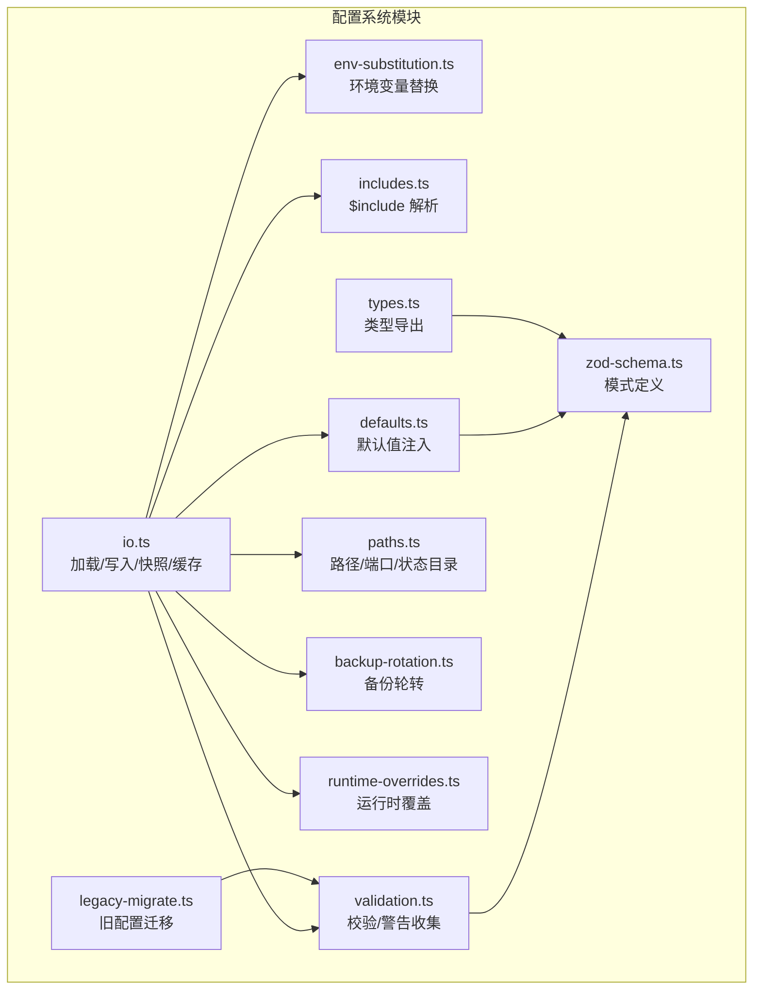
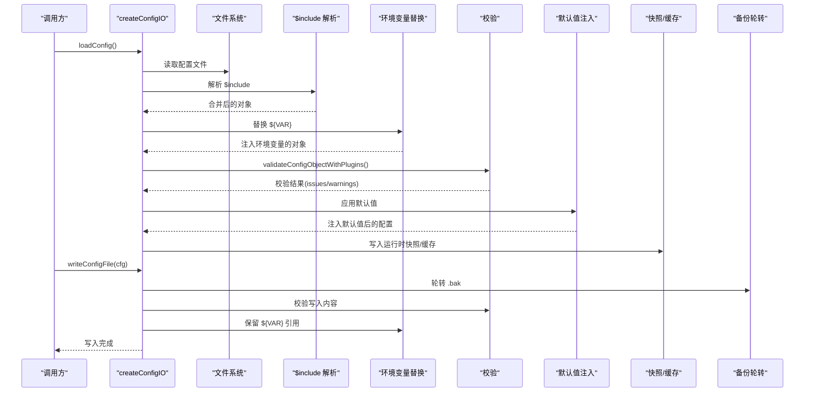
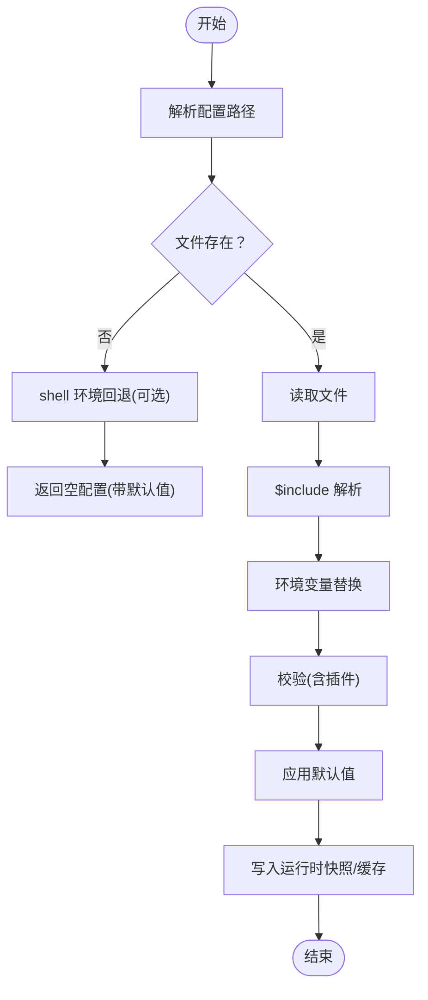
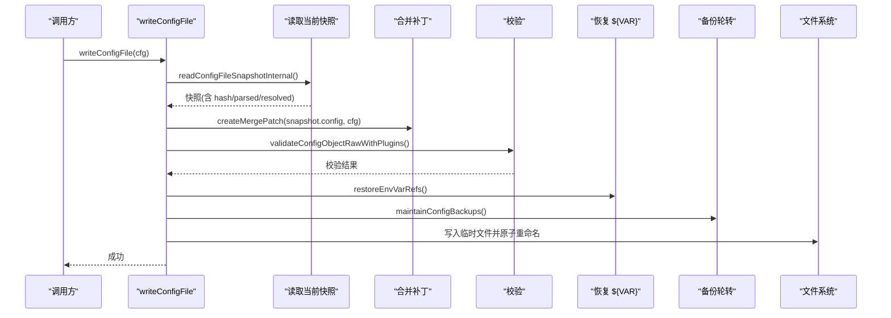
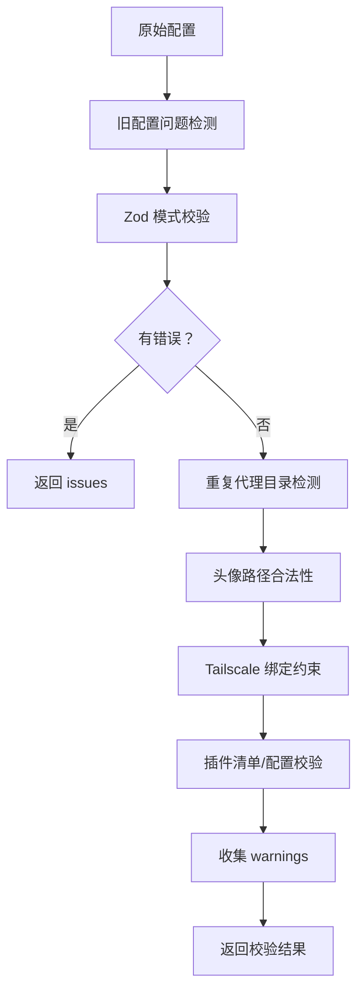
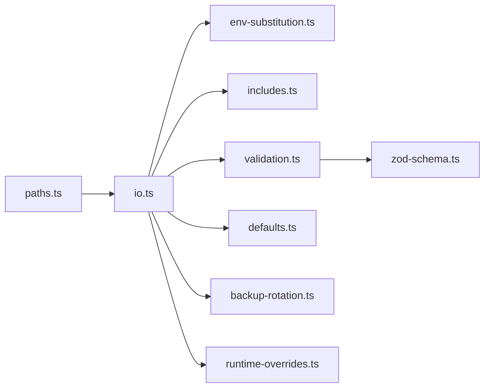

# 配置管理

<cite>
**本文引用的文件**
- [src/config/io.ts](file://src/config/io.ts)
- [src/config/validation.ts](file://src/config/validation.ts)
- [src/config/zod-schema.ts](file://src/config/zod-schema.ts)
- [src/config/paths.ts](file://src/config/paths.ts)
- [src/config/env-substitution.ts](file://src/config/env-substitution.ts)
- [src/config/includes.ts](file://src/config/includes.ts)
- [src/config/backup-rotation.ts](file://src/config/backup-rotation.ts)
- [src/config/defaults.ts](file://src/config/defaults.ts)
- [src/config/runtime-overrides.ts](file://src/config/runtime-overrides.ts)
- [src/config/legacy-migrate.ts](file://src/config/legacy-migrate.ts)
- [src/config/types.ts](file://src/config/types.ts)
</cite>

## 目录

1. [简介](#简介)
2. [项目结构](#项目结构)
3. [核心组件](#核心组件)
4. [架构总览](#架构总览)
5. [详细组件分析](#详细组件分析)
6. [依赖关系分析](#依赖关系分析)
7. [性能考量](#性能考量)
8. [故障排查指南](#故障排查指南)
9. [结论](#结论)
10. [附录](#附录)

## 简介

本文件为 OpenClaw 网关配置管理系统的深度技术文档，覆盖配置加载机制、动态配置更新、启动参数处理、配置文件格式、环境变量解析、配置验证与回滚机制，并提供热重载、配置迁移与故障诊断方法，以及配置模板、最佳实践与运维指南。

## 项目结构

OpenClaw 的配置系统位于 src/config 目录，采用模块化设计，职责清晰：

- 加载与写入：io.ts 提供读取、快照、写入、缓存与运行时快照管理
- 校验与默认值：validation.ts 与 defaults.ts 负责校验与默认值注入
- 模式定义：zod-schema.ts 定义完整的配置模式
- 路径与环境：paths.ts、env-substitution.ts、includes.ts 处理路径解析、环境变量替换与 include 指令
- 回滚与备份：backup-rotation.ts 实现配置写入前的备份轮转
- 运行时覆盖：runtime-overrides.ts 支持运行时临时覆盖
- 兼容迁移：legacy-migrate.ts 提供旧配置迁移

图表来源

- [src/config/io.ts:699-1528](file://src/config/io.ts#L699-L1528)
- [src/config/validation.ts:1-605](file://src/config/validation.ts#L1-L605)
- [src/config/zod-schema.ts:1-911](file://src/config/zod-schema.ts#L1-L911)
- [src/config/defaults.ts:1-537](file://src/config/defaults.ts#L1-L537)
- [src/config/paths.ts:1-285](file://src/config/paths.ts#L1-L285)
- [src/config/env-substitution.ts:1-204](file://src/config/env-substitution.ts#L1-L204)
- [src/config/includes.ts:1-347](file://src/config/includes.ts#L1-L347)
- [src/config/backup-rotation.ts:1-126](file://src/config/backup-rotation.ts#L1-L126)
- [src/config/runtime-overrides.ts:1-92](file://src/config/runtime-overrides.ts#L1-L92)
- [src/config/legacy-migrate.ts:1-20](file://src/config/legacy-migrate.ts#L1-L20)
- [src/config/types.ts:1-36](file://src/config/types.ts#L1-L36)

章节来源

- [src/config/io.ts:699-1528](file://src/config/io.ts#L699-L1528)
- [src/config/types.ts:1-36](file://src/config/types.ts#L1-L36)

## 核心组件

- 配置加载器（createConfigIO/loadConfig）
  - 支持 .json/.json5 文件，自动解析 $include、环境变量替换、校验与默认值注入
  - 支持 dotenv 自动加载与 shell 环境回退
  - 提供配置快照与缓存，支持运行时快照投影
- 配置写入器（writeConfigFile）
  - 基于合并补丁生成最小变更，保留环境变量引用，写入前备份轮转
  - 写后可触发运行时快照刷新，失败则抛出 ConfigRuntimeRefreshError 并清理
- 验证器（validateConfigObjectWithPlugins）
  - 使用 Zod 模式校验，收集问题与警告；支持插件清单与插件配置校验
- 默认值注入（apply\*Defaults）
  - 消息、会话、代理、模型、日志等多维度默认值
- 路径与环境（paths.ts/env-substitution.ts/includes.ts）
  - 统一状态目录、配置文件路径解析；安全 include；环境变量替换
- 备份轮转（backup-rotation.ts）
  - 写入前轮转 .bak，硬编码权限，清理孤儿备份
- 运行时覆盖（runtime-overrides.ts）
  - 通过路径设置/取消设置临时覆盖，最终合并到运行时配置
- 兼容迁移（legacy-migrate.ts）
  - 对旧配置应用迁移并再次校验

章节来源

- [src/config/io.ts:699-1528](file://src/config/io.ts#L699-L1528)
- [src/config/validation.ts:229-605](file://src/config/validation.ts#L229-L605)
- [src/config/defaults.ts:1-537](file://src/config/defaults.ts#L1-L537)
- [src/config/paths.ts:118-285](file://src/config/paths.ts#L118-L285)
- [src/config/env-substitution.ts:1-204](file://src/config/env-substitution.ts#L1-L204)
- [src/config/includes.ts:1-347](file://src/config/includes.ts#L1-L347)
- [src/config/backup-rotation.ts:1-126](file://src/config/backup-rotation.ts#L1-L126)
- [src/config/runtime-overrides.ts:1-92](file://src/config/runtime-overrides.ts#L1-L92)
- [src/config/legacy-migrate.ts:1-20](file://src/config/legacy-migrate.ts#L1-L20)

## 架构总览

下图展示从“读取配置”到“写入配置”的关键流程，包括 include 解析、环境变量替换、校验、默认值注入、快照与备份轮转。

图表来源

- [src/config/io.ts:708-857](file://src/config/io.ts#L708-L857)
- [src/config/includes.ts:340-347](file://src/config/includes.ts#L340-L347)
- [src/config/env-substitution.ts:197-204](file://src/config/env-substitution.ts#L197-L204)
- [src/config/validation.ts:308-605](file://src/config/validation.ts#L308-L605)
- [src/config/backup-rotation.ts:115-126](file://src/config/backup-rotation.ts#L115-L126)

## 详细组件分析

### 配置加载与快照（io.ts）

- 路径解析优先级：显式 OPENCLAW_CONFIG_PATH > 状态目录下的 openclaw.json 及历史文件名 > 新默认位置
- $include 解析：支持单文件或数组合并，限制最大深度与文件大小，防止路径逃逸与符号链接绕过
- 环境变量替换：支持 ${VAR} 语法，缺失时可降级为警告而非致命错误
- 校验与默认值：先原始校验，再应用默认值；对插件进行额外校验与警告收集
- 运行时快照：支持设置/清除运行时快照，提供“将编辑后的配置投影回源快照”的能力
- 缓存策略：可按毫秒级缓存配置，避免频繁磁盘访问
- Shell 环境回退：在未找到配置时，可从 shell 环境回退注入部分 API Key

图表来源

- [src/config/io.ts:708-857](file://src/config/io.ts#L708-L857)
- [src/config/includes.ts:340-347](file://src/config/includes.ts#L340-L347)
- [src/config/env-substitution.ts:197-204](file://src/config/env-substitution.ts#L197-L204)
- [src/config/validation.ts:308-605](file://src/config/validation.ts#L308-L605)
- [src/config/defaults.ts:1-537](file://src/config/defaults.ts#L1-L537)

章节来源

- [src/config/io.ts:699-1528](file://src/config/io.ts#L699-L1528)
- [src/config/paths.ts:118-194](file://src/config/paths.ts#L118-L194)

### 配置写入与回滚（io.ts + backup-rotation.ts）

- 写入前准备：计算合并补丁，恢复 ${VAR} 引用，按需 unset 指定路径
- 写入策略：先写临时文件，再原子重命名；Windows 下回退为复制+chmod+删除
- 备份轮转：写入前轮转 .bak，维护固定数量的备份，硬编码权限，清理孤儿备份
- 运行时刷新：写入成功后尝试刷新运行时快照；失败抛出 ConfigRuntimeRefreshError 并清理

图表来源

- [src/config/io.ts:1060-1301](file://src/config/io.ts#L1060-L1301)
- [src/config/backup-rotation.ts:115-126](file://src/config/backup-rotation.ts#L115-L126)

章节来源

- [src/config/io.ts:1060-1301](file://src/config/io.ts#L1060-L1301)
- [src/config/backup-rotation.ts:1-126](file://src/config/backup-rotation.ts#L1-L126)

### 配置验证与模式（validation.ts + zod-schema.ts）

- Zod 模式：定义完整配置结构，涵盖 gateway、models、agents、plugins、channels 等
- 校验流程：
  - 旧配置问题检测（迁移提示）
  - Zod 校验，收集 issues/warnings
  - 重复代理工作空间检测
  - 头像路径合法性检查
  - Tailscale 与绑定模式一致性检查
  - 插件清单加载与插件配置 schema 校验
- 警告收集：对未知通道、心跳目标、缺失插件等发出警告

图表来源

- [src/config/validation.ts:229-605](file://src/config/validation.ts#L229-L605)
- [src/config/zod-schema.ts:206-911](file://src/config/zod-schema.ts#L206-L911)

章节来源

- [src/config/validation.ts:1-605](file://src/config/validation.ts#L1-L605)
- [src/config/zod-schema.ts:1-911](file://src/config/zod-schema.ts#L1-L911)

### 环境变量解析与安全（env-substitution.ts）

- 语法：${VAR} 替换，仅匹配大写变量名；$$${} 可输出字面量
- 行为：缺失时可回调 onMissing 收集警告而不中断；否则抛出 MissingEnvVarError
- 适用范围：字符串、数组、对象递归替换

章节来源

- [src/config/env-substitution.ts:1-204](file://src/config/env-substitution.ts#L1-L204)

### 包含指令与安全（includes.ts）

- 语法：$include 可为字符串或字符串数组，支持与其它键共存并合并
- 安全：限制最大深度与文件大小；禁止路径逃逸与符号链接绕过；必要时使用边界读取
- 错误：循环包含、超深、越界、解析失败等均抛出明确异常

章节来源

- [src/config/includes.ts:1-347](file://src/config/includes.ts#L1-L347)

### 默认值注入（defaults.ts）

- 消息：默认 ackReactionScope
- 会话：mainKey 归一化为主会话
- 代理：并发数默认值、上下文修剪与心跳默认策略
- 模型：默认成本、输入类型、上下文窗口、最大输出令牌、别名映射
- 日志：敏感信息脱敏策略默认开启
- Talk：默认提供者与 API Key 注入

章节来源

- [src/config/defaults.ts:1-537](file://src/config/defaults.ts#L1-L537)

### 路径与端口解析（paths.ts）

- 状态目录：支持 OPENCLAW_STATE_DIR 或历史目录迁移
- 配置文件：OPENCLAW_CONFIG_PATH 显式指定；否则在状态目录内查找
- 端口解析：OPENCLAW_GATEWAY_PORT > 配置 > 默认端口
- OAuth 目录：OPENCLAW_OAUTH_DIR > 状态目录/credentials

章节来源

- [src/config/paths.ts:1-285](file://src/config/paths.ts#L1-L285)

### 运行时覆盖（runtime-overrides.ts）

- 能力：通过路径设置/取消设置临时覆盖，最终与运行时配置合并
- 安全：过滤 undefined 与受保护键，避免污染

章节来源

- [src/config/runtime-overrides.ts:1-92](file://src/config/runtime-overrides.ts#L1-L92)

### 旧配置迁移（legacy-migrate.ts）

- 流程：应用迁移 → 再次校验 → 返回迁移后的配置与变更记录
- 场景：当迁移后仍存在校验问题，提示手动修复

章节来源

- [src/config/legacy-migrate.ts:1-20](file://src/config/legacy-migrate.ts#L1-L20)

## 依赖关系分析

- 模块耦合
  - io.ts 依赖 env-substitution.ts、includes.ts、validation.ts、defaults.ts、backup-rotation.ts、runtime-overrides.ts
  - validation.ts 依赖 zod-schema.ts、plugins 配置状态与清单
  - paths.ts 为全局路径与端口提供统一入口
- 关键依赖链
  - 加载：paths → includes → env → validation → defaults → runtime snapshot
  - 写入：validation → backup-rotation → fs 原子写入 → runtime refresh

图表来源

- [src/config/io.ts:699-1528](file://src/config/io.ts#L699-L1528)
- [src/config/validation.ts:1-605](file://src/config/validation.ts#L1-L605)
- [src/config/zod-schema.ts:1-911](file://src/config/zod-schema.ts#L1-L911)
- [src/config/paths.ts:1-285](file://src/config/paths.ts#L1-L285)

章节来源

- [src/config/io.ts:699-1528](file://src/config/io.ts#L699-L1528)
- [src/config/validation.ts:1-605](file://src/config/validation.ts#L1-L605)

## 性能考量

- 配置缓存：可通过 OPENCLAW_CONFIG_CACHE_MS 控制缓存时间，减少磁盘访问
- 写入优化：合并补丁最小化变更，原子重命名避免部分写入
- 备份轮转：批量操作，尽量减少多次系统调用
- 环境变量替换：仅在必要时进行，避免对非字符串字段的无谓遍历

## 故障排查指南

- 配置无效（INVALID_CONFIG）
  - 现象：启动时报错，拒绝使用不合法配置
  - 排查：查看控制台输出的详细路径与消息，定位具体字段
  - 处理：根据提示修正或移除非法字段
- 环境变量缺失
  - 现象：出现 MissingEnvVarError 或警告
  - 排查：确认环境变量是否设置，或使用 onMissing 收集警告
  - 处理：设置对应变量或改为使用配置中的密钥
- include 安全错误
  - 现象：路径逃逸、符号链接绕过、循环包含、超深/过大
  - 排查：检查 $include 路径与文件大小
  - 处理：修正路径、拆分文件、降低层级
- 写入失败
  - 现象：权限不足、Windows 原子重命名失败
  - 排查：检查文件权限与平台差异
  - 处理：修正权限或等待回退复制流程
- 运行时刷新失败
  - 现象：写入成功但运行时快照刷新失败
  - 排查：查看 ConfigRuntimeRefreshError 的原因
  - 处理：修复导致刷新失败的问题后重试

章节来源

- [src/config/io.ts:1006-1041](file://src/config/io.ts#L1006-L1041)
- [src/config/env-substitution.ts:29-37](file://src/config/env-substitution.ts#L29-L37)
- [src/config/includes.ts:47-63](file://src/config/includes.ts#L47-L63)
- [src/config/backup-rotation.ts:115-126](file://src/config/backup-rotation.ts#L115-L126)
- [src/config/io.ts:1502-1514](file://src/config/io.ts#L1502-L1514)

## 结论

OpenClaw 的配置系统以安全、可维护与可观测为核心目标：通过严格的 include 安全策略、环境变量替换、Zod 模式校验与默认值注入，确保配置在加载阶段即具备强健性；通过快照与缓存提升性能，通过备份轮转与原子写入保障可靠性；通过运行时覆盖与刷新实现动态配置更新。整体设计兼顾易用性与安全性，适合生产环境长期稳定运行。

## 附录

### 配置文件格式与示例要点

- 文件格式：JSON5（支持注释、尾随逗号等）
- include：使用 $include 指令引入外部片段，支持数组合并
- 环境变量：使用 ${VAR} 注入，注意仅大写变量名生效
- 示例要点（不展示代码）：
  - 在根层声明 gateway、models、agents、plugins、channels 等
  - 使用 $include 引入基础配置与特定环境配置
  - 在 env.vars 中声明非敏感环境变量，在敏感字段使用密钥引用

章节来源

- [src/config/includes.ts:1-11](file://src/config/includes.ts#L1-L11)
- [src/config/env-substitution.ts:1-21](file://src/config/env-substitution.ts#L1-L21)

### 环境变量与启动参数

- OPENCLAW_CONFIG_PATH：显式指定配置文件路径
- OPENCLAW_STATE_DIR：显式指定状态目录
- OPENCLAW_GATEWAY_PORT：显式指定网关端口
- OPENCLAW_OAUTH_DIR：显式指定 OAuth 凭据目录
- OPENCLAW_CONFIG_CACHE_MS：配置缓存毫秒数（0 表示禁用）
- OPENCLAW_DISABLE_CONFIG_CACHE：禁用配置缓存
- OPENCLAW_WATCH_MODE / OPENCLAW_WATCH_SESSION / OPENCLAW_WATCH_COMMAND：写入审计日志相关
- OPENCLAW_TEST_FAST / OPENCLAW_TEST_CONFIG_OVERWRITE_LOG / OPENCLAW_TEST_CONFIG_WRITE_ANOMALY_LOG：测试场景开关

章节来源

- [src/config/paths.ts:60-194](file://src/config/paths.ts#L60-L194)
- [src/config/io.ts:1328-1348](file://src/config/io.ts#L1328-L1348)

### 配置热重载与动态更新

- 运行时快照：通过 setRuntimeConfigSnapshot/projectConfigOntoRuntimeSourceSnapshot 将编辑后的配置投影回源快照
- 刷新处理器：setRuntimeConfigSnapshotRefreshHandler 注册刷新逻辑；写入后尝试刷新，失败抛出错误
- 读取策略：writeConfigFile 会根据当前是否存在运行时快照决定是否将变更投影回源快照

章节来源

- [src/config/io.ts:1429-1527](file://src/config/io.ts#L1429-L1527)

### 配置迁移与回滚

- 迁移：migrateLegacyConfig 对旧配置应用迁移并再次校验
- 回滚：写入前轮转 .bak，最多保留固定数量备份；孤儿备份清理
- 权限加固：所有 .bak 文件权限硬编码为 0o600

章节来源

- [src/config/legacy-migrate.ts:1-20](file://src/config/legacy-migrate.ts#L1-L20)
- [src/config/backup-rotation.ts:16-126](file://src/config/backup-rotation.ts#L16-L126)

### 最佳实践与运维建议

- 分层配置：使用 $include 将通用配置与环境配置分离
- 密钥管理：优先使用插件/模型提供的密钥字段，避免直接在配置中硬编码
- 安全：严格控制状态目录与配置文件权限，避免容器内权限问题
- 备份：依赖自动备份轮转，定期检查 .bak 文件完整性
- 性能：在高频率读取场景启用配置缓存，合理设置缓存时间
- 动态更新：通过运行时快照与刷新处理器实现平滑热重载，避免服务中断
